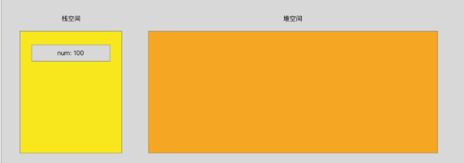
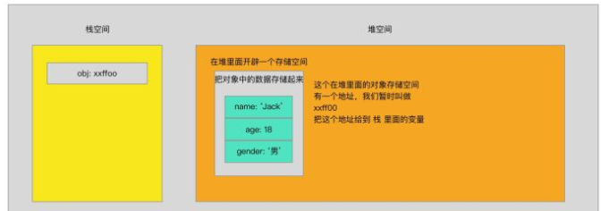

<!-- ---
title: 
date: 2020-05-29
--- -->
# JavaScript学习笔记（七）-- 数组

## 数组

- 什么是数组？
- 字面理解就是 **数字的组合**

- 其实不太准确，准确的来说数组是一个 **数据的集合**
- 也就是我们把一些数据放在一个盒子里面，按照顺序排好
  `[1, 2, 3, 'hello', true, false]`

- 这个东西就是一个数组，存储着一些数据的集合

## 数据类型分类

- `number` / `string` / `boolean` / `undefined` / `null` / `object` / `function` / `array` / ...
- 数组也是数据类型中的一种

- 我们简单的把所有数据类型分为两个大类 **基本数据类型** 和 **复杂数据类型**
- 基本数据类型： `number` / `string` / `boolean` / `undefined` / `null`

- 复杂数据类型： `object` / `function` / `array` / ...

## 创建一个数组

- 数组就是一个 `[]`
- 在 `[]` 里面存储着各种各样的数据，按照顺序依次排好

### 字面量创建一个数组

- 直接使用 `[]` 的方式创建一个数组

```js
// 创建一个空数组
var arr1 = []
// 创建一个有内容的数组
var arr2 = [1, 2, 3]
```

### 内置构造函数创建数组

- 使用 js 的内置构造函数 `Array` 创建一个数组

```js
// 创建一个空数组
var arr1 = new Array()
// 创建一个长度为 10 的数组
var arr2 = new Array(10)
// 创建一个有内容的数组
var arr3 = new Array(1, 2, 3)
```

### 数组的 length

- length: 长度的意思
- length 就是表示数组的长度，数组里面有多少个成员，length 就是多少

```js
// 创建一个数组
var arr = [1, 2, 3]
console.log(arr.length) // 3
```

### 数组的索引

- 索引，也叫做下标，是指一个数据在数组里面排在第几个的位置
- 注意： **在所有的语言里面，索引都是从 0 开始的**

- 在 js 里面也一样，数组的索引从 0 开始

```js
// 创建一个数组
var arr = ['hello', 'world']
```

- 上面这个数组中，**第 0 个** 数据就是字符串 `hello`，**第 1 个** 数据就是字符串 `world`
- 想获取数组中的第几个就使用 `数组[索引]` 来获取

```js
var arr = ['hello', 'world']
console.log(arr[0]) // hello
console.log(arr[1]) // world
```

## 数据类型之间存储的区别（重点）

- 既然我们区分了基本数据类型和复杂数据类型
- 那么他们之间就一定会存在一些区别

- 他们最大的区别就是在存储上的区别
- 我们的存储空间分成两种 **栈** 和 **堆**

- 栈： 主要存储基本数据类型的内容
- 堆： 主要存储复杂数据类型的内容

### 基本数据类型在内存中的存储情况

- `var num = 100`，在内存中的存储情况



- 直接在 **栈空间** 内有存储一个数据

### 复杂数据类型在内存中的存储情况

- 下面这个 对象 的存储

```js
var obj = {
  name: 'Jack',
  age: 18,
  gender: '男'
}
```



- 复杂数据类型的存储

1. 在堆里面开辟一个存储空间
2. 把数据存储到存储空间内

1. 把存储空间的地址赋值给栈里面的变量

- 这就是数据类型之间存储的区别

### 数据类型之间的比较

- 基本数据类型是 **值** 之间的比较

```js
var num = 1
var str = '1'
console.log(num == str) // true
```

- 复杂数据类型是 **地址** 之间的比较

```js
var obj = { name: 'Jack' }
var obj2 = { name: 'Jack' }
console.log(obj == obj2) // false
```

- 因为我们创建了两个对象，那么就会在 堆空间 里面开辟两个存储空间存储数据（两个地址）
- 虽然存储的内容是一样的，那么也是两个存储空间，两个地址

- 复杂数据类型之间就是地址的比较，所以 `obj` 和 `obj2` 两个变量的地址不一样
- 所以我们得到的就是 `false`

## 数组的常用方法

- 数组是一个复杂数据类型，我们在操作它的时候就不能再想基本数据类型一样操作了
- 比如我们想改变一个数组

```js
// 创建一个数组
var arr = [1, 2, 3]
// 我们想把数组变成只有 1 和 2
arr = [1, 2]
```

- 这样肯定是不合理，因为这样不是在改变之前的数组
- 相当于心弄了一个数组给到 arr 这个变量了

- 相当于把 arr 里面存储的地址给换了，也就是把存储空间换掉了，而不是在之前的空间里面修改
- 所以我们就需要借助一些方法，在不改变存储空间的情况下，把存储空间里面的数据改变了


### 数组常用方法之 push

- `push` 是用来在数组的末尾追加一个元素

```js
var arr = [1, 2, 3]
// 使用 push 方法追加一个元素在末尾
arr.push(4)
console.log(arr) // [1, 2, 3, 4]
```

### 数组常用方法之 pop

- `pop` 是用来删除数组末尾的一个元素

```js
var arr = [1, 2, 3]
// 使用 pop 方法删除末尾的一个元素
arr.pop()
console.log(arr) // [1, 2]
```

### 数组常用方法之 unshift

- `unshift` 是在数组的最前面添加一个元素

```js
var arr = [1, 2, 3]
// 使用 unshift 方法想数组的最前面添加一个元素
arr.unshift(4)
console.log(arr) // [4, 1, 2, 3]
```

### 数组常用方法之 shift

- `shift` 是删除数组最前面的一个元素

```js
var arr = [1, 2, 3]
// 使用 shift 方法删除数组最前面的一个元素
arr.shift()
console.log(arr) // [2, 3]
```

### 数组常用方法之 splice

- `splice` 是截取数组中的某些内容，按照数组的索引来截取
- 语法： `splice(从哪一个索引位置开始，截取多少个，替换的新元素)` （第三个参数可以不写）

```js
var arr = [1, 2, 3, 4, 5]
// 使用 splice 方法截取数组
arr.splice(1, 2)
console.log(arr) // [1, 4, 5]
```

- `arr.splice(1, 2)` 表示从索引 1 开始截取 2 个内容
- 第三个参数没有写，就是没有新内容替换掉截取位置

```js
var arr = [1, 2, 3, 4, 5]
// 使用 splice 方法截取数组
arr.splice(1, 2, '我是新内容')
console.log(arr) // [1, '我是新内容', 4, 5]
```

- `arr.splice(1, 2, '我是新内容')` 表示从索引 1 开始截取 2 个内容
- 然后用第三个参数把截取完空出来的位置填充


### 数组常用方法之 reverse

- `reverse` 是用来反转数组使用的

```js
var arr = [1, 2, 3]
// 使用 reverse 方法来反转数组
arr.reverse()
console.log(arr) // [3, 2, 1]
```

### 数组常用方法之 sort

- `sort` 是用来给数组排序的

```js
var arr = [2, 3, 1]
// 使用 sort 方法给数组排序
arr.sort()
console.log(arr) // [1, 2, 3]
```

- 这个只是一个基本的简单用法


### 数组常用方法之 concat

- `concat` 是把多个数组进行拼接
- 和之前的方法有一些不一样的地方，就是 `concat` 不会改变原始数组，而是返回一个新的数组

```js
var arr = [1, 2, 3]
// 使用 concat 方法拼接数组
var newArr = arr.concat([4, 5, 6])
console.log(arr) // [1, 2, 3]
console.log(newArr) // [1, 2, 3, 4, 5, 6]
```

- 注意： **concat 方法不会改变原始数组**


### 数组常用方法之 join

- `join` 是把数组里面的每一项内容链接起来，变成一个字符串
- 可以自己定义每一项之间链接的内容 `join(要以什么内容链接)`

- 不会改变原始数组，而是把链接好的字符串返回

```js
var arr = [1, 2, 3]
// 使用 join 链接数组
var str = arr.join('-')
console.log(arr) // [1, 2, 3]
console.log(str) // 1-2-3
```

- 注意： **join 方法不会改变原始数组，而是返回链接好的字符串**


## for 和 for in 循环

- 因为数组的索引就可以获取数组中的内容
- 数组的索引又是按照 0 ～ n 顺序排列

- 我们就可以使用 for 循环来循环数组，因为 for 循环我们也可以设置成 0 ～ n 顺序增加
- 我们把这个行为叫做 **遍历**

```js
var arr = [1, 2, 3, 4, 5]
// 使用 for 循环遍历数组
for (var i = 0; i < arr.length; i++) {
  console.log(arr[i])
}
// 会在控制台依次打印出 1， 2， 3， 4， 5
```

- `i < arr.length` 因为 length 就是数组的长度，就是一个数字，所以我们可以直接用它来决定循环次数
- `console.log(arr[i])` 因为随着循环，i 的值会从 0 开始依次增加

- 所以我们实际上就相当于在打印 `arr[0]` / `arr[1]` / ...


- 因为 **对象** 是没有索引的，所以我们没有办法使用 for 循环来遍历
- 这里我们使用 for in 循环来遍历对象

- 先来看一段代码

```js
var obj = {
  name: 'Jack',
  age: 18
}
for (var key in obj) {
  console.log(key)
}
// 会在控制台打印两次内容，分别是 name 和 age
```

- for in 循环的遍历是按照对象中有多少成员来决定了
- 有多少成员，就会执行多少次

- `key` 是我们自己定义的一个变量，就和 for 循环的时候我们定义的 i 一个道理
- 在每次循环的过程中，key 就代表着对象中某一个成员的 **属性名**

## 函数参数传递基本数据类型和复杂数据类型的区别

- 之前我们知道了，基本数据类型和复杂数据类型在存储上是有区别的
- 那么他们在赋值之间也是有区别的

- 基本数据类型之间的赋值

```js
var num = 100
var num2 = num
num2 = 200
console.log(num) // 100
console.log(num2) // 200
```

- 相当于是把 num 的值复制了一份一摸一样的给了 num2 变量
- 赋值以后两个在没有关系


- 复杂数据类型之间的赋值

```js
var obj = {
  name: 'Jack'
}
var obj2 = obj
obj2.name = 'Rose'
console.log(obj.name) // Rose
console.log(obj2.name) // Rose
```

- 因为复杂数据类型，变量存储的是地址，真实内容在 堆空间 内存储
- 所以赋值的时候相当于把 obj 存储的那个地址复制了一份给到了 obj2 变量

- 现在 obj 和 obj2 两个变量存储的地址一样，指向一个内存空间
- 所以使用 obj2 这个变量修改空间内的内容，obj 指向的空间也会跟着改变了


### 函数的参数

- 函数的参数也是赋值的之中，在函数调用的时候，实参给行参赋值
- 和之前变量赋值的规则是一样的

- 函数传递基本数据类型

```js
function fn(n) {
  n = 200
  console.log(n) // 200
}
var num = 100
fn(num)
console.log(num) // 100
```

- 和之前变量赋值的时候一样，在把 num 的值复制了一份一摸一样的给到了函数内部的行参 n
- 两个之间在没有任何关系了


- 函数传递复杂数据类型

```js
function fn(o) {
  o.name = 'Rose'
  console.log(o.name) // Rose
}
var obj = {
  name: 'Jack'
}
fn(obj)
console.log(obj.name) // Rose
```

- 和之前变量赋值的时候一样，把 obj 内存储的地址复制了一份一摸一样的给到函数内部的行参 o
- 函数外部的 obj 和函数内部的行参 o，存储的是一个地址，指向的是一个存储空间

- 所以两个变量操作的是一个存储空间
- 在函数内部改变了空间内的数据

- obj 看到的也是改变以后的内容