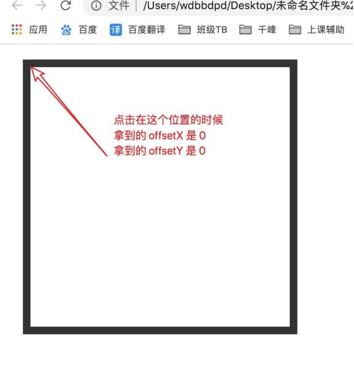
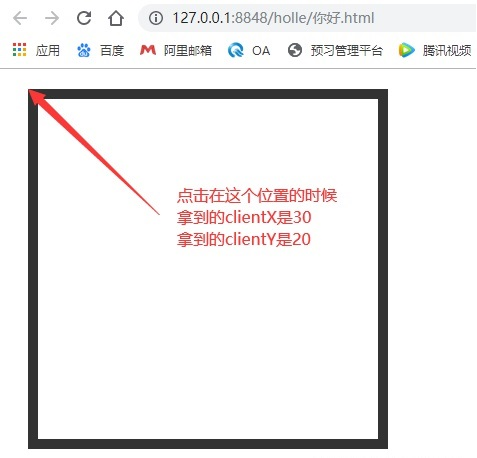
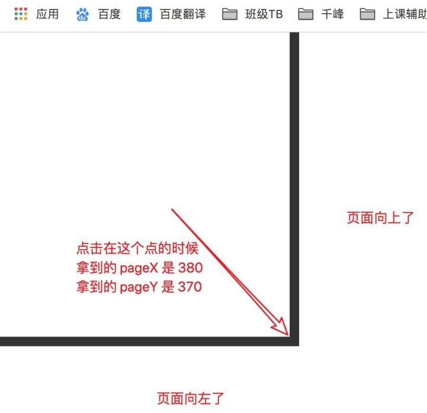

<!--  -->
# JavaScript学习笔记（十五）-- Event事件（上）

## **EVENT（上）**

- 之前我们简单的了解过一些事件，比如 `onclick` / `onload` / `onscroll` / ...
- 今天开始，我们详细的学习一些 **事件**

## **什么是事件**

- 一个事件由什么东西组成

- 触发谁的事件：事件源
- 触发什么事件：事件类型

- 触发以后做什么：事件处理函数

```js
var oDiv = document.querySelector('div')
oDiv.onclick = function () {}
// 谁来触发事件 => oDiv => 这个事件的事件源就是 oDiv
// 触发什么事件 => onclick => 这个事件类型就是 click
// 触发之后做什么 => function () {} => 这个事件的处理函数
```

- 我们想要在点击 div 以后做什么事情，就把我们要做的事情写在事件处理函数里面

```js
var oDiv = document.querySelector('div')
oDiv.onclick = function () {
 console.log('你点击了 div')
}
```

- 当我们点击 div 的时候，就会执行事件处理函数内部的代码
- 每点击一次，就会执行一次事件处理函数

## **事件对象**

- 什么是事件对象？
- 就是当你触发了一个事件以后，对该事件的一些描述信息

- 例如：

- 你触发一个点击事件的时候，你点在哪个位置了，坐标是多少
- 你触发一个键盘事件的时候，你按的是哪个按钮

- ...

- 每一个事件都会有一个对应的对象来描述这些信息，我们就把这个对象叫做 **事件对象**
- 浏览器给了我们一个 **黑盒子**，叫做 `window.event`，就是对事件信息的所有描述

- 比如点击事件
- 你点在了 `0，0` 位置，那么你得到的这个事件对象里面对应的就会有这个点位的属性

- 你点在了 `10, 10` 位置，那么你得到的这个事件对象里面对应的就会有这个点位的属性
- ...

```js
oDiv.onclick = function () {
 console.log(window.event.X轴坐标点信息)
 console.log(window.event.Y轴坐标点信息)
}
```

- 这个玩意很好用，但是一般来说，好用的东西就会有 **兼容性问题**
- 在 `IE低版本` 里面这个东西好用，但是在 `高版本IE` 和 `Chrome` 里面不好使了

- 我们就得用另一种方式来获取 **事件对象**
- 在每一个事件处理函数的行参位置，默认第一个就是 **事件对象**

```js
oDiv.onclick = function (e) {
 // e 就是和 IE 的 window.event 一样的东西
 console.log(e.X轴坐标点信息)
 console.log(e.Y轴坐标点信息)
}
```

- 综上所述，我们以后在每一个事件里面，想获取事件对象的时候，都用兼容写法

```js
oDiv.onclick = function (e) {
 e = e || window.event
 console.log(e.X轴坐标点信息)
 console.log(e.Y轴坐标点信息)
}
```

## **点击事件的光标坐标点获取**

- 刚才即然说了，可以获取到坐标点，那么接下来我们就学习一下怎么获取坐标点
- 我们的每一个点击事件的坐标点都不是一对，因为要有一个相对的坐标系

- 例如：

- 相对事件源（你点击的元素）
- 相对页面

- 相对浏览器窗口
- ...

- 因为都不一样，所以我们获取的 **事件对象** 里面的属性也不一样

### **相对于你点击的元素来说**

- `offsetX` 和 `offsetY`
- 是相对于你点击的元素的边框内侧开始计算

```html
<style>
  * {
    margin: 0;
    padding: 0;
  }
  div {
    width: 300px;
    height: 300px;
    padding: 20px;
    border: 10px solid #333;
    margin: 20px 0 0 30px;
  }
</style>
<body>
  <div></div>
  <script>
    var oDiv = document.querySelector('div')
    // 注册点击事件
    oDiv.onclick = function (e) {
      // 事件对象兼容写法
      e = e || window.event
      console.log(e.offsetX)
      console.log(e.offsetY)
    }
  </script>
</body>
```



### **相对于浏览器窗口你点击的坐标点**

- `clientX` 和 `clientY`
- 是相对于浏览器窗口来计算的，不管你页面滚动到什么情况，都是根据窗口来计算坐标

```html
<style>
  * {
    margin: 0;
    padding: 0;
  }
  body {
    width: 2000px;
    height: 2000px;
  }
  div {
    width: 300px;
    height: 300px;
    padding: 20px;
    border: 10px solid #333;
    margin: 20px 0 0 30px;
  }
</style>
<body>
  <div></div>
  <script>
    var oDiv = document.querySelector('div')
    // 注册点击事件
    oDiv.onclick = function (e) {
      // 事件对象兼容写法
      e = e || window.event
      console.log(e.clientX)
      console.log(e.clientY)
    }
  </script>
</body>
```



### **相对于页面你点击的坐标点**

- `pageX` 和 `pageY`
- 是相对于整个页面的坐标点，不管有没有滚动，都是相对于页面拿到的坐标点

```html
<style>
  * {
    margin: 0;
    padding: 0;
  }
  body {
    width: 2000px;
    height: 2000px;
  }
  div {
    width: 300px;
    height: 300px;
    padding: 20px;
    border: 10px solid #333;
    margin: 20px 0 0 30px;
  }
</style>
<body>
  <div></div>
  <script>
    var oDiv = document.querySelector('div')
    // 注册点击事件
    oDiv.onclick = function (e) {
      // 事件对象兼容写法
      e = e || window.event
      console.log(e.pageX)
      console.log(e.pageY)
    }
  </script>
</body>
```



- 根据页面左上角来说

- margin-left 是 30
- 左边框是 10

- 左右 padding 各是 20
- 内容区域是 300

- **pageX : 300 + 20 + 20 + 10 + 30 = 380**
- margin-top 是 20

- 上边框是 10
- 上下 padding 各是 20

- 内容区域是 300
- **pageY : 300 + 20 + 20 + 10 + 20 = 270**

## **点击按键信息（了解）**

- 我们的鼠标一般都有两个按键，一个左键一个右键
- 我们的事件对象里面也有这个信息，确定你点击的是左键还是右键

- 我们使用 `事件对象.button` 来获取信息
- `0` 为鼠标左键，`2` 为鼠标右键

## **常见的事件（了解）**

- 我们在写页面的时候经常用到的一些事件
- 大致分为几类，**浏览器事件** / **鼠标事件** / **键盘事件** / **表单事件** / **触摸事件**

- 不需要都记住，但是大概要知道

### **浏览器事件**

- `load` ： 页面全部资源加载完毕
- `scroll` ： 浏览器滚动的时候触发

- `resize` ： 浏览器滚动的时候触发
- ...

### **鼠标事件**

- `click` ：点击事件
- `dblclick` ：双击事件

- `contextmenu` ： 右键单击事件
- `mousedown` ：鼠标左键按下事件

- `mouseup` ：鼠标左键抬起事件
- `mousemove` ：鼠标移动

- `mouseover` ：鼠标移入事件
- `mouseout` ：鼠标移出事件

- `mouseenter` ：鼠标移入事件
- `mouseleave` ：鼠标移出事件

- mousewheel ：鼠标滚轮事件
- ...

### **键盘事件**

- `keyup` ： 键盘抬起事件
- `keydown` ： 键盘按下事件

- `keypress` ： 键盘按下再抬起事件
- ...

### **表单事件**

- `change` : 表单内容改变事件
- `input` : 表单内容输入事件

- `submit` : 表单提交事件
- blur 事件会在对象失去焦点时发生。

- ...

### **触摸事件**

- `touchstart` ： 触摸开始事件
- `touchend` ： 触摸结束事件

- `touchmove` ： 触摸移动事件
- ...

## **键盘事件**

- 刚才了解了一下鼠标事件，现在来聊聊键盘事件
- 我们在键盘事件里面最主要的就是要做两个事情

- 判断点击的是哪个按键
- 有没有组合按键，**shift + a** / **ctrl + b** / ...

- 我们先要明确一个问题，就是是不是所有元素都可以绑定键盘事件

- 我们说事件有一个关键的东西是，该事件是由谁来触发的
- 一个 div 元素在页面上，我怎么能让一个键盘事件触发在 div 上

- 所以说，我们一般只给能在页面上选中的元素（表单元素） 和 `document` 来绑定键盘事件

```js
document.onkeyup = function () { // code.. } 
oInput.onkeyup = function () { // code.. }
```

### **确定按键**

- 我们的键盘上每一个按键都有一个自己独立的编码
- 我们就是靠这个编码来确定我们按下的是哪个按键的

- 我们通过 `事件对象.keyCode` 或者 `事件对象.which` 来获取
- 为什么要有两个呢，是因为 FireFox2.0 不支持 `keycode` 所以要用 `whic`

```js
document.keyup = function (e) {
 // 事件对象的兼容写法
 e = e || window.event
 
 // 获取键盘码的兼容写法
 var keyCode = e.keyCode || e.which
 
 console.log(keyCode)
}
```

### **常见的键盘码（了解）**

- 8： 删除键（delete）
- 9： 制表符（tab）

- 13： 回车键（ebter）
- 16： 上档键（shift）

- 17： ctrl 键
- 18： alt 键

- 27： 取消键（esc）
- 32： 空格键（space）

- ...

### **组合按键**

- 组合案件最主要的就是 `alt` / `shift` / `ctrl` 三个按键
- 在我点击某一个按键的时候判断一下这三个键有没有按下，有就是组合了，没有就是没有组合

- 事件对象里面也为我们提供了三个属性

- `altKey` ：alt 键按下得到 true，否则得到 false
- `shiftKey` ：shift 键按下得到 true，否则得到 false

- `ctrlKey` ：ctrl 键按下得到 true，否则得到 false


- 我们就可以通过这三个属性来判断是否按下了

```js
document.onkeyup = function (e) {
 e = e || window.event
 keyCode = e.keyCode || e.which
 
 if (e.altKey && keyCode === 65) {
 console.log('你同时按下了 alt 和 a')
  }
}
```

## **事件的绑定方式**

- 我们现在给一个注册事件都是使用 `onxxx` 的方式
- 但是这个方式不是很好，只能给一个元素注册一个事件

- 一旦写了第二个事件，那么第一个就被覆盖了

```js
oDiv.onclick = function () {
 console.log('我是第一个事件')
}
oDiv.onclick = function () {
 console.log('我是第二个事件')
}
```

- 当你点击的时候，只会执行第二个，第一个就没有了

- 我们还有一种事件监听的方式去给元素绑定事件
- 使用 `addEventListener` 的方式添加

- 这个方法不兼容，在 IE 里面要使用 `attachEvent`

### **事件监听**

- `addEventListener` : 非 IE 7 8 下使用
- 语法： `元素.addEventListener('事件类型'， 事件处理函数， 冒泡还是捕获)`

```js
oDiv.addEventListener('click', function () {
 console.log('我是第一个事件')
}, false)
oDiv.addEventListener('click', function () {
 console.log('我是第二个事件')
}, false)
```

- 当你点击 div 的时候，两个函数都会执行，并且会按照你注册的顺序执行
- 先打印 `我是第一个事件` 再打印 `我是第二个事件`

- 注意： **事件类型的时候不要写 on，点击事件就是 click，不是 onclick**

- `attachEvent` ：IE 7 8 下使用
- 语法： `元素.attachEvent('事件类型'， 事件处理函数)`

```js
oDiv.attachEvent('onclick', function () {
 console.log('我是第一个事件')
})
oDiv.attachEvent('onclick', function () {
 console.log('我是第二个事件')
})
```

- 当你点击 div 的时候，两个函数都会执行，并且会按照你注册的顺序倒叙执行
- 先打印 `我是第二个事件` 再打印 `我是第一个事件`

- 注意： **事件类型的时候要写 on，点击事件就行 onclick**

### **两个方式的区别**

- 注册事件的时候事件类型参数的书写

- `addEventListener` ： 不用写 on
- `attachEvent` ： 要写 on

- 参数个数

- `addEventListener` ： 一般是三个常用参数
- `attachEvent` ： 两个参数

- 执行顺序

- `addEventListener` ： 顺序注册，顺序执行
- `attachEvent` ： 顺序注册，倒叙执行

- 适用浏览器

- `addEventListener` ： 非 IE 7 8 的浏览器
- `attachEvent` ： IE 7 8 浏览器