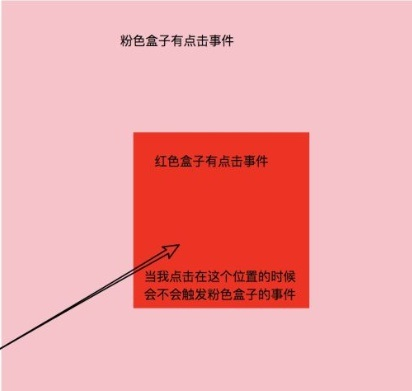

<!--  -->
# JavaScript学习笔记（十六）-- Event事件（下）

- **EVENT（下）**
- 今天来聊一聊事件的执行机制

- 什么是事件的执行机制呢？

- 思考一个问题？
- 当一个大盒子嵌套一个小盒子的时候，并且两个盒子都有点击事件

- 你点击里面的小盒子，外面的大盒子上的点击事件要不要执行



## **事件的传播**

- 就像上面那个图片一样，我们点击在红色盒子身上的同时，也是点击在了粉色盒子上
- 这个是既定事实，那么两个盒子的点击事件都会触发

- 这个就叫做 **事件的传播**

- **当元素触发一个事件的时候，其父元素也会触发相同的事件，父元素的父元素也会触发相同的事件**
- 就像上面的图片一样

- 点击在红色盒子上的时候，会触发红色盒子的点击事件
- 也是点击在了粉色的盒子上，也会触发粉色盒子的点击事件

- 也是点击在了 body 上，也会触发 body 的点击事件
- 也是点击在了 html 上，也会触发 html 的点击事件

- 也是点击在了 document 上，也会触发 document 的点击事件
- 也是点击在了 window 上，也会触发 window 的点击事件

- 也就是说，页面上任何一个元素触发事件，都会一层一层最终导致 window 的相同事件触发，前提是各层级元素得有注册相同的事件，不然不会触发


- 在事件传播的过程中，有一些注意的点：

1. 只会传播同类事件
2. 只会从点击元素开始按照 html 的结构逐层向上元素的事件会被触发

1. 内部元素不管有没有该事件，只要上层元素有该事件，那么上层元素的事件就会被触发


- 到现在，我们已经了解了事件的传播，我们再来思考一个问题

- 事件确实会从自己开始，到 window 的所有相同事件都会触发
- 是因为我们点在自己身上，也确实逐层的点在了直至 window 的每一个元素身上

- 但是到底是先点在自己身上，还是先点在了 window 身上呢
- 先点在自己身上，就是先执行自己的事件处理函数，逐层向上最后执行 window 的事件处理函数

- 反之，则是先执行 window 的事件处理函数，逐层向下最后执行自己身上的事件处理函数

## **冒泡、捕获、目标**

- 我们刚才聊过了，每一个事件，都是有可能从自己到 window ，有可能要执行多个同类型事件
- 那么这个执行的顺序就有一些说法了

### **目标**

- 你是点击在哪个元素身上了，那么这个事件的 **目标** 就是什么

### **冒泡**

- 就是从事件 **目标** 的事件处理函数开始，依次向外，直到 window 的事件处理函数触发
- 也就是从下向上的执行事件处理函数

### **捕获**

- 就是从 window 的事件处理函数开始，依次向内，只要事件 **目标** 的事件处理函数执行
- 也就是从上向下的执行事件处理函数

### **冒泡和捕获的区别**

- 就是在事件的传播中，多个同类型事件处理函数的执行顺序不同

## **事件委托**

- 就是把我要做的事情委托给别人来做
- 因为我们的冒泡机制，点击子元素的时候，也会同步触发父元素的相同事件

- 所以我们就可以把子元素的事件委托给父元素来做

### **事件触发**

- 点击子元素的时候，不管子元素有没有点击事件，只要父元素有点击事件，那么就可以触发父元素的点击事件

```html
<body>
  <ul>
    <li>1</li>
    <li>2</li>
    <li>3</li>
  </ul>
  <script>
    var oUl = docuemnt.querySelector('ul')
    oUl.addEventListener('click', function (e) {
      console.log('我是 ul 的点击事件，我被触发了')
    })
  </script>
</body>
```

- 像上面一段代码，当你点击 ul 的时候肯定会触发
- 但是当你点击 li 的时候，其实也会触发

### **target**

- target 这个属性是事件对象里面的属性，表示你点击的目标
- 当你触发点击事件的时候，你点击在哪个元素上，target 就是哪个元素

- 这个 target 也不兼容，在 IE 下要使用 srcElement

```html
<body>
  <ul>
    <li>1</li>
    <li>2</li>
    <li>3</li>
  </ul>
  <script>
    var oUl = docuemnt.querySelector('ul')
    oUl.addEventListener('click', function (e) {
      e = e || window.event
      var target = e.target || e.srcElement
      console.log(target)
    })
  </script>
</body>
```

- 上面的代码，当你点击 ul 的时候，target 就是 ul
- 当你点击在 li 上面的时候，target 就是 li

### **委托**

- 这个时候，当我们点击 li 的时候，也可以触发 ul 的点事件
- 并且在事件内不，我们也可以拿到你点击的到底是 ul 还是 li

- 这个时候，我们就可以把 li 的事件委托给 ul 来做

```html
<body>
  <ul>
    <li>1</li>
    <li>2</li>
    <li>3</li>
  </ul>
  <script>
    var oUl = docuemnt.querySelector('ul')
    
    oUl.addEventListener('click', function (e) {
      e = e || window.event
      var target = e.target || e.srcElement
     
      // 判断你点击的是 li
      if (target.nodeName.toUpperCase === 'LI') {
      	// 确定点击的是 li
        // 因为当你点击在 ul 上面的时候，nodeName 应该是 'UL'
        // 去做点击 li 的时候该做的事情了
        console.log('我是 li，我被点击了')
      }
    })
  </script>
</body>
```

- 上面的代码，我们就可以把 li 要做的事情委托给 ul 来做

### **总结**

- 为什么要用事件委托

- 我页面上本身没有 li
- 我通过代码添加了一些 li

- 添加进来的 li 是没有点击事件的
- 我每次动态的操作完 li 以后都要从新给 li 绑定一次点击事件

- 比较麻烦
- 这个时候只要委托给 ul 就可以了

- 因为新加进来的 li 也是 ul 的子元素，点击的时候也可以触发 ul 的点击事件


- 事件委托的书写

- 元素的事件只能委托给结构父级或者再结构父级的同样的事件上
- li 的点击事件，就不能委托给 ul 的鼠标移入事件

- li 的点击事件，只能委托给 ul 或者在高父级的点击事件上

## **默认行为**

- 默认行为，就是不用我们注册，它自己就存在的事情

- 比如我们点击鼠标右键的时候，会自动弹出一个菜单
- 比如我们点击 a 标签的时候，我们不需要注册点击事件，他自己就会跳转页面

- ...


- 这些不需要我们注册就能实现的事情，我们叫做 **默认事件**


### **阻止默认行为**

- 有的时候，我们不希望浏览器执行默认事件

- 比如我给 a 标签绑定了一个点击事件，我点击你的时候希望你能告诉我你的地址是什么
- 而不是直接跳转链接

- 那么我们就要把 a 标签原先的默认事件阻止，不让他执行默认事件

**表单的默认阻止要放在 form中**

- 我们有两个方法来阻止默认事件

- `e.preventDefault()` : 非 IE 使用
- `e.returnValue = false` ：IE 使用


- 我们阻止默认事件的时候也要写一个兼容的写法

```html
<a href="https://www.baidu.com">点击我试试</a>
<script>
  var oA = document.querySelector('a')
  a.addEventListener('click', function (e) {
    e = e || window.event
    console.log(this.href)
    e.preventDefault ? e.preventDefault() : e.returnValue = false
  })
</script>
```

- 这样写完以后，你点击 a 标签的时候，就不会跳转链接了
- 而是会在控制台打印出 a 标签的 href 属性的值