<!--  -->
# JavaScript学习笔记（三十七）-- GIT 和 GITHUB

## **GIT 和 GITHUB** 

- 在学习之前我们要先要清楚几个东西
- `git` 和 `github` 是两个东西，不是一个东西

- 需要搞清楚几个词语的意思

- 本地：我自己的终端
- 远程：在网络那一头的终端

- 仓库：一个被 `git` 管理了的文件夹

## **什么是 GIT**

- `git` 官方名称： **分布式版本管理器**
- 私人解释： 就是一个管理我们文件夹的工具

- 只不过可以保留所有的版本信息

- 就是我们安装一个软件

- 然后用这个软件来管理我们的一个文件夹
- 这个文件夹被 `git` 管理以后，我们可以对他进行各种操作

- 保证我们写过的内容不会丢失

## **什么是 GITHUB**

- `github` 是一个网站，是一个我们托管项目的平台
- 是一个 **世界级别** 的大型网站

- 也就是说，我们写的项目的 **源码** 可以放在上面保存，只要我们不自己删除，不会丢失

- 就相当于百度云
- 只不过功能更加强大，上面都是开发人员（世界级别）

- 因为 `github` 只接受 `git` 来上传代码，所以叫做 `github`
- 也就是说，我们可以通过 `git` 这个软件来管理我们本地的文件夹

- 并且可以把文件夹里面的代码上传到 `github` 保存
- 也可以写一个插件之类的工具，上传到 `github` 上面让其他开发者使用

- 也可以从 `github` 上找到其他开发者写的插件之类的东西下载使用

- 所以说，`github` 也是一个大型的 **开源** 的资源共享平台

## **GIT 使用**

- 刚才我们说过，`git` 是一个管理我们文件夹的工具
- 那么我们就要先安装工具，再使用工具管理我们的文件夹

### **GIT 安装**

- 下载 `git` 直接到官网下载就可以

[](https://link.zhihu.com/?target=https%3A//git-scm.com/)[Git - Downloadsgit-scm.com](https://link.zhihu.com/?target=https%3A//git-scm.com/downloads)


- 找到和操作系统对应的版本就可以了

方法一： 打开官网，直接点击下载

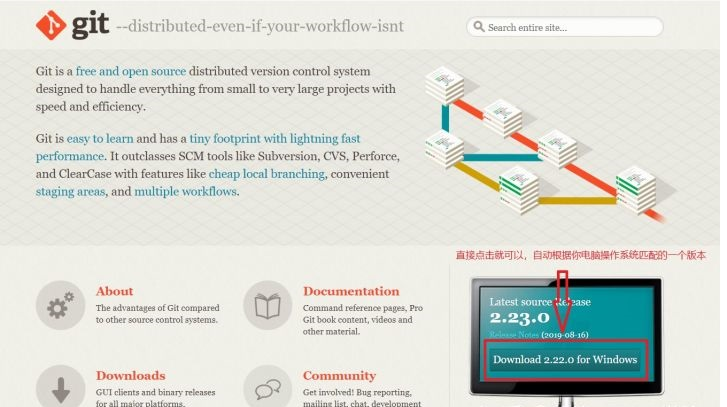


方法二： 打开下载中心，选择操作系统，选择下载版本

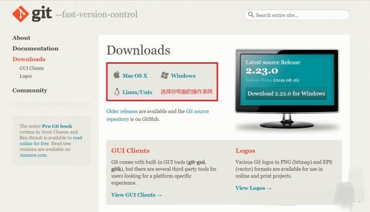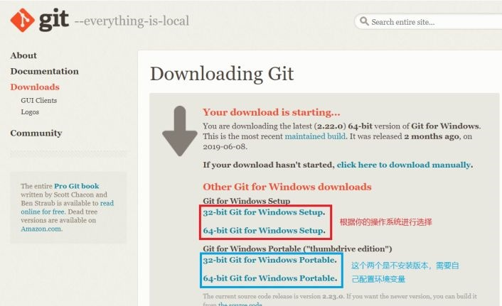

- 下载好以后，直接双击进行安装就行
- 一直下一步就可以，安装再默认路径就行

- 安装完毕后检测一下安装是否成功

1、方法一： 打开 `cmd` 窗口，输入指令检查

```
# 检测 git 是否安装
$ git --version
```

- 出现版本号，说明安装成功

2、方法二： 随便找个地方单机 **鼠标右键**，出现下图内容，说明安装成功

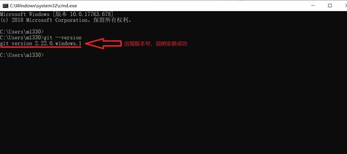

- 安装完毕，接下来我们就可以开始使用了

### **GIT 使用**

- `git` 是一个软件没错，但是不是那种安装了会再桌面出现一个图标的软件
- 而是一个需要在 **命令行** 进行操作的软件

- 我们单机鼠标右键，点击 `Git Bash Here`
- 会出现下图内容

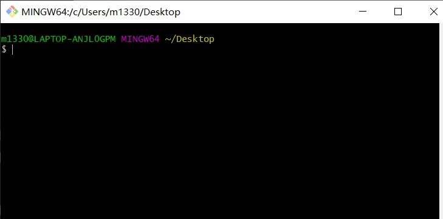

- 我们发现点开以后，就是一个 **命令行窗口**
- 其实就是给我们写一些指令使用的，只不过色彩鲜艳一点

- 使用 `cmd` 或者 `powershell` 窗口来运行 `git` 指令也可以
- 只要是再终端运行就行

- OS 操作系统直接在 **终端** 中运行就行

- `Git Bash Here` 表示再当前目录下运行 `Git Base`
- 所以，你在哪个文件夹下点击的，那么你出来的命令行窗口的目录就是哪里

- 我们就在命令行里面使用 `git` 来管理我们的文件夹

### **GIT 初始化**

- 我们希望一个文件夹被 `git` 管理的话，那么就要在一个文件夹下进行 **git 初始化**
- 找到一个希望被 `git` 管理的文件夹

- 在文件夹内单击鼠标右键，点开 `Git Bash Here`
- 输入指令
  \# git 初始化的指令
  $ git init

- 然后文件夹内会多一个 `.git` 的文件夹（这个文件夹是一个隐藏文件夹）

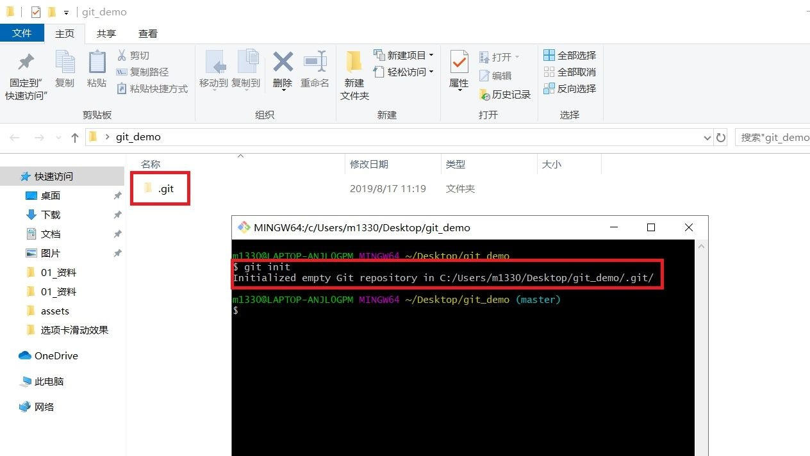

- 这个时候，我的这个 `git_demo` 文件夹就被 `git` 管理了

- `git` 不光管理这一个文件夹，包括所有的子文件夹和子文件都会被管理

- 注意： **只有当一个文件夹被 git 管理以后，我们才可以使用 git 的功能去做版本管理**

- 也就是说，我们必须要把我们电脑中的某一个文件夹授权给 `git`
- `git` 才能对这个文件夹里面的内容进行各种操作

- 而 `git init` 就是在进行这个授权的操作

### **GIT 暂存区**

- 当一个文件夹被 `git` 管理了以后
- `git` 就会对当前文件夹进行 **“分区”**

- 会分为三个区域

1. 工作区：我们书写的源码就在工作区里面
2. 暂存区：把我们想要存储的内容放在暂存区

1. 历史区：把暂存区里面的内容拿出来形成一个历史版本

- 也就是说，我们需要把想成为一个版本的代码
- 要先放在暂存区

- 然后才能在暂存区里面放到历史去
- 才可以生成一个版本保存下来

- 我们要放入暂存区，要使用 `git add` 指令
- 把单独一个文件放在暂存区

```
# 把文件夹下的 index.txt 文本放在暂存区
$ git add index.txt
```

- 把单独一个文件夹放在暂存区（暂存区不能存放空文件夹）

```
# 把文件夹下的 ceshi文件夹 放在暂存区
$ git add ceshi/
```

- 把所有文件都放在暂存区

```
# 把文件夹下所有的内容都放在暂存区
$ git add --all
# git add --all 有一个简单的写法
$ git add .
```

- 全部存放的时候使用上面两个指令哪个都行


- 把已经放在暂存区的内容在拉回到工作区

```
# 拉回暂存区的 index.txt 文件
$ git reset HEAD -- index.txt
# 拉回暂存区的 ceshi 文件夹
$ git reset HEAD -- ceshi/
# 拉回暂存区的 所有文件
$ git reset HEAD -- .
```

- 注意： `**--**` **两边都有空格，拉回所有文件的时候有个** `**.**`


- 暂存区，只是帮我们暂时存放内容，我们删除了还是会丢的
- 要想帮我们保存下来，那么还需要把暂存区的内容放到历史区

### **GIT 历史区**

- `git` 的历史区，就是把我们暂存区里面的文件变成一个历史版本
- 当一些文件形成一个版本的时候，就会被一直记录下来了

- 向历史区里面添加内容的时候，必须保证 **暂存区** 有内容
- 因为历史区就是把暂存区里面的内容收录进去

- 向历史区添加内容使用 `git commit -m "做一个简单的说明"`

```
# 把暂存区的内容放到历史区
$ git commit -m "我是第一个版本"
```

- 我们一定要写一个简单的说明
- 因为当我们的历史版本多了以后，我们自己也记不住哪个版本做了哪些修改

- 所以有个简单的说明会好很多


- 这个时候历史区就有了我们的第一个版本
- 我们使用 `git log` 这个指令查看版本信息

```
# 查看当前历史区版本信息
$ git log
```

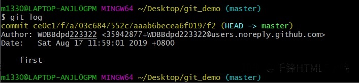

- `commit`：这一个版本的版本编号
- `Author`：作者

- `Date`：本次版本的记录时间
- 后面的内容就是我刚才提交的时候写的说明

- 接下来我们对文件夹内的内容进行一些修改，然后再次创建一个历史版本
- 对 `index.txt` 中的文本内容进行修改

- 从 `hello world` 改变成 `你好 世界`


- 然后我们再次打印日志看一下

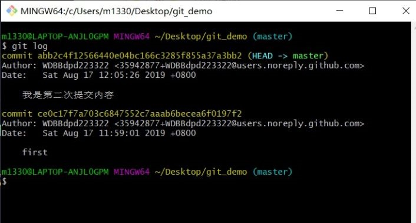

- 我们发现，日志信息变成了两条，也就是我们存在着两个版本的内容了
- 放在历史区的内容，理论上就丢不了了

- 现在我们可以把我们本地工作区中的内容给删除了，删除以后我们进行历史回退

- 我们使用 `git reset --hard 版本编号` 进行历史回退
  \# 回退到第一次提交的版本
  $ git reset --hard ce0c17f7a703c6847552c7aaab6becea6f0197f2

  \# 回退到第二次提交的版本
  $ git reset --hard abb2c4f12566440e04bc166c3285f855a37a3bb2

- 这个时候我们就可以来回来去的玩我们的历史记录了

### **GIT 分支**

- `git` 分支，就是我们自己把我们的整个文件夹分成一个一个独立的区域
- 比如我在开发 **登录** 功能的时候，可以放在 `login` 分支下进行开发

- 开发 **列表** 功能的时候，可以放在 `list` 分支下进行开发
- 大家互不干扰，每一个功能都是一个独立的功能分支

- 这样开发就会好很多
- `git` 在初始化的时候，会自动生成一个分支，叫做 `master`

- 是表示主要分支的意思
- 我们就可以自己开辟出很多独立分支

- 开辟一个分支使用 `git branch 分支名称` 指令

```
# 开辟一个 login 分支
$ git branch login
```

- 查看一下当前分支情况

```
# 查看当前分支情况
$ git branch
```

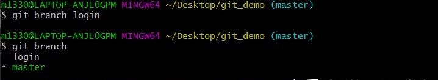

- 会看到，当前有两个分支了
- 一个是 `master`，一个是 `login`

- 前面有个 `*` 号，并且有高亮显示的，表示你当前所处的分支
- 我们对 **登录** 功能的开发要移动到 `login` 分支去完成

- 我们切换所处分支使用 `git checkout 分支名称`

```
# 切换到 login 分支
$ git checkout login
```

- 然后我们在整个分支上进行 **登录** 功能的开发
- 开发完毕以后，我们就在当前分支上进行提交

- 提交以后我们进行分支切换

- 发现 `master` 上面还是最初始的状态
- 而 `login` 分支上有我们新写的 **登录** 功能的代码

- 我们按照分支把所有功能都开发完毕了以后

- 只要把所有代码都合并到 `master` 主分支上就行了

- `git` 的合并分支，只能是把别的分支的内容合并到自己的分支上
- 使用的指令是 `git merge`

```
# 切换到 master 分支
$ git checkout master
# 把 login 的内容合并到自己的分支
$ git merge login
```

- 这个时候，我们刚才在 `login` 上开发的东西就都来到了 `master` 主分支上
- 如果是有多个分支的话，那么所有的最后都合并到 `master` 分支上的时候

- 我们的主分支上就有完整网站的所有页面

- 各个分支上都是单独的页面和功能

- 这个时候我们开辟的分支就没有什么用了，就可以删除分支了

1. 先切换到别的分支
2. 使用指令 `git branch -d 分支名称` 来删除

```
# 先切换到别的分支
$ git checkout master
# 删除 login 分支
$ git branch -d login
```

### **常用的分支命名**

- 我们的分支命名也要规范一些
- 我们有一些分支名称大家都默认是有特殊意义的

- 比如我们之前的写的 `login` 分支就是不规范的分支名称

- 而且也是不规范的分支操作

- 常见的分支名称

1、master：主分支，永远只存储一个可以稳定运行的版本，不能再这个分支上直接开发

2、develop： 主要开发分支，主要用于所用功能开发的代码合并，记录一个个的完整版本

- 包含测试版本和稳定版本
- 不要再这个分支上进行开发

3、feature-xxx：功能开发分支，从 `develop` 创建的分支

- 主要用作某一个功能的开发
- 以自己功能来命名就行，例如 `feature-login` / `feature-list`

- 开发完毕后合并到 `develop` 分支上

4、feature-xxx-fix: 某一分支出现 `bug` 以后，在当前分支下开启一个 `fix` 分支

- 解决完 `bug` 以后，合并到当前功能分支上
- 如果是功能分支已经合并之后发现 `bug` 可以直接在 `develop` 上开启分支

- 修复完成之后合并到 `develop` 分支上

5、hotfix-xxx： 用于紧急 `bug` 修复

- 直接在 `master` 分支上开启
- 修复完成之后合并回 `master`

### **GIT 推送**

- 我们的所有内容已经全部保留在了本地历史区
- 理论上是不会丢失了

- 但是如果把文件夹删除了，还是没有了

- 所以我们要使用 `git` 把我们所有的内容推送到 `github` 上面保存起来
- 那么就本地文件夹就算删除了，那么远程上面还有一份，还可以拿回来使用

- 所以我们现在就要把本地内容推送到远程
- 这个时候我们接需要一个 `github` 的账号了

- 先去 [github官网](https://link.zhihu.com/?target=https%3A//github.com/) 注册一个账号

### **开辟一个远程仓库**

- 有了 `github` 账号以后
- 我们就登录 `github` 网站，开辟一个远程仓库

- `github` 的远程也是以一个仓库一个仓库的形式来保存代码

- 我们可以在一个 `github` 上保存很多的项目
- 只要一个项目一个仓库就可以了

- 按照下面步骤开辟仓库

1、先点击新建仓库

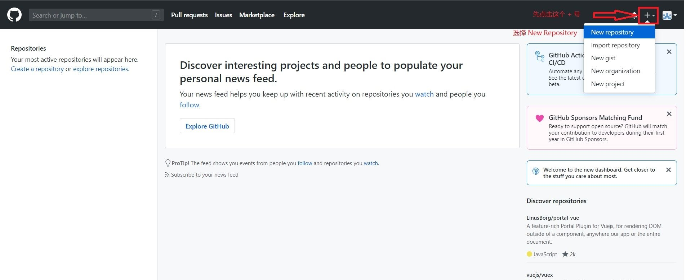

2、按照要求填写内容

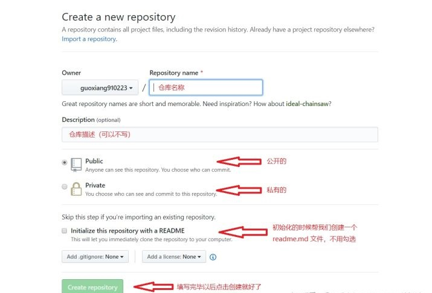

3、出现下图表示创建仓库成功

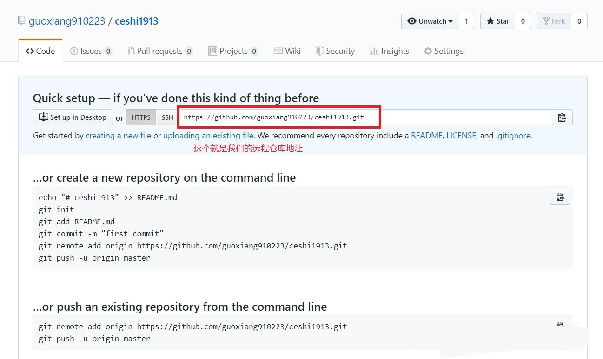

- 现在我们的远程仓库建立完毕了，我们就要把我们的项目代码整个上传了

### **添加仓库地址**

- 接下来，要使用 `git` 上传代码了
- 我们先要告诉 `git` 上传到哪里

- 也就是给 `git` 添加一个上传的地址
- 我们还是来到我们的项目文件夹

- 使用 `git remote add origin 仓库地址` 来添加

```
# 在项目文件夹下打开 git base
# 添加仓库地址
$ git remote add origin https://github.com/guoxiang910223/ceshi1913.git
```

- remote：远程的意思
- add：添加的意思

- origin：是一个变量名（就是指代后面一长串的地址）

### **上传**

- 上传到哪里的地址我们已经添加好了
- 接下来就是上传内容了

- 上传要保证 **历史区** 里面有内容
- 上传的过程会把 **历史区** 里面所有的内容上传到远端

- 我们使用 `git push` 指令来上传

```
# 上传内容
$ git push -u origin master
# 表示把内容上传到 origin 这个地址
# master 是上传到远程的 master 分支
```

- `-u` 是我们第一次的使用用到了，是为了记录一下用户名和密码
- 下次上传的时候就不需要再写了


- 第二次上传

- 第二次上传的时候，因为有刚才的记录，就不需要再写 `origin` 和 `master` 了
- 会默认传递到 `origin` 这个地址的 `master` 分支上

- 除非你要传递到别的分支上的时候再进行书写

```
# 第二次上传
$ git push
```

- 到这里，就完成了一次 `git` 推送
- 这个时候本地的文件夹就真的可以删除了

- 因为远程有一份我们的内容，本地的删除了，可以直接把远程的拉回来就行

### **GIT 克隆**

- `git` 克隆是指把远程仓库里面的内容克隆一份到本地
- 可以克隆别人的 **公开** 的仓库，也可以克隆自己的仓库

- 克隆别人的仓库，我们只能拿下来用，修改后不能从新上传
- 克隆自己的仓库，我们修改后还可以再次上传更新

- 我们先找到一个别人的仓库，或者自己的仓库（这里以 jQuery 的仓库为例）

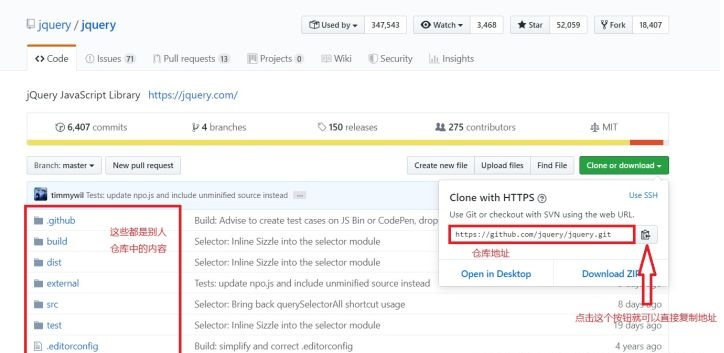

- 复制好地址以后，选择一个我们要存放内容的文件夹（我这里以桌面为例）
- 直接在想存放内容的位置打开 `git base`

- 输入克隆指令 `git clone 仓库地址`

```
# 直接克隆仓库
$ git clone https://github.com/jquery/jquery.git
```

- 等待一段时间
- 你就会发现你的文件夹里面多了一个叫做 `jquery` 的文件夹

- 里面就是人家仓库的所有内容

### **GIT 下拉**

- 不管是你克隆下来的仓库还是别的方式弄得本地仓库
- 当人家的代码更新以后，你想获得最新的代码

- 我们不需要从新克隆
- 只要拉取一次代码就可以了

- 直接在项目文件夹里面使用指令下拉

```
# 拉取远程最新代码
$ git pull
```

- 这样一来，你本地的仓库就可远程的仓库同步了

## **GIT 冲突**

- `git` 冲突是指在我们的上传过程中
- 本地的版本和远程的版本不一致导致的

- 这个时候只要先使用 `git pull` 拉取回来

- 让本地和远程保持一致

- 然后再从新上传就好了
- 但是 `git pull` 相对不安全，因为会自动和本地内容合并

- 我们也可以选择使用 `git fetch`

```js
# 使用 fetch 获取远程最新信息并开辟一个临时分支
$ git fetch origin master:tmp
# 讲当前分支和临时分支的内容进行对比
$ git diff tmp
# 再选择合并分支内容
$ git merge tmp
```