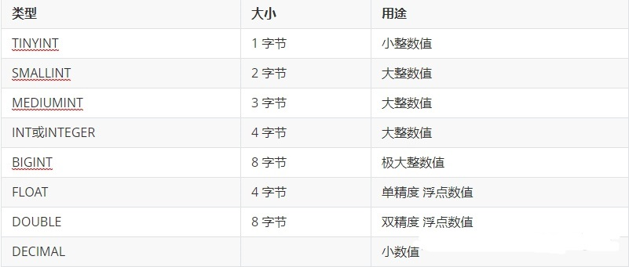
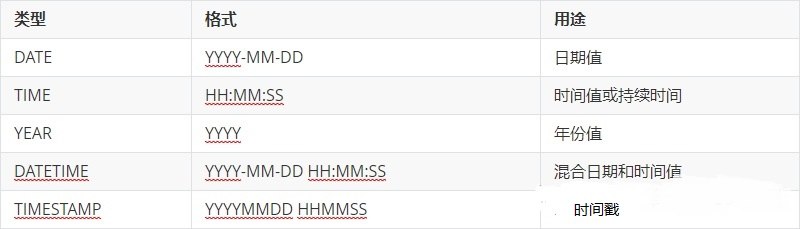
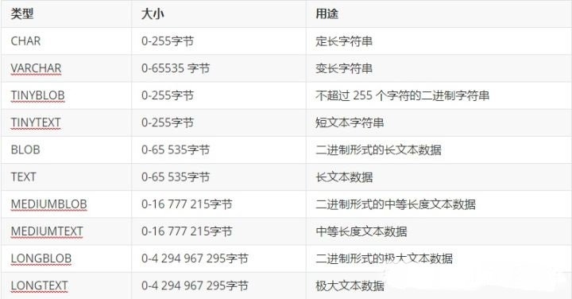

<!--  -->
# JavaScript学习笔记（二十四）-- MYSQL基础操作

## **MYSQL**

- mysql 是一个数据库的名字
- 和 php 合作的比较好的数据库

- 之前我们说过一个问题，前端向后端索要数据，后端就是去数据库中查询数据，返回给前端
- 接下来就聊聊使用 php 操作数据库

MySQL 是最流行的关系型数据库管理系统（非关系型数据库简略介绍） 关系数据库管理系统(Relational Database Management System)的特点 数据以表格的形式出现 每行为各种记录名称 许多的行和列组成一张表单 若干的表单组成database 主键：主键是唯一的。一个数据表中只能包含一个主键。你可以使用主键来查询数据。


### **数据库的数据类型**

**数值类型**



**日期和时间类型**



**字符串类型**



### **操作数据库**

- 之前都是对数据库的简单了解，不需要全都背下来
- 我们只要了解一下就可以了

- 接下来我们就是使用 php 链接 mysql 数据库进行数据的增删改查
- 想要操作数据库，除了需要 php 的语法以外，还需要一个 mysql 的 sql 语句

- 使用 php 操作数据库的步骤

1. 和数据库建立链接
2. 使用 sql 语句对数据库进行操作

1. 获取结果
2. 和数据库的链接断开

### **和数据库建立链接**

- 在 php 中我们使用 mysql_connect() 方法来建立和数据库的链接

```mysql
<?php
 # 下面就是建立链接，$link 会得到一个链接信息
  $link = mysql_connect('ip地址', '数据库用户名', '数据库密码'); 
?>
```

- 我们有了链接信息 $link 以后就可以继续去操作数据库了

### **确定操作哪个哪个库**

- 刚才是和数据库建立了链接，我们还要确定操作哪个库

```mysql
<?php
 # 下面就是确定你要操作哪个库  
  mysql_select_db('你要操作的库的名称', $link);
?>
```

### **执行 sql 语句操作数据库**

- 接下来就是使用 sql 语句去这个库里面进行增删改查的操作了

```mysql
<?php
 # 下面就是使用 sql 语句对数据库进行操作
  $res = mysql_query('你要执行的 sql 语句');      
?>
```

- 这里有一个注意的点：
- 我们拿到的结果是一个我们看不懂的处理信息

- 需要使用 mysql_fetch_row || mysql_fetch_assoc 解析一下结果才能看得懂

### **关闭链接**

- 全部用完以后我们最好是关闭一下数据库链接

```mysql
<?php
  mysql_close($conn);
?>
```

### **完整步骤**

- 我们完整的写一下操作的步骤

```mysql
<?php
 $conn = mysql_connect('localhost', 'root', 'root');
 mysql_select_db('test1913');
 $res = mysql_query('SELECT * FROM `student`');
 $row = mysql_fetch_assoc($res);
 mysql_close($conn);
 print_r($row);
?>
```

### **常用的 sql 语句**

- 刚才说了怎么操作数据库
- 现在我们学习一下，操作数据库时候常用的 sql 语句

- 我们就是依靠这些 sql 语句来进行数据库操作的

### **查**

- 查询语句

```mysql
<?php
 # 查询 student 这个表里面的所有数据
 $sql = 'SELECT * FROM `student`';
 
 # 查询 student 表中的数据里面 gender 为 男 的数据
 $sql = 'SELECT * FROM `student` WHERE `gender`="男"';
 
 # 查询 student 表中的数据里面 age 大于 18 的数据
 $sql = 'SELECT * FROM `student` WHERE `age`>18';
 
 # 查询 student 表中的数据里面 age 大于 18 且 gender 为 男 的数据
 $sql = 'SELECT * FROM `student` WHERE `age`>18 AND `gender`="男"';
 # 查询 student 表中的数据里面 age 小于 22 或者 age 大于 28 的数据
 $sql = 'SELECT * FROM `student` WHERE `age`<22 OR `age`>28';
 # 查询 student 表中的数据里面从 第几条开始 查询多少条
 $sql = 'SELECT * FROM `student` LIMIT 0, 10';
 
 # 先按照条件筛选出数据以后再进行分页查询
 # 下面是查询表中所有 age>18 且 性别为男的所有数据，查出来以后从第 10 条开始查 10 条
 $sql = 'SELECT * FROM `student` WHERE `age`>18 AND `gender`="男" LIMIT 10, 10';
 # 查询表的模糊查询
 # 下面表示查询表中所有数据里面 name 字段中包含 "三" 字的数据
 $sql = 'SELECT * FROM `student` WHERE `name` LIKE "%三%"';
 # 查询排序，查询的时候按照某一个字段升序或降序排序
 $sql = 'SELECT * FROM `student` ORDER BY `age` ASC';
 $sql = 'SELECT * FROM `student` ORDER BY `age` DESC';
?>
```

### **增**

- 增加语句

```mysql
<?php
 # 向表中增加一条数据，再增加的时候主键不能由我们书写，而是 mysql 数据库自己递增
 $sql = 'INSERT INTO `student` VALUES(null, "张三", 18, "男", 1913, 100)';
 
 # 插入固定几个键的数据，其他的用默认值
 $sql = 'INSERT INTO `student` (`name`, `age`) VALUES("李四", 22)';
?>
```

### **删**

- 删除语句

```mysql
<?php
 # 删除表中 id 为 100 的数据
 $sql = 'DELETE FROM `student` WHERE `id`=100';
 # 删除表中 name 为 张三 的数据
 $sql = 'DELETE FROM `student` WHERE `name`="张三"'
?>
```

### **改**

- 修改语句

```mysql
<?php
 # 更新一条 id 为 100 的数据中的 name 字段的值和 age 字段的值
 $sql = 'UPDATE `student` SET `name`="张三", `age`=10 WHERE `id`=100'
 
 # 更新数据的时候让所有的数据增加一些内容
 $sql = 'UPDATE `student` SET `age`=age+1'
?>
```