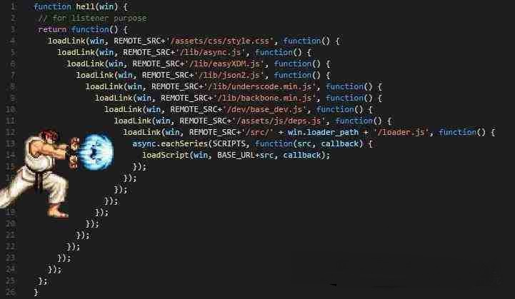

<!--  -->
# JavaScript学习笔记（二十八）-- Promise（回调函数）

## **Promise**

- `promise` 是一个 ES6 的语法
- Promise表示承诺的意思

- 它在语法上解决了传统的多层回调嵌套问题

## **回调函数**

- 什么是回调函数？
- 就是把函数 A 当作参数传递到 函数 B 中

- 在函数 B 中以行参的方式进行调用

```js
function a(cb) {
    cb()
}
function b() {
    console.log('我是函数 b')
}
a(b)
```

- 为什么需要回调函数

- 当我们执行一个异步的行为的时候，我们需要在一个异步行为执行完毕之后做一些事情
- 那么，我们是没有办法提前预知这个异步行为是什么时候完成的

- 我们就只能以回调函数的形式来进行

## 一个典型的定时器

```js
setTimeout(function(){
    console.log("回调函数执行了")
}, 2000)
```

## **回调地狱**

- 当一个回调函数嵌套一个回调函数的时候
- 就会出现一个嵌套结构

- 当嵌套的多了就会出现回调地狱的情况
- 比如我们发送三个 ajax 请求

- 第一个正常发送
- 第二个请求需要第一个请求的结果中的某一个值作为参数

- 第三个请求需要第二个请求的结果中的某一个值作为参数

```js
ajax({
  url: '我是第一个请求',
  success (res) {
    // 现在发送第二个请求
    ajax({
      url: '我是第二个请求'，
      data: { a: res.a, b: res.b },
      success (res2) {
        // 进行第三个请求
        ajax({
          url: '我是第三个请求',
          data: { a: res2.a, b: res2.b },
  	success (res3) { 
            console.log(res3) 
          }
        })
      }
    })
  }
})
```

- **回调地狱，其实就是回调函数嵌套过多导致的**



- 当代码成为这个结构以后，已经没有维护的可能了
- 所以我们要把代码写的更加的艺术一些

## **PROMISE**

- 为了解决回调地狱
- 我们就要使用 promise 语法

- 语法：

```js
new Promise(function (resolve, reject) {
    // resolve 表示成功的回调
    // reject 表示失败的回调
}).then(function (res) {
    // 成功的函数
}).catch(function (err) {
    // 失败的函数
})
```

- promise 就是一个语法

- 我们的每一个异步事件，在执行的时候
- 都会有三个状态，执行中 / 成功 / 失败


- 因为它包含了成功的回调函数
- 所以我们就可以使用 promise 来解决多个 ajax 发送的问题

```js
new Promise(function (resolve, reject) {
    ajax({
        url: '第一个请求',
        success (res) {
            resolve(res)
        }
    })
}).then(function (res) {
    // 准备发送第二个请求
    return new Promise(function (resolve, reject) {
        ajax({
            url: '第二个请求',
            data: { a: res.a, b: res.b },
            success (res) {
                resolve(res)
            }
        })
    })
}).then(function (res) {
    ajax({
        url: '第三个请求',
        data: { a: res.a, b: res.b },
        success (res) {
            console.log(res)
        }
    })
})
```

- 这个时候，我们的代码已经改观了很多了
- 基本已经可以维护了

- 但是对于一个程序员来说，这个样子是不够的
- 我们还需要更加的简化代码

- 所以我们就需要用到一个 es7 的语法了
- 叫做 async/await

## **ASYNC/AWAIT**

- `async/await` 是一个 es7 的语法
- 这个语法是 **回调地狱的终极解决方案**

- 语法：

```js
async function fn() {
    const res = await promise对象
}
```

- 这个是一个特殊的函数方式
- 可以 await 一个 promise 对象

- **可以把异步代码写的看起来像同步代码**
- 只要是一个 promiser 对象，那么我们就可以使用 `async/await` 来书写

```js
async function fn() {
  const res = new Promise(function (resolve, reject) {
    ajax({
        url: '第一个地址',
        success (res) {
            resolve(res)
        }
    })
  })
 
  // res 就可以得到请求的结果
  const res2 = new Promise(function (resolve, reject) {
    ajax({
        url: '第二个地址',
        data: { a: res.a, b: res.b },
        success (res) {
            resolve(res)
        }
    })
  })
 
  const res3 = new Promise(function (resolve, reject) {
    ajax({
      url: '第三个地址',
      data: { a: res2.a, b: res2.b },
      success (res) {
        resolve(res)
      }
    })
  })
 
  // res3 就是我们要的结果
  console.log(res3)
}
```

- 这样的异步代码写的就看起来像一个同步代码了