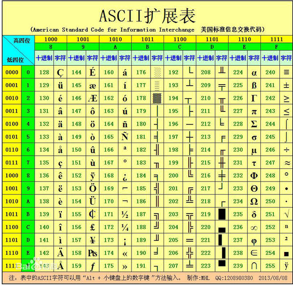

<!--  -->
# JavaScript学习笔记（十）-- 字符串

## ES5/String

## 严格模式（了解）

- 我们都知道 js 是一个相对不很严谨的语言
- 而且开发的时候，一些代码也不是很严格要求

- 而严格模式就是对开发的时候写的一些内容做了要求

### 开启严格模式

- 想开启严格模式，直接在代码最开始的位置写上字符串 `use strict`

```js
<script>
	'use strtic'
	// 下面代码书写就要按照严格模式来书写
</script>
```

### 严格模式的规则

1、声明变量必须有 `var` 关键字

```js
'use strtic'
var num = 100
num2 = 200 // 这个就会报错
```

- 之前了解过，在声明变量的时候，如果没有 var 关键字，那么按照作用域的规则会自动定义成全局变量
- 严格模式下不可以，会报错


2、函数的行参不可以重复

```js
'use strtic'
function fn(p1, p1) {} // 直接就会报错
```

- 在非严格模式下，函数两个行参一样，是不会报错的，只不过就是相当于在函数内部只有一个变量了
- 但是在严格模式下会报错


3、声明式函数调用的时候函数内部没有 this

```js
'use strtic'
function fn() {
  console.log(this) // undefined
}
fn()
```

- 本身，全局声明式函数在调用的时候，函数内部的 this 是指向 window 的
- 在严格模式下，是没有 this 的

## 创建字符串

- 我们创建字符串也分为两种方法 **字面量** 和 **构造函数**
- 字面量：

```js
var str = 'hello'
```

- 构造函数创建

```js
var str = new String('hello')
```

## ASCII 字符集

- 我们都知道，计算机只能存储 `0101010` 这样的二进制数字
- 那么我们的 `a ~ z` / `A ~ Z` / / `@` /… 之类的内容也有由二进制数字组成的

- 我们可以简单的理解为， `a ~ z` / `A ~ Z` / / `@` /… 之类的内容都有一个自己的编号，然后在计算机存储的时候，是存储的这些编号，我们看的时候，也是通过这些编号在解析成我们要看到的内容给我们看到



- 上面的就是 ASCII 对照表，我们只需要知道他是这么存储的就好

### unicode 编码

- 我们看到了，ASCII 只有这 128 个字符的编码结构
- 但是因为 ASCII 出现的比较早，而且是美国发明的，早期时候这些内容就够用了

- 因为存储一些英文的内容，传递一些英文的文章什么的都够用了
- 那么对于全世界来说肯定是不够用的

- 因为我们的汉字没有包含进来，包括一些其他国家的语言也没有
- 所以就出现了 unicode 编码，也叫（万国码，统一码）

- unicode 对照表就是一个和 ASCII 一样的对照表，相当于扩展了ASCII。只不过变得很大很大，因为包含的内容特别的多
- 而且包含了世界上大部分国家的文字，所以我们的文字和字符现在在存储的时候，都是按照 unicode 编码转换成数字进行存储

- 我们的 UTF-8 就是一种 8 位的unicode字符集

## 字符串的常用方法

- 我们操作字符串，也有一堆的方法来帮助我们操作
- 字符串和数组有一个一样的地方，也是按照索引来排列的

### charAt

- `charAt(索引)` 是找到字符串中指定索引位置的内容返回

```js
var str = 'Jack'
// 使用 charAt 找到字符串中的某一个内容
var index = str.charAt(2)
console.log(index) // c
```

- 因为字符串也是按照索引进行排列的，也是同样从 0 开始
- 所以索引 2 的位置就是 c

- 如果没有对应的索引，那么就会返回 空字符串

```js
var str = 'Jack'
// 使用 charAt 找到字符串中的某一个内容
var index = str.charAt(10)
console.log(index) // ''
```

- 这个字符串根本没有索引 10 的位置
- 所以就会返回一个空字符串 `''`


### charCodeAt

- `charCodeAt(索引)` 就是返回对应索引位置的 unicode 编码

```js
var str = 'Jack'
// 使用 charAt 找到字符串中的某一个内容
var index = str.charCodeAt(0)
console.log(index) // 74
```

- 因为 `J` 在 unicode 对照表里面存储的是 74，所以就会返回 74


### indexOf

- `indexOf` 就是按照字符找到对应的索引

```js
var str = 'Jack'
// 使用 indexOf 找到对应的索引
var index = str.indexOf('J')
console.log(index) // 0
```

- 因为字符 `J` 在字符串 `Jack` 中的索引位置是 0
- 所以会返回 0


### substring

- `substring` 是用来截取字符串使用的
- 语法： `substring(从哪个索引开始，到哪个索引截止)`，包含开始索引，不包含结束索引

```js
var str = 'hello'
//         01234
// 使用 substring 截取字符串
var newStr = str.substring(1, 3)
console.log(newStr) // el
```

- 从索引 1 开始，到索引 3 截止，包含前面的索引不包含后面的索引
- 所以返回的是 el


### substr

- `substr` 也是用来截取字符串的
- 语法：`substr(从哪个索引开始，截取多少个)`

```js
var str = 'hello'
//         01234
// 使用 substr 截取字符串
var newStr = str.substr(1, 3)
console.log(newStr) // ell
```

- 这个方法和 `substring` 不一样的是，第二个参数是截取多少个
- 从索引 1 开始，截取 3 个，所以得到的是 `ell`


### toLowerCase 和 toUpperCase

- 这两个方法分别使用用来给字符串转成 小写字母 和 大写字母 的

```js
var str = hello
// 使用 toUpperCase 转换成大写
var upper = str.toUpperCase()
console.log(upper) // HELLO
// 使用 toLowerCase 转换成小写
var lower = upper.toLowerCase()
console.log(lower) // hello
```

