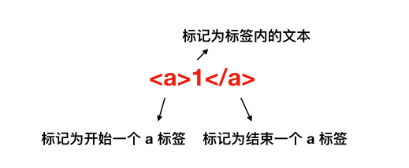
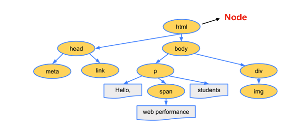
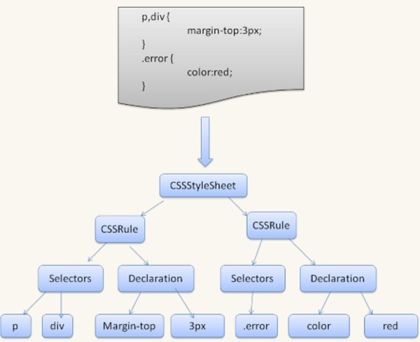
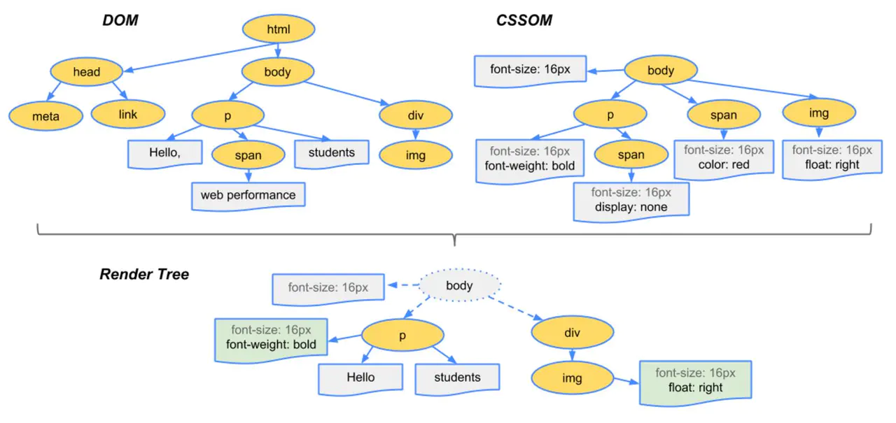

# 浏览器渲染原理

## 1. 浏览器渲染基本步骤

浏览器主要有以下步骤：

- 浏览器通过HTTP协议向服务端请求页面数据
- 将请求回来的HTML文件解析成DOM树

- 将请求回来的CSS文件解析成CSSOM树
- 将DOM树和CSSOM树结合在一起，生成渲染树（render tree）

- 计算渲染树的布局，这实际上是回流的过程
- 将布局渲染到屏幕上，这实际上是重绘的过程


大致过程如图所示：


这里主要说说后面解析的过程。

## 2. 构建DOM树、CSSOM树

### （1）构建DOM树

当打开一个网页时，浏览器都会去请求对应的 HTML 文件。虽然平时我们写代码时都会分为 JS、CSS、HTML 文件，也就是字符串，但是计算机硬件是不理解这些字符串的，所以在网络中传输的内容其实都是 0 和 1 这些字节数据。当浏览器接收到这些字节数据以后，它会将这些字节数据转换为字符串，也就是我们写的代码。


当数据转换为字符串以后，浏览器会先将这些字符串通过词法分析转换为标记（token），这一过程在词法分析中叫做标记化（tokenization）。


简单来说，标记还是字符串，是构成代码的最小单位。这一过程会将代码分拆成一块块，并给这些内容打上标记，便于理解这些最小单位的代码是什么意思。



当结束标记化后，这些标记会紧接着转换为 Node，最后这些 Node 会根据不同 Node 之前的联系构建为一颗 DOM 树。



以上就是浏览器从网络中接收到 HTML 文件然后一系列的转换过程。


当然，在解析 HTML 文件的时候，浏览器还会遇到 CSS 和 JS 文件，这时候浏览器也会去下载并解析这些文件，接下来就看看浏览器如何解析 CSS 文件。


**注意：**在解析过程中，如果遇到 `<script>`就会停止页面的解析，先执行标签中的JavaScript代码，如果代码时外联的形式，也需要等待外联的JavaScript代码下载并执行完才继续执行解析HTML的工作，解析完HTML文件之后，就会触发`DOMContentLoaded` 事件，这时就可以操作DOM了。

### （2）构建CSSOM树

其实转换 CSS 到 CSSOM 树的过程和DOM树的渲染过程是极其类似的：


在这一过程中，浏览器会确定下每一个节点的样式到底是什么，并且这一过程其实是很消耗资源的。因为样式你可以自行设置给某个节点，也可以通过继承获得。在这一过程中，浏览器得递归 CSSOM 树，然后确定具体的元素到底是什么样式。


那为什么会消耗资源呢？来看个例子

```js
<div>
  <a> <span></span> </a>
</div>
<style>
  span {
    color: red;
  }
  div > a > span {
    color: red;
  }
</style>
```

对于第一种设置样式的方式来说，浏览器只需要找到页面中所有的 span 标签然后设置颜色，但是对于第二种设置样式的方式来说，浏览器首先需要找到所有的 span 标签，然后找到 span 标签上的 a 标签，最后再去找到 div 标签，然后给符合这种条件的 span 标签设置颜色，这样的递归过程就很复杂。所以我们应该尽可能的避免写过于具体的 CSS 选择器，然后对于 HTML 来说也尽量少的添加无意义标签，保证层级扁平。


CSS解析为CSSStyleSheet（也就是CSSOM树）的过程如下：



CSS是一种**渲染阻塞资源**(render blocking resource)，它需要完全被解析完毕之后才能进入生成渲染树的环节。


由于CSS有些属性具有继承性，后面定义的样式可能会覆盖或修改前面的样式，所以只有当所有的CSS代码都执行渲染完之后才能进入下一个环节。在CSSOM构建完成之前，页面都会处于白屏状态，所以，一般都是在文件的头部引入CSS文件。

## 3. 构建渲染树

DOM 树包含的结构内容与 CSSOM 树包含的样式规则都是独立的，为了更方便渲染，先需要将它们合并成一棵渲染树。


这个过程会从 DOM 树的根节点开始遍历，然后在 CSSOM 树上找到每个节点对应的样式。


遍历过程中会自动忽略那些不需要渲染的节点（比如脚本标记、元标记等）以及不可见的节点（比如设置了“display:none”样式）。同时也会将一些需要显示的伪类元素加到渲染树中。


上面的DOM和CSSOM会合并过程如下图所示：



在合并生成渲染树的过程中，有以下几点需要注意：

- 元素如果被设置为 `display:none`，在 DOM 树中依然会显示，但是在 Render 树中不会显示；
- 元素如果被设置为 `visibility:none`，那么 DOM 树和 Render 树中都会显示；

- 脱离文档流值得就是脱离 Render Tree。

## 4. 计算渲染树的布局

生成了渲染树之后，就可以进入布局阶段了，布局就是计算元素的大小及位置。


计算元素布局是一个比较复杂的操作，因为需要考虑的因素有很多，包括字体大小、换行位置等，这些因素会影响段落的大小和形状，进而影响下一个段落的位置。


布局完成后会输出对应的“盒模型”，它会精确地捕获每个元素的确切位置和大小，将所有相对值都转换为屏幕上的绝对像素。

## 5. 将布局渲染到屏幕上

绘制就是将渲染树中的每个节点转换成屏幕上的实际像素的过程。得到布局树这份“施工图”之后，渲染引擎并不能立即绘制，因为还不知道绘制顺序，如果没有弄清楚绘制顺序，那么很可能会导致页面被错误地渲染。


例如，对于使用 z-index 属性的元素（如遮罩层）如果未按照正确的顺序绘制，则将导致渲染结果和预期不符（失去遮罩作用）。


所以绘制过程中的第一步就是遍历布局树，生成绘制记录，然后渲染引擎会根据绘制记录去绘制相应的内容。


对于无动画效果的情况，只需要考虑空间维度，生成不同的图层，然后再把这些图层进行合成，最终成为我们看到的页面。当然这个绘制过程并不是静态不变的，会随着页面滚动不断合成新的图形。


上述五个步骤都是**浏览器渲染进程中的GUI渲染线程**完成的。


GUI渲染线程主要的工作如下：

- 负责渲染浏览器页面，解析HTML、CSS，构建DOM树、CSSOM树、渲染树和绘制页面
- 当界面需要重绘或由于某种操作引发回流时，该线程就会执行

## 6. 渲染优化

**（1）针对JavaScript：**

JavaScript既会阻塞HTML的解析，也会阻塞CSS的解析。因此我们可以对JavaScript的加载方式进行改变，来进行优化：

（1）尽量将JavaScript文件放在body的最后

（2） body中间尽量不要写`<script>`标签

（3）`<script>`标签的引入资源方式有三种，有一种就是我们常用的直接引入，还有两种就是使用 async 属性和 defer 属性来异步引入，两者都是去异步加载外部的JS文件，不会阻塞DOM的解析（尽量使用异步加载）。三者的区别如下：

- **script** 立即停止页面渲染去加载资源文件，当资源加载完毕后立即执行js代码，js代码执行完毕后继续渲染页面
- **async** 是在下载完成之后，立即异步加载，加载好后立即执行，多个带async属性的标签，不能保证加载的顺序

- **defer** 是在下载完成之后，立即异步加载。加载好后，如果 DOM 树还没构建好，则先等 DOm 树解析好再执行；如果DOM树已经准备好，则立即执行。多个带defer属性的标签，按照顺序执行

**（2）针对CSS：**

使用css有三种方式：使用**link、@import、内联样式**，其中link和@import都是导入外部样式。它们之间的区别：

- **link**：浏览器会派发一个新等线程(HTTP线程)去加载资源文件，与此同时GUI渲染线程会继续向下渲染代码
- [**@import** ]() ：GUI渲染线程会暂时停止渲染，去服务器加载资源文件，资源文件没有返回之前不会继续渲染(阻碍浏览器渲染)

- **style**：GUI直接渲染

另外外部样式如果长时间没有加载完毕，浏览器为了用户体验，会使用浏览器会默认样式，确保首次渲染的速度。所以CSS一般写在headr中，让浏览器尽快发送请求去获取css样式。


所以，在开发过程中，导入外部样式使用link，而不用@import。如果css少，尽可能采用内嵌样式，直接写在style标签中。

**（3）针对DOM树、CSSOM树：**

可以通过以下几种方式来减少渲染的时间：

- HTML文件的代码层级尽量不要太深
- 使用语义化的标签，来避免不标准语义化的特殊处理

- 减少CSSD代码的层级，因为选择器是从左向右进行解析的

**（4）减少回流与重绘：**

- 操作DOM时，尽量在低层级的DOM节点进行操作
- 不要使用`table`布局， 一个小的改动可能会使整个`table`进行重新布局

- 使用CSS的表达式
- 不要频繁操作元素的样式，对于静态页面，可以修改类名，而不是样式。

- 使用absolute或者fixed，使元素脱离文档流，这样他们发生变化就不会影响其他元素
- 避免频繁操作DOM，可以创建一个文档片段`documentFragment`，在它上面应用所有DOM操作，最后再把它添加到文档中

- 将元素先设置`display: none`，操作结束后再把它显示出来。因为在display属性为none的元素上进行的DOM操作不会引发回流和重绘。
- 将DOM的多个读操作（或者写操作）放在一起，而不是读写操作穿插着写。这得益于**浏览器的渲染队列机制**。


浏览器针对页面的回流与重绘，进行了自身的优化——**渲染队列**


**浏览器会将所有的回流、重绘的操作放在一个队列中，当队列中的操作到了一定的数量或者到了一定的时间间隔，浏览器就会对队列进行批处理。这样就会让多次的回流、重绘变成一次回流重绘。**


上面，我们将多个读操作（或者写操作）放在一起，就会等所有的读操作进入队列之后执行，这样，原本应该是触发多次回流，变成了只触发一次回流。