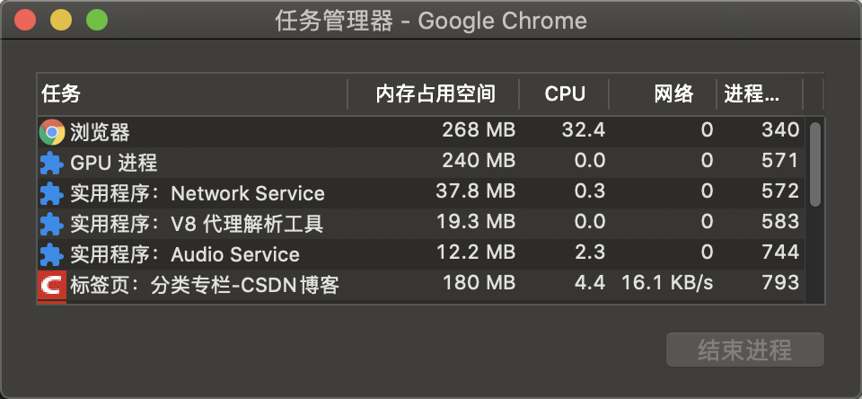
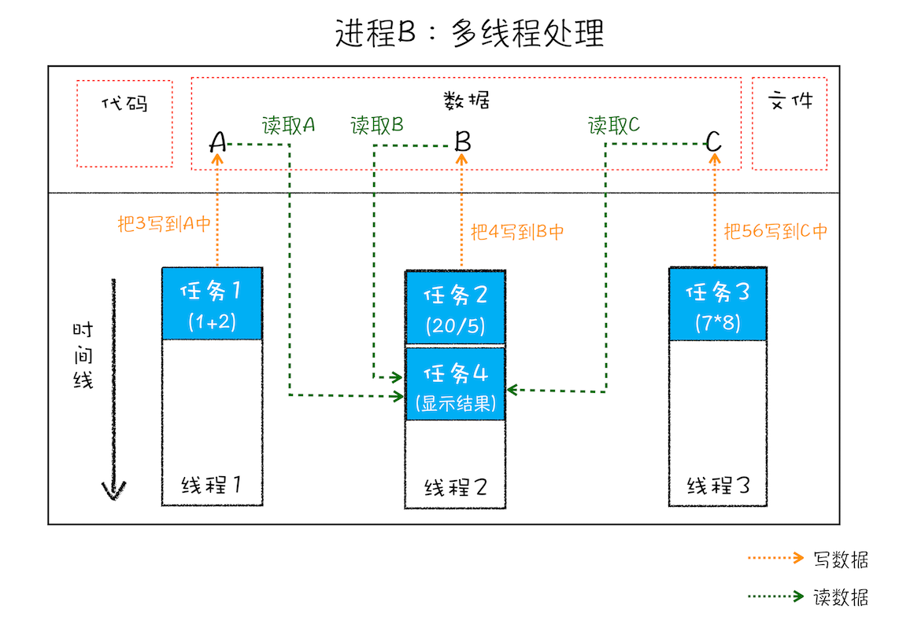
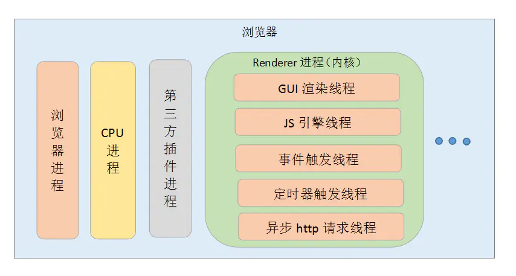

# 进程与线程

首先，可以看到，浏览器打开一个标签页，在任务管理器有四种进程：



打开任务管理器方法：菜单（浏览器右上角三个点）——更多工具——任务管理器。


## 1. 并行处理

在介绍进程和线程之前，先看一下什么是并行处理，理解并行处理的概念可以让我们更容易去理解进程和线程之间的关系。


计算机中的并行处理就是同一时刻处理多个任务，比如我们要计算下面这三个表达式的值，并显示出结果。

```
A = 1+2
B = 20/5
C = 7*8
```

在编写代码的时候，我们可以把这个过程拆分为四个任务：


任务 1 是计算 A=1+2；

任务 2 是计算 B=20/5；

任务 3 是计算 C=7*8；

任务 4 是显示最后计算的结果。


正常情况下程序可以使用单线程来处理，也就是分四步按照顺序分别执行这四个任务。如果采用多线程，只需分“两步走”：第一步，使用三个线程同时执行前三个任务；第二步，再执行第四个显示任务。


通过对比分析，我们发现使用并行处理能大大提升了性能。

## 2. 进程与线程

从本质上说，进程和线程都是 CPU 工作时间片的一个描述：

- 进程描述了 CPU 在运行指令及加载和保存上下文所需的时间，放在应用上来说就代表了一个程序。
- 线程是进程中的更小单位，描述了执行一段指令所需的时间。


一个进程就是一个程序的运行实例。详细解释就是，启动一个程序的时候，操作系统会为该程序创建一块内存，用来存放代码、运行中的数据和一个执行任务的主线程，我们把这样的一个运行环境叫**进程**。


**进程是运行在虚拟内存上的，虚拟内存是用来解决用户对硬件资源的无限需求和有限的硬件资源之间的矛盾的。从操作系统角度来看，虚拟内存即交换文件；从处理器角度看，虚拟内存即虚拟地址空间。**


如果程序很多时，内存可能会不够，操作系统为每个进程提供一套独立的虚拟地址空间，从而使得同一块物理内存在不同的进程中可以对应到不同或相同的虚拟地址，变相的增加了程序可以使用的内存。


对于上文中的例子，可以用下图来表示：


从图中可以看到，线程是依附于进程的，而进程中使用多线程并行处理能提升运算效率。


进程和线程之间的关系有以下四个特点：

**（1）进程中的任意一线程执行出错，都会导致整个进程的崩溃。**

**（2）线程之间共享进程中的数据。**

如下图所示，线程之间可以对进程的公共数据进行读写操作：



从上图可以看出，线程 1、线程 2、线程 3 分别把执行的结果写入 A、B、C 中，然后线程 2 继续从 A、B、C 中读取数据，用来显示执行结果。

**（3）当一个进程关闭之后，操作系统会回收进程所占用的内存**

当一个进程退出时，操作系统会回收该进程所申请的所有资源；即使其中任意线程因为操作不当导致内存泄漏，当进程退出时，这些内存也会被正确回收。

**（4）进程之间的内容相互隔离。**

进程隔离就是为了使操作系统中的进程互不干扰，每一个进程只能访问自己占有的数据，也就避免出现进程 A 写入数据到进程 B 的情况。正是因为进程之间的数据是严格隔离的，所以一个进程如果崩溃了，或者挂起了，是不会影响到其他进程的。如果进程之间需要进行数据的通信，这时候，就需要使用用于进程间通信的机制了。


说完这些，我们来看一下**Chrome浏览器的架构图**：


从图中可以看出，最新的 Chrome 浏览器包括：

- 1 个浏览器主进程
- 1 个 GPU 进程

- 1 个网络进程
- 多个渲染进程

- 多个插件进程


再来看一下这些进程的功能：

- **浏览器进程**：主要负责界面显示、用户交互、子进程管理，同时提供存储等功能。
- **渲染进程**：核心任务是将 HTML、CSS 和 JavaScript 转换为用户可以与之交互的网页，排版引擎 Blink 和 JavaScript 引擎 V8 都是运行在该进程中，默认情况下，Chrome 会为每个 Tab 标签创建一个渲染进程。出于安全考虑，渲染进程都是运行在沙箱模式下。

- **GPU 进程**：其实， GPU 的使用初衷是为了实现 3D CSS 的效果，只是随后网页、Chrome 的 UI 界面都选择采用 GPU 来绘制，这使得 GPU 成为浏览器普遍的需求。最后，Chrome 在其多进程架构上也引入了 GPU 进程。
- **网络进程**：主要负责页面的网络资源加载，之前是作为一个模块运行在浏览器进程里面的，直至最近才独立出来，成为一个单独的进程。

- **插件进程**：主要是负责插件的运行，因插件易崩溃，所以需要通过插件进程来隔离，以保证插件进程崩溃不会对浏览器和页面造成影响。


所以，**打开一个网页，最少需要四个进程**：1 个网络进程、1 个浏览器进程、1 个 GPU 进程以及 1 个渲染进程。如果打开的页面有运行插件的话，还需要再加上 1 个插件进程。


虽然多进程模型提升了浏览器的稳定性、流畅性和安全性，但同样不可避免地带来了一些问题：

- **更高的资源占用**：因为每个进程都会包含公共基础结构的副本（如 JavaScript 运行环境），这就意味着浏览器会消耗更多的内存资源。
- **更复杂的体系架构**：浏览器各模块之间耦合性高、扩展性差等问题，会导致现在的架构已经很难适应新的需求了。

## 3. 渲染进程的线程

说完进程，再来重点看一下浏览器的渲染进程的线程，总共有五种：


**（1）GUI渲染线程**

- 负责渲染浏览器页面，解析HTML、CSS，构建DOM树、CSSOM树、渲染树和绘制页面
- 当界面需要**重绘**或由于某种操作引发**回流**时，该线程就会执行


注意：GUI渲染线程和JS引擎线程是互斥的，当JS引擎执行时GUI线程会被挂起，GUI更新会被保存在一个队列中等到JS引擎空闲时立即被执行。


**（2）JS引擎线程**

- JS引擎线程也称为JS内核，负责处理Javascript脚本程序，解析Javascript脚本，运行代码；
- JS引擎线程一直等待着任务队列中任务的到来，然后加以处理，一个Tab页中无论什么时候都只有一个JS引擎线程在运行JS程序；


注意：GUI渲染线程与JS引擎线程的互斥关系，所以如果JS执行的时间过长，会造成页面的渲染不连贯，导致页面渲染加载阻塞。


**（3）时间触发线程**

- 属于浏览器而不是JS引擎，用来控制事件循环；
- 当JS引擎执行代码块如setTimeOut时（也可是来自浏览器内核的其他线程,如鼠标点击、AJAX异步请求等），会将对应任务添加到事件触发线程中；

- 当对应的事件符合触发条件被触发时，该线程会把事件添加到待处理队列的队尾，等待JS引擎的处理；


注意：由于JS的单线程关系，所以这些待处理队列中的事件都得排队等待JS引擎处理（当JS引擎空闲时才会去执行）；


**（4）定时器触发进程**

- 即setInterval与setTimeout所在线程；
- 浏览器定时计数器并不是由JS引擎计数的，因为JS引擎是单线程的，如果处于阻塞线程状态就会影响记计时的准确性；

- 因此使用单独线程来计时并触发定时器，计时完毕后，添加到事件队列中，等待JS引擎空闲后执行，所以定时器中的任务在设定的时间点不一定能够准时执行，定时器只是在指定时间点将任务添加到事件队列中；


注意：W3C在HTML标准中规定，定时器的定时时间不能小于4ms，如果是小于4ms，则默认为4ms。


**（5）异步http请求线程**

- XMLHttpRequest连接后通过浏览器新开一个线程请求；
- 检测到状态变更时，如果设置有回调函数，异步线程就产生状态变更事件，将回调函数放入事件队列中，等待JS引擎空闲后执行；



## 4. 进程与线程的关系与区别

**进程和线程的关系：**


（1）一个线程只能属于一个进程，而一个进程可以有多个线程，但至少有一个线程。

（2）资源分配给进程，同一进程的所有线程共享该进程的所有资源。

（3）线程在执行过程中，需要协作同步。不同进程的线程间要利用消息通信的办法实现同步。

（4）处理机分给线程，即真正在处理机上运行的是线程。

（5）线程是指进程内的一个执行单元，也是进程内的可调度实体。


**线程与进程的区别：**

（1）**根本区别**：进程是操作系统资源分配的基本单位，而线程是处理器任务调度和执行的基本单位

（2）**资源开销**：每个进程都有独立的代码和数据空间（程序上下文），程序之间的切换会有较大的开销；线程可以看做轻量级的进程，同一类线程共享代码和数据空间，每个线程都有自己独立的运行栈和程序计数器（PC），线程之间切换的开销小。

（3）**包含关系**：如果一个进程内有多个线程，则执行过程不是一条线的，而是多条线（线程）共同完成的；线程是进程的一部分，所以线程也被称为轻权进程或者轻量级进程。

（4）**内存分配**：同一进程的线程共享本进程的地址空间和资源，而进程之间的地址空间和资源是相互独立的

（5）**影响关系**：一个进程崩溃后，在保护模式下不会对其他进程产生影响，但是一个线程崩溃整个进程都死掉。所以多进程要比多线程健壮。

（6）**执行过程**：每个独立的进程有程序运行的入口、顺序执行序列和程序出口。但是线程不能独立执行，必须依存在应用程序中，由应用程序提供多个线程执行控制，两者均可并发执行。

## 5. 进程之前的通信方式

**（1）管道通信**

管道是一种最基本的进程间通信机制。管道就是操作系统在内核中开辟的一段缓冲区，进程1可以将需要交互的数据拷贝到这段缓冲区，进程2就可以读取了。


管道的特点：

- 只能单向通信
- 只能血缘关系的进程进行通信

- 依赖于文件系统
- 生命周期随进程

- 面向字节流的服务
- 管道内部提供了同步机制

**（2）消息队列通信**

消息队列提供了一种从一个进程向另一个进程发送一个数据块的方法。 每个数据块都被认为含有一个类型，接收进程可以独立地接收含有不同类型的数据结构。我们可以通过发送消息来避免命名管道的同步和阻塞问题。但是消息队列与命名管道一样，每个数据块都有一个最大长度的限制。

使用消息队列进行进程间通信，可能会收到数据块最大长度的限制约束等，这也是这种通信方式的缺点。如果频繁的发生进程间的通信行为，那么进程需要频繁地读取队列中的数据到内存，相当于间接地从一个进程拷贝到另一个进程，这需要花费时间。

**（3）信号量通信**

共享内存最大的问题就是多进程竞争内存的问题，就像类似于线程安全问题。我们可以使用信号量来解决这个问题。

信号量的本质就是一个计数器，用来实现进程之间的互斥与同步。例如信号量的初始值是 1，然后 a 进程来访问内存1的时候，我们就把信号量的值设为 0，然后进程b 也要来访问内存1的时候，看到信号量的值为 0 就知道已经有进程在访问内存1了，这个时候进程 b 就会访问不了内存1。所以说，信号量也是进程之间的一种通信方式。

**（4）信号通信**

信号（Signals ）是Unix系统中使用的最古老的进程间通信的方法之一。操作系统通过信号来通知进程系统中发生了某种预先规定好的事件（一组事件中的一个），它也是用户进程之间通信和同步的一种原始机制。

**（5）共享内存通信**

共享内存这个通信方式就可以很好着解决拷贝所消耗的时间了。系统加载一个进程的时候，分配给进程的内存并不是实际物理内存，而是虚拟内存空间。那么我们可以让两个进程各自拿出一块虚拟地址空间来，然后映射到相同的物理内存中，这样，两个进程虽然有着独立的虚拟内存空间，但有一部分却是映射到相同的物理内存，这就完成了内存共享机制了。

**（6）套接字通信**

上面我们说的共享内存、管道、信号量、消息队列，他们都是多个进程在一台主机之间的通信，那两个相隔几千里的进程能够进行通信吗？

答是必须的，这个时候 Socket 这家伙就派上用场了，例如我们平时通过浏览器发起一个 http 请求，然后服务器给你返回对应的数据，这种就是采用 Socket 的通信方式了。

## 6. 僵尸进程和孤儿进程是什么？

- **孤儿进程**：父进程退出了，而它的一个或多个进程还在运行，那这些子进程都会成为孤儿进程。孤儿进程将被init进程(进程号为1)所收养，并由init进程对它们完成状态收集工作。
- **僵尸进程**： 子进程比父进程先结束，而父进程又没有释放子进程占用的资源，那么子进程的进程描述符仍然保存在系统中。这种进程称之为僵死进程。

## 7. 死锁产生的原因？ 如果解决死锁的问题？

所谓死锁，是指多个进程在运行过程中因争夺资源而造成的一种僵局，当进程处于这种僵持状态时，若无外力作用，它们都将无法再向前推进。

**产生死锁的原因：**

系统中的资源可以分为两类：

- 可剥夺资源，是指某进程在获得这类资源后，该资源可以再被其他进程或系统剥夺，CPU和主存均属于可剥夺性资源；
- 不可剥夺资源，当系统把这类资源分配给某进程后，再不能强行收回，只能在进程用完后自行释放，如磁带机、打印机等。

**（1）竞争资源**

- 产生死锁中的竞争资源之一指的是竞争不可剥夺资源（例如：系统中只有一台打印机，可供进程P1使用，假定P1已占用了打印机，若P2继续要求打印机打印将阻塞）
- 产生死锁中的竞争资源另外一种资源指的是竞争临时资源（临时资源包括硬件中断、信号、消息、缓冲区内的消息等），通常消息通信顺序进行不当，则会产生死锁

**（2）进程间推进顺序非法**

若P1保持了资源R1，P2保持了资源R2，系统处于不安全状态，因为这两个进程再向前推进，便可能发生死锁。例如，当P1运行到P1：Request（R2）时，将因R2已被P2占用而阻塞；当P2运行到P2：Request（R1）时，也将因R1已被P1占用而阻塞，于是发生进程死锁

**产生死锁的必要条件：**

- 互斥条件：进程要求对所分配的资源进行排它性控制，即在一段时间内某资源仅为一进程所占用。
- 请求和保持条件：当进程因请求资源而阻塞时，对已获得的资源保持不放。

- 不剥夺条件：进程已获得的资源在未使用完之前，不能剥夺，只能在使用完时由自己释放。
- 环路等待条件：在发生死锁时，必然存在一个进程——资源的环形链。

**预防死锁的方法：**

- 资源一次性分配：一次性分配所有资源，这样就不会再有请求了（破坏请求条件）
- 只要有一个资源得不到分配，也不给这个进程分配其他的资源（破坏请保持条件）

- 可剥夺资源：即当某进程获得了部分资源，但得不到其它资源，则释放已占有的资源（破坏不可剥夺条件）
- 资源有序分配法：系统给每类资源赋予一个编号，每一个进程按编号递增的顺序请求资源，释放则相反（破坏环路等待条件）