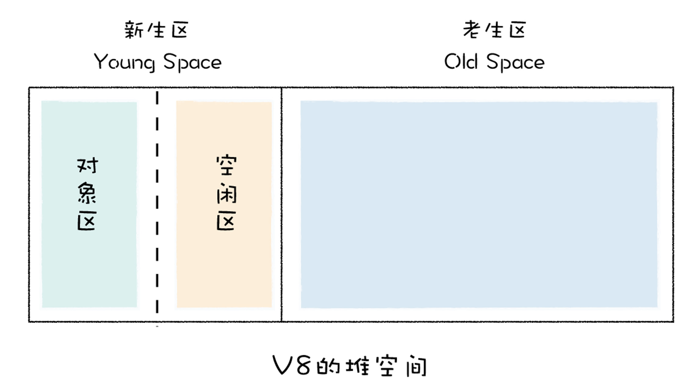

# 浏览器垃圾回收机制

## 1. JavaScript 内存管理机制

计算机程序语言都运行在对应的代码引擎上，其使用内存过程可以分为以下三个步骤：

1. 分配所需要的系统内存空间；
2. 使用分配到的内存进行读或写等操作；

1. 不需要使用内存时，将其空间释放或者归还。


在 JavaScript 中，当创建变量时，系统会自动给对象分配对应的内存，来看下面的例子：

```js
var a = 123; // 给数值变量分配栈内存
var etf = "ARK"; // 给字符串分配栈内存
// 给对象及其包含的值分配堆内存
var obj = {
  name: 'tom',
  age: 13
}; 
// 给数组及其包含的值分配内存
var a = [1, null, "PSAC"]; 
// 给函数（可调用的对象）分配内存
function sum(a, b){
  return a + b;
}
```

当系统发现这些变量不会再被使用时，会通过垃圾回收机制的方式来处理掉这些变量所占用的内存，而开发者不用过多关心内存问题。不过，在开发过程中也需要注意 JavaScript 的内存管理机制，以避免一些不必要的问题。


在 JavaScript 中数据类型分为两类：**简单类型和引用类型：**

- **基本类型**：这些类型在内存中会占据固定的内存空间，它们的值都保存在栈空间中，直接可以通过值来访问这些；
- **引用类型**：由于引用类型值大小不固定（比如上面的对象可以添加属性等），栈内存中存放地址指向堆内存中的对象，是通过引用来访问的。


栈内存中的基本类型，可以通过操作系统直接处理；而堆内存中的引用类型，正是由于可以经常变化，大小不固定，因此需要 JavaScript 的引擎通过垃圾回收机制来处理。


所谓的垃圾回收是指：**JavaScript代码运行时，需要分配内存空间来储存变量和值。当变量不在参与运行时，就需要系统收回被占用的内存空间。**


Javascript 具有自动垃圾回收机制，会定期对那些不再使用的变量、对象所占用的内存进行释放，原理就是找到不再使用的变量，然后释放掉其占用的内存。


JavaScript中存在两种变量：局部变量和全局变量。全局变量的生命周期会持续要页面卸载；而局部变量声明在函数中，它的生命周期从函数执行开始，直到函数执行结束，在这个过程中，局部变量会在堆或栈中存储它们的值，当函数执行结束后，这些局部变量不再被使用，它们所占有的空间就会被释放。不过，当局部变量被外部函数使用时，其中一种情况就是闭包，在函数执行结束后，函数外部的变量依然指向函数内部的局部变量，此时局部变量依然在被使用，所以不会回收。

## 2. Chrome 内存回收机制

Chrome浏览器的垃圾回收机制如下：

**1）第⼀步，通过 GC Root 标记空间中****活动对象****和****⾮活动对象****。** 

⽬前 V8 采⽤的**可访问性**（reachability）算法来判断堆中的对象是否是活动对象。这个算法是将⼀些 GC Root 作为初始存活的对象的集合，从 GC Roots 对象出发，遍历 GC Root 中所有对象： 

- 通过 GC Root 遍历到的对象是**可访问的**（reachable），那么必须保证这些对象应该在内存中保留，可访问的对象称为**活动对象**；
- 通过 GC Roots 没有遍历到的对象是**不可访问的**（unreachable），那么这些不可访问的对象就可能被回收，不可访问的对象称为**⾮活动对象**。 


在浏览器环境中，GC Root 有很多，通常包括了以下⼏种：

- 全局的 window 对象（位于每个 iframe 中）；
- 文档 DOM 树，由可以通过遍历文档到达的所有原生 DOM 节点组成；

- 存放栈上变量


**2）第⼆步，回收⾮活动对象所占据的内存。**其实就是在所有的标记完成之后，统⼀清理内存中所有被标记为可回收的对象。 

**3）第三步，做内存整理。**⼀般来说，频繁回收对象后，内存中就会存在⼤量不连续空间，这些不连续的内存空间称为内存碎⽚。当内存中出现了⼤量的内存碎⽚之后，如果需要分配较⼤的连续内存时，就有可能出现内存不⾜的情况，所以最后⼀步需要整理这些内存碎⽚。这步其实是可选的，因为有的垃圾回收器不会产⽣内存碎⽚，**⽐如副垃圾回收器。**


以上就是⼤致的垃圾回收的流程。⽬前 V8 采⽤了两个垃圾回收器，**主垃圾回收器 -MajorGC 和 副垃圾回收器 -Minor GC (Scavenger)**。V8 之所以使⽤了两个垃圾回收器，主要是受到了**代际假说**（The Generational Hypothesis）的影响。 代际假说是垃圾回收领域中⼀个重要的术语，它有以下两个特点： 

- 第⼀个是⼤部分对象都是“朝⽣夕死”的，也就是说⼤部分对象在内存中存活的时间很 短，⽐如函数内部声明的变量，或者块级作⽤域中的变量，当函数或者代码块执⾏结束时，作⽤域中定义的变量就会被销毁。因此这⼀类对象⼀经分配内存，很快就变得不可访 问；
- 第⼆个是不死的对象，会活得更久，⽐如全局的 window、DOM、Web API 等对象。


其实这两个特点不仅仅适⽤于 JavaScript，同样适⽤于⼤多数的动态语⾔，如 Java、Python 等。V8 的垃圾回收策略，就是建⽴在该假说的基础之上的。


接下来，来看看 V8 是如何实现垃圾回收的。 


如果只使⽤⼀个垃圾回收器，在优化⼤多数新对象的同时，就很难优化到那些⽼对象，因此需要权衡各种场景，根据对象⽣存周期的不同，⽽使⽤不同的算法，以便达到最好的效果。 所以，在 V8 中，**会****把堆分为新生代和老生代两个区域**，**新生代中存放的是生存时间短的对象，老生代中存放生存时间久的对象。**


新⽣代通常只⽀持 1～8M 的容量，⽽⽼⽣代⽀持的容量就⼤很多。对于这两块区域，V8分别使⽤两个不同的垃圾回收器，以便更⾼效地实施垃圾回收：

- 副垃圾回收器 -Minor GC (Scavenger)，主要负责新⽣代的垃圾回收。 
- 主垃圾回收器 -Major GC，主要负责⽼⽣代的垃圾回收。

### （1）副垃圾回收器

副垃圾回收器主要负责新⽣代的垃圾回收。通常情况下，⼤多数⼩的对象都会被分配到新⽣代，所以说这个区域虽然不⼤，但是垃圾回收还是⽐较频繁的。 新⽣代中的垃圾数据⽤ **Scavenge 算法**来处理。所谓 Scavenge 算法，是把新⽣代空间对半划分为两个区域，⼀半是对象区域 (from-space)，⼀半是空闲区域 (to-space)，如下图所示： 



新加⼊的对象都会存放到对象区域，当对象区域快被写满时，就需要执⾏⼀次垃圾清理操作。


在垃圾回收过程中，首先要对对象区域中的垃圾做标记；标记完成之后，就进入垃圾清理阶段。副垃圾回收器会把这些存活的对象复制到空闲区域中，同时它还会把这些对象有序地排列起来，所以这个复制过程，也就相当于完成了内存整理操作，复制后空闲区域就没有内存碎片了：


完成复制后，对象区域与空闲区域进行角色翻转，也就是原来的对象区域变成空闲区域，原来的空闲区域变成了对象区域。这样就完成了垃圾对象的回收操作，同时，这种角色翻转的操作还能让新生代中的这两块区域无限重复使用下去：


不过，副垃圾回收器每次执⾏清理操作时，都需要将存活的对象从对象区域复制到空闲区域，复制操作需要时间成本，如果新⽣区空间设置得太⼤了，那么每次清理的时间就会过久，所以**为了执⾏效率，⼀般新⽣区的空间会被设置得⽐较⼩****。** 


也正是因为新⽣区的空间不⼤，所以很容易被存活的对象装满整个区域，副垃圾回收器⼀旦监控对象装满了，便执⾏垃圾回收。同时，副垃圾回收器还会采⽤对象晋升策略，也就是移动那些经过两次垃圾回收依然还存活的对象到⽼⽣代中。 

### （2）主垃圾回收器

主垃圾回收器主要负责⽼⽣代中的垃圾回收。除了新⽣代中晋升的对象，⼀些⼤的对象会直接被分配到⽼⽣代⾥。因此，⽼⽣代中的对象有两个特点： 

- 对象占⽤空间⼤； 
- 对象存活时间⻓。


由于⽼⽣代的对象⽐较⼤，若要在⽼⽣代中使⽤ Scavenge 算法进⾏垃圾回收，复制这些⼤的对象将会花费⽐较多的时间，从⽽导致回收执⾏效率不⾼，同时还会浪费⼀半的空间。所以，主垃圾回收器是采⽤**标记 - 清除（Mark-Sweep）**的算法进⾏垃圾回收的。 


那么，标记 - 清除算法是如何⼯作的呢？


1）**首先是标记过程阶段。**标记阶段就是从一组根元素开始，递归遍历这组根元素，在这个遍历过程中，能到达的元素称为活动对象，没有到达的元素就可以判断为垃圾数据。


2）**接下来是垃圾清除过程**。它和副垃圾回收器的垃圾清除过程完全不同，主垃圾回收器会直接将标记为垃圾的数据清理掉。 


可以理解这个过程是清除掉下图中红⾊标记数据的过程，参考下图： 


对垃圾数据进⾏标记，然后清除，这就是标记 - 清除算法，不过对⼀块内存多次执⾏标记 - 清除算法后，会产⽣⼤量不连续的内存碎⽚。⽽碎⽚过多会导致⼤对象⽆法分配到⾜够的连续内存，于是⼜引⼊了另外⼀种算法——标记 - 整理（Mark-Compact）。 


这个算法的标记过程仍然与标记 - 清除算法⾥的是⼀样的，先标记可回收对象，但后续步骤不是直接对可回收对象进⾏清理，⽽是让所有存活的对象都向⼀端移动，然后直接清理掉这⼀端之外的内存。可以参考下图： 


## 3. 避免垃圾回收

虽然浏览器可以进行垃圾自动回收，但是当代码比较复杂时，垃圾回收所带来的代价比较大，所以应该尽量减少垃圾回收：

- **对数组进行优化：**在清空一个数组时，最简单的方法就是给其赋值为[ ]，但是与此同时会创建一个新的空对象，我们可以将数组的长度设置为0，以此来达到清空数组的目的。
- **对**`**object**`**进行优化：**对象尽量复用，对于不再使用的对象，就将其设置为null，尽快被回收。

- **对函数进行优化：**在循环中的函数表达式，如果可以复用，尽量放在函数的外面。

## 4. 内存泄漏与优化

内存泄漏是指在 JavaScript 中，已经分配堆内存地址的对象由于长时间未释放或者无法释放，造成了长期占用内存，使内存浪费，最终会导致运行的应用响应速度变慢以及最终崩溃的情况。这种就是内存泄漏，在日常开发和使用浏览器过程中内存泄漏的场景：

- 过多的缓存未释放；
- 闭包太多未释放；

- 定时器或者回调太多未释放；
- 太多无效的 DOM 未释放；

- 全局变量太多未被发现。


以上这些现象会在开发或者使用中造成内存泄漏，以至于浏览器卡顿、不响应、页面打不开等问题产生。遇到这些场景需要注意：


**（1）减少不必要的全局变量，使用严格模式避免意外创建全局变量。**

```js
function foo() {
    // 全局变量=> window.bar
    this.bar = '默认this指向全局';
    // 没有声明变量，实际上是全局变量=>window.bar
    bar = '全局变量'; 
}
foo();
```

这段代码中，函数内部绑定了太多的 this 变量，this 下的属性默认都是绑定到 window 上的属性，均为全局变量。


（2）**在使用完数据后，及时解除引用（闭包中的变量，DOM 引用，定时器清除）。**

```js
var someResource = getData();
setInterval(function() {
    var node = document.getElementById('Node');
    if(node) {
        node.innerHTML = JSON.stringify(someResource));
        // 定时器也没有清除，可以清除掉
    }
    // node、someResource 存储了大量数据，无法回收
}, 1000);
```

上面代码中就缺少清除 setInterval 的代码，如果循环函数有对外部变量的引用的话，那么这个变量会被一直留在内存中，而无法被回收。


**（3）组织好代码逻辑，避免死循环等造成浏览器卡顿、崩溃的问题。**

对于一些比较占用内存的对象提供手工释放内存的方法，请看下面代码：

```js
var leakArray = [];
exports.clear = function () {
    leakArray = [];
}
```

这段代码提供了清空该数组内容的方法，使用完成之后可以根据合适业务时机进行操作释放。这样就能较好地避免对象数据量太大造成的内存溢出的问题。


**（4）避免不合理的使用闭包，从而导致某些变量一直被留在内存当中。**