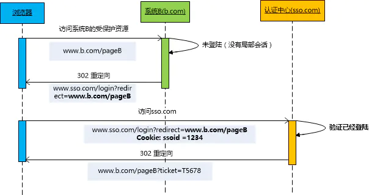

# 前端登录详解

登录是多数网站都有的功能，这里面也涉及到很多问题和知识，常见的登录方式有以下几种：


- Cookie + Session 登录
- Token 登录

- SSO 单点登录
- OAuth 第三方登录


下面就来学习一下这些登录方式。

## 1.  Cookie + Session 登录

### 1.1 概述

**（1）Cookie：**

HTTP 是一种**无状态**的协议，客户端每次发送请求时，首先要和服务器端建立一个连接，在请求完成后又会断开这个连接。这种方式可以节省传输时占用的连接资源，但同时也存在一个问题：每次请求都是独立的，服务器端无法判断本次请求和上一次请求是否来自同一个用户，进而也就无法判断用户的登录状态。


为了解决这个问题，Cookie出现了，Cookie 是由客户端保存的小型文本文件，其内容为一系列的键值对。Cookie 是由 HTTP 服务器设置的，保存在浏览器中。Cookie会随着 HTTP请求一起发送。


**（2）Session：**

有了Cookie，服务端就可以知道是哪个用户传来的信息了，如果要对信息进行验证，还需要通过Session。客户端在请求服务端时，服务端会为这次请求开辟一次内存空间，这就是Session对象，这样就可以进行登录验证了。


Session 存储在服务器端的，避免在客户端 Cookie 中存储敏感数据。Session 可以存储在 HTTP 服务器的内存中，也可以存在内存数据库（如redis）中。


**（3）认证机制：**

Cookie/Session认证机制就是为一次请求认证在服务端创建一个Session对象，同时在客户端的浏览器端创建了一个Cookie对象；通过客户端带上来Cookie对象来与服务器端的session对象匹配来实现状态管理的。默认的，当我们关闭浏览器的时候，cookie会被删除。但可以通过修改cookie 的expire time使cookie在一定时间内有效。

### 1.2 实现流程

**（1）用户在首次登录的时候：**


用户在登录时，输入账号密码发送HTTP请求，服务器验证账号密码之后，服务端会创建SessionId，并将它保存起来。服务端响应这个HTTP请求，并通过Set-Cookie头信息，将SessionId写入到Cookie中。


**（2）在第一次登录完成之后，后面就直接通过Cookie来进行身份验证:**


用户再次发送请求的时候，会自动带上第一次登录写入的Cookie，服务端会将Cookie中的SessionId和保存在服务端的SessionId进行对比，如果一致，身份验证就成功了，否则就验证失败。


这样就完成了用户的身份验证。

### 1.3 特点

虽然这种方式完成了用户的身份验证，但是也存在一定问题：

- **维护成本高：** 如果服务器端是一个集群，为了同步登录态，需要将 SessionId 同步到每一台机器上，无形中增加了服务器端维护成本。
- **服务器压力增大**：通常session是存储在内存中的，每个用户通过认证之后都会将session数据保存在服务器的内存中，而当用户量增大时，服务器的压力增大。

- **CSRF跨站伪造请求攻击**：session是基于cookie进行用户识别的, cookie如果被截获，用户就会很容易受到跨站请求伪造的攻击。可以添加csrf_token处理。
- **扩展性不强**：如果将来搭建了多个服务器，虽然每个服务器都执行的是同样的业务逻辑，但是session数据是保存在内存中的（不是共享的），用户第一次访问的是服务器1，当用户再次请求时可能访问的是另外一台服务器2，服务器2获取不到session信息，就判定用户没有登陆过。

- **手机请求不支持**：Cookie不支持手机端访问的

## 2. Token 登录

为了解决上面登录验证的方式的一些痛点，出现了Token登录验证的方式。

### 2.1 概述

Token 是服务端生成的一串字符串，以作为客户端请求的一个令牌。当第一次登录后，服务器会生成一个 Token 并返回给客户端，客户端后续访问时，只需带上这个 Token 即可完成身份认证。


**登录机制：**

- 登录时,客户端通过用户名与密码请求登录
- 服务端收到请求去验证用户名与密码

- 验证通过，服务端会签发一个带签名的Token，再把这个Token以响应发给客户端
- 客户端收到Token,存储到本地,如Cookie、SessionStorage、LocalStorage

- 客户端每次像服务器请求API接口时候，都要带上Token
- 服务端收到请求，验证Token，如果通过就返回数据，否则提示报错信息

### 2.2 实现流程

**（1）首次登录时：**


用的在登录时，输入账号密码，服务器会验证账号密码，验证无误后会创建Token，然后将Token返回给客户端，客户端将其保存下来。


**（2）在第一次登录完成之后，后面就直接通过Token来进行身份验证:**


用户再次发起请求时，需要带上之前保存在本地内存的Token，服务器端验证成功之后，则身份验证成功，响应客户端的请求。

### 2.3 特点

- **无状态、可扩展**：在客户端存储的Tokens是无状态的，并且能够被扩展。基于这种无状态和不存储Session信息，负载负载均衡器能够将用户信息从一个服务传到其他服务器上。
- **安全性**：请求中发送token而不再是发送cookie能够防止CSRF(跨站请求伪造)。即使在客户端使用cookie存储token，cookie也仅仅是一个存储机制而不是用于认证。不将信息存储在Session中，少了对session操作。

- **时效：** Token 下发之后，只要在生效时间之内，就一直有效，如果服务器端想收回此 Token 的权限，并不容易。如果失效，就会重新进行登录验证，服务器端会返回状态码401


需要注意的是，前端每次路由跳转时，需要判断本地内存中有无 token ，没有则跳转到登录页。有则请求获取用户信息，改变登录状态。

### 2.4 Token生成方式

最常见的 Token 生成方式是使用 JWT（Json Web Token），jwt实际上就是一个字符串，它由三部分组成：头部、载荷与签名，这三个部分都是json格式。

- **头部**：用于描述关于该JWT的最基本的信息，例如其类型以及签名所用的算法等。


```js
{  "typ": "JWT",  "alg": "HS256"}
在这里，我们说明了这是一个JWT，并且我们所用的签名算法是HS256算法。
```


- **载荷**：可以用来放一些不敏感的信息。
- **签名**：将上面拼接完的字符串用HS256算法进行加密。在加密的时候，我们还需要提供一个密钥（secret）。加密后的内容也是一个字符串，最后这个字符串就是签名，把这个签名拼接在刚才的字符串后面就能得到完整的jwt。header部分和payload部分如果被篡改，由于篡改者不知道密钥是什么，也无法生成新的签名部分，服务端也就无法通过，在jwt中，消息体是透明的，使用签名可以保证消息不被篡改。


补充一下**Session和JWT的区别：**

- **对于用户的状态保存的位置**：session是保存在服务端的，而jwt是保存在客户端的。
- **对于安全性**：由于jwt的payload是使用base64编码的，并没有加密，因此jwt中不能存储敏感数据。而session的信息是存在服务端的，相对来说更安全。

- **对于两者长度**：jwt太长，cookie的限制大小一般是4k，cookie很可能放不下，所以jwt一般放在local storage里面。而sessionId只是很短的一个字符串，因此使用jwt的http请求比使用session的开销大得多。
- **对于使用时间**： jwt是一次性的。如果想修改里面的内容，就必须签发一个新的jwt。

- **对于扩展性**：jwt可扩展性好，在应用程序分布式部署的情况下，session需要做多机数据共享，通常可以存在数据库或者redis里面。而jwt不需要。
- **对于实用性**：jwt的载荷中可以存储一些常用信息，用于交换信息，有效地使用 JWT，可以降低服务器查询数据库的次数。

## 3. SSO 单点登录

上面Token验证方式已经是比较完美的一中身份验证方式了，下面再来介绍一下单点登录的验证方式。

### 3.1 概述

单点登录（Single Sign On），简称为 SSO，是目前比较流行的企业业务整合的解决方案之一。SSO的定义是在多个应用系统中，用户只需要登录一次就可以访问所有相互信任的应用系统。


SSO一般都需要一个独立的认证中心（passport），子系统的登录均得通过passport，子系统本身将不参与登录操作，当一个系统成功登录以后，passport将会颁发一个令牌给各个子系统，子系统可以拿着令牌会获取各自的受保护资源，为了减少频繁认证，各个子系统在被passport授权以后，会建立一个局部会话，在一定时间内可以无需再次向passport发起认证。

### 3.2 登录实现流程

**（1）用户首次访问时，需要在认证中心登录：**


- 首先用户访问网站  a.com 下的 pageA 页面。由于没有登录，则会重定向到认证中心，并带上回调地址 `www.sso.com?return_uri=a.com/pageA`，以便登录后直接进入对应页面。
- 用户在认证中心输入账号密码，提交登录。

- 认证中心验证账号密码有效，然后重定向  `a.com?ticket=123` 带上授权码 ticket，并将认证中心 sso.com 的登录态写入 Cookie。
- 在 a.com 服务器中，拿着 ticket 向认证中心确认，授权码 ticket 真实有效。

- 验证成功后，服务器将登录信息写入 Cookie，返回给客户端，并保存下来（此时客户端有 2 个 Cookie 分别存有 a.com 和 sso.com 的登录态）。


**（2）认证中心登录完成之后，继续访问 a.com 下的其他页面**


这时，由于 a.com 存在已登录的 Cookie 信息，所以服务器端直接认证成功。


**（3）如果认证中心登录完成之后，访问 b.com 下的页面：**



这时由于认证中心存在之前登录过的 Cookie，所以也不用再次输入账号密码，直接返回第 3 步，下发 ticket 给 b.com 即可。

### 3.3 退出实现流程

这样我们已经完成了单点登录，在同一套认证中心的管理下，多个产品可以共享登录态。那么问题来了：在一个产品中退出了登录，怎么让其他的产品也都退出登录？


我们可以看看上面的第四步，每一个产品在向认证中心验证 ticket 时，其实可以顺带将自己的退出登录 api 发送到认证中心。


当某个产品 c.com 退出登录时：

- 清空 c.com 中的登录态 Cookie。
- 请求认证中心 sso.com 中的退出 api。

- 认证中心遍历下发过 ticket 的所有产品，并调用对应的退出 api，完成退出。

### 3.4  特点

**（1）优点：**

- 简化管理
- 提高用户的效率

- 提高开发人员的效率
- 用户不再被多次登录困扰，也不需要记住多个 ID 和   密码。

- SSO 为开发人员提供了一个通用的身份验证框架。 实际上，如果 SSO 机制是独立的，那么开发人员就完全不需要为身份验证操心。


如果应用程序加入了单点登录协议，管理用户帐号的负担就会减轻。简化的程度取决于应用程序，因为 SSO 只处理身份验证。所以，应用程序可能仍然需要设置用户的属性（比如访问特权）。


**（2）缺点：**

- **CPU开销较大**：在并发量比较高的情况下，如果许多线程反复尝试更新某一个变量，却又一直更新不成功，循环往复，会给CPU带来很大的压力。
- **安全隐患** ：因为只需要登录一次，所有的授权的应用系统都可以访问，可能导致一些很重要的信息泄露。

- **不利于重构** ：因为涉及到的系统很多，要重构必须要兼容所有的系统，可能很耗时

## 4. OAuth 第三方登录

### 4.1 概述

单点登录完成了多产品的登录态共享，但都是建立在一套统一的认证中心下，过程有些复杂。实际上很多大厂为我们提供了第三方的登录服务，可以直接通过第三方的账号登录自己的应用。


所谓第三方登录，实质就是 OAuth 授权。用户想要登录 A 网站，A 网站让用户提供第三方网站的数据，证明自己的身份。获取第三方网站的身份数据，就需要 OAuth 授权。


OAuth 是 Open Authorization 的简写，它为用户资源的授权提供了一个安全又简易的标准。与以往的授权方式不同之处是 OAuth的授权不会使第三方触及到用户的帐号信息（如用户名与密码），即第三方无需使用用户的用户名与密码就可以申请获得该用户资源的授权，因此 OAuth是安全的。


OAuth 本身不存在一个标准的实现，后端开发者自己根据实际的需求和标准的规定实现。其步骤一般如下：

- 第三方要求用户给予授权
- 用户同意授权

- 根据上一步获得的授权，第三方向认证服务器请求令牌（token）
- 认证服务器对授权进行认证，确认无误后发放令牌

- 第三方使用令牌向资源服务器请求资源
- 资源服务器使用令牌向认证服务器确认令牌的正确性，确认无误后提供资源

### 4.2 实现流程

下面就来看一下用的QQ登录流程，以下内容来自腾讯开放平台QQ登录开发文档：[链接](https://wiki.open.qq.com/wiki/【QQ登录】Qzone_OAuth2.0简介)。


首先要申请appid和appkey，申请完之后，才能进行QQ登录的流程。


QQ登录OAuth2.0的处理流程主要包括以下三个步骤：

- 获取access_token；
- 根据access_token获得对应用户身份的openid；

- 根据access_token与openid调用OpenAPI，来请求访问或修改用户授权的资源（例如用户资料，日志，相册，说说等信息）。


为方便网站快速接入，QQ登录提供了JS SDK，粘贴代码到网页，即可实现QQ登录功能。

为方便移动应用快速接入，QQ登录提供了Android SDK和IOS SDK，应用只需要修改少量代码，即可快速实现QQ登录功能。


**Step1：获取access_token**

QQ登录OAuth2.0针对网站、移动应用、桌面应用分别提供了不同的登录验证和授权流程，目前提供以下2种获取access token的方式：


- server-side模式：即OAuth官方文档中提到的Authorization Code模式，适用于需要从web server访问的应用。
- client-side模式：即OAuth官方文档中提到的Implicit模式，适用于需要通过客户端访问的方式。


以上两种模式仅在获取access_token时有所区别，后续获取openid、调用API等方式均相同。


登录成功后，开发者会得到表示此次登录信息的access token，此参数在访问用户授权信息中会用到。


access token由每次用户登录时生成，过期时间默认为三个月，用户再次登录时自动刷新。


**Step2：根据access_token获得对应用户身份的openid**


请求地址：PC网站：https://graph.qq.com/oauth2.0/me

请求方法：GET

请求参数：`access_token`	该参数是必须的，是在Step1中获取到的access token。

返回说明：PC网站接入时，获取到用户OpenID，返回包如下：


```js
callback( {"client_id":"YOUR_APPID","openid":"YOUR_OPENID"} );
```


openid是此网站上唯一对应用户身份的标识，网站可将此ID进行存储便于用户下次登录时辨识其身份，或将其与用户在网站上的原有账号进行绑定。


错误码说明：接口调用有错误时，会返回code和msg字段，以url参数对的形式返回，value部分会进行url编码（UTF-8）。


PC网站接入时，错误码详细信息请参见：100000-100031：PC网站接入时的公共返回码。


**Step3：调用OpenAPI，来请求访问或修改用户授权的资源**

调用OpenAPI时需要用到如下3个值：


- `YOUR_APP_ID`：即申请QQ登录成功后分配的appid（如222222）
- `YOUR_ACCESS_TOKEN`：Step1获取到的access token，必须保证未过期（如E0632E6CE12AC709999）

- `YOUR_OPENID`：Step2获取到的openid，用户唯一标识（如B9DD537D1C5C98A9999）


下面以在慕课网使用QQ登录的流程：


### 4.3 OAuth2.0基本流程


**步骤详解：**


（1） `Authorization Request`， 第三方请求用户授权

（2） `Authorization Grant`，用户同意授权后，会从服务方获取一次性用户授权凭据(如code码)给第三方

（3）`Authorization Grant`，第三方会把授权凭据以及服务方给它的的身份凭据(如AppId)一起交给服务方的向认证服务器申请访问令牌

（4）`Access Token`，认证服务器核对授权凭据等信息，确认无误后，向第三方发送访问令牌Access Token等信息

（5）`Access Token`，通过这个Access Token向Resource Server索要数据

（6）`Protected Resource`，资源服务器使用令牌向认证服务器确认令牌的正确性，确认无误后提供资源


这样服务方，一可以确定第三方得到了用户对此次服务的授权（根据用户授权凭据），二可以确定第三方的身份是可以信任的（根据身份凭据），所以，最终的结果就是，第三方顺利地从服务方获取到了此次所请求的服务


从上面的流程中可以看出，OAuth2.0完整地解决了**用户**、**服务方**、**第三方** 在某次服务时这三者之间的信任问题。


在OAuth2.0中，简单来说有三方：**用户**（这里是指属于服务方的用户）、**服务方**（如微信、微博等）、**第三方应用**：

- 服务方不信任用户，所以需要用户提供密码或其他可信凭据
- 服务方不信任第三方应用，所以需要第三方提供自已交给它的凭据（如微信授权的code,AppID等）

- 用户部分信任第三方应用，所以用户愿意把自已在服务方里的某些服务交给第三方使用，但不愿意把自已在服务方的密码等交给第三方应用

## 5. 使用场景

对于这 4 种常见的登录方式，它们的使用场景如下：

- Cookie + Session ：适合于简单的后端架构，需开发人员自己处理好安全问题。
- Token ：方案对后端压力小，适合大型分布式的后端架构，但已分发出去的 token ，如果想收回权限，就不是很方便了。

- SSO ：单点登录，适用于中大型企业，想要统一内部所有产品的登录方式。
- OAuth 第三方登录：简单易用，对用户和开发者都友好，但第三方平台很多，需要选择合适自己的第三方登录平台。