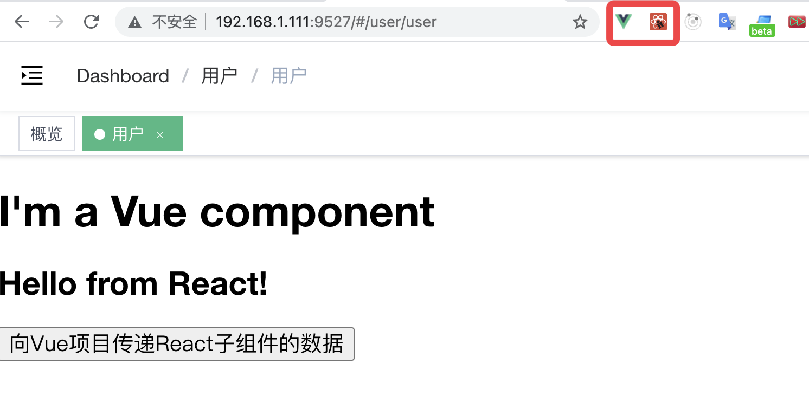
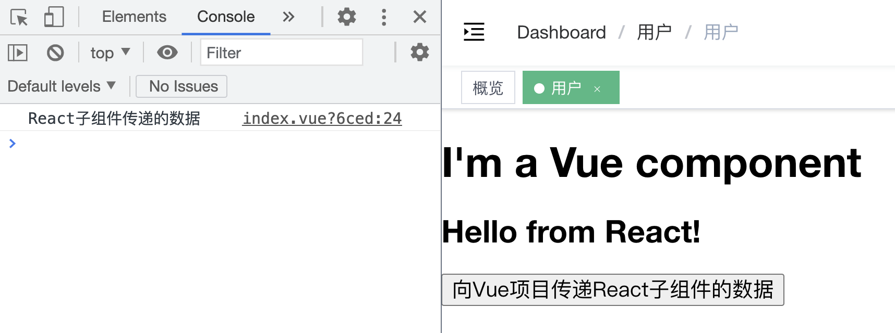

# 在Vue项目中使用React组件，在React项目中使用Vue组件

需求：在Vue项目中使用已经开发好的React组件。这里使用vuera库来完成。下面是使用的步骤（在Reat项目中使用Vue组件与此步骤类似）。


## 1. 安装vuera库

vuera库地址：https://www.npmjs.com/package/vuera


首先需要在Vue项目中安装vuera库，安装指令如下：

```vue
// 使用yarn安装插件
yarn add vuera

// 使用npm安装插件
npm i -S vuera
```

## 2. 安装依赖

由于我们需要在Vue中使用React组件，所以首先需要在项目中安装React，安装指令如下：

```js
npm install --save react react-dom
```

在Vue中，是无法识别jsx语法的，所以需要安装依赖来识别react-jsx语法，安装指令如下：

```js
npm install @babel/plugin-transform-react-jsx
```

安装完成之后，在babel.config.js文件中添加这个插件即可：

```js
module.exports = {
  plugins: ["@babel/plugin-transform-react-jsx"]
};
```

## 3. 项目配置

接下来在项目中以插件的形式来引入并使用vuera库，我们需要在main.js中加入如下代码：

```js
import { VuePlugin } from 'vuera'
Vue.use(VuePlugin)
```

## 4. 使用组件

完成上述配置之后，就可以在Vue项目中引入并使用React组件了。


React组件代码如下：

```jsx
import React from 'react'

function myReactComponent(props) {
  const { message } = props
  function childClickHandle() {
    props.onMyEvent('React子组件传递的数据')
  }
  return (
    <div>
      <h2>{ message }</h2>
      <button onClick={ childClickHandle }>向Vue项目传递React子组件的数据</button>
    </div>
  )
}

export default myReactComponent
```

Vue组件代码如下：

```vue
<template>
    <div>
        <h1>I'm a Vue component</h1>
        <my-react-component :message="message" @onMyEvent="parentClickHandle"/>
    </div>
</template>

<script>
    // 引入React组件
    import MyReactComponent from './myReactComponent'

    export default {
        components: {
            'my-react-component': MyReactComponent  // 引入React组件
        },
        data() {
            return {
                message: 'Hello from React!',
            }
        },
        methods: {
            parentClickHandle(data){
                console.log(data);
            }
        },
    }
</script>
```

这里在一个已有Vue项目中引入了这个React组件，效果如下：



可以看到，这里实现了Vue到React组件的传值，并显示在了页面上。根据右上角的Chrome插件显示，这个项目中既使用到了Vue又使用到了React。


点击页面中的按钮，可以看到，数据从React子组件传递到了Vue中：



这样就简单实现了React和Vue组件之间的数据通信。

## 5. 其他使用方式

上面使用Vue插件的形式在Vue项目中嵌入了React组件，如果不想使用Vue插件的形式，还可以使用其他的两种形式来使用vuera库。


**（1）使用****wrapper组件**

```vue
<template>
  <div>
    <react :component="component" :message="message" />
  </div>
</template>
 
<script>
  import { ReactWrapper } from 'vuera'  // 引入vuera库
  import MyReactComponent from './MyReactComponent'  // 引入react组件
 
  export default {
    data () {
      component: MyReactComponent,
      message: 'Hello from React!',
    },
    components: { react: ReactWrapper }
  }
</script>
```

**（2）使用高阶组件的API**

```vue
<template>
  <div>
    <my-react-component :message="message" />
  </div>
</template>
 
<script>
  import { ReactWrapper } from 'vuera'  // 引入vuera库
  import MyReactComponent from './MyReactComponent'  // 引入react组件
 
  export default {
    data () {
      message: 'Hello from React!',
    },
    components: { 'my-react-component': ReactInVue(MyReactComponent) }
  }
</script>
```