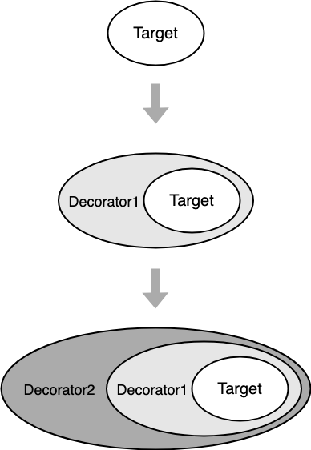

# 装饰器模式

## 1. 什么是装饰器模式？

装饰器模式，又名装饰者模式。它的定义是“**在不改变原对象的基础上，通过对其进行包装拓展，使得原有对象可以动态具有更多功能，从而满足用户的更复杂需求**”。


装饰器模式的本质是功能动态组合，即动态地给一个对象添加额外的职责，就增加功能角度来看，使用装饰器模式比用继承更为灵活。好处就是有效地把对象的核心职责和装饰功能区分开，并且通过动态增删装饰去除目标对象中重复的装饰逻辑。


我们在买房之后，就可以居住了。但是，往往会对房屋进行装饰，通水电、刷漆、铺地板、购置家具，安装家电等等。这样，就让房屋就有了各种各样的特性，刷漆、铺地板之后房子变的更美观了；摆放家具、家电之后，房屋就更加便捷了等等。但是，我们并没有改变房子是用来居住的基本功能，这就是装饰的作用。


我们好多人喜欢给手机买手机壳，装上手机壳之后，手机就变得更加耐磨，耐摔，更加好看等，但是并没有改变手机的功能，只是对其进行了装饰。


这两个例子中，都有以下特点：

- 装饰不影响原有的功能，原有功能可以照常使用；
- 装饰可以增加多个，共同给目标对象添加额外功能。

## 2. 装饰器模式的原理

装饰器模式的原理：



可以从上图看出，在表现形式上，装饰器模式和适配器模式比较类似，都属于包装模式。在装饰器模式中，一个对象被另一个对象包装起来，形成一条包装链，并增加了原先对象的功能。

## 3. 装饰器模式的使用场景

### （1）给浏览器事件添加新功能

添加装饰器函数常被用来给原有浏览器或 DOM 绑定事件上绑定新的功能，比如在 `onload` 上增加新的事件，或在原来的事件绑定函数上增加新的功能，或者在原本的操作上增加用户行为埋点：

```js
window.onload = function() {
    console.log('原先的 onload 事件 ')
}
/* 发送埋点信息 */
function sendUserOperation() {
    console.log('埋点：用户当前行为路径为 ...')
}
/* 将新的功能添加到 onload 事件上 */
window.onload = function() {
    var originOnload = window.onload
    return function() {
        originOnload && originOnload()
        sendUserOperation()
    }
}()
// 输出： 原先的 onload 事件
// 输出： 埋点：用户当前行为路径为 ...
```

可以看到通过添加装饰函数，为 `onload` 事件回调增加新的方法，且并不影响原本的功能，可以把上面的方法提取出来作为一个工具方法：

```js
window.onload = function() {
    console.log('原先的 onload 事件 ')
}
/* 发送埋点信息 */
function sendUserOperation() {
    console.log('埋点：用户当前行为路径为 ...')
}
/* 给原生事件添加新的装饰方法 */
function originDecorateFn(originObj, originKey, fn) {
    originObj[originKey] = function() {
        var originFn = originObj[originKey]
        return function() {
            originFn && originFn()
            fn()
        }
    }()
}
// 添加装饰功能
originDecorateFn(window, 'onload', sendUserOperation)
// 输出： 原先的 onload 事件
// 输出： 埋点：用户当前行为路径为 ...
```

### （2）给浏览器事件添加新功能

下面再看一个场景：点击一个按钮后，如果用户还未登录，就弹窗提示用户“您还未登录哦~”。

```js
<body>
    <button id='open'>点击打开</button>
    <button id='close'>关闭弹框</button>
</body>
<script>
    // 弹框创建逻辑，这里我们复用了单例模式面试题的例子
    const Modal = (function() {
        let modal = null
        return function() {
            if(!modal) {
                modal = document.createElement('div')
                modal.innerHTML = '您还未登录哦~'
                modal.id = 'modal'
                modal.style.display = 'none'
                document.body.appendChild(modal)
            }
            return modal
        }
    })()
    
    // 点击打开按钮展示模态框
    document.getElementById('open').addEventListener('click', function() {
        // 未点击则不创建modal实例，避免不必要的内存占用
        const modal = new Modal()
        modal.style.display = 'block'
    })
    
    // 点击关闭按钮隐藏模态框
    document.getElementById('close').addEventListener('click', function() {
        const modal = document.getElementById('modal')
        if(modal) {
            modal.style.display = 'none'
        }
    })
</script>
```

后来因为业务需求的变更，要求在弹框被关闭后把按钮的文案改为“快去登录”，同时把按钮置灰。


这个需求更改看起来比较简单，但是，可能不止有一个按钮有这个需求，那有可能还要更该很多代码。况且，直接去修改已有的函数体的话，就违背了“开放封闭原则”；在一个函数体中写很多逻辑，就违背了“单一职责原则”。


我们要做的就是将原来的逻辑与新的逻辑分离，将旧的逻辑抽离出来：

```js
// 将展示Modal的逻辑单独封装
function openModal() {
    const modal = new Modal()
    modal.style.display = 'block'
}
```

编写新逻辑：

```js
// 按钮文案修改逻辑
function changeButtonText() {
    const btn = document.getElementById('open')
    btn.innerText = '快去登录'
}
// 按钮置灰逻辑
function disableButton() {
    const btn =  document.getElementById('open')
    btn.setAttribute("disabled", true)
}
// 新版本功能逻辑整合
function changeButtonStatus() {
    changeButtonText()
    disableButton()
}
```

然后把三个操作逐个添加open按钮的监听函数里：

```js
document.getElementById('open').addEventListener('click', function() {
    openModal()
    changeButtonStatus()
})
```

这样，就实现了“只添加，不修改”的装饰器模式，使用`changeButtonStatus`的逻辑装饰了旧的按钮点击逻辑。


以上是ES5中的实现，ES6中，可以以一种更加面向对象化的方式去写：

```js
// 定义打开按钮
class OpenButton {
    // 点击后展示弹框（旧逻辑）
    onClick() {
        const modal = new Modal()
        modal.style.display = 'block'
    }
}
// 定义按钮对应的装饰器
class Decorator {
    // 将按钮实例传入
    constructor(open_button) {
        this.open_button = open_button
    }
    
    onClick() {
        this.open_button.onClick()
        // “包装”了一层新逻辑
        this.changeButtonStatus()
    }
    
    changeButtonStatus() {
        this.changeButtonText()
        this.disableButton()
    }
    
    disableButton() {
        const btn =  document.getElementById('open')
        btn.setAttribute("disabled", true)
    }
    
    changeButtonText() {
        const btn = document.getElementById('open')
        btn.innerText = '快去登录'
    }
}
const openButton = new OpenButton()
const decorator = new Decorator(openButton)
document.getElementById('open').addEventListener('click', function() {
    // openButton.onClick()
    // 此处可以分别尝试两个实例的onClick方法，验证装饰器是否生效
    decorator.onClick()
})
```

这里把按钮实例传给了 Decorator，以便于后续 Decorator 可以对它进行逻辑的拓展。

## 4. 装饰器模式的优缺点

**装饰器模式的优点：**

- **可维护性高：** 我们经常使用继承的方式来实现功能的扩展，但这样会给系统中带来很多的子类和复杂的继承关系，装饰器模式允许用户在不引起子类数量暴增的前提下动态地修饰对象，添加功能，装饰器和被装饰器之间松耦合，可维护性好；
- **灵活性好：** 被装饰器可以使用装饰器动态地增加和撤销功能，可以在运行时选择不同的装饰器，实现不同的功能，灵活性好；

- **复用性高：** 装饰器模式把一系列复杂的功能分散到每个装饰器当中，一般一个装饰器只实现一个功能，可以给一个对象增加多个同样的装饰器，也可以把一个装饰器用来装饰不同的对象，有利于装饰器功能的复用；
- **多样性：** 可以通过选择不同的装饰器的组合，创造不同行为和功能的结合体，原有对象的代码无须改变，就可以使得原有对象的功能变得更强大和更多样化，符合开闭原则；


**装饰器模式的缺点：**

- 使用装饰器模式时会产生很多细粒度的装饰器对象，这些装饰器对象由于接口和功能的多样化导致系统复杂度增加，功能越复杂，需要的细粒度对象越多；
- 由于更大的灵活性，也就更容易出错，特别是对于多级装饰的场景，错误定位会更加繁琐；

## 5. 装饰器模式的适用场景

- 如果不希望系统中增加很多子类，那么可以考虑使用装饰器模式；
- 需要通过对现有的一组基本功能进行排列组合而产生非常多的功能时，采用继承关系很难实现，这时采用装饰器模式可以很好实现；

- 当对象的功能要求可以动态地添加，也可以动态地撤销，可以考虑使用装饰器模式；

## 6. 其他相关模式

**（1）装饰器模式与适配器模式**

装饰器模式和适配器模式都是属于包装模式，然而他们的意图有些不一样：

- 装饰器模式： 扩展功能，原有功能还可以直接使用，一般可以给目标对象多次叠加使用多个装饰器；
- 适配器模式： 功能不变，但是转换了原有接口的访问格式，一般只给目标对象使用一次；

**（2）装饰器模式与组合模式**

这两个模式有相似之处，都涉及到对象的递归调用，从某个角度来说，可以把装饰器模式看做是只有一个组件的组合模式。

- 装饰器模式： 动态地给对象增加功能；
- 组合模式： 管理组合对象和叶子对象，为它们提供一致的操作接口给客户端，方便客户端的使用；

**（3）装饰器模式与策略模式**

装饰器模式和策略模式都包含有许多细粒度的功能模块，但是他们的使用思路不同：

- 装饰器模式： 可以递归调用，使用多个功能模式，功能之间可以叠加组合使用；
- 策略模式： 只有一层选择，选择某一个功能；