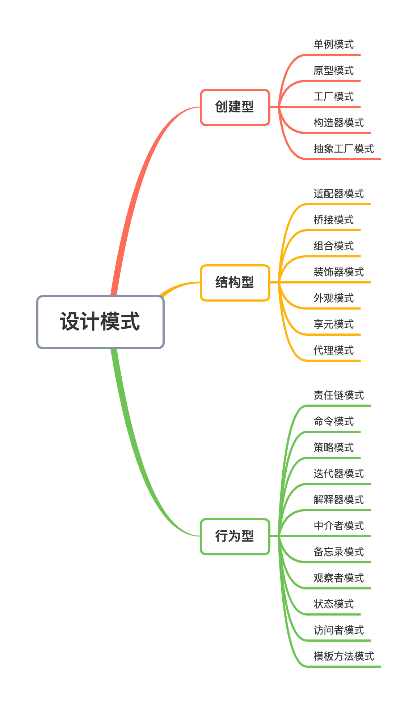

# 前端设计模式

## 1. 什么是设计模式？

设计模式是一套被反复使用、多数人知晓、经过分类编目的、代码设计经验的总结。它是为了可重用代码，让代码更容易的被他人理解并保证代码的可靠性。


就像是在做数学题时，已知直角三角形两边长，求另一边，我们会直接用勾股定理，而不会去证明为什么勾股定理是成立的。所以，设计模式实际上是“拿来主义”在软件领域的贯彻实践，它是一套现成的工具，拿来即用。下面来看一下设计模式的设计原则。

## 2. 设计原则概述

设计原则是设计模式的指导理论，它可以帮助我们规避不良的软件设计。设计模式遵循SOLID原则，SOLID 指代的五个基本原则分别是：

- 单一职责原则（Single Responsibility Principle）
- 开放封闭原则（Opened Closed Principle）

- 里式替换原则（Liskov Substitution Principle）
- 接口隔离原则（Interface Segregation Principle）

- 依赖反转原则（Dependency Inversion Principle）
- 最少知识原则（The Least Knowledge Principle）


下面来简单看一下设计模式的设计原则：

### （1）开放封闭原则

开放封闭原则指的就是对扩展开放、对修改关闭。编写代码的时候不可避免地会碰到修改的情况，而遵循开闭原则就意味着当代码需要修改时，可以通过编写新的代码来扩展已有的代码，而不是直接修改已有代码本身。


下面的伪代码是一个常见的表单校验功能，校验内容包括用户名、密码、验证码，每个校验项都通过判断语句 if-else 来控制。

```js
function validate() {
    // 校验用户名
    if (!username) {
        ...
    } else {
        ...
    }
    // 校验密码
    if (!pswd){
        ...
    } else {
        ...
    }
    // 校验验证码
    if (!captcha) {
        ...
    } else {
        ...
    }
}
```

这么写看似没有问题，但其实可扩展性并不好，如果此时增加一个校验条件，就要修改 validate() 函数内容。


下面的伪代码遵循开闭原则，将校验规则抽取出来，实现共同的接口 IValidateHandler，同时将函数 validate() 改成 Validation 类，通过 addValidateHandler() 函数添加校验规则，通过 validate() 函数校验表单。这样，当有新的校验规则出现时，只要实现 IValidateHandler 接口并调用 addValidateHandler() 函数即可，不需要修改类 Validation 的代码。

```js
class Validation {
    private validateHandlers: ValidateHandler[] = [];
    public addValidateHandler(handler: IValidateHandler) {
        this.validateHandlers.push(handler)
    }
    public validate() {
        for (let i = 0; i < this.validateHandlers.length; i++) {
            this.validateHandlers[i].validate();
        }
    }
}
interface IValidateHandler {
    validate(): boolean;
}
class UsernameValidateHandler implements IValidateHandler {
    public validate() {
      ...
    }
}
class PwdValidateHandler implements IValidateHandler {
    public validate() {
      ...
    }
}
class CaptchaValidateHandler implements IValidateHandler {
    public validate() {
      ...
    }
}
```

### （2）单一职责原则

应该有且仅有一个原因引起类的变更。这个原则很好理解，一个类代码量越多，功能就越复杂，维护成本也就越高。遵循单一职责原则可以有效地控制类的复杂度。


像下面这种情形经常在项目中看到，一个公共类聚集了很多不相关的函数，这就违反了单一职责原则。

```js
class Util {
  static toTime(date) {
    ...
  }
  static formatString(str) {
    ...
  }
  static encode(str) {
    ...
  }
}
```

### （3）里氏替换原则

里氏替换原则是指在使用父类的地方可以用它的任意子类进行替换。里氏替换原则是对类的继承复用作出的要求，要求子类可以随时替换掉其父类，同时功能不被破坏，父类的方法仍然能被使用。


下面的代码就是一个违反里氏替换原则的例子，子类 Sparrow 重载了父类 Bird 的 getFood() 函数，但返回值发生了修改。那么如果使用 Bird 类实例的地方改成 Sparrow 类实例则会报错。

```js
class Bird {
  getFood() {
    return '虫子'
  }
}
class Sparrow extends Bird {
  getFood() {
    return ['虫子', '稻谷']
  }
}
```

对于这种需要重载的类，正确的做法应该是让子类和父类共同实现一个抽象类或接口。下面的代码就是实现了一个 IBird 接口来遵循里氏替换原则。

```js
interface IBird {
  getFood(): string[]
}
class Bird implements IBird{
  getFood() {
    return ['虫子']
  }
}
class Sparrow implements IBird {
  getFood() {
    return ['虫子', '稻谷']
  }
}
```

### （4）接口隔离原则

不应该依赖它不需要的接口，也就是说一个类对另一个类的依赖应该建立在最小的接口上。目的就是为了降低代码之间的耦合性，方便后续代码修改。


下面就是一个违反接口隔离原则的反例，类 Dog 和类 Bird 都继承了接口 IAnimal，但是 Bird类并没有 swim函数，只能实现一个空函数 swim()。

```js
interface IAnimal {
  eat(): void
  swim(): void
}
class Dog implements IAnimal {
  eat() {
    ...
  }
  swim() {
    ...
  }
}
class Bird implements IAnimal {
  eat() {
    ...
  }
  swim() {
    // do nothing
  }
}
```

### （5）依赖倒置原则

准确说应该是避免依赖倒置，好的依赖关系应该是类依赖于抽象接口，不应依赖于具体实现。这样设计的好处就是当依赖发生变化时，只需要传入对应的具体实例即可。


下面的示例代码中，类 Passenger 的构造函数需要传入一个 Bike 类实例，然后在 start() 函数中调用 Bike 实例的 run() 函数。此时类 Passenger 和类 Bike 的耦合非常紧，如果现在要支持一个 Car 类则需要修改 Passenger 代码。

```js
class Bike {
  run() {
    console.log('Bike run')
  }
}
class Passenger {
  construct(Bike: bike) {
    this.tool = bike
  }
  public start() {
    this.tool.run()
  }
}
```

如果遵循依赖倒置原则，可以声明一个接口 ITransportation，让 Passenger 类的构造函数改为 ITransportation 类型，从而做到 Passenger 类和 Bike 类解耦，这样当 Passenger 需要支持 Car 类的时候，只需要新增 Car 类即可。

```js
interface ITransportation {
  run(): void
}
class Bike implements ITransportation {
  run() {
    console.log('Bike run')
  }
}
class Car implements ITransportation {
  run() {
    console.log('Car run')
  }
}
class Passenger {
  construct(ITransportation : transportation) {
    this.tool = transportation
  }
  public start() {
    this.tool.run()
  }
}
```

### （6）最少知识原则

一个类对于其他类知道得越少越好，就是说一个对象应当对其他对象尽可能少的了解。这一条原则要求任何一个对象或者方法只能调用该对象本身和内部创建的对象实例，如果要调用外部的对象，只能通过参数的形式传递进来。这一点和纯函数的思想相似。


下面的类 Store 就违反了最少知识原则，类内部使用了全局变量。

```js
class Store {
  set(key, value) {
    window.localStorage.setItem(key, value)
  }
}
```

一种改造方式就是在初始化的时候将 window.localstorage 作为参数传递给 Store 实例。

```js
class Store {
  construct(s) {
    this._store = s
  }
  set(key, value) {
    this._store.setItem(key, value)
  }
}
new Store(window.localstorage)
```


这6个基本原则看起来挺高大上，实际上并不是很难。而且JavaScript的设计模式主要围绕**单一功能原则**和**开放封闭原则**展开：

- **单一功能原则：** 官方的说法是“规定每个类都应该有一个单一的功能，并且该功能应该由这个类完全封装起来”。简单来说，可以理解为不要让一个函数/类做太多事情，而应该进行合理的功能拆分，并且每部分都保持独立。
- **开放封闭原则**：官方的说法是“软件实体应该是可扩展，而不可修改的。也就是说，**对扩展是开放的，而对修改是封闭的**”。 简单来说，在设计一个功能时，需要尽可能地区分变化的部分与稳定的部分，进而做到将变与不变分离（尤其是要做到封装变化的部分），达到降低耦合度的目的（在增加需求时，扩展新代码，而非修改已有代码）。


下面看一个Promise的例子：

```js
function loadImg (src){
	let promise = new Promise( (resolve, reject) => {
		let img = document.createElement('img')
		img.onload = function(){
			resolve(img)
		}
		img.onerror = function(){
			reject('加载失败')
		}
		img.src = src
	}
	return promise
}
let src = './pic.jpg'
let result = loadImg(src)
result.then( (img) => {
	console.log(`width: ${img.width}`)
}).then( (img) => {
	console.log(`height: ${img.height}`)
}).catch((error) => {
	console.log(error)
})
```

在这个例子中，创建了一个Promise异步图片的加载任务，并且打印图片的宽和高，以及错误的捕获，它符合以下两条原则：

- 单一职责原则：每一个then中值需做好自己的事。
- 开放封闭原则：如果新增需求，就可以继续加then，而基本不用动之前的两个then。

## 3. 设计模式核心思想

设计模式出现的背景，是软件设计的复杂度日益飙升。软件设计越来越复杂的“罪魁祸首”，就是变化。


这一点不难理解——如果写一个业务，这个业务不需要更新迭代，初始版本是 1.0，10 年后还是 1.0，不接受任何迭代和优化，那么这个业务几乎可以随便写。反正只要实现功能就行了，完全不需要考虑可维护性、可扩展性。


但在实际开发中，不发生变化的代码可以说是不存在的。我们能做的只有将这个变化造成的影响最小化 —— **将变与不变分离，确保变化的部分灵活、不变的部分稳定。**


这个过程，就叫“封装变化”；这样的代码，就是我们所谓的“健壮”的代码，它可以经得起变化的考验。而设计模式出现的意义，就是帮我们写出这样的代码。

## 4. 设计模式分类

根据上面的设计模式，总共提出了23种设计模式，并按照创建型、行为型、结构型进行划分，如下：



### （1）创建型

创建型模式的主要关注点是“如何创建和使用对象”，这些模式的核心特点就是将对象的创建与使用进行分离，从而降低系统的耦合度。使用者不需要关注对象的创建细节，对象的创建由相关的类来完成。


具体包括下面几种模式：

- **抽象工厂模式**，提供一个超级工厂类来创建其他工厂类，然后通过工厂类创建类实例；
- **构造器模式**，将一个复杂对象分解成多个相对简单的部分，然后根据不同需要分别创建它们，最后构建成该复杂对象；

- **工厂模式**，定义一个用于创建生成类的工厂类，由调用者提供的参数决定生成什么类实例；
- **原型模式**，将一个对象作为原型，通过对其进行克隆创建新的实例；

- **单例模式**，生成一个全局唯一的实例，同时提供访问这个实例的函数。

### （2）结构型

结构型模式描述如何将类或对象组合在一起形成更大的结构。它分为类结构型模式和对象结构型模式，类结构型模式采用继承机制来组织接口和类，对象结构型模式釆用组合或聚合来生成新的对象。


具体包括下面几种模式：

- **适配器模式**，将一个类的接口转换成另一个类的接口，使得原本由于接口不兼容而不能一起工作的类能一起工作；
- **桥接模式**，将抽象与实现分离，使它们可以独立变化，它是用组合关系代替继承关系来实现的，从而降低了抽象和实现这两个可变维度的耦合度；

- **组合模式**，将对象组合成树状层次结构，使用户对单个对象和组合对象具有一致的访问性；
- **装饰器模式**，动态地给对象增加一些职责，即增加其额外的功能；

- **外观模式**，为多个复杂的子系统提供一个统一的对外接口，使这些子系统更加容易被访问；
- **享元模式**，运用共享技术来有效地支持大量细粒度对象的复用；

- **代理模式**，为某对象提供一种代理以控制对该对象的访问，即客户端通过代理间接地访问该对象，从而限制、增强或修改该对象的一些特性。

### （3）行为型

行为型模式用于描述程序在运行时复杂的流程控制，即描述多个类或对象之间怎样相互协作共同完成单个对象无法单独完成的任务，它涉及算法与对象间职责的分配。


行为型模式分为类行为模式和对象行为模式，类的行为模式采用继承机制在子类和父类之间分配行为，对象行为模式采用多态等方式来分配子类和父类的职责。


具体包括下面几种模式：

- **责任链模式**，把请求从链中的一个对象传到下一个对象，直到请求被响应为止，通过这种方式去除对象之间的耦合；
- **命令模式**，将一个请求封装为一个对象，使发出请求的责任和执行请求的责任分割开；

- **策略模式**，定义了一系列算法，并将每个算法封装起来，使它们可以相互替换，且算法的改变不会影响使用算法的用户；
- **解释器模式**，提供如何定义语言的文法，以及对语言句子的解释方法，即解释器；

- **迭代器模式**，提供一种方法来顺序访问聚合对象中的一系列数据，而不暴露聚合对象的内部表示；
- **中介者模式**，定义一个中介对象来简化原有对象之间的交互关系，降低系统中对象间的耦合度，使原有对象之间不必相互了解；

- **备忘录模式**，在不破坏封装性的前提下，获取并保存一个对象的内部状态，以便以后恢复它；
- **观察者模式**，多个对象间存在一对多关系，当一个对象发生改变时，把这种改变通知给其他多个对象，从而影响其他对象的行为；

- **状态模式**，类的行为基于状态对象而改变；
- **访问者模式**，在不改变集合元素的前提下，为一个集合中的每个元素提供多种访问方式，即每个元素有多个访问者对象访问；

- **模板方法模式**，定义一个操作中的算法骨架，将算法的一些步骤延迟到子类中，使得子类在可以不改变该算法结构的情况下重定义该算法的某些特定步骤。


而前端常用到的主要有以下几种：

- 单例模式
- 工厂模式

- 原型模式
- 状态模式

- 策略模式
- 代理模式

- 装饰器模式
- 适配器模式

- 迭代器模式
- 观察者模式/发布订阅模式