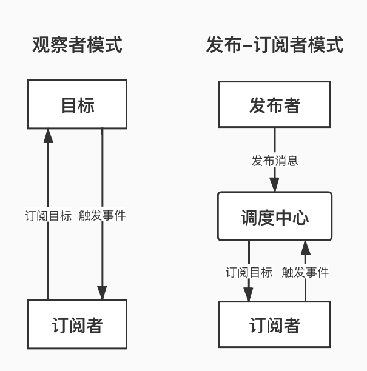
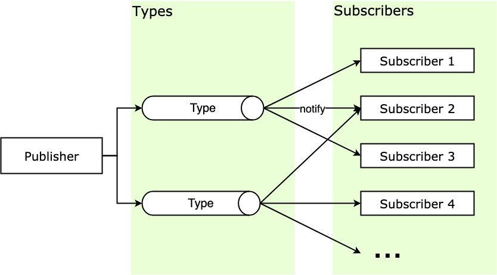
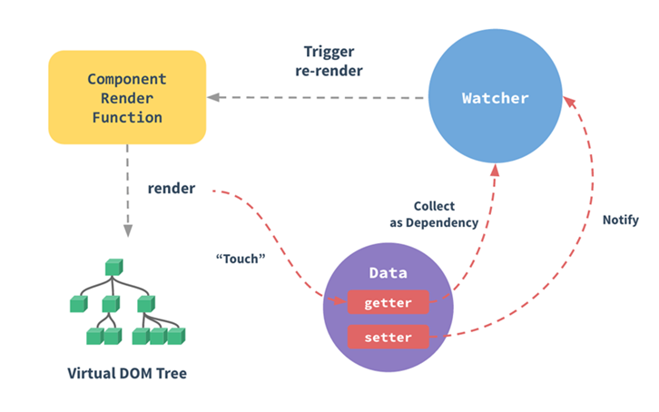

# 观察者模式/发布-订阅模式

## 1. 什么是观察者模式/发布-订阅模式？

### （1）观察者模式：

观察者模式（Observer Pattern）定义了一种一对多的关系，让多个订阅者对象同时监听某一个发布者，或者叫主题对象，这个主题对象的状态发生变化时就会通知所有订阅自己的订阅者对象，使得它们能够自动更新自己。


观察者模式属于行为型模式，行为型模式关注的是对象之间的通讯，观察者模式就是观察者和被观察者之间的通讯。

### （2）发布-订阅模式：

在23种设计模式中没有发布-订阅模式的，其实它是发布订阅模式的一个别名，但两者又有所不同。这个别名非常形象地诠释了观察者模式里两个核心的角色要素——**发布者**和**订阅者**。


很多人在微博上关注了A，那么当A发布微博动态的时候微博就会为我们推送这个动态。在这个例子中，A就是发布者，我们是订阅者，微博就是调度中心，我们和A之间是没有直接信息来往的，都是通过微博平台来协调的，这就是发布-订阅模式。


虽然发布-订阅模式是观察者模式的一个别名，但是发布-订阅模式经过发展，已经独立于观察者模式，成为一种比较重要的设计模式。


这两种模式的最大区别就是发布-订阅模式有一个调度中心：



可以看到，观察者模式是由具体目标调度的，而发布-订阅模式是统一由调度中心调的，所以观察者模式的订阅者与发布者之间是存在依赖的，而发布-订阅模式则不会，这就实现了解耦。

## 2. 观察者模式的实现

**发布者：**

```js
// 定义发布者类
class Publisher {
  constructor() {
    this.observers = []
    console.log('Publisher created')
  }
  // 增加订阅者
  add(observer) {
    console.log('Publisher.add invoked')
    this.observers.push(observer)
  }
  // 移除订阅者
  remove(observer) {
    console.log('Publisher.remove invoked')
    this.observers.forEach((item, i) => {
      if (item === observer) {
        this.observers.splice(i, 1)
      }
    })
  }
  // 通知所有订阅者
  notify() {
    console.log('Publisher.notify invoked')
    this.observers.forEach((observer) => {
      observer.update(this)
    })
  }
}
```

**订阅者：**

```js
// 定义订阅者类
class Observer {
    constructor() {
        console.log('Observer created')
    }
    update() {
        console.log('Observer.update invoked')
    }
}
```

## 3. 发布-订阅模式的实现

在 DOM 上绑定的事件处理函数 addEventListener就是使用的发布-订阅模式。


我们经常将一些操作挂载在 onload 事件上执行，当页面元素加载完毕，就会触发注册在 onload 事件上的回调。我们无法预知页面元素何时加载完毕，但是通过订阅 window 的 onload 事件，window 会在加载完毕时向订阅者发布消息，也就是执行回调函数。

```js
window.addEventListener('load', function () {
	console.log('loaded!')
})
```

下面就来实现一下发布-订阅模式，在实现之前，下来看几个概念：

- Publisher ：发布者，当消息发生时负责通知对应订阅者
- Subscriber ：订阅者，当消息发生时被通知的对象

- SubscriberMap ：持有不同 type 的数组，存储有所有订阅者的数组
- type ：消息类型，订阅者可以订阅的不同消息类型

- subscribe ：该方法为将订阅者添加到 SubscriberMap 中对应的数组中
- unSubscribe ：该方法为在 SubscriberMap 中删除订阅者

- notify ：该方法遍历通知 SubscriberMap 中对应 type 的每个订阅者


其结构如下：



这里以在商城订阅鞋的消息为例：

```js
class Publisher {
    constructor() {
        this._subsMap = {}
    }
    
    // 消息订阅 
    subscribe(type, cb) {
        if (this._subsMap[type]) {
            if (!this._subsMap[type].includes(cb))
                this._subsMap[type].push(cb)
        } else this._subsMap[type] = [cb]
    }
    
    // 消息退订 
    unsubscribe(type, cb) {
        if (!this._subsMap[type] ||
            !this._subsMap[type].includes(cb)) return
        const idx = this._subsMap[type].indexOf(cb)
        this._subsMap[type].splice(idx, 1)
    }
    
    // 消息发布 
    notify(type, ...payload) {
        if (!this._subsMap[type]) return
        this._subsMap[type].forEach(cb => cb(...payload))
    }
}
const adadis = new Publisher()
adadis.subscribe('运动鞋', message => console.log('152xxx' + message))    // 订阅运动鞋
adadis.subscribe('运动鞋', message => console.log('138yyy' + message))
adadis.subscribe('帆布鞋', message => console.log('139zzz' + message))    // 订阅帆布鞋
adadis.notify('运动鞋', ' 运动鞋到货了 ')   // 打电话通知买家运动鞋消息
adadis.notify('帆布鞋', ' 帆布鞋售罄了 ') // 打电话通知买家帆布鞋消息
// 输出:  152xxx 运动鞋到货了 
// 输出:  138yyy 运动鞋到货了 
// 输出:  139zzz 帆布鞋售罄了 
```

## 4. Vue中的发布-订阅模式

### （1）EventBus

在Vue中有一套事件机制，其中一个用法是 EventBus。在多层组件的事件处理中，如果你觉得一层层 `$on`、`$emit` 比较麻烦，那就可以使用 EventBus 来解决组件间的数据通信问题。


`eventBus`事件总线适用于**父子组件**、**非父子组件**等之间的通信，使用步骤如下：

**（1）创建事件中心管理组件之间的通信**

```js
// event-bus.js
import Vue from 'vue'
export const EventBus = new Vue()
```

**（2）发送事件**

假设有两个兄弟组件`firstCom`和`secondCom`：

```js
<template>
  <div>
    <first-com></first-com>
    <second-com></second-com>
  </div>
</template>
<script>
import firstCom from './firstCom.vue'
import secondCom from './secondCom.vue'
export default {
  components: { firstCom, secondCom }
}
</script>
```

在`firstCom`组件中发送事件：

```js
<template>
  <div>
    <button @click="add">加法</button>    
  </div>
</template>
<script>
import {EventBus} from './event-bus.js' // 引入事件中心
export default {
  data(){
    return{
      num:0
    }
  },
  methods:{
    add(){
      EventBus.$emit('addition', {
        num:this.num++
      })
    }
  }
}
</script>
```

**（3）接收事件**

在`secondCom`组件中发送事件：

```js
<template>
  <div>求和: {{count}}</div>
</template>
<script>
import { EventBus } from './event-bus.js'
export default {
  data() {
    return {
      count: 0
    }
  },
  mounted() {
    EventBus.$on('addition', param => {
      this.count = this.count + param.num;
    })
  }
}
</script>
```

在上述代码中，这就相当于将`num`值存贮在了事件总线中，在其他组件中可以直接访问。事件总线就相当于一个桥梁，不用组件通过它来通信。


实现组件间的消息传递时，如果是中大型项目还是推荐使用 Vuex，因为如果 Bus 上的事件挂载过多，就可能分不清消息的来源和先后顺序，对可维护性是一种破坏，后期维护起来会很困难。

### （2）Vue源码

发布-订阅模式在源码中应用很多，特别是现在很多前端框架都会有的双向绑定机制的场景，这里以现在很火的 Vue 为例，来分析一下 Vue 是如何利用发布-订阅模式来实现视图层和数据层的双向绑定。先借用官网的双向绑定原理图：



组件渲染函数（Component Render Function）被执行前，会对数据层的数据进行响应式化。响应式化大致就是使用 Object.defineProperty 把数据转为 getter/setter，并为每个数据添加一个订阅者列表的过程。这个列表是 getter 闭包中的属性，将会记录所有依赖这个数据的组件。也就是说，响应式化后的数据相当于发布者。


每个组件都对应一个 Watcher 订阅者。当每个组件的渲染函数被执行时，都会将本组件的 Watcher 放到自己所依赖的响应式数据的订阅者列表里，这就相当于完成了订阅，一般这个过程被称为依赖收集（Dependency Collect）。

组件渲染函数执行的结果是生成虚拟 DOM 树（Virtual DOM Tree），这个树生成后将被映射为浏览器上的真实的 DOM树，也就是用户所看到的页面视图。

当响应式数据发生变化的时候，也就是触发了 setter 时，setter 会负责通知（Notify）该数据的订阅者列表里的 Watcher，Watcher 会触发组件重渲染（Trigger re-render）来更新（update）视图。


Vue 的源码：

```js
// src/core/observer/index.js 响应式化过程
Object.defineProperty(obj, key, {
    enumerable: true,
    configurable: true,
    get: function reactiveGetter() {
        // ...
        const value = getter ? getter.call(obj) : val // 如果原本对象拥有getter方法则执行
        dep.depend()                     // 进行依赖收集，dep.addSub
        return value
    },
    set: function reactiveSetter(newVal) {
        // ...
        if (setter) { setter.call(obj, newVal) }    // 如果原本对象拥有setter方法则执行
        dep.notify()               // 如果发生变更，则通知更新
    }
})
```

这个 `dep` 上的 `depend` 和 `notify` 就是订阅和发布通知的具体方法。简单来说，响应式数据是消息的发布者，而视图层是消息的订阅者，如果数据更新了，那么发布者会发布数据更新的消息来通知视图更新，从而实现数据层和视图层的双向绑定。

## 5. 观察者模式的优缺点

**观察者模式有以下优点：**

- 观察者模式在被观察者和观察者之间建立一个抽象的耦合。被观察者角色所知道的只是一个具体观察者列表，每一个具体观察者都符合一个抽象观察者的接口。被观察者并不认识任何一个具体观察者，它只知道它们都有一个共同的接口。
  由于被观察者和观察者没有紧密地耦合在一起，因此它们可以属于不同的抽象化层次。如果被观察者和观察者都被扔到一起，那么这个对象必然跨越抽象化和具体化层次。
- 观察者模式支持广播通讯。被观察者会向所有的登记过的观察者发出通知，


**观察者模式有以下缺点：**

- 如果一个被观察者对象有很多的直接和间接的观察者的话，将所有的观察者都通知到会花费很多时间。
- 如果在被观察者之间有循环依赖的话，被观察者会触发它们之间进行循环调用，导致系统崩溃。在使用观察者模式是要特别注意这一点。

- 如果对观察者的通知是通过另外的线程进行异步投递的话，系统必须保证投递是以自恰的方式进行的。
- 虽然观察者模式可以随时使观察者知道所观察的对象发生了变化，但是观察者模式没有相应的机制使观察者知道所观察的对象是怎么发生变化的。

## 6. 发布-订阅模式的优缺点

**发布-订阅模式最大的优点就是解耦：**

- **时间上的解耦** ：注册的订阅行为由消息的发布方来决定何时调用，订阅者不用持续关注，当消息发生时发布者会负责通知；
- **对象上的解耦** ：发布者不用提前知道消息的接受者是谁，发布者只需要遍历处理所有订阅该消息类型的订阅者发送消息即可（迭代器模式），由此解耦了发布者和订阅者之间的联系，互不持有，都依赖于抽象，不再依赖于具体；


由于它的解耦特性，发布-订阅模式的使用场景一般是：当一个对象的改变需要同时改变其它对象，并且它不知道具体有多少对象需要改变。发布-订阅模式还可以帮助实现一些其他的模式，比如中介者模式。


**发布-订阅模式也有缺点：**

- **增加消耗** ：创建结构和缓存订阅者这两个过程需要消耗计算和内存资源，即使订阅后始终没有触发，订阅者也会始终存在于内存；
- **增加复杂度** ：订阅者被缓存在一起，如果多个订阅者和发布者层层嵌套，那么程序将变得难以追踪和调试。


缺点主要在于理解成本、运行效率、资源消耗，特别是在多级发布-订阅时，情况会变得更复杂。