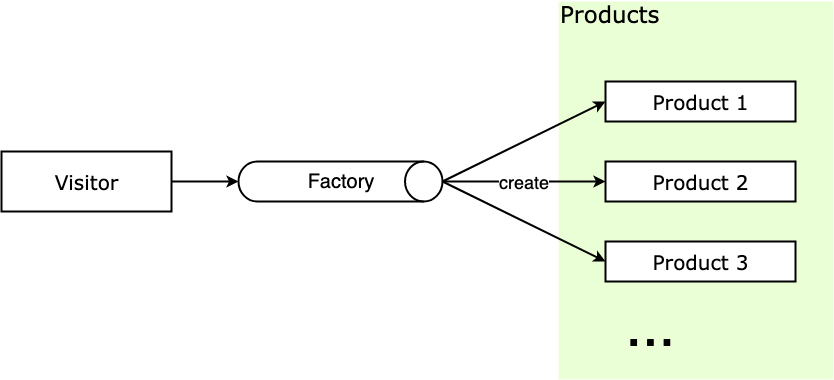

# 工厂模式

## 1. 什么是工厂模式？

工厂模式就是根据不用的输入返回不同的实例，一般用来创建同一类对象，它的**主要思想就是将对象的创建与对象的实现分离**。


在创建对象时，不暴露具体的逻辑，而是将逻辑封装在函数中，那么这个函数就可以被视为一个工厂。工厂模式根据抽象程度的不同可以分为：**简单工厂、****工厂方法、****抽象工厂**。


一个简单的例子，我们去餐馆吃饭，只需要按照菜单上的菜名进行点餐，然后菜做出来之后，不需要知道这些菜是怎么做的，只管吃就好了。在这里面，餐馆就相当于工厂，负责生产菜品，访问者通过餐馆就可以拿到产品。


这个例子有一个特点，访问者只需要产品名就可以从工厂获得实例，访问者不需要关心实例创建的过程。工厂模式其实就是将创建对象的过程单独封装，它的目的，就是为了实现无脑传参。

## 2. 工厂模式的实现方式

下面就分别看一下简单工厂模式、工厂方法模式、抽象工厂模式这三种工厂模式的实现方式。

### （1）简单工厂模式

简单工厂模式又叫静态工厂模式，由一个工厂对象决定创建某一种产品对象类的实例。主要用来创建同一类对象。


下面来看一个权限管理的例子，需要根据用户的权限进行页面的渲染。所以，在不同用户权限等级的构造函数中，需要保存该用户可以访问到的页面，再根据权限进行实例化用户。


在ES6中，这里不再使用构造函数来创建对象，而是使用ES6中的class关键字来创建类，并使用static关键字将简单工厂封装到User类的静态方法下：

```js
//User类
class User {
  //构造器
  constructor(opt) {
    this.name = opt.name;
    this.viewPage = opt.viewPage;
  }
  //静态方法
  static getInstance(role) {
    switch (role) {
      case 'superAdmin':
        return new User({ name: '超级管理员', viewPage: ['首页', '应用数据', '权限管理'] });
        break;
      case 'admin':
        return new User({ name: '管理员', viewPage: ['首页', '应用数据'] });
        break;
      case 'user':
        return new User({ name: '普通用户', viewPage: ['首页'] });
        break;
      default:
        throw new Error('参数错误, 可选参数:superAdmin、admin、user')
    }
  }
}
// 实例化对象
let superAdmin = User.getInstance('superAdmin');
let admin = User.getInstance('admin');
let normalUser = User.getInstance('user');
```

User就是一个简单工厂，在该函数中有3个实例中分别对应不同的权限的用户。当调用工厂函数时，只需要传递`superAdmin`, `admin`, `user`这三个可选参数中的一个获取对应的实例对象。


简单工厂模式的优势就在于，只需要一个参数，就可以获得所需的对象，无需知道对象创建的具体细节。但是，在函数内部包含了对象所有的创建逻辑，和判断逻辑的代码，如果判断逻辑很多，或者代码逻辑很复杂，这样工厂函数就会变的很复杂，很庞大，难以维护。所以，简单工厂只适合以下情况：

- 创建的对象数量较少；
- 创建的对象的逻辑不是很复杂。

### （2）工厂方法模式

工厂方法模式本意是**将实际创建对象的工作放在子类中**，这样核心类就变成了抽象类。但是在JavaScript中，我们无法像传统面向对象语言那样去实现创建类，所以，只要遵循它的主要思想即可。


虽然ES6也没有实现`abstract`，但是可以使用`new.target`来模拟出抽象类。`new.target`指向直接被`new`执行的构造函数，对`new.target`进行判断，如果指向了该类则抛出错误来使得该类成为抽象类。

new.target属性允许你检测函数或构造方法是否是通过new运算符被调用的。在通过new运算符被初始化的函数或构造方法中，new.target返回一个指向构造方法或函数的引用。在普通的函数调用中，new.target 的值是undefined。

在上面的简单工厂模式中。每次添加一个构造函数都要修改两处代码，现在对它加以改造：

```js
class User {
  constructor(name = '', viewPage = []) {
    if(new.target === User) {
      throw new Error('抽象类不能实例化!');
    }
    this.name = name;
    this.viewPage = viewPage;
  }
}
class UserFactory extends User {
  constructor(name, viewPage) {
    super(name, viewPage)
  }
  create(role) {
    switch (role) {
      case 'superAdmin': 
        return new UserFactory( '超级管理员', ['首页', '应用数据', '权限管理'] );
        break;
      case 'admin':
        return new User({ name: '管理员', viewPage: ['首页', '应用数据'] });
        break;
      case 'user':
        return new UserFactory( '普通用户', ['首页'] );
        break;
      default:
        throw new Error('参数错误, 可选参数:superAdmin、admin、user')
    }
  }
}
let userFactory = new UserFactory();
let superAdmin = userFactory.create('superAdmin');
let admin = userFactory.create('admin');
let user = userFactory.create('user');
```

工厂方法可以看做是一个实例化对象的工厂，它需要做的就是实例化对象。

### （3）抽象工厂模式

上面两种方式都是直接生成实例，而抽象工厂模式并不能直接生成实例，而是用于**产品类簇的创建**。


在网站登录中，上面实例中的user可能使用不用的第三方登录，例如微信、QQ、微博，这三类账号就是对应的类簇。在抽象工厂中，类簇一般用于父类的定义，并在父类中定义一些抽象的方法（声明但不能使用的方法），在通过抽象工厂让子类继承父类，所以，抽象工厂实际上就是实现子类继承父类的方法。


在传统面向对象的语言中常用`abstract`进行声明，但是在JavaScript中，`abstract`是属于保留字，可以通过在类的方法中抛出错误来模拟抽象类。

```js
function getAbstractUserFactory(type) {
  switch (type) {
    case 'wechat':
      return UserOfWechat;
      break;
    case 'qq':
      return UserOfQq;
      break;
    case 'weibo':
      return UserOfWeibo;
      break;
    default:
      throw new Error('参数错误, 可选参数:wechat、qq、weibo')
  }
}
let WechatUserClass = getAbstractUserFactory('wechat');
let QqUserClass = getAbstractUserFactory('qq');
let WeiboUserClass = getAbstractUserFactory('weibo');
let wechatUser = new WechatUserClass('微信张三');
let qqUser = new QqUserClass('QQ张三');
let weiboUser = new WeiboUserClass('微博张三');
```

**总结：**

- 简单工厂模式又叫静态工厂方法，用来创建某一种产品对象的实例，用来创建单一对象；
- 工厂方法模式是将创建实例推迟到子类中进行；

- 抽象工厂模式是对类的工厂抽象用来创建产品类簇，不负责创建某一类产品的实例。


在实际的业务中，需要根据实际的业务复杂度来选择合适的模式。对于非大型的前端应用来说，灵活使用简单工厂其实就能解决大部分问题。

## 3. 工厂模式的通用实现

**注意：** 这里所说的工厂模式是指简单工厂模式。在工厂模式中，主要有两个重要的概念：

- Factory ：工厂，负责返回产品实例
- Product ：产品，访问者从工厂拿到产品实例


其结构如下：



下面用通用的方法实现，这里直接用 class 语法：

```js
/* 工厂类 */
class Factory {
    static getInstance(type) {
        switch (type) {
            case 'Product1':
                return new Product1()
            case 'Product2':
                return new Product2()
            default:
                throw new Error('当前没有这个产品')
        }
    }
}
/* 产品类1 */
class Product1 {
    constructor() { this.type = 'Product1' }
    
    operate() { console.log(this.type) }
}
/* 产品类2 */
class Product2 {
    constructor() { this.type = 'Product2' }
    
    operate() { console.log(this.type) }
}
const prod1 = Factory.getInstance('Product1')
prod1.operate()								   // 输出: Product1
const prod2 = Factory.getInstance('Product3')  // 输出: Error 当前没有这个产品
```

需要注意，由于 JavaScript 很灵活，简单工厂模式返回的产品对象不一定非要是类实例，也可以是字面量形式的对象，所以可以根据场景灵活选择返回的产品对象形式。

## 4. Vue中的工厂模式

在Vue中，很多地方也是用到了工厂模式，下面来看下其中的两个例子。

### （1）VNode

和原生的 `document.createElement` 类似，Vue 这种具有虚拟 DOM 树（Virtual Dom Tree）机制的框架在生成虚拟 DOM 的时候，提供了 createElement 方法用来生成 VNode，用来作为真实 DOM 节点的映射：

```js
createElement('h3', { class: 'main-title' }, [
    createElement('img', { class: 'avatar', attrs: { src: '../avatar.jpg' } }),
    createElement('p', { class: 'user-desc' }, 'hello world')
])
```

createElement 函数结构大概如下：

```js
class Vnode (tag, data, children) { ... }
function createElement(tag, data, children) {
  	return new Vnode(tag, data, children)
}
```

可以看到，createElement 函数内会进行 VNode 的具体创建，创建的过程是很复杂的，而框架提供的 createElement 工厂方法封装了复杂的创建与验证过程，对于使用者来说就很方便了。

### （2）vue-router

在Vue在路由创建模式中，也多次用到了工厂模式：

```js
xport default class VueRouter {
    constructor(options) {
        this.mode = mode	// 路由模式
        
        switch (mode) {           // 简单工厂
            case 'history':       // history 方式
                this.history = new HTML5History(this, options.base)
                break
            case 'hash':          // hash 方式
                this.history = new HashHistory(this, options.base, this.fallback)
                break
            case 'abstract':      // abstract 方式
                this.history = new AbstractHistory(this, options.base)
                break
            default:
                // ... 初始化失败报错
        }
    }
}
```

在上面的代码中，mode 是路由创建的模式，这里有三种 History、Hash、Abstract，其中，History 是 H5 的路由方式，Hash 是路由中带 # 的路由方式，Abstract 代表非浏览器环境中路由方式，比如 Node、weex 等；this.history 用来保存路由实例，vue-router 中使用了工厂模式的思想来获得响应路由控制类的实例。


Vue-Router没有把工厂方法的产品创建流程封装出来，而是直接将产品实例的创建流程暴露在 VueRouter 的构造函数中，在被 new 的时候创建对应产品实例，相当于 VueRouter 的构造函数就是一个工厂方法。


如果一个系统不是单页面应用，而是多页面应用，那么就需要创建多个 VueRouter 的实例，此时 VueRouter 的构造函数也就是工厂方法将会被多次执行，以分别获得不同实例。

## 5. 工厂模式的优缺点

工厂模式将对象的创建和实现进行了分离，其**优点**如下：

- 良好的封装，代码结构清晰，访问者无需知道对象的创建流程，特别是创建比较复杂的情况下；
- 扩展性优良，通过工厂方法隔离了用户和创建流程隔离，符合开放封闭原则；

- 解耦了高层逻辑和底层产品类，符合最少知识原则，不需要的就不要去交流；


工厂模式的**缺点**如下：带来了额外的系统复杂度，增加了抽象性；

## 6. 工厂模式的使用场景

那么什么时候使用工厂模式呢：

- 对象的创建比较复杂，而访问者无需知道创建的具体流程；
- 处理大量具有相同属性的小对象；