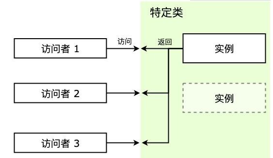

# 单例模式

## 1. 什么是单例模式？

单例模式应该是设计模式中最简单、最易上手、应用场景广泛的模式了。但是，在日常生活和编程中经常遇到，下面来看一下单例模式是什么。


**单例模式 （Singleton Pattern）又称为单体模式，保证一个类只有一个实例，并提供一个访问它的全局访问点。也就是说，第二次使用同一个类创建新对象的时候，应该得到与第一次创建的对象完全相同的对象。**


举一个例子，我们在玩单机游戏时，晚上关闭电脑。第二天在打开时，希望还能接着之前的游戏进度继续玩，这里就用到了存档，拿到存档就可以继续玩，这就是一个单例模式的实例。它符合单例的模式的特征：**在第二次创建实例的时候与第一次创建完全相同的对象。**


在编程中也有很多对象只需要唯一一个，比如数据库连接、线程池、配置文件缓存、浏览器中的 window/document 等，如果创建多个实例，会带来资源耗费严重，或访问行为不一致等情况。


在类似场景中，这些例子有以下特点：

- 每次访问者来访问，返回的都是同一个实例；
- 如果一开始实例没有创建，那么这个特定类需要自行创建这个实例；

## 2. 单例模式的实现

**常见的单例（而非单例模式的应用）：**

- 浏览器中的 window 和 document 全局变量，这两个对象都是单例，任何时候访问他们都是一样的对象，window 表示包含 DOM 文档的窗口，document 是窗口中载入的 DOM 文档，分别提供了各自相关的方法。
- 在 ES6 新增语法的 Module 模块特性，通过 `import/export` 导出模块中的变量是单例的，也就是说，如果在某个地方改变了模块内部变量的值，别的地方再引用的这个值是改变之后的。、

- 项目中的全局状态管理模式 Vuex 维护的全局状态，`vue-router`维护的路由实例，在单页应用的单页面中都属于单例的应用（但不属于单例模式的应用）。


当创建了一个类（本质是构造函数）后，可以通过new关键字调用构造函数进而生成任意多的实例对象。那如何对构造函数使用 new 关键字创建多个对象时，仅获取同一个单例对象呢？


在开始的例子中，游戏可以被认为是一个特定的类，而存档是单例，每次访问特定类的时候，都会拿到同一个实例。主要有下面几个概念：

- Singleton ：特定类，这是我们需要访问的类，访问者要拿到的是它的实例；
- instance ：单例，是特定类的实例，特定类一般会提供 getInstance 方法来获取该单例；

- getInstance ：获取单例的方法，或者直接由 new 操作符获取；


在实现单例模式的时候，需要注意以下几点：

- 访问时始终返回的是同一个实例；
- 自行实例化，无论是一开始加载的时候就创建好，还是在第一次被访问时；

- 一般还会提供一个 getInstance 方法用来获取它的实例；


结构大概如下图：



**具体实现：**

这里最关键的就是要让构造函数具备判断自己是否已经创建过一个实例的能力。我们将他写成一个单独的函数getInstance：

```js
class SingleCase {
    show() {
        console.log('我是一个单例对象')
    }
    static getInstance() {
        // 判断是否已经new过1个实例
        if (!SingleCase.instance) {
            // 若这个唯一的实例不存在，那么先创建它
            SingleCase.instance = new SingleCase()
        }
        // 如果这个唯一的实例已经存在，则直接返回
        return SingleCase.instance
    }
}
const s1 = SingleCase.getInstance()
const s2 = SingleCase.getInstance()
s1 === s2    // true
```

除了上面这种实现方法之外，getInstance的逻辑还可以用闭包来实现：

```js
SingleCase.getInstance = (function() {
    // 定义自由变量instance，模拟私有变量
    let instance = null
    return function() {
        // 判断自由变量是否为null
        if(!instance) {
            // 如果为null则new出唯一实例
            instance = new SingleCase()
        }
        return instance
    }
})()
```

可以看出，在getInstance方法的判断和拦截下，不管调用多少次，SingleCase都只会返回一个实例，s1和s2现在都指向这个唯一的实例。

## 3. Vue中的单例模式

### （1）Element UI

Element UI是使用Vue开发的一个前端UI框架。ElementUI 中的全屏 Loading 蒙层调用有两种形式：

- 指令形式：`Vue.use(Loading.directive)`
- 服务形式：`Vue.prototype.$loading = service`


指令形式注册的使用方式 ：

```html
<div :v-loading.fullscreen="true">...</div>；
```

服务形式注册的使用方式 ：

```js
this.$loading({ fullscreen: true })；
```

用服务方式使用全屏 Loading 是单例的，即在前一个全屏 Loading 关闭前再次调用全屏 Loading，并不会创建一个新的 Loading 实例，而是返回现有全屏 Loading 的实例。


下面是 ElementUI 实现全屏 Loading 的源码：

```js
import Vue from 'vue'
import loadingVue from './loading.vue'
const LoadingConstructor = Vue.extend(loadingVue)
let fullscreenLoading
const Loading = (options = {}) => {
    if (options.fullscreen && fullscreenLoading) {
        return fullscreenLoading
    }
    let instance = new LoadingConstructor({
        el: document.createElement('div'),
        data: options
    })
    if (options.fullscreen) {
        fullscreenLoading = instance
    }
    return instance
}
export default Loading
```

这里的单例是 fullscreenLoading，是存放在闭包中的，如果用户传的 options 的 fullscreen 为 true 且已经创建了单例，则直接返回之前创建的单例，如果之前没有创建过，则创建单例并赋值给闭包中的 fullscreenLoading 后返回新创建的单例实例。


这是一个典型的单例模式的应用，通过复用之前创建的全屏蒙层单例，不仅减少了实例化过程，而且避免了蒙层叠加蒙层出现的底色变深的情况。

### （2）Vuex

Vuex 是一个专为 Vue.js 应用程序开发的状态管理模式。Vuex，它们都实现了一个全局的 Store 用于存储应用的所有状态。这个 Store 的实现，正是单例模式的典型应用。

Vuex 使用单一状态树，用一个对象就包含了全部的应用层级状态。至此它便作为一个“唯一数据源 (SSOT)”而存在。这也意味着，每个应用将仅仅包含一个 store 实例。单一状态树让我们能够直接地定位任一特定的状态片段，在调试的过程中也能轻易地取得整个当前应用状态的快照。 ——Vuex官方文档


在Vue中，组件之间是独立的，组件间通信最常用的办法是 props（限于父子组件通信），稍微复杂一点的（比如兄弟组件通信）可以通过自己实现简单的事件监听函数来解决。但当组件非常多、组件间关系复杂、且嵌套层级很深的时候，这种原始的通信方式会使我们的逻辑变得复杂难以维护。这时最好的做法是将共享的数据抽出来、放在全局，供组件们按照一定的的规则去存取数据，保证状态以一种可预测的方式发生变化。于是便有了 Vuex，这个用来存放共享数据的唯一数据源，就是 Store。


那Vuex是如何确保Store的唯一性的呢？


首先，先来看看如何在项目中引入 Vuex：

```js
// 安装vuex插件
Vue.use(Vuex)
// 将store注入到Vue实例中
new Vue({
    el: '#app',
    store
})
```

通过调用`Vue.use()`方法，安装了 Vuex 插件。Vuex 插件是一个对象，它在内部实现了一个 `install` 方法，这个方法会在插件安装时被调用，从而把 Store 注入到Vue实例里去。也就是说每 install 一次，都会尝试给 Vue 实例注入一个 Store。


在 `install` 方法里，有一段逻辑和上面的 `getInstance` 的逻辑非常相似：

```js
let Vue // 这个Vue的作用和楼上的instance作用一样
...
export function install (_Vue) {
  // 判断传入的Vue实例对象是否已经被install过Vuex插件（是否有了唯一的state）
  if (Vue && _Vue === Vue) {
    if (process.env.NODE_ENV !== 'production') {
      console.error(
        '[vuex] already installed. Vue.use(Vuex) should be called only once.'
      )
    }
    return
  }
  // 若没有，则为这个Vue实例对象install一个唯一的Vuex
  Vue = _Vue
  // 将Vuex的初始化逻辑写进Vue的钩子函数里
  applyMixin(Vue)
}
```

这就是 Vuex 源码中单例模式的实现办法了，套路可以说和上面的`getInstance`如出一辙。通过这种方式，可以保证一个 Vue 实例（即一个 Vue 应用）只会被 install 一次 Vuex 插件，所以每个 Vue 实例只会拥有一个全局的 Store。

## 4. 单例模式的优缺点

单例模式主要解决的问题就是节约资源，保持访问一致性。


**单例模式优点如下：**

- **节约开支，提高性能：** 单例模式在创建后在内存中只存在一个实例，节约了内存开支和实例化时的性能开支，特别是需要重复使用一个创建开销比较大的类时，比起实例不断地销毁和重新实例化，单例能节约更多资源，比如数据库连接；
- **解决资源多重占用：** 单例模式可以解决对资源的多重占用，比如写文件操作时，因为只有一个实例，可以避免对一个文件进行同时操作；

- **提高系统流畅度：** 只使用一个实例，也可以减小垃圾回收机制 GC（Garbage Collecation） 的压力，表现在浏览器中就是系统卡顿减少，操作更流畅，CPU 资源占用更少；


**单例模式缺点如下：**

- **对扩展不友好**：一般不容易扩展，因为单例模式一般自行实例化，没有接口；
- **与单一职责原则冲突**：一个类应该只关心内部逻辑，而不关心外面怎么样来实例化；

## 5. 单例模式的使用场景

单例模式的使用场景：

- 当一个类的实例化过程消耗的资源过多，可以使用单例模式来避免性能浪费；
- 当项目中需要一个公共的状态，那么需要使用单例模式来保证访问一致性