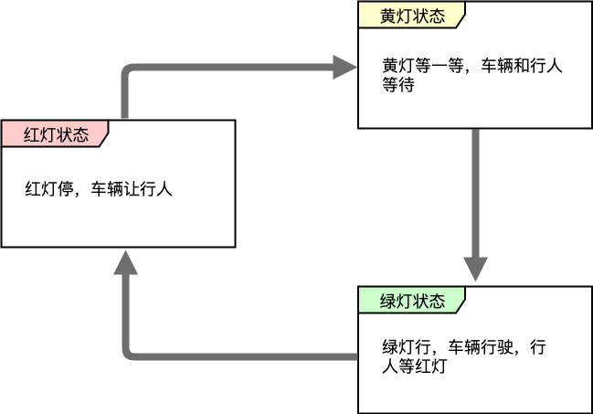

# 状态模式

## 1. 什么是状态模式？

**状态模式** （State Pattern）允许一个对象在其内部状态改变时改变它的行为，对象看起来似乎修改了它的类，类的行为随着它的状态改变而改变。


状态模式**主要解决的是当控制一个对象状态的条件表达式过于复杂时的情况。把状态的判断逻辑转移到表示不同状态的一系列类中，可以把复杂的判断逻辑简化。**


当程序需要根据不同的外部情况来做出不同操作时，最直接的方法就是使用 `switch-case` 或 `if-else` 语句将这些可能发生的情况全部兼顾到，但是这种做法应付复杂一点的状态判断时就有点力不从心，开发者得找到合适的位置添加或修改代码，这个过程很容易出错，这时引入状态模式可以某种程度上缓解这个问题。


在等红绿灯的时候，红绿灯的状态和行人汽车的通行逻辑是有关联的：

1. 红灯亮：行人通行，车辆等待；
2. 绿灯亮：行人等待，车辆通行；

1. 黄灯亮：行人等待，车辆等待；



还有下载文件时，有好几个状态，比如下载验证、下载中、暂停下载、下载完毕、下载失败，文件在不同状态下表现的行为也不一样，比如下载中时显示可以暂停下载和下载进度，下载失败时弹框提示并询问是否重新下载等等。类似的场景还有很多，比如女生作为你的朋友、好朋友、女朋友、老婆等不同状态的时候，行为也不同 。


**在这些场景中，有以下特点：**

1. 对象有有限多个状态，且状态间可以相互切换；
2. 各个状态和对象的行为逻辑有比较强的对应关系，即在不同状态时，对应的处理逻辑不一样；

## 2. 状态模式的实现

下面用最常用的方式来实现上面的红绿灯的例子：

```js
let trafficLight = (function() {
    let state = '绿灯'        // 闭包缓存状态
    
    return {
        // 设置交通灯状态 
        setState: function(target) {
            if (target === '红灯') {
                state = '红灯'
                console.log('交通灯颜色变为 红色，行人通行 & 车辆等待')
            } else if (target === '黄灯') {
                state = '黄灯'
                console.log('交通灯颜色变为 黄色，行人等待 & 车辆等待')
            } else if (target === '绿灯') {
                state = '绿灯'
                console.log('交通灯颜色变为 绿色，行人等待 & 车辆通行')
            } else {
                console.error('交通灯还有这颜色？')
            }
        },
        
        // 获取交通灯状态 
        getState: function() {
            return state
        }
    }
})()

trafficLight.setState('红灯') // 输出： 交通灯颜色变为 红色，行人通行 & 车辆等待
trafficLight.setState('黄灯') // 输出： 交通灯颜色变为 黄色，行人等待 & 车辆等待
trafficLight.setState('绿灯') // 输出： 交通灯颜色变为 绿色，行人等待 & 车辆通行

trafficLight.setState('紫灯') // 输出： 交通灯还有这颜色？
```

这里可以使用if-else来实现，也可以使用swich-case来实现，但是这样实现是存在问题的，这里处理的逻辑比较简单，如果比较复杂，在增加新的状态时，比如增加了 `蓝灯`、`紫灯` 等颜色及其处理逻辑的时候，需要到 `setState` 方法里找到对应地方修改。


在实际项目中，`if-else` 伴随的业务逻辑处理通常比较复杂，找到要修改的状态就不容易，特别是如果是别人的代码，或者接手遗留项目时，需要看完这个 `if-else` 的分支处理逻辑，新增或修改分支逻辑的过程中也很容易引入 Bug。


正式因为这样非常的不方便维护状态及其对应的行为，所以引入了状态模式的理念，状态模式把每种状态和对应的处理逻辑封装在一起，比如下面用一个类实例将红绿灯的逻辑封装起来：

```js
// 抽象状态类 
var AbstractState = function() {}

// 抽象方法 
AbstractState.prototype.employ = function() {
    throw new Error('抽象方法不能调用!')
}

// 交通灯状态类 
var State = function(name, desc) {
    this.color = { name, desc }
}

State.prototype = new AbstractState()
State.prototype.employ = function(trafficLight) {
    console.log('交通灯颜色变为 ' + this.color.name + '，' + this.color.desc)
    trafficLight.setState(this)
}

// 交通灯类 
var TrafficLight = function() {
    this.state = null
}

// 获取交通灯状态 
TrafficLight.prototype.getState = function() {
    return this.state
}

// 设置交通灯状态 
TrafficLight.prototype.setState = function(state) {
    this.state = state
}

// 实例化一个红绿灯
var trafficLight = new TrafficLight()

// 实例化红绿灯可能有的三种状态
var redState = new State('红色', '行人等待 & 车辆等待')
var greenState = new State('绿色', '行人等待 & 车辆通行')
var yellowState = new State('黄色', '行人等待 & 车辆等待')

redState.employ(trafficLight)    // 输出： 交通灯颜色变为 红色，行人通行 & 车辆等待
yellowState.employ(trafficLight) // 输出： 交通灯颜色变为 黄色，行人等待 & 车辆等待
greenState.employ(trafficLight)  // 输出： 交通灯颜色变为 绿色，行人等待 & 车辆通行
```

这里的不同状态是同一个类的类实例，比如 `redState` 这个类实例，就把所有红灯状态处理的逻辑封装起来，如果要把状态切换为红灯状态，那么只需要 `redState.employ()` 把交通灯的状态切换为红色，并且把交通灯对应的行为逻辑也切换为红灯状态。


**状态模式与策略模式很相似：**

- 策略模式把可以相互替换的策略算法提取出来
- 状态模式把事物的状态及其行为提取出来。


下面使用 ES6 的 Class 语法对上面的代码进行改造：

```js
// 抽象状态类 
class AbstractState {
    constructor() {
        if (new.target === AbstractState) {
            throw new Error('抽象类不能直接实例化!')
        }
    }
    
    // 抽象方法 
    employ() {
        throw new Error('抽象方法不能调用!')
    }
}

// 交通灯类 
class State extends AbstractState {
    constructor(name, desc) {
        super()
        this.color = { name, desc }
    }
    
    // 覆盖抽象方法 
    employ(trafficLight) {
        console.log('交通灯颜色变为 ' + this.color.name + '，' + this.color.desc)
        trafficLight.setState(this)
    }
}

// 交通灯类 
class TrafficLight {
    constructor() {
        this.state = null
    }
    
    // 获取交通灯状态 
    getState() {
        return this.state
    }
    
    // 设置交通灯状态 
    setState(state) {
        this.state = state
    }
}

const trafficLight = new TrafficLight()

const redState = new State('红色', '行人等待 & 车辆等待')
const greenState = new State('绿色', '行人等待 & 车辆通行')
const yellowState = new State('黄色', '行人等待 & 车辆等待')

redState.employ(trafficLight)    // 输出： 交通灯颜色变为 红色，行人通行 & 车辆等待
yellowState.employ(trafficLight) // 输出： 交通灯颜色变为 黄色，行人等待 & 车辆等待
greenState.employ(trafficLight)  // 输出： 交通灯颜色变为 绿色，行人等待 & 车辆通行
```

如果要新建状态，不用修改原有代码，只要加上下面的代码：

```js
const blueState = new State('蓝色', '行人倒立 & 车辆飞起')
blueState.employ(trafficLight)    // 输出： 交通灯颜色变为 蓝色，行人倒立 & 车辆飞起
```

传统的状态区分一般是基于状态类扩展的不同状态类，如何实现实现看需求具体了，比如逻辑比较复杂，通过新建状态实例的方法已经不能满足需求，那么可以使用状态类的方式。


最后，提供一个状态类的实现，同时引入状态的切换逻辑：

```js
// 抽象状态类 
class AbstractState {
    constructor() {
        if (new.target === AbstractState) {
            throw new Error('抽象类不能直接实例化!')
        }
    }
    
    // 抽象方法 
    employ() {
        throw new Error('抽象方法不能调用!')
    }
    
    changeState() {
        throw new Error('抽象方法不能调用!')
    }
}
// 交通灯类-红灯 
class RedState extends AbstractState {
    constructor() {
        super()
        this.colorState = '红色'
    }
    
    // 覆盖抽象方法 
    employ() {
        console.log('交通灯颜色变为 ' + this.colorState + '，行人通行 & 车辆等待')
        // const redDom = document.getElementById('color-red')    // 业务相关操作
        // redDom.click()
    }
    
    changeState(trafficLight) {
        trafficLight.setState(trafficLight.yellowState)
    }
}
// 交通灯类-绿灯 
class GreenState extends AbstractState {
    constructor() {
        super()
        this.colorState = '绿色'
    }
    
    // 覆盖抽象方法 
    employ() {
        console.log('交通灯颜色变为 ' + this.colorState + '，行人等待 & 车辆通行')
        // const greenDom = document.getElementById('color-green')
        // greenDom.click()
    }
    
    changeState(trafficLight) {
        trafficLight.setState(trafficLight.redState)
    }
}
// 交通灯类-黄灯
class YellowState extends AbstractState {
    constructor() {
        super()
        this.colorState = '黄色'
    }
    
    // 覆盖抽象方法 
    employ() {
        console.log('交通灯颜色变为 ' + this.colorState + '，行人等待 & 车辆等待')
        // const yellowDom = document.getElementById('color-yellow')
        // yellowDom.click()
    }
    
    changeState(trafficLight) {
        trafficLight.setState(trafficLight.greenState)
    }
}
// 交通灯类 
class TrafficLight {
    constructor() {
        this.redState = new RedState()
        this.greenState = new GreenState()
        this.yellowState = new YellowState()
        
        this.state = this.greenState
    }
    
    // 设置交通灯状态 
    setState(state) {
        state.employ(this)
        this.state = state
    }
    
    changeState() {
        this.state.changeState(this)
    }
}
const trafficLight = new TrafficLight()
trafficLight.changeState()    // 输出： 交通灯颜色变为 红色，行人通行 & 车辆等待
trafficLight.changeState()    // 输出： 交通灯颜色变为 黄色，行人等待 & 车辆等待
trafficLight.changeState()    // 输出： 交通灯颜色变为 绿色，行人等待 & 车辆通行
```

如果要增加新的交通灯颜色，也是很方便的：

```js
// 交通灯类-蓝灯 
class BlueState extends AbstractState {
    constructor() {
        super()
        this.colorState = '蓝色'
    }
    
    // 覆盖抽象方法 
    employ() {
        console.log('交通灯颜色变为 ' + this.colorState + '，行人倒立 & 车辆飞起')
        const redDom = document.getElementById('color-blue')
        redDom.click()
    }
}
const blueState = new BlueState()
trafficLight.employ(blueState)    // 输出： 交通灯颜色变为 蓝色，行人倒立 & 车辆飞起
```

## 3. 状态管理的原理

所谓对象的状态，通常指的就是对象实例的属性的值。行为指的就是对象的功能，行为大多可以对应到方法上。状态模式把状态和状态对应的行为从原来的大杂烩代码中分离出来，把每个状态所对应的功能处理封装起来，这样选择不同状态的时候，其实就是在选择不同的状态处理类。


也就是说，状态和行为是相关联的，它们的关系可以描述总结成：**状态决定行为**。由于状态是在运行期被改变的，因此行为也会在运行期根据状态的改变而改变，看起来，同一个对象，在不同的运行时刻，行为是不一样的，就像是类被修改了一样。


为了提取不同的状态类共同的外观，可以给状态类定义一个共同的状态接口或抽象类，正如之前最后的两个代码示例一样，这样可以面向统一的接口编程，无须关心具体的状态类实现。

## 4. 状态模式的优缺点

状态模式的**优点**：

- **结构相比之下清晰**，避免了过多的 `switch-case` 或 `if-else` 语句的使用，避免了程序的复杂性提高系统的可维护性;
- **符合开闭原则**，每个状态都是一个子类，增加状态只需增加新的状态类即可，修改状态也只需修改对应状态类就可以了；

- **封装性良好**，状态的切换在类的内部实现，外部的调用无需知道类内部如何实现状态和行为的变换。


状态模式的**缺点**：引入了多余的类，每个状态都有对应的类，导致系统中类的个数增加。

## 5. 状态模式的应用场景

在以下场景中可以使用状态模式：

- 操作中含有庞大的多分支的条件语句，且这些分支依赖于该对象的状态，那么可以使用状态模式来将分支的处理分散到单独的状态类中；
- 对象的行为随着状态的改变而改变，那么可以考虑状态模式，来把状态和行为分离，虽然分离了，但是状态和行为是对应的，再通过改变状态调用状态对应的行为；

## 6. 状态模式与其他模式的区别

### （1）状态模式和策略模式

状态模式和策略模式在之前的代码就可以看出来，看起来比较类似，他们的区别：

- **状态模式：** 重在强调对象内部状态的变化改变对象的行为，状态类之间是**平行**的，无法相互替换；
- **策略模式：** 策略的选择由外部条件决定，策略可以动态的切换，策略之间是**平等**的，可以相互替换；


状态模式的状态类是**平行**的，意思是各个状态类封装的状态和对应的行为是相互独立、没有关联的，封装的业务逻辑可能差别很大毫无关联，相互之间不可替换。但是策略模式中的策略是**平等**的，是同一行为的不同描述或者实现，在同一个行为发生的时候，可以根据外部条件挑选任意一个实现来进行处理。

### （2）状态模式和发布-订阅模式

这两个模式都是在状态发生改变的时候触发行为，不过发布-订阅模式的行为是固定的，那就是通知所有的订阅者，而状态模式是根据状态来选择不同的处理逻辑。

- **状态模式：** 根据状态来分离行为，当状态发生改变的时候，动态地改变行为；
- **发布-订阅模式：** 发布者在消息发生时通知订阅者，具体如何处理则不在乎，或者直接丢给用户自己处理；


这两个模式是可以组合使用的，比如在发布-订阅模式的发布消息部分，当对象的状态发生了改变，触发通知了所有的订阅者后，可以引入状态模式，根据通知过来的状态选择相应的处理。