# Grid布局 

## 一、什么是网格布局？

### 1. Grid布局概念

网格布局（Grid）是最强大的 CSS 布局方案。

它将网页划分成一个个网格，可以任意组合不同的网格，做出各种各样的布局。下面这样的布局，使用 Grid 布局就可以轻松实现：

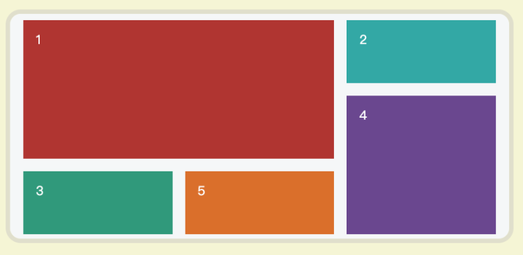

### 2. Grid布局优势

Grid布局的优势：

- 固定或者弹性的轨道尺寸
- 定位项目

- 创建额外的轨道来保存内容
- 对齐控制

- 控制重叠的内容（z-index）

**Grid布局**与**Flex布局**进行对比：

Flex布局是一维布局，只能在一条线上放置内容区块，而Grid布局是一个二维布局，根据设计需求，将内容区块放置在任何地方。

实际上，这两种布局可以很好的配合使用，达到更好的效果。

## 二、 基本概念

### 1. 网格容器

**概念：** 网格容器是所有网格项的父元素，网格容器来应用`display:grid`属性：

```javascript
.container{
      display: grid;
    }
<div class="container">
    <div class="item">1</div>
    <div class="item">2</div>
    <div class="item">3</div>
    <div class="item">4</div>
</div>
```

### 2. 网格项

**概念：** 网格项是网格容器的子元素，上面的`item`元素的就是网格项。

### 3. 网格线

**概念：** 组成网格项的分界线就是网格线，这些网格线是一些虚拟的概念。

下面的图中就有5个网格项，有3条水平的网格线和4条竖直的网格线：

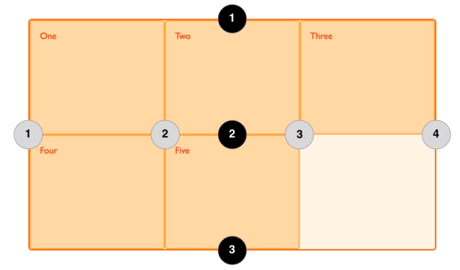


### 4. 网格轨道

**概念：** 两个相邻的网格线之间就是网格轨道。

下面图中1和2水平网格线之间就是网格轨道（红线圈起来的位置）：

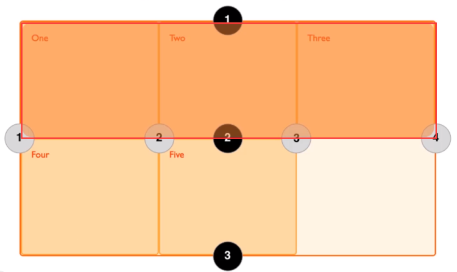


### 5. 网格单元

**概念：** 两个**相邻的列网格线**和两个**相邻的行网格线**组成是的网格单元。

下面图中，画红框的就是一个单元网格：

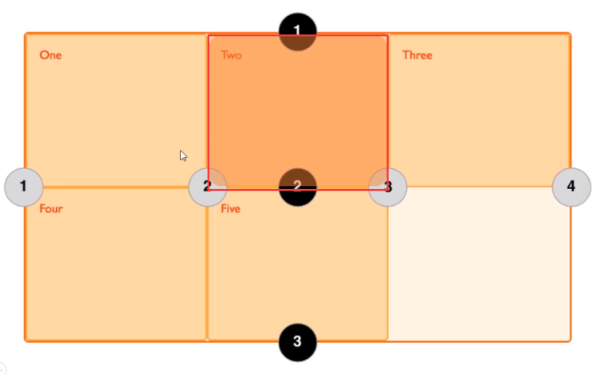


### 6. 网格区域

**概念：** 四条网格线包围的总空间就是网格区域。

在下图中，左边画红框的区域就是网格区域：

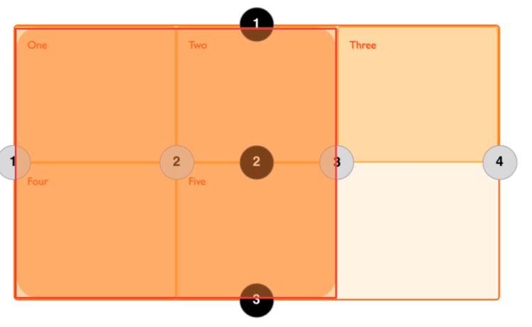

### 7. 单位

- **fr （单位）**
  剩余空间分配数，用于在一些列长度值中分配剩余空间，如果多个元素已指定了多个部分，则剩下的空间根据各自的数字按比例分配。
- **gr （单位）**
  网格数，未被W3C规定，一般不使用。

## 三、 容器中的属性

### 1. display属性

`display: grid`用来指定一个容器采用网格布局。

有三个属性：

- `grid`： 生成会块级网格
- `inline-grid`：生成行内网格（很少使用）

- `subgrid`：如果网格容器本身就是一个网格项，那么此属性就用来继承其父网格容器的列和行的大小

**需要注意：**

- 当元素设置了网格布局，`column`、`float`、`clear`、`vertical-align`属性都会失效
- 目前所有的浏览器都不支持`display:subgrid`

### 2. 定义行与列的轨道大小

- `grid-template-columns`：定义网格的行
- `grid-template-rows`：定义网格的行

他们使用空格分隔的多个值来定义网格的列和行。他们的属性值有两种：

- **轨道大小**：可以使用CSS长度（px、em等）、百分比、或用分数（用fr单位）
- **网格线名字**：可以任意选择名字

看下面的例子：

```javascript
.container{
  grid-template-columns: 40px 50px auto 50px 40px;
  grid-template-rows: 25% 100px auto;
}
```

显示出来是这样的：

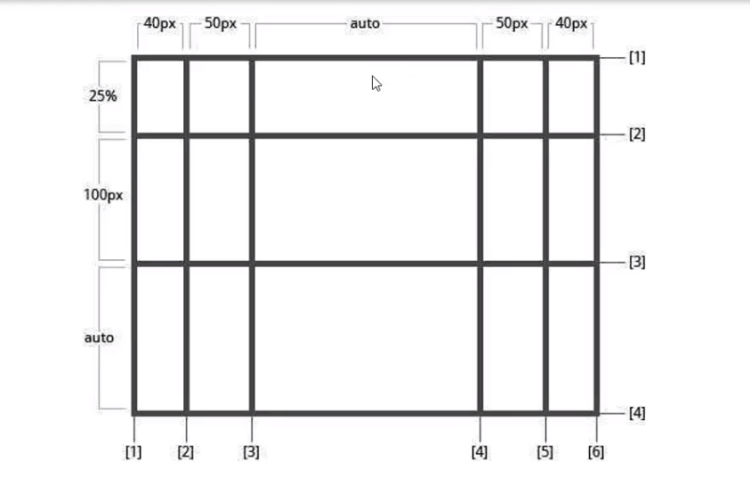


如果设置成下面的样式：

```javascript
.container{
  grid-template-columns: 100px 100px 100px 1fr 2fr;
  grid-template-rows: auto auto auto;
}
```

显示出来是这样的，前三列的宽度都是100px，后面剩余的部分分成了三份，4是一份，5是两份：

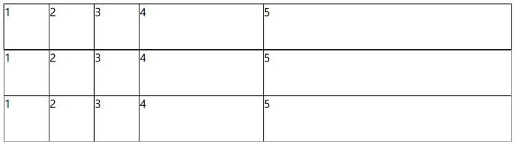

由上面的案例，我们可以看出来，所有的单位是可以在一起混用的。

如果我们只设置一行的高度，如果因为网格过多出现更多的行，那么这些多出的行的高度都是auto。

### 3. 定义网格线的名称

这两个属性还可以用来定义**网格线名称**：

```javascript
.container{
  grid-template-columns: [one]40px[two]50px[three]auto[four]50px[five]40px[six];
  grid-template-rows: 25% 100px auto;
}
```

其中：`[one]、[two]、[three]、[four]、[five]、[six]` 就是网格线的名称

### 4. grid-template-areas 定义网格的区域

通过`grid-area`属性指定的**网格区域**的名称来定义网格模板。

使用`grid-template-areas`属性来定义网格区域。该属性有以下三个属性值：

- `grid-area-name`：使用`grid-area`属性设置的网格区域的名称
- `.` ： 点号表示一个空网格单元

- `none`： 没有定义网格区域

```javascript
.container{
    grid-template-areas: "header header header header"
                         "main main . sidebar"
                         "footer footer footer footer";
}
```

效果：

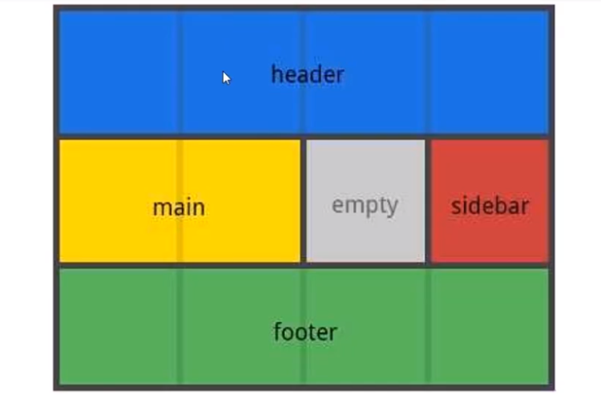

### 5. grid-template 简写

`grid-template-columns`、`grid-template-rows`、`grid-template-areas`这三个属性可以简写在`grid-template`属性中（不过，如果不熟练的话最好不要用，以免出错）。

`grid-template`属性有以下是三个属性值：

- `none`： 将三个属性都设置为其初始值，即一行一列一个单元格
- `subgrid`： 把`grid-template-columns`和`grid-template-rows`设置为`subgrid`，并且把`grid-template-areas`设置为初始值

- `grid-template-rows/grid-template-columns`：将`grid-template-columns`和`grid-template-rows`设为指定值，而`grid-template-areas`设置为`none`

### 6. gap 行与列的间距

`grid-column-gap`、`grid-row-gap`是指定的网格线的大小（宽度），也就是设置值行或列之间的间距的宽度，这两个属性的属性值是一个长度值：

```css
.container{
   grid-column-gap: 10px
   grid-row-gap: 15px
}
```

这两个属性可以进行简写，上面的样式就可以简写成这样：

```css
.container{
   grid-gap: 15px 10px
}
```

或者直接写成这样（这样写不如上面的兼容性好）：

```css
.container{
   gap: 15px 10px
}
```

如果只设置一个值，就会将行和列之间的间距设为相同的值。

### 7. items 对齐方式

`justify-items`是沿着水平方向，**内容在表格中的对齐方式**，它有四个属性值：

- `start`:内容与网格区域的左端对齐
- `end`:内容与网格区域的右端对挤

- `center`:内容位于网格区域的中间位置
- `stretch`:内容宽度占据整个网格区域空间(这是默认值)

`align-items`是沿着竖直方向，内容在表格中的对齐方式，它有四个属性值：

- `start`:内容与网格区域的顶端对齐
- `end`:内容与网格区域的低端对挤

- `center`:内容位于网格区域的垂直中心位置
- `stretch`:内容宽度占据整个网格区域空间(这是默认值)

这两个属性也可以简写：

```css
.container{
   justify-items: start
   align-items: end
}
```

简写之后（先定义竖直方向，再定义水平方向）：

```css
.container{
   place-items: end start
}
```

如果只写一个属性值，那水平和竖直方向的对齐方式相同。

### 8. content 对齐方式

`justify-content`和`align-content`是设置网格容器内沿着水平或者竖直方向上**网格在网格容器内的对齐方式**。有以下几个属性值：

- `start`:网格与网格容器的左边（上边）对齐
- `end`:网格与网格容器的右边（下边）对齐

- `cente`r:网格与网格容器的中间对齐
- `stretch`:调整grid item的大小，让宽度填充整个网格容器

- `space-around`:在grid item之间设置均等宽度的空白间隙，其外边缘间隙大小为中间空白间隙宽度的一半
- `space-between`:在grid item之间设置均等宽度空白间隙，其外边缘无间隙

- `space-evenly`:在每个grid item之间设置均等宽度的空白间隙，包括外边缘

这两个属性也可以简写：

```css
.container{
   justify-content: start
   align-content: end
}
```

简写之后（先定义竖直方向，再定义水平方向）：

```css
.container{
   place-content: end start
}
```

如果只写一个属性值，那水平和竖直方向的对齐方式相同。

### 9. grid-auto 隐式网格轨道

当我们设置的网格不足以放下所有的网格项时，就会自动出现一些网格轨道，这些多出来的行的高度是auto的，可以使用`grid-auto`属性来指定**自动生成的网格轨道**（又称为隐式网格轨道）的大小。

```css
.container{
   grid-auto-column: 100px
   grid-auto-row: 80px
}
```

长度的单位可以是px、em、fr等

使用`grid-auto-flow`属性来控制自动布局算法，它有以下属性值（较少使用）：

- `row`:告诉自动布局算法依次填充每行，根据需要添加新行
- `column`:告诉自动布局算法依次填充每列，根据需要添加新列

- `dense`:告诉自动布局算法，如果后面出现较小的grid item，则尝试在网格中填充空洞

## 四、 CSS函数

### 1. repeat()

使用`repeat()`方法可以跟踪列表的重复片段，允许大量显示重复模式的行或列以更紧凑的形式编写。

该方法只能使用在`grid-template-columns`和`grid-template-rows`这两个属性中。

```css
.container {
  display: grid;
  grid-template-columns: repeat(4, 25%);
  grid-template-rows: repeat(5, 20%);
}
```

`repeat()`接受两个参数，第一个参数是重复的次数，第二个参数是所要重复的值。

也可以是这样，重复多个值：

```css
grid-template-columns: repeat(2, 100px 50px 80px);
• 1
```

重复的次数有三种取值方式：

- `<number>`:整数，确定确切的重复次数。
- `<auto-fill>`:以网格项为准自动填充。

- `<auto-fit>`:以网格容器为准自动填充。

重读的值有以下取值方式：

- `<length>`:非负长度。
- `<percentage>`:相对于列轨道中网格容器的内联大小的非负百分比，以及行轨道中网格容器的块长宽。

- `<flex>`:单位为fr的非负维度，指定轨道弹性布局的系数值。
- `max-content`:表示网格的轨道长度自适应内容最大的那个单元格（占满整个屏幕宽度）。

- `min-content`:表示网格的轨道长度自适应内容最小的那个单元格。
- `auto`:作为最大值时，等价于max-content。作为最小值时，它表示轨道中单元格最小长宽(由min-width/min-height)的最大值。

### 2. minmax()

`minmax()`方法定义了一个长宽范围的闭区间。

它的取值和`repeat()`方法的取值是一样的，最终的取值取决于容器内的内容能撑起多大的宽度。

当最小值大于最大值时，宽度就会在设置为那个最小值

## 五、网格项上的属性

### 1. start、end

属性：`grid-column-start、grid-column-end、grid-row-start、grid-row-end`

- grid-column-start属性：左边框所在的垂直网格线
- grid-column-end属性：右边框所在的垂直网格线

- grid-row-start属性：上边框所在的水平网格线
- grid-row-end属性：下边框所在的水平网格线

使用特定的网格线来确定网格项在网格内的位置，它们的属性值有以下几种：

- `<line>`:可以是一个数字来指代相应编号的网格线，也可使用名称指代相应命名的网格线
- `span <number>`:网格项将跨越指定数量的网格轨道

- `span <name>`:网格项将跨越一些轨道 ，直到碰到指定命名的网格线
- `auto`:自动布局，或者自动跨越，或者跨越一个默认的轨道

```css
.item1 {
  grid-column-start: 2;
  grid-column-end: 4;
}
```

上面的代码会呈现出下面的效果：

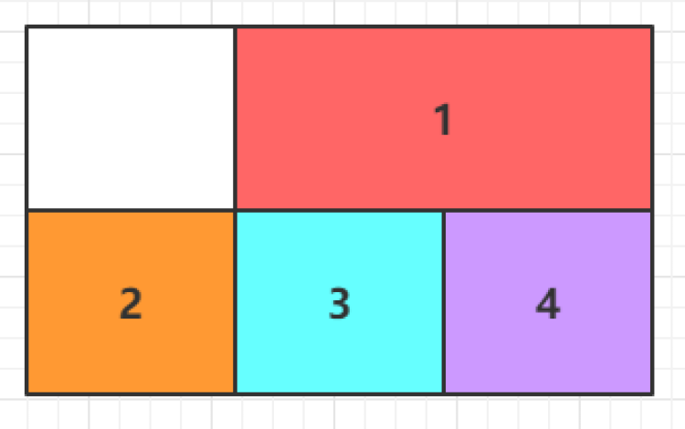

```css
.item1 {
  grid-column-start: 1;
  grid-column-end: 3;
  grid-row-start: 2;
  grid-row-end: 4;
}
```

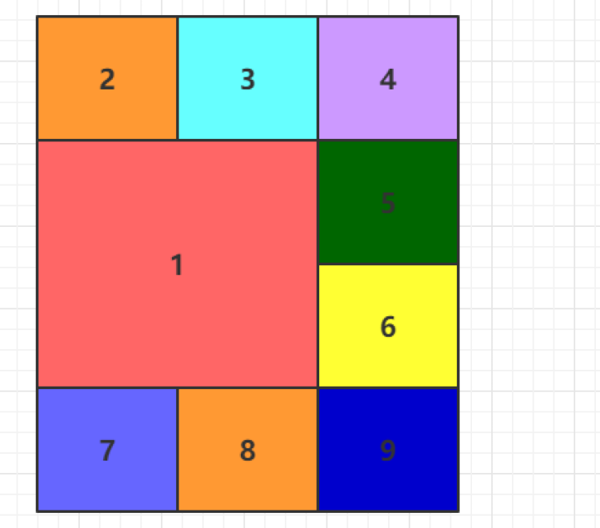

使用span来表示跨越几个网格：

```css
.item1 {
  grid-column-start: span 2;
}
```

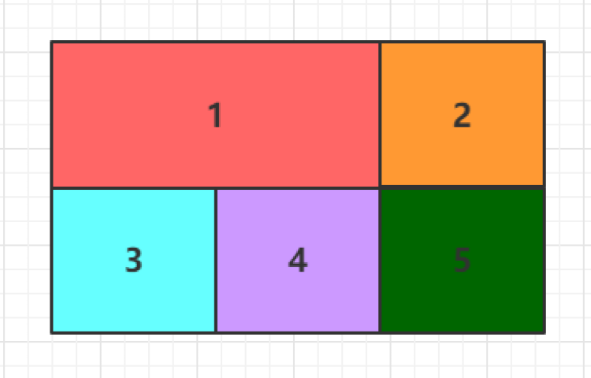

可以使用grid-column和grid-row属性对上面属性简写，以下两者等效：

```css
.item1 {
  grid-column: 1 / 3;
  grid-row: 2 / 4;
}
.item1 {
  grid-column-start: 1;
  grid-column-end: 3;
  grid-row-start: 2;
  grid-row-end: 4;
}
```

这两个属性中也可以使用span关键字，以下两者等效：

```css
.item1 {
  grid-column: 1 / 3;
  grid-row: 1 / 3;
}
.item1 {
  grid-column: 1 / span 2;
  grid-row: 1 / span 2;
}
```

斜杠后面的部分可以省略，表示跨越第一个网格。

### 2. grid-area

`grid-area`属性可以指定项目放在哪个区域，这时他的属性值是一个区域的名字

该属性还可以用作`grid-row-start`、`grid-column-start`、`grid-row-end`、`grid-column-end`的合并简写形式，直接指定项目的位置：

```css
.item {
  grid-area: <row-start> / <column-start> / <row-end> / <column-end>;
}
```

### 3. self

`self`系列有以下三个属性：

- `justify-self` 属性：设置单元格内容的水平位置，和`justify-items`作用相同，但只作用于单个单元格
- `align-self` 属性：设置单元格内容的竖直位置，和`align-items`作用相同，但只作用于单个单元格

- `place-self` 属性：是以上两个属性的简写

上面两个属性有以下四种取值：

- start：对齐单元格的起始边缘。
- end：对齐单元格的结束边缘。

- center：单元格内部居中。
- stretch：拉伸，占满单元格的整个宽度（默认值）。

`place-self` 属性的用法如下：

```css
place-self: <align-self> <justify-self>;
```

如果只有一个值，那么会认为这两个值相等。