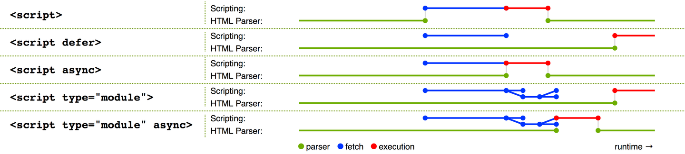
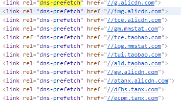
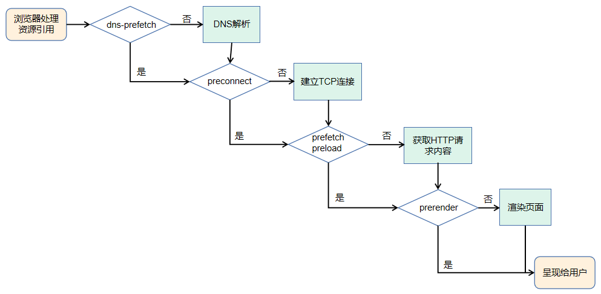

# HTML知识进阶

## 1. meta 标签：自动刷新/跳转

假设要实现一个类似 PPT 自动播放的效果，很可能会想到使用 JavaScript 定时器控制页面跳转来实现。但其实有更加简洁的实现方法，比如通过 meta 标签来实现：

```html
<meta http-equiv="Refresh" content="5; URL=page2.html">
```

上面的代码会在 5s 之后自动跳转到同域下的 page2.html 页面。要实现 PPT 自动播放的功能，只需要在每个页面的 meta 标签内设置好下一个页面的地址即可。


另一种场景，比如每隔一分钟就需要刷新页面的大屏幕监控，也可以通过 meta 标签来实现，只需去掉后面的 URL 即可：

```html
<meta http-equiv="Refresh" content="60">
```

可以看到，这样做又方便又快捷，那为什么这种用法比较少见呢？


一方面是因为不少人对 meta 标签用法缺乏深入了解，另一方面也是因为在使用它的时候，刷新和跳转操作是不可取消的，所以对刷新时间间隔或者需要手动取消的，还是推荐使用 JavaScript 定时器来实现。但是，如果只是想实现页面的定时刷新或跳转（比如某些页面缺乏访问权限，在 x 秒后跳回首页这样的场景）建议可以实践下 meta 标签的用法。

## 2. title 标签与 Hack 手段：消息提醒

B/S 架构有很多的优点，比如版本更新方便、跨平台、跨终端，但在处理某些场景，比如即时通信场景时，就会变得比较麻烦。


因为前后端通信深度依赖 HTTP 协议，而 HTTP 协议采用“请求-响应”模式，这就决定了服务端也只能被动地发送数据。一种低效的解决方案是客户端通过轮询机制获取最新消息（HTML5 下可使用 WebSocket 协议）。


消息提醒功能实现则比较困难，HTML5 标准发布之前，浏览器没有开放图标闪烁、弹出系统消息之类的接口，只能借助一些 Hack 的手段，比如修改 title 标签来达到类似的效果（HTML5 下可使用 Web Notifications API 弹出系统消息）。


下面代码中，通过定时修改 title 标签内容，模拟了类似消息提醒的闪烁效果：

```javascript
‘let msgNum = 1 // 消息条数
let cnt = 0 // 计数器
const inerval = setInterval(() => {
  cnt = (cnt + 1) % 2
  if(msgNum===0) {
    // 通过DOM修改title
    document.title += `聊天页面`
    clearInterval(interval)
    return
  }
  const prefix = cnt % 2 ? `新消息(${msgNum})` : ''
  document.title = `${prefix}聊天页面`
}, 1000)
```

实现效果如下图所示，可以看到标签名称上有提示文字在闪烁。


通过模拟消息闪烁，可以让用户在浏览其他页面的时候，及时得知服务端返回的消息。


定时修改 title 标签内容，除了用来实现闪烁效果之外，还可以制作其他动画效果，比如文字滚动，但需要注意浏览器会对 title 标签文本进行去空格操作。


动态修改 title 标签的用途不仅在于消息提醒，还可以将一些关键信息显示到标签上（比如下载时的进度、当前操作步骤），从而提升用户体验。

## 3. script 标签：调整加载顺序提升渲染速度

由于浏览器的底层运行机制，渲染引擎在解析 HTML 时，若遇到 script 标签引用文件，则会暂停解析过程，同时通知网络线程加载文件，文件加载后会切换至 JavaScript 引擎来执行对应代码，代码执行完成之后切换至渲染引擎继续渲染页面。


在这一过程中可以看到，页面渲染过程中包含了请求文件以及执行文件的时间，但页面的首次渲染可能并不依赖这些文件，这些请求和执行文件的动作反而延长了用户看到页面的时间，从而降低了用户体验。


为了减少这些时间损耗，可以借助 script 标签的 3 个属性来实现。

- **async 属性：**立即请求文件，但不阻塞渲染引擎，而是文件加载完毕后阻塞渲染引擎并立即执行文件内容。
- **defer 属性：**立即请求文件，但不阻塞渲染引擎，等到解析完 HTML 之后再执行文件内容。

- **HTML5 标准 type 属性：**对应值为“module”。让浏览器按照 ECMA Script 6 标准将文件当作模块进行解析，默认阻塞效果同 defer，也可以配合 async 在请求完成后立即执行。


具体效果可以参看下图：



其中，绿色的线表示执行解析 HTML ，蓝色的线表示请求文件，红色的线表示执行文件。


从图中可以得知，采用 3 种属性都能减少请求文件引起的阻塞时间，只有 defer 属性以及 type="module" 情况下能保证渲染引擎的优先执行，从而减少执行文件内容消耗的时间，让用户更快地看见页面（即使这些页面内容可能并没有完全地显示）。


注意，当渲染引擎解析 HTML 遇到 script 标签引入文件时，会立即进行一次渲染。所以这也就是为什么构建工具会把编译好的引用 JavaScript 代码的 script 标签放入到 body 标签底部，因为当渲染引擎执行到 body 底部时会先将已解析的内容渲染出来，然后再去请求相应的 JavaScript 文件。如果是内联脚本（即不通过 src 属性引用外部脚本文件直接在 HTML 编写 JavaScript 代码的形式），渲染引擎则不会渲染。

## 4. link 标签：通过预处理提升渲染速度

在对大型单页应用进行性能优化时，也许会用到按需懒加载的方式，来加载对应的模块，但如果能合理利用 link 标签的 rel 属性值来进行预加载，就能进一步提升渲染速度。

- **dns-prefetch**：当 link 标签的 rel 属性值为“dns-prefetch”时，浏览器会对某个域名预先进行 DNS 解析并缓存。这样，当浏览器在请求同域名资源的时候，能省去从域名查询 IP 的过程，从而减少时间损耗。下图是淘宝网设置的 DNS 预解析。



- **preconnect**：让浏览器在一个 HTTP 请求正式发给服务器前预先执行一些操作，这包括 DNS 解析、TLS 协商、TCP 握手，通过消除往返延迟来为用户节省时间。
- **prefetch/preload：**两个值都是让浏览器预先下载并缓存某个资源，但不同的是，prefetch 可能会在浏览器忙时被忽略，而 preload 则是一定会被预先下载。

- **prerender：**浏览器不仅会加载资源，还会解析执行页面，进行预渲染。


这几个属性值恰好反映了浏览器获取资源文件的过程，下面是流程图：



## 5. link 标签：减少重复

有时候为了用户访问方便或者出于历史原因，对于同一个页面会有多个网址，又或者存在某些重定向页面，比如：

- https://baidu.com/a.html
- https://baidu.com/detail?id="abcd"


那么在这些页面中可以这样设置：

```html
<link href="https://baidu.com/a.html" rel="canonical">
```

这样可以让搜索引擎避免花费时间抓取重复网页。不过需要注意的是，它还有个限制条件，那就是指向的网站不允许跨域。


当然，要合并网址还有其他的方式，比如使用站点地图，或者在 HTTP 请求响应头部添加 rel="canonical"。