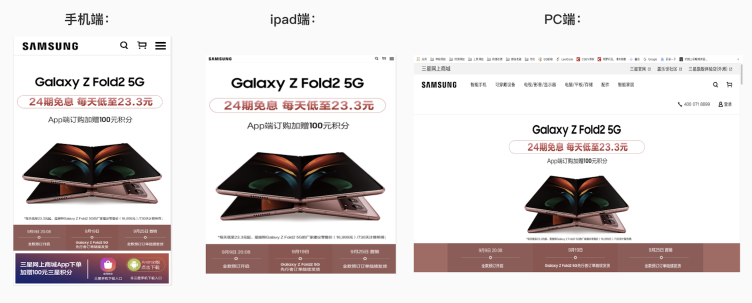
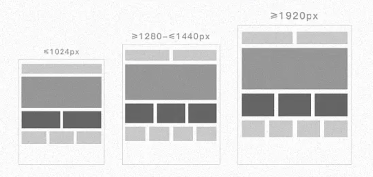
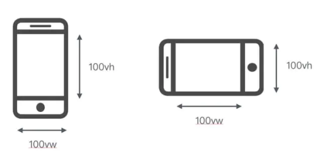

# 响应式布局

## 1. 响应式布局 && 自适应布局

### 1.1 响应式布局

首先，我们来看一下三星的官网：



我们可以看到，在不同终端下，它的网站的显示效果是不一样的。这就是根据设备的不同或者浏览器窗口的大小来进行不同的布局。在传统的开发中，往往是PC开发开发一套，手机端再开发一套。而使用响应式只需要开发一套就够了。

响应式网站有以下特点：

- 同时适配平板+PC+手机等多终端
- 标签导航在接近手持终端设备时改变为经典的抽屉式导航

- 网站的布局会根据视口来调整模块的大小和位置

上面的三星的官网就符合这三个特点。

**响应式布局的优点：**

- 面对不同分辨率设备灵活性强；
- 能够快捷解决多设备显示适用问题。

**响应式布局的缺点：**

- 效率较低，兼容各设备工作量大；
- 代码较为累赘，加载时间会加长；

- 在一定程度上改变了网站原有的布局结构，会出现用户混淆的情况

所以，在页面不是很复杂的时候，可以使用响应式布局。

### 1.2 自适应布局

说到响应式布局，就不得不说一下**自适应布局**，这两种布局很容易混淆。

自适应布局是指网页能够在不同大小的终端上自行适应显示，也就是在屏幕大小不同的终端上会显示一样的页面，它会根据屏幕的大小，自动缩放页面元素的大小。




自适应布局通常会有以下特点：

- 多数情况下，只会适配哪些主流的视口大小，不会适配所有的视口
- 当时口大小低于设置的最小视口大小时，界面会出现显示不全的情况，就会出现横向的滚动条

**自适应布局的优点：**

- 对网站复杂程度兼容更大；
- 代码更高效；

- 测试和运营都相对容易和精准。

**自适应布局的缺点：**

- 同一个网站需要为不同的设备开发不同的页面，增加的开发的成本。

所以，在页面中信息较多，布局较为复杂的情况，可以采用自适应布局的方式。

## 2. 响应式布局的实现

### 2.1 媒体查询

最常见的响应式布局实现方式就是媒体查询，CSS3中的媒体查询可以让我们针对不同的媒体类型定义的不同的样式，当重置浏览器窗口大小的过程中，页面也会根据浏览器的宽度和高度重新渲染页面。

我们可以通过设置断点，为各种屏幕宽度的设备提供对应的样式。断点一般可以设置为三种类型：

- 手机（<=480px）
- 平板（480-720px）

- 桌面电脑（>=1024px）

这当然只是大概的设置，如果想更加具体点，可以拖动浏览器屏幕，以适应不同的宽度，选择开始变形的那个尺度作为断点即可。

**第一步，设置媒体查询的meta标签：**

```html
<meta name="viewport" content="width=device-width, initial-scale=1, maximum-scale=1, user-scalable=no">
• 1
```

其中：

- width=device-width: 自适应手机屏幕的尺寸宽度。
- maximum-scale: 缩放比例的最大值。

- minimum-scale: 缩放比例的最小值。
- inital-scale: 缩放的初始化。

- user-scalable: 用户的可以缩放的操作。

**第二步，使用媒体查询设置样式：**

```css
@media screen and (max-width: 1024px){
    // 分辨率在720～1024px样式 
}
@media screen and (max-width: 720px){
    // 分辨率在480～720px的样式 
}
@media screen and (max-width: 480px){
    // 分辨率在0～480px的样式 
}
```

对于@Media查询的分界点，这个可以根据页面进行调整，设置合适页面的布局分界点。在设置分界点时，要注意先后顺序，当使用`max-width`数值大的在前面，数值小的在后面；当使用`min-width`时，数值小的放前面，数值大的放后面。通常来说，如果是移动端优先，则用`min-width`；如果是PC端优先，则用`max-width`。

**移动优先 && PC优先**

不管是移动优先还是PC优先，都是依据当随着屏幕宽度增大或减小的时候，后面的样式会覆盖前面的样式。因此，移动端优先首先使用的是min-width，PC端优先使用的max-width。

**移动优先：**

```css
@media screen and (max-width: 320px) {
    // 分辨率在0～320px的样式 
}
@media screen and (min-width: 480px){
    // 分辨率在480～720px的样式 
}
@media screen and (min-width: 720px){
    // 分辨率在720～1024px样式 
}
@media screen and (min-width: 1024px){
    // 分辨率在>=1024px样式 
}
```

**PC优先：**

```css
@media screen and (max-width: 1024px){
    // 分辨率在720～1024px样式 
}
@media screen and (max-width: 720px){
    // 分辨率在480～720px的样式 
}
@media screen and (max-width: 480px){
    // 分辨率在0～480px的样式 
}
```

**媒体查询的实现方式有三种：**

- 在连接时调用：

```html
<link href="styles.css" rel="stylesheet" media="(max-width:480px)">
```

- 使用@import导入：

```css
@import url(styles.css) (max-width:480px)
```

- 在样式表中使用：

```css
@media (min-width: 481px) and (max-width:768px) {
    // 样式
}
```

MDN中关于媒体查询的介绍：[链接](https://developer.mozilla.org/zh-CN/docs/Web/Guide/CSS/Media_queries)

### 2.2 百分比布局

当浏览器的宽度或者高度发生变化时，通过百分比单位，通过百分比单位可以使得浏览器中的组件的宽和高随着浏览器的变化而变化，从而实现响应式的效果。

height,width属性的百分比依托于父标签的宽高。但是，padding、border、margin等属性的情况又有所不同：

- 子元素的top和bottom如果设置百分比，则相对于直接非static定位(默认定位)的父元素的高度，同样，子元素的left和right如果设置百分比，则相对于直接非static定位(默认定位的)父元素的宽度。
- 子元素的padding如果设置百分比，不论是垂直方向或者是水平方向，都相对于直接父亲元素的width，而与父元素的height无关。

- 子元素的margin如果设置成百分比，不论是垂直方向还是水平方向，都相对于直接父元素的width
- border-radius不一样，如果设置border-radius为百分比，则是相对于自身的宽度

我们可以看到，百分比布局非常的麻烦，需要自己将元素的宽高换算成百分比的单位，并且需要考虑的因素很多，所以不建议使用。

### 2.3 rem布局

rem是CSS3新增的单位，并且移动端的支持度很高。rem单位都是相对于根元素html的font-size来决定大小的,根元素的font-size相当于提供了一个基准，当页面的size发生变化时，只需要改变font-size的值，那么以rem为固定单位的元素的大小也会发生响应的变化。 因此，如果通过rem来实现响应式的布局，只需要根据视图容器的大小，动态的改变font-size即可（而em是相对于父元素的）。

rem响应式的**布局思想**：

- 一般不要给元素设置具体的宽度，但是对于一些小图标可以设定具体宽度值
- 高度值可以设置固定值，设计稿有多大，我们就严格有多大

- 所有设置的固定值都用rem做单位（首先在HTML总设置一个基准值：px和rem的对应比例，然后在效果图上获取px值，布局的时候转化为rem值)
- js获取真实屏幕的宽度，让其除以设计稿的宽度，算出比例，把之前的基准值按照比例进行重新的设定，这样项目就可以在移动端自适应了

rem布局的**缺点**：

- 在响应式布局中，必须通过js来动态控制根元素font-size的大小，也就是说css样式和js代码有一定的耦合性，且必须将改变font-size的代码放在css样式之前

### 2.4 视口

CSS3中引入了一个新的单位vw/vh，与视图窗口有关，vw表示相对于视图窗口的宽度，vh表示相对于视图窗口高度，除了vw和vh外，还有vmin和vmax两个相关的单位。各个单位具体的含义如下：

- `vw`：相对于视窗的宽度，1vw 等于视口宽度的1%，视窗宽度是100vw
- `vh`：相对于视窗的高度，1vh 等于视口高度的1%，视窗高度是100vh

- `vmin`：vw和vh中的较小值
- `vmax`：vw和vh中的较大值
 

  用视口单位度量，视口宽度为100vw，高度为100vh（左侧为竖屏情况，右侧为横屏情况）。例如，在桌面端浏览器视口尺寸为650px，那么 1vw = 650 * 1% = 6.5px（这是一个理论值，如果浏览器不支持0.5px，那么实际渲染结果可能是7px）。

## 3. 响应式布局中的问题

### 3.1 图片的响应式

图片响应式包括两个方面，一个就是**大小自适应**，这样能够保证图片在不同的屏幕分辨率下出现压缩、拉伸的情况；一个就是**根据不同的屏幕分辨率和设备像素比来尽可能选择高分辨率的图片**，也就是当在小屏幕上不需要高清图或大图，这样我们用小图代替，就可以减少网络带宽了

**1. 使用max-width（图片自适应）:**

图片自适应就是图片能随着容器的大小进行缩放，可以采用如下代码：

```css
img {
    display: inline-block;
    max-width: 100%;
    height: auto;
}
```

`inline-block` 元素相对于它周围的内容以内联形式呈现，但与内联不同的是，这种情况下我们可以设置宽度和高度。 `max-width`保证了图片能够随着容器的进行等宽扩充（即保证所有图片最大显示为其自身的 100%。此时，如果包含图片的元素比图片固有宽度小，图片会缩放占满最大可用空间），而`height`为`auto`可以保证图片进行等比缩放而不至于失真。如果是背景图片的话要灵活运用`background-size`属性。

那为什么不能用`width：100%`呢？因为这样会导致它显示得跟它的容器一样宽。在容器比图片宽得多的情况下，图片会被拉伸。

**2. 使用srcset**

`srcset`属性用于浏览器根据不同的宽、高和像素密度来加载相应的图片资源，可以用来让在高密度屏幕上图片更好的显示。

属性格式：**图片地址 宽度描述w 像素密度描述x**

多个资源时用逗号隔开

```html

```

如果屏幕的`dpi = 1`，则加载1倍图；若`dpi = 2`，则加载2倍图。手机和mac基本上dpi都达到了2以上，这样子对于普通屏幕来说不会浪费流量，而对于视网膜屏来说又有高清的体验。如果浏览器不支持`srcset`，则默认加载`src`里面的图片。

**3. 使用background-image**

```css
.banner{
  background-image: url(/static/large.jpg);
}
@media screen and (max-width: 767px){
  background-image: url(/static/small.jpg);
}
```

### 3.2 响应式布局的要点

在实际项目中，我们可能需要综合上面的方案，比如用rem来做字体的适配，用srcset来做图片的响应式，宽度可以用rem，flex，栅格系统等来实现响应式，然后可能还需要利用媒体查询来作为响应式布局的基础，因此综合上面的实现方案，项目中实现响应式布局需要注意下面几点：

- 设置viewport
- 媒体查询

- 字体的适配（字体单位）
- 百分比布局

- 图片的适配（图片的响应式）
- 结合flex，grid，BFC，栅格系统等已经成型的方案

### 3.3 盒子模型问题

浏览器的盒子模型默认是不把边框和内边距计算在内容区的width中的（IE低版本除外），当使用流式布局时，就是百分比设置栏宽时，就会出现问题。如第一栏的width是60%，第二栏是40%，本来是一行内刚好放得下，但如果某一栏设置边框或者内边距后，整体宽度就被加大，第二栏就会被挤下去。


所以我们可以设置`box-sizing：border-box;`，将边框和内边距计算进内容区的width中，即60%中包含了边框和内边距。

### 3.4 HTML代码的顺序

要注意HTML代码的顺序，因为很多时候我们的主内容区是放到中间的，如：

```html
<aside></aside>
<article></article>
<aside></aside>
```

而在移动端时它应该放到最上面，可由于代码的顺序关系，清除浮动后，它是按顺序放到中间去了，（具体看上图）。为了增强用户体验，让移动端的用户第一眼就能看到主要内容，而不用下拉，所以HTML编码时，应该让主内容区放到最上层，要浮动时，加个外层，让主内容区和相邻侧边分别浮动到两边即可。大概代码：

```css
<div>
    <article></article>
    <aside></aside>
</div>
<aside></aside>
div{
    float:left;
    width: 80%;
}
div article{
    float:right;
    width: 75%;
}
div aside{
    float:left;
    width: 25%
}
aside{
    float:left;
    width: 20%
}
```

### 3.5 成型的响应式布局方案

现在的css，UI框架等都已经考虑到了适配不同屏幕分辨率的问题，实际项目中我们可以直接使用这些新特性和框架来实现响应式布局。可以有以下选择方案：

- 利用上面的方法来实现，比如CSS3 Media Query，rem，vw等
- Columns栅格系统，往往需要依赖某些框架，如Bootstrap、elementUI，iview等

- Flex弹性布局，兼容性较差，在移动端支持较好
- Grid网格布局，兼容性较差

## 4. 总结