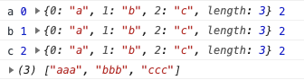

# 深入理解JavaScript数组

## 一、数组构造器

### 1. 基础构造器

Array 构造器用于创建一个新的数组。通常，我们推荐使用对象字面量的方式创建一个数组，例如 var a = [] 就是一个比较好的写法。但是，总有对象字面量表述乏力的时候，比如，创建一个长度为 6 的空数组，用对象字面量的方式是无法创建的，因此只能写成这样：

```javascript
// 使用 Array 构造器，可以自定义长度
var a = Array(6); // [undefined × 6]
// 使用对象字面量
var b = [];
b.length = 6; // [undefined × 6]
```

Array 构造器根据参数长度的不同，有如下两种不同的处理方式：

- new Array(arg1, arg2,…)，参数长度为 0 或长度大于等于 2 时，传入的参数将按照顺序依次成为新数组的第 0 至第 N 项（参数长度为 0 时，返回空数组）；
- new Array(len)，当 len 不是数值时，处理同上，返回一个只包含 len 元素一项的数组；当 len 为数值时，len 最大不能超过 32 位无符号整型，即需要小于 2 的 32 次方（len 最大为 Math.pow(2,32)），否则将抛出 RangeError。

### 2. ES6 构造器

鉴于数组的常用性，ES6 专门扩展了数组构造器 Array ，新增了 2 个方法：Array.of、Array.from。其中，Array.of 整体用得比较少，而 Array.from 具有灵活性。

#### （1）Array.of

Array.of 用于将参数依次转化为数组中的一项，然后返回这个新数组，而不管这个参数是数字还是其他。它基本上与 Array 构造器功能一致，唯一的区别就在单个数字参数的处理上。


比如，在下面的这几行代码中，你可以看到区别：当参数为两个时，返回的结果是一致的；当参数是一个时，Array.of 会把参数变成数组里的一项，而构造器则会生成长度和第一个参数相同的空数组。

```javascript
Array.of(8.0); // [8]
Array(8.0); // [empty × 8]
Array.of(8.0, 5); // [8, 5]
Array(8.0, 5); // [8, 5]
Array.of('8'); // ["8"]
Array('8'); // ["8"]
Array.from
```

#### （2）Array.from

Array.from 的设计初衷是快速便捷地基于其他对象创建新数组，准确来说就是从一个类似数组的可迭代对象中创建一个新的数组实例。其实就是，只要一个对象有迭代器，Array.from 就能把它变成一个数组（注意：是返回新的数组，不改变原对象）。


从语法上看，Array.from 有 3 个参数：

- 类似数组的对象，必选；
- 加工函数，新生成的数组会经过该函数的加工再返回；

- this 作用域，表示加工函数执行时 this 的值。


这三个参数里面第一个参数是必选的，后两个参数都是可选的：

```javascript
var obj = {0: 'a', 1: 'b', 2:'c', length: 3};
Array.from(obj, function(value, index){
  console.log(value, index, this, arguments.length);
  return value.repeat(3);   //必须指定返回值，否则返回 undefined
}, obj);
```

结果如图：



结果中可以看出 `console.log(value, index, this, arguments.length)` 对应的四个值，并且看到 return 的 value 重复了三遍，最后返回的数组为 `["aaa","bbb","ccc"]`。


这表明了通过 Array.from 这个方法可以自己定义加工函数的处理方式，从而返回想要得到的值；如果不确定返回值，则会返回 undefined，最终生成的也是一个包含若干个 undefined 元素的空数组。


实际上，如果这里不指定 this 的话，加工函数完全可以是一个箭头函数。上述代码可以简写为如下形式。

```javascript
Array.from(obj, (value) => value.repeat(3));
//  控制台返回 (3) ["aaa", "bbb", "ccc"]
```

除了上述 obj 对象以外，拥有迭代器的对象还包括 String、Set、Map 等，`Array.from` 统统可以处理：

```javascript
// String
Array.from('abc');         // ["a", "b", "c"]
// Set
Array.from(new Set(['abc', 'def'])); // ["abc", "def"]
// Map
Array.from(new Map([[1, 'ab'], [2, 'de']])); 
// [[1, 'ab'], [2, 'de']]
```

## 二、数组判断

在 ES5 提供该方法之前，至少有如下 5 种方式去判断一个变量是否为数组：

```javascript
var a = [];

// 1.基于instanceof
a instanceof Array;
// 2.基于constructor
a.constructor === Array;
// 3.基于Object.prototype.isPrototypeOf
Array.prototype.isPrototypeOf(a);
// 4.基于getPrototypeOf
Object.getPrototypeOf(a) === Array.prototype;
// 5.基于Object.prototype.toString
Object.prototype.toString.apply(a) === '[object Array]';
```

上面这 5 个判断全部为 True，推荐通过 Object.prototype.toString 去判断一个值的类型。


ES6 之后新增了一个 `Array.isArray` 方法，能直接判断数据类型是否为数组，但是如果 isArray 不存在，那么 `Array.isArray` 的 polyfill 通常可以这样写：

```javascript
if (!Array.isArray){
  Array.isArray = function(arg){
    return Object.prototype.toString.call(arg) === '[object Array]';
  };
}
```

## 三、数组方法

### 1. 改变自身的方法

基于 ES6，会改变自身值的方法一共有 9 个，分别为 pop、push、reverse、shift、sort、splice、unshift，以及两个 ES6 新增的方法 copyWithin 和 fill。

```javascript
// pop方法
var array = ["cat", "dog", "cow", "chicken", "mouse"];
var item = array.pop();
console.log(array); // ["cat", "dog", "cow", "chicken"]
console.log(item); // mouse

// push方法
var array = ["football", "basketball",  "badminton"];
var i = array.push("golfball");
console.log(array); 
// ["football", "basketball", "badminton", "golfball"]
console.log(i); // 4

// reverse方法
var array = [1,2,3,4,5];
var array2 = array.reverse();
console.log(array); // [5,4,3,2,1]
console.log(array2===array); // true

// shift方法
var array = [1,2,3,4,5];
var item = array.shift();
console.log(array); // [2,3,4,5]
console.log(item); // 1

// unshift方法
var array = ["red", "green", "blue"];
var length = array.unshift("yellow");
console.log(array); // ["yellow", "red", "green", "blue"]
console.log(length); // 4

// sort方法
var array = ["apple","Boy","Cat","dog"];
var array2 = array.sort();
console.log(array); // ["Boy", "Cat", "apple", "dog"]
console.log(array2 == array); // true

// splice方法
var array = ["apple","boy"];
var splices = array.splice(1,1);
console.log(array); // ["apple"]
console.log(splices); // ["boy"]

// copyWithin方法
var array = [1,2,3,4,5]; 
var array2 = array.copyWithin(0,3);
console.log(array===array2,array2);  // true [4, 5, 3, 4, 5]

// fill方法
var array = [1,2,3,4,5];
var array2 = array.fill(10,0,3);
console.log(array===array2,array2);  // true [10, 10, 10, 4, 5], 可见数组区间[0,3]的元素全部替换为10
```

### 2. 不改变自身的方法

基于 ES7，不会改变自身的方法也有 9 个，分别为 concat、join、slice、toString、toLocateString、indexOf、lastIndexOf、未形成标准的 toSource，以及 ES7 新增的方法 includes。

```javascript
// concat方法
var array = [1, 2, 3];
var array2 = array.concat(4,[5,6],[7,8,9]);
console.log(array2); // [1, 2, 3, 4, 5, 6, 7, 8, 9]
console.log(array); // [1, 2, 3], 可见原数组并未被修改

// join方法
var array = ['We', 'are', 'Chinese'];
console.log(array.join()); // "We,are,Chinese"
console.log(array.join('+')); // "We+are+Chinese"

// slice方法
var array = ["one", "two", "three","four", "five"];
console.log(array.slice()); // ["one", "two", "three","four", "five"]
console.log(array.slice(2,3)); // ["three"]

// toString方法
var array = ['Jan', 'Feb', 'Mar', 'Apr'];
var str = array.toString();
console.log(str); // Jan,Feb,Mar,Apr

// tolocalString方法
var array= [{name:'zz'}, 123, "abc", new Date()];
var str = array.toLocaleString();
console.log(str); // [object Object],123,abc,2016/1/5 下午1:06:23

// indexOf方法
var array = ['abc', 'def', 'ghi','123'];
console.log(array.indexOf('def')); // 1

// includes方法
var array = [-0, 1, 2];
console.log(array.includes(+0)); // true
console.log(array.includes(1)); // true
var array = [NaN];
console.log(array.includes(NaN)); // true
```

### 3. 数组遍历的方法

基于 ES6，不会改变自身的遍历方法一共有 12 个，分别为 forEach、every、some、filter、map、reduce、reduceRight，以及 ES6 新增的方法 entries、find、findIndex、keys、values。

```javascript
// forEach方法
var array = [1, 3, 5];
var obj = {name:'cc'};
var sReturn = array.forEach(function(value, index, array){
  array[index] = value;
  console.log(this.name); // cc被打印了三次, this指向obj
},obj);
console.log(array); // [1, 3, 5]
console.log(sReturn); // undefined, 可见返回值为undefined

// every方法
var o = {0:10, 1:8, 2:25, length:3};
var bool = Array.prototype.every.call(o,function(value, index, obj){
  return value >= 8;
},o);
console.log(bool); // true

// some方法
var array = [18, 9, 10, 35, 80];
var isExist = array.some(function(value, index, array){
  return value > 20;
});
console.log(isExist); // true 

// map 方法
var array = [18, 9, 10, 35, 80];
array.map(item => item + 1);
console.log(array);  // [19, 10, 11, 36, 81]

// filter 方法
var array = [18, 9, 10, 35, 80];
var array2 = array.filter(function(value, index, array){
  return value > 20;
});
console.log(array2); // [35, 80]

// reduce方法
var array = [1, 2, 3, 4];
var s = array.reduce(function(previousValue, value, index, array){
  return previousValue * value;
},1);
console.log(s); // 24

// ES6写法更加简洁
array.reduce((p, v) => p * v); // 24

// reduceRight方法 (和reduce的区别就是从后往前累计)
var array = [1, 2, 3, 4];
array.reduceRight((p, v) => p * v); // 24

// entries方法
var array = ["a", "b", "c"];
var iterator = array.entries();
console.log(iterator.next().value); // [0, "a"]
console.log(iterator.next().value); // [1, "b"]
console.log(iterator.next().value); // [2, "c"]
console.log(iterator.next().value); // undefined, 迭代器处于数组末尾时, 再迭代就会返回undefined

// find & findIndex方法
var array = [1, 3, 5, 7, 8, 9, 10];
function f(value, index, array){
  return value%2==0;     // 返回偶数
}
function f2(value, index, array){
  return value > 20;     // 返回大于20的数
}
console.log(array.find(f)); // 8
console.log(array.find(f2)); // undefined
console.log(array.findIndex(f)); // 4
console.log(array.findIndex(f2)); // -1

// keys方法
[...Array(10).keys()];     // [0, 1, 2, 3, 4, 5, 6, 7, 8, 9]
[...new Array(10).keys()]; // [0, 1, 2, 3, 4, 5, 6, 7, 8, 9]

// values方法
var array = ["abc", "xyz"];
var iterator = array.values();
console.log(iterator.next().value);//abc
console.log(iterator.next().value);//xyz
```

## 四、类数组对象

JavaScript 中一直存在一种类数组的对象，它们不能直接调用数组的方法，但是又和数组比较类似，在某些特定的编程场景中会出现，下面就来看一下什么是类数组。


在 JavaScript 中，主要有以下情况中的对象是类数组：

- 函数里面的参数对象 arguments；
- 用 getElementsByTagName/ClassName/Name 获得的 HTMLCollection；

- 用 querySelector 获得的 NodeList。


首先来思考两个问题：

- 类数组是否能使用数组的方法？
- 类数组有哪些方式可以转换成数组？

### 1. 类数组基本介绍

#### （1）arguments

在日常开发中经常会遇到各种类数组对象，最常见的就是在函数中使用的 arguments，它的对象只定义在函数体中，包括了函数的参数和其他属性。先来看下 arguments 的使用方法：

```javascript
function foo(name, age, sex) {
    console.log(arguments);
    console.log(typeof arguments);
    console.log(Object.prototype.toString.call(arguments));
}
foo('jack', '18', 'male');
```

打印结果如下：


从结果中可以看到，typeof 这个 arguments 返回的是 object，通过 Object.prototype.toString.call 返回的结果是 '[object arguments]'，可以看出来返回的不是 '[object array]'，说明 arguments 和数组还是有区别的。


length 属性就是函数参数的长度。另外 arguments 还有一个 callee 属性，下面看看这个 callee 是干什么的：

```javascript
function foo(name, age, sex) {
    console.log(arguments.callee);
}

foo('jack', '18', 'male');
```

打印结果如下：

```javascript
ƒ foo(name, age, sex) {
    console.log(arguments.callee);
}
```

从控制台可以看到，输出的就是函数自身，如果在函数内部直接执行调用 callee，那它就会不停地执行当前函数，直到执行到内存溢出。

#### （2）HTMLCollection

HTMLCollection 简单来说是 HTML DOM 对象的一个接口，这个接口包含了获取到的 DOM 元素集合，返回的类型是类数组对象，如果用 typeof 来判断的话，它返回的是 'object'。它是及时更新的，当文档中的 DOM 变化时，它也会随之变化。


下面来 HTMLCollection 最后返回的是什么，在一个**有 form 表单**的页面中，在控制台中执行下述代码：

```javascript
var elem1, elem2;
// document.forms 是一个 HTMLCollection
elem1 = document.forms[0];
elem2 = document.forms.item(0);
console.log(elem1);
console.log(elem2);
console.log(typeof elem1);
console.log(Object.prototype.toString.call(elem1));
```

打印结果如下：


可以看到，这里打印出来了页面第一个 form 表单元素，同时也打印出来了判断类型的结果，说明打印的判断的类型和 arguments 返回的也比较类似，typeof 返回的都是 'object'，和上面的类似。


注意：HTML DOM 中的 HTMLCollection 是即时更新的，当其所包含的文档结构发生改变时，它会自动更新。

#### （3）NodeList

NodeList 对象是节点的集合，通常是由 querySlector 返回的。NodeList 不是一个数组，也是一种类数组。虽然 NodeList 不是一个数组，但是可以使用 for...of 来迭代。在一些情况下，NodeList 是一个实时集合，也就是说，如果文档中的节点树发生变化，NodeList 也会随之变化。

```javascript
var list = document.querySelectorAll('input[type=checkbox]');
for (var checkbox of list) {
  checkbox.checked = true;
}
console.log(list);
console.log(typeof list);
console.log(Object.prototype.toString.call(list));
```

打印结果如下：


### 2. 类数组应用场景

#### （1）遍历参数操作

在函数内部可以直接获取 arguments 这个类数组的值，那么也可以对于参数进行一些操作，比如下面这段代码可以将函数的参数默认进行求和操作：

```javascript
function add() {
    var sum =0,
        len = arguments.length;
    for(var i = 0; i < len; i++){
        sum += arguments[i];
    }
    return sum;
}
add()                           // 0
add(1)                          // 1
add(1，2)                       // 3
add(1,2,3,4);                   // 10
```

结合上面这段代码，在函数内部可以将参数直接进行累加操作，以达到预期的效果，参数多少也可以不受限制，根据长度直接计算，返回出最后函数的参数的累加结果，其他操作也类似。

#### （2）定义连接字符串函数

可以通过 arguments 这个例子定义一个函数来连接字符串。这个函数唯一正式声明了的参数是一个字符串，该参数指定一个字符作为衔接点来连接字符串。该函数定义如下：

```javascript
function myConcat(separa) {
  var args = Array.prototype.slice.call(arguments, 1);
  return args.join(separa);
}
myConcat(", ", "red", "orange", "blue");
// "red, orange, blue"
myConcat("; ", "elephant", "lion", "snake");
// "elephant; lion; snake"
myConcat(". ", "one", "two", "three", "four", "five");
// "one. two. three. four. five"
```

这段代码说明可以传递任意数量的参数到该函数，并使用每个参数作为列表中的项创建列表进行拼接。从这个例子中也可以看出，可以在日常编码中采用这样的代码抽象方式，把需要解决的这一类问题，都抽象成通用的方法，来提升代码的可复用性。

#### （3）传递参数

我们可以借助apply 或 call 与 arguments 相结合，将参数从一个函数传递到另一个函数：

```javascript
1. // 使用 apply 将 foo 的参数传递给 bar
2. function foo() {
3.     bar.apply(this, arguments);
4. }
5. function bar(a, b, c) {
6. console.log(a, b, c);
7. }
8. foo(1, 2, 3)   //1 2 3
```

上述代码中，通过在 foo 函数内部调用 apply 方法，用 foo 函数的参数传递给 bar 函数，这样就实现了借用参数的妙用。

### 3. 类数组转为数组

#### （1）借用数组方法

类数组因为不是真正的数组，所以没有数组类型上自带的那些方法，所以就需要利用下面这几个方法去借用数组的方法。比如借用数组的 push 方法，代码如下：

```javascript
var arrayLike = { 
  0: 'java',
  1: 'script',
  length: 2
} 
Array.prototype.push.call(arrayLike, 'jack', 'lily'); 
console.log(typeof arrayLike); // 'object'
console.log(arrayLike);
// {0: "java", 1: "script", 2: "jack", 3: "lily", length: 4}
```

可以看到，arrayLike 其实是一个对象，模拟数组的一个类数组，从数据类型上说它是一个对象，新增了一个 length 的属性。还可以看出，用 typeof 来判断输出的是 'object'，它自身是不会有数组的 push 方法的，这里用 call 的方法来借用 Array 原型链上的 push 方法，可以实现一个类数组的 push 方法，给 arrayLike 添加新的元素。


从打印结果可以看出，数组的 push 方法满足了我们想要实现添加元素的诉求。再来看下 arguments 如何转换成数组：

```javascript
function sum(a, b) {
  let args = Array.prototype.slice.call(arguments);
 // let args = [].slice.call(arguments); // 这样写也是一样效果
  console.log(args.reduce((sum, cur) => sum + cur));
}
sum(1, 2);  // 3
function sum(a, b) {
  let args = Array.prototype.concat.apply([], arguments);
  console.log(args.reduce((sum, cur) => sum + cur));
}
sum(1, 2);  // 3
```

可以看到，借用 Array 原型链上的各种方法，来实现 sum 函数的参数相加的效果。一开始都是将 arguments 通过借用数组的方法转换为真正的数组，最后都又通过数组的 reduce 方法实现了参数转化的真数组 args 的相加，最后返回预期的结果。

#### （2）借用ES6方法

我们还可以采用 ES6 新增的 Array.from 方法以及展开运算符的方法来将类数组转化为数组。那么还是围绕上面这个 sum 函数来进行改变，看下用 Array.from 和展开运算符是怎么实现转换数组的：

```javascript
function sum(a, b) {
  let args = Array.from(arguments);
  console.log(args.reduce((sum, cur) => sum + cur));
}
sum(1, 2);    // 3
function sum(a, b) {
  let args = [...arguments];
  console.log(args.reduce((sum, cur) => sum + cur));
}
sum(1, 2);    // 3
function sum(...args) {
  console.log(args.reduce((sum, cur) => sum + cur));
}
sum(1, 2);    // 3
```

可以看到，Array.from 和 ES6 的展开运算符，都可以把 arguments 这个类数组转换成数组 args，从而实现调用 reduce 方法对参数进行累加操作。其中第二种和第三种都是用 ES6 的展开运算符，虽然写法不一样，但是基本都可以满足多个参数实现累加的效果。

## 五、数组扁平化

数组的扁平化其实就是将一个嵌套多层的数组 array（嵌套可以是任何层数）转换为只有一层的数组。举个简单的例子，假设有个名为 flatten 的函数可以做到数组扁平化，那么输出效果如下：

```javascript
let arr = [1, [2, [3, 4，5]]];
console.log(flatten(arr));  // [1, 2, 3, 4，5]
```

简单来说就是把多维的数组“拍平”，输出最后的一维数组。下面来看看实现flatten函数的方式。

### 1. 递归实现

普通的递归思路很容易理解，就是通过循环递归的方式，一项一项地去遍历，如果每一项还是一个数组，那么就继续往下遍历，利用递归程序的方法，来实现数组的每一项的连接：

```javascript
let arr = [1, [2, [3, 4, 5]]];
function flatten(arr) {
  let result = [];

  for(let i = 0; i < arr.length; i++) {
    if(Array.isArray(arr[i])) {
      result = result.concat(flatten(arr[i]));
    } else {
      result.push(arr[i]);
    }
  }
  return result;
}
flatten(arr);  //  [1, 2, 3, 4，5]
```

从上面代码可以看出，最后返回的结果是扁平化的结果，这段代码核心就是循环遍历过程中的递归操作，就是在遍历过程中发现数组元素还是数组的时候进行递归操作，把数组的结果通过数组的 concat 方法拼接到最后要返回的 result 数组上，那么最后输出的结果就是扁平化后的数组。

### 2. reduce 函数迭代

从上面普通的递归函数中可以看出，其实就是对数组的每一项进行处理，那么其实也可以用reduce 来实现数组的拼接，从而简化第一种方法的代码，改造后的代码如下所示：

```javascript
let arr = [1, [2, [3, 4]]];
function flatten(arr) {
    return arr.reduce(function(prev, next){
        return prev.concat(Array.isArray(next) ? flatten(next) : next)
    }, [])
}
console.log(flatten(arr));//  [1, 2, 3, 4，5]
```

这段代码在控制台执行之后，也可以得到想要的结果。这里你可以回忆一下之前说的 reduce 的参数问题，我们可以看到 reduce 的第一个参数用来返回最后累加的结果，思路和第一种递归方法是一样的，但是通过使用 reduce 之后代码变得更简洁了，也同样解决了扁平化的问题。

### 3. 扩展运算符实现

这个方法的实现，采用了扩展运算符和 some 的方法，两者共同使用，达到数组扁平化的目的：

```javascript
let arr = [1, [2, [3, 4]]];
function flatten(arr) {
    while (arr.some(item => Array.isArray(item))) {
        arr = [].concat(...arr);
    }
    return arr;
}
console.log(flatten(arr)); //  [1, 2, 3, 4，5]
```

从执行的结果中可以发现，先用数组的 some 方法把数组中仍然是组数的项过滤出来，然后执行 concat 操作，利用 ES6 的展开运算符，将其拼接到原数组中，最后返回原数组，达到了预期的效果。

### 4. split 和 toString 

可以通过 split 和 toString 两个方法来共同实现数组扁平化，由于数组会默认带一个 toString 的方法，所以可以把数组直接转换成逗号分隔的字符串，然后再用 split 方法把字符串重新转换为数组，如下面的代码所示：

```javascript
let arr = [1, [2, [3, 4]]];
function flatten(arr) {
    return arr.toString().split(',');
}
console.log(flatten(arr)); //  [1, 2, 3, 4，5]
```

通过这两个方法可以将多维数组直接转换成逗号连接的字符串，然后再重新分隔成数组。

### 5. ES6 中的 flat

我们还可以直接调用 ES6 中的 flat 方法来实现数组扁平化。flat 方法的语法：`arr.flat([depth])`


其中 depth 是 flat 的参数，depth 是可以传递数组的展开深度（默认不填、数值是 1），即展开一层数组。如果层数不确定，参数可以传进 Infinity，代表不论多少层都要展开：

```javascript
let arr = [1, [2, [3, 4]]];
function flatten(arr) {
  return arr.flat(Infinity);
}
console.log(flatten(arr)); //  [1, 2, 3, 4，5]
```

可以看出，一个嵌套了两层的数组，通过将 flat 方法的参数设置为 Infinity，达到了我们预期的效果。其实同样也可以设置成 2，也能实现这样的效果。在编程过程中，如果数组的嵌套层数不确定，最好直接使用 Infinity，可以达到扁平化。

### 6. 正则和 JSON 方法

在第4种方法中已经使用 toString 方法，其中仍然采用了将 JSON.stringify 的方法先转换为字符串，然后通过正则表达式过滤掉字符串中的数组的方括号，最后再利用 JSON.parse 把它转换成数组：

```javascript
let arr = [1, [2, [3, [4, 5]]], 6];
function flatten(arr) {
  let str = JSON.stringify(arr);
  str = str.replace(/(\[|\])/g, '');
  str = '[' + str + ']';
  return JSON.parse(str); 
}
console.log(flatten(arr)); //  [1, 2, 3, 4，5]
```

可以看到，其中先把传入的数组转换成字符串，然后通过正则表达式的方式把括号过滤掉，匹配规则是：全局匹配（g）左括号或者右括号，将它们替换成空格，最后返回处理后的结果。之后拿着正则处理好的结果重新在外层包裹括号，最后通过 JSON.parse 转换成数组返回。

### 