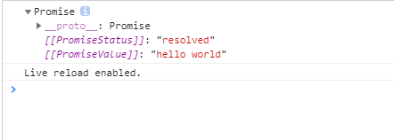

# JavaScript 异步编程之Async/Await

## 1. async/await 是如何出现的

在 ES6 之前，大多 js 数项目中会有类似这样的代码：

```javascript
ajax1(url, () => {
  ajax2(url, () => {
    ajax3(url, () => {
      // do something
    });
  });
});
```

这种函数嵌套，大量的回调函数，使代码阅读起来晦涩难懂，不直观，形象的称之为**回调地狱（callback hell）**，所以为了在写法上能更通俗一点，ES6+陆续出现了 `Promise`、`Generator`、`Async/await`，力求在写法上简洁明了，可读性强。


`async/await` 是参照 `Generator` 封装的一套异步处理方案，可以理解为 `Generator` 的语法糖，所以了解`async/await` 就不得不讲一讲 `Generator`，而 `Generator` 又依赖于迭代器`Iterator`，所以先来看一下 `Iterator`。

### （1）Iterator

`Iterator` 翻译过来就是**迭代器（遍历器）**让我们先来看看它的遍历过程(类似于单向链表)：

- 创建一个**指针对象**，指向当前数据结构的起始位置
- 第一次调用指针对象的 `next` 方法，将指针指向数据结构的第一个成员

- 第二次调用指针对象的 `next` 方法，将指针指向数据结构的第二个成员
- 不断的调用指针对象的 `next` 方法，直到它指向数据结构的结束位置

一个对象要变成可迭代的，必须实现 `@@iterator` 方法，即对象（或它原型链上的某个对象）必须有一个名字是 `Symbol.iterator` 的属性（原生具有该属性的有：字符串、数组、类数组的对象、Set 和 Map）：

| **属性**           | **值**                                           |
| ------------------ | ------------------------------------------------ |
| [Symbol.iterator]: | 返回一个对象的无参函数，被返回对象符合迭代器协议 |

当一个对象需要被迭代的时候（比如开始用于一个 `for..of` 循环中），它的 `@@iterator` 方法被调用并且无参数，然后返回一个用于在迭代中获得值的迭代器


**迭代器协议**：产生一个有限或无限序列的值，并且当所有的值都已经被迭代后，就会有一个默认的返回值


当一个对象只有满足下述条件才会被认为是一个迭代器：

它实现了一个 `next()` 的方法，该方法**必须返回一个对象**,对象有两个必要的属性：

- `done`（bool）

- true：迭代器已经超过了可迭代次数。这种情况下,value 的值可以被省略
- 如果迭代器可以产生序列中的下一个值，则为 false。这等效于没有指定 done 这个属性

- `value` 迭代器返回的任何 JavaScript 值。done 为 true 时可省略


根据上面的规则，我们来自定义一个简单的迭代器：

```javascript
const makeIterator = arr => {
  let nextIndex = 0;
  return {
    next: () =>
      nextIndex < arr.length
        ? { value: arr[nextIndex++], done: false }
        : { value: undefined, done: true },
  };
};
const it = makeIterator(['人月', '神话']);
console.log(it.next()); // { value: "人月", done: false }
console.log(it.next()); // { value: "神话", done: false }
console.log(it.next()); // {value: undefined, done: true }
```

我们还可以自定义一个可迭代对象：

```javascript
const myIterable = {};
myIterable[Symbol.iterator] = function*() {
  yield 1;
  yield 2;
  yield 3;
};
for (let value of myIterable) {
  console.log(value);
}
// 1
// 2
// 3
//or
console.log([...myIterable]); // [1, 2, 3]
```

### （2）Generator

`Generator`：生成器对象是生成器函数（GeneratorFunction）返回的，它符合**可迭代协议**和**迭代器协议**，既是迭代器也是可迭代对象，可以调用 `next` 方法，但它不是函数，更不是构造函数


生成器函数（GeneratorFunction）：

function* name([param[, param[, ... param]]]) { statements }

- name：函数名
- param：参数

- statements：js 语句

调用一个生成器函数并不会马上执行它里面的语句，而是返回一个这个生成器的迭代器对象，当这个迭代器的 `next()` 方法被首次（后续）调用时，其内的语句会执行到第一个（后续）出现 `yield` 的位置为止（让执行处于**暂停状**），`yield` 后紧跟迭代器要返回的值。或者如果用的是 `yield*`（多了个星号），则表示将执行权移交给另一个生成器函数（当前生成器**暂停执行**），调用 `next()` （再启动）方法时，如果传入了参数，那么这个参数会作为**上一条执行的** `**yield**` **语句的返回值**，例如：

```javascript
function* another() {
  yield '人月神话';
}
function* gen() {
  yield* another(); // 移交执行权
  const a = yield 'hello';
  const b = yield a; // a='world' 是 next('world') 传参赋值给了上一个 yidle 'hello' 的左值
  yield b; // b=！ 是 next('！') 传参赋值给了上一个 yidle a 的左值
}
const g = gen();
g.next(); // {value: "人月神话", done: false}
g.next(); // {value: "hello", done: false}
g.next('world'); // {value: "world", done: false} 将 'world' 赋给上一条 yield 'hello' 的左值，即执行 a='world'，
g.next('!'); // {value: "!", done: false} 将 '!' 赋给上一条 yield a 的左值，即执行 b='!'，返回 b
g.next(); // {value: undefined, done: false}
```

看到这里，你可能会问，`Generator` 和 `callback` 有啥关系，如何处理异步呢？其实二者没有任何关系，我们只是通过一些方式强行的它们产生了关系，才会有 `Generator` 处理异步。


我们来总结一下 `Generator` 的本质，暂停，它会让程序执行到指定位置先暂停（`yield`），然后再启动（`next`），再暂停（`yield`），再启动（`next`），而这个暂停就很容易让它和异步操作产生联系，因为我们在处理异步时：开始异步处理（网络求情、IO 操作），然后暂停一下，等处理完了，再该干嘛干嘛。不过值得注意的是，**js 是单线程的（又重复了三遍）**，异步还是异步，callback 还是 callback，不会因为 `Generator` 而有任何改变


下面来看看，用 `Generator` 实现异步：

```javascript
const promisify = require('util').promisify;
const path = require('path');
const fs = require('fs');
const readFile = promisify(fs.readFile);
const gen = function*() {
  const res1 = yield readFile(path.resolve(__dirname, '../data/a.json'), { encoding: 'utf8' });
  console.log(res1);
  const res2 = yield readFile(path.resolve(__dirname, '../data/b.json'), { encoding: 'utf8' });
  console.log(res2);
};
const g = gen();
const g1 = g.next();
console.log('g1:', g1);
g1.value
  .then(res1 => {
    console.log('res1:', res1);
    const g2 = g.next(res1);
    console.log('g2:', g2);
    g2.value
      .then(res2 => {
        console.log('res2:', res2);
        g.next(res2);
      })
      .catch(err2 => {
        console.log(err2);
      });
  })
  .catch(err1 => {
    console.log(err1);
  });
// g1: { value: Promise { <pending> }, done: false }
// res1: {
//   "a": 1
// }
// {
//   "a": 1
// }
// g2: { value: Promise { <pending> }, done: false }
// res2: {
//   "b": 2
// }
// {
//   "b": 2
// }
```

以上代码是 `Generator` 和 `callback` 结合实现的异步，可以看到，仍然需要手动执行 `.then` 层层添加回调，但由于 `next()` 方法返回对象 `{value: xxx,done: true/false}` 所以我们可以简化它，写一个自动执行器：

```javascript
const promisify = require('util').promisify;
const path = require('path');
const fs = require('fs');
const readFile = promisify(fs.readFile);
function run(gen) {
  const g = gen();
  function next(data) {
    const res = g.next(data);
    // 深度递归，只要 `Generator` 函数还没执行到最后一步，`next` 函数就调用自身
    if (res.done) return res.value;
    res.value.then(function(data) {
      next(data);
    });
  }
  next();
}
run(function*() {
  const res1 = yield readFile(path.resolve(__dirname, '../data/a.json'), { encoding: 'utf8' });
  console.log(res1);
  // {
  //   "a": 1
  // }
  const res2 = yield readFile(path.resolve(__dirname, '../data/b.json'), { encoding: 'utf8' });
  console.log(res2);
  // {
  //   "b": 2
  // }
});
```

### （3）Async/Await

首先，`async/await` 是 `Generator` 的语法糖，先来看一下二者的对比：

```javascript
// Generator
run(function*() {
  const res1 = yield readFile(path.resolve(__dirname, '../data/a.json'), { encoding: 'utf8' });
  console.log(res1);
  const res2 = yield readFile(path.resolve(__dirname, '../data/b.json'), { encoding: 'utf8' });
  console.log(res2);
});
// async/await
const readFile = async ()=>{
  const res1 = await readFile(path.resolve(__dirname, '../data/a.json'), { encoding: 'utf8' });
  console.log(res1);
  const res2 = await readFile(path.resolve(__dirname, '../data/b.json'), { encoding: 'utf8' });
  console.log(res2);
  return 'done'；
}
const res = readFile();
```

可以看到，`async function` 代替了 `function*`，`await` 代替了 `yield`，同时也无需自己手写一个自动执行器 `run` 了

现在再来看看`async/await` 的特点：

- 当 `await` 后面跟的是 Promise 对象时，才会异步执行，其它类型的数据会同步执行
- 执行 `const res = readFile();` 返回的仍然是个 Promise 对象，上面代码中的 `return 'done';` 会直接被下面 `then` 函数接收到

```javascript
res.then(data => {
  console.log(data); // done
});
```

## 2.  async/await 是什么？

async/await其实是`Generator` 的语法糖，它能实现的效果都能用then链来实现，它是为优化then链而开发出来的。从字面上来看，async是“异步”的简写，await则为等待，所以我们很好理解async 用于申明一个 function 是异步的，而 await 用于等待一个异步方法执行完成。当然语法上强制规定await只能出现在asnyc函数中，我们先来看看async函数返回了什么： 

```javascript
async function testAsy(){
   return 'hello world';
}
let result = testAsy(); 
console.log(result)
```



所以，async 函数返回的是一个 Promise 对象。async 函数（包含函数语句、函数表达式、Lambda表达式）会返回一个 Promise 对象，如果在函数中 `return` 一个直接量，async 会把这个直接量通过 `Promise.resolve()` 封装成 Promise 对象。


async 函数返回的是一个 Promise 对象，所以在最外层不能用 await 获取其返回值的情况下，我们当然应该用原来的方式：`then()` 链来处理这个 Promise 对象，就像这样：

```javascript
async function testAsy(){
   return 'hello world'
}
let result = testAsy() 
console.log(result)
result.then(v=>{
    console.log(v)   // hello world
})
```

现在回过头来想下，如果 async 函数没有返回值，又该如何？很容易想到，它会返回 `Promise.resolve(undefined)`。

联想一下 Promise 的特点——无等待，所以在没有 `await` 的情况下执行 async 函数，它会立即执行，返回一个 Promise 对象，并且，绝不会阻塞后面的语句。这和普通返回 Promise 对象的函数并无二致。


**注意：**

`Promise.resolve(x)` 可以看作是 `new Promise(resolve => resolve(x))` 的简写，可以用于快速封装字面量对象或其他对象，将其封装成 Promise 实例。

## 2. await 到底在等啥？

**重点就在await，它等待什么呢？**


一般来说，都认为 await 是在等待一个 async 函数完成。不过按语法说明，await 等待的是一个表达式，这个表达式的计算结果是 Promise 对象或者其它值（换句话说，就是没有特殊限定）。


因为 async 函数返回一个 Promise 对象，所以 await 可以用于等待一个 async 函数的返回值——这也可以说是 await 在等 async 函数，但要清楚，它等的实际是一个返回值。注意到 await 不仅仅用于等 Promise 对象，它可以等任意表达式的结果，所以，await 后面实际是可以接普通函数调用或者直接量的。所以下面这个示例完全可以正确运行：

```javascript
function getSomething() {
    return "something";
}
async function testAsync() {
    return Promise.resolve("hello async");
}
async function test() {
    const v1 = await getSomething();
    const v2 = await testAsync();
    console.log(v1, v2);
}
test();
```

await 表达式的运算结果取决于它等的是什么。

- 如果它等到的不是一个 Promise 对象，那 await 表达式的运算结果就是它等到的东西。
- 如果它等到的是一个 Promise 对象，await 就忙起来了，它会阻塞后面的代码，等着 Promise 对象 resolve，然后得到 resolve 的值，作为 await 表达式的运算结果。


我们来看一个例子：

```javascript
function testAsy(x){
   return new Promise(resolve=>{setTimeout(() => {
       resolve(x);
     }, 3000)
    }
   )
}
async function testAwt(){    
  let result =  await testAsy('hello world');
  console.log(result);    // 3秒钟之后出现hello world
  console.log('cuger')   // 3秒钟之后出现cug
}
testAwt();
console.log('cug')  //立即输出cug
```

这就是 await 必须用在 async 函数中的原因。async 函数调用不会造成阻塞，它内部所有的阻塞都被封装在一个 Promise 对象中异步执行。await暂停当前async的执行，所以'cug''最先输出，hello world'和‘cuger’是3秒钟后同时出现的。

## 4.  async/await的优势

单一的 Promise 链并不能发现 async/await 的优势，但是，如果需要处理由多个 Promise 组成的 then 链的时候，优势就能体现出来了（很有意思，Promise 通过 then 链来解决多层回调的问题，现在又用 async/await 来进一步优化它）。


假设一个业务，分多个步骤完成，每个步骤都是异步的，而且依赖于上一个步骤的结果。我们仍然用 `setTimeout` 来模拟异步操作：

```javascript
/**
 * 传入参数 n，表示这个函数执行的时间（毫秒）
 * 执行的结果是 n + 200，这个值将用于下一步骤
 */
function takeLongTime(n) {
    return new Promise(resolve => {
        setTimeout(() => resolve(n + 200), n);
    });
}
function step1(n) {
    console.log(`step1 with ${n}`);
    return takeLongTime(n);
}
function step2(n) {
    console.log(`step2 with ${n}`);
    return takeLongTime(n);
}
function step3(n) {
    console.log(`step3 with ${n}`);
    return takeLongTime(n);
}
```

现在用 Promise 方式来实现这三个步骤的处理

```javascript
function doIt() {
    console.time("doIt");
    const time1 = 300;
    step1(time1)
        .then(time2 => step2(time2))
        .then(time3 => step3(time3))
        .then(result => {
            console.log(`result is ${result}`);
            console.timeEnd("doIt");
        });
}
doIt();
// c:\var\test>node --harmony_async_await .
// step1 with 300
// step2 with 500
// step3 with 700
// result is 900
// doIt: 1507.251ms
```

输出结果 `result` 是 `step3()` 的参数 `700 + 200` = `900`。`doIt()` 顺序执行了三个步骤，一共用了 `300 + 500 + 700 = 1500` 毫秒，和 `console.time()/console.timeEnd()` 计算的结果一致。


如果用 async/await 来实现呢，会是这样：

```javascript
async function doIt() {
    console.time("doIt");
    const time1 = 300;
    const time2 = await step1(time1);
    const time3 = await step2(time2);
    const result = await step3(time3);
    console.log(`result is ${result}`);
    console.timeEnd("doIt");
}
doIt();
```

结果和之前的 Promise 实现是一样的，但是这个代码看起来是不是清晰得多，几乎跟同步代码一样

## 5. 面试题

### （1）对async/await的理解 

async 函数，就是 Generator 函数的语法糖，它建⽴在Promises上，并且与所有现有的基于Promise的API兼容。 

-  Async—声明⼀个异步函数(async function someName(){...}) 
- ⾃动将常规函数转换成Promise，返回值也是⼀个Promise对象 

- 只有async函数内部的异步操作执⾏完，才会执⾏then⽅法指定的回调函数 
- 异步函数内部可以使⽤await 

**await：**

- Await用来暂停异步的功能执⾏(var result = await someAsyncCall();) 
- 放置在Promise调⽤之前，await强制其他代码等待，直到Promise完成并返回结果 

- 只能与Promise⼀起使⽤，不适⽤与回调 
- 只能在async函数内部使⽤ 

### （2）async/await对比Promise的优势

- 代码读起来更加同步，Promise虽然摆脱了回调地狱，但是then的链式调⽤也会带来额外的阅读负担 
- Promise传递中间值⾮常麻烦，⽽async/await⼏乎是同步的写法，⾮常优雅 

- 错误处理友好，async/await可以⽤成熟的try/catch，Promise的错误捕获⾮常冗余 
- 调试友好，Promise的调试很差，由于没有代码块，你不能在⼀个返回表达式的箭头函数中设置断点，如果你在⼀个.then代码块中使⽤调试器的步进(step-over)功能，调试器并不会进⼊后续的.then代码块，因为调试器只能跟踪同步代码的每⼀步。 

### （3）async/await 如何捕获异常

```javascript
async function fn(){
    try{
        let a = await Promise.reject('error')
    }catch(error){
        console.log(error)
    }
}
```