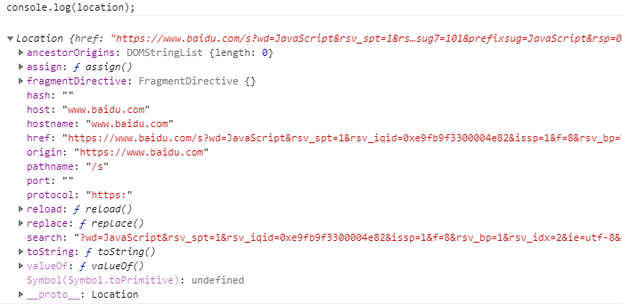

# 深入理解BOM操作

JavaScript 由三部分构成：`ECMAScript`，`DOM`和`BOM`。


- **ECMAScript** ：描述了JavaScript的语法和基本对象
- **DOM**（document object model）：文档对象模型，提供操作页面元素的方法和属性

- **BOM**（browser object model）：浏览器对象模型，提供一些属性和方法可以操作浏览器


## 1. window 对象

### 1.1 全局变量

BOM的核心对象就是`window`对象，它表示浏览器的一个实例。在浏览器中`window`对象既是通过`JavaScript`访问浏览器的窗口的一个接口，又是`ECMAScript`规定的Global对象。


因为`window`对象是是`ECMAScript`中的`Global`对象，所以在全局作用域中定义的函数、变量都会变成`window`对象的属性和方法。


但是直接定义在`window`上的属性和在全局变量中的定义的属性是有一点区别的：在全局变量中定义的属性不能使用`delete`来删除，而在`window`上定义的属性可以使用`delete`来删除。

### 1.2 窗口位置

用以下属性表示窗口相对于屏幕左边和上边的距离：（不同浏览器支持情况不同）

- `screenLeft`和`screenTop`：**IE**，**Safari**，**Opera**，**Chrome**
- `screenX`和`screenY` ：**Firefox**，**Safari**，**Chrome**

```javascript
var left = (typeof window.screenLeft == "number")?window.screenLeft:window.screenX;
var top = (typeof window.screenTop == "number")?window.screenTop:window.screenY;
```

需要注意的是，在IE和Opera中， `screenLeft`和`screenTop`中保存的是从屏幕左边和上面带window对象的页面的可见区域的距离，即到浏览器工具栏的高度。但是，在Firefox，Safari，Chrome中，`screenX`和`screenY`中保存的是整个浏览器窗口相对于屏幕的坐标值。

### 1.3 窗口大小

**1. 窗口大小**

浏览器提供了四个属性来表示浏览器窗口的大小：`innerWidth`，`innerHeight`，`outerWidth`，`outerHeight`。但是在不同的浏览器中，这四个属性所代表的内容不一样。


- 在IE9+，Safari，Firefox中`outerWidth`和`outerHeight`表示浏览器窗口本身的大小；`innerWidth`和`innerHeight`表示视口大小。
- 在Chrome中，这四个属性都表示视口大小，返回值相同。

**2. 视口大小**

在浏览器中，`document.documentElement.clientWidth`和`document.documentElement.clientHeight`保存了页面视口的信息。


需要注意的是，在IE6中这两个属性只有在**标准模式**下才会生效，如果是**混杂模式**，就需要使用`document.body.clientWidth`和`document.body.clientHeight`获取视口相关信息。而对于Chrome浏览器来说，在混杂模式下，以上四个属性均能获取视口相关信息。

**3. 移动设备**

在移动设备中，`window.innerWidth`和`window.innerHeight`保存着可见视口，即屏幕上可见页面大小（不包含工具栏等）。

**4. 调整窗口大小**

我们可以使用`resizeTo()`和`resizeBy()`来调整浏览器窗口的大小，这两个属性都接收两个参数：


- `resizeTo()` ：接收浏览器窗口的新宽度和高度
- `resizeBy()`： 接口浏览器新窗口和原窗口的宽度和高度之差

### 1.4 导航和打开窗口

使用`window.open`可以导航到一个指定的URL，也可以打开一个新的浏览器窗口，该方法接收四个参数`window.open(URL,name,specs,replace)`：


- `URL`：可选，指定页面的URL，如果没有URL，就打开一个新的空白窗口
- `name` ： 可选，指定target属性或窗口的名称，默认是 `_blank-URL`：加载到一个新的窗口，如果需要设置窗口名称，就用 `name-窗口名称`

- `specs` ：可选，项目列表，之间用逗号分隔，表示窗口显示的属性
- `replace` ：可选，表示新页面是否取代浏览器历史记录中当前的条目，`true-URL`表示替换当前条目，`false-URL`表示在历史记录中创建新的条目。这个属性只在不打开新窗口的情况下使用。

### 1.5 间歇调用和超时调用

JavaScript是一种单线程语言，但是允许通过**超时值**（指定时间之后执行代码）和**间歇时间** （每隔一段时间执行一次代码）来使代码在特定时间执行。


**1. 超时调用**

超时调用需要使用window对象的`setTimeout()`方法，它需要接收两个参数：要执行的代码和以毫秒为单位的时间值，即超时调用时间。调用该方法之后会返回一个数值ID，表示超时调用，可以通过它来取消超时调用。


在超时时间还没到之前，调用`clearTimeout()`方法，就可以取消超时调用。在超时调用之后在执行该方法是无效的，调用形式：`clearTimeout(timeoutId)`。


注意，该方法的第一个参数可以是字符串或函数，不过不推荐使用字符串形式，建议使用函数形式。


**2. 间歇调用**（不建议使用）

间歇调用使用window对象的`serInterval()`方法，参数和超时调用一样，只不过第二个参数是指间歇调用时间。


该方法同样会返回一个数值ID，可以通过`clearInterval()`来取消间歇调用，调用方法：`clearInterval(intervalId)`。

### 1.6 系统对话框


浏览器通过`alert()`，`confirm()`，`prompt()`方法来调用系统对话框。这几个对话框都是同步和模态的，也就是说显示这些对话框的时候，代码会停止执行，关掉对话框时，代码会继续执行。

## 2. location 对象

location对象是最有用的BOM对象之一，它提供了当前窗口中加载的文档的相关信息。还提供了一些导航功能。location对象既属于window对象的属性，又属于document对象的属性，也就是说`window.location`和`document.location`引用的是同一对象。

### 2.1 location对象属性

location对象有以下属性：

| 属性名   | 说明                          |
| -------- | ----------------------------- |
| hash     | 返回一个URL的锚部分           |
| host     | 返回一个URL的主机名和端口     |
| hostname | 返回URL的主机名               |
| href     | 返回完整的URL                 |
| href     | 返回完整的URL                 |
| port     | 返回一个URL服务器使用的端口号 |
| protocol | 返回一个URL协议               |
| search   | 返回一个URL的查询部分         |





### 2.2 location对象方法

| 方法                      | 说明                                                         |
| ------------------------- | ------------------------------------------------------------ |
| location.assign(url)      | 加载 URL 指定的新的 HTML 文档。就相当于一个链接，跳转到指定的url，当前页面会转为新页面内容，可以点击后退返回上一个页面。 |
| location.replace(url)     | 通过加载 URL 指定的文档来替换当前文档，这个方法是替换当前窗口页面，前后两个页面共用一个窗口，所以是没有后退返回上一页的 |
| location.reload(forceGet) | forceGet类型为Boolean，可选。如果把该方法的参数设置为 true，那么无论文档的最后修改日期是什么，它都会绕过缓存，从服务器上重新下载该文档。 |


以下两种方法调用的结果与第一种方法效果相同：

```javascript
window.location= URL;
location.href = URL;
```


### 2.3 获取字符串参数

我们可以使用以下函数来解析查询字符串，返回一个包含参数的对象:

```javascript
function getQueryStringArgs() {
     // 取得要查询的字符串并去掉开头的问号
     var qs = (location.search.length > 0 ? location.search.substring(1) : ""),
        //保存数据的对象
        args = {},
        items = qs.length ? qs.split("&"): [],
        item = null,
        name = null,
        value = null,
        //  在for 循环中使用
        i = 0,
        len = items.length;

        // 逐个将每一项目添加到args对象中
        for (i; i < len; i++) {
            item = items[i].split("=");
            name = decodeURIComponent(item[0]);
           value = decodeURIComponent(items[1]);
            if (name.length) {
                args[name] = value
            }
        }
        console.log(args);
        return args;
    }
```

## 3. navigator 对象

navigator对象包含有关浏览器的信息，所有浏览器都支持该对象。


常用的浏览器对象属性或方法：

| **属性或方法** | **说明**                                    |
| -------------- | ------------------------------------------- |
| appCodeName    | 返回浏览器的代码名                          |
| appName        | 返回浏览器的名称                            |
| appVersion     | 返回浏览器的平台和版本信息                  |
| cookieEnabled  | 返回指明浏览器中是否启用 cookie 的布尔值    |
| platform       | 返回运行浏览器的操作系统平台                |
| userAgent      | 返回由客户机发送服务器的user-agent 头部的值 |
| javaEnabled()  | 指定是否在浏览器中启用Java                  |
| taintEnabled() | 规定浏览器是否启用数据污点(data tainting)   |


## 4. screen 对象


screen对象在JavaScript编程中用处不大，它基本上只用来标明客户端的能力，包含了显示器的信息。


screen对象主要的属性有：

| **属性**    | **说明**                                 |
| ----------- | ---------------------------------------- |
| availHeight | 返回屏幕的高度（不包括Windows任务栏）    |
| availWidth  | 返回屏幕的宽度（不包括Windows任务栏）    |
| colorDepth  | 返回目标设备或缓冲器上的调色板的比特深度 |
| height      | 返回屏幕的总高度                         |
| pixelDepth  | 返回屏幕的颜色分辨率（每象素的位数）     |
| width       | 返回屏幕的总宽度                         |


## 5. history 对象

history对象保存着用户上网的历史记录，出于安全考虑，开发人员不知道用户浏览过的URL，但是可以借助浏览过的页面列表，在不知道URL的情况下实现前进和后退。


使用`go()`方法可以在用户的历史记录中任意跳转，该方法接受一个参数，表示向后或者向前跳转的页面数的整数值，负数表示向后跳转，正数表示向前跳转。


我们还可以给go()方法传递一个字符串参数，此时浏览器会跳转到历史记录中包含该字符串的最近的位置，如果历史记录中不包含该字符串，那么就不做任何操作。


示例：

```javascript
history.go(-2); //后退两页
history.go(1);  //前进一页
history.go("baidu.com") //跳转到最近的baidu.com页面
```

除此之外，我们还可以通过`back()`和`forward()`方法开代替`go()`方法。


```javascript
history.go(-1)` 等同于  `history.back()
history.go(1)`  等同于  `history.forward()
```


另外，history对象还有一个length属性，保存着历史记录的数量，这个数量包括所有的历史记录，即所有的向前和向后的记录。对于加载到窗口、标签页或框架中的第一个页面而言，`history.length`等于0，我们可以通过以下代码测试该属性的值，可以确定用户是否一开始就打开了你的页面。


```javascript
if(history.length == 0){
   //这应该是用户打开窗口后的第一个页面
}
```