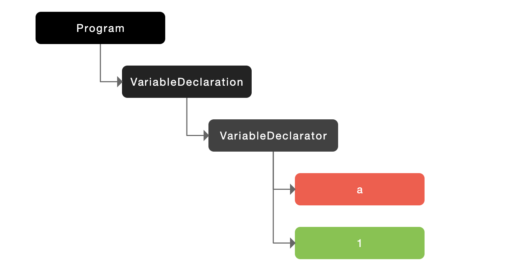
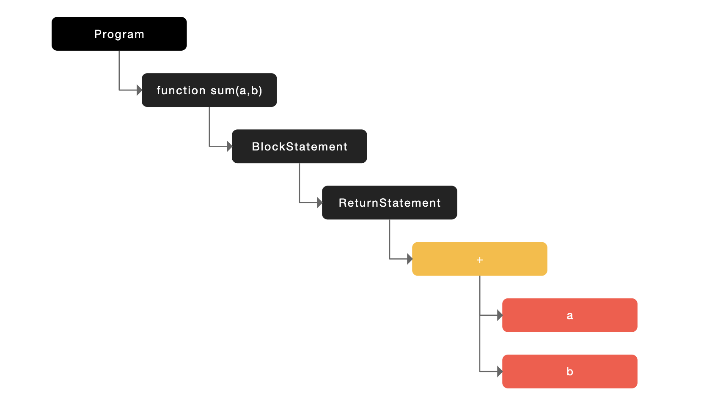
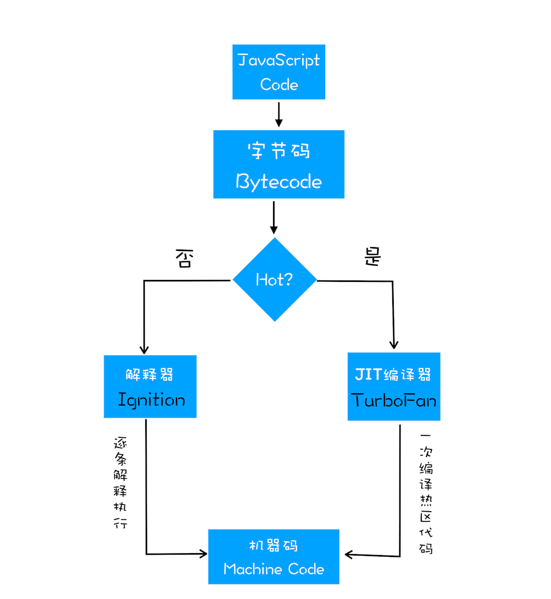

# JavaScript 编译原理

## 1. 编译器和解释器

我们知道，机器不能直接理解我们所写的代码，所以在执行程序之前，需要将代码“翻译”成机器能读懂的机器语言。按语言的执行流程，可以把语言划分为编译型语言和解释型语言：

- **编译型语言**的特点是在代码运行前编译器直接将对应的代码转换成机器码，运行时不需要再重新翻译，直接可以使用编译后的结果。
- **解释型语言**也是需要将代码转换成机器码，但是和编译型的区别在于运行时需要转换。比较显著的特点是，解释型语言的执行速度要慢于编译型语言，因为解释型语言每次执行都需要把源码转换一次才能执行。


Java 和 C++ 都是编译型语言，而 JavaScript 是解释性语言，它整体的执行速度会略慢于编译型的语言。为了提高运行效率，很多浏览器厂商在也在不断努力。目前市面上有很多种 JS 引擎，其中比较现代的 JS 引擎就是 V8，它引入了 Java 虚拟机和 C++ 编译器的众多技术，和早期的 JS 引擎工作方式已经有了很大的不同。V8 是众多浏览器的 JS 引擎中性能表现最好的一个，并且它是 Chrome 的内核，Node.js 也是基于 V8 引擎研发的。


编译器和解释器“翻译”代码的具体流程如下：


从图中可以看出这二者的执行流程，大致可阐述为如下：

- 在编译型语言的编译过程中，编译器首先会依次对源代码进行词法分析、语法分析，生成抽象语法树（AST），然后是优化代码，最后再生成处理器能够理解的机器码。如果编译成功，将会生成一个可执行的文件。但如果编译过程发生了语法或者其他的错误，那么编译器就会抛出异常，最后的二进制文件也不会生成成功。
- 在解释型语言的解释过程中，同样解释器也会对源代码进行词法分析、语法分析，并生成抽象语法树（AST），不过它会再基于抽象语法树生成字节码，最后再根据字节码来执行程序、输出结果。


说完编译器和解释器，下面就来看看V8是如何执行一段JavaScript的。

## 2. V8执行JavaScript代码过程

V8 执行 JavaScript 代码的流程如下图：


可以看到，V8 在执行过程中既有**解释器 Ignition**，又有**编译器 TurboFan。**V8 执行过程大致如下：

- Parse 阶段：V8 引擎负责将 JS 代码转换成 AST（抽象语法树）；
- Ignition 阶段：解释器将 AST 转换为字节码，解析执行字节码也会为下一个阶段优化编译提供需要的信息；

- TurboFan 阶段：编译器利用上个阶段收集的信息，将字节码优化为可以执行的机器码；
- Orinoco 阶段：垃圾回收阶段，将程序中不再使用的内存空间进行回收。


下面就来看看前三个过程：

### （1）生成抽象语法树（AST）

这个过程就是将源代码转换为**抽象语法树**，并生成**执行上下文**，而执行上下文就是代码在执行过程中的环境信息。


这些场景的实现，都离不开通过将 JS 代码解析成 AST 来实现。生成 AST 分为两个阶段，一是词法分析，二是语法分析：

- **词法分析**：这个阶段会将源代码拆成最小的、不可再分的词法单元，称为 token。比如代码 var a =1；通常会被分解成 var 、a、=、2、; 这五个词法单元。另外代码中的空格在 JavaScript 中是直接忽略的。
- **语法分析**：这个过程是将上一步生成的 token 数据，根据语法规则转为 AST。如果源码符合语法规则，这一步就会顺利完成。如果源码存在语法错误，这一步就会终止，并抛出一个“语法错误”。


下面来看一下代码解析成抽象语法树之后的样子：

```javascript
// 第一段代码
var a = 1;
// 第二段代码
function sum (a,b) {
  return a + b;
}
```

将这两段代码，分别转换成 AST 抽象语法树之后返回的 JSON 格式如下。


**1**. 第一段代码，编译后的结果：

```javascript
{
  "type": "Program",
  "start": 0,
  "end": 10,
  "body": [
    {
      "type": "VariableDeclaration",
      "start": 0,
      "end": 10,
      "declarations": [
        {
          "type": "VariableDeclarator",
          "start": 4,
          "end": 9,
          "id": {
            "type": "Identifier",
            "start": 4,
            "end": 5,
            "name": "a"
          },
          "init": {
            "type": "Literal",
            "start": 8,
            "end": 9,
            "value": 1,
            "raw": "1"
          }
        }
      ],
      "kind": "var"
    }
  ],
  "sourceType": "module"
}
```

它的样子大致如下：



**2**. 第二段代码，编译出来的结果：

```javascript
{
  "type": "Program",
  "start": 0,
  "end": 38,
  "body": [
    {
      "type": "FunctionDeclaration",
      "start": 0,
      "end": 38,
      "id": {
        "type": "Identifier",
        "start": 9,
        "end": 12,
        "name": "sum"
      },
      "expression": false,
      "generator": false,
      "async": false,
      "params": [
        {
          "type": "Identifier",
          "start": 14,
          "end": 15,
          "name": "a"
        },
        {
          "type": "Identifier",
          "start": 16,
          "end": 17,
          "name": "b"
        }
      ],
      "body": {
        "type": "BlockStatement",
        "start": 19,
        "end": 38,
        "body": [
          {
            "type": "ReturnStatement",
            "start": 23,
            "end": 36,
            "argument": {
              "type": "BinaryExpression",
              "start": 30,
              "end": 35,
              "left": {
                "type": "Identifier",
                "start": 30,
                "end": 31,
                "name": "a"
              },
              "operator": "+",
              "right": {
                "type": "Identifier",
                "start": 34,
                "end": 35,
                "name": "b"
              }
            }
          }
        ]
      }
    }
  ],
  "sourceType": "module"
}
```

它的样子大致如下：



可以看到，AST 只是源代码语法结构的一种抽象的表示形式，计算机也不会去直接去识别 JS 代码，转换成抽象语法树也只是识别这一过程中的第一步。AST 的结构和代码的结构非常相似，其实也可以把 AST 看成代码的结构化的表示，编译器或者解释器后续的工作都需要依赖于 AST，而不是源代码。


AST 在很多项目中有着广泛的应用。其中最著名的一个项目是 Babel。Babel 是一个被广泛使用的代码转码器，可以将 ES6 代码转为 ES5 代码，这意味着可以用 ES6 编写程序，而不用担心现有环境是否支持 ES6。Babel 的工作原理就是先将 ES6 源码转换为 AST，然后再将 ES6 语法的 AST 转换为 ES5 语法的 AST，最后利用 ES5 的 AST 生成 JavaScript 源代码。


除了 Babel 外，还有 ESLint 也使用 AST。ESLint 是一个用来检查 JavaScript 编写规范的插件，其检测流程也是需要将源码转换为 AST，然后再利用 AST 来检查代码规范化的问题。


AST 在实际工作中应用场景也还有很多，下面是抽象语法树的应用场景：

- JS 反编译，语法解析；
- Babel 编译 ES6 语法；

- 代码高亮；
- 关键字匹配；

- 代码压缩。

### （2）生成字节码

有了 AST 和执行上下文后，解释器 Ignition 就登场了，它会根据 AST 生成字节码，并解释执行字节码。


在之前的 V8 版本不会经过这个过程，最早只是通过 AST 直接转换成机器码，由于执行机器码的效率是非常高效的，所以这种方式在发布后的一段时间内运行效果是非常好的。如果将 AST 直接转换为机器码还是会有一些问题存在的，例如：

- 直接转换会带来内存占用过大的问题，因为将抽象语法树全部生成了机器码，而机器码相比字节码占用的内存多了很多；
- 某些 JavaScript 使用场景使用解释器更为合适，解析成字节码，有些代码没必要生成机器码，进而尽可能减少了占用内存过大的问题。


为了解决内存占用问题，V8 团队大幅重构了引擎架构，引入字节码，并且抛弃了之前的编译器，实现了现在的这套架构。那什么是字节码呢？为什么引入字节码就能解决内存占用问题呢？


**字节码就是介于 AST 和机器码之间的一种代码。**需要将其转换成机器码后才能执行，字节码可以理解为是机器码的一种抽象。Ignition 解释器除了可以快速生成没有优化的字节码外，还可以执行部分字节码。

### （3）生成机器码

生成字节码之后，接下来就要进入执行阶段了，实际上，这一步就是将字节码生成机器码。


在 Ignition 解释器处理完之后，如果发现一段代码被重复执行多次的情况，生成的字节码以及分析数据会传给 TurboFan 编译器，它会根据分析数据的情况生成优化好的机器码。再执行这段代码之后，只需要直接执行编译后的机器码，这样性能就会更好。


对于 TurboFan 编译器，它是 JIT（即时编译） 优化的编译器，因为 V8 引擎是多线程的，TurboFan 的编译线程和生成字节码不会在同一个线程上，这样可以和 Ignition 解释器相互配合着使用，不受另一方的影响。下面是JIT技术的工作机制：



其实字节码配合解释器和编译器是最近一段时间很火的技术，这种技术就是 **即时编译（JIT）**。具体到 V8，就是指解释器 Ignition 在解释执行字节码的同时，收集代码信息，当它发现某一部分代码变热了之后，TurboFan 编译器便闪亮登场，把热点的字节码转换为机器码，并把转换后的机器码保存起来，以备下次使用。