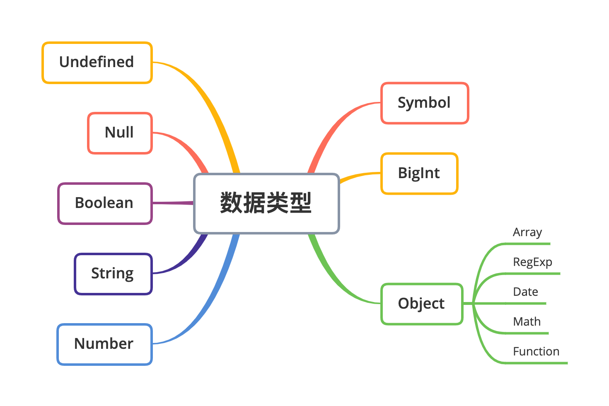

# 深入理解数据类型

JavaScript 语言规定了八种语言类型。语言类型广泛用于变量、函数参数、表达式、函数返回值等场合。根据最新的语言标准，这八种语言类型是：

- Undefined；
- Null；

- Boolean；
- String；

- Number；
- Symbol；

- BigInt；
- Object。



##  1. Undefined

Undefined 类型表示未定义，它的类型只有一个值，就是 undefined。可以通过以下方式来得到 undefined：

- 引用已声明但未初始化的变量；
- 引用未定义的对象属性；

- 执行无返回值函数；
- 执行 void 表达式；

- 全局常量 window.undefined 或 undefined。


对应代码如下：

```javascript
var a; // undefined
var o = {}
o.b // undefined
(() => {})() // undefined
void 0 // undefined
window.undefined // undefined
```

其中比较推荐通过 void 表达式来得到 undefined 值，因为这种方式既简便（window.undefined 或 undefined 常量的字符长度都大于 "void 0" 表达式）又不需要引用额外的变量和属性；同时它作为表达式还可以配合三目运算符使用，代表不执行任何操作。


如下面的代码就表示满足条件 x 大于 0 且小于 5 的时候执行函数 fn，否则不进行任何操作：

```javascript
x > 0 && x < 5 ? fn() : void 0;
```

因为 JavaScript 的代码 undefined 是一个变量，而并非是一个关键字，这是 JavaScript 语言公认的设计失误之一，所以，为了避免无意中被篡改，建议使用 void 0 来获取 undefined 值。


那如何判断一个变量的值是否为 undefined 呢？我们可以通过 typeof 关键字获取变量 x 的类型，然后与 'undefined' 字符串做**真值比较：**

```javascript
if(typeof x === 'undefined') {
  ...
}
```

## 2. Null

Null 数据类型和 Undefined 类似，只有唯一的一个值 null，都可以表示空值，甚至通过 “==” 来比较它们是否相等的时候得到的结果都是 true，但 null 是 JavaScript 保留关键字，而 undefined 只是一个常量。


也就是说可以声明名称为 undefined 的变量（虽然只能在老版本的 IE 浏览器中给它重新赋值），但将 null 作为变量使用时则会报错。

## 3. Boolean

Boolean 数据类型只有两个值：true 和 false，分别代表真和假，理解和使用起来并不复杂。但是我们常常会将各种表达式和变量转换成 Boolean 数据类型来当作判断条件，这时候就要注意了。


下面是将星期数转换成中文的函数，比如输入数字 1，函数就会返回“星期一”，输入数字 2 会返回“星期二”，以此类推，如果未输入数字则返回 undefined：

```javascript
function getWeek(week) {
  const dict = ['日', '一', '二', '三', '四', '五', '六'];
  if(week) return `星期${dict[week]}`;
}
```

这里在 if 语句中就进行了类型转换，将 week 变量转换成 Boolean 数据类型，而 0、空字符串、null、undefined 在转换时都会返回 false。所以这段代码在输入 0 的时候不会返回“星期日”，而返回 undefined。在做强制类型转换的时候一定要考虑这个问题。

## 4. String

String 用于表示文本数据，String 有最大长度是 253 - 1，**这个所谓的最大长度并不是指字符数，而是字符串的 UTF16 编码。**字符串的操作 charAt、charCodeAt、length 等方法针对的都是 UTF16 编码。所以，字符串的最大长度，实际上是受字符串的编码长度影响的。


JavaScript 中的字符串是**永远无法变更**的，一旦字符串构造出来，无法用任何方式改变字符串的内容，所以字符串具有值类型的特征。JavaScript 字符串把每个 UTF16 单元当作一个字符来处理，所以处理非 BMP（超出 U+0000 - U+FFFF 范围）的字符时，应该格外小心。这样设计是为了“**性能和尽可能实现起来简单**”。现实中也很少用到 BMP 之外的字符。

## 5. Number

Number 类型表示通常意义上的“数字”。这个数字大致对应数学中的有理数，当然，在计算机中，数字有一定的精度限制。


JavaScript 中的 Number 类型有 18437736874454810627(即 264-253+3) 个值。JavaScript 中的 Number 类型基本符合 IEEE 754-2008 规定的双精度浮点数规则，但是 JavaScript 为了表达几个额外的语言场景（比如为了不让除以 0 出错，而引入了无穷大的概念），规定了几个例外情况：

- **NaN**，占用了 9007199254740990，这原本是符合 IEEE 规则的数字，通常在计算失败的时候会得到该值。要判断一个变量是否为 NaN，则可以通过 Number.isNaN 函数进行判断。
- **Infinity**，无穷大，在某些场景下比较有用，比如通过数值来表示权重或者优先级，Infinity 可以表示最高优先级或最大权重。

- **-Infinity**，负无穷大。


JavaScript 中有 `+0` 和 `-0` 的概念，在加法类运算中它们没有区别，但是除法的场合则需要特别留意区分，“忘记检测除以 -0，而得到负无穷大”的情况经常会导致错误，而区分 +0 和 -0 的方式，就是检测 1/x 是 Infinity 还是 -Infinity。


根据双精度浮点数的定义，Number 类型中有效的整数范围是 `-0x1fffffffffffff` 至 `0x1fffffffffffff`，所以 Number 无法精确表示此范围外的整数。同样根据浮点数的定义，非整数的 Number 类型无法用 `==` 或者 `===` 来比较，这也就是在 JavaScript 中为什么 `0.1+0.2 !== 0.3`。实际上，这里错误的不是结果，而是比较的方法，正确的比较方法是使用 JavaScript 提供的最小精度值，检查等式左右两边差的绝对值是否小于最小精度，才是正确的比较浮点数的方法：

```javascript
console.log( Math.abs(0.1 + 0.2 - 0.3) <= Number.EPSILON);  // true
```

## 6. Symbol

Symbol 是 ES6 中引入的新数据类型，它表示一个唯一的常量，通过 Symbol 函数来创建对应的数据类型，创建时可以添加变量描述，该变量描述在传入时会被强行转换成字符串进行存储：

```javascript
var a = Symbol('1')
var b = Symbol(1)
a.description === b.description // true
var c = Symbol({id: 1})
c.description // [object Object]
var _a = Symbol('1')
_a == a // false
```

基于上面的特性，Symbol 属性类型比较适合用于两类场景中：**常量值和对象属性**。

### 1）避免常量值重复

假设有一个 getValue 函数，根据传入的字符串参数 key 执行对应代码逻辑：

```javascript
function getValue(key) {
  switch(key){
    case 'A':
      ...
    ...
    case 'B':
      ...
  }
}
getValue('B');
```

这段代码对调用者而言非常不友好，因为代码中使用了魔术字符串（魔术字符串是指在代码之中多次出现、与代码形成强耦合的某一个具体的字符串或者数值），导致调用 getValue 函数时需要查看函数源码才能找到参数 key 的可选值。所以可以将参数 key 的值以常量的方式声明出来：

```javascript
const KEY = {
  alibaba: 'A',
  baidu: 'B',
  ...
}
function getValue(key) {
  switch(key){
    case KEY.alibaba:
      ...
    ...
    case KEY.baidu:
      ...
  }
}
getValue(KEY.baidu);
```

但这样也并非完美，假设现在要在 KEY 常量中加入一个 key，根据对应的规则，很有可能会出现值重复的情况：

```javascript
const KEY = {
  alibaba: 'A',
  baidu: 'B',
  ...
  bytedance: 'B'
}
```

这显然会出现问题：

```javascript
getValue(KEY.baidu) // 等同于 getValue(KEY.bytedance)
```

所以在这种场景下更适合使用 Symbol，不需要关心值本身，只关心值的唯一性。

```javascript
const KEY = {
  alibaba: Symbol(),
  baidu: Symbol(),
  ...
  bytedance: Symbol()
}
```

### 2）避免对象属性覆盖

假设有一个函数 fn，需要对传入的对象参数添加一个临时属性 user，但可能该对象参数中已经有这个属性了，如果直接赋值就会覆盖之前的值。此时就可以使用 Symbol 来避免这个问题。创建一个 Symbol 数据类型的变量，然后将该变量作为对象参数的属性进行赋值和读取，这样就能避免覆盖的情况：

```javascript
function fn(o) { // {user: {id: xx, name: yy}}
  const s = Symbol()
  o[s] = 'zzz'
  ...
}
```

## 7. Object

Object 是 JavaScript 中最复杂的类型，也是 JavaScript 的核心机制之一。Object 表示对象的意思，它是一切有形和无形物体的总称。在 JavaScript 中，对象的定义是“属性的集合”。属性分为数据属性和访问器属性，二者都是 key-value 结构，key 可以是字符串或者 Symbol 类型。


提到对象，必须要提到一个概念：类。JavaScript 中的“类”仅仅是运行时对象的一个私有属性，而 JavaScript 中是无法自定义类型的。JavaScript 中的几个基本类型，都在对象类型中有一个“亲戚”。它们是：

- Number；
- String；

- Boolean；
- Symbol。


所以，3 与 new Number(3) 是完全不同的值，一个是 Number 类型， 一个是对象类型。Number、String 和 Boolean，这三个构造器是两用的：当跟 new 搭配时，它们产生对象；当直接调用时，它们表示强制类型转换。Symbol 函数比较特殊，直接用 new 调用它会抛出错误，但它仍然是 Symbol 对象的构造器。

## 8. 数据操作 

### （1）StringToNumber

Number 和 String 之间的相互转换应该是所有转化的中最为复杂的，下面就来看一下他们之间的转换规则。


字符串到数字的类型转换，存在一个语法结构，类型转换支持十进制、二进制、八进制和十六进制，比如：

- 30；
- 0b111；

- 0o13；
- 0xFF。


此外，JavaScript 支持的字符串语法还包括正负号科学计数法，可以使用大写或者小写的 e 来表示：

- 1e3；
- -1e-2。


需要注意，parseInt 和 parseFloat 并不使用这个转换，所以支持的语法跟这里不尽相同。

- 在不传入第二个参数的情况下，parseInt 只支持 16 进制前缀“0x”，而且会忽略非数字字符，也不支持科学计数法。所以在任何环境下，都建议传入 parseInt 的第二个参数，
- parseFloat 则直接把原字符串作为十进制来解析，它不会引入任何的其他进制。


所以多数情况下，Number 是比 parseInt 和 parseFloat 更好的选择。

### （2）装箱转换

每一种基本类型 Number、String、Boolean、Symbol 在对象中都有对应的类，**所谓装箱转换，就是把基本类型转换为对应的对象**，它是类型转换中一种相当重要的种类。


全局的 Symbol 函数无法使用 new 来调用，但仍可以利用装箱机制来得到一个 Symbol 对象，可以利用一个函数的 call 方法来强迫产生装箱。定义一个函数，函数里面只有 `return this`，然后调用函数的 call 方法到一个 Symbol 类型的值上，这样就会产生一个 `symbolObject`：

```javascript
    let symbolObject = (function(){ return this }).call(Symbol("a"));

    console.log(typeof symbolObject); //object
    console.log(symbolObject instanceof Symbol); //true
    console.log(symbolObject.constructor == Symbol); //true
```

使用 `console.log` 看一下这个东西的 type of，它的值是 object，使用 symbolObject instanceof 可以看到，它是 Symbol 这个类的实例，我们找它的 constructor 也是等于 Symbol 的，所以无论从哪个角度看，它都是 Symbol 装箱过的对象。**装箱机制会频繁产生临时对象，在一些对性能要求较高的场景下，应该尽量避免对基本类型做装箱转换。**


可以使用JavaScript中内置的 Object 函数显式调用装箱能力。每一类装箱对象皆有私有的 Class 属性，这些属性可以用 `Object.prototype.toString` 获取：  

```javascript
var symbolObject = Object(Symbol("a"));

console.log(typeof symbolObject); //object
console.log(symbolObject instanceof Symbol); //true
console.log(symbolObject.constructor == Symbol); //true

console.log(Object.prototype.toString.call(symbolObject)); //[object Symbol]
```

在 JavaScript 中，没有任何方法可以更改私有的 Class 属性，因此 `Object.prototype.toString` 是可以准确识别对象对应的基本类型的方法，它比 `instanceof` 更加准确。但需要注意的是，call 本身会产生装箱操作，所以需要配合 typeof 来区分基本类型还是对象类型。

### （3）封箱转换

在 JavaScript 标准中，规定了 ToPrimitive 函数，它是对象类型到基本类型的转换（即拆箱转换）。


对象到 String 和 Number 的转换都遵循“先拆箱再转换”的规则。通过拆箱转换，把对象变成基本类型，再从基本类型转换为对应的 String 或者 Number。拆箱转换会尝试调用 valueOf 和 toString 来获得拆箱后的基本类型。如果 valueOf 和 toString 都不存在，或者没有返回基本类型，则会产生类型错误 TypeError：

```javascript
    let obj = {
        valueOf : () => {console.log("valueOf"); return {}},
        toString : () => {console.log("toString"); return {}}
    }

    obj * 2
    // valueOf
    // toString
    // Uncaught TypeError: Cannot convert object to primitive value
```

这里定义了一个对象 obj，obj 有 valueOf 和 toString 两个方法，这两个方法都返回一个对象，然后进行 `obj*2` 这个运算时，先执行了 valueOf，接下来是 toString，最后抛出了一个 TypeError，这就说明了这个拆箱转换失败了。到 String 的拆箱转换会优先调用 toString。把刚才的运算从 obj*2 换成 String(obj)，调用顺序就变了：

```javascript
    let obj = {
        valueOf : () => {console.log("valueOf"); return {}},
        toString : () => {console.log("toString"); return {}}
    }

   String(obj)
    // toString
    // valueOf
    // Uncaught TypeError: Cannot convert object to primitive value
```