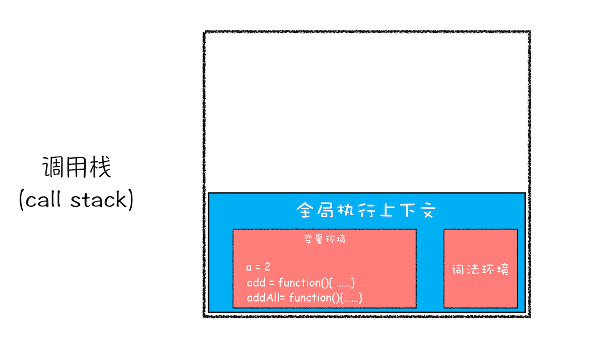
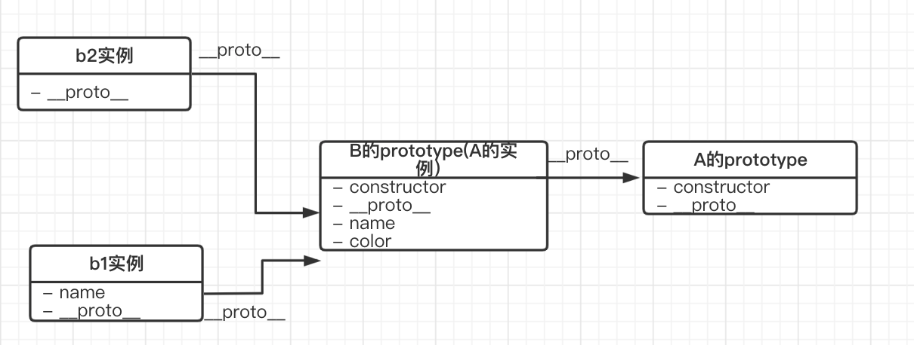

# JavaScript 中 "函数是第一等公民"

数据类型与函数是很多高级语言中最重要的两个概念，前者用来存储数据，后者用来存储代码。JavaScript 中的函数相对于数据类型而言更加复杂，它可以有属性，也可以被赋值给一个变量，还可以作为参数被传递。正是这些强大特性让它成了 JavaScript 的“一等公民”。下面就来看看函数的重要特性。

## 1. 闭包

闭包是指有权访问另一个函数作用域中变量的函数，创建闭包的最常见的方式就是在一个函数内创建另一个函数，创建的函数可以访问到当前函数的局部变量。


**闭包有两个常用的用途；**

- 闭包的第一个用途是使我们在函数外部能够访问到函数内部的变量。通过使用闭包，我们可以通过在外部调用闭包函数，从而在外部访问到函数内部的变量，可以使用这种方法来创建私有变量。
- 闭包的另一个用途是使已经运行结束的函数上下文中的变量对象继续留在内存中，因为闭包函数保留了这个变量对象的引用，所以这个变量对象不会被回收。


其实闭包的本质就是作用域链的一个特殊的应用，只要了解了作用域链的创建过程，就能够理解闭包的实现原理。

## 2. 作用域与作用域链

### 1）全局作用域和函数作用域

（1）全局作用域

- 最外层函数和最外层函数外面定义的变量拥有全局作用域
- 所有未定义直接赋值的变量自动声明为全局作用域

- 所有window对象的属性拥有全局作用域
- 全局作用域有很大的弊端，过多的全局作用域变量会污染全局命名空间，容易引起命名冲突。

（2）函数作用域

- 函数作用域声明在函数内部的变量，一般只有固定的代码片段可以访问到
- 作用域是分层的，内层作用域可以访问外层作用域，反之不行

##### 2）块级作用域

- 使用ES6中新增的let和const指令可以声明块级作用域，块级作用域可以在函数中创建也可以在一个代码块中的创建（由`{ }`包裹的代码片段）
- let和const声明的变量不会有变量提升，也不可以重复声明

- 在循环中比较适合绑定块级作用域，这样就可以把声明的计数器变量限制在循环内部。


**作用域链：**

在当前作用域中查找所需变量，但是该作用域没有这个变量，那这个变量就是自由变量。如果在自己作用域找不到该变量就去父级作用域查找，依次向上级作用域查找，直到访问到window对象就被终止，这一层层的关系就是作用域链。


作用域链的作用是保证对执行环境有权访问的所有变量和函数的有序访问，通过作用域链，我们可以访问到外层环境的变量和函数。


作用域链的本质上是一个指向变量对象的指针列表。变量对象是一个包含了执行环境中所有变量和函数的对象。作用域链的前端始终都是当前执行上下文的变量对象。全局执行上下文的变量对象（也就是全局对象）始终是作用域链的最后一个对象。当我们查找一个变量时，如果当前执行环境中没有找到，我们可以沿着作用域链向后查找。

## 3. 执行上下文

### （1）执行上下文的概念

执行上下文是评估和执行 JavaScript 代码的环境的抽象概念，当 JavaSciprt 代码在运行时，其运行在执行上下文中。

##### 

##### 执行上下文主要分为三类：

- **全局执行上下文：**当 JavaScript 执行全局代码的时候，会编译全局代码并创建全局执行上下文，而且在整个页面的生存周期内，全局执行上下文只有一份。
- **函数执行上下文：**当调用一个函数的时候，函数体内的代码会被编译，并创建函数执行上下文，一般情况下，函数执行结束之后，创建的函数执行上下文会被销毁。

- **eval执行上下文：**当使用 eval 函数的时候，eval 的代码也会被编译，并创建执行上下文。

### （2）全局上下文的创建和组成

##### 当JS 脚本跑起来之后，第一个被创建的执行上下文就是全局上下文。


当我脚本里一行代码也没有时，全局上下文里会比较干净，只有两个东西：

- 全局对象（浏览器里是 Window, Node 环境下是 Global）
- this 变量。这里的 this ，指向的还是全局变量

### （3）函数上下文的创建和组成

函数上下文在机制层面和全局上下文高度一致，**两者之间的不同主要体现在以下方面**：

- **创建的时机** —— 全局上下文在进入脚本之初就被创建，而函数上下文则是在函数调用时被创建
- **创建的频率** —— 全局上下文仅在代码刚开始被解释的时候创建一次；而函数上下文由脚本里函数调用的多少决定，理论上可以创建无数次

- **创建阶段的工作内容不完全相同** —— 函数上下文不会创建全局对象（Window），而是创建参数对象（arguments）；创建出的 this 不再死死指向全局对象，而是取决于该函数是如何被调用的 —— 如果它被一个引用对象调用，那么 this 就指向这个对象；否则，this 的值会被设置为全局对象或者 undefined（在严格模式下）

### （4）从上下文角的度理解变量提升

在非严格模式下，在没有声明一个变量就去调用它时，会出现这样的现象：

```javascript
// 没有报错，而是输出 undefined
console.log(name)
var name = 'js'
```

JS 引擎不会抛出变量未声明的错误，而是会输出一个 undefined 值，表现得好像这个 name 变量早已被声明过一样。像这样的现象，叫做 “变量提升”。


结合上下文创建过程，其实根本不存在任何的 “提升”，变量一直在原地。所谓的 “提升”，只是变量的创建过程（在上下文创建阶段完成）和真实赋值过程（在上下文执行阶段完成）的不同步带来的一种错觉。执行上下文在不同阶段完成的不同工作，才是 “变量提升 “的本质。

## 4. 调用栈

### （1）什么是函数调用

函数调用就是运行一个函数，具体使用方式是使用函数名称跟着一对小括号：

```javascript
var a = 2
function add(){
    var b = 10
    return  a+b
}
add()
```

这段代码先是创建了一个 add 函数，接着在代码的最下面又调用了该函数。下面来看下函数调用的过程。


在执行到函数 add() 之前，JavaScript 引擎会为上面这段代码创建全局执行上下文，包含了声明的函数和变量：


从图中可以看出，代码中全局变量和函数都保存在全局上下文的变量环境中。执行上下文准备好之后，便开始执行全局代码，当执行到 add 这儿时，JavaScript 判断这是一个函数调用，那么将执行以下操作：

- 首先，从**全局执行上下文**中，取出 add 函数代码。
- 其次，对 add 函数的这段代码进行编译，并创建**该函数的执行上下文**和**可执行代码**。

- 最后，执行代码，输出结果。


完整流程图如下：


当执行到 add 函数的时候，就有了两个执行上下文了——全局执行上下文和 add 函数的执行上下文。也就是说在执行 JavaScript 时，可能会存在多个执行上下文，那么 JavaScript 引擎是如何管理这些执行上下文的呢？其实是**通过栈结构来管理的，****这个栈被称为是执行栈**。

### （2）调用栈的概念

JavaScript 引擎是利用栈的这种结构来管理执行上下文的。在执行上下文创建好后，JavaScript 引擎会将执行上下文压入栈中，通常把这种用来管理执行上下文的栈称为**执行上下文栈**，又称**调用栈**。


下面来看示例：

```javascript
var a = 2
function add(b,c){
    return b+c
}
function addAll(b,c){
var d = 10
result = add(b,c)
    return  a+result+d
}
addAll(3,6)
```

可以看到，在 addAll 函数中调用了 add 函数，那在整个代码的执行过程中，调用栈是怎么变化的呢？下面来看看调用栈的状态变化情况。

**第一步，创建全局上下文，并将其压入栈底**。如下图所示：


可以看出，变量 a、函数 add 和 addAll 都保存到了全局上下文的变量环境对象中。全局执行上下文压入到调用栈后，JavaScript 引擎便开始执行全局代码了。首先会执行 a=2 的赋值操作，执行该语句会将全局上下文变量环境中 a 的值设置为 2。设置后的全局上下文的状态如下图所示：


**第二步是调用 addAll 函数**。当调用该函数时，JavaScript 引擎会编译该函数，并为其创建一个执行上下文，最后还将该函数的执行上下文压入栈中，如下图所示：


addAll 函数的执行上下文创建好之后，便进入了函数代码的执行阶段了，这里先执行的是 d=10 的赋值操作，执行语句会将 addAll 函数执行上下文中的 d 由 undefined 变成了 10。


**第三步，当执行到 add 函数**调用语句时，同样会为其创建执行上下文，并将其压入调用栈，如下图所示：


当 add 函数返回时，该函数的执行上下文就会从栈顶弹出，并将 result 的值设置为 add 函数的返回值，也就是 9。如下图所示：


接着 addAll 执行最后一个相加操作后并返回，addAll 的执行上下文也会从栈顶部弹出，此时调用栈中就只剩下全局上下文了。最终如下图所示：



至此，整个 JavaScript 流程执行结束了。其实，**调用栈是 JavaScript 引擎追踪函数执行的一个机制**，当一次有多个函数被调用时，通过调用栈就能够追踪到哪个函数正在被执行以及各函数之间的调用关系。


函数执行完毕后，其对应的执行上下文也随之消失了。这个消失的过程，称之为出栈。在 JS 代码的执行过程中，引擎会创建执行上下文栈（也叫调用栈）。


因为函数上下文可以有许多个，不可能保留所有的上下文。当一个函数执行完毕，其对应的上下文必须让出之前所占用的资源。因此上下文的建立和销毁，就对应了一个**入栈**和**出栈**的操作。当调用一个函数时，就会把它的上下文推入调用栈里，执行完毕后出栈，随后再为新的函数进行入栈操作。

### （3）从调用栈的角度理解作用域

作用域是访问变量的一套规则 。作用域其实就是**当前所处的执行上下文**。


下面来看一段代码：

```javascript
function testA() {
  console.log('执行第一个测试函数的逻辑');
  testB();
  console.log('再次执行第一个测试函数的逻辑');
}
function testB() {
  console.log('执行第二个测试函数的逻辑');
}
testA();
```

这里，全局作用域 相对于 testA 的函数作用域，它是外部作用域；全局作用域、testA 相对于 testB 的函数作用域，它们都是外部作用域。我们知道，作用域在嵌套的情况下，外部作用域是不能访问内部作用域的变量的：


以 testB 为例，最初处于外部作用域（testA、全局上下文）时，testB 对应的上下文还没有被推入调用栈；而当 testB 执行结束、代码执行退回到外部作用域时，testB 早已从栈顶弹出。这意味着，每次位于外部作用域时，testB 的执行上下文都压根不存在于调用栈内。此时就算 testA 函数上下文和全局上下文无论如何也找不到任何关于 testB 的线索，自然访问不到它内部的变量。

### （4）闭包 —— 特殊的出栈

一般来说，函数出栈后，就没有办法再访问到函数内部的变量了。但闭包不是这样：

```javascript
function outer(a) {
  return function inner (b) {
    return a + b;
  };
}
var addA = outer(10);
addA(20)
```

这里，inner 函数引用了 outer 函数的自由变量 a 变量，形成了一个闭包。在 outer 函数执行完毕出栈后，实际上 inner 函数仍然可以访问到这个 a 变量 ——a 变量好像没用随着 outer 函数执行上下文的消失而消失。这是因为，在执行上下文的创建阶段，跟着被创建的还有作用域链，这个作用域链在函数中以内部属性的形式存在，在函数定义时，其对应的父变量对象就会被记录到这个内部属性里。闭包正是通过这一层作用域链的关系，实现了对父作用域执行上下文信息的保留。

### （5）利用浏览器查看调用栈信息

当执行一段复杂的代码时，可能很难从代码文件中分析其调用关系，这时可以在想要查看的函数中加入断点，然后当执行到该函数时，就可以查看该函数的调用栈了。


打开“开发者工具”，点击“Source”标签，选择 JavaScript 代码的页面，然后在第 3 行加上断点，并刷新页面。可以看到执行到 add 函数时，执行流程就暂停了，这时可以通过右边“call stack”来查看当前的调用栈的情况，如下图：


可以看出，右边的“call stack”下面显示出来了函数的调用关系：栈的最底部是 anonymous，也就是全局的函数入口；中间是 addAll 函数；顶部是 add 函数。这就清晰地反映了函数的调用关系，所以**在分析复杂结构代码，或者检查 Bug 时，调用栈都是非常有用的**。


除了通过断点来查看调用栈，还可以使用 console.trace() 来输出当前的函数调用关系，比如在示例代码中的 add 函数里面加上了 console.trace()，就可以看到控制台输出的结果，如下图：


### （6）栈溢出（Stack Overflow）

需要注意，**调用栈是有大小的**，当入栈的执行上下文超过一定数目，JavaScript 引擎就会报错，这种错误叫做**栈溢出**。


特别是在写递归代码时，就很容易出现栈溢出的情况。比如下面这段代码：

```javascript
function division(a,b){
    return division(a,b)
}
console.log(division(1,2))
```

当执行时，就会抛出栈溢出错误，如下图：


可以看到，抛出的错误信息为：超过了最大栈调用大小（Maximum call stack size exceeded）。


那为什么会出现这个问题呢？这是因为当 JavaScript 引擎开始执行这段代码时，它首先调用函数 division，并创建执行上下文，压入栈中；然而，这个函数是**递归的，并且没有任何终止条件**，所以它会一直创建新的函数执行上下文，并反复将其压入栈中，但栈是有容量限制的，超过最大数量后就会出现栈溢出的错误。


我们可以使用一些方法来避免或者解决栈溢出的问题，比如把递归调用的形式改造成其他形式，或者使用加入定时器的方法来把当前任务拆分为其他很多小任务。

## 5. 原型与原型链

原型是 JavaScript 面向对象系统实现的根基。其实，原型（Prototype）模式还是一种设计模式，同时更是一种是一种**编程范式**（programming paradigm）。

### （1）理解原型编程范式

使用 JavaScript 以来，确实离不开原型，按照上面的说法，也算是一直在应用原型编程范式了。难道还有除了原型以外的选择？


作为 JavaScript 开发者，确实没有别的选择 —— 毕竟原型是 JavaScript 这门语言面向对象系统的根本。但在其它语言，比如 JAVA 中，类才是它面向对象系统的根本。


类是对一类实体的结构、行为的抽象。在基于类的面向对象语言中，首先关注的是**抽象**—— 先把具备通用性的类给设计出来，才能用这个类去实例化一个对象，进而关注到具体层面的东西。


而在 JS 这样的原型语言中，首先需要关注的就是具体——具体的每一个实例的行为。根据不同实例的行为特性，把相似的实例关联到一个原型对象里去 —— 在这个被关联的原型对象里，就囊括了那些较为通用的行为和属性。基于此原型的实例，都能 “复制” 它的能力。


在原型编程范式中，正是通过 “**复制**” 来创建新对象。但这个 “复制” 未必一定要开辟新的内存、把原型对象照着再实现一遍 —— 复制的是能力，而不必是实体。比如在 JS 中，通过使新对象保持对原型对象的引用来做到了 “复制”。

### （2）JavaScript 中的 “类”

ES6 开始就支持类了， ES6 的类其实是原型继承的语法糖:

ECMAScript 2015 中引入的 JavaScript 类实质上是 JavaScript 现有的基于原型的继承的语法糖。类语法不会为 JavaScript 引入新的面向对象的继承模型。 ——MDN

当我们尝试用 class 去定义一个 Dog 类时：

```javascript
class Dog {
  constructor(name ,age) {
   this.name = name
   this.age = age
  }
  
  eat() {
    console.log('肉骨头真好吃')
  }
}
```

这就等价于写了这么一个构造函数:

```javascript
function Dog(name, age) {
  this.name = name
  this.age = age
}
Dog.prototype.eat = function() {
  console.log('肉骨头真好吃')
}
```

所以，JS 以原型作为其面向对象系统基石的本质并没有被改变。

### （3）理解原型

原型编程范式的核心思想就是**利用实例来描述对象，用实例作为定义对象和继承的基础**。在 JavaScript 中，原型编程范式的体现就是**基于原型链的继承**。这其中，对原型、原型链的理解是关键。


在 JavaScript 中，每个构造函数都拥有一个 `prototype` 属性，它指向构造函数的原型对象，这个原型对象中有一个 construtor 属性指回构造函数；每个实例都有一个`__proto__`属性，当我们使用构造函数去创建实例时，实例的`__proto__`属性就会指向构造函数的原型对象。


具体来说，当这样使用构造函数创建一个对象时：

```javascript
// 创建一个Dog构造函数
function Dog(name, age) {
  this.name = name
  this.age = age
}
Dog.prototype.eat = function() {
  console.log('肉骨头真好吃')
}
// 使用Dog构造函数创建dog实例
const dog = new Dog('旺财', 3)
```

这段代码里的几个实体之间就存在着这样的关系：


### （4）理解原型链

在上面那段代码的基础上，进行两个方法调用:

```javascript
// 输出"肉骨头真好吃"
dog.eat()
// 输出"[object Object]"
dog.toString()
```

我们没有在 dog 实例里手动定义 eat 方法和 toString 方法，它们还是被成功地调用了。这是因为当试图访问一个 JavaScript 实例的属性 / 方法时，它首先搜索这个实例本身；当发现实例没有定义对应的属性 / 方法时，它会转而去搜索实例的原型对象；如果原型对象中也搜索不到，它就去搜索原型对象的原型对象，这个搜索的轨迹，就叫做原型链。


以 eat 方法和 toString 方法的调用过程为例，它的搜索过程就是这样子的：


这些彼此相连的 `prototype`，就构成了所谓的 “原型链”。


注意：几乎所有 JavaScript 中的对象都是位于原型链顶端的 Object 的实例，除了 `Object.prototype`（当然，如果手动用 `Object.create(null)` 创建一个没有任何原型的对象，那它也不是 Object 的实例）。

## 6. 原型链面试命题点

### （1）命题点一：原型基础 + 构造函数基础

```javascript
var A = function() {};
A.prototype.n = 1;
var b = new A();
A.prototype = {
  n: 2,
  m: 3
}
var c = new A();
console.log(b.n);
console.log(b.m);
console.log(c.n);
console.log(c.m);
```

答案如下：


下面看一下这个例子中几个对象间的关系：

**1）Step1：明确原型关系：**

b 实例与 A 之间的关系：


c 实例与 A 之间的关系：


**2）Step2：关键思路解析 - 构造函数的工作机理**

为什么b 实例和 c 实例继承自一个原型，却有着不同的表现。这里需要注意：当用 new 去创建一个实例时，new 做了什么？它做了这四件事：

- 为这个新的对象开辟一块属于它的内存空间
- **把函数体内的 this 指到 1 中开辟的内存空间去**

- **将新对象的** **_** **proto_** **这个属性指向对应构造函数的 prototype 属性，把实例和原型对象关联起来**
- 执行函数体内的逻辑，最后即便你没有手动 return，构造函数也会帮你把创建的这个新对象 return 出来


第二步执行完之后，实例对象的原型就把构造函数的 prototype 的引用给存下来了。那么在 b 实例创建的时候，构造函数的 prototype 是啥呢？就是这么个对象：


所以 b 实例输出的 n 就是 1；同时由于它没有 m 属性，直接输出 undefined。


后面还对 A 的 prototype 做了修改，b 如果存的是引用，它应该感知到我这个修改啊，但是，注意修改 A 的 prototype 的形式：

```javascript
A.prototype = {
  n: 2,
  m: 3
}
```

这严格意义上来说不算修改，而是一个重新赋值操作。这个动作的本质是把 A 的 prototype 指向了一个全新的 js 对象：


可以看到，A 单方面切断了和旧 prototype 的关系，而 b 却仍然保留着旧 prototype 的引用。这就是造成 b 实例和 c 实例之间表现差异的原因。

### （2）命题点二：自有属性与原型继承属性

```javascript
function A() {
    this.name = 'a'
    this.color = ['green', 'yellow']
 }
 function B() {
   
 }
 B.prototype = new A()
 var b1 = new B()
 var b2 = new B()
 
 b1.name = 'change'
 b1.color.push('black')
console.log(b2.name) // 'a'
console.log(b2.color) // ["green", "yellow", "black"]
```

**1）Step1：画出原型链图**

这道题没有直接用 A 去 new 对象，而是找了一个 “中间人” B，这样就达到了把原型链复杂化的目的：



**2）Step2：读操作与写操作的区别**

这里， b1 和 b2 之间的一个区别就是 b1 有自有的 name 属性。主要的是这一行代码：

```v
b1.name = 'change'
```

在查找 b1 的 name 属性时，难道不应该沿着原型链去找，然后定位并修改原型链上的 name 吗？实际上，这个 “逆流而上” 的变量定位过程，当且仅当我们在进行 “读” 操作时会发生。对于这行代码，是一个赋值动作，是一个 “写” 操作。在写属性的过程中，如果发现 name 这个属性在 b1 上还没有，那么就会原地为 b1 创建这个新属性，而不会去打扰原型链了。


那么 color 这个属性，看上去也像是一个 “写” 操作，为什么它没有给 b2 新增属性、而是去修改了原型链上的 color 呢？首先，这样的写法：

```javascript
b1.color.push('black')
```

包括这样的写法（修改对象的属性值）：

```javascript
b1.color.attribute = 'xxx'
```

它实际上并没有改变对象的引用，而仅仅是在原有对象的基础上修改了它的内容而已。像这种不触发引用指向改变的操作，它走的就是 **原型链** **查询 + 修改** 的流程，而非原地创建新属性的流程。


如何把它变成写操作呢？直接赋值：

```javascript
b1.color = ['newColor']
```

这样，color 就会变成 b1 的一个自有属性了。 因为 [‘newColor’] 是一个全新的数组，它对应着一个全新的引用。对 js 来说，这才是真正地在向 b1 “写入” 一个新的属性。

### （3）命题点三：构造函数综合考察

```javascript
function A() {}
function B(a) {
    this.a = a;
}
function C(a) {
    if (a) {
        this.a = a;
    }
}
A.prototype.a = 1;
B.prototype.a = 1;
C.prototype.a = 1;
console.log(new A().a); // 1
console.log(new B().a); // undefined
console.log(new C(2).a); // 2
```

结合前面对构造函数的分析，当像这样通过 new + 构造函数创建新对象的时候：

```javascript
function C(a) {
    if (a) {
        this.a = a;
    }
}
var c = new C(2)
```

实际上发生了四件事情：

1. 为 c 实例开辟一块属于它的内存空间
2. **把函数体内的 this 指到 1 中开辟的内存空间去**

1. **将实例 c 的** **_** **proto_** **这个属性指向构造函数 C 的 prototype 属性**
2. 执行函数体内的逻辑，最后构造函数会帮你把创建的这个 c 实例 return 出来


基于这个结论来看 console 中的三次调用：

- **new A ().a**：构造函数逻辑为空，返回的实例对象 _ *proto_* 中包含了 a = 1 这个属性。new A ().a 时，发现实例对象本身没有 a，于是沿着原型链找到了原型中的 a，输出其值为 1。
- **new B ().a**：构造函数中会无条件为实例对象创建一个自有属性 a，这个 a 的值以入参为准。这里我们的入参是 undefined，所以 a 值也是 undefined。

- **new C (2).a**：构造函数中会有条件地为实例对象创建一个自有属性 a—— 若确实存在一个布尔判定不为 false 的入参 a，那么为实例对象创建对应的 a 值；否则，不做任何事情。这里我们传入了 2，因此实例输出的 a 值就是 2。