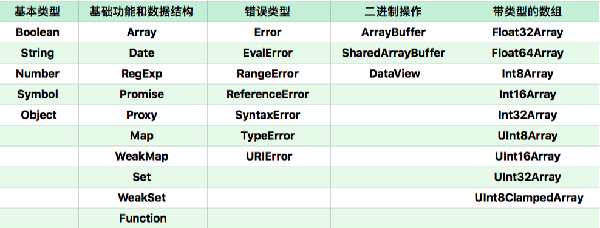

# 深入理解面向对象

## 1. 对象特征

对象有如下三个特点：

- **对象具有唯一标识性**：即使完全相同的两个对象，也并非同一个对象。对象唯一标识性都是用内存地址来体现的，对象具有唯一标识的内存地址，所以具有唯一的标识。所以，即使两个长得一模一样的对象，都是不相等的。
- **对象有状态**：对象具有状态，同一对象可能处于不同状态之下。

- **对象具有行为**：即对象的状态，可能因为它的行为产生变迁。


在 JavaScript 中，将状态和行为统一抽象为“属性”，考虑到 JavaScript 中将函数设计成一种特殊对象，所以 JavaScript 中的行为和状态都能用属性来抽象。下面是普通属性和函数作为属性的例子，其中 o 是对象，d 是一个属性，而函数 f 也是一个属性，尽管写法不太相同，但是对 JavaScript 来说，d 和 f 就是两个普通属性：

```javascript
let o = { 
  d: 1,
  f() {
    console.log(this.d);
  }    
};
```

所以，在 JavaScript 中，对象的状态和行为其实都被抽象为了属性。二者都很好地表现了对象的基本特征：标识性、状态和行为。


在实现了对象基本特征的基础上, JavaScript 中对象独有的特色是：**对象具有高度的动态性，这是因为 JavaScript 赋予了使用者在运行时为对象添改状态和行为的能力**。举个例子，JavaScript 允许运行时向对象添加属性，这就跟绝大多数基于类的、静态的对象设计完全不同。下面例子在运行时如何向一个对象添加属性，定义了一个对象 o，定义完成之后，再添加它的属性 b，这样操作是完全没问题的：

```javascript
let o = { a: 1 };
o.b = 2;
console.log(o.a, o.b); //1 2
```

## 2. 对象属性

为了提高抽象能力，JavaScript 提供了**数据属性**和**访问器属性（getter/setter）**两类。


第一类属性，数据属性，它具有四个特征。

- value：属性的值。
- writable：决定属性能否被赋值。

- enumerable：决定 for in 能否枚举该属性。
- configurable：决定该属性能否被删除或者改变特征值。

在大多数情况下，我们只关心数据属性的值。通常用于定义属性的代码会产生数据属性，其中的 writable、enumerable、configurable 都默认为 true。可以使用内置函数 `getOwnPropertyDescriptor` 来查看：

```javascript
let o = { a: 1 };
o.b = 2;

//a和b都是数据属性
Object.getOwnPropertyDescriptor(o,"a") // {value: 1, writable: true, enumerable: true, configurable: true}
Object.getOwnPropertyDescriptor(o,"b") // {value: 2, writable: true, enumerable: true, configurable: true}
```

如果要想改变属性的特征，或者定义访问器属性，可以使用 Object.defineProperty：

```javascript
let o = { a: 1 };
Object.defineProperty(o, "b", {value: 2, writable: false, enumerable: false, configurable: true});

//a和b都是数据属性，特征值发生变化
Object.getOwnPropertyDescriptor(o,"a"); // {value: 1, writable: true, enumerable: true, configurable: true}
Object.getOwnPropertyDescriptor(o,"b"); // {value: 2, writable: false, enumerable: false, configurable: true}
o.b = 3;
console.log(o.b); // 2
```

第二类属性，访问器（getter/setter）属性，它具有四个特征：

- getter：函数或 undefined，在取属性值时被调用。
- setter：函数或 undefined，在设置属性值时被调用。

- enumerable：决定 for in 能否枚举该属性。
- configurable：决定该属性能否被删除或者改变特征值。


访问器属性使得属性在读和写时执行代码，它允许使用者在写和读属性时，得到完全不同的值，它可以视为一种函数的语法糖。在创建对象时，可以使用 get 和 set 关键字来创建访问器属性。访问器属性跟数据属性不同，每次访问属性都会执行 getter 或者 setter 函数：

```javascript
let obj = { get a() { return 1 } };

console.log(obj.a); // 1
```

所以，JavaScript 对象的运行时就是一个“属性的集合”，属性以字符串或者 Symbol 为 key，以数据属性特征值或者访问器属性特征值为 value。对象是一个属性的索引结构（索引结构是一类常见的数据结构，可以理解为能够以比较快的速度用 key 来查找 value 的字典）。

## 3. 原型与类

在不同的编程语言中，设计者利用各种不同的语言特性来抽象描述对象。主要分为**基于类的编程语言**和**基于原型的编程语言。**

- **基于类的编程**提倡使用一个关注分类和类之间关系开发模型。在这类语言中，总是先有类，再从类去实例化一个对象。类与类之间又可能会形成继承、组合等关系。类又往往与语言的类型系统整合，形成一定编译时的能力。
- **基于原型的编程**看起来更为提倡去关注一系列对象实例的行为，然后才去关心如何将这些对象划分到最近的使用方式相似的原型对象，而不是将它们分成类。基于原型的面向对象系统通过“复制”的方式来创建新对象。JavaScript 就是基于原型的编程语言。


 JavaScript的原型系统可以概括为以下两点（先抛开 new、Function Object、函数的 prototype 属性不说）：

- 如果所有对象都有私有字段[[prototype]]，就是对象的原型；
- 读一个属性，如果对象本身没有，则会继续访问对象的原型，直到原型为空或者找到为止。


从 ES6 以来，JavaScript 提供了一系列内置函数，以便更为直接地访问操纵原型，三个方法为：

- Object.create 根据指定的原型创建新对象，原型可以是 null；
- Object.getPrototypeOf 获得一个对象的原型；

- Object.setPrototypeOf 设置一个对象的原型。


ES6 中加入了新特性 class，new 跟 function 搭配的怪异行为终于可以退休，在任何场景，建议使用 ES6 的语法来定义类，而令 function 回归原本的函数语义。


ES6 中引入了 class 关键字，类的概念正式从属性升级成语言的基础设施，从此，基于类的编程方式成为了 JavaScript 的官方编程范式。类的基本写法如下：

```javascript
class Rectangle {
  constructor(height, width) {
    this.height = height;
    this.width = width;
  }
  // Getter
  get area() {
    return this.calcArea();
  }
  // Method
  calcArea() {
    return this.height * this.width;
  }
}
```

在现有的类语法中，getter/setter 和 method 是兼容性最好的。通过 get/set 关键字来创建 getter，通过括号和大括号来创建方法，数据型成员最好写在构造器里面。类的写法实际上也是由原型运行时来承载的，逻辑上 JavaScript 认为每个类是有共同原型的一组对象，类中定义的方法和属性则会被写在原型对象之上。此外，最重要的是，类提供了继承的能力：

```javascript
class Animal { 
  constructor(name) {
    this.name = name;
  }
  
  speak() {
    console.log(this.name + ' makes a noise.');
  }
}

class Dog extends Animal {
  constructor(name) {
    super(name); // call the super class constructor and pass in the name parameter
  }

  speak() {
    console.log(this.name + ' barks.');
  }
}

let d = new Dog('Mitzie');
d.speak(); // Mitzie barks.
```

以上代码创造了 Animal 类，并且通过 extends 关键字让 Dog 继承了它，展示了最终调用子类的 speak 方法获取了父类的 name。


当我们使用类的思想来设计代码时，应该尽量使用 class 来声明类，而不是用旧语法，拿函数来模拟对象。

## 4. 对象分类

JavaScript中的对象可以分成几类：

**1）宿主对象**（host Objects）：由 JavaScript 宿主环境提供的对象，它们的行为完全由宿主环境决定。

**2）内置对象**（Built-in Objects）：由 JavaScript 语言提供的对象，主要包括以下三类：

- 固有对象（Intrinsic Objects ）：由标准规定，随着 JavaScript 运行时创建而自动创建的对象实例。
- 原生对象（Native Objects）：可以由用户通过 Array、RegExp 等内置构造器或者特殊语法创建的对象。

- 普通对象（Ordinary Objects）：由{}语法、Object 构造器或者 class 关键字定义类创建的对象，它能够被原型继承。


**宿主对象：**

所谓的宿主，简单来说就是代码的运行环境，前端最熟悉的就是浏览器环境中的宿主了。在浏览器环境中，全局对象是 window，window 上又有很多属性，如 document。实际上，这个全局对象 window 上的属性，一部分来自 JavaScript 语言，一部分来自浏览器环境。JavaScript 标准中规定了全局对象属性，W3C 的各种标准中规定了 Window 对象的其它属性。


宿主对象分为固有的和用户可创建的两种，比如 document.createElement 就可以创建一些 DOM 对象。宿主也会提供一些构造器，比如可以使用 new Image 来创建 img 元素，


**内置对象：**

（1）固有对象

固有对象是由标准规定，随着 JavaScript 运行时创建而自动创建的对象实例。固有对象在任何 JavaScript 代码执行前就已经被创建出来了，它们通常扮演者类似基础库的角色。“类”其实就是固有对象的一种。


（2）原生对象

JavaScript 中能够通过语言本身的构造器创建的对象称作原生对象。在 JavaScript 标准中，提供了 30 多个构造器。按照不同应用场景，可以将原生对象分成了以下几个种类：



通过这些构造器，可以用 new 运算创建新的对象，所以把这些对象称作原生对象。几乎所有这些构造器的能力都是无法用纯 JavaScript 代码实现的，它们也无法用 class/extend 语法来继承。


这些构造器创建的对象多数使用了私有字段, 例如：

- Error: [[ErrorData]]
- Boolean: [[BooleanData]]

- Number: [[NumberData]]
- Date: [[DateValue]]

- RegExp: [[RegExpMatcher]]
- Symbol: [[SymbolData]]

- Map: [[MapData]]


这些字段使得原型继承方法无法正常工作，所以，可以认为所有这些原生对象都是为了特定能力或者性能，而设计出来的“特权对象”。


除了上面说的对象之外，在固有对象和原生对象中，有一些对象的行为跟正常对象有很大区别。它们常见的下标运算（就是使用中括号或者点来做属性访问）或者设置原型跟普通对象不同，主要有以下几种：

- Array：Array 的 length 属性根据最大的下标自动发生变化。
- Object.prototype：作为所有正常对象的默认原型，不能再给它设置原型了。

- String：为了支持下标运算，String 的正整数属性访问会去字符串里查找。
- Arguments：arguments 的非负整数型下标属性跟对应的变量联动。

- 模块的 namespace 对象：特殊的地方非常多，跟一般对象完全不一样，尽量只用于 import 。
- 类型数组和数组缓冲区：跟内存块相关联，下标运算比较特殊。

- bind 后的 function：跟原来的函数相关联。