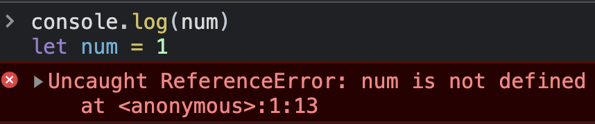
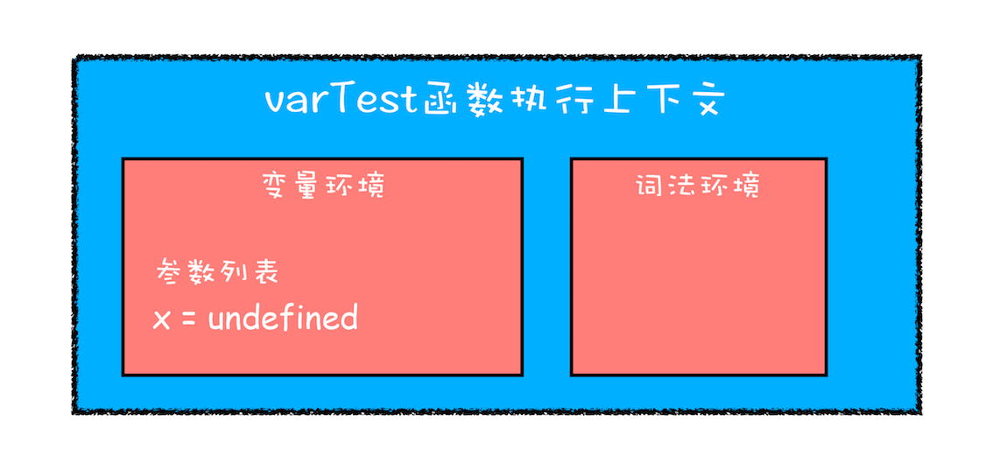
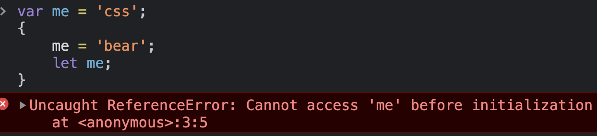
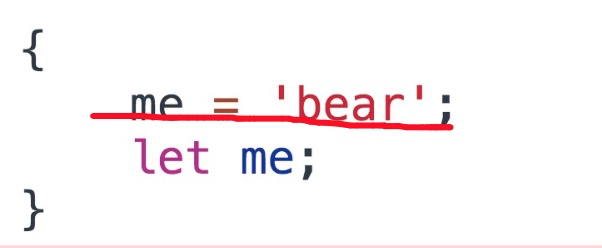

# JavaScript 变量提升

在ES2015中，新增了let 和 const关键字，在面试中也常被问到let 和 const与var的区别，这就牵扯出的变量提升、暂时性死区等知识点。下面就来看看什么是变量提升和暂时性死区。

## 1. 什么变量提升

**所谓的变量提升，是指在 JavaScript 代码执行过程中，JavaScript 引擎把变量的声明部分和函数的声明部分提升到代码开头的“行为”。变量被提升后，会给变量设置默认值，这个默认值就是 undefined。**正是由于 JavaScript 存在变量提升这种特性，从而导致了很多与直觉不符的代码，这也是 JavaScript 的一个重要设计缺陷。


虽然 ECMAScript6 已经通过引入块级作用域并配合 let、const 关键字，来避开了这种设计缺陷，但是由于 JavaScript 需要保持向下兼容，所以变量提升在相当长一段时间内还会继续存在。


在 ECMAScript6 之前，JS 引擎用 var 关键字声明所有的变量。在 var 时代，**不管变量声明是写在程序的哪里，最后都会被提到作用域的顶端去**：

```javascript
console.log(num) 
var num = 1
```

这段代码不会报错，反而会输出一个 undefined。这就是因为变量的声明被“提升”了，它等价于这样：

```javascript
var num
console.log(num)
num = 1
```

可以看到，num 作为全局变量会被提升到全局作用域的头部。在函数作用域里，也会有类似的现象发生：

```javascript
function getNum() {
  console.log(num) 
  var num = 1  
}
```

这里同样会输出 undefined，这是因为函数内部的变量声明会被提升至函数作用域的顶端。这个例子等价于：

```javascript
function getNum() {
  var num 
  console.log(num) 
  num = 1  
}
```

## 2. 为什么会有变量提升

变量提升和JavaScript编译过程密切相关：

事实上，JS也是有编译阶段的，它和传统语言的区别在于，JS不会早早地把编译工作做完，而是一边编译一边执行。简单来说，所有的JS代码片段在执行之前都会被编译，只是这个编译的过程非常短暂（可能就只有几微妙、或者更短的时间），紧接着这段代码就会被执行。


JS 和其他语言一样，都要经历编译和执行阶段。正是在这个短暂的**编译阶段**里，JS 引擎会搜集所有的变量声明，并且提前让声明生效。至于剩下的语句，则需要等到执行阶段、等到执行到具体的某一句的时候才会生效。这就是变量提升背后的机制。


为什么 JavaScript 中会存在变量提升这个特性，而其他语言没有这个特性呢？首先从作用域说起。


**作用域是指在程序中定义变量的区域，该位置决定了变量的生命周期。通俗地理解，作用域就是变量与函数的可访问范围，即作用域控制着变量和函数的可见性和生命周期。**


在 ES6 之前，ES 的作用域只有两种：全局作用域和函数作用域。

- **全局作用域**中的对象在代码中的任何地方都能访问，其生命周期伴随着页面的生命周期。
- **函数作用域**就是在函数内部定义的变量或者函数，并且定义的变量或者函数只能在函数内部被访问。函数执行结束之后，函数内部定义的变量会被销毁。


在 ES6 之前，JavaScript 只支持这两种作用域，相较而言，其他语言则都普遍支持**块级作用域**。块级作用域就是使用一对大括号包裹的一段代码，比如函数、判断语句、循环语句，甚至单独的一个{}都可以被看作是一个块级作用域。


简单来讲，如果一种语言支持块级作用域，那么其代码块内部定义的变量在代码块外部是访问不到的，并且等该代码块中的代码执行完成之后，代码块中定义的变量会被销毁。


**ES6 之前是不支持块级作用域的**，没有了块级作用域，再把作用域内部的变量统一提升无疑是最快速、最简单的设计，不过这也直接导致了函数中的变量无论是在哪里声明的，在编译阶段都会被提取到执行上下文的变量环境中，所以这些变量在整个函数体内部的任何地方都是能被访问的，这也就是 JavaScript 中的变量提升。


**使用变量提升有如下两个好处：**

- 提高性能
- 容错性更好


**（1）提高性能**

在JS代码执行之前，会进行语法检查和预编译，并且这一操作只进行一次。这么做就是为了提高性能，如果没有这一步，那么每次执行代码前都必须重新解析一遍该变量（函数），而这是没有必要的，因为变量（函数）的代码并不会改变，解析一遍就够了。


在解析的过程中，还会为函数生成预编译代码。在预编译时，会统计声明了哪些变量、创建了哪些函数，并对函数的代码进行压缩，去除注释、不必要的空白等。这样做的好处就是每次执行函数时都可以直接为该函数分配栈空间（不需要再解析一遍去获取代码中声明了哪些变量，创建了哪些函数），并且因为代码压缩的原因，代码执行也更快了。


**（2）容错性更好**

变量提升可以在一定程度上提高JS的容错性，看下面的代码：

```javascript
a = 1;
var a;
console.log(a);
```

如果没有变量提升，这两行代码就会报错，但是因为有了变量提升，这段代码就可以正常执行。


虽然，在可以开发过程中，可以完全避免这样写，但是有时代码很复杂的时候。可能因为疏忽而先使用后定义了，这样也不会影响正常使用。由于变量提升的存在，而会正常运行。


**总结：**

- 解析和预编译过程中的声明提升可以提高性能，让函数可以在执行时预先为变量分配栈空间；
- 声明提升还可以提高JS代码的容错性，使一些不规范的代码也可以正常执行。

## 3. 变量提升导致的问题

由于变量提升作用，使用 JavaScript 来编写和其他语言相同逻辑的代码，都有可能会导致不一样的执行结果。那为什么会出现这种情况呢？主要有以下两种原因。

### （1）变量被覆盖

来看下面的代码：

```javascript
var myname = " JavaScript "
function showName(){
  console.log(myname);
  if(0){
   var myname = " CSS "
  }
  console.log(myname);
}
showName()
```

执行上面这段代码，打印出来的是 undefined，而并没有打印出来“JavaScript”的字符串。为什么输出的内容是 undefined 呢？


首先当刚执行到 showName 函数调用时，会创建 showName 函数的执行上下文，之后，JavaScript 引擎便开始执行 showName 函数内部的代码。首先执行的是：

```javascript
console.log(myname);
```

执行这段代码需要使用变量 myname，这里有两个 myname 变量：一个在全局执行上下文中，其值是“JavaScript”；另外一个在 showName 函数的执行上下文中，其值是 undefined。那么到底该使用哪个呢？


**应该先使用函数执行上下文里面的变量**，这是因为在函数执行过程中，JavaScript 会优先从当前的执行上下文中查找变量，由于变量提升，当前的执行上下文中就包含了变量 myname，而值是 undefined，所以获取到的 myname 的值就是 undefined。


这输出的结果和其他大部分支持块级作用域的语言都不一样，比如 C 语言输出的就是全局变量，所以这会很容易造成误解。

### （2）变量没有被销毁

```javascript
function foo(){
  for (var i = 0; i < 7; i++) {
  }
  console.log(i); 
}
foo()
```

在 C 语言或者其他的大部分语言实现类似代码，在 for 循环结束之后，i 就已经被销毁了，但是在 JavaScript 代码中，i 的值并未被销毁，所以最后打印出来的是 7。


这同样也是由变量提升而导致的，在创建执行上下文阶段，变量 i 就已经被提升了，所以当 for 循环结束之后，变量 i 并没有被销毁。这依旧和其他支持块级作用域的语言表现是不一致的，所以必然会给一些人造成误解。

## 4. 被禁用的变量提升

为了解决上述问题，**ES6 引入了 let 和 const 关键字**，从而使 JavaScript 也能像其他语言一样拥有了块级作用域。let 和 const 是不存在变量提升的。下面用 let 来声明变量：

```javascript
console.log(num) 
let num = 1
```

输出结果报错了：



如果改成 const 声明，也会是一样的结果——用 let 和 const 声明的变量，它们的声明生效时机和具体代码的执行时机保持一致。


这样做是因为，早期的声明提升机制，其实容纳了很多误操作——那些忘记被声明的变量无法在开发阶段被明显地察觉出来，而是以 undefined 这样危险的形式藏匿在你的代码里。为了减少运行时错误，防止暗中使坏的 undefined 带来不可预知的问题，ES6 特意将“声明前不可用”这一点做了强约束。


let 和 const 还是有区别的，使用 let 关键字声明的变量是可以被改变的，而使用 const 声明的变量其值是不可以被改变的。但不管怎样，两者都可以生成块级作用域。


下面来看看 ES6 是如何通过块级作用域来解决上面的问题：

```javascript
function varTest() {
  var x = 1;
  if (true) {
    var x = 2;  // 同样的变量!
    console.log(x);  // 2
  }
  console.log(x);  // 2
}
```

在这段代码中，有两个地方都定义了变量 x，第一个地方在函数块的顶部，第二个地方在 if 块的内部，由于 var 的作用范围是整个函数，所以在编译阶段，会生成如下的执行上下文：



从执行上下文的变量环境中可以看出，最终只生成了一个变量 x，函数体内所有对 x 的赋值操作都会直接改变变量环境中的 x 值。所以上述代码最后通过 console.log(x) 输出的是 2，而对于相同逻辑的代码，其他语言最后一步输出的值应该是 1，因为在 if 块里面的声明不应该影响到块外面的变量。


既然支持块级作用域和不支持块级作用域的代码执行逻辑是不一样的，下面就来把 var 关键字替换为 let 关键字：

```javascript
function letTest() {
  let x = 1;
  if (true) {
    let x = 2;  // 不同的变量
    console.log(x);  // 2
  }
  console.log(x);  // 1
}
```

执行这段代码，其输出结果就和预期是一致的。这是因为 let 关键字是支持块级作用域的，所以在编译阶段，JavaScript 引擎并不会把 if 块中通过 let 声明的变量存放到变量环境中，这也就意味着在 if 块通过 let 声明的关键字，并不会提升到全函数可见。所以在 if 块之内打印出来的值是 2，跳出语块之后，打印出来的值就是 1 了。这种就非常符合编程习惯了**：作用块内声明的变量不影响块外面的变量**。

## 5. JS如何支持块级作用域

在同一段代码中，ES6 是如何做到既要支持变量提升的特性，又要支持块级作用域的呢？下面**从执行上下文的角度**来看看原因。


JavaScript 引擎是通过变量环境实现函数级作用域的，那么 ES6 又是如何在函数级作用域的基础之上，实现对块级作用域的支持呢？先看下面这段代码：

```javascript
function foo(){
    var a = 1
    let b = 2
    {
      let b = 3
      var c = 4
      let d = 5
      console.log(a)
      console.log(b)
    }
    console.log(b) 
    console.log(c)
    console.log(d)
}   
foo()
```

当执行这段代码的时候，JavaScript 引擎会先对其进行编译并创建执行上下文，然后再按照顺序执行代码。我们引入了 let 关键字，let 关键字会创建块级作用域，那么 let 关键字是如何影响执行上下文的呢？


**第一步是编译并创建执行上下文**：


通过上图，可以得出以下结论：

- 函数内部通过 var 声明的变量，在编译阶段全都被存放到**变量环境**里面了。
- 通过 let 声明的变量，在编译阶段会被存放到**词法环境（Lexical Environment）**中。

- 在函数的作用域内部，通过 let 声明的变量并没有被存放到词法环境中。


**第二步继续执行代码**，当执行到代码块里面时，变量环境中 a 的值已经被设置成了 1，词法环境中 b 的值已经被设置成了 2，这时候函数的执行上下文就如下图所示：


可以看出，当进入函数的作用域块时，作用域块中通过 let 声明的变量，会被存放在词法环境的一个单独的区域中，这个区域中的变量并不影响作用域块外面的变量，比如在作用域外面声明了变量 b，在该作用域块内部也声明了变量 b，当执行到作用域内部时，它们都是独立的存在。


其实，在词法环境内部，维护了一个小型栈结构，栈底是函数最外层的变量，进入一个作用域块后，就会把该作用域块内部的变量压到栈顶；当作用域执行完成之后，该作用域的信息就会从栈顶弹出，这就是词法环境的结构。需要注意下，我这里所讲的变量是指通过 let 或者 const 声明的变量。


再接下来，当执行到作用域块中的`console.log(a)`这行代码时，就需要在词法环境和变量环境中查找变量 a 的值了，具体查找方式是：沿着词法环境的栈顶向下查询，如果在词法环境中的某个块中查找到了，就直接返回给 JavaScript 引擎，如果没有查找到，那么继续在变量环境中查找。


这样一个变量查找过程就完成了：


当作用域块执行结束之后，其内部定义的变量就会从词法环境的栈顶弹出，最终执行上下文如下图所示：


块级作用域就是通过词法环境的栈结构来实现的，而变量提升是通过变量环境来实现，通过这两者的结合，JavaScript 引擎也就同时支持了变量提升和块级作用域了。

## 6. 暂时性死区

下面来看看暂时性死区的概念：

```javascript
var me = 'css';
{
	me = 'bear';
	let me;
}
```

这段代码也会报错：



在 ES6 中有明确的规定：如果区块中存在 let 和 const 命令，这个区块对这些命令声明的变量，从一开始就形成了封闭作用域。假如尝试在声明前去使用这类变量，就会报错。


这一段会报错的危险区域，有一个专属的名字，叫”暂时性死区“。以红线为界，上面的区域就是暂时性死区：



如果想成功引用全局的 me 变量，需要把 let 声明给去掉：

```javascript
var me = 'css';
{
	me = 'bear';
}
```

这时程序就能运行无阻了，其实，这并不意味着引擎感知不到 me 这个变量的存在，恰恰相反，它感知到了，而且它清楚地知道 me 是用 let 声明在当前块里的——正因如此，它才会给这个变量加上暂时性死区的限制。一旦把 let 关键字撤走了，它反而也不吭声了。


其实这也就是暂时性死区的本质：当进入当前作用域时，let 或者 const 声明的变量已经存在了——它们只是不允许被获取而已。要想获取它们，必须得等到代码执行到声明处。

