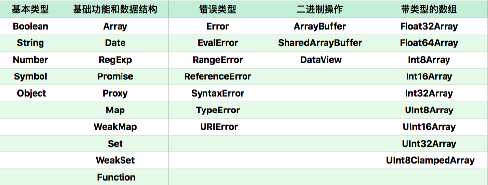
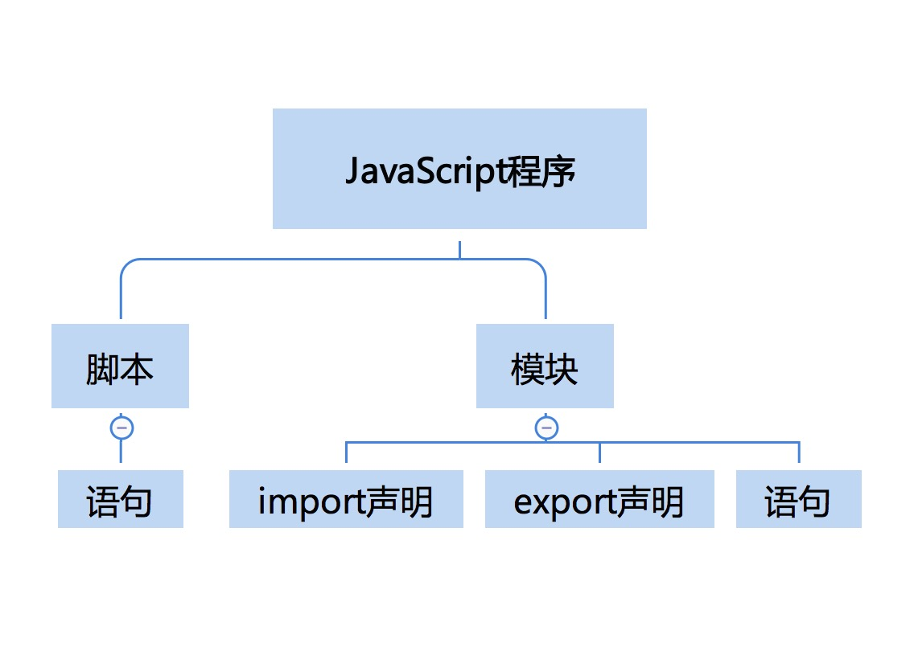
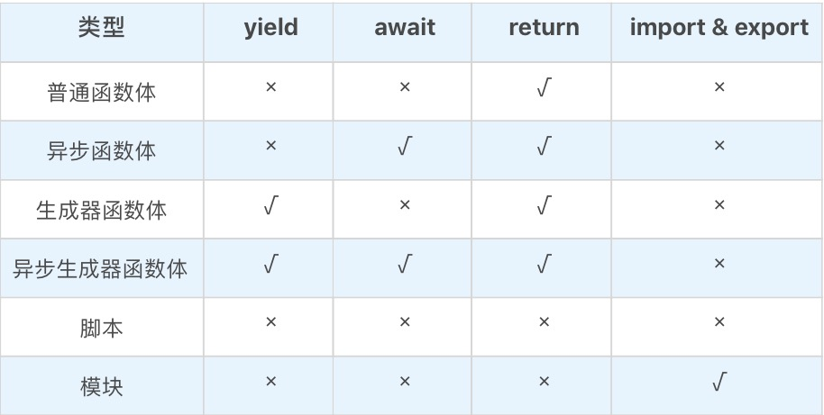

# 重学JavaScript

## 1. 数据类型

JavaScript 语言规定了七种语言类型。语言类型广泛用于变量、函数参数、表达式、函数返回值等场合。根据最新的语言标准，这 7 种语言类型是：

- Undefined；
- Null；

- Boolean；
- String；

- Number；
- Symbol；

- Object。

### （1）Undefined

Undefined 类型表示未定义，它的类型只有一个值，就是 undefined。可以通过下面几种方式来得到 undefined：

- 引用已声明但未初始化的变量；
- 引用未定义的对象属性；

- 执行无返回值函数；
- 执行 void 表达式；

- 全局常量 window.undefined 或 undefined。


对应代码如下：

```javascript
var a; // undefined
var o = {}
o.b // undefined
(() => {})() // undefined
void 0 // undefined
window.undefined // undefined
```

其中比较推荐通过 void 表达式来得到 undefined 值，因为这种方式既简便（window.undefined 或 undefined 常量的字符长度都大于 "void 0" 表达式）又不需要引用额外的变量和属性；同时它作为表达式还可以配合三目运算符使用，代表不执行任何操作。


如下面的代码就表示满足条件 x 大于 0 且小于 5 的时候执行函数 fn，否则不进行任何操作：

```javascript
x>0 && x<5 ? fn() : void 0;
```

如何判断一个变量的值是否为 undefined 呢？我们可以通过 typeof 关键字获取变量 x 的类型，然后与 'undefined' 字符串做**真值比较：**

```javascript
if(typeof x === 'undefined') {
  ...
}
```

### （2）null

Null 数据类型和 Undefined 类似，只有唯一的一个值 null，都可以表示空值，甚至通过 “==” 来比较它们是否相等的时候得到的结果都是 true，但 null 是 JavaScript 保留关键字，而 undefined 只是一个常量。也就是说可以声明名称为 undefined 的变量（虽然只能在老版本的 IE 浏览器中给它重新赋值），但将 null 作为变量使用时则会报错。

### （3）Boolean

Boolean 数据类型只有两个值：true 和 false，分别代表真和假，理解和使用起来并不复杂。但是我们常常会将各种表达式和变量转换成 Boolean 数据类型来当作判断条件，这时候就要注意了。


下面是一个简单地将星期数转换成中文的函数，比如输入数字 1，函数就会返回“星期一”，输入数字 2 会返回“星期二”，以此类推，如果未输入数字则返回 undefined：

```javascript
function getWeek(week) {
  const dict = ['日', '一', '二', '三', '四', '五', '六'];
  if(week) return `星期${dict[week]}`;
}
```

这里在 if 语句中就进行了类型转换，将 week 变量转换成 Boolean 数据类型，而 0、空字符串、null、undefined 在转换时都会返回 false。所以这段代码在输入 0 的时候不会返回“星期日”，而返回 undefined。在做强制类型转换的时候一定要考虑这个问题。

### （4）String

String 用于表示文本数据，String 有最大长度是 253 - 1，这个所谓最大长度并不是指字符数，而是字符串的 UTF16 编码。字符串的操作 charAt、charCodeAt、length 等方法针对的都是 UTF16 编码。所以，字符串的最大长度，实际上是受字符串的编码长度影响的。


JavaScript 中的字符串是**永远无法变更**的，一旦字符串构造出来，无法用任何方式改变字符串的内容，所以字符串具有值类型的特征。JavaScript 字符串把每个 UTF16 单元当作一个字符来处理，所以处理非 BMP（超出 U+0000 - U+FFFF 范围）的字符时，应该格外小心。这样设计是为了“**性能和尽可能实现起来简单**”。现实中很少用到 BMP 之外的字符。

### （5）Number

Number 类型表示通常意义上的“数字”。这个数字大致对应数学中的有理数，当然，在计算机中，数字有一定的精度限制。


JavaScript 中的 Number 类型有 18437736874454810627(即 264-253+3) 个值。JavaScript 中的 Number 类型基本符合 IEEE 754-2008 规定的双精度浮点数规则，但是 JavaScript 为了表达几个额外的语言场景（比如不让除以 0 出错，而引入了无穷大的概念），规定了几个例外情况：

- **NaN**，占用了 9007199254740990，这原本是符合 IEEE 规则的数字，通常在计算失败的时候会得到该值。要判断一个变量是否为 NaN，则可以通过 Number.isNaN 函数进行判断。
- **Infinity**，无穷大，在某些场景下比较有用，比如通过数值来表示权重或者优先级，Infinity 可以表示最高优先级或最大权重。

- **-Infinity**，负无穷大。


JavaScript 中有 `+0` 和 `-0` 的概念，在加法类运算中它们没有区别，但是除法的场合则需要特别留意区分，“忘记检测除以 -0，而得到负无穷大”的情况经常会导致错误，而区分 +0 和 -0 的方式，正是检测 1/x 是 Infinity 还是 -Infinity。


根据双精度浮点数的定义，Number 类型中有效的整数范围是 `-0x1fffffffffffff` 至 `0x1fffffffffffff`，所以 Number 无法精确表示此范围外的整数。同样根据浮点数的定义，非整数的 Number 类型无法用 `==` 或者 `===` 来比较，这也就是在 JavaScript 中为什么 `0.1+0.2 !== 0.3`。实际上，这里错误的不是结果，而是比较的方法，正确的比较方法是使用 JavaScript 提供的最小精度值，检查等式左右两边差的绝对值是否小于最小精度，才是正确的比较浮点数的方法：

```javascript
console.log( Math.abs(0.1 + 0.2 - 0.3) <= Number.EPSILON);  // true
```

### （6）Symbol

Symbol 是 ES6 中引入的新数据类型，它表示一个唯一的常量，通过 Symbol 函数来创建对应的数据类型，创建时可以添加变量描述，该变量描述在传入时会被强行转换成字符串进行存储：

```javascript
var a = Symbol('1')
var b = Symbol(1)
a.description === b.description // true
var c = Symbol({id: 1})
c.description // [object Object]
var _a = Symbol('1')
_a == a // false
```

基于上面的特性，Symbol 属性类型比较适合用于两类场景中：**常量值和对象属性**。

**避免常量值重复**

假设有个 getValue 函数，根据传入的字符串参数 key 执行对应代码逻辑：

```javascript
function getValue(key) {
  switch(key){
    case 'A':
      ...
    ...
    case 'B':
      ...
  }
}
getValue('B');
```

这段代码对调用者而言非常不友好，因为代码中使用了魔术字符串（魔术字符串是指在代码之中多次出现、与代码形成强耦合的某一个具体的字符串或者数值），导致调用 getValue 函数时需要查看函数源码才能找到参数 key 的可选值。所以可以将参数 key 的值以常量的方式声明出来。

```javascript
const KEY = {
  alibaba: 'A',
  baidu: 'B',
  ...
}
function getValue(key) {
  switch(key){
    case KEY.alibaba:
      ...
    ...
    case KEY.baidu:
      ...
  }
}
getValue(KEY.baidu);
```

但这样也并非完美，假设现在我们要在 KEY 常量中加入一个 key，根据对应的规则，很有可能会出现值重复的情况：

```javascript
const KEY = {
  alibaba: 'A',
  baidu: 'B',
  ...
  bytedance: 'B'
}
```

这显然会出现问题：

```javascript
getValue(KEY.baidu) // 等同于 getValue(KEY.bytedance)
```

所以在这种场景下更适合使用 Symbol，我们不关心值本身，只关心值的唯一性。

```javascript
const KEY = {
  alibaba: Symbol(),
  baidu: Symbol(),
  ...
  bytedance: Symbol()
}
```

#### 避免对象属性覆盖

假设有这样一个函数 fn，需要对传入的对象参数添加一个临时属性 user，但可能该对象参数中已经有这个属性了，如果直接赋值就会覆盖之前的值。此时就可以使用 Symbol 来避免这个问题。创建一个 Symbol 数据类型的变量，然后将该变量作为对象参数的属性进行赋值和读取，这样就能避免覆盖的情况：

```javascript
function fn(o) { // {user: {id: xx, name: yy}}
  const s = Symbol()
  o[s] = 'zzz'
  ...
}
```

### （7）Object

Object 是 JavaScript 中最复杂的类型，也是 JavaScript 的核心机制之一。Object 表示对象的意思，它是一切有形和无形物体的总称。在 JavaScript 中，对象的定义是“属性的集合”。属性分为数据属性和访问器属性，二者都是 key-value 结构，key 可以是字符串或者 Symbol 类型。


提到对象，必须要提到一个概念：类。JavaScript 中的“类”仅仅是运行时对象的一个私有属性，而 JavaScript 中是无法自定义类型的。JavaScript 中的几个基本类型，都在对象类型中有一个“亲戚”。它们是：

- Number；
- String；

- Boolean；
- Symbol。


所以，3 与 new Number(3) 是完全不同的值，它们一个是 Number 类型， 一个是对象类型。Number、String 和 Boolean，这三个构造器是两用的：当跟 new 搭配时，它们产生对象；当直接调用时，它们表示强制类型转换。Symbol 函数比较特殊，直接用 new 调用它会抛出错误，但它仍然是 Symbol 对象的构造器。

### （8）StringToNumber

Number 和 String 之间的相互转换应该是所有转化的中最为复杂的，下面就来看一下他们之间的转换规则。


字符串到数字的类型转换，存在一个语法结构，类型转换支持十进制、二进制、八进制和十六进制，比如：

- 30；
- 0b111；

- 0o13；
- 0xFF。


此外，JavaScript 支持的字符串语法还包括正负号科学计数法，可以使用大写或者小写的 e 来表示：

- 1e3；
- -1e-2。


需要注意，parseInt 和 parseFloat 并不使用这个转换，所以支持的语法跟这里不尽相同。

- 在不传入第二个参数的情况下，parseInt 只支持 16 进制前缀“0x”，而且会忽略非数字字符，也不支持科学计数法。所以在任何环境下，都建议传入 parseInt 的第二个参数，
- parseFloat 则直接把原字符串作为十进制来解析，它不会引入任何的其他进制。


所以多数情况下，Number 是比 parseInt 和 parseFloat 更好的选择。

### （9）装箱转换

每一种基本类型 Number、String、Boolean、Symbol 在对象中都有对应的类，**所谓装箱转换，就是把基本类型转换为对应的对象**，它是类型转换中一种相当重要的种类。


全局的 Symbol 函数无法使用 new 来调用，但仍可以利用装箱机制来得到一个 Symbol 对象，可以利用一个函数的 call 方法来强迫产生装箱。定义一个函数，函数里面只有 `return this`，然后调用函数的 call 方法到一个 Symbol 类型的值上，这样就会产生一个 `symbolObject`：

```javascript
    let symbolObject = (function(){ return this }).call(Symbol("a"));

    console.log(typeof symbolObject); //object
    console.log(symbolObject instanceof Symbol); //true
    console.log(symbolObject.constructor == Symbol); //true
```

使用 `console.log` 看一下这个东西的 type of，它的值是 object，使用 symbolObject instanceof 可以看到，它是 Symbol 这个类的实例，我们找它的 constructor 也是等于 Symbol 的，所以无论从哪个角度看，它都是 Symbol 装箱过的对象。**装箱机制会频繁产生临时对象，在一些对性能要求较高的场景下，应该尽量避免对基本类型做装箱转换。**


可以使用JavaScript中内置的 Object 函数显式调用装箱能力。每一类装箱对象皆有私有的 Class 属性，这些属性可以用 `Object.prototype.toString` 获取：  

```javascript
var symbolObject = Object(Symbol("a"));

console.log(typeof symbolObject); //object
console.log(symbolObject instanceof Symbol); //true
console.log(symbolObject.constructor == Symbol); //true

console.log(Object.prototype.toString.call(symbolObject)); //[object Symbol]
```

在 JavaScript 中，没有任何方法可以更改私有的 Class 属性，因此 `Object.prototype.toString` 是可以准确识别对象对应的基本类型的方法，它比 `instanceof` 更加准确。但需要注意的是，call 本身会产生装箱操作，所以需要配合 typeof 来区分基本类型还是对象类型。

### （10）封箱转换

在 JavaScript 标准中，规定了 ToPrimitive 函数，它是对象类型到基本类型的转换（即拆箱转换）。


对象到 String 和 Number 的转换都遵循“先拆箱再转换”的规则。通过拆箱转换，把对象变成基本类型，再从基本类型转换为对应的 String 或者 Number。拆箱转换会尝试调用 valueOf 和 toString 来获得拆箱后的基本类型。如果 valueOf 和 toString 都不存在，或者没有返回基本类型，则会产生类型错误 TypeError：

```javascript
    let obj = {
        valueOf : () => {console.log("valueOf"); return {}},
        toString : () => {console.log("toString"); return {}}
    }

    obj * 2
    // valueOf
    // toString
    // Uncaught TypeError: Cannot convert object to primitive value
```

这里定义了一个对象 obj，obj 有 valueOf 和 toString 两个方法，这两个方法都返回一个对象，然后进行 `obj*2` 这个运算时，先执行了 valueOf，接下来是 toString，最后抛出了一个 TypeError，这就说明了这个拆箱转换失败了。到 String 的拆箱转换会优先调用 toString。把刚才的运算从 obj*2 换成 String(obj)，调用顺序就变了：

```javascript
    let obj = {
        valueOf : () => {console.log("valueOf"); return {}},
        toString : () => {console.log("toString"); return {}}
    }

   String(obj)
    // toString
    // valueOf
    // Uncaught TypeError: Cannot convert object to primitive value
```

## 2. 面向对象

### （1）对象特征

对象有如下三个特点：

- **对象具有唯一标识性**：即使完全相同的两个对象，也并非同一个对象。对象唯一标识性都是用内存地址来体现的，对象具有唯一标识的内存地址，所以具有唯一的标识。所以，即使两个长得一模一样的对象，都是不相等的。
- **对象有状态**：对象具有状态，同一对象可能处于不同状态之下。

- **对象具有行为**：即对象的状态，可能因为它的行为产生变迁。


在 JavaScript 中，将状态和行为统一抽象为“属性”，考虑到 JavaScript 中将函数设计成一种特殊对象，所以 JavaScript 中的行为和状态都能用属性来抽象。下面是普通属性和函数作为属性的例子，其中 o 是对象，d 是一个属性，而函数 f 也是一个属性，尽管写法不太相同，但是对 JavaScript 来说，d 和 f 就是两个普通属性：

```javascript
let o = { 
  d: 1,
  f() {
    console.log(this.d);
  }    
};
```

所以，在 JavaScript 中，对象的状态和行为其实都被抽象为了属性。二者都很好地表现了对象的基本特征：标识性、状态和行为。


在实现了对象基本特征的基础上, JavaScript 中对象独有的特色是：**对象具有高度的动态性，这是因为 JavaScript 赋予了使用者在运行时为对象添改状态和行为的能力**。举个例子，JavaScript 允许运行时向对象添加属性，这就跟绝大多数基于类的、静态的对象设计完全不同。下面例子在运行时如何向一个对象添加属性，定义了一个对象 o，定义完成之后，再添加它的属性 b，这样操作是完全没问题的：

```javascript
let o = { a: 1 };
o.b = 2;
console.log(o.a, o.b); //1 2
```

### （2）对象属性

为了提高抽象能力，JavaScript 提供了**数据属性**和**访问器属性（getter/setter）**两类。


第一类属性，数据属性，它具有四个特征。

- value：属性的值。
- writable：决定属性能否被赋值。

- enumerable：决定 for in 能否枚举该属性。
- configurable：决定该属性能否被删除或者改变特征值。

在大多数情况下，我们只关心数据属性的值。通常用于定义属性的代码会产生数据属性，其中的 writable、enumerable、configurable 都默认为 true。可以使用内置函数 `getOwnPropertyDescriptor` 来查看：

```javascript
let o = { a: 1 };
o.b = 2;

//a和b都是数据属性
Object.getOwnPropertyDescriptor(o,"a") // {value: 1, writable: true, enumerable: true, configurable: true}
Object.getOwnPropertyDescriptor(o,"b") // {value: 2, writable: true, enumerable: true, configurable: true}
```

如果要想改变属性的特征，或者定义访问器属性，可以使用 Object.defineProperty：

```javascript
let o = { a: 1 };
Object.defineProperty(o, "b", {value: 2, writable: false, enumerable: false, configurable: true});

//a和b都是数据属性，特征值发生变化
Object.getOwnPropertyDescriptor(o,"a"); // {value: 1, writable: true, enumerable: true, configurable: true}
Object.getOwnPropertyDescriptor(o,"b"); // {value: 2, writable: false, enumerable: false, configurable: true}
o.b = 3;
console.log(o.b); // 2
```

第二类属性，访问器（getter/setter）属性，它具有四个特征：

- getter：函数或 undefined，在取属性值时被调用。
- setter：函数或 undefined，在设置属性值时被调用。

- enumerable：决定 for in 能否枚举该属性。
- configurable：决定该属性能否被删除或者改变特征值。


访问器属性使得属性在读和写时执行代码，它允许使用者在写和读属性时，得到完全不同的值，它可以视为一种函数的语法糖。在创建对象时，可以使用 get 和 set 关键字来创建访问器属性。访问器属性跟数据属性不同，每次访问属性都会执行 getter 或者 setter 函数：

```javascript
let obj = { get a() { return 1 } };

console.log(obj.a); // 1
```

所以，JavaScript 对象的运行时就是一个“属性的集合”，属性以字符串或者 Symbol 为 key，以数据属性特征值或者访问器属性特征值为 value。对象是一个属性的索引结构（索引结构是一类常见的数据结构，可以理解为能够以比较快的速度用 key 来查找 value 的字典）。

### （3）原型与类

在不同的编程语言中，设计者利用各种不同的语言特性来抽象描述对象。主要分为**基于类的编程语言**和**基于原型的编程语言。**

- **基于类的编程**提倡使用一个关注分类和类之间关系开发模型。在这类语言中，总是先有类，再从类去实例化一个对象。类与类之间又可能会形成继承、组合等关系。类又往往与语言的类型系统整合，形成一定编译时的能力。
- **基于原型的编程**看起来更为提倡去关注一系列对象实例的行为，然后才去关心如何将这些对象划分到最近的使用方式相似的原型对象，而不是将它们分成类。基于原型的面向对象系统通过“复制”的方式来创建新对象。JavaScript 就是基于原型的编程语言。


 JavaScript的原型系统可以概括为以下两点（先抛开 new、Function Object、函数的 prototype 属性不说）：

- 如果所有对象都有私有字段[[prototype]]，就是对象的原型；
- 读一个属性，如果对象本身没有，则会继续访问对象的原型，直到原型为空或者找到为止。


从 ES6 以来，JavaScript 提供了一系列内置函数，以便更为直接地访问操纵原型，三个方法为：

- Object.create 根据指定的原型创建新对象，原型可以是 null；
- Object.getPrototypeOf 获得一个对象的原型；

- Object.setPrototypeOf 设置一个对象的原型。


ES6 中加入了新特性 class，new 跟 function 搭配的怪异行为终于可以退休，在任何场景，建议使用 ES6 的语法来定义类，而令 function 回归原本的函数语义。


ES6 中引入了 class 关键字，类的概念正式从属性升级成语言的基础设施，从此，基于类的编程方式成为了 JavaScript 的官方编程范式。类的基本写法如下：

```javascript
class Rectangle {
  constructor(height, width) {
    this.height = height;
    this.width = width;
  }
  // Getter
  get area() {
    return this.calcArea();
  }
  // Method
  calcArea() {
    return this.height * this.width;
  }
}
```

在现有的类语法中，getter/setter 和 method 是兼容性最好的。通过 get/set 关键字来创建 getter，通过括号和大括号来创建方法，数据型成员最好写在构造器里面。类的写法实际上也是由原型运行时来承载的，逻辑上 JavaScript 认为每个类是有共同原型的一组对象，类中定义的方法和属性则会被写在原型对象之上。此外，最重要的是，类提供了继承的能力：

```javascript
class Animal { 
  constructor(name) {
    this.name = name;
  }
  
  speak() {
    console.log(this.name + ' makes a noise.');
  }
}

class Dog extends Animal {
  constructor(name) {
    super(name); // call the super class constructor and pass in the name parameter
  }

  speak() {
    console.log(this.name + ' barks.');
  }
}

let d = new Dog('Mitzie');
d.speak(); // Mitzie barks.
```

以上代码创造了 Animal 类，并且通过 extends 关键字让 Dog 继承了它，展示了最终调用子类的 speak 方法获取了父类的 name。


当我们使用类的思想来设计代码时，应该尽量使用 class 来声明类，而不是用旧语法，拿函数来模拟对象。

### （4）对象分类

JavaScript中的对象可以分成几类：

**1）宿主对象**（host Objects）：由 JavaScript 宿主环境提供的对象，它们的行为完全由宿主环境决定。

**2）内置对象**（Built-in Objects）：由 JavaScript 语言提供的对象，主要包括以下三类：

- 固有对象（Intrinsic Objects ）：由标准规定，随着 JavaScript 运行时创建而自动创建的对象实例。
- 原生对象（Native Objects）：可以由用户通过 Array、RegExp 等内置构造器或者特殊语法创建的对象。

- 普通对象（Ordinary Objects）：由{}语法、Object 构造器或者 class 关键字定义类创建的对象，它能够被原型继承。


**宿主对象：**

所谓的宿主，简单来说就是代码的运行环境，前端最熟悉的就是浏览器环境中的宿主了。在浏览器环境中，全局对象是 window，window 上又有很多属性，如 document。实际上，这个全局对象 window 上的属性，一部分来自 JavaScript 语言，一部分来自浏览器环境。JavaScript 标准中规定了全局对象属性，W3C 的各种标准中规定了 Window 对象的其它属性。


宿主对象分为固有的和用户可创建的两种，比如 document.createElement 就可以创建一些 DOM 对象。宿主也会提供一些构造器，比如可以使用 new Image 来创建 img 元素，


**内置对象：**

（1）固有对象

固有对象是由标准规定，随着 JavaScript 运行时创建而自动创建的对象实例。固有对象在任何 JavaScript 代码执行前就已经被创建出来了，它们通常扮演者类似基础库的角色。“类”其实就是固有对象的一种。


（2）原生对象

JavaScript 中能够通过语言本身的构造器创建的对象称作原生对象。在 JavaScript 标准中，提供了 30 多个构造器。按照不同应用场景，可以将原生对象分成了以下几个种类：



通过这些构造器，可以用 new 运算创建新的对象，所以把这些对象称作原生对象。几乎所有这些构造器的能力都是无法用纯 JavaScript 代码实现的，它们也无法用 class/extend 语法来继承。


这些构造器创建的对象多数使用了私有字段, 例如：

- Error: [[ErrorData]]
- Boolean: [[BooleanData]]

- Number: [[NumberData]]
- Date: [[DateValue]]

- RegExp: [[RegExpMatcher]]
- Symbol: [[SymbolData]]

- Map: [[MapData]]


这些字段使得原型继承方法无法正常工作，所以，可以认为所有这些原生对象都是为了特定能力或者性能，而设计出来的“特权对象”。


除了上面说的对象之外，在固有对象和原生对象中，有一些对象的行为跟正常对象有很大区别。它们常见的下标运算（就是使用中括号或者点来做属性访问）或者设置原型跟普通对象不同，主要有以下几种：

- Array：Array 的 length 属性根据最大的下标自动发生变化。
- Object.prototype：作为所有正常对象的默认原型，不能再给它设置原型了。

- String：为了支持下标运算，String 的正整数属性访问会去字符串里查找。
- Arguments：arguments 的非负整数型下标属性跟对应的变量联动。

- 模块的 namespace 对象：特殊的地方非常多，跟一般对象完全不一样，尽量只用于 import 。
- 类型数组和数组缓冲区：跟内存块相关联，下标运算比较特殊。

- bind 后的 function：跟原来的函数相关联。

## 3. JavaScript 语法

### （1）脚本和模块

JavaScript 有两种源文件，一种叫做脚本，一种叫做模块。这个区分是在 ES6 引入了模块机制开始的，在 ES5 和之前的版本中，就只有一种源文件类型：脚本。

- 脚本是可以由浏览器或者 node 环境引入执行的。脚本是具有主动性的 JavaScript 代码段，是控制宿主完成一定任务的代码；
- 模块只能由 JavaScript 代码用 import 引入执行。模块是具有被动性的 JavaScript 代码段，是等待被调用的库。


实际上模块和脚本之间的区别仅仅在于是否包含 import 和 export。脚本是一种兼容之前的版本的定义，在这个模式下，没有 import 就不需要处理加载“.js”文件问题。现代浏览器可以支持用 script 标签引入模块或者脚本，如果要引入模块，必须给 script 标签添加 `type="module"`。如果引入脚本，则不需要 type：

```javascript
<script type="module" src="xxxxx.js"></script>
```

所以，script 标签如果不加 `type="module"`，默认认为加载的文件是脚本而非模块。


脚本中可以包含语句，而模块中可以包含三种内容：import 声明，export 声明和语句：




#### ① import声明

import 声明有两种用法，一个是直接 import 一个模块，另一个是带 from 的 import，它能引入模块里的一些信息：

```javascript
import "mod";         // 引入一个模块
import v from "mod";  // 把模块默认的导出值放入变量v
```

直接 import 一个模块，只是保证了这个模块代码被执行，引用它的模块是无法获得它的任何信息的。带 from 的 import 意思是引入模块中的一部分信息，可以把它们变成本地的变量。


带 from 的 import 细分又有三种用法，我们可以分别看下例子：

- `import x from "./a.js";` 引入模块中导出的默认值。
- `import {a as x, modify} from "./a.js";` 引入模块中的变量。

- `import * as x from "./a.js";` 把模块中所有的变量以类似对象属性的方式引入。


第一种方式还可以跟后两种组合使用:

```javascript
import d, {a as x, modify} from "./a.js"
import d, * as x from "./a.js"
```

语法要求不带 as 的默认值永远在最前。注意，这里的变量实际上仍然可以受到原来模块的控制。


来看一个例子，假设有两个模块 a 和 b。在模块 a 中声明了变量和一个修改变量的函数，并且把它们导出。用 b 模块导入了变量和修改变量的函数。

```javascript
// 模块 a：
export var a = 1;

export function modify(){
    a = 2;
}

// 模块 b：
import {a, modify} from "./a.js";

console.log(a);

modify();

console.log(a);
```

当调用修改变量的函数后，b 模块变量也跟着发生了改变。这说明导入与一般的赋值不同，导入后的变量只是改变了名字，它仍然与原来的变量是同一个。

#### ② export声明

export 声明与 import 相对，主要承担的是导出的任务。模块中导出变量的方式有两种，一种是独立使用 export 声明，另一种是直接在声明型语句前添加 export 关键字。


独立使用 export 声明就是一个 export 关键字加上变量名列表：

```javascript
export {a, b, c};
```

我们也可以直接在声明型语句前添加 export 关键字，这里的 export 可以加在任何声明性质的语句之前：

- var
- function (含 async 和 generator)

- class
- let

- const
- export 


还有一种特殊的用法，就是跟 default 联合使用。export default 表示导出一个默认变量值，它可以用于 function 和 class。这里导出的变量是没有名称的，可以使用 `import x from "./a.js"` 这样的语法，在模块中引入。


export default 还支持一种语法，后面跟一个表达式：

```javascript
var a = {};
export default a;
```

但是，这里的行为跟导出变量是不一致的，这里导出的是值，导出的就是普通变量 a 的值，以后 a 的变化与导出的值就无关了，修改变量 a，不会使得其他模块中引入的 default 值发生改变。


在 import 语句前无法加入 export，但是可以直接使用 export from 语法：

```javascript
export a from "a.js"
```

### （2）函数体

JavaScript 引擎除了执行脚本和模块之外，还可以执行函数。而函数体跟脚本和模块有一定的相似之处。执行函数的行为通常是在 JavaScript 代码执行时，注册宿主环境的某些事件触发的，而执行的过程，就是执行函数体（函数的花括号中间的部分）。


函数体实际上有四种：

- 普通函数体：

```javascript
function foo(){
    //Function body
}
```

- 异步函数体：

```javascript
async function foo(){
    //Function body
}
```

- 生成器函数体：

```javascript
function *foo(){
    //Function body
}
```

- 异步生成器函数体：

```javascript
async function *foo(){
    //Function body
}
```

这四种函数体的区别在于：**能否使用 await 或者 yield 语句：**



### （3）全局机制

JavaScript 语法有两个全局机制：**预处理**和**指令序言**。

#### ① 预处理

JavaScript 执行前，会对脚本、模块和函数体中的语句进行预处理。预处理过程将会提前处理 var、函数声明、class、const 和 let 这些语句，以确定其中变量的意义。


**（1）var声明**

var 声明永远作用于脚本、模块和函数体这个级别，在预处理阶段，不关心赋值的部分，只管在当前作用域声明这个变量。

```javascript
var a = 1;

function foo() {
    console.log(a);
    var a = 2;
}

foo(); // undefined
```

这段代码声明了一个脚本级别的 a，又声明了 foo 函数体级别的 a，函数体级的var出现在 `console.log` 语句之后。预处理过程在执行之前，所以有函数体级的变量 a，就不会去访问外层作用域中的变量 a 了，而函数体级的变量 a 此时还没有赋值，所以是 undefined。


再来看一个情况：

```javascript
var a = 1;

function foo() {
    console.log(a);
    if(false) {
        var a = 2;
    }
}

foo(); // undefined
```

这段代码比上一段代码在`var a = 2`之外多了一段 if，`if(false)` 中的代码永远不会被执行，但是预处理阶段并不管这个，var 的作用能够穿透一切语句结构，它只认脚本、模块和函数体三种语法结构。所以这里结果跟前一段代码完全一样，会得到 undefined。


在ES6之前没有 let 和 const，只能用 var，又因为 var 除了脚本和函数体都会穿透，就出现了“立即执行的函数表达式（IIFE）”这一用法，用来产生作用域：

```javascript
for(var i = 0; i < 20; i ++) {
    void function(i){
        var div = document.createElement("div");
        div.innerHTML = i;
        div.onclick = function(){
            console.log(i);
        }
        document.body.appendChild(div);
    }(i);
}
```

这里为文档添加了 20 个 div 元素，并且绑定了点击事件，打印它们的序号。通过 IIFE 在循环内构造了作用域，每次循环都产生一个新的环境记录，这样，每个 div 都能访问到环境中的 i。


如果不用 IIFE：

```javascript
for(var i = 0; i < 20; i ++) {
    var div = document.createElement("div");
    div.innerHTML = i;
    div.onclick = function(){
        console.log(i);
    }
    document.body.appendChild(div);
}
```

这段代码的结果将会是点每个 div 都打印 20，因为全局只有一个 i，执行完循环后，i 变成了 20。


**（2）****function 声明**

在全局（脚本、模块和函数体），function 声明表现跟 var 相似，不同之处在于，function 声明不但在作用域中加入变量，还会给它赋值。来看一个 function 声明的例子：

```javascript
console.log(foo);  // ƒ foo(){}
function foo(){}  
```

这里声明了函数 foo，在声明之前，用 console.log 打印函数 foo，此时已经是函数 foo 的值了。


function 声明出现在 if 等语句中的情况有点复杂，它仍然作用于脚本、模块和函数体级别，在预处理阶段，仍然会产生变量，它不再被提前赋值：

```javascript
console.log(foo);  // undefined
if(true) {
    function foo(){

    }
}
```

这段代码得到 undefined。如果没有函数声明，则会抛出错误。这说明 function 在预处理阶段仍然发生了作用，在作用域中产生了变量，没有产生赋值，赋值行为发生在了执行阶段。出现在 if 等语句中的 function，在 if 创建的作用域中仍然会被提前，产生赋值效果。


**（3****）class 声明**

在 class 声明之前使用 class 名，会抛错：

```javascript
console.log(c);  // Uncaught ReferenceError: c is not defined
class c {}
```

再看个复杂一点的例子：

```javascript
var c = 1;
function foo(){
    console.log(c);
    class c {}
}
foo();   // Uncaught ReferenceError: Cannot access 'c' before initialization
```

执行后，仍然抛出了错误，如果去掉 class 声明，则会正常打印出 1，出现在后面的 class 声明影响了前面语句的结果。这说明，class 声明也是会被预处理的，它会在作用域中创建变量，并且要求访问它时抛出错误。class 的声明作用不会穿透 if 等语句结构，所以只有写在全局环境才会有声明作用。


这样的 class 设计比 function 和 var 更符合直觉，而且在遇到一些比较奇怪的用法时，倾向于抛出错误。按照现代语言设计的评价标准，及早抛错是好事，它能够帮助我们尽量在开发阶段就发现代码的可能问题。

#### ② 指令序言

脚本和模块都支持一种特别的语法，叫做指令序言（Directive Prologs）。这里的指令序言最早是为了 use strict 设计的，它规定了一种给 JavaScript 代码添加元信息的方式：

```javascript
"use strict";
function f(){
    console.log(this);
};
f.call(null);
```

这段代码展示了严格模式的用法，我这里定义了函数 f，f 中打印 this 值，然后用 call 的方法调用 f，传入 null 作为 this 值，可以看到最终结果是 null 原封不动地被当做 this 值打印了出来，这是严格模式的特征。如果去掉严格模式的指令需要，打印的结果将会变成 global。


"use strict"是 JavaScript 标准中规定的唯一一种指令序言，但是设计指令序言的目的是，留给 JavaScript 的引擎和实现者一些统一的表达方式，在静态扫描时指定 JavaScript 代码的一些特性。


JavaScript 的指令序言是只有一个字符串直接量的表达式语句，它只能出现在脚本、模块和函数体的最前面。来看两个例子：

```javascript
// 例1
function doSth(){
    //......
}
"use strict";
var a = 1;
//......

// 例2
'use strict';
function doSth(){
    //......
}
var a = 1;
//......
```

第一个例子中，"use strict"没有出现在最前，所以不是指令序言。第二个例子中，`'use strict'` 是单引号，但它仍是指令序言。

## 4. JavaScript 函数

JavaScript 中的函数相对于数据类型而言更加复杂，它可以有属性，也可以被赋值给一个变量，还可以作为参数被传递......正是这些强大特性让它成了 JavaScript 的“一等公民”。下面就来看一下函数中的重要特性。

### （1）this

this 是 JavaScript 的一个关键字，一般指向调用它的对象。


这句话其实有两层意思，首先 this 指向的应该是一个对象，更具体地说是函数执行的“上下文对象”。其次这个对象指向的是“调用它”的对象，如果调用它的不是对象或对象不存在，则会指向全局对象（严格模式下为 undefined）。


下面来看几个this相关的例子：

- 代码 1 执行 fn() 函数时，实际上就是通过对象 o 来调用的，所以 this 指向对象 o。
- 代码 2 通过实例 a 来调用，this 指向类实例 a。

- 代码 3 可以看成是通过全局对象来调用，this 会指向全局对象（需要注意的是，严格模式下会是 undefined）。

```javascript
// 代码 1
var o = {
  fn() {
    console.log(this)
  }
}
o.fn() // o

// 代码 2
class A {
  fn() {
    console.log(this)
  }
}
var a = new A() 
a.fn()// a

// 代码 3
function fn() {
  console.log(this)
}
fn() // 浏览器：Window；   Node.js：global
```

**（1）如果在函数 fn2() 中调用函数 fn()，那么当调用函数 fn2() 的时候，函数 fn() 的 this 指向哪里呢？**

```javascript
function fn() {console.log(this)}
function fn2() {fn()}
fn2() // ?
```

由于没有找到调用 fn 的对象，所以 this 会指向全局对象，答案就是 window（Node.js 下是 global）。


**（2）再把这段代码修改一下，让函数 fn2() 作为对象 obj 的属性，通过 obj 属性来调用 fn2，此时函数 fn() 的 this 指向哪里呢？**

```javascript
function fn() {console.log(this)}
function fn2() {fn()}
var obj = {fn2}
obj.fn2() // ?
```

这里需要注意，调用函数 fn() 的是函数 fn2() 而不是 obj。虽然 fn2() 作为 obj 的属性调用，但 fn2()中的 this 指向并不会传递给函数 fn()， 所以答案也是 window（Node.js 下是 global）。


**（3）对象 dx 拥有数组属性 arr，在属性 arr 的 forEach 回调函数中输出 this，指向的是什么呢？**

```javascript
var dx = {
  arr: [1]
}
dx.arr.forEach(function() {console.log(this)}) // ?
```

这里输出的仍然是全局对象。


forEach 方法有两个参数，第一个是回调函数，第二个是 this 指向的对象，这里只传入了回调函数，第二个参数没有传入，默认为 undefined，所以正确答案应该是输出全局对象。


类似的，需要传入 this 指向的函数还有：every()、find()、findIndex()、map()、some()，在使用的时候需要特别注意。


**（4）前面提到通过类实例来调用函数时，this 会指向实例。那么如果像下面的代码，创建一个 fun 变量来引用实例 b 的 fn() 函数，当调用 fun() 的时候 this 会指向什么呢？**

```javascript
class B {
  fn() {
    console.log(this)
  }
}
var b = new B()
var fun = b.fn
fun() // ?
```

这里有个隐藏的知识点。那就是 ES6 下的 class 内部默认采用的是严格模式，实际上面代码的类定义部分可以理解为下面的形式：

```javascript
class B {
  'use strict';
  fn() {
    console.log(this)
  }
}
```

而严格模式下不会指定全局对象为默认调用对象，所以答案是 undefined。


**（5）ES6 新加入的箭头函数不会创建自己的 this，它只会从自己的作用域链的上一层继承 this。可以简单地理解为箭头函数的 this 继承自上层的 this，但在全局环境下定义仍会指向全局对象。**

```javascript
var arrow = {fn: () => {
  console.log(this)
}}
arrow.fn() // ?
```

所以虽然通过对象 arrow 来调用箭头函数 fn()，那么 this 指向不是 arrow 对象，而是全局对象。如果要让 fn() 箭头函数指向 arrow 对象，我们还需要再加一层函数，让箭头函数的上层 this 指向 arrow 对象。

```javascript
var arrow = {
  fn() {
    const a = () => console.log(this)
    a()
  }
}
arrow.fn()  // arrow
```

**（6）前面提到 this 指向的要么是调用它的对象，要么是 undefined，那么如果将 this 指向一个基础类型的数据会发生什么呢？**


比如下面的代码将 this 指向数字 0，打印出的 this 是什么呢？


复制代码

[0].forEach(function() {console.log(this)}, 0) // ?

结合上一讲关于数据类型的知识，我们知道基础类型也可以转换成对应的引用对象。所以这里 this 指向的是一个值为 0 的 Number 类型对象。


**（7）改变 this 指向的常见 3 种方式有 bind、call 和 apply。**

call 和 apply 用法功能基本类似，都是通过传入 this 指向的对象以及参数来调用函数。区别在于传参方式，前者为逐个参数传递，后者将参数放入一个数组，以数组的形式传递。bind 有些特殊，它不但可以绑定 this 指向也可以绑定函数参数并返回一个新的函数，当 c 调用新的函数时，绑定之后的 this 或参数将无法再被改变。

```javascript
function getName() {console.log(this.name)}
var b = getName.bind({name: 'bind'})
b()
getName.call({name: 'call'})
getName.apply({name: 'apply'})
```

由于 this 指向的不确定性，所以很容易在调用时发生意想不到的情况。在编写代码时，应尽量避免使用 this，比如可以写成纯函数的形式，也可以通过参数来传递上下文对象。实在要使用 this 的话，可以考虑使用 bind 等方式将其绑定。

### （2）原型和原型链

原型是 JavaScript 的重要特性之一，可以让对象从其他对象继承功能特性，所以 **JavaScript 也被称为“基于原型的语言”**。


严格地说，原型应该是对象的特性，但函数其实也是一种特殊的对象。例如，对自定义的函数进行 instanceof Object 操作时，其结果是 true。

```javascript
function fn(){} 
fn instanceof Object // true
```

而且为了实现类的特性，更多的是在函数中使用它。


简单地理解，**原型就是对象的属性，包括被称为隐式原型的 proto 属性和被称为显式原型的 prototype 属性。**


隐式原型通常在创建实例的时候就会自动指向构造函数的显式原型。在下面的示例代码中，当创建对象 a 时，a 的隐式原型会指向构造函数 Object() 的显式原型：

```javascript
var a = {}
a.__proto__ === Object.prototype // true
var b= new Object()
b.__proto__ === a.__proto__ // true
```

显式原型是内置函数（比如 Date() 函数）的默认属性，在自定义函数时（箭头函数除外）也会默认生成，生成的显式原型对象只有一个属性 constructor ，该属性指向函数自身。通常配合 new 关键字一起使用，当通过 new 关键字创建函数实例时，会将实例的隐式原型指向构造函数的显式原型。

```javascript
function fn() {} 
fn.prototype.constructor === fn // true
```

下面的代码声明了 parent 和 child 两个对象，其中对象 child 定义了属性 name 和隐式原型 proto，隐式原型指向对象 parent，对象 parent 定义了 code 和 name 两个属性。


当打印 child.name 的时候会输出对象 child 的 name 属性值，当打印 child.code 时由于对象 child 没有属性 code，所以会找到原型对象 parent 的属性 code，将 parent.code 的值打印出来。同时可以通过打印结果看到，对象 parent 并没有显式原型属性。如果要区分对象 child 的属性是否继承自原型对象，可以通过 hasOwnProperty() 函数来判断。

```javascript
var parent = {code:'p',name:'parent'}
var child = {__proto__: parent, name: 'child'}
console.log(parent.prototype) // undefined
console.log(child.name) // "child"
console.log(child.code) // "p"
child.hasOwnProperty('name') // true
child.hasOwnProperty('code') // false
```

在这个例子中，如果对象 parent 也没有属性 code，那么会继续在对象 parent 的原型对象中寻找属性 code，以此类推，逐个原型对象依次进行查找，直到找到属性 code 或原型对象没有指向时停止。


这种类似递归的链式查找机制被称作“原型链”。

### （3）作用域

作用域是指赋值、取值操作的执行范围，通过作用域机制可以有效地防止变量、函数的重复定义，以及控制它们的可访问性。


虽然在浏览器端和 Node.js 端作用域的处理有所不同，比如对于全局作用域，浏览器会自动将未主动声明的变量提升到全局作用域，而 Node.js 则需要显式的挂载到 global 对象上。又比如在 ES6 之前，浏览器不提供模块级别的作用域，而 Node.js 的 CommonJS 模块机制就提供了模块级别的作用域。但在类型上，可以分为全局作用域（window/global）、块级作用域（let、const、try/catch）、模块作用域（ES6 Module、CommonJS）及函数作用域。

### （4）命名提升

对于使用 var 关键字声明的变量以及创建命名函数的时候，JavaScript 在解释执行的时候都会将其声明内容提升到作用域顶部，这种机制称为“命名提升”。


变量的命名提升允许我们在同（子）级作用域中，在变量声明之前进行引用，但要注意，得到的是未赋值的变量。而且仅限 var 关键字声明的变量，对于 let 和 const 在定义之前引用会报错。

```javascript
console.log(a) // undefined
var a = 1
console.log(b) // 报错
let b = 2
```

函数的命名提升则意味着可以在同级作用域或者子级作用域里，在函数定义之前进行调用。

```javascript
fn() // 2
function fn() {
  return 2
}
```

结合以上两点再来看看下面两种函数定义的区别，方式 1 将函数赋值给变量 f；方式 2 定义了一个函数 f()。

```javascript
// 方式1
var f = function() {...}
// 方式2
function f() {...}
```

两种方式对于调用函数方式以及返回结果而言是没有区别的，但根据命名提升的规则可以得知方式 1 创建了一个匿名函数，让变量 f 指向它，这里会发生变量的命名提升；如果在定义函数之前调用会报错，而方式 2 则不会。

### （5）闭包

在函数内部访问外部函数作用域时就会产生闭包。闭包很有用，因为它允许将函数与其所操作的某些数据（环境）关联起来。这种关联不只是跨作用域引用，也可以实现数据与函数的隔离。


比如下面的代码就通过闭包来实现单例模式。

```javascript
var SingleStudent = (function () { 
    function Student() {}
    var _student; 
    return function () {
        if (_student) return _student;
        _student = new Student()
        return _student;
    }
}())
var s = new SingleStudent()
var s2 = new SingleStudent()
s === s2 // true
```

函数 SingleStudent 内部通过闭包创建了一个私有变量 _student，这个变量只能通过返回的匿名函数来访问，匿名函数在返回变量时对其进行判断，如果存在则直接返回，不存在则在创建保存后返回。

### （6）函数转化

函数的转换

在讲函数转化之前，先来看一道题：编写一个 add() 函数，支持对多个参数求和以及多次调用求和。示例如下：

```javascript
add(1) // 1
add(1)(2)// 3
add(1, 2)(3, 4, 5)(6) // 21
```

对于不定参数的求和处理比较简单，很容易想到通过 arguments 或者扩展符的方式获取数组形式的参数，然后通过 reduce 累加求和。但如果直接返回结果那么后面的调用肯定会报错，所以每次返回的必须是函数，才能保证可以连续调用。也就是说 add 返回值既是一个可调用的函数又是求和的数值结果。


要实现这个要求，需要用到函数相关的两个隐式转换函数 toString() 和 valueOf()。toString() 函数会在打印函数的时候调用，比如 console.log、valueOf 会在获取函数原始值时调用，比如加法操作。


具体代码实现如下，在 add() 函数内部定义一个 fn() 函数并返回。fn() 函数的主要职能就是拼接参数并返回自身，当调用 toString() 和 valueOf() 函数时对拼接好的参数进行累加求和并返回。

```javascript
function add(...args) {
  let arr = args
  function fn(...newArgs) {
    arr = [...arr, ...newArgs]
    return fn;
  }
  fn.toString = fn.valueOf = function() {
    return arr.reduce((acc, cur) => acc + parseInt(cur))
  }
  return fn
}
```

### （7）new操作符

显式原型对象在使用 new 关键字的时候会被自动创建。下面来看看 new 关键字创建函数实例时到底发生了什么。


下面的代码通过 new 关键字创建了一个函数 F() 的实例。

```javascript
function F(init) {}
var f = new F(args)
```

其中主要包含了 3 个步骤：

- 创建一个临时的空对象 fn，让对象 fn 的隐式原型指向函数 F 的显式原型；
- 执行函数 F()，将 this 指向对象 fn，并传入参数 args，得到执行结果 result；

- 判断上一步的执行结果 result，如果 result 为非空对象，则返回 result，否则返回 fn。


具体可以表述为下面的代码：

```javascript
var fn = Object.create(F.prototype)
var obj = F.apply(fn, args)
var f = obj && typeof obj === 'object' ? obj : fn;
```