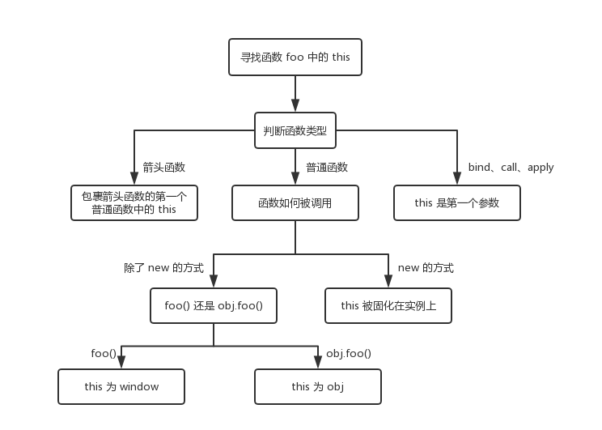

# 深入理解this

## 1. 执行上下文

说到this，就不得不提执行上下文，下面就先来看看执行上下文的概念。

### （1）执行上下文概念

执行上下文是评估和执行 JavaScript 代码的环境的抽象概念，当 JavaSciprt 代码在运行时，其运行在执行上下文中。

##### JavaScript 中有三种执行上下文类型:

- **全局执行上下文：**任何不在函数内部的都是全局执行上下文，它首先会创建一个全局的window对象，并且设置this的值等于这个全局对象，一个程序中只有一个全局执行上下文。
- **函数执行上下文：**当一个函数被调用时，就会为该函数创建一个新的执行上下文，函数的上下文可以有任意多个。

- `**eval**`**函数执行上下文：**执行在eval函数中的代码会有属于他自己的执行上下文，不过eval函数不常使用，不做介绍。

### （2）创建执行上下文

创建执行上下文有两个阶段：**创建阶段**和**执行阶段**

1. **创建阶段**

1）this绑定

- 在全局执行上下文中，this指向全局对象（window对象）
- 在函数执行上下文中，this指向取决于函数如何调用。如果它被一个引用对象调用，那么 this 会被设置成那个对象，否则 this 的值被设置为全局对象或者 undefined

2）创建词法环境组件

- 词法环境是一种有**标识符——变量映射**的数据结构，标识符是指变量/函数名，变量是对实际对象或原始数据的引用。
- 词法环境的内部有两个组件：
  **加粗样式**：环境记录器:用来储存变量个函数声明的实际位置
  **外部环境的引用**：可以访问父级作用域

3）创建变量环境组件

- 变量环境也是一个词法环境，其环境记录器持有变量声明语句在执行上下文中创建的绑定关系。

1. **执行阶段**

此阶段会完成对变量的分配，最后执行完代码。


**简单来说执行上下文就是指：**

在执行一点JS代码之前，需要先解析代码。解析的时候会先创建一个全局执行上下文环境，先把代码中即将执行的变量、函数声明都拿出来，变量先赋值为undefined，函数先声明好可使用。这一步执行完了，才开始正式的执行程序。


在一个函数执行之前，也会创建一个函数执行上下文环境，跟全局执行上下文类似，不过函数执行上下文会多出this、arguments和函数的参数。

- 全局上下文：变量定义，函数声明
- 函数上下文：变量定义，函数声明，`this`，`arguments`

## 2. this 指向

什么是 this？**this 是 JavaScript 的一个关键字，一般指向调用它的对象。**


这句话其实有两层意思，首先 this 指向的应该是一个对象，更具体地说是函数执行的“上下文对象”。其次这个对象指向的是“调用它”的对象，如果调用它的不是对象或对象不存在，则会指向全局对象（严格模式下为 undefined）。


`this`有四种绑定模式，分别是**默认绑定、隐式绑定、显式绑定、new绑定。**


先来给出一个判断this指向的流程图：


### （1）默认绑定（全局环境）

函数在浏览器全局环境中被调用，非严格模式下 `this` 指向 `window`；在 `use strict` 指明严格模式的情况下就是 `undefined`。


**注意：**在浏览器环境下，全局对象是window；在Node.js环境下，全局对象是global。

```javascript
function f1 () {
    console.log(this)
}
function f2 () {
    'use strict'
    console.log(this)
}
f1() // window
f2() // undefined
```

再来看一个示例：

```javascript
const foo = {
    bar: 10,
    fn: function() {
       console.log(this)
       console.log(this.bar)
    }
}
var fn1 = foo.fn
fn1()
```

这里 `this` 仍然指向的是 `window`。虽然 `fn` 函数在 `foo` 对象中作为方法被引用，但是在赋值给 `fn1` 之后，`fn1` 的执行仍然是在 `window` 的全局环境中。因此输出 `window` 和 `undefined`，它们相当于：

```javascript
console.log(window)
console.log(window.bar)
```

如果对上面的代码进行如下的修改:

```javascript
const foo = {
    bar: 10,
    fn: function() {
       console.log(this)
       console.log(this.bar)
    }
}
foo.fn()
// {bar: 10, fn: ƒ}
// 10
```

这时输出结果发生了变化，因为这时 `this` 指向的是最后调用它的对象，在 `foo.fn()` 语句中 `this` 指向 `foo` 对象。在执行函数时，如果函数中的 `this` 是被上一级的对象所调用，那么 `this` 指向的就是上一级的对象，否则指向全局环境。


**在三种特殊情境下，this 会 100% 指向 window：**

- 立即执行函数（IIFE）
- setTimeout 中传入的函数

- setInterval 中传入的函数


**1）立即执行函数**

所谓立即执行函数，就是定义后立刻调用的匿名函数（参见下面这道例题里 hello 方法的函数体里这种写法）。

```javascript
var name = 'BigBear'
var me = {
  name: 'js',
  // 声明位置
  sayHello: function() {
    console.log(`你好，我是${this.name}`)
  },
  hello: function() {
    (function(cb) {
      // 调用位置
      cb()
    })(this.sayHello)
  }
}
me.hello() /
```

执行结果是 BigBear ， 是 window.name 的值。立即执行函数作为一个匿名函数，在被调用的时候，我们往往就是直接调用，而不会（也无法）通过属性访问器（ 即 xx.xxx） 这样的形式来给它指定一个所在对象，所以它的 this 是非常确定的，就是默认的全局对象 window。

**2）setTimeout 和 setInterval 中传入的函数**

考虑到 setTimeout 和 setInterval 中函数的 this 指向机制其实是一样的，下面就来看看 setTimeout：

```javascript
var name = 'BigBear'
var me = {
  name: 'js',
  hello: function() {
    setTimeout(function() {
      console.log(`你好，我是${this.name}`)
    })
  }
}
me.hello() // 你好，我是BigBear
```

this.name 看起来是在 me.hello () 里被调用的，结果却输出了 window.name。 setTimeout 到底对函数做了什么？其实，我们所看到的延时效果（setTimeout）和定时效果（setInterval），都是在全局作用域下实现的。无论是 setTimeout 还是 setInterval 里传入的函数，都会首先被交付到全局对象手上。因此，函数中 this 的值，会被自动指向 window。

### （2）隐式绑定（上下文对象）

先看例题：

```javascript
const person = {
    name: 'Lucas',
    brother: {
        name: 'Mike',
        fn: function() {
            return this.name
        }
    }
}
console.log(person.brother.fn())
```

在这种嵌套的关系中，`this` 指向**最后**调用它的对象，因此输出将会是：`Mike`。


下面再看一道稍复杂的题目：

```javascript
const o1 = {
    text: 'o1',
    fn: function() {
        return this.text
    }
}
const o2 = {
    text: 'o2',
    fn: function() {
        return o1.fn()
    }
}
const o3 = {
    text: 'o3',
    fn: function() {
        var fn = o1.fn
        return fn()
    }
}
console.log(o1.fn())
console.log(o2.fn())
console.log(o3.fn())
```

答案是：`o1`、`o1`、`undefined`。

- 第一个 `console` 最简单，`o1` 没有问题。难点在第二个和第三个上面，关键还是看调用 `this` 的那个函数。
- 第二个 `console` 的 `o2.fn()`，最终还是调用 `o1.fn()`，因此答案仍然是 `o1`。

- 最后一个，在进行 `var fn = o1.fn` 赋值之后，是“裸奔”调用，因此这里的 `this` 指向 `window`，答案当然是 `undefined`。


那我们如何让 `console.log(o2.fn())` 输出 `o2` 呢？一般会想到使用 `bind/call/apply` 来对 `this` 的指向进行干预，这确实是一种思路。**那****如果不能使用** `**bind/call/apply**`**，有别的方法吗？**


可以这样做：

```javascript
const o1 = {
    text: 'o1',
    fn: function() {
        return this.text
    }
}
const o2 = {
    text: 'o2',
    fn: o1.fn
}
console.log(o2.fn())
```

还是应用那个重要的结论：`this` 指向**最后**调用它的对象，在 `fn` 执行时，挂到 `o2` 对象上即可，提前进行了赋值操作。

### （3）显示绑定（apply、call、bind）

显式绑定是指需要引用一个对象时进行强制绑定调用，显式绑定主要是使用`apply、call、bind`方法来绑定`this`值。


**bind/call/apply** 三个方法都是用来改变相关函数 `this` 指向的，但是 `call/apply` 是直接进行相关函数调用；`bind` 不会执行相关函数，而是返回一个新的函数，这个新的函数已经自动绑定了新的 `this` 指向，开发者需要手动调用即可。


代码如下：

```javascript
const target = {}
fn.call(target, 'arg1', 'arg2')
```

相当于：

```javascript
const target = {}
fn.apply(target, ['arg1', 'arg2'])
```

相当于：

```javascript
const target = {}
fn.bind(target, 'arg1', 'arg2')()
```


来看一道例题：

```javascript
const foo = {
    name: 'lucas',
    logName: function() {
        console.log(this.name)
    }
}
const bar = {
    name: 'mike'
}
console.log(foo.logName.call(bar))
```

这里将会输出 `mike。`


那如果对一个函数进行多次 `bind`，那么上下文会是什么呢？

```javascript
let a = {}
let fn = function () { console.log(this) }
fn.bind().bind(a)() // => ?
```

输出结果是 `a`吗？不是的。其实可以把上述代码转换成另一种形式：

```javascript
// fn.bind().bind(a) 等于
let fn2 = function fn1() {
  return function() {
    return fn.apply()
  }.apply(a)
}
fn2()
```

可以从上述代码中发现，不管给函数 `bind` 几次，`fn` 中的 `this` 永远由第一次 `bind` 决定，所以结果永远是 `window`。

```javascript
let a = { name: 'yck' }
function foo() {
  console.log(this.name)
}
foo.bind(a)() // => 'yck'
```

### （4）new绑定（构造函数）

new绑定主要是在构造函数中，this指向构造的新对象：

```javascript
function Person(name，age){
  this.name = name;
  this.age = age;
  this.say = function(){
    console.log(this.name + ":" + this.age);
  }
}
var person = new Person("js",18);
console.log(person.name); // js
console.log(person.age);  // 18
person.say(); // js:18
```

在上面的代码中，this就指向了构造函数Person的新对象person，所以使用this可以获取到person对象的属性和方法。

### （5）箭头函数中的this

箭头函数使用 `this` 不适用以上标准规则，而是根据外层（函数或者全局）上下文来决定：

```javascript
const foo = {  
    fn: function () {  
        setTimeout(function() {  
            console.log(this)
        })
    }  
}  
console.log(foo.fn())
```

这里，`this` 出现在 `setTimeout()` 中的匿名函数里，因此 `this` 指向 `window` 对象。如果需要 `this` 指向 `foo` 这个 object 对象，可以巧用箭头函数解决：

```javascript
const foo = {  
    fn: function () {  
        setTimeout(() => {  
            console.log(this)
        })
    }  
} 
console.log(foo.fn())
// {fn: ƒ}
```


在箭头函数中，如果多层的嵌套，像下面这种情况：

```javascript
function a() {
  return () => {
    return () => {
      console.log(this)
    }
  }
}
console.log(a()()())
```

因为箭头函数其实是没有 `this` 的，箭头函数中的 `this` 只取决包裹箭头函数的第一个普通函数的 `this`。在这个例子中，因为包裹箭头函数的第一个普通函数是 `a`，所以此时的 `this` 是 `window`。除此之外，对箭头函数使用 `bind` 这类函数是无效的。

### （6）数组方法中的this

对象 obj 拥有数组属性 arr，在属性 arr 的 forEach 回调函数中输出 this，指向的是什么呢？

```javascript
var obj = {
  arr: [1]
}
obj.arr.forEach(function() {console.log(this)}) // ?
```

其实输出的仍然是全局对象。


forEach 方法语法如下：

```javascript
array.forEach(function(currentValue, index, arr), thisValue)
```

其参数如下：

1）function(currentValue, index, arr)：必需。 数组中每个元素需要调用的函数。

- currentValue*：*必需，当前元素
- index：可选，当前元素的索引值

- arr：可选，当前元素所属的数组对象

2）thisValue：可选，传递给函数的值一般用 "this" 值。如果这个参数为空， "undefined" 会传递给 "this" 值


可以看到，forEach方法有两个参数，第一个是回调函数，第二个是 this 指向的对象，这里只传入了回调函数，第二个参数没有传入，默认为 undefined，所以正确答案应该是输出全局对象。


除了ForEach方法，需要传入 this 指向的函数还有：every()、find()、findIndex()、map()、some()，在使用的时候需要特别注意。


**总结：**

首先，`new` 的方式优先级最高，接下来是 `bind` 这些函数，然后是 `obj.foo()` 这种调用方式，最后是 `foo` 这种调用方式，同时，箭头函数的 `this` 一旦被绑定，就不会再被任何方式所改变。


下面是判断this指向的流程图，图中的流程只针对于单个规则：




## 3. this 优先级

先来给出结论，this绑定的优先级：**new绑定 > 显式绑定 > 隐式绑定 > 默认绑定。**


下面来看看示例。

```javascript
function foo (a) {
    console.log(this.a)
}
const obj1 = {
    a: 1,
    foo: foo
}
const obj2 = {
    a: 2,
    foo: foo
}
obj1.foo.call(obj2)
obj2.foo.call(obj1)
```

输出分别为 2、1，也就是说 `call`、`apply` 的显式绑定一般来说优先级更高。

```javascript
function foo (a) {
    this.a = a
}
const obj1 = {}
var bar = foo.bind(obj1)
bar(2)
console.log(obj1.a)
```

上述代码通过 `bind`，将 `bar` 函数中的 `this` 绑定为 `obj1` 对象。执行 `bar(2)` 后，`obj1.a` 值为 2。即经过 `bar(2)` 执行后，`obj1` 对象为：`{a: 2}`。


当再使用 `bar` 作为构造函数时：

```javascript
var baz = new bar(3)
console.log(baz.a)
```

将会输出 3。`bar` 函数本身是通过 `bind` 方法构造的函数，其内部已经对将 `this` 绑定为 `obj1`，它再作为构造函数，通过 `new` 调用时，返回的实例已经与 `obj1` 解绑。 也就是说：`**new**` **绑定修改了** `**bind**` **绑定中的** `**this**`**，因此** `**new**` **绑定的优先级比显式** `**bind**` **绑定更高。**


再来看：

```javascript
function foo() {
    return a => {
        console.log(this.a)
    };
}
const obj1 = {
    a: 2
}
const obj2 = {
    a: 3
}
const bar = foo.call(obj1)
console.log(bar.call(obj2))
```

这里将会输出 2。由于 `foo()` 的 `this` 绑定到 `obj1`，`bar`（引用箭头函数）的 `this` 也会绑定到 `obj1`，箭头函数的绑定无法被修改。


如果将 `foo` 完全写成箭头函数的形式：

```javascript
var a = 123
const foo = () => a => {
    console.log(this.a)
}
const obj1 = {
    a: 2
}
const obj2 = {
    a: 3
}
var bar = foo.call(obj1)
console.log(bar.call(obj2))
```

这里将会输出 `123`。


这里再将上述代码的第一处变量 `a` 的赋值改为：

```javascript
const a = 123
const foo = () => a => {
    console.log(this.a)
}
const obj1 = {
    a: 2
}
const obj2 = {
    a: 3
}
var bar = foo.call(obj1)
console.log(bar.call(obj2))
```

答案将会输出 `undefined`，原因是因为使用 `const` 声明的变量不会挂载到 `window` 全局对象当中。因此 `this` 指向 `window` 时，自然也找不到 `a` 变量了。