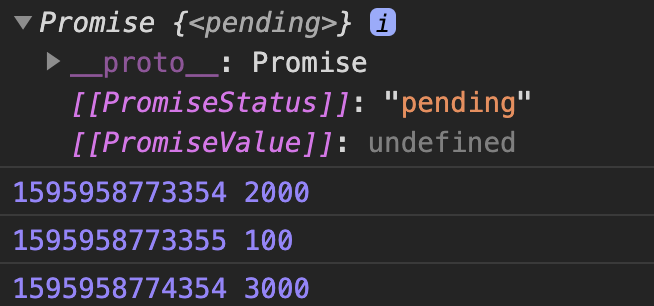
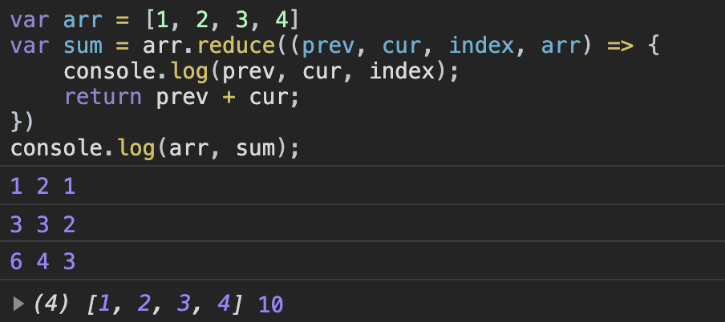
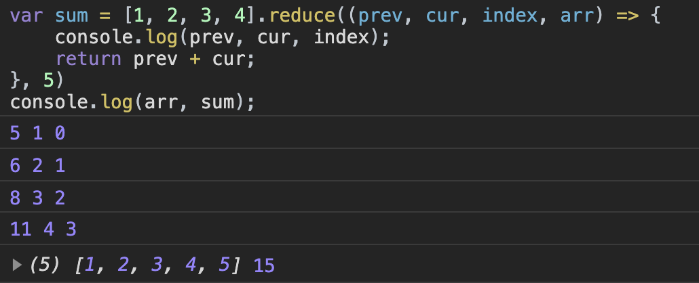
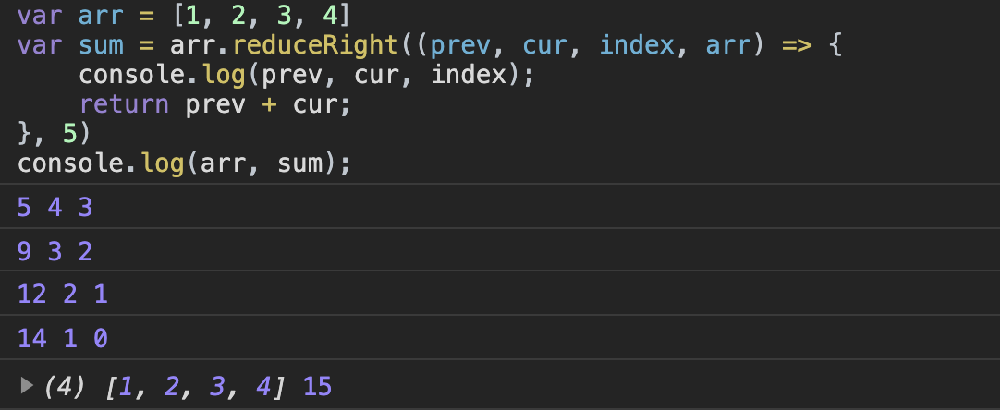

# 细数JavaScript中的遍历方法

## 1.  for

for循环是应该是最常见的循环方式了，它有三个表达式组成，分别是声明循环变量、判断循环条件、更新循环变量。这三个表达式用分号分隔，都可以省略。但是中间的分号不能省略。

```javascript
let arr = [1,2,3,4,5]
for(let i = 0, len = arr.length; i < len; i++ ){
  console.log(arr[i])
}
```

在执行的时候，会先判断执行条件，再执行。

for循环可以用来遍历数组，字符串，类数组，DOM节点等

## 2. while

`while`循环中的结束条件可以是各种类型，但是最终都会转为真假，转换规则如下。

- Boolean：true为真，false为假；
- String：空字符串为假，所有非空字符串为真；

- Number：0为假，一切非0数字为真；
- null/Undefined/NaN:全为假；

- Object：全为真。


```javascript
let num = 1;
            
while (num<10){
    console.log(num);
    num ++;
}
```


`while`和`for`一样，都是先判断，再执行。

## 3. do / while

特点：先执行再判断，即使初始条件不成立，`do/while`循环至少执行一次，也就是说`do/while`循环比`while`循环多执行一次。

```javascript
let num = 10;
            
do{
    console.log(num);
    num --;
  }while(num >= 0);
            
console.log(num); //-1
```

## 4. for…in

`for…in` 主要用于对数组或者对象的属性进行循环操作。循环中的代码每执行一次，就会对对象的属性进行一次操作。

语法：

```javascript
for (var in object) {
 执行的代码块
}
```

其中两个参数：

- var	：必须。指定的变量可以是数组元素，也可以是对象的属性。
- object：	必须。指定迭代的的对象。


```javascript
var obj = {a: 1, b: 2, c: 3}; 
 
for (var i in obj) { 
    console.log('键名：', i); 
    console.log('键值：', obj[i]); 
}
```


需要注意，  该方法不仅会遍历当前的对象所有的可枚举属性，还会遍历其原型链上的属性。


除此之外，该方法遍历数组时候，遍历出来的是数组的索引值，遍历对象的时候，遍历出来的是键值名。

## 5. for...of

`for...of` 语句创建一个循环来迭代可迭代的对象。在 ES6 中引入的 `for...of` 循环，以替代 `for...in` 和 `forEach()` ，并支持新的迭代协议。`for...of` 允许遍历 Arrays（数组）, Strings（字符串）, Maps（映射）, Sets（集合）等可迭代的数据结构等。


语法：

```javascript
for (variable of iterable) {
    statement
}
```

其中，有两个参数：

- variable：每个迭代的属性值被分配给该变量。
- iterable：一个具有可枚举属性并且可以迭代的对象。


该方法允许获取对象的键值：

```javascript
var arr = ['a', 'b', 'c', 'd'];

for (let a in arr) {
  console.log(a); // 0 1 2 3
}

for (let a of arr) {
  console.log(a); // a b c d
}
```

该方法只会遍历当前对象的属性，不会遍历其原型链上的属性。

**注意：**

- for...of适用遍历 **数组/ 类数组/字符串/map/set** 等拥有迭代器对象的集合
- 它可以正确响应break、continue和return语句。

- for-of循环不支持遍历普通对象，因为没有迭代器对象。如果想要遍历一个对象的属性，可以用`for-in`循环

## 6. for await...of

`for await...of`方法被称为**异步迭代器**，该方法是主要用来遍历异步对象。他是ES2018中引入方法。


`for await...of` 语句会在异步或者同步可迭代对象上创建一个迭代循环，包括 String，Array，类数组，Map， Set和自定义的异步或者同步可迭代对象。这个语句只能在 `async function`内使用。

```javascript
function Gen (time) {
  return new Promise((resolve,reject) => {
    setTimeout(function () {
       resolve(time)
    },time)
  })
}

async  function test () {
   let arr = [Gen(2000),Gen(100),Gen(3000)]
   for await (let item of arr) {
      console.log(Date.now(),item)
   }
}
test()
```

输出结果：




## 7. forEach()

`forEach` 方法用于调用数组的每个元素，并将元素传递给回调函数。


数组中的每个值都会调用回调函数，回调函数有三个参数：

- currentValue：	必需。当前元素
- index： 	可选。当前元素的索引值。

- arr：	可选。当前元素所属的数组对象

```v
let arr = [1,2,3,4,5]
arr.forEach((item, index, arr) => {
  console.log(index+":"+item)
})
```

该方法还可以有第二个参数，用来绑定回调函数内部this变量（前提是回调函数不能是箭头函数，因为箭头函数没有this）：

```javascript
let arr = [1,2,3,4,5]
let arr1 = [9,8,7,6,5]
arr.forEach(function(item, index, arr){
  console.log(this[index])  //  9 8 7 6 5
}, arr1)
```

需要注意的是，**forEach方法不会改变原数组，也没有返回值。**

## 8. map()

`map()` 方法会返回一个新数组，数组中的元素为原始数组元素调用函数处理后的值。该方法按照原始数组元素顺序依次处理元素。


注意： `map()` 不会对空数组进行检测，它会返回一个新数组，**不会改变原始数组**。


该方法的第一个参数为回调函数，他有三个参数：

- currentValue：	必须。当前元素的值
- index	：可选。当前元素的索引值

- arr	：可选。当前元素属于的数组对象

```javascript
let arr = [1, 2, 3];
 
arr.map(item => {
    return item+1;
})
 // 返回值： [2, 3, 4]
```

第二个参数用来绑定参数函数内部的this变量，可选：

```javascript
var arr = ['a', 'b', 'c'];
 
[1, 2].map(function (e) {
    return this[e];
}, arr)
 // 返回值： ['b', 'c']
```

该方法可以进行链式调用：

```javascript
let arr = [1, 2, 3];
 
arr.map(item => item+1).map(item => item+1)
 // 返回值： [3, 4, 5]
```

## 9. filter()

`filter()`方法用于过滤数组，满足条件的元素会被返回。它的参数是一个回调函数，所有数组元素依次执行该函数，返回结果为true的元素会被返回。该方法会返回一个新的数组，不会改变原数组。


该方法的第一个参数是回调函数，它有三个参数：

- currentValue：	必须。当前元素的值
- index	：可选。当前元素的索引值

- arr	：可选。当前元素属于的数组对象

```javascript
let arr = [1, 2, 3, 4, 5]
arr.filter(item => item > 2) 

// 结果：[3, 4, 5]
```

同样，他也有第二个参数，用来绑定参数函数内部的this变量。


我们可以使用`filter()`方法来移除数组中的undefined、null、NAN等值

```javascript
let arr = [1, undefined, 2, null, 3, false, '', 4, 0]
arr.filter(Boolean)

// 结果：[1, 2, 3, 4]
```

## 10.  every()

该方法会对数组中的每一项进行遍历，只有所有元素都符合条件时，才返回true，否则就返回false。

```javascript
let arr = [1, 2, 3, 4, 5]
arr.every(item => item > 0) 

// 结果： true
```

## 11. some()

该方法会对数组中的每一项进行遍历，只要有一个元素符合条件，就返回true，否则就返回false。

```javascript
let arr = [1, 2, 3, 4, 5]
arr.some(item => item > 4) 

// 结果： true
```

`some()`和`every()`方法都接受一个函数作为参数，该参数函数可以接收三个参数，分别是当前数组元素、当前元素索引、当前元素所在数组。

## 12. find()

`find()` 方法返回通过函数内判断的数组的第一个元素的值。该方法为数组中的每个元素都调用一次函数执行：

- 当数组中的元素在测试条件时返回 true 时， `find()` 返回符合条件的元素，之后的值不会再调用执行函数。
- 如果没有符合条件的元素返回 undefined


**注意:** `find()` 对于空数组，函数是不会执行的。 该方法并没有改变数组的原始值。


该方法的第一个参数也是一个函数，它有三个参数：

- currentValue	：必需。当前元素
- index	：可选。当前元素的索引

- arr	：可选。当前元素所属的数组对象

```javascript
let arr = [1, 2, 3, 4, 5]
arr.find(item => item > 2) 

// 结果： 3
```

## 13. findIndex()

`findIndex()` 方法返回传入一个测试函数符合条件的数组**第一个元素位置**（索引）。该方法为数组中的每个元素都调用一次函数执行：

- 当数组中的元素在函数条件时返回 true 时， `findIndex()` 返回符合条件的元素的索引位置，之后的值不会再调用执行函数。
- 如果没有符合条件的元素返回 -1


**注意:** `findIndex()` 对于空数组，函数是不会执行的。该方法并没有改变数组的原始值。


该方法的第一个参数也是一个函数，它有三个参数：


- currentValue：必需。当前元素
- index：可选。当前元素的索引

- arr：可选。当前元素所属的数组对象


```javascript
let arr = [1, 2, 3, 4, 5]
arr.findIndex(item => item > 2) 

// 结果： 2
```

`find()`和`findIndex()`两个方法几乎一样，只是返回结果不同：

- `find()`：返回的是第一个符合条件的值
- `findIndex`：返回的是第一个返回条件的值的索引值

## 14. reduce()

reduce() 方法对数组中的每个元素执行一个reducer函数(升序执行)，将其结果汇总为单个返回值。


**语法：** `arr.reduce(callback,[initialValue])`


reduce 为数组中的每一个元素依次执行回调函数，不包括数组中被删除或从未被赋值的元素，接受四个参数：初始值（或者上一次回调函数的返回值），当前元素值，当前索引，调用 reduce 的数组。


(1) `callback` （执行数组中每个值的函数，包含四个参数）

- previousValue （上一次调用回调返回的值，或者是提供的初始值（initialValue））
- currentValue （数组中当前被处理的元素）

- index （当前元素在数组中的索引）
- array （调用 reduce 的数组）

(2) `initialValue` （作为第一次调用 callback 的第一个参数。）

```javascript
var arr = [1, 2, 3, 4]
var sum = arr.reduce((prev, cur, index, arr) => {
    console.log(prev, cur, index);
    return prev + cur;
})
console.log(arr, sum);
```

输出结果：




再来加一个初始值看看：

```javascript
var arr = [1, 2, 3, 4]
var sum = arr.reduce((prev, cur, index, arr) => {
    console.log(prev, cur, index);
    return prev + cur;
}, 5)
console.log(arr, sum);
```

输出结果：



通过上面的两个例子，我们可以得出结论：**如果没有提供initialValue，reduce 会从索引1的地方开始执行 callback 方法，跳过第一个索引。如果提供initialValue，从索引0开始**


注意，该方法如果添加初始值，就会改变原数组，将这个初始值放在数组的最后一位。

## 15. reduceRight()

该方法和的上面的`reduce()`用法几乎一致，只是该方法是对数组进行倒序查找的。而`reduce()`方法是正序执行的。

```javascript
var arr = [1, 2, 3, 4]
var sum = arr.reduceRight((prev, cur, index, arr) => {
    console.log(prev, cur, index);
    return prev + cur;
}, 5)
console.log(arr, sum);
```





## 16. Object.keys()

`Object.keys()` 方法用来遍历对象，它会返回一个由一个给定对象的自身可枚举属性组成的数组，数组中属性名的排列顺序和正常循环遍历该对象时返回的顺序一致 。

```javascript
var arr = ['a', 'b', 'c'];
console.log(Object.keys(arr)); // 结果: ['0', '1', '2']

var obj = { 0: 'a', 1: 'b', 2: 'c' };
console.log(Object.keys(obj)); // 结果: ['0', '1', '2']
```

注意，返回的数组中的值都是字符串，也就是说不是字符串的key值会转化为字符串。


该数组中的属性值都是对象本身**可枚举的属性**，不包括继承来的属性。

## 17. Object.getOwnPropertyNames()

`Object.getOwnPropertyNames()`方法与`Object.keys()`类似，也是接受一个对象作为参数，返回一个数组，包含了该对象自身的所有属性名。但它能返回**不可枚举的属性。**

```javascript
var a = ['Hello', 'World'];
 
Object.keys(a) // ["0", "1"]
Object.getOwnPropertyNames(a) // ["0", "1", "length"]
```

这两个方法都可以用来计算对象中属性的个数：

```javascript
var obj = { 0: "a", 1: "b", 2: "c"};
Object.getOwnPropertyNames(obj) // ["0", "1", "2"]
Object.keys(obj).length // 3
Object.getOwnPropertyNames(obj).length // 3
```

### 总结

| **方法**                                      | **特点**                                                     |
| --------------------------------------------- | ------------------------------------------------------------ |
| forEach()                                     | 数组方法，不改变原数组，没有返回值                           |
| map()                                         | 数组方法，不改变原数组，有返回值，可链式调用                 |
| filter()                                      | 数组方法，过滤数组，返回包含符合条件的元素的数组，可链式调用 |
| for await...of                                | 遍历异步迭代对象                                             |
| for…in  和 for...of                           | for…in遍历对象可枚举属性，包括原型链上的属性，返回的是数组的索引、对象的属性名；for...of遍历具有Iterator迭代器的对象的属性，返回的是数组的元素、对象的属性值，不能遍历普通的obj对象，将异步循环变成同步循环 |
| every() 和 some()                             | 数组方法，some()只要有一个是true，便返回true；而every()只要有一个是false，便返回false. |
| find() 和 findIndex()                         | 数组方法，find()返回的是第一个符合条件的值；findIndex()返回的是第一个返回条件的值的索引值 |
| reduce() 和 reduceRight()                     | 数组方法，reduce()对数组正序操作；reduceRight()对数组逆序操作 |
| Object.keys() 和 Object.getOwnPropertyNames() | Object.keys() 获取对象可枚举的属性；Object.getOwnPropertyNames()返回所有属性，两者都返回一个包含属性名的数组 |


#### 