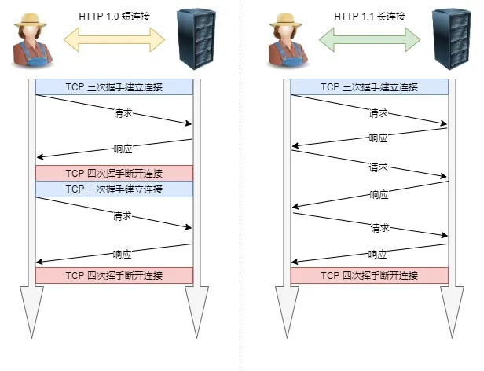
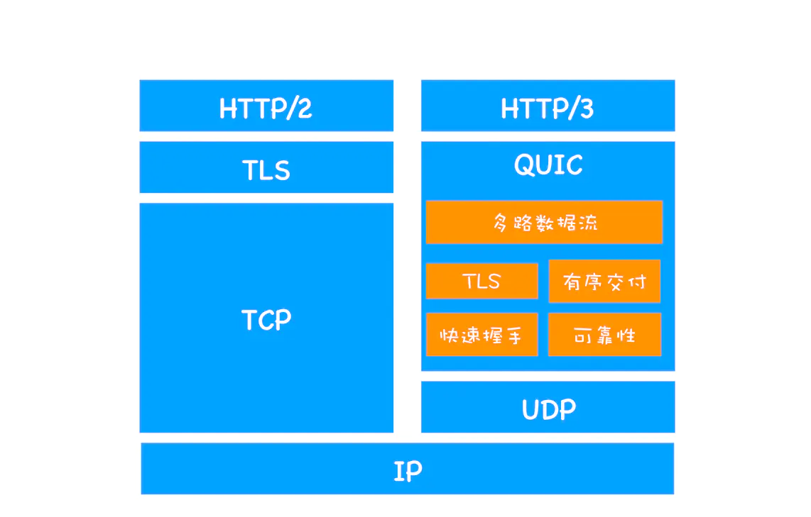
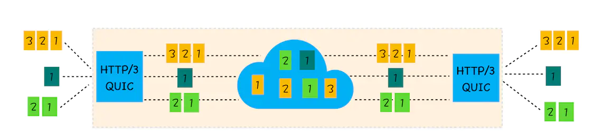

# HTTP概述

## 1. HTTP协议概述

HTTP 是超文本传输协议，它定义了客户端和服务器之间交换报文的格式和方式，默认使用 80 端口。它使用 TCP 作为传输层协议，保证了数据传输的可靠性。


HTTP协议具有以下**优点**：

- 支持客户端/服务器模式
- **简单快速**：客户向服务器请求服务时，只需传送请求方法和路径。由于 HTTP 协议简单，使得 HTTP 服务器的程序规模小，因而通信速度很快。

- **无连接**：无连接的含义是限制每次链接只处理一个请求。服务器处理完客户的请求，并收到客户的应答后，即断开链接，采用这种方式可以节省传输时间。
- **无状态**：HTTP 协议是无状态协议，这里的状态是指通信过程的上下文信息。缺少状态意味着如果后续处理需要前面的信息，则它必须重传，这样可能会导致每次连接传送的数据量增大。另一方面，在服务器不需要先前信息时它的应答就比较快。

- **灵活**：HTTP 允许传输任意类型的数据对象。正在传输的类型由 Content-Type 加以标记。


HTTP协议具有以下**缺点**：

- **无状态：**HTTP 是一个无状态的协议，HTTP 服务器不会保存关于客户的任何信息。
- **明文传输：**协议中的报文使用的是文本形式，这就直接暴露给外界，不安全。

- **不安全**

（1）通信使用明文（不加密），内容可能会被窃听

（2）不验证通信方的身份，因此有可能遭遇伪装

（3）无法证明报文的完整性，所以有可能已遭篡改

## 2. HTTP协议性能 

HTTP 协议是基于 TCP/IP，并且使用了**请求-应答**的通信模式，所以性能的关键就在这两点里。

- **长连接**

HTTP协议有两种连接模式，一种是持续连接，一种非持续连接。

（1）非持续连接指的是服务器必须为每一个请求的对象建立和维护一个全新的连接。

（2）持续连接下，TCP 连接默认不关闭，可以被多个请求复用。采用持续连接的好处是可以避免每次建立 TCP 连接三次握手时所花费的时间。


对于不同版本的采用不同的连接方式：

- 在HTTP/1.0 每发起一个请求，都要新建一次 TCP 连接（三次握手），而且是串行请求，做了无畏的 TCP 连接建立和断开，增加了通信开销。该版本使用的非持续的连接，但是可以在请求时，加上 Connection: keep-a live 来要求服务器不要关闭 TCP 连接。
- 在HTTP/1.1 提出了**长连接**的通信方式，也叫持久连接。这种方式的好处在于减少了 TCP 连接的重复建立和断开所造成的额外开销，减轻了服务器端的负载。该版本及以后版本默认采用的是持续的连接。目前对于同一个域，大多数浏览器支持同时建立 6 个持久连接。



- **管道网络传输**

HTTP/1.1 采用了长连接的方式，这使得管道（pipeline）网络传输成为了可能。


管道（pipeline）网络传输是指：可以在同一个 TCP 连接里面，客户端可以发起多个请求，只要第一个请求发出去了，不必等其回来，就可以发第二个请求出去，可以减少整体的响应时间。但是服务器还是按照顺序回应请求。要是前面的回应特别慢，后面就会有许多请求排队等着。这称为队头堵塞。

- **队头堵塞**

HTTP 传输的报文必须是一发一收，但是，里面的任务被放在一个任务队列中串行执行，一旦队首的请求处理太慢，就会阻塞后面请求的处理。这就是HTTP队头阻塞问题。

**队头阻塞的解决方案：**

（1）并发连接：对于一个域名允许分配多个长连接，那么相当于增加了任务队列，不至于一个队伍的任务阻塞其它所有任务。

（2）域名分片：将域名分出很多二级域名，它们都指向同样的一台服务器，能够并发的长连接数变多，解决了队头阻塞的问题。

## 3. HTTP协议请求报文与响应报文

### （1）HTTP 请求报文

HTTP 报文有两种，一种是请求报文，一种是响应报文。

HTTP 请求报文的格式如下：

```
GET / HTTP/1.1
User-Agent: Mozilla/5.0 (Macintosh; Intel Mac OS X 10_10_5)
Accept: */*
```

HTTP 请求报文的第一行叫做请求行，后面的行叫做首部行，首部行后还可以跟一个实体主体。请求首部之后有一个空行，这 个空行不能省略，它用来划分首部与实体。


请求行包含三个字段：

- 方法字段
- URL 字段

- HTTP 版本字段。


请求**方法字段**可以取以下的值：

- GET: 向服务器获取数据
- POST：将实体提交到指定的资源，通常会造成服务器资源的修改。

- PUT：上传文件，修改数据
- DELETE：删除服务器上的对象

- HEAD：获取报文首部，与GET相比，不返回报文主体部分
- OPTIONS：询问支持的请求方法，用来跨域请求

- TRACE：追踪 请求—响应 的传输路径
- CONNECT：要求在与代理服务器通信时建立隧道，使用隧道进行TCP通信


虽然请求的方法很多，但更多表达的是一种语义上的区别，并不是说 POST 能做的事情，GET 就不能做了，主要看我们如何选择。

### （2）HTTP 响应报文

HTTP 报文有两种，一种是请求报文，一种是响应报文。


HTTP 响应报文的格式如下：

```
HTTP/1.0 200 OK
Content-Type: text/plain
Content-Length: 137582
Expires: Thu, 05 Dec 1997 16:00:00 GMT
Last-Modified: Wed, 5 August 1996 15:55:28 GMT
Server: Apache 0.84
<html>
  <body>Hello World</body>
</html>
```

HTTP 响应报文的第一行叫做**状态行**，后面的行是**首部行**，最后是**实体主体**。

- **状态行**包含了三个字段：协议版本字段、状态码和相应的状态信息。
- **实体部分**是报文的主要部分，它包含了所请求的对象。

- **首部行**首部可以分为四种首部，请求首部、响应首部、通用首部和实体首部。通用首部和实体首部在请求报文和响应报文中都可以设置，区别在于请求首部和响应首部。

（1）常见的请求首部有 Accept 可接收媒体资源的类型、Accept-Charset 可接收的字符集、Host 请求的主机名。

（2）常见的响应首部有 ETag 资源的匹配信息，Location 客户端重定向的 URI。

（3）常见的通用首部有 Cache-Control 控制缓存策略、Connection 管理持久连接。

（4）常见的实体首部有 Content-Length 实体主体的大小、Expires 实体主体的过期时间、Last-Modified 资源的最后修 改时间。

## 4. HTTP协议版本

### （1）HTTP 1.1

**HTTP 1.1版本**较之前的1.0版本又有了更大的更新，它进一步完善了HTTP协议，现在仍然有在使用，它主要有以下更新：

- **持久连接（长连接）**
  该版本之前的版本所建立的都是短连接，该版本引入了持久连接的概念，就是TCP连接默认是不关闭的，建立一个TCP连接，就可以发送多个请求，减少了建立和关闭连接的消耗和延迟。
  在请求头设置一个非标准的Connection字段:`Connection: keep-alive`就可以进行长连接，这个字段要求服务器不要关闭TCP连接，服务器同样会回应这个字段。如果想要关闭TCP连接，就要在请求中设置字段：`Connection: false`
- **管道机制**：该版本还引入了管道机制，即在一个TCP连接里，客户端可以同时发送多个请求，不需要等收到上一个请求回应，就可以发送新的请求，但是请求的响应还是按照请求发送的顺序返回的，这样就进一步提高了HTTP协议的效率

- **分块传输编码**：在HTTP1.0版本中，如果在服务器端遇到较为耗费时间的操作，那么需要等到这一操作全部完成后，才会向客户端发送数据，这段等待时间很影响性能和客户体验。多以使用**分块传输编码**，只要请求或者回应的头部信息有`Transfer-Encoding`字段：`Transfer-Encoding: chunked`，就表明回应将由数量未定的数据块组成。每个非空的数据块之前，会有一个16进制的数值，表示这个块的长度。最后是一个大小为0的块，就表示本次回应的数据发送完了
- 加入了新的**请求方法**：**PUT、PATCH、HEAD、 OPTIONS、DELETE**

- 加入了**缓存机制**：**强缓存**和**协商缓存**
- 客户端请求的头部信息**加入了**`**Host**`**字段**，用来指定服务器的域名，这样就可以区分同一个物理主机中的不同虚拟主机的域名


虽然HTTP 1.1对之前的版本进行了完善，但是还是**存在一些问题**：HTTP/1.1 默认使用了持久连接，多个请求可以复用同一个 TCP 连接，但是在同一个 TCP 连接里面，数据请求的通信次序是固定的。服务器只有处理完一个请求的响应后，才会进行下一个请求的处理，如果前面请求的响应特别慢的话，就会造成许多请求排队等待的情况，这种情况被称为“**队头堵塞**”。队头阻塞会导致持久连接在达到最大数量时，剩余的资源需要等待其他资源请求完成后才能发起请求。

### （2）HTTP 2.0

首先理解一下以下概念：

（1）**流（stream）**：已建立连接上的双向字节流。

（2）**消息**：与逻辑消息对应的完整的一系列数据帧。

（3）**帧（frame）**：HTTP2.0通信的最小单位，每个帧包含帧头部，至少也会标识出当前帧所属的流（stream id）。


**HTTP 2.0** 版本有以下更新：

- **二进制协议**：HTTP/2 是一个二进制协议。在 HTTP/1.1 版中，报文的头信息必须是文本（ASCII 编码），数据体可以是文本，也可以是 二进制。HTTP/2 则是一个彻底的二进制协议，头信息和数据体都是二进制，并且统称为"帧"，可以分为头信息帧和数据帧。 帧的概念是它实现多路复用的基础。
- **多路复用：**HTTP/2 实现了多路复用，HTTP/2 仍然复用 TCP 连接，但是在一个连接里，客户端和服务器都可以同时发送多个请求或回 应，而且不用按照顺序一一发送，这样就避免了"队头堵塞"的问题。

- **数据流：**HTTP/2 使用了数据流的概念，因为 HTTP/2 的数据包是不按顺序发送的，同一个连接里面连续的数据包，可能属于不同的 请求。因此，必须要对数据包做标记，指出它属于哪个请求。HTTP/2 将每个请求或回应的所有数据包，称为一个数据流。每 个数据流都有一个独一无二的编号。数据包发送的时候，都必须标记数据流 ID ，用来区分它属于哪个数据流。
- **头信息压缩：**HTTP/2 实现了头信息压缩，由于 HTTP 1.1 协议不带有状态，每次请求都必须附上所有信息。所以，请求的很多字段都是 重复的，比如 Cookie 和 User Agent ，一模一样的内容，每次请求都必须附带，这会浪费很多带宽，也影响速度。HTTP/2 对这一点做了优化，引入了头信息压缩机制。一方面，头信息使用 gzip 或 compress 压缩后再发送；另一方面， 客户端和服务器同时维护一张头信息表，所有字段都会存入这个表，生成一个索引号，以后就不发送同样字段了，只发送索引 号，这样就能提高速度了。

- **服务器推送：**HTTP/2 允许服务器未经请求，主动向客户端发送资源，这叫做服务器推送。使用服务器推送，提前给客户端推送必要的资源 ，这样就可以相对减少一些延迟时间。这里需要注意的是 http2 下服务器主动推送的是静态资源，和 WebSocket 以及使用 SSE 等方式向客户端发送即时数据的推送是不同的。


HTTP/2 协议**缺点**：因为 HTTP/2 使用了多路复用，一般来说同一域名下只需要使用一个TCP 连接。由于多个数据流使用同一个 TCP 连接，遵守同一个流量状态控制和拥塞控制。只要一个数据流遭遇到拥塞，剩下的数据流就没法发出去，这样就导致了后面的所有数据都会被阻塞。HTTP/2 出现的这个问题是由于其使用 TCP 协议的问题，与它本身的实现其实并没有多大关系。

### （3）HTTP 3.0

HTTP/3基于UDP协议实现了类似于TCP的多路复用数据流、传输可靠性等功能，这套功能被称为QUIC协议。



1. 流量控制、传输可靠性功能：QUIC在UDP的基础上增加了一层来保证数据传输可靠性，它提供了数据包重传、拥塞控制、以及其他一些TCP中的特性。
2. 集成TLS加密功能：目前QUIC使用TLS1.3，减少了握手所花费的RTT数。

1. 多路复用：同一物理连接上可以有多个独立的逻辑数据流，实现了数据流的单独传输，解决了TCP的队头阻塞问题。



1. 快速握手：由于基于UDP，可以实现使用0 ~ 1个RTT来建立连接。