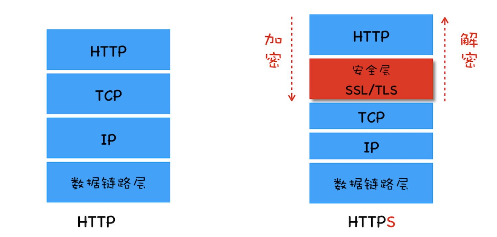
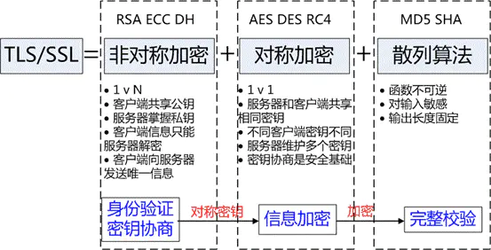
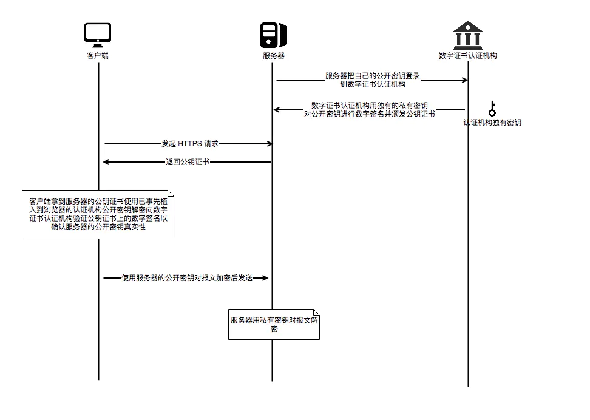

- # HTTPS概述

  ## 1. 什么是HTTPS协议？

  超文本传输安全协议（Hypertext Transfer Protocol Secure，简称：HTTPS）是一种通过计算机网络进行安全通信的传输协议。HTTPS经由HTTP进行通信，但利用SSL/TLS来加密数据包。HTTPS开发的主要目的，是提供对网站服务器的身份认证，保护交换数据的隐私与完整性。

  

  HTTP协议采用**明文传输**信息，存在**信息窃听**、**信息篡改**和**信息劫持**的风险，而协议TLS/SSL具有**身份验证**、**信息加密**和**完整性校验**的功能，可以避免此类问题发生。

  安全层的主要职责就是**对发起的HTTP请求的数据进行加密操作** 和 **对接收到的HTTP的内容进行解密操作**。

  ## 2. TLS/SSL的工作原理

  **TLS/SSL**全称安全传输层协议（Transport Layer Security）, 是介于TCP和HTTP之间的一层安全协议，不影响原有的TCP协议和HTTP协议，所以使用HTTPS基本上不需要对HTTP页面进行太多的改造。

  TLS/SSL的功能实现主要依赖三类基本算法：**散列函数hash**、**对称加密**、**非对称加密**。这三类算法的作用如下：

  - 基于散列函数验证信息的完整性
  - 对称加密算法采用协商的秘钥对数据加密

  - 非对称加密实现身份认证和秘钥协商
    

  ### 2.1 散列函数hash

  常见的散列函数有MD5、SHA1、SHA256。该函数的特点是单向不可逆，对输入数据非常敏感，输出的长度固定，任何数据的修改都会改变散列函数的结果，可以用于防止信息篡改并验证数据的完整性。

  **特点：** 在信息传输过程中，散列函数不能三都实现信息防篡改，由于传输是明文传输，中间人可以修改信息后重新计算信息的摘要，所以需要对传输的信息和信息摘要进行加密。

  ### 2.2 对称加密

  对称加密的方法是，双方使用同一个秘钥对数据进行加密和解密。但是对称加密的存在一个问题，就 是如何保证秘钥传输的安全性，因为秘钥还是会通过网络传输的，一旦秘钥被其他人获取到，那么整个加密过程就毫无作用了。 这就要用到非对称加密的方法。

  

  常见的对称加密算法有AES-CBC、DES、3DES、AES-GCM等。相同的秘钥可以用于信息的加密和解密。掌握秘钥才能获取信息，防止信息窃听，其通讯方式是一对一。

  

  **特点：** 对称加密的优势就是信息传输使用一对一，需要共享相同的密码，密码的安全是保证信息安全的基础，服务器和N个客户端通信，需要维持N个密码记录且不能修改密码。

  ### 2.3 非对称加密

  非对称加密的方法是，我们拥有两个秘钥，一个是公钥，一个是私钥。公钥是公开的，私钥是保密的。用私钥加密的数据，只 有对应的公钥才能解密，用公钥加密的数据，只有对应的私钥才能解密。我们可以将公钥公布出去，任何想和我们通信的客户， 都可以使用我们提供的公钥对数据进行加密，这样我们就可以使用私钥进行解密，这样就能保证数据的安全了。但是非对称加 密有一个缺点就是加密的过程很慢，因此如果每次通信都使用非对称加密的方式的话，反而会造成等待时间过长的问题。

  

  常见的非对称加密算法有RSA、ECC、DH等。秘钥成对出现，一般称为公钥（公开）和私钥（保密）。公钥加密的信息只有私钥可以解开，私钥加密的信息只能公钥解开，因此掌握公钥的不同客户端之间不能相互解密信息，只能和服务器进行加密通信，服务器可以实现一对多的的通信，客户端也可以用来验证掌握私钥的服务器的身份。

  

  **特点：** 非对称加密的特点就是信息一对多，服务器只需要维持一个私钥就可以和多个客户端进行通信，但服务器发出的信息能够被所有的客户端解密，且该算法的计算复杂，加密的速度慢。

  

  综合上述算法特点，TLS/SSL的工作方式就是客户端使用非对称加密与服务器进行通信，实现身份的验证并协商对称加密使用的秘钥。对称加密算法采用协商秘钥对信息以及信息摘要进行加密通信，不同节点之间采用的对称秘钥不同，从而保证信息只能通信双方获取。这样就解决了两个方法各自存在的问题。

  ## 3. 数字证书

  现在的方法也不一定是安全的，因为我们没有办法确定我们得到的公钥就一定是安全的公钥。可能存在一个中间人，截取 了对方发给我们的公钥，然后将他自己的公钥发送给我们，当我们使用他的公钥加密后发送的信息，就可以被他用自己的私钥 解密。然后他伪装成我们以同样的方法向对方发送信息，这样我们的信息就被窃取了，然而我们自己还不知道。

  

  为了解决这样的问题，我们可以使用数字证书的方式，首先我们使用一种 Hash 算法来对我们的公钥和其他信息进行加密生成 一个信息摘要，然后让有公信力的认证中心（简称 CA ）用它的私钥对消息摘要加密，形成签名。最后将原始的信息和签名合 在一起，称为数字证书。当接收方收到数字证书的时候，先根据原始信息使用同样的 Hash 算法生成一个摘要，然后使用公证 处的公钥来对数字证书中的摘要进行解密，最后将解密的摘要和我们生成的摘要进行对比，就能发现我们得到的信息是否被更改 了。这个方法最要的是认证中心的可靠性，一般浏览器里会内置一些顶层的认证中心的证书，相当于我们自动信任了他们，只有 这样我们才能保证数据的安全。

  

  ## 4. HTTPS通信过程

  HTTPS的通信过程如下：

  - 第一步，客户端向服务器发起请求，请求中包含使用的协议版本号、生成的一个随机数、以及客户端支持的加密方法。
  - 第二步，服务器端接收到请求后，确认双方使用的加密方法、并给出服务器的证书、以及一个服务器生成的随机数。

  - 第三步，客户端确认服务器证书有效后，生成一个新的随机数，并使用数字证书中的公钥，加密这个随机数，然后发给服 务器。并且还会提供一个前面所有内容的 hash 的值，用来供服务器检验。
  - 第四步，服务器使用自己的私钥，来解密客户端发送过来的随机数。并提供前面所有内容的 hash 值来供客户端检验。

  - 第五步，客户端和服务器端根据约定的加密方法使用前面的三个随机数，生成对话秘钥，以后的对话过程都使用这个秘钥 来加密信息。

  ## 5. HTTPS的特点

  HTTPS的**优点**如下：

  - 使用HTTPS协议可以认证用户和服务器，确保数据发送到正确的客户端和服务器
  - 使用HTTPS协议可以进行加密传输、身份认证，通信更加安全，防止数据在传输过程中被窃取、修改，确保数据安全性。

  - HTTPS是现行架构下最安全的解决方案，虽然不是绝对的安全，但是大幅增加了中间人攻击的成本

  HTTPS的**缺点**如下：

  - HTTPS需要做服务器和客户端双方的加密个解密处理，耗费更多服务器资源，过程复杂
  - HTTPS协议握手阶段比较费时，增加页面的加载时间

  - SSL证书是收费的，功能越强大的证书费用越高
  - HTTPS连接服务器端资源占用高很多，支持访客稍多的网站需要投入更大的成本

  - SSL证书需要绑定IP，不能再同一个IP上绑定多个域名

  ## 6. HTTP和HTTPS协议的区别

  HTTP和HTTPS协议的主要区别如下：

  - HTTPS协议需要CA证书，费用较高；HTTP协议不需要
  - HTTP协议是超文本传输协议，信息是明文传输的，HTTPS则是具有安全性的SSL加密传输协议

  - 使用不同的连接方式，端口也不同，HTTP协议端口是80，HTTPS的协议端口是443
  - HTTP协议连接很简单，是无状态的；HTTPS协议是有SSL和HTTP协议构建的可进行加密传输、身份认证的网络协议，比HTTP更加安全