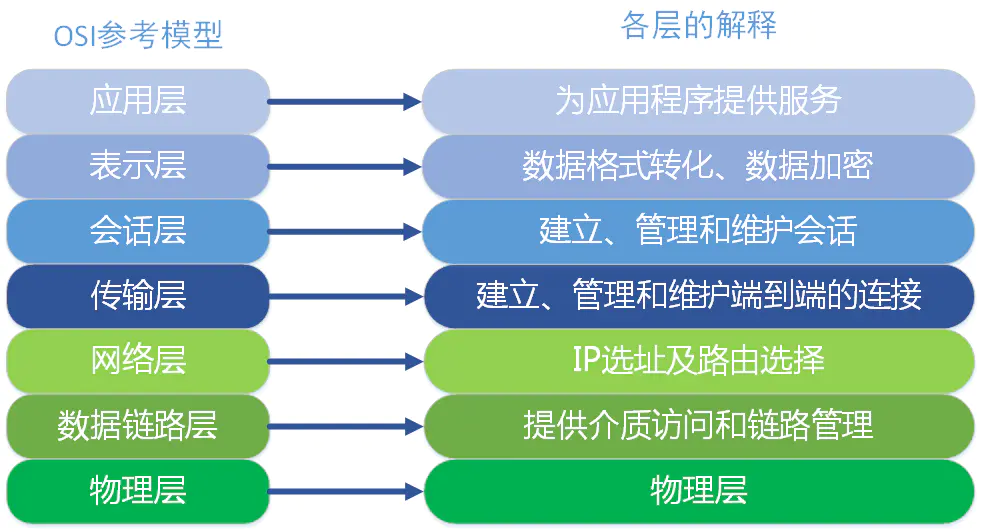
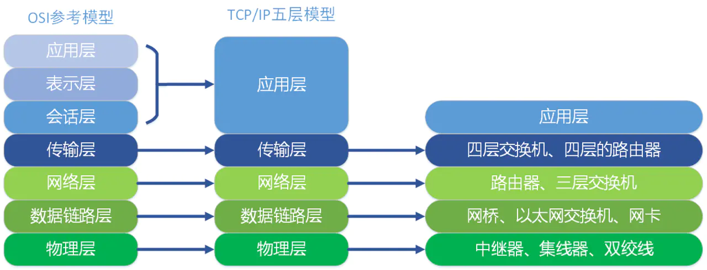
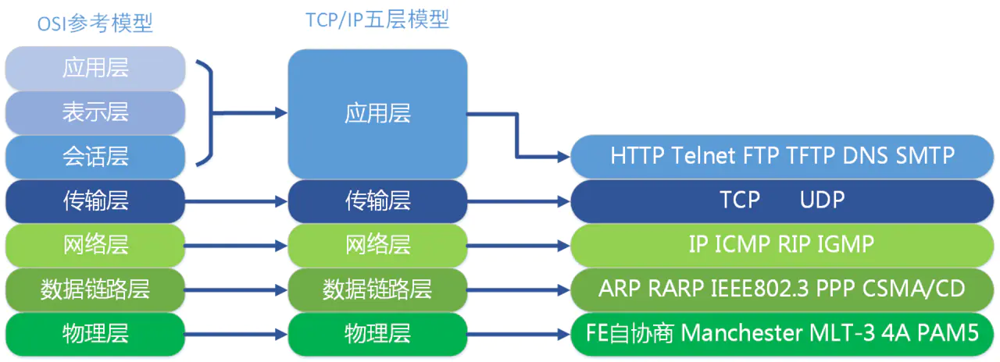
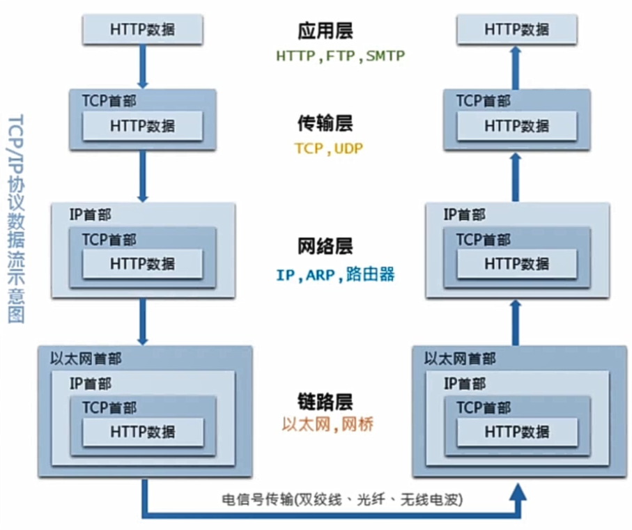

# 网络模型

## 1. OSI七层模型

`ISO`为了更好的使网络应用更为普及，推出了`OSI`参考模型。

### （1）应用层

`OSI`参考模型中最靠近用户的一层，是为计算机用户提供应用接口，也为用户直接提供各种网络服务。我们常见应用层的网络服务协议有：`HTTP`，`HTTPS`，`FTP`，`POP3`、`SMTP`等。

- 在客户端与服务器中经常会有数据的请求，这个时候就是会用到`http(hyper text transfer protocol)(超文本传输协议)`或者`https`.在后端设计数据接口时，我们常常使用到这个协议。
- `FTP`是文件传输协议，在开发过程中，个人并没有涉及到，但是我想，在一些资源网站，比如`百度网盘``迅雷`应该是基于此协议的。

- `SMTP`是`simple mail transfer protocol（简单邮件传输协议）`。在一个项目中，在用户邮箱验证码登录的功能时，使用到了这个协议。

### （2）表示层

表示层提供各种用于应用层数据的编码和转换功能,确保一个系统的应用层发送的数据能被另一个系统的应用层识别。如果必要，该层可提供一种标准表示形式，用于将计算机内部的多种数据格式转换成通信中采用的标准表示形式。数据压缩和加密也是表示层可提供的转换功能之一。

例如，`IBM`主机使用`EBCDIC`编码，而大部分`PC`机使用的是`ASCII`码。在这种情况下，便需要表示层来完成这种转换。如果您想要用尽量少的词语来记住这第6层，那就是“一种通用的数据格式”。

在项目开发中，为了方便数据传输，可以使用`base64`对数据进行编解码。如果按功能来划分，`base64`应该是工作在表示层。

### （3）会话层

会话层就是负责建立、管理和终止表示层实体之间的通信会话。该层的通信由不同设备中的应用程序之间的服务请求和响应组成。

### （4）传输层

传输层建立了主机端到端的链接，传输层的作用是为上层协议提供端到端的可靠和透明的数据传输服务，包括处理差错控制和流量控制等问题。该层向高层屏蔽了下层数据通信的细节，使高层用户看到的只是在两个传输实体间的一条主机到主机的、可由用户控制和设定的、可靠的数据通路。我们通常说的，`TCP` `UDP`就是在这一层。端口号既是这里的“端”。

### （5）网络层

本层通过`IP`寻址来建立两个节点之间的连接，为源端的运输层送来的分组，选择合适的路由和交换节点，正确无误地按照地址传送给目的端的运输层。就是通常说的`IP`层。这一层就是我们经常说的`IP`协议层。`IP`协议是`Internet`的基础。我们可以这样理解，网络层规定了数据包的传输路线，而传输层则规定了数据包的传输方式。

### （6）数据链路层

将比特组合成字节,再将字节组合成帧,使用链路层地址 (以太网使用MAC地址)来访问介质,并进行差错检测。

网络层与数据链路层的对比，通过上面的描述，我们或许可以这样理解，网络层是规划了数据包的传输路线，而数据链路层就是传输路线。不过，在数据链路层上还增加了差错控制的功能。

### （7）物理层

实际最终信号的传输是通过物理层实现的。通过物理介质传输比特流。规定了电平、速度和电缆针脚。常用设备有（各种物理设备）集线器、中继器、调制解调器、网线、双绞线、同轴电缆。这些都是物理层的传输介质。

#### 

####  OSI七层模型通信特点：对等通信

对等通信，为了使数据分组从源传送到目的地，源端OSI模型的每一层都必须与目的端的对等层进行通信，这种通信方式称为对等层通信。在每一层通信过程中，使用本层自己协议进行通信。

## 2. TCP/IP五层协议

`TCP/IP`五层协议和`OSI`的七层协议对应关系如下：

- **应用层 (application layer)**：直接为应用进程提供服务。应用层协议定义的是应用进程间通讯和交互的规则，不同的应用有着不同的应用层协议，如 HTTP协议（万维网服务）、FTP协议（文件传输）、SMTP协议（电子邮件）、DNS（域名查询）等。
- **传输层 (transport layer)**：有时也译为运输层，它负责为两台主机中的进程提供通信服务。该层主要有以下两种协议：

- 传输控制协议 (Transmission Control Protocol，TCP)：提供面向连接的、可靠的数据传输服务，数据传输的基本单位是报文段（segment）；
- 用户数据报协议 (User Datagram Protocol，UDP)：提供无连接的、尽最大努力的数据传输服务，但不保证数据传输的可靠性，数据传输的基本单位是用户数据报。

- **网络层 (internet layer)**：有时也译为网际层，它负责为两台主机提供通信服务，并通过选择合适的路由将数据传递到目标主机。
- **数据链路层 (data link layer)**：负责将网络层交下来的 IP 数据报封装成帧，并在链路的两个相邻节点间传送帧，每一帧都包含数据和必要的控制信息（如同步信息、地址信息、差错控制等）。

- **物理层 (physical Layer)**：确保数据可以在各种物理媒介上进行传输，为数据的传输提供可靠的环境。

从上面的图中，我们可以看出，`TCP/IP`模型比`OSI`模型更加简洁，它把`应用层/表示层/会话层`全部整合为了`应用层`。

在每一层都工作着不同的设备，比如我们常用的交换机就工作在数据链路层的，一般的路由器是工作在网络层的。

在每一层实现的协议也各不同，即每一层的服务也不同，下图列出了每层主要的协议：

同样，`TCP/IP`五层协议的通信方式也是对等通信：

