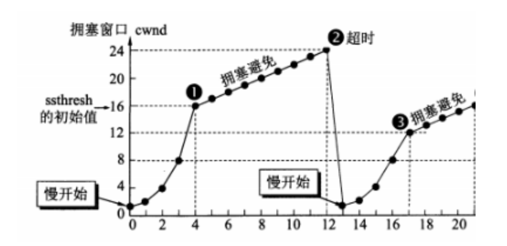
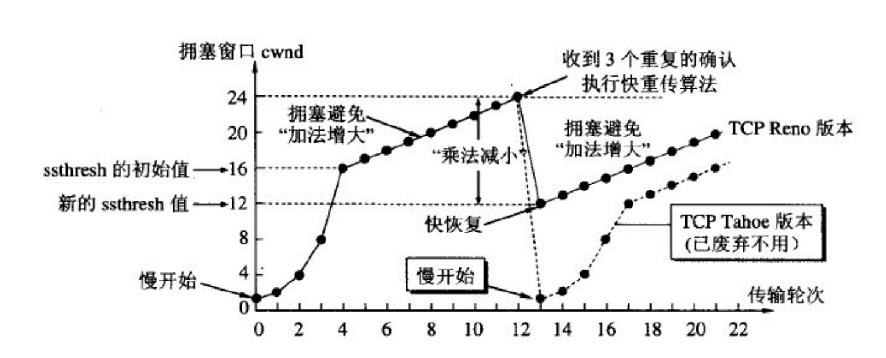

# TCP与UDP

## 1. TCP 和 UDP的概念及特点

TCP 和 UDP都是传输层协议，他们都属于TCP/IP协议族：

### （1）UDP

UDP的全称是用户数据报协议，在网络中它与TCP协议一样用于处理数据包，是一种无连接的协议。在OSI模型中，在传输层，处于IP协议的上一层。UDP有不提供数据包分组、组装和不能对数据包进行排序的缺点，也就是说，当报文发送之后，是无法得知其是否安全完整到达的。

它有以下几个特点：

**1）面向无连接**

首先 UDP 是不需要和 TCP一样在发送数据前进行三次握手建立连接的，想发数据就可以开始发送了。并且也只是数据报文的搬运工，不会对数据报文进行任何拆分和拼接操作。

具体来说就是：

- 在发送端，应用层将数据传递给传输层的 UDP 协议，UDP 只会给数据增加一个 UDP 头标识下是 UDP 协议，然后就传递给网络层了
- 在接收端，网络层将数据传递给传输层，UDP 只去除 IP 报文头就传递给应用层，不会任何拼接操作

**2）有单播，多播，广播的功能**

UDP 不止支持一对一的传输方式，同样支持一对多，多对多，多对一的方式，也就是说 UDP 提供了单播，多播，广播的功能。

**3）UDP是面向报文的**

发送方的UDP对应用程序交下来的报文，在添加首部后就向下交付IP层。UDP对应用层交下来的报文，既不合并，也不拆分，而是保留这些报文的边界。因此，应用程序必须选择合适大小的报文

**4）不可靠性**

首先不可靠性体现在无连接上，通信都不需要建立连接，想发就发，这样的情况肯定不可靠。

并且收到什么数据就传递什么数据，并且也不会备份数据，发送数据也不会关心对方是否已经正确接收到数据了。

再者网络环境时好时坏，但是 UDP 因为没有拥塞控制，一直会以恒定的速度发送数据。即使网络条件不好，也不会对发送速率进行调整。这样实现的弊端就是在网络条件不好的情况下可能会导致丢包，但是优点也很明显，在某些实时性要求高的场景（比如电话会议）就需要使用 UDP 而不是 TCP。

**5）头部开销小，传输数据报文时是很高效的。**

UDP 头部包含了以下几个数据：

- 两个十六位的端口号，分别为源端口（可选字段）和目标端口
- 整个数据报文的长度

- 整个数据报文的检验和（IPv4 可选 字段），该字段用于发现头部信息和数据中的错误

因此 UDP 的头部开销小，只有八字节，相比 TCP 的至少二十字节要少得多，在传输数据报文时是很高效的

### （2）TCP

TCP的全称是传输控制协议是一种面向连接的、可靠的、基于字节流的传输层通信协议。TCP 是面向连接的、可靠的流协议。流就是指不间断的数据结构。

它有以下几个特点：

**1）面向连接**
面向连接，是指发送数据之前必须在两端建立连接。建立连接的方法是“三次握手”，这样能建立可靠的连接。建立连接，是为数据的可靠传输打下了基础。

**2）仅支持单播传输**

每条TCP传输连接只能有两个端点，只能进行点对点的数据传输，不支持多播和广播传输方式。

**3）面向字节流**

TCP不像UDP一样那样一个个报文独立地传输，而是在不保留报文边界的情况下以字节流方式进行传输。

**4）可靠传输**
对于可靠传输，判断丢包，误码靠的是TCP的段编号以及确认号。TCP为了保证报文传输的可靠，就给每个包一个序号，同时序号也保证了传送到接收端实体的包的按序接收。然后接收端实体对已成功收到的字节发回一个相应的确认(ACK)；如果发送端实体在合理的往返时延(RTT)内未收到确认，那么对应的数据（假设丢失了）将会被重传。

**5）提供拥塞控制**

当网络出现拥塞的时候，TCP能够减小向网络注入数据的速率和数量，缓解拥塞

**6）提供全双工通信**

TCP允许通信双方的应用程序在任何时候都能发送数据，因为TCP连接的两端都设有缓存，用来临时存放双向通信的数据。当然，TCP可以立即发送一个数据段，也可以缓存一段时间以便一次发送更多的数据段（最大的数据段大小取决于MSS）

## 2. TCP和UDP的区别

|              | UDP                                        | TCP                                                  |
| ------------ | ------------------------------------------ | ---------------------------------------------------- |
| 是否连接     | 无连接                                     | 面向连接                                             |
| 是否可靠     | 不可靠传输，不使用流量控制和拥塞控制       | 可靠传输（数据顺序和正确性），使用流量控制和拥塞控制 |
| 连接对象个数 | 支持一对一，一对多，多对一和多对多交互通信 | 只能是一对一通信                                     |
| 传输方式     | 面向报文                                   | 面向字节流                                           |
| 首部开销     | 首部开销小，仅8字节                        | 首部最小20字节，最大60字节                           |
| 适用场景     | 适用于实时应用（IP电话、视频会议、直播等） | 适用于要求可靠传输的应用，例如文件传输               |

## 3. TCP和UDP的使用场景

**TCP应用场景：** 效率要求相对低，但对准确性要求相对高的场景。因为传输中需要对数据确认、重发、排序等操作，相比之下效率没有UDP高。例如：文件传输（准确高要求高、但是速度可以相对慢）、接受邮件、远程登录。

**UDP应用场景：** 效率要求相对高，对准确性要求相对低的场景。例如：QQ聊天、在线视频、网络语音电话（即时通讯，速度要求高，但是出现偶尔断续不是太大问题，并且此处完全不可以使用重发机制）、广播通信（广播、多播）。

## 4. UDP协议为什么不可靠？

UDP在传输数据之前不需要先建立连接，远地主机的运输层在接收到UDP报文后，不需要确认，提供不可靠交付。总结就以下四点：

- 不保证消息交付：不确认，不重传，无超时
- 不保证交付顺序：不设置包序号，不重排，不会发生队首阻塞

- 不跟踪连接状态： 不必建立连接或重启状态机
- 不进行拥塞控制： 不内置客户端或网络反馈机制

## 5. TCP的重传机制

由于TCP的下层网络（网络层）可能出现**丢失、重复或失序**的情况，TCP协议提供可靠数据传输服务。为保证数据传输的正确性，TCP会重传其认为已丢失（包括报文中的比特错误）的包。TCP使用两套独立的机制来完成重传，一是**基于时间**，二是**基于确认信息**。

TCP在发送一个数据之后，就开启一个定时器，若是在这个时间内没有收到发送数据的ACK确认报文，则对该报文进行重传，在达到一定次数还没有成功时放弃并发送一个复位信号。

## 6. TCP的拥塞控制机制

TCP的拥塞控制机制主要是以下四种机制：

- 慢启动（慢开始）
- 拥塞避免

- 快速重传
- 快速恢复

**（1）慢启动（慢开始）**

- 在开始发送的时候设置cwnd = 1（cwnd指的是拥塞窗口）
- 思路：开始的时候不要发送大量数据，而是先测试一下网络的拥塞程度，由小到大增加拥塞窗口的大小。

- 为了防止cwnd增长过大引起网络拥塞，设置一个慢开始门限(ssthresh 状态变量)

- 当cnwd < ssthresh，使用慢开始算法
- 当cnwd = ssthresh，既可使用慢开始算法，也可以使用拥塞避免算法

- 当cnwd > ssthresh，使用拥塞避免算法

**（2）拥塞避免**

- 拥塞避免未必能够完全避免拥塞，是说在拥塞避免阶段将拥塞窗口控制为按线性增长，使网络不容易出现阻塞。
- 思路： 让拥塞窗口cwnd缓慢的增大，即每经过一个返回时间RTT就把发送方的拥塞控制窗口加一

- 无论是在慢开始阶段还是在拥塞避免阶段，只要发送方判断网络出现拥塞，就把慢开始门限设置为出现拥塞时的发送窗口大小的一半。然后把拥塞窗口设置为1，执行慢开始算法。如图所示:
  
  其中，判断网络出现拥塞的根据就是没有收到确认，虽然没有收到确认可能是其他原因的分组丢失，但是因为无法判定，所以都当做拥塞来处理。

**（3）快速重传**

- 快重传要求接收方在收到一个失序的报文段后就立即发出重复确认(为的是使发送方及早知道有报文段没有到达对方)。快重传算法规定，发送方只要连续收到三个重复确认就立即重传对方尚未收到的报文段，而不必继续等待设置的重传计时器时间到期。
- 由于不需要等待设置的重传计时器到期，能尽早重传未被确认的报文段，能提高整个网络的吞吐量

**（4） 快速恢复**

- 当发送方连续收到三个重复确认时，就执行“乘法减小”算法，把ssthresh门限减半。但是接下去并不执行慢开始算法。
- 考虑到如果网络出现拥塞的话就不会收到好几个重复的确认，所以发送方现在认为网络可能没有出现拥塞。所以此时不执行慢开始算法，而是将cwnd设置为ssthresh的大小，然后执行拥塞避免算法。
  

## 7. TCP的流量控制机制

一般来说，流量控制就是为了让发送方发送数据的速度不要太快，要让接收方来得及接收。

TCP采用大小可变的**滑动窗口**进行流量控制，窗口大小的单位是字节。这里说的窗口大小其实就是每次传输几个数据。

- 当一个连接建立时，连接的每一端分配一个缓冲区来保存输入的数据，并将缓冲区的大小发送给另一端。
- 当数据到达时，接收方发送确认，其中包含了自己剩余的缓冲区大小。（剩余的缓冲区空间的大小被称为窗口，指出窗口大小的通知称为窗口通告 。接收方在发送的每一确认中都含有一个窗口通告。）

- 如果接收方应用程序读数据的速度能够与数据到达的速度一样快，接收方将在每一确认中发送一个正的窗口通告。
- 如果发送方操作的速度快于接收方，接收到的数据最终将充满接收方的缓冲区，导致接收方通告一个零窗口 。发送方收到一个零窗口通告时，必须停止发送，直到接收方重新通告一个正的窗口。

## 8. TCP的可靠运输机制

TCP 的可靠运输机制是基于连续 ARQ 协议和滑动窗口协议的。

TCP 协议在发送方维持了一个发送窗口，发送窗口以前的报文段是已经发送并确认了的报文段，发送窗口中包含了已经发送但 未确认的报文段和允许发送但还未发送的报文段，发送窗口以后的报文段是缓存中还不允许发送的报文段。当发送方向接收方发 送报文时，会依次发送窗口内的所有报文段，并且设置一个定时器，这个定时器可以理解为是最早发送但未收到确认的报文段。 如果在定时器的时间内收到某一个报文段的确认回答，则滑动窗口，将窗口的首部向后滑动到确认报文段的后一个位置，此时如 果还有已发送但没有确认的报文段，则重新设置定时器，如果没有了则关闭定时器。如果定时器超时，则重新发送所有已经发送 但还未收到确认的报文段，并将超时的间隔设置为以前的两倍。当发送方收到接收方的三个冗余的确认应答后，这是一种指示， 说明该报文段以后的报文段很有可能发生丢失了，那么发送方会启用快速重传的机制，就是当前定时器结束前，发送所有的已发 送但确认的报文段。

接收方使用的是累计确认的机制，对于所有按序到达的报文段，接收方返回一个报文段的肯定回答。如果收到了一个乱序的报文 段，那么接方会直接丢弃，并返回一个最近的按序到达的报文段的肯定回答。使用累计确认保证了返回的确认号之前的报文段都 已经按序到达了，所以发送窗口可以移动到已确认报文段的后面。

发送窗口的大小是变化的，它是由接收窗口剩余大小和网络中拥塞程度来决定的，TCP 就是通过控制发送窗口的长度来控制报文 段的发送速率。

但是 TCP 协议并不完全和滑动窗口协议相同，因为许多的 TCP 实现会将失序的报文段给缓存起来，并且发生重传时，只会重 传一个报文段，因此 TCP 协议的可靠传输机制更像是窗口滑动协议和选择重传协议的一个混合体。

## 9. TCP的三次握手和四次挥手

### （1）三次握手

三次握手（Three-way Handshake）其实就是指建立一个TCP连接时，需要客户端和服务器总共发送3个包。进行三次握手的主要作用就是为了确认双方的接收能力和发送能力是否正常、指定自己的初始化序列号为后面的可靠性传送做准备。实质上其实就是连接服务器指定端口，建立TCP连接，并同步连接双方的序列号和确认号，交换TCP窗口大小信息。

刚开始客户端处于 Closed 的状态，服务端处于 Listen 状态。

- 第一次握手：客户端给服务端发一个 SYN 报文，并指明客户端的初始化序列号 ISN，此时客户端处于 SYN_SEND 状态。

首部的同步位SYN=1，初始序号seq=x，SYN=1的报文段不能携带数据，但要消耗掉一个序号。

- 第二次握手：服务器收到客户端的 SYN 报文之后，会以自己的 SYN 报文作为应答，并且也是指定了自己的初始化序列号 ISN。同时会把客户端的 ISN + 1 作为ACK 的值，表示自己已经收到了客户端的 SYN，此时服务器处于 SYN_REVD 的状态。

在确认报文段中SYN=1，ACK=1，确认号ack=x+1，初始序号seq=y

- 第三次握手：客户端收到 SYN 报文之后，会发送一个 ACK 报文，当然，也是一样把服务器的 ISN + 1 作为 ACK 的值，表示已经收到了服务端的 SYN 报文，此时客户端处于 ESTABLISHED 状态。服务器收到 ACK 报文之后，也处于 ESTABLISHED 状态，此时，双方已建立起了连接。

确认报文段ACK=1，确认号ack=y+1，序号seq=x+1（初始为seq=x，第二个报文段所以要+1），ACK报文段可以携带数据，不携带数据则不消耗序号。

**那为什么要三次握手呢？两次不行吗？**

- 为了确认双方的接收能力和发送能力都正常
- 如果是用两次握手，则会出现下面这种情况：

如客户端发出连接请求，但因连接请求报文丢失而未收到确认，于是客户端再重传一次连接请求。后来收到了确认，建立了连接。数据传输完毕后，就释放了连接，客户端共发出了两个连接请求报文段，其中第一个丢失，第二个到达了服务端，但是第一个丢失的报文段只是在某些网络结点长时间滞留了，延误到连接释放以后的某个时间才到达服务端，此时服务端误认为客户端又发出一次新的连接请求，于是就向客户端发出确认报文段，同意建立连接，不采用三次握手，只要服务端发出确认，就建立新的连接了，此时客户端忽略服务端发来的确认，也不发送数据，则服务端一致等待客户端发送数据，浪费资源。

**简单来说就是以下三步：**

- **第一次握手：**客户端向服务端发送连接请求报文段。该报文段中包含自身的数据通讯初始序号。请求发送后，客户端便进入 SYN-SENT 状态。
- **第二次握手：**服务端收到连接请求报文段后，如果同意连接，则会发送一个应答，该应答中也会包含自身的数据通讯初始序号，发送完成后便进入 SYN-RECEIVED 状态。

- **第三次握手：**当客户端收到连接同意的应答后，还要向服务端发送一个确认报文。客户端发完这个报文段后便进入 ESTABLISHED 状态，服务端收到这个应答后也进入 ESTABLISHED 状态，此时连接建立成功。

TCP 三次握手的建立连接的过程就是相互确认初始序号的过程，告诉对方，什么样序号的报文段能够被正确接收。 第三次握手的作用是客户端对服务器端的初始序号的确认。如果只使用两次握手，那么服务器就没有办法知道自己的序号是否 已被确认。同时这样也是为了防止失效的请求报文段被服务器接收，而出现错误的情况。

### （2）四次挥手

刚开始双方都处于 ESTABLISHED 状态，假如是客户端先发起关闭请求。四次挥手的过程如下：

- 第一次挥手： 客户端会发送一个 FIN 报文，报文中会指定一个序列号。此时客户端处于 FIN_WAIT1 状态。

即发出连接释放报文段（FIN=1，序号seq=u），并停止再发送数据，主动关闭TCP连接，进入FIN_WAIT1（终止等待1）状态，等待服务端的确认。

- 第二次挥手：服务端收到 FIN 之后，会发送 ACK 报文，且把客户端的序列号值 +1 作为 ACK 报文的序列号值，表明已经收到客户端的报文了，此时服务端处于 CLOSE_WAIT 状态。

即服务端收到连接释放报文段后即发出确认报文段（ACK=1，确认号ack=u+1，序号seq=v），服务端进入CLOSE_WAIT（关闭等待）状态，此时的TCP处于半关闭状态，客户端到服务端的连接释放。客户端收到服务端的确认后，进入FIN_WAIT2（终止等待2）状态，等待服务端发出的连接释放报文段。

- 第三次挥手：如果服务端也想断开连接了，和客户端的第一次挥手一样，发给 FIN 报文，且指定一个序列号。此时服务端处于 LAST_ACK 的状态。

即服务端没有要向客户端发出的数据，服务端发出连接释放报文段（FIN=1，ACK=1，序号seq=w，确认号ack=u+1），服务端进入LAST_ACK（最后确认）状态，等待客户端的确认。

- 第四次挥手：客户端收到 FIN 之后，一样发送一个 ACK 报文作为应答，且把服务端的序列号值 +1 作为自己 ACK 报文的序列号值，此时客户端处于 TIME_WAIT 状态。需要过一阵子以确保服务端收到自己的 ACK 报文之后才会进入 CLOSED 状态，服务端收到 ACK 报文之后，就处于关闭连接了，处于 CLOSED 状态。

即客户端收到服务端的连接释放报文段后，对此发出确认报文段（ACK=1，seq=u+1，ack=w+1），客户端进入TIME_WAIT（时间等待）状态。此时TCP未释放掉，需要经过时间等待计时器设置的时间2MSL后，客户端才进入CLOSED状态。

**那为什么需要四次挥手呢？**

因为当服务端收到客户端的SYN连接请求报文后，可以直接发送SYN+ACK报文。其中ACK报文是用来应答的，SYN报文是用来同步的。但是关闭连接时，当服务端收到FIN报文时，很可能并不会立即关闭SOCKET，所以只能先回复一个ACK报文，告诉客户端，“你发的FIN报文我收到了”。只有等到我服务端所有的报文都发送完了，我才能发送FIN报文，因此不能一起发送，故需要四次挥手。

**简单来说就是以下四步：**

- **第一次****挥手****：**若客户端认为数据发送完成，则它需要向服务端发送连接释放请求。
- **第二次****挥手**：服务端收到连接释放请求后，会告诉应用层要释放 TCP 链接。然后会发送 ACK 包，并进入 CLOSE_WAIT 状态，此时表明客户端到服务端的连接已经释放，不再接收客户端发的数据了。但是因为 TCP 连接是双向的，所以服务端仍旧可以发送数据给客户端。

- **第三次挥手**：服务端如果此时还有没发完的数据会继续发送，完毕后会向客户端发送连接释放请求，然后服务端便进入 LAST-ACK 状态。
- **第四次****挥手****：**客户端收到释放请求后，向服务端发送确认应答，此时客户端进入 TIME-WAIT 状态。该状态会持续 2MSL（最大段生存期，指报文段在网络中生存的时间，超时会被抛弃） 时间，若该时间段内没有服务端的重发请求的话，就进入 CLOSED 状态。当服务端收到确认应答后，也便进入 CLOSED 状态。

TCP 使用四次挥手的原因是因为 TCP 的连接是全双工的，所以需要双方分别释放到对方的连接，单独一方的连接释放，只代 表不能再向对方发送数据，连接处于的是半释放的状态。

最后一次挥手中，客户端会等待一段时间再关闭的原因，是为了防止发送给服务器的确认报文段丢失或者出错，从而导致服务器 端不能正常关闭。