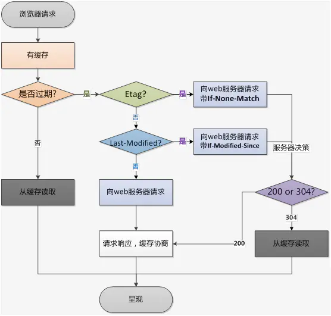

### 1. 为什么需要浏览器缓存？

对于浏览器的缓存，主要针对的是前端的静态资源，最好的效果就是，在发起请求之后，拉取相应的静态资源，并保存在本地。如果服务器的静态资源没有更新，那么在下次请求的时候，就直接从本地读取即可，如果服务器的静态资源已经更新，那么我们再次请求的时候，就到服务器拉取新的资源，并保存在本地。这样就大大的减少了请求的次数，提高了网站的性能。这就要用到浏览器的缓存策略了。

所谓的**浏览器缓存**指的是浏览器将用户请求过的静态资源，存储到电脑本地磁盘中，当浏览器再次访问时，就可以直接从本地加载，不需要再去服务端请求了。

使用浏览器缓存，有以下优点：

- 减少了服务器的负担，提高了网站的性能
- 加快了客户端网页的加载速度

- 减少了多余网络数据传输

### 2. 浏览器缓存规则

想要完成上述步骤，就需要浏览器的**强缓存**和**协商缓存**共同协作完成。

#### 2.1 强缓存

使用强缓存策略时，如果缓存资源有效，则直接使用缓存资源，不必再向服务器发起请求。

强缓存策略可以通过两种方式来设置，分别是 http 头信息中的 Expires 属性和 Cache-Control 属性。

（1）服务器通过在响应头中添加 Expires 属性，来指定资源的过期时间。在过期时间以内，该资源可以被缓存使用，不必再向服务器发送请求。这个时间是一个绝对时间，它是服务器的时间，因此可能存在这样的问题，就是客户端的时间和服务器端的时间不一致，或者用户可以对客户端时间进行修改的情况，这样就可能会影响缓存命中的结果。

（2）Expires 是 http1.0 中的方式，因为它的一些缺点，在 HTTP 1.1 中提出了一个新的头部属性就是 Cache-Control 属性，它提供了对资源的缓存的更精确的控制。它有很多不同的值，

`Cache-Control`可设置的字段值有很多，下面逐一介绍：

- `public`：设置了该字段值的资源表示可以被任何对象（包括：发送请求的客户端、代理服务器等等）缓存。这个字段值不常用，一般还是使用max-age=来精确控制；
- `private`：设置了该字段值的资源只能被用户浏览器缓存，不允许任何代理服务器缓存。在实际开发当中，对于一些含有用户信息的HTML，通常都要设置这个字段值，避免代理服务器(CDN)缓存；

- `no-cache`：设置了该字段需要先和服务端确认返回的资源是否发生了变化，如果资源未发生变化，则直接使用缓存好的资源；
- `no-store`：设置了该字段表示禁止任何缓存，每次都会向服务端发起新的请求，拉取最新的资源；

- `max-age=`：设置缓存的最大有效期，单位为秒；
- `s-maxage=`：优先级高于max-age=，仅适用于共享缓存(CDN)，优先级高于max-age或者Expires头；

- `max-stale[=]`：设置了该字段表明客户端愿意接收已经过期的资源，但是不能超过给定的时间限制。

一般来说只需要设置其中一种方式就可以实现强缓存策略，当两种方式一起使用时，Cache-Control 的优先级要高于 Expires。

**no-cache和no-store很容易混淆：**

1. no-cache 是指先要和服务器确认是否有资源更新，在进行判断。也就是说没有强缓存，但是会有协商缓存；
2. no-store 是指不使用任何缓存，每次请求都直接从服务器获取资源。

#### 2.2 协商缓存

如果命中强制缓存，我们无需发起新的请求，直接使用缓存内容，如果没有命中强制缓存，如果设置了协商缓存，这个时候协商缓存就会发挥作用了。

上面已经说到了，命中协商缓存的条件有两个：

- `max-age=xxx` 过期了
- 值为`no-store`

使用协商缓存策略时，会先向服务器发送一个请求，如果资源没有发生修改，则返回一个 304 状态，让浏览器使用本地的缓存副本。如果资源发生了修改，则返回修改后的资源。

协商缓存也可以通过两种方式来设置，分别是 http 头信息中的 **Etag** 和 **Last-Modified** 属性。

（1）服务器通过在响应头中添加 Last-Modified 属性来指出资源最后一次修改的时间，当浏览器下一次发起请求时，会在请求头中添加一个 If-Modified-Since 的属性，属性值为上一次资源返回时的 Last-Modified 的值。当请求发送到服务器后服务器会通过这个属性来和资源的最后一次的修改时间来进行比较，以此来判断资源是否做了修改。如果资源没有修改，那么返回 304 状态，让客户端使用本地的缓存。如果资源已经被修改了，则返回修改后的资源。使用这种方法有一个缺点，就是 Last-Modified 标注的最后修改时间只能精确到秒级，如果某些文件在1秒钟以内，被修改多次的话，那么文件已将改变了但是 Last-Modified 却没有改变，这样会造成缓存命中的不准确。

（2）因为 Last-Modified 的这种可能发生的不准确性，http 中提供了另外一种方式，那就是 Etag 属性。服务器在返回资源的时候，在头信息中添加了 Etag 属性，这个属性是资源生成的唯一标识符，当资源发生改变的时候，这个值也会发生改变。在下一次资源请求时，浏览器会在请求头中添加一个 If-None-Match 属性，这个属性的值就是上次返回的资源的 Etag 的值。服务接收到请求后会根据这个值来和资源当前的 Etag 的值来进行比较，以此来判断资源是否发生改变，是否需要返回资源。通过这种方式，比 Last-Modified 的方式更加精确。

当 Last-Modified 和 Etag 属性同时出现的时候，Etag 的优先级更高。使用协商缓存的时候，服务器需要考虑负载平衡的问题，因此多个服务器上资源的 Last-Modified 应该保持一致，因为每个服务器上 Etag 的值都不一样，因此在考虑负载平衡时，最好不要设置 Etag 属性。

### 3. 总结

浏览器缓存这一块，最重要的是能区分开**强制缓存**和**协商缓存**：**完全不向服务器发送请求的是强制缓存，向服务器发送请求的是协商缓存，涉及到 304 的都是协商缓存。**

总结一下浏览器缓存的全过程：

1. 浏览器第一次加载资源，服务器返回 200，浏览器从服务器下载资源文件，并缓存住资源文件与 response header 以供下次加载时对比使用；
2. 下一次加载资源时，由于强制缓存优先级较高，先比较当前时间与上一次返回 200 时的时间差，如果没有超过 cache-control 设置的 max-age，则没有过期，并命中强缓存，直接从本地读取资源。如果浏览器不支持HTTP1.1，则使用 expires 头判断是否过期；

1. 如果资源已过期，则表明强制缓存没有被命中，则开始协商缓存，向服务器发送带有 If-None-Match 和 If-Modified-Since 的请求；
2. 服务器收到请求后，优先根据 Etag 的值判断被请求的文件有没有做修改，Etag 值一致则没有修改，命中协商缓存，返回 304；如果不一致则有改动，直接返回新的资源文件带上新的 Etag 值并返回 200；

1. 如果服务器收到的请求没有 Etag 值，则将 If-Modified-Since 和被请求文件的最后修改时间做比对，一致则命中协商缓存，返回 304；不一致则返回新的 last-modified 和文件并返回 200；

流程图如下：

