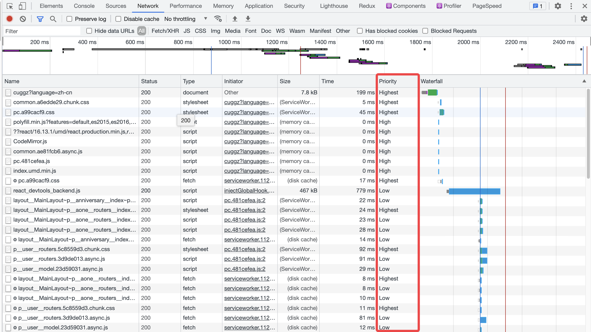
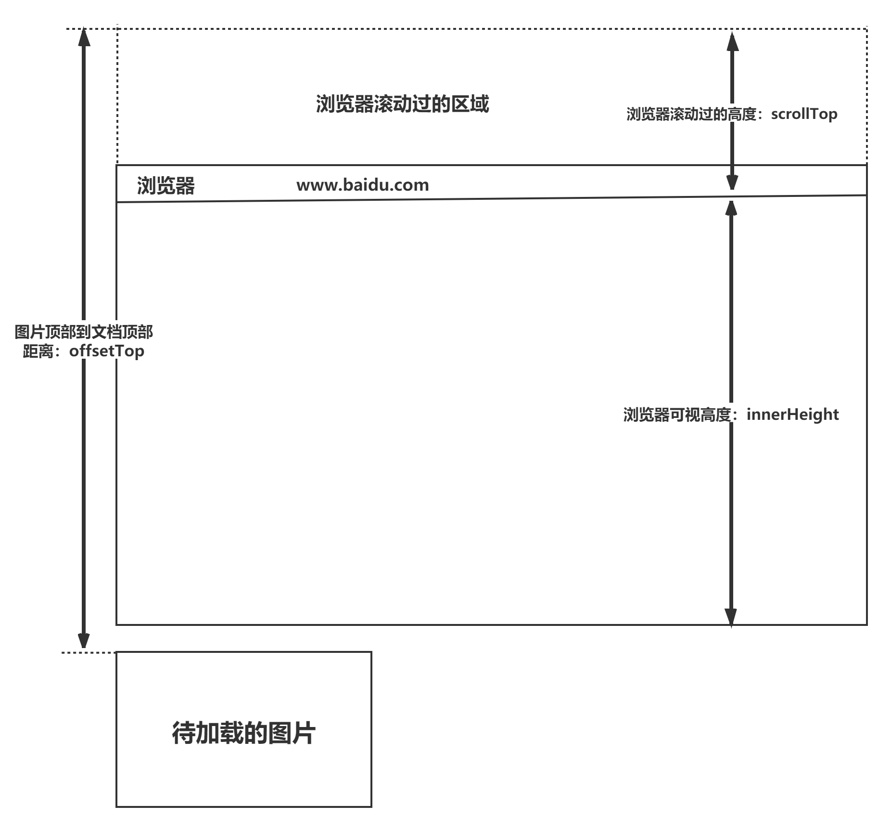
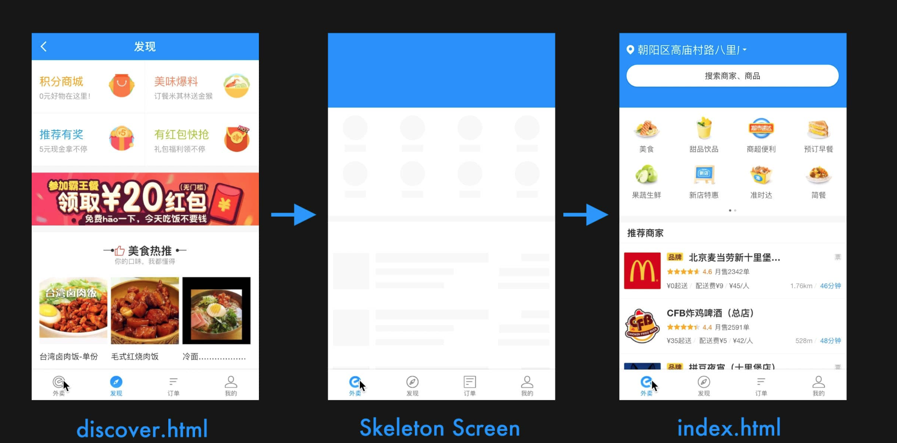

### 1. 资源加载优先级

在浏览器发起网络请求时，并非每个字节都具有相同的优先级，所以，浏览器通常会对所要加载的内容进行推测，将相对重要的信息先呈现给用户。比如浏览器一般会先加载CSS，再去加载JavaScript脚本和图像文件。当然，浏览器的判断并不一定都是准确的，下面就来看看如何影响浏览器对资源加载的优先级。


浏览器是基于自身的启发式算法，会对资源的重要性进行判断，来划分优先级，通常从低到高分为Lowest、Low、High、Highest等。比如在head标签中，CSS文件通常具有最高的优先级Hightest，其次是script标签所请求的脚本文件，当script带有defer或async的异步属性时，其优先级就会降低到Low。可以通过浏览器控制台查看资源的优先级（priority优先级选项默认不显示，可以在开发者工具网络面板中右键点击列标题来启用优先级列）：



通过浏览器的控制台就看到了不同资源的优先级情况。下面就来看看如果修改资源加载的优先级。


当页面的资源对用户来说比较重要，又被默认分配为较低优先级时，就可以使用资源的预处理或预连接，如果仅需要浏览器处理完一些任务之后，再去提取某些资源，就可以使用资源的欲提取。

#### （1）预加载

预加载应该是我们常听说的，可以使用`<link ref="preload">`来告诉浏览器当前指定的资源应该具有更高的优先级，需要尽快开始加载资源：

```html
<link ref="preload" as="script" href="important.js">
```

这里我们给link标签指定了一个as属性，它会告诉浏览器所要加载的资源的类型，当前需要加载的资源必须是这个指定类型的资源，不然不会进行预加载。需要注意的是，`<link ref="preload">`是浏览器的强制性指令，preload后浏览器就必定去预加载相应的资源。使用时需要仔细测试，确保不会因为使用它而意外导致资源加载2次。


**字体资源的预加载**就是一个很好的例子，当使用非系统字体时，需要引入字体文件，字体文件通常都位于页面加载的CSS文件的末尾，为了减少用户等待站点文本内容的时间，以及避免系统字体与样式中定义的字体之间应用时的闪烁，可以在HTML中使用`<link rel ="preload">` 让浏览器知道样式文件中需要加载的字体资源：

```html
<link ref="preload" as="font" crossorign="crossorign" type="font/woff2" href="font.woff2">
```

需要注意，这里的crossorign属性很重要，如果缺失，浏览器将忽略预加载的字体，并发起一个新的请求。因为浏览器使用匿名请求加载字体，只有使用`crossorigin`属性可以使预加载请求匿名。

#### （2）预连接

我们知道，在较慢的网络环境下建立网络连接是非常耗时的，如果想建立安全连接将更加好事（例如HTTPS连接）。其原因主要是整个过程涉及到了DNS解析、重定向、三次握手过程等。如果能提前完后才能上述操作，那么就能带来更好的用户体验，与此同时，由于建立连接的大部分时间是消耗在等待的时间上，这样也能有效的优化宽度的使用情况。这时我们就可以使用预连接：

```html
<link ref="preconnect" href="https://juejin.cn/">
```

这里通过`<link ref="preconnect">`指令，告诉浏览器当前页面将与站点之间建立连接，希望尽快启动该过程。虽然这么做成本很低，但是会消耗抱回的CPU的时间，特别是在简历HTTPS安全连接时，如果建立好连接的10s之内没有使用该连接，浏览器就会关闭该连接，那么之前所有准备的资源就都浪费了。


除此之外，还有一种和预连接相关的类型`<link ref="dns-prefetch">`，也就是DNS预解析，它仅用来处理DNS查询。该属性在浏览器的支持度很高，并且可以明显缩短DNS的查询时间，所以被普遍使用。


**流媒体资源的预连接**就是一个很好的例子，对于不同来源的流媒体，我们希望在连接阶段节省一些时间但不一定立即开始获取内容。根据页面处理流内容的方式，可能需要等到脚本加载完毕并做好准备后才处理流。一旦准备加载资源，预连接可帮助我们缩短单次往返的等待时间。

#### （3）预提取

前面所说的预解析和预连接都是试图更快的获取关键的资源，而接下来要说的预提取则是利用机会让某些非关键资源提前获取。


预提取就是根据用户已发生的行为来判断接下来的预期行为，告诉浏览器稍后可能需要的资源，也就是当页面加载完成之后，且在宽带可用的情况下，这些资源将以lowest的优先级进行提取。


从上面的描述中可知，预提取最适合的场景就是为用户的下一步可能的操作做好必要的准备，比如在搜索框搜索内容时，可以预提取结果列表中首个内容的详情页，或者在使用搜索查询是，预提取搜索结果的下一页的内容。

### 2. 图片懒加载

#### （1）什么是懒加载

懒加载也叫做延迟加载、按需加载，指的是在长网页中延迟加载图片数据，是一种较好的网页性能优化的方式。在比较长的网页或应用中，如果图片很多，所有的图片都被加载出来，而用户只能看到可视窗口的那一部分图片数据，这样就浪费了性能。


使用图片懒加载就可以解决上述问题。在滚动屏幕之前，可视化区域之外的图片不会进行加载，在滚动屏幕时才加载。懒加载适用于图片较多，页面较长的页面场景中。


**懒加载与预加载的区别：**一个是提前加载，一个是迟缓甚至不加载。懒加载对服务器前端有一定的缓解压力作用，预加载则会增加服务器前端压力。

- **懒加载**：指的是在长网页中延迟加载图片的时机，当用户需要访问时，再去加载，这样可以提高网站的首屏加载速度，提升用户的体验，并且可以减少服务器的压力。它适用于图片很多，页面很长的电商网站的场景。懒加载的实现原理是，将页面上的图片的 src 属性设置为空字符串，将图片的真实路径保存在一个自定义属性中，当页面滚动的时候，进行判断，如果图片进入页面可视区域内，则从自定义属性中取出真实路径赋值给图片的 src 属性，以此来实现图片的延迟加载。
- **预加载：**指的是将所需的资源提前请求加载到本地，这样后面在需要用到时就直接从缓存取资源。通过预加载能够减少用户的等待时间，提高用户的体验。我了解的预加载的最常用的方式是使用 js 中的 image 对象，通过为 image 对象来设置 scr 属性，来实现图片的预加载。


使用懒加载的**好处：**

- **减少无用资源的加载**：使用懒加载明显减少了服务器的压力和流量，同时也减小了浏览器的负担；
- **提升用户体验**: 如果同时加载较多图片，可能需要等待的时间较长，这样影响了用户体验，而使用懒加载就能大大的提高用户体验；

- **防止加载过多图片而影响其他资源文件的加载** ：会影响网站应用的正常使用。

#### （2）传统方式实现

图片的加载是由`src`引起的，当对`src`赋值时，浏览器就会请求图片资源。根据这个原理，可以使用HTML5 的`data-xxx`属性来储存图片的路径，在需要加载图片时，将`data-xxx`中图片的路径赋值给`src`，这样就实现了图片的按需加载，即懒加载。


**注意**：`data-xxx` 中的`xxx`可以自定义，这里我们使用`data-src`来定义。


懒加载的实现重点在于确定用户需要加载哪张图片。在浏览器中，可视区域内的资源就是用户需要的资源。所以当图片出现在可视区域时，获取图片的真实地址并赋值给图片即可。这里使用 JavaScript 来实现懒加载。


相关知识点：

- `window.innerHeight` 是浏览器可视区的高度
- `document.body.scrollTop || document.documentElement.scrollTop` 是浏览器滚动的过的距离

- `imgs.offsetTop` 是元素顶部距离文档顶部的高度（包括滚动条的距离）
- 图片加载条件：`img.offsetTop < window.innerHeight + document.body.scrollTop;`


**图示：**



**代码实现：**

```js
<div class="container">
     
     
     
     
     
     
</div>
<script>
var imgs = document.querySelectorAll('img');
function lozyLoad(){
 	var scrollTop = document.body.scrollTop || document.documentElement.scrollTop;
 	var winHeight= window.innerHeight;
 	for(var i=0; i < imgs.length; i++){
   if(imgs[i].offsetTop < scrollTop + winHeight ){
   	imgs[i].src = imgs[i].getAttribute('data-src');
   }
 	}
 }
  window.onscroll = lozyLoad();
</script>
```

图片在进行懒加载时，需要不断监听scroll事件，然后判断图片是否已经在可视区域中，如果已经在可视区域就进行加载，如果没有则无需进行拉取。我们知道，scroll这类事件会被频繁触发，对性能的影响很大。那么针对这个scroll事件，可以使用节流函数包一下，让它隔一段时间再去触发，避免多余性能消耗，代码如下：

```js
const imgLazyLoad = throttle(() => console.log('懒加载操作'), 1000)
document.addEventListener('scroll', imgLazyLoad)
```

用封装好的throttle去包装好懒加载操作，这样用户在频繁滚动滚动条的时候就不会产生因为频繁触发而带来的性能问题，这也是节流函数非常典型的一个应用。

#### （3）Intersection Observer实现

Intersection Observer是HTML5新增的API，可以用来实现图片懒加载。MDN中对Intersection Observer的解释：

**IntersectionObserver****接口** (从属于[Intersection Observer API](https://developer.mozilla.org/en-US/docs/Web/API/Intersection_Observer_API)) 提供了一种异步观察目标元素与其祖先元素或顶级文档视窗([viewport](https://developer.mozilla.org/zh-CN/docs/Glossary/Viewport))交叉状态的方法。祖先元素与视窗([viewport](https://developer.mozilla.org/zh-CN/docs/Glossary/Viewport))被称为**根(root)。**


当一个`IntersectionObserver`对象被创建时，其被配置为监听根中一段给定比例的可见区域。一旦IntersectionObserver被创建，则无法更改其配置，所以一个给定的观察者对象只能用来监听可见区域的特定变化值；然而，你可以在同一个观察者对象中配置监听多个目标元素。

上面使用节流来解决了scroll频繁触发的问题，这也说明传统的图片懒加载方案是存在一定问题的；而Intersection Observer不需要监听scroll事件，可以做到只要图片元素出现在可视区域内，就能进行回调，具体如下：

```js
document.addEventListener("DOMContentLoaded", function() {
  var lazyImages = [].slice.call(document.querySelectorAll("img.lazy"));
  if ("IntersectionObserver" in window) {
    let lazyImageObserver = new IntersectionObserver(function(entries, observer) {
      entries.forEach(function(entry) {
        if (entry.isIntersecting) {
          let lazyImage = entry.target;
          lazyImage.src = lazyImage.dataset.src;
          lazyImage.srcset = lazyImage.dataset.srcset;
          lazyImage.classList.remove("lazy");
          lazyImageObserver.unobserve(lazyImage);
        }
      });
    });
    lazyImages.forEach(function(lazyImage) {
      lazyImageObserver.observe(lazyImage);
    });
  } 
});
```

上面就是使用Intersection Observer完成图片懒加载的方法，该方法唯一的缺点就是兼容性还不是很好，如果需要兼容版本较低的浏览器，则要根据浏览器的版本封装更通用的方法。

#### （4）第三方库实现

除了上面介绍的一些延迟加载方法之外，还可以借助一些已经封装好的第三方库，下面是一些成熟的第三方库：

- [lozad.js](https://github.com/ApoorvSaxena/lozad.js) 是超轻量级且只使用 Intersection Observer 的库， 因此它的性能极佳，但如果要在旧版本浏览器上使用，则需要配置polyfill。
- [lazysizes](https://github.com/aFarkas/lazysizes) 是功能全面的延迟加载库，其使用的模式与本文所示的代码示例非常相似，会自动与 `` 元素上的`lazyload` 类绑定，然后在`data-src` 和/或 `data-srcset` 属性中指定图像网址，该库还可以通过许多插件进行扩展，执行延迟各种资源等操作。

- 如果使用React框架，可以使用 [react-lazyload](https://github.com/jasonslyvia/react-lazyload)来进行图片懒加载操作，这个库是React图片懒加载的主流解决方案。
- 如果使用Vue框架，可以使用 [vue-lazyload](https://www.npmjs.com/package/vue-lazyload) 来进行图片懒加载操作，这个库是Vue图片懒加载的主流解决方案。

### 3. 首屏加载优化

随着Vue、React等框架的盛行，SPA单页面应用越来越多，多数的SPA应用的结构都很类似。由于SPA页面打包之后的JavaScript文件很大，等这个巨大的JavaScript文件加载完之后，首屏才能渲染，这就导致出现了白屏的问题。在移动端，一些需要快速迭代的开发项目都是使用HTML5开发的，同样首屏加载白屏问题非常的严重。下面就来看一下针对首屏渲染白屏的解决方案。

#### （1）骨架屏

骨架屏就是指在未加载完时，先简单的用图形勾勒出页面的大概布局，给用户一个视觉上更好一点的体验，等页面加载完成之后，再将骨架屏替换掉即可，如下图所示：



实现骨架屏的方式有很多种，下面来看下常见的几种：

- **绘制静态骨架屏**

最直接的实现方案就是直接绘制出一张骨架屏的图片，在资源加载完毕之后，页面内容直接替换这张图片即可。我们知道，base64格式的图片可以直接插入到HTML中，并且可以节约一次HTTP请求，所以，可以把骨架屏的静态图片直接转化为base64格式并插入到HTML文件中。只要监听`onLoad`事件，当完成之后，将图片替换掉即可。

- **代码绘制骨架屏**

通过代码绘制骨架屏会比绘制静态图片更加灵活，可定制化程度高。可以根据自己的需要，绘制需要的样式。只需要根据首屏的大致轮廓绘制一个对应HTML结果，再用CSS填充上合适的背景色即可。除此之外，还可以通过改动CSS，为这个骨架图添加一些动态的效果（加载动画），这样用户体验会更好。

- **自动化解决方案**

如果需要给多个页面添加骨架图，那么就需要绘制多个骨架图，这样就比较麻烦。不过，现在已经有以下比较成熟的解决方案，目前使用比较广泛的是 [page-skeleton-webpack-plugin](https://github.com/ElemeFE/page-skeleton-webpack-plugin)插件，该插件是一个webpack插件，可以根据具体的页面生成对应的骨架屏，使用起来非常方便。除此之外，Ant Design也提供了骨架屏的方案：[Skeleton骨架屏](https://ant.design/components/skeleton-cn/)

#### （2）资源预加载

上面提到了预加载，MDN中对资源预加载的解释：

页面资源预加载(Link prefetch)是浏览器提供的一个技巧，目的是让浏览器在空闲时间下载或预读取一些文档资源，用户在将来将会访问这些资源。一个 Web 页面可以对浏览器设置一系列的预加载指示，当浏览器加载完当前页面后，它会在后台静悄悄的加载指定的文档，并把它们存储在缓存里。当用户访问到这些预加载的文档后，浏览器能快速的从缓存里提取给用户。

简单来说就是当页面加载完成后或者其他空闲的时间，可以加载之后页面中用到的资源。

**1）rel="preload"**

可以使用`rel`属性，`<link>` 元素的 `rel` 属性的属性值`preload`能够让我们在HTML页面中 `<head>`元素内部书写一些声明式的资源获取请求，可以指明哪些资源是在页面加载完成后即刻需要的。

```html
<link rel="preload" href="style.css" as="style">
<link rel="preload" href="main.js" as="script">
```

这样，我们预加载了css和js文件，在随后的页面渲染的时候，如果需要使用这两个文件，直接使用即可，因为已经缓存好了。不仅是这些文件可以预加载，字体，图片，音视频文件都可以进行预加载。

**2）rel="subresource"**

除此之外，我们还可以使用 `subresource` 属性。subresource 和 preload 属性相比，它的优先级是最高的，使用方法和 preload 基本相同，如下：

```html
<link rel="subresource" href="styles.css">
```

因此，如果资源需要马上用到或者是当前页面急需的资源，就可以使用subresource。当然在实际的开发当中 preload 属性用的较多一些

**3） rel="prerender"**

`prerender` 可以指定加载一个页面的所有资源，使用方法如下：

```js
<link rel="prerender"  href="/result.html" />
```

`prerender` 的效果就和默认打开了一个隐藏的 tab 一样，会下载所有的资源、创建 DOM、渲染页面、执行 JS 等。如果用户进入指定的链接，隐藏的这个页面就会进入马上进入用户的视线。这个属性虽然强大，但是却不能乱用，一定要确定这个页面用户的确会进行点击，才可以进行设置。否则用户不点，就浪费了大量的宽带资源去下载了一个无用的页面，这样反而得不偿失。

### 4. 视频加载优化

#### （1）延迟加载视频

图片和视频这类静态资源资源占比都比较大。与图片一样，视频同样可以延迟加载，来达到优化性能的目的。正常情况下加载视频，使用的是`<video>`标签，那么对于一些需要由用户自己播放的视频，最好指定`<video>`标签的preload属性为none，这样浏览器就不会预加载任何视频数据。为了占用空间，可以使用poster属性为`<video>`占位。实现如下：

```js
<video controls preload="none" poster="replace.jpg">
  <source src="main.webm" type="video/webm">
  <source src="main.mp4" type="video/mp4">
</video>
```

#### （2）视频代替GIF动画

在业务开发中，我们应尽量使用视频代替尺寸过大的GIF动画，虽然GIF动画应用范围很广， 但是其在输出文件大小、图像色彩质量等方面均不如视频。GIF动画相对于视频具有三个附加的特性：没有音轨、连续循环播放、加载完自动播放，替换成视频后类似于：

```js
<video controls autoplay loop muted playsinline>  
  <source src="main.webm" type="video/webm">
  <source src="main.mp4" type="video/mp4">
</video>
```

其中video标签中附加的属性的含义分别为：autoplay自动播放、muted静音播放、loop循环播放、playsinline用于在ios系统中自动播放。这样，视频就基本实现了一个GIF动画的效果。


实际上，很多浏览器并不能像Chrome浏览器一样，能自动进行延迟加载。下面就来通过一些配置，使得该场景的视频也能延迟加载。首先需要修改HTML标签：

```js
<video controls autoplay loop muted playsinline height:"500" width: "800" poster="replace.jpg">  
  <source data-src="main.webm" type="video/webm">
  <source data-src="main.mp4" type="video/mp4">
</video>
```

这里为video标签添加了poster属性，用来指定图片为视频延迟加载出现前的占位，还使用了类似于图像懒加载的方式，将视频的真实地址放在了data-src中。下面就基于 Intersection Observer，用JavaScript实现对延迟加载的控制：

```js
Document.addEventListener("DOMContentLoaded", () => {
    const lazyVideos = [].slice.call(document.querySelectorAll("video.lazy"));
    if("IntersectionObserver" in window) {
      const lazyVideoObserver = new IntersectionObserver((entries, observer) => {
          entries.forEach((video) => {
              if(video.isIntersecting) {
                for(const source in video.target.children) {
                    const videoSrc = video.target.children[source];
                    if (typeof videoSrc.tagName === "string" && videoSrc.tagName === " source") {
                        videoSrc.src = videoSrc.dataset.src;
                    }
                }
                video.target.load();
                video.target.classList.remove("lazy");
                lazyVideoObserver.unobserve(video.target);
              }
          })
      }) 
      lazyVideos.forEach((lazyVideo) => {
          lazyVideoObserver.observe(lazyVideo);
      });
    }
})
```

对于视频的延迟加载有点类似于图片的懒加载，需要对所有source子元素进行迭代解析，将data-src的属性值迁移到src上。不同的是，需要额外显示调用元素的load方法来触发加载，然后视频才会根据autoplay属性开始进行自动播放，这样就能使用低于GIF动画的流量消耗，进行资源的延迟加载。