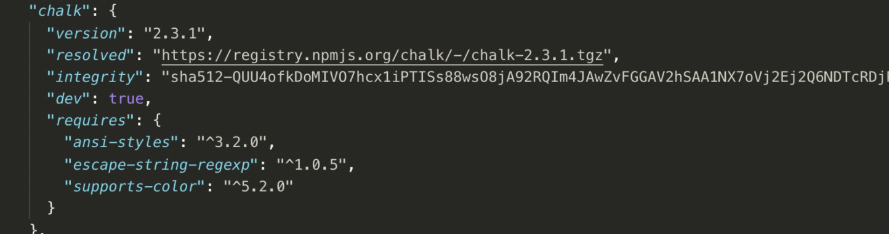
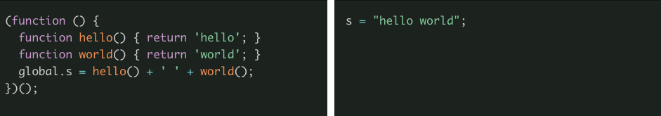

### 1. 什么是Webpack？

Webpack对于前端开发来说应该都不陌生了，它是现在一个主流的打包工具。在Webpack之前，也有很多打包工具，比如Gulp、Grunt等，而Webpack能够在诸多打包工具之中脱颖而出，成为现在主流的打包工具，必然有它独到之处。

在学习Webpack的时候，我们可能觉得其很复杂，配置项特别多，其实这不是Webpack能够决定的，由于前端业务的复杂，自然就需要更多复杂的配置来进行支撑。下面就来简单说一下Webpack在项目的打包时候的性能优化问题。

我们都知道，Webpack在打包的时候有两套代码，一套是对开发环境的配置，一套是对对生产环境打包的配置。**在开发的时候，我们主要的优化点是提高构建速度，在生产环境中打包时，我们主要的优化点是希望输出打包文件尽量小。**

所以，下面会根据这两种环境的配置，分别进行不同的配置的优化。

### 2. 提高构建速度

随着前端项目应用规模和复杂度的不断增加，前端项目的构建速度也在不断增加，下面就了解一下常见的与构建速度优化相关的方法。

#### 2.1 npm install 过程中的优化

在前端项目开发中，我们常常会安装npm包，npm安装的时候回经历以下阶段：

（1）首先，需要确定报的版本和分析包的依赖关系。npm会首先检查是否有版本描述文件，通过它来获取包的下载地址和版本相关的信息，如果没有我们则需要根据semver规则来进一步分析，如果有依赖文件这里也会一并下载。

（2）然后，npm会获取包的下载地址，在版本描述文件中一般都有`resolved`字段来记录包的地址，方便npm寻找，然后进行下载。

（3）到这一步，我们就可以下载相关包了。npm当中也有缓存机制，在这一步会检查本地是否有缓存信息，如果有，就直接使用缓存下载，这也是为什么我们第二次安装相关依赖的时候，速度会大大加快的原因。

（4）最后下载后的压缩包拷贝至本地的`node_moudules`文件夹当中。

在上述的过程中，最消耗时间的操作应该就是递归的分析包的版本和依赖关系了。在一个项目中，往往有很多个包，并且这些包之间存在很复杂的依赖关系，这就导致查找的工作量非常大。

所以，我们就可以针对上述问题进行优化。一个简单的方法就是增加版本描述文件。如果npm版本是5以下，那么可以使用`shrinkwrap.json`，如果是npm5以上，则可以使用npm自带的`package-lock.json`，还有使用Facebook官方出品的yarn工具，可以使用`yarn.lock`。这样，在这些文件中就有所有包的固定npm版本号以及具体的下载地址，安装时候就大大的减少了npm的时间：



#### 2.2 具体仓库地址的选择

npm官方的服务器地址在安装一些包的时候常常会失败（因为服务器在国外）。因此，我们可以使用淘宝提供的npm仓库，输入如下命令即可：

```js
npm config set registry https://registry.npm.taobao.org
```

#### 2.3 提升Webpack构建速度

在一些复杂的项目中，用Webpack打包往往需要消耗很长的时间，这就降低了我们的工作效率。那么如何提升构建的速度呢？

这里先来简单说一下Webpack的打包流程，整个打包流程我们可以将其理解为一个函数，配置文件则是其参数，传入合理的参数后，运行函数就能得到我们想要的结果。实际上，我们不太需要了解这个“函数”内部的工作机制，只需要思考**如何将配置文件当中的各项配置合理运用**，最终加快构建速度。

下面来一下的具体的方法。

**（1）区分开发环境和生产环境**

在Webpack 4.x的版本中，引入了mode配置项，通过指定production 或 development来区分是开发环境还是生产环境。

- 当我们把mode配置为development，那么WebPack会默认开启debug工具，当我们编译有错误的时候，提供良好的报错提示。打包的时候也会直接采用增量编译，而不是覆盖更新，这样我们可以节省大量编译时间。
- 当我们把mode配置为production，则会默认开启运行时的性能优化以及构建结果优化。

当然，这两种运行环境下还有很多配置上的区别，但Webpack 4.x提供的mode配置是一定要配置的选项。配置之后，针对这两种环境的一些默认优化也就使用在项目当中了。

**（2）减少不必要编译**

在编译过程中，使用loader处理文件时，应该尽量将文件的范围减小，对于一些不需要处理的文件直接进行忽略。下面以`babel-loader`为例，看一下如何处理：

```js
module: {
  rules: [
    {
      //处理后缀名为js的文件
      test: /\.js$/, 
      //exclude去掉不需要转译的第三方包 && 或者这里使用include去声明哪些文件需要被处理
      exclude: /(node_modules|bower_components)/,
      //babel的常用配置项
      use: {
        loader: 'babel-loader',
        options: {
          presets: ['@babel/preset-env'],
          //缓存设置为开启
          cacheDirectory: true
        }
      }
    }
  ]
}
```

这里对于不需要处理的第三方包直接使用 `exclude` 属性排除在外，需要处理的文件使用 `include` 属性去包含，此外上面我们在 `options` 配置当中增加了 `cacheDirectory: true`，这样对于转译结果就可以直接缓存到文件系统当中，在我们下次需要的时候直接到缓存当中读取即可。

**（3）使用模块热替换**

如果我们没有配置模块热替换，则每次更新代码、编译之后，需要每次刷新整个页面，效率很低。而使用模块热替换之后，我们只需要重新编译发生变化的模块，不需要编译所有模块，速度上面大大提高。具体配置方法如下：

```js
module.exports = {
  ......
  plugins: [
    new webpack.HotModuleReplacementPlugin(), // 引入模块热替换插件
  ],
  devServer: {
    hot: true // 开启模块热替换模式
  }
}
```

**（4）提取公共代码**

现在的前端项目都会引用大量的第三方包，这些包基本都是不变的，我们可以把他们打包到单独的文件当中，这就涉及到了公共代码的提取。之前Webpack3.x中使用的是`CommonsChunkPlugin`插件，后来Webpack升级到4.x之后使用的则是`optimization.splitChunks`。

- `CommonsChunkPlugin`配置

```js
new webpack.optimize.CommonsChunkPlugin({
    // 指定该代码块的名字
    name: "framework",
    // 指定输出代码的文件名
    filename: "framework.js",
    // 指定最小共享模块数
    minChunks: 4,
    // 指定作用于哪些入口
    chunks: ["pageA", "pageB"，"pageC"]
})
```

注意：这里的 `minChunks` 代表一个最小值，当工程中至少有超过该值数量的入口引用了相同的一个模块时，这个模块才会被提取到 `CommonsChunkPlugin` 中。

- optimization.splitChunks配置

```js
optimization: {
        splitChunks: {
          	//设置那些代码用于分割
            chunks: "all",
         		// 指定最小共享模块数(与CommonsChunkPlugin的minChunks类似)
            minChunks: 1,
         		// 形成一个新代码块最小的体积
            minSize: 0,
            cacheGroups: {
                framework: {
                    test: /react|lodash/,
                    name: "vendor",
                    enforce: true
                }
            }
        }
    }
```

注意：`cacheGroups`对象，定义了需要被抽离的模块，其中test属性是比较关键的一个值，他可以是一个字符串，也可以是正则表达式，还可以是函数。如果定义的是字符串，会匹配入口模块名称，会从其他模块中把包含这个模块的抽离出来。name属性是要缓存的分离出来的chunk名称。

**（5）分离常用的代码**

插件DLLPlugin可以用来分离在程序调用中反复会用到的代码。它和上面所说的`CommonsChunkPlugin`和`optimization.splitChunks`是一类插件，不过它更加智能，因此配置过程也非常的复杂。

- **配置动态链接库**：首先需要为动态链接库单独创建一个 Webpack 配置文件，这里我们叫做 `webpack.vendor.config.js`。该配置对象需要引入 DLLPlugin，其中的 entry 指定了把哪些模块打包为 vendor。

```js
const path    = require('path');
const webpack = require('webpack');
module.exports = {
  entry: {
     	//提取的公共文件
      vendor: ['vue','lodash',] 
  },
  output: {
    path: path.resolve('./dist'),
    filename: 'vendor.js',
    library: '[name]_library'
  },
  plugins: [
    new webpack.DllPlugin({
      path: path.resolve('./dist', '[name]-manifest.json'),
      name: '[name]_library'
    })
  ]
};
```

- **打包动态链接库并生成 vendor 清单**：使用该配置文件进行打包。会生成一个 `vendor.js` 以及一个资源的清单文件`manifest.json`，在内部每一个模块都会分配一个 ID。
- **将 vendor 连接到项目中**：最后在工程的 `webpack.config.js` 中我们需要配置 `DllReferencePlugin` 来获取刚刚打包出来的模块清单。这相当于工程代码和 vendor 连接的过程。

```js
module.exports = {
  plugins: [
    new webpack.DllReferencePlugin({
      // 指定需要用到的 manifest 文件
      manifest: path.resolve(__dirname, 'dist/manifest.json'), 
    }),
  ],
}
```

- 最后，在HTML文件当中正确引入我们打包好的`vendor.js`文件。

```js
<script src="vendor.js"></script>
```

### 3. 打包文件质量优化

说完了构建速度的优化，下面来说一下打包质量的优化，也就是如何让打包后文件尽可能的小，这样我们在加载文件的时候才能更快。

#### 3.1 压缩JavaScript代码

在压缩JavaScript代码的时需要先将代码解析成AST语法树，这个过程计算量非常大，常用的插件是`webpack-uglify-parallel` 。通过 `webpack-uglify-parallel` 我们可以将每个资源的压缩过程交给单独的进程，以此来提升整体的压缩效率。这个插件并不在 Webpack 内部，需要单独安装。配置方法也比较简单，如下：

```js
const os = require('os');
    const UglifyJsParallelPlugin = require('webpack-uglify-parallel');
    new UglifyJsParallelPlugin({
      //开启多进程
      workers: os.cpus().length,
      mangle: true,
      compressor: {
        //忽略警告
        warnings: false,
        //打开console
        drop_console: true,
        //打开debugger
        drop_debugger: true
       }
    })
```

#### 3.2 压缩CSS代码

在Webpack4.x中，我们使用`MiniCssExtractPlugin`和`OptimizeCSSAssetsPlugin`插件来压缩CSS代码，具体配置如下：

```js
const OptimizeCSSAssetsPlugin = require('optimize-css-assets-webpack-plugin');
const MiniCssExtractPlugin = require('mini-css-extract-plugin');
module.exports = {
  module: {
    rules: [
      {
    	  test: /\.css$/,
    	  use: [
                  MiniCssExtractPlugin.loader,   // 分离css代码
                  'css-loader',
    	  ],
	  },
    ],
  },
  plugins:[
     new MiniCssExtractPlugin({
          filename: 'static/css/[name].[contenthash:8].css' //提取css存放目录
     }),
        new OptimizeCssAssetsPlugin()  // 使用OptimizeCssAssetsPlugin对CSS进行压缩
  ]
}
```

#### 3.3 压缩图片

图片在一般项目当中都是最大的静态资源，所以图片的压缩就显得非常重要。图片压缩插件常用的插件是`imagemin-webpack-plugin`。配置较为简单，如下：

```js
const ImageminPlugin = require('imagemin-webpack-plugin').default;
module.exports = {
  plugins: [
      new ImageminPlugin({
        pngquant: {
          //指定压缩后的图片质量
          quality: '95-100'
        }
      })
	]
}
```

#### 3.4 优化源代码

我们可以使用Prepack，来优化源代码。Prepack是Facebook开源的WebPack插件，它是一个优化JavaScript源代码的工具：**可以在编译时而不是运行时完成的计算被消除。** Prepack使用等效代码替换JavaScript包的全局代码。我们先来看官网上面的一个例子：



我们可以看到Prepark处理后的代码非常简洁，这样JavaScript引擎在处理代码的时候，速度会大大增加，它的配置方法也非常简单，如下：

```js
const PrepackWebpackPlugin = require('prepack-webpack-plugin').default;
module.exports = {
  plugins:[
     new PrepackWebpackPlugin()
  ]
}
```

#### 3.5 升级Webpack版本

最新的Webpack的版本是4.x，Webpack4.x相比于Webpack3.x做了非常多的优化工作，主要就是性能优化方面的，因此可以及时更新自己的Webpack版本。

关于Webpack4.x 具体的更新，这里就看一下比较重要的几点：

- Webpack AST可以直接从`loader`传递给`webpack`，这样就可以避免额外的解析
- `CommonsChunkPlugin`被删除 -> `optimization.splitChunks`，`optimization.runtimeChunk`

- 队列不会两次将同一个作业排入队列
- 默认情况下，使用更快的`md4`哈希进行散列

- 使用`for of` 替换 `forEach`，使用 Map 和 Set 替换普通的对象字面量，使用includes替换indexOf，通过这些API的替换获得更快的速度。

Webpack4.x较以前版本的提升还是非常大的，所以及时更新Webpack的版本还是非常有必要的。