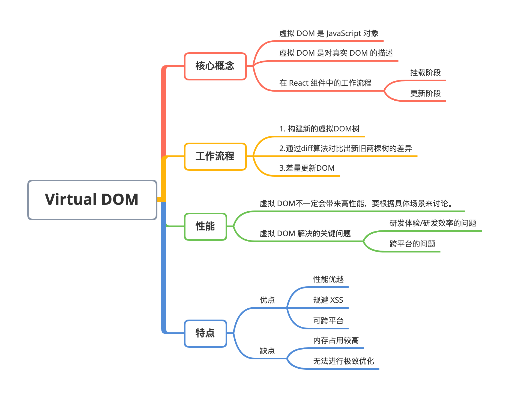
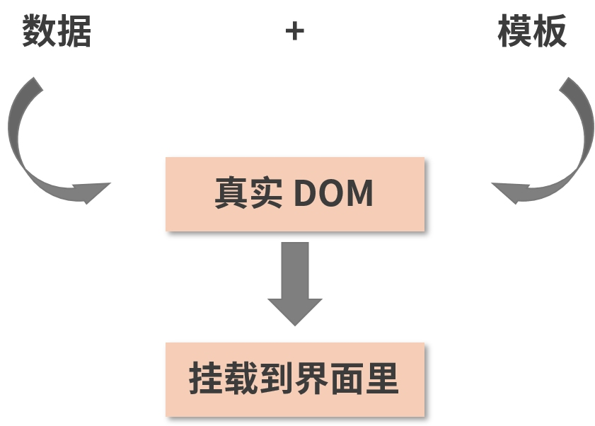
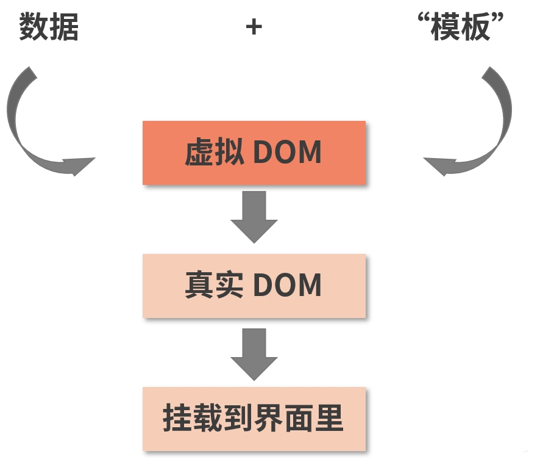
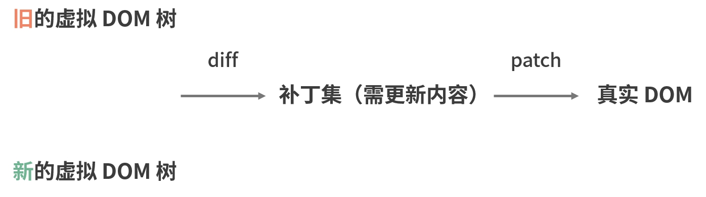

# React Virtual DOM

### 

## 1. 虚拟 DOM 的概念

虚拟 DOM 的工作原理是通过 JS 对象模拟 DOM 的节点。在 Facebook 构建 React 初期时，考虑到要提升代码抽象能力、避免人为的 DOM 操作、降低代码整体风险等因素，所以引入了虚拟 DOM。


虚拟 DOM（Virtual DOM）**本质上是 JavaScript 和 DOM 之间的一个映射缓存，它在形态上表现为一个能够描述 DOM 结构及其属性信息的 JavaScript 对象。**


对于Virtual DOM，我们要把握住以下两点：

- 虚拟 DOM 是 JS 对象
- 虚拟 DOM 是对真实 DOM 的描述


虚拟 DOM 在 React 组件的挂载阶段和更新阶段都会作为“关键人物”出镜，其参与的工作流程如下：

- **挂载阶段**，React 将结合 JSX 的描述，构建出虚拟 DOM 树，然后通过 ReactDOM.render 实现虚拟 DOM 到真实 DOM 的映射（触发渲染流水线）；
- **更新阶段**，页面的变化在作用于真实 DOM 之前，会先作用于虚拟 DOM，虚拟 DOM 将在 JS 层借助算法先对比出具体有哪些真实 DOM 需要被改变，然后再将这些改变作用于真实 DOM。


在 JSX 的使用中，JSX 所描述的结构，会转译成 React.createElement 函数，大致像这样：

```jsx
// JSX 描述
<input type="button"/>
  
// Babel 转译后
React.createElement('input', { type: "button" })
```

React 会持有一颗虚拟 DOM 树，在状态变更后，会触发虚拟 DOM 树的修改，再以此为基础修改真实 DOM。


根据上面的已知条件，可以得出结论：**React.createElement 返回的结果应该是一个 JavaScript Object**。由于是树结构，所以一定包含一个 children 字段，来建立与子级的关联关系。所以可以推测出它的结构像下面这样：

```jsx
// 想象中的结构
{
  tag: 'input',
  props: {
    type: 'button'
  },
  childrean: []
}
```

基于基本认知，React 有两个函数：

- **diff 函数**，去计算状态变更前后的虚拟 DOM 树差异；
- **渲染函数**，渲染整个虚拟 DOM 树或者处理差异点。


正是由于计算与渲染的分工。在日常的开发中，就像下面的代码案例一样，需要同时引入 React 与 ReactDOM 两个库：

```jsx
import React from 'react';
import ReactDOM from 'react-dom';
ReactDOM.render(<h1>hi!</h2>, document.getElementById('root'));
```

其中 React 主要的工作是组件实现、更新调度等计算工作；而 ReactDOM 提供了在网页上渲染的基础。

## 2. 虚拟 DOM 的工作流程

同样是将用户界面与数据相分离，模板引擎是这样做的：



而在虚拟 DOM 的加持下，事情变成了这样：



注意图中的“模板”加了引号，这是因为虚拟 DOM 在实现上并不总是借助模板。比如 React 就使用了 JSX，JSX 本质不是模板，而是一种使用体验和模板相似的 JS 语法糖。


我们可以看到，两者区别就在于多出了一层虚拟 DOM 作为缓冲层。这个缓冲层带来的好处是：当 DOM 操作（渲染更新）比较频繁时，它会先将前后两次的虚拟 DOM 树进行对比，定位出具体需要更新的部分，生成一个“补丁集”，最后只把“补丁”打在需要更新的那部分真实 DOM 上，实现精准的“差量更新”。这个过程对应的虚拟 DOM 工作流如下图所示：



**注意：**虚拟 DOM 和 Redux 一样，都不依附于任何具体的框架。

## 3. 虚拟DOM可以带来更好的性能吗？

面试官可能会这样问：“**虚拟 DOM 一定比真实的 DOM 操作性能更高吗？**”。其实不是，如果只修改一个按钮的文案，那么虚拟 DOM 的操作无论如何都不可能比真实的 DOM 操作更快。所以一定要根据具体的场景进行探讨。


在整个 DOM 操作的演化过程中，其实主要矛盾并不在于性能，而在于开发者写得爽不爽，在于研发体验/研发效率。虚拟 DOM 不是别的，正是前端开发们为了追求更好的研发体验和研发效率而创造出来的高阶产物。虚拟 DOM 并不一定会带来更好的性能，React 官方也从来没有把虚拟 DOM 作为性能层面的卖点对外输出过。**虚拟 DOM 的优越之处在于，它能够在提供更爽、更高效的研发模式（也就是函数式的 UI 编程方式）的同时，仍然保持一个还不错的性能。**


以模板渲染为例，我们来对比一下它和虚拟 DOM 在性能开销上的差异。两者的渲染工作流对比如下图所示：


从图中可以看出，模板渲染的步骤1，和虚拟 DOM 渲染的步骤1、2都属于 JS 范畴的行为，这两者是具备可比性的，放在一起来看：动态生成 HTML 字符串的过程本质是对字符串的拼接，对性能的消耗是有限的；而虚拟 DOM 的构建和 diff 过程逻辑则相对复杂，它不可避免地涉及递归、遍历等耗时操作。因此在 JS 行为这个层面，模板渲染胜出。


模板渲染的步骤3，和虚拟 DOM 的步骤3 都属于 DOM 范畴的行为，两者具备可比性，地对一下：模板渲染是全量更新，而虚拟 DOM 是差量更新。


乍一看好像差量更新一定比全量更新高效，但需要考虑这样一种情况：数据内容变化非常大（或者说整个发生了改变），促使差量更新计算出来的结果和全量更新极为接近（或者说完全一样）。


在这种情况下，DOM 更新的工作量基本一致，而虚拟 DOM 却伴随着开销更大的 JS 计算，此时会出现的一种现象就是模板渲染和虚拟 DOM 在整体性能上难分伯仲：若两者最终计算出的 DOM 更新内容完全一致，那么虚拟 DOM 大概率不敌模板渲染；但只要两者在最终 DOM 操作量上拉开那么一点点的差距，虚拟 DOM 就将具备战胜模板渲染的底气。因为虚拟 DOM 的劣势主要在于 JS 计算的耗时，而 DOM 操作的能耗和 JS 计算的能耗根本不在一个量级，极少量的 DOM 操作耗费的性能足以支撑大量的 JS 计算。


当然，上面讨论的这种情况相对来说比较极端。在实际的开发中，更加高频的场景是这样的：每次 setState 的时候只修改少量的数据，比如一个对象中的某几个属性，再比如一个数组中的某几个元素。在这样的场景下，模板渲染和虚拟 DOM 之间 DOM 操作量级的差距就完全拉开了，虚拟 DOM 将在性能上具备绝对的优势。


所以，虚拟DOM的价值并不在于性能，而是其他方面。那虚拟DOM的真正的价值在哪里呢？


虚拟 DOM 解决的关键问题有以下两个：

- **研发体验/研发效率的问题**：DOM 操作模式的每一次革新，背后都是前端对效率和体验的进一步追求。虚拟 DOM 的出现，为数据驱动视图这一思想提供了高度可用的载体，使得前端开发能够基于函数式 UI 的编程方式实现高效的声明式编程。


- **跨平台的问题**：虚拟 DOM 是对真实渲染内容的一层抽象。若没有这一层抽象，那么视图层将和渲染平台紧密耦合在一起，为了描述同样的视图内容，可能要分别在 Web 端和 Native 端写完全不同的两套甚至多套代码。但现在中间多了一层描述性的虚拟 DOM，它描述的东西可以是真实 DOM，也可以是iOS 界面、安卓界面、小程序......同一套虚拟 DOM，可以对接不同平台的渲染逻辑，从而实现“一次编码，多端运行”。其实说到底，跨平台也是研发提效的一种手段，它在思想上和上面是高度呼应的。

## 4. 虚拟 DOM 的特点

虚拟 DOM 的优势：

- 性能优越
- 规避 XSS

- 可跨平台


但是，这三点是虚拟DOM的绝对优势吗?

- **性能：**如果大量的直接操作 DOM 则容易引起网页性能的下降，这时 React 基于虚拟 DOM 的 diff 处理与批处理操作，可以降低 DOM 的操作范围与频次，提升页面性能。在这样的场景下虚拟 DOM 就比较快，那什么场景下虚拟 DOM 慢呢？首次渲染或微量操作，虚拟 DOM 的渲染速度就会比真实 DOM 更慢。
- **规避XSS：**那虚拟 DOM 一定可以规避 XSS吗？虚拟 DOM 内部确保了字符转义，所以确实可以做到这点，但 React 存在风险，因为 React 留有 dangerouslySetInnerHTML API 绕过转义。

- **跨平台：**没有虚拟 DOM 不能实现跨平台吗？比如 NativeScript 没有虚拟 DOM 层 ，它是通过提供兼容原生 API 的 JS API 实现跨平台开发。那虚拟 DOM 的优势在哪里？实际上它的优势在于跨平台的成本更低。在 React Native 之后，前端社区从虚拟 DOM 中体会到了跨平台的无限前景。


虚拟 DOM 的缺点：

- **内存占用较高：**因为当前网页的虚拟 DOM 包含了真实 DOM 的完整信息，而且由于是 Object，其内存占用肯定会有所上升。
- **无法进行极致优化：**虽然虚拟 DOM 足以应对绝大部分应用的性能需求，但在一些性能要求极高的应用中，虚拟 DOM 无法进行针对性的极致优化，比如实现类似 Google Earth 的场景。