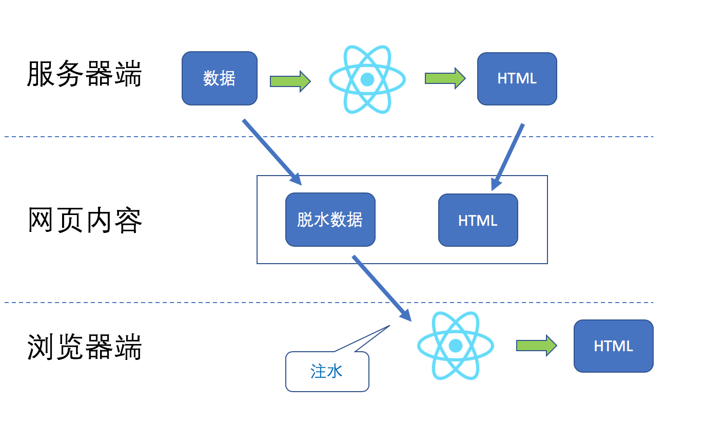
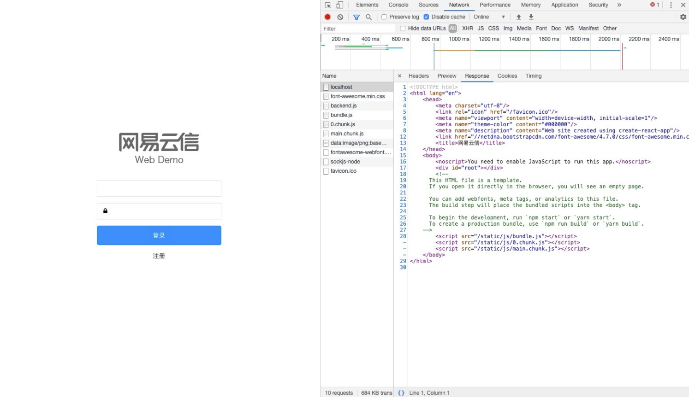
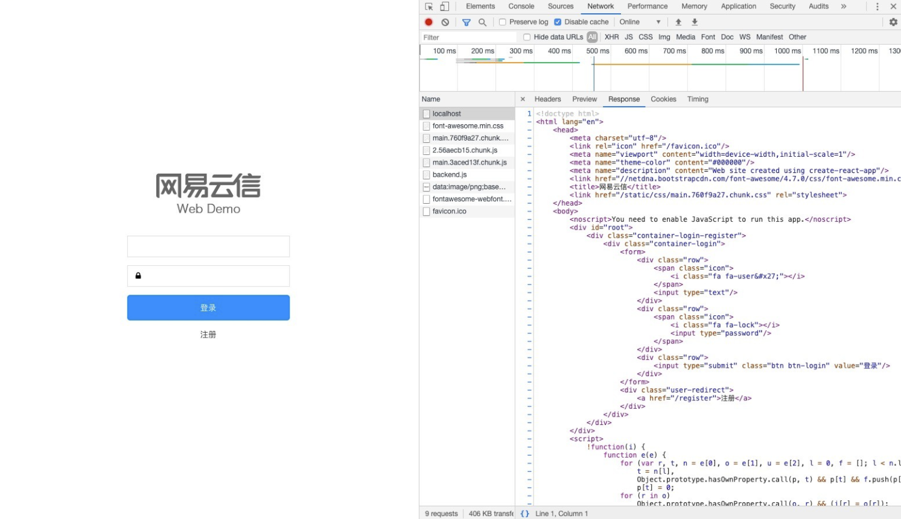

# React服务端渲染

## 1. 服务端渲染的特点

在传统的客户端渲染中， React 应用初始服务端请求通常是返回一个没有 DOM 结构的 HTML 文件，其中只包含一堆 CSS 和 JS links。然后，应用需要另外请求一些数据来呈现相关的 HTML 标签。而**服务端渲染可以在请求时，在服务端直接生成一个完整结构的 HTML 文件，返回给浏览器展示。**


网站应用最初全都是服务器端渲染，由服务器端用Java、Python 等语言产生 HTML 来给浏览器端解析。相比于浏览器端渲染，服务器端渲染的好处如下：


**（1）可以缩短“第一有意义渲染时间”（First-Meaningful-Paint-Time）。**

如果完全依赖于浏览器端渲染，那么服务器端返回的 HTML 就是一个空荡荡的框架和对 JavaScript 的应用，然后浏览器下载 JavaScript，再根据 JavaScript 中的 AJAX 调用获取服务器端数据，再渲染出 DOM 来填充网页内容，总共需要三个 HTTP 或 HTTPS 请求。


如果使用服务器端渲染，第一个 HTTP/HTTPS 请求返回的 HTML 里就包含可以渲染的内容了，这样用户第一时间就会感觉到“有东西渲染出来了”，这样的感知性能更好。


**（2）更好的搜索引擎优化（Search-Engine-Optimization，SEO）。**

大部分网站都希望自己能够出现在搜索引擎的搜索页前列，这个前提就是网页内容要能够被搜索引擎的爬虫正确抓取到。虽然 Google 这样的搜索引擎已经可以检索浏览器端渲染的网页，但毕竟不是全部搜索引擎都能做到，如果搜索引擎的爬虫只能拿到服务器端渲染的内容，完全浏览器端渲染就行不通了。如果通过服务器端渲染提高网页性能，网页的排名更可能靠前。

## 2. React 对服务器端渲染的支持

因为 React 是声明式框架，所以，在渲染上对服务器端渲染非常友好。假设要渲染一个以 `App` 为最根节点的组件树，浏览器端渲染的代码如下：

```jsx
import React from 'react';
import ReactDOM from 'react-dom';
ReactDOM.render(<App />, document.getElementById('root'));
```

现在想要在服务器端渲染 `App`，如果使用 React v16 之前的版本，代码是这样：

```jsx
import React from 'react';
import ReactDOMServer from 'react-dom/server';
// 把产生html返回给浏览器端
const html = ReactDOMServer.renderToString(<Hello />);
```

从 React v16 开始，上面的服务器端代码依然可以使用，但是也可以把 `renderToString` 替换为 `renderToNodeStream`，代码如下：

```jsx
import React from 'react';
import ReactDOMServer from 'react-dom/server';
// 把渲染内容以流的形式塞给response
ReactDOMServer.renderToNodeStream(<Hello />).pipe(response);
```

此外，浏览器端代码也有一点变化，`ReactDOM.render` 依然可以使用，但是官方建议替换为 `ReactDOM.hydrate`，原来的 `ReactDOM.render` 将来会被废弃掉。


`renderToString` 的功能是一口气同步产生最终 HTML，如果 React 组件树很庞大，这样一个同步过程可能比较耗时。假设渲染完整 HTML 需要 500 毫秒，那么一个 HTTP/HTTPS 请求过来，500 毫秒之后才返回 HTML，显得不大合适，这也是为什么 v16 提供了 `renderToNodeStream` 这个新 API 的原因。


`renderToNodeStream` 把渲染结果以“流”的形式塞给 response 对象（这里的 response 是 express 或者 koa 的概念），这意味着不用等到所有 HTML 都渲染出来了才给浏览器端返回结果，也许 10 毫秒内就渲染出来了网页头部，那就没必要等到 500 毫秒全部网页都出来了才推给浏览器，“流”的作用就是有多少内容给多少内容，这样用户只需要 10 毫秒多一点的延迟就可以看到网页内容，进一步改进了“第一有意义渲染时间”。

## 3. 脱水和注水

为了简化问题，上面的代码示例有意忽略了一个事实，那就是，应用往往需要外部服务器获取数据啊！除非网页应用没有动态内容，不然必须要考虑在服务器端怎么给 React 组件获取数据。


对于浏览器端渲染，在 `componentDidMount` 里调用 AJAX 就好了；对于服务器端渲染，要想产生 HTML 的包含内容，必须事先把数据准备好，也就是说，代码要是这样才行：

```jsx
import React from 'react';
import ReactDOMServer from 'react-dom/server';

callAPI().then(result => {
  const props = result;
  ReactDOMServer.renderToNodeStream(<Hello {...props}/>).pipe(response);
});
```

最大的问题来了，如何给组件获取和提供数据呢？


React 有一个特点就是把内容展示和动态功能集中在一个组件中。比如，一个 Counter 组件既负责怎么画出内容，也要负责怎么响应按键点击，这当然符合软件高内聚性的原则，但是也给服务器端渲染带来更多的工作。


如果只使用服务器端渲染，那么产生的只有 HTML，虽然能够让浏览器端画出内容，但是，没有 JavaScript 的辅助是无法响应用户交互事件的。对应 Counter 的例子，一个 Counter 组件在浏览器中也就渲染出一个数字两个按钮，用户点击 `+` 按钮或者 `-` 按钮，什么都不会发生。


很显然我们必须要在浏览器端赋予 Counter 组件一些“神力”，让它能够响应事件。那么怎么赋予 Counter 组件“神力”呢？其实我们已经做过这件事了，Counter 组件里面已经有对按钮事件的处理，我们所要做的只是让 Counter 组件在浏览器端重新执行一遍，也就是 mount 一遍就可以了。也就是说，**如果想要动态交互效果，使用 React 服务器端渲染，必须也配合使用浏览器端渲染**。


现在问题变得更加有趣了，在服务器端我们给 Counter 一个初始值（这个值可以不是缺省的 0），让 Counter 渲染产生 HTML，这些 HTML 要传递给浏览器端，为了让 Counter 的 HTML“活”起来点击相应事件，必须要在浏览器端重新渲染一遍 Counter 组件。在浏览器端渲染 Counter 之前，用户就可以看见 Counter 组件的内容，但是无法点击交互，要想点击交互，就必须要等到浏览器端也渲染一次 Counter 之后。


接下来的一个问题，如果服务器端塞给 Counter 的数据和浏览器端塞给 Counter 的数据不一样呢？

- 在 React v16 之前，React 在浏览器端渲染之后，会把内容和服务器端给的 HTML 做一个比对。如果完全一样，那最好，接着用服务器端 HTML 就好了；如果有一丁点不一样，就会立刻丢掉服务器端的 HTML，重新渲染浏览器端产生的内容，结果就是用户可以看到界面闪烁。因为 React 抛弃的是整个服务器端渲染内容，组件树越大，这个闪烁效果越明显。
- React 在 v16 之后，做了一些改进，不再要求整个组件树两端渲染结果分毫不差，但是如果发生不一致，依然会抛弃局部服务器端渲染结果。


总之，**如果用服务器端渲染，一定要让服务器端塞给 React 组件的数据和浏览器端一致**。为了达到这一目的，必须把传给 React 组件的数据给保留住，随着 HTML 一起传递给浏览器网页，这个过程，叫做“脱水”（Dehydrate）；在浏览器端，就直接拿这个“脱水”数据来初始化 React 组件，这个过程叫“注水”（Hydrate）。React v16 之后用 `React.hydrate` 替换 `React.render`，这个 `hydrate` 就是“注水”。



总之，为了实现React的服务器端渲染，必须要处理好这两个问题：**脱水**和**注水。**

## 4. React API 支持

### （1）renderToString() & renderToStaticMarkup()

```jsx
ReactDOMServer.renderToString(element)
ReactDOMServer.renderToStaticMarkup(element)
```

- **共同点**：这两个方法接收一个 React Element，并将它转化为 HTML 字符串。通过这个方法，就可以在服务端生成 HTML，并在首次请求时将标记下发，以加快页面加载速度，并允许搜索引擎爬取你的页面以达到 SEO 优化的目的。
- **不同点**：`renderToString()` 生成的 HTML 字符串的每个 DOM 节点都有 `data-react-id` 属性， 根节点会有一个 `data-react-checkSum` 属性（仅在React 15）。`renderToStaticMarkup()` 则没有这些属性。


**注意：**`data-react-checkSum` 这个属性的主要目的是为了跟服务端渲染组件的值做对比，若相等，则不再重复渲染。


React 16以后通过 `renderToString()` 渲染的组件不再带有 `data-react-*` 属性，因此浏览器端的渲染方式无法简单通过 `data-react-checksum` 来判断是否需要重新渲染。基于这样的背景下 `ReactDom` 提供了一个新的 API `ReactDom.hydrate()`， 用法跟 `render()` 类似，在浏览器端渲染组件。


**注意：**React 是向下兼容的，浏览器端在渲染组件时使用 `render()` 仍然没有问题，但不论是面向未来，还是基于性能的考虑，都应该采用 `hydrate()`

### （2）renderToNodeStream() & renderToStaticNodeStream()

```jsx
ReactDOMServer.renderToNodeStream(element)
ReactDOMServer.renderToStaticNodeStream(element)
```

React 16 为了优化页面初始加载速度，缩短 TTFB 时间，提供了这两个方法。该方法持续产生字节流，返回一个可输出 HTML 字符串的可读流。通过可读流输出的 HTML 与 `ReactDOMServer.renderToString()` 返回的 HTML 完全相同。`renderToStaticNodeStream()` 与 `renderToNodeStream()` 相似，但此方法不会创建额外的 DOM 属性，若是静态页面，建议使用此方法，可以取出额外的属性节省一些字节。


**注意：**这两个 API 仅限于服务端使用，在浏览器中不可用。

## 5. React SSR 实现

下面来实现一个简单的 React SSR，这里我们使用登录注册两个组件来实现服务端渲染。

### （1）服务端渲染实现

新建一个 `server.js` 文件，作为服务端渲染的入口：

```jsx
import {
  createServer
} from "http"
import React from "react"
import ReactDOMServer from "react-dom/server"
import App from "./src/App"
import fs from 'fs'
createServer((req, res) => {
  var index = fs.readFileSync('./build/index.html')
  // 替换将显示出来的dom结构
  const frontHtml = index.toString().replace('<div id="root"></div>', `<div id="root">${frontComponents}</div>`)
  res.write(frontHtml)
  res.end()
}).listen(3000)
```

启动后会发现，相关的 CSS 文件和 JavaScript 文件都获取不到，这是因为我们还没有把 build 目录公开，把 build 目录录入服务器需要在 `createServer` 中加入下列代码：

```jsx
// ...
createServer((req, res) => {
if (req.url.startsWith('/static/')) {
  let pathname = "./build" + url.parse(req.url).pathname
    fs.readFile(pathname, function (err, data) {
      res.writeHead(200, {
        "content-type": "text/plain"
      })
      res.write(data)
      res.end()
    })
    return
  }
  // ...
}).listen(3000)
```

一般场景下，我们的应用不可能只有一个页面，肯定会有路由跳转，我们一般这样使用：

```jsx
<BrowserRouter>
  {/*...Routes*/}
<BrowserRouter/>
```

但在做服务端渲染时，需要将 `BrowserRouter` 替换为 `StaticRouter`，需要在 `<App />` 外加上路由：

```jsx
<StaticRouter location={req.url} context={context} >
  <App />
</StaticRouter>
```

这在服务器端渲染场景中非常有用，因为用户实际上没有点击，所以位置实际上并未发生变化。因此，名称是 static（静态的）。


`BrowserRouter` 会通过 HTML5 提供的 history API 来保持页面与 URL 的同步，而 `StaticRouter` 则不会改变 URL，`StaticRouter` 接收两个属性：

- location： `StaticRouter` 会根据这个属性，自动匹配对应的 React 组件，所以才会实现刷新页面，服务端返回的对应路由的组件与浏览器端保持一致；
- context：一般用来传递一些数据，相当于一个载体，比如当用到 CSS Modules 时会对样式进行传递（CSS Modules 会改变样式文件的类名，直接引入会找不到类名）。


到这里就完成了整个服务器渲染，总结下会经过以下几个过程：

1. 打包浏览器端代码；
2. 打包服务端代码并启动服务；

1. 用户访问，服务端读取浏览器端打包好的 `index.html` 文件为字符串，将渲染好的组件、样式、数据塞入 HTML 字符串，返回给浏览器；
2. 浏览器直接渲染接收到的 HTML 内容，并且加载打包好的浏览器端 JavaScript 文件，进行事件绑定，初始化状态数据，完成同构。

### （2）同构的概念

React SSR 的核心就是同构，没有同构的 SSR 是没有意义的。


**所谓同构，就是服务端和客户端采用一套代码，不需要维护两套代码。这个概念存在于 Vue，React 这些前端框架中，同构实际上是客户端渲染和服务器端渲染的一个整合。我们把页面的展示内容和交互写在一起，让代码执行两次。在服务器端执行一次，用于实现服务器端渲染，在客户端再执行一次，用于接管页面交互。**


通过这些特性可以了解到在 SSR 的工程中，React 代码会在客户端和服务器端各执行一次。你可能会想，这没什么问题，都是 JavaScript 代码，既可以在浏览器上运行，又可以在 Node 环境下运行。但事实并非如此，如果你的 React 代码里，存在直接操作 DOM 的代码，那么就无法实现 SSR 这种技术了，因为在 Node 环境下，是没有 DOM 这个概念存在的，所以这些代码在 Node 环境下是会报错的。


好在 React 框架中引入了一个概念叫做虚拟 DOM，虚拟 DOM 是真实 DOM 的一个 JavaScript 对象映射，React 在做页面操作时，实际上不是直接操作 DOM，而是操作虚拟 DOM，也就是操作普通的 JavaScript 对象，这就使得 SSR 成为了可能。在服务器，我可以操作 JavaScript 对象，判断环境是服务器环境，我们把虚拟 DOM 映射成字符串输出；在客户端，我也可以操作 JavaScript 对象，判断环境是客户端环境，我就直接将虚拟 DOM 映射成真实 DOM，完成页面挂载。

### （3）服务端渲染 & 客户端渲染

客户端渲染：



服务端渲染：



可以看到两种渲染方式中，DOM 结构区别很大，客户端渲染返回的页面中不包含页面展示的元素内容，服务端渲染直接返回了需要展示的 DOM 元素供浏览器展示。然后交由浏览器为 DOM 绑定状态、事件等，成为一个可交互的页面。


服务端渲染和客户端渲染时间也有很大差距，通过两张图，可以看到客户端渲染用了 2000 ms，但是服务端渲染用了不到 1000 ms，服务端渲染快了将近1倍，所以，我们一般会在首屏渲染使用服务端渲染，提升首屏渲染的速度，进而提升用户体验。


所以，服务端实际上只负责首次”渲染“（这里其实是生成 HTML 内容），然后返回给客户端，客户端接管事件绑定等逻辑，之后的路由切换等过程，都是通过 JavaScript 来负责处理，不再需要服务端渲染，当然页面刷新时也会需要服务端渲染。