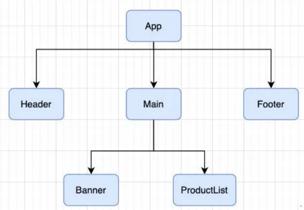

# React组件通信

在组件之间是存在嵌套关系的，如果我们将一个程序的所有逻辑都放在一个组件中。那么这个组件就会变得臃肿并且难以维护，所以组件化的思想就是对组件进行拆分，再将这些组件嵌套在一起，最终形成我们的应用程序。


比如，下面的组件就存在如下的关系：

- App组件是Header、Main、Footer组件的父组件；
- Main组件是Banner、ProductList组件的父组件；



在开发的过程中，组件之间是会存在数据通信的，这包括父子组件的通信，兄弟组件之间的通信，祖孙组件之间的通信等等。

## 1. 父传子通信

父子组件之间的通信是通过props来完成的。

**（1）类组件父传子**

```javascript
class ChildCpn extends Component {
  // 实际上下面三行代码就是默认的方式，所以是可以省略的
  constructor(props) {
    super(props);
  }

  render() {
    const {name, age, height} = this.props;
    return (
      <h2>子组件展示数据: {name + " " + age + " " + height}</h2>
    )
  }
}

export default class App extends Component {
  render() {
    return (
      <div>
        <ChildCpn name="zhangsan" age="18" height="1.88"/>
        <ChildCpn name="lisi" age="20" height="1.98"/>
      </div>
    )
  }
}
```

**（2）函数组件父传子**

```javascript
function ChildCpn(props) {
  const { name, age, height } = props;

  return (
    <h2>{name + age + height}</h2>
  )
}

export default class App extends Component {
  render() {
    return (
      <div>
        <ChildCpn name="zhangsan" age="18" height="1.88"/>
        <ChildCpn name="lisi" age="20" height="1.98"/>
      </div>
    )
  }
}
```

**（3）属性验证**

对于传递给子组件的数据，有时候我们可能希望进行数据格式的验证，特别是对于大型项目来说：

- 如果项目中默认集成了Flow或者TypeScript，那么直接就可以进行类型验证；
- 如果没有使用Flow或者TypeScript，也可以通过 prop-types 库来进行参数验证；

```javascript
// 第一步：引入prop-types 库
import PropTypes from 'prop-types'

// 第二部：设置数据的类型
ChildCpn.propTypes = {
  name: PropTypes.string,
  age: PropTypes.nimber,
  height: PropTypes.number,
  names: PropTypes.array
}
```

当对数据进行验证时，如果数据的类型不符，就会报错。


如果父子组件什么都没传递，我们可以给数据设置默认值，这样就可以显示默认值：

```javascript
ChildCpn.defaultProps = {
  name: "React",
  age: 30,
  height: 1.88,
  names: ["aaa", "bbb", "ccc"]
}
```

以上做法在类组件和函数组件中都适用，除了上述方法，在类组件中还可以使用另外一种形式来进行数据验证以及设置默认数据：

```javascript
class ChildCpn2 extends Component {
  // es6中的class fields写法
  static propTypes = {

  }

  static defaultProps = {

  }
}
```

## 2. 子传父通信

说完父传子，下面来说一下子组件向父组件传值。在Vue中，子组件向父组件传值是通过自定义事件来完成的，在React中同样是**使用props传递信息，只要让父组件给子组件传递一个绑定了自身上下文的回调函数，那么在子组件中调用这个函数时，就可以****将想要交给父组件的数据以函数入参的形式给出去**，以此来间接地实现数据从子组件到父组件的流动。


具体实现步骤如下：

1. 父组件将回调函数通过 `props` 传递给子组件；
2. 子组件把父组件需要的数据信息作为回调函数的参数传递；

1. 子组件调用该回调函数。


下面来看一下计数器的案例：

```javascript
class CounterButton extends Component {
  render() {
    const { onClick } = this.props;
    return <button onClick={ onClick }>+1</button>
  }
}

export default class App extends Component {
  constructor(props) {
    super(props);

    this.state = {
      counter: 0
    }
  }

  render() {
    return (
      <div>
        <h2>当前计数: {this.state.counter}</h2>
        <CounterButton onClick = {e => this.increment()} name="why"/>
      </div>
    )
  }

  increment() {
    this.setState({
      counter: this.state.counter + 1
    })
  }
}
```

这里，我们在父组件定义了一个increment方法，当点击子组件的按钮时，就会触发父组件的方法，并执行该方法，实现数据加一。

## 3. 父子组件通信案例

我们来实现一个菜单栏的切换效果（点击菜单显示不同的内容）：


**样式：**

```css
// style.css

.tab-control {
  display: flex;
  height: 44px;
  line-height: 44px;
}

.tab-item {
  flex: 1;
  text-align: center;
}

.tab-item span {
  padding: 5px 8px;
}

.tab-item.active {
  color: red;
}

.tab-item.active span {
  border-bottom: 3px solid red;
}
```

**父组件（负责切换前后页面的显示）：**

```javascript
// App.js

import React, { Component } from 'react';

import TabControl from './TabControl';

export default class App extends Component {
  constructor(props) {
    super(props);

    this.titles = ['新款', '精选', '流行'];

    this.state = {
      currentTitle: "新款",
      currentIndex: 0
    }
  }

  render() {
    const {currentTitle} = this.state;

    return (
      <div>
        <TabControl itemClick={index => this.itemClick(index)} titles={this.titles} />
        <h2>{currentTitle}</h2>
      </div>
    )
  }

  itemClick(index) {
    this.setState({
      currentTitle: this.titles[index]
    })
  }
}
```

**子组件（只负责页面菜单的切换）：**

```javascript
import React, { Component } from 'react';
import PropTypes from 'prop-types';

export default class TabControl extends Component {
  constructor(props) {
    super(props);

    this.state = {
      currentIndex: 0
    }
  }

  render() {
    const { titles } = this.props;
    const {currentIndex} = this.state;

    return (
      <div className="tab-control">
        {
          titles.map((item, index) => {
            return (
              <div key = {item} 
                   className = {"tab-item " + (index === currentIndex ? "active": "")}
                   onClick = {e => this.itemClick(index)}>
                <span>{item}</span>
              </div>
            )
          })
        }
      </div>
    )
  }

  itemClick(index) {
    this.setState({
      currentIndex: index
    })

    const {itemClick} = this.props;
    itemClick(index);
  }
}

TabControl.propTypes = {
  titles: PropTypes.array.isRequired
}
```

## 4. React中的"插槽"

学过Vue的一定知道，Vue有一个功能就是插槽，插槽方便了组件的自定义，避免了代码的重复。React是没有插槽这个概念的，但是React的灵活性让他比插槽更加好用，下面来看一个导航栏案例：


**样式：**

```css
body {
  padding: 0;
  margin: 0;
}

.nav-bar {
  display: flex;
}

.nav-item {
  height: 44px;
  line-height: 44px;
  text-align: center;
}

.nav-left, .nav-right {
  width: 70px;
  background-color: red;
}

.nav-center {
  flex: 1;
  background-color: blue;
}
```

**父组件：**

```javascript
import NavBar1 from './NavBar1';
import NavBar2 from './NavBar2';

export default class App extends Component {

  render() {
    const leftJsx = <span>aaa</span>;
    return (
      <div>
        // 双标签
        <NavBar1 name="" title="" className="">
          <span>aaa</span>
          <strong>bbb</strong>
          <a href="/#">ccc</a>
        </NavBar1>
        // 单标签
        <NavBar2 leftSlot={leftJsx}
                 centerSlot={<strong>bbb</strong>}
                 rightSlot={<a href="/#">ccc</a>}/>
      </div>
    )
  }
}
```

**子组件1：**

```javascript
export default class NavBar extends Component {
  render() {
    // this.props.children;
    return (
      <div className="nav-item nav-bar">
        <div className="nav-left">
          {this.props.children[0]}
        </div>
        <div className="nav-item nav-center">
          {this.props.children[1]}
        </div>
        <div className="nav-item nav-right">
          {this.props.children[2]}
        </div>
      </div>
    )
  }
}
// 在这个组件中，父组件向子组件传入了三个元素，在子组件的props中的children中会接收到一个数组，数组中包含了这三个元素
// 当然，这样写是有一定弊端的，因为数组中的元素的数量可能和需要的数量不一致，就有可能将元素渲染位置错误
```

**子组件2：**

```javascript
export default class NavBar2 extends Component {
  render() {
    const {leftSlot, centerSlot, rightSlot} = this.props;

    return (
      <div className="nav-item nav-bar">
        <div className="nav-left">
          {leftSlot}
        </div>
        <div className="nav-item nav-center">
          {centerSlot}
        </div>
        <div className="nav-item nav-right">
          {rightSlot}
        </div>
      </div>
    )
  }
}
// 这父组件中，使用了单标签，使用属性的方式将元素进行传递，在子组件中接收父组件中传递来的元素结构，在进行渲染。
// 这种方式会比上面子组件1的方式好一些。
```

这样，我们就实现了插槽的效果。

## 5. 跨级组件通信

跨级组件通信就是父组件与子组件的子组件或者更深层次的通信，通俗点说就是祖先组件与后代组件的通信。这种场景下，我们可以让父组件传给子组件，再让子组件传给他自己的子孙组件，依次逐级传递。这样做当然是可以的，但是当层级关系超过两层时，这种传递方式麻烦且臃肿，不好维护。我们亟需一种解决方案，它可以简化我们一层一层传递 `props` 的方式。此时 `Context` 便油然而生，`Context` 通过组件树提供了一个传递数据的方法，从而避免了在每个层级手动的传递 `props` 属性。


祖先组件代码示例：

```javascript
import React from 'react'
import PropTypes from 'prop-types' // 用于属性校验，想了解更多见文末的扩展阅读。
import Sub from './Sub.js' // 中间组件
export default class App extends React.Component {
  // 在父组件定义上下文（Context）
  static childContextTypes = { // 声明静态属性 必须要写
    color: PropTypes.string, // PropTypes 用于校验属性类型
    callback: PropTypes.func // 回调函数
  }
  getChildContext() { // 用于返回上下文（Context）的值便于后代获取
    return {
      color: 'pink',
      callback: this.callback.bind(this) // 需要绑定this
    }
  }
  callback(msg) {
    alert(msg)
  }
  render() {
    return (
      <Sub />
    )
  }
}
```

中间组件代码示例：

```javascript
import React from 'react'
import SubSub from './SubSub.js' // 后代组件
export default function Sub(props) {
  return(
    <SubSub />
  )
}
```

后代组件代码示例：

```javascript
import React from 'react'
import PropTypes from 'prop-types' // 用于属性校验，想了解更多见文末的扩展阅读。
export default class SubSub extends React.Component {
  static contextTypes = { // 后代组件必须校验属性类型
    color: PropTypes.string,
    callback: PropTypes.func
  }
  render() {
    const style = {color: this.context.color} // 通过 this.context 获取上下文的值
    const cb = (msg) => {
      return () => {
        this.context.callback(msg)
      }
    }
    return(
      <div style={ style }>
        <h1>In SubSub.js</h1> // 粉色字体展示 In SubSub.js
        <button onClick={cb('this is SubSub.js')}>click me</button> // 点击按钮，弹出 this is SubSub.js 字样
      </div>
    )
  }
}
```

由上可以看出，祖先组件声明了 `Context` 上下文，后代组件通过 `this.context` 获取祖先传递下来的内容。


**注意：**如果后代组件使用构造函数（constructor），那么 context 需要作为构造函数的第二个参数传入，否则无法使用。

```javascript
constructor (props, context) {
    super(props)
    ...
}
```

## 6. 非嵌套组件通信

### （1）Hooks 

开发中经常会遇到这样一个场景，`FirstChild` 和 `SecondChild` 是我们的两个组件，`FirstChild` 组件 `dipatch action`，在 `SecondChild` 组件展示变化的数据。那么就需要在两个子组件之上的一层来设计 `context`。整个设计过程是这样的：


（1）首先建立 Context，存储一个初始状态和一个变更 state 的状态管理器：

```javascript
// Context.js
export const defaultState = {
    value: 0
}
export function reducer(state, action) {
    switch(action.type) {
        case 'ADD':
            return { ...state, value: state.value + 1 };
        case 'REDUCE':
            return { ...state, value: state.value - 1 };
        default: 
            throw new Error();
    }
}
```

（2）需要显性的声明 `Context.Provider` 把数据传给包裹组件，这里需要使用 `useReducer`，我们需要把 `reducer` 和默认的 `state` 作为 `useReducer` 的参数传入：

```javascript
// Content.js
import React, { useReducer, createContext } from 'react'
import FirstChild from './FirstChild'
import SecondChild from './SecondChild'
import { reducer, defaultState } from './Context'
export const Context = createContext(null)
export function Content() {
    const [state, dispatch] = useReducer(reducer, defaultState)
    return (
        <Context.Provider value={{state, dispatch: dispatch}}>
            <FirstChild/>
            <SecondChild/>
        </Context.Provider>
    )
}
```

1. 组件 FirstChild 有两个按钮 ‘ADD’ 和 ‘REDUCE’，点击两个按钮分别执行加1和减1操作：

```javascript
import React, { useContext } from 'react'
import { Context } from './Content'
function FirstChild() {
    const AppContext = useContext(Context)
    return (
        <div>
            <button onClick={() => { AppContext.dispatch({ type: "ADD" }) }}>ADD</button>
            <button onClick={() => { AppContext.dispatch({ type: "REDUCE" }) }}>REDUCE</button>
        </div>
    )
} 
export default FirstChild
```

（4）组件 SecondChild 展示当前 state.value ：

```javascript
import React, { useContext } from 'react'
import { Context } from './Content'
function SecondChild () {
    const AppContext = useContext(Context)
    return (
        <div>
            {AppContext.state.value}
        </div>
    )
} 
 export default SecondChild;
```

### （2）Redux

Redux 是一个独立的事件通讯插件。Redux 的基本原理实际上就是围绕着 `store` 进行的，这个 `store` 是通过 `createStore()` 方法创建的，它具有唯一性，可以认为是整个应用的数据存储中心，集中了大部分页面需要的状态数据。想要改变 `state` 的唯一方法就是触发 `Action`，`Reducer`接收到 `Action` 并更新数据 `store`。按照这个思想，Redux 适用于多交互、多数据源的场景。

### （3）发布订阅者模式

可以使用 `events` 插件实现发布订阅者模式，此机制适用于 React 中兄弟组件间的通信。


首先安装 events:

```javascript
npm install events -S
```

初始化

```javascript
// events.js
import { EventEmitter } from 'events'
export default new EventEmitter()
```

注册监听事件：

```javascript
// 引入定义的 EventEmitter 实例
import eventEmitter from './events'
eventEmitter.addListener('changeSiblingsData', (msg) => {
    this.setState({
        bus: msg
    })
    console.log(msg)
});
```

触发：

```javascript
import eventEmitter from './events'
eventEmitter.emit('changeSiblingsData', msg)
```

发布订阅者模式其实就是注册需要的事件，在某些操作的时候，触发该事件即可。它是由事件驱动的。