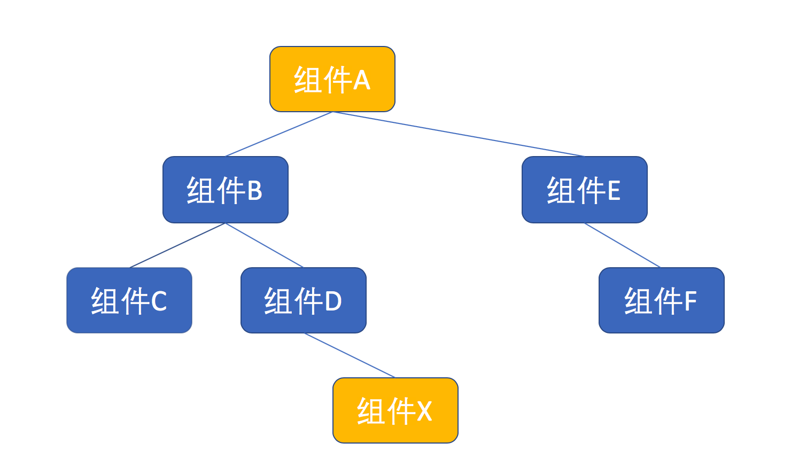
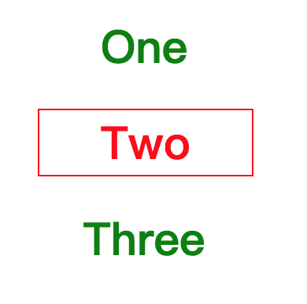

# React 组件设计模式

在 React 设计模式中，最重要、也是最为大家所津津乐道的几个模式分别是：

- 有状态组件与无状态组件
- 高阶组件（HOC）

- Render Props


这些形态各异的 React 设计模式虽然实现思路有所不同，但本质上基本都是为了实现这样一个终极目标——以尽可能优雅的姿态，实现组件逻辑的复用。下面就来看看这些设计模式。

## 1. 有状态组件和无状态组件

### （1）概念

在 React 应用中，最简单也是最常用的一种组件模式，就是**有状态组件和无状态组件**。这种模式的本质就是：**把一个功能分配到两个组件中，形成父子关系，外层的父组件负责管理数据状态，内层的子组件只负责展示。**


**那****为什么要分割有状态组件和无状态组件呢？**

软件设计中有一个原则，叫做“**责任分离**”（Separation of Responsibility），简单说就是让一个模块的责任尽量少，如果一个模块功能过多，就应该拆分为多个模块，让一个模块都专注于一个功能，这样更利于代码的维护。


使用 React 来做界面，无外乎就是获得驱动界面的数据，然后利用这些数据来渲染界面。当然，可以这些可以在一个组件中搞定，但是，最好把获取和管理数据这件事和界面渲染这件事分开。做法就是，**把获取和管理数据的逻辑放在父组件，也就是有状态组件；把渲染界面的逻辑放在子组件，也就是无状态组件。**


这么做的好处就是可以灵活地修改数据状态管理方式，比如，最初可能用 Redux 来管理数据，然后想要修改为用 Mobx，如果按照这种模式分割组件，需要改的只有有状态组件，无状态组件可以保持原状。

### （2）示例

下面来实现一个显示“随机笑话”的功能，所谓“随机笑话”，就是需要从服务器获取随机的一个笑话，展示在页面上。功能可以分为两部分，第一部分是展示，也就是无状态组件，代码如下：

```jsx
import SmileFace from './simile.png';
const Joke = ({value}) => {
  return (
    <div>
      
      {value || 'loading...' }
    </div>
  );
}
```

无状态组件 `Joke` 的功能很简单，显示一个笑脸，然后显示名为 value 的 props，也就是笑话的内容，如果没有 value 值，就显示一个“loading...”。至于如何获得笑话内容，不是 Joke 的事，它只专注于显示笑话，免去了数据管理的烦恼。


然后是有状态组件，这个组件不用管渲染的逻辑，只负责拿到数据，然后把数据传递给无状态组件，由无状态组件来完成渲染。代码如下：

```jsx
export default class RandomJoke extends React.Component {
  state = {
    joke: null
  }
  render() {
    return <Joke value={this.state.joke} />
  }
  componentDidMount() {
    fetch('https://icanhazdadjoke.com/',
      {headers: {'Accept': 'application/json'}}
    ).then(response => {
      return response.json();
    }).then(json => {
      this.setState({joke: json.joke});
    });
  }
}
```

可以看到，RandomJoke 的 `render` 函数只做一件事，就是渲染 Joke，并把 `this.state` 中的值作为 props 传进去。有状态组件的 `render` 函数一般都很简单，因为渲染不是他们的业务，它们的主业是获取数据。


RandomJoke 获取数据的方法是在 `componentDidMount` 函数中调用一个 API，这个 API 随即返回一个英文笑话。当 RandomJoke 被第一次渲染的时候，它的 state 中的 joke 值为 `null`，所以它传给 Joke 的 value 也是 `null`，这时候，Joke 会渲染一 “loading...”。在第一次渲染完毕的时候，`componentDidMount` 被调用，一个 API 请求发出去，拿到一个随机笑话，更新 state 中的值。因为对一个组件 state 的更新会引发一个新的渲染过程，所以 RandomJoke 的 `render` 再一次被调用，所以 Joke 也会再一次被渲染，笑话也就出现了。


最终类似这样：


应用这种方法之后，如果要优化界面，只需要去修改无状态组件 Joke，如果想改进数据管理和获取，只需要去修改有状态组件 RandomJoke。如此一来，维护工作就简单多了，甚至可以把两个组件分配各两个不同的开发者去维护开发。如果应用 Redux 或 Mobx，也会应用到这种模式。

### （3）PureComponent

因为无状态组件没有自己的状态，所以，可以像上面的 Joke 一样实现为函数形式，其实可以进一步改进，利用 `PureComponent` 来提高无状态组件的性能。函数形式的 React 组件，好处是不需要管理 state，占用资源少，但是，函数形式的组件无法利用 `shouldComponentUpdate`。


看上面的例子，当 RandomJoke 要渲染 Joke 时，即使传入的 props 是一模一样的，Joke 也要走一遍完整的渲染过程，这就显得浪费了。好一点的方法，是把 Joke 实现为一个类，而且定义 shouldComponentUpdate 函数，每次渲染过程中，在 render 函数执行之前 `shouldComponentUpdate` 会被调用，如果返回 `true`，那就继续，如果返回 `false`，那么渲染过程立刻停止，因为这代表不需要重新渲染了。


对于无状态组件，因为逻辑很简单，界面完全由 props 决定，所以 `shouldComponentUpdate` 的实现方式就是比较这次渲染的 props 是否和上一次 props 相同。当然，让每一个组件都实现一遍这样简单的 shouldComponentUpdate 也很浪费，所以，React 提供了一个简单的实现工具 `PureComponent`，可以满足绝大部分需求。


改进后的 Joke 组件如下：

```jsx
class Joke extends React.PureComponent {
  render() {
    return (
      <div>
        
        {this.props.value || 'loading...' }
      </div>
    );
  }
}
```

注意：`PureComponent` 中 `shouldComponentUpdate` 对 props 做得只是浅层比较，不是深层比较，如果 props 是一个深层对象，就容易产生问题。比如，两次渲染传入的某个 props 都是同一个对象，但是对象中某个属性的值不同，这在 PureComponent 眼里，props 没有变化，不会重新渲染，但是这明显不是我们想要的结果。

### （4）React.memo

虽然 PureComponent 可以提高组件渲染性能，但是它迫使我们必须把组件实现为 class，不能用纯函数来实现组件。如果使用 React v16.6.0 之后的版本，可以使用一个新功能 `React.memo` 来完美实现 React 组件，上面的 Joke 组件可以这么写：

```jsx
const Joke = React.memo(() => (
    <div>
        
        {this.props.value || 'loading...' }
    </div>
));
```

React.memo 既利用了 shouldComponentUpdate，又不要求写一个 class，这也体现出 React 逐步向完全函数式编程前进。

## 2. 高阶组件

在开发 React 组件过程中，很容易发现这样一种现象，某些功能是多个组件通用的，如果每个组件都重复实现这样的逻辑，肯定十分浪费，而且违反了“不要重复自己”（DRY，Don't Repeat Yourself)的编码原则，需要把这部分共用逻辑提取出来重用。


在 React 的世界里，组件是第一公民，首先想到的是当然是把共用逻辑提取为一个 React 组件。不过，有些情况下，这些共用逻辑无法成为一个独立组件，换句话说，这些共用逻辑单独无法使用，它们只是对其他组件的功能加强。


举个例子，对于很多网站应用，有些模块都需要在用户已经登录的情况下才显示。比如，对于一个电商类网站，“退出登录”按钮、“购物车”这些模块，就只有用户登录之后才显示，对应这些模块的 React 组件如果连“只有在登录时才显示”的功能都重复实现，那就浪费了。

这时候就可以利用“高阶组件（HoC）”这种模式来解决问题。

### （1）基本形式

React官方岁高阶组件的解释：

高阶组件（HOC）是 React 中用于复用组件逻辑的一种高级技巧。HOC 自身不是 React API 的一部分，它是一种基于 React 的组合特性而形成的设计模式。

“高阶组件”名为“组件”，其实并不是一个组件，而是一个函数，只不过这个函数比较特殊，它接受至少一个 React 组件为参数，并且能够返回一个全新的 React 组件作为结果，当然，这个新产生的 React 组件是对作为参数的组件的包装，所以，可以赋予新组件一些增强的“神力”。一个简单的高阶组件是这样的形式：

```jsx
const withDoNothing = (Component) => {
  const NewComponent = (props) => {
    return <Component {...props} />;
  };
  return NewComponent;
};
```

上面的函数 `withDoNothing` 就是一个高阶组件，作为一项业界通用的代码规范，高阶组件的命名一般都带 `with` 前缀，命名中后面的部分代表这个高阶组件的功能。就如同 withDoNothing 这个名字所说的一样，这个高阶组件什么都没做，但是从中可以看出高阶组件的基本代码套路：

- 高阶组件不能去修改作为参数的组件，高阶组件必须是一个纯函数，不应该有任何副作用。
- 高阶组件返回的结果必须是一个新的 React 组件，这个新的组件的 JSX 部分肯定会包含作为参数的组件。

- 高阶组件一般需要把传给自己的 props 转手传递给作为参数的组件。

### （2）抽取共同逻辑

下面对 withDoNothing 进行一些改进，让它实现“只有在登录时才显示”这个功能。假设已经有一个函数 `getUserId` 能够从 cookies 中读取登录用户的 ID，如果用户未登录，这个 `getUserId` 就返回空，那么“退出登录按钮“就需要这么写：

```jsx
const LogoutButton = () => {
  if (getUserId()) {
    return ...; // 显示”退出登录“的JSX
  } else {
    return null;
  }
};
```

购物车的代码就是这样：

```jsx
const ShoppintCart = () => {
  if (getUserId()) {
    return ...; // 显示”购物车“的JSX
  } else {
    return null;
  }
};
```

上面两个组件明显有重复的代码，可以把重复代码抽取出来，形成 `withLogin` 这个高阶组件，代码如下：

```jsx
const withLogin = (Component) => {
  const NewComponent = (props) => {
    if (getUserId()) {
      return <Component {...props} />;
    } else {
      return null;
    }
  }
  return NewComponent;
};
```

这样，就只需要这样定义 `LogoutButton` 和 `ShoppintCart`：

```jsx
const LogoutButton = withLogin((props) => {
  return ...; // 显示”退出登录“的JSX
});
const ShoppingCart = withLogin(() => {
  return ...; // 显示”购物车“的JSX
});
```

这样就避免了重复代码，以后如果要修改对用户是否登录的判断逻辑，也只需要修改 withLogin，而不用修改每个 React 组件。

### （3）高级用法

高阶组件只需要返回一个 React 组件即可，我们可以传入多个 React 组件给高阶组件。


比如，可以改进上面的 withLogin，让它接受两个 React 组件，根据用户是否登录选择渲染合适的组件：

```jsx
const withLoginAndLogout = (ComponentForLogin, ComponentForLogout) => {
  const NewComponent = (props) => {
    if (getUserId()) {
      return <ComponentForLogin {...props} />;
    } else {
      return <ComponentForLogout{...props} />;
    }
  }
  return NewComponent;
};
```

有了 `withLoginAndLogout`，就可以产生根据用户登录状态显示不同的内容：

```jsx
const TopButtons = withLoginAndLogout(
  LogoutButton,
  LoginButton
);
```

### （4）链式调用

高阶组件最巧妙的一点就是可以链式调用。假设，有三个高阶组件分别是 `withOne`、`withTwo` 和 `withThree`，那么，如果要赋予一个组件 X 某个高阶组件的超能力，那么要做的就是挨个使用高阶组件包装，代码如下：

```jsx
const X1 = withOne(X);
const X2 = withTwo(X1);
const X3 = withThree(X2);
const SuperX = X3; //最终的SuperX具备三个高阶组件的超能力
```

可以避免使用中间变量 `X1` 和 `X2`，直接连续调用高阶组件，如下：

```jsx
const SuperX = withThree(withTwo(withOne(X)));
```

对于 `X` 而言，它被高阶组件包装了，至于被一个高阶组件包装，还是被 N 个高阶组件包装，没有什么差别。而高阶组件本身就是一个纯函数，纯函数是可以组合使用的，所以，可以把多个高阶组件组合为一个高阶组件，然后用这一个高阶组件去包装`X`，代码如下：

```jsx
const hoc = compose(withThree, withTwo, withOne);
const SuperX = hoc(X);
```

在上面代码中使用的 `compose`，是函数式编程中很基础的一种方法，作用就是把多个函数组合为一个函数，在很多开源的代码库中都可以看到，下面是一个参考实现：

```jsx
export default function compose(...funcs) {
  if (funcs.length === 0) {
    return arg => arg
  }
  if (funcs.length === 1) {
    return funcs[0]
  }
  return funcs.reduce((a, b) => (...args) => a(b(...args)))
}
```

React 组件可以当做积木一样组合使用，现在有了 compose，可以把高阶组件也当做积木一样组合，进一步重用代码。假如一个应用中多个组件都需要同样的多个高阶组件包装，那就可以用 compose 组合这些高阶组件为一个高阶组件，这样在使用多个高阶组件的地方实际上就只需要使用一个高阶组件了。

### （5）不要滥用

高阶组件虽然可以用一种可重用的方式扩充现有 React 组件的功能，但高阶组件并不是绝对完美的。


首先，高阶组件不得不处理 `displayName`。当 React 渲染出错的时候，靠组件的 displayName 静态属性来判断出错的组件类，而高阶组件总是创造一个新的 React 组件类，所以，每个高阶组件都需要处理一下 displayName。如果要做一个最简单的什么增强功能都没有的高阶组件，也必须要写下面这样的代码：

```jsx
const withExample = (Component) => {
  const NewComponent = (props) => {
    return <Component {...props} />;
  }
  
  NewComponent.displayName = `withExample(${Component.displayName || Component.name || 'Component'})`;
  
  return NewCompoennt;
};
```

每个高阶组件都这么写，就会非常麻烦。对于 React 生命周期函数，高阶组件不用怎么特殊处理，但是，如果内层组件包含定制的静态函数，这些静态函数的调用在 React 生命周期之外，那么高阶组件就必须要在新产生的组件中增加这些静态函数的支持，这更加麻烦。


其次，高阶组件支持嵌套调用，这是它的优势。但是如果真的一大长串高阶组件被应用的话，当组件出错，看到的会是一个超深的 stack trace。


最后，使用高阶组件要避免重复产生 React 组件，比如，下面的代码是有问题的：

```jsx
const Example = () => {
  const EnhancedFoo = withExample(Foo);
  return <EnhancedFoo />
}
```

像上面这样写，每一次渲染 Example，都会用高阶组件产生一个新的组件，虽然都叫做 `EnhancedFoo`，但是对 React 来说是一个全新的东西，在重新渲染的时候不会重用之前的虚拟 DOM，会造成极大的浪费。正确的写法是下面这样，自始至终只有一个 EnhancedFoo 组件类被创建：

```jsx
const EnhancedFoo = withExample(Foo);
const Example = () => {
  return <EnhancedFoo />
}
```

总之，高阶组件是重用代码的一种方式，但并不是唯一方式，下面来看一种更加精妙的方式： render props。

## 3. render props

### （1）概念

所谓 render props，指的是让 React 组件的 props 支持函数这种模式。因为作为 props 传入的函数往往被用来渲染一部分界面，所以这种模式被称为 render props。


**高阶组件的使用姿势是用“函数”包裹“组件”，而 render props 恰恰相反，它强调的是用“组件”包裹“函数”。**


一个简单的 render props 组件 `RenderAll`，代码如下：

```jsx
const RenderAll = (props) => {
  return(
     <React.Fragment>
      {props.children(props)}
     </React.Fragment>
  );
};
```

这个 `RenderAll` 预期子组件是一个函数，它所做的事情就是把子组件当做函数调用，调用参数就是传入的 props，然后把返回结果渲染出来，除此之外什么事情都没有做。使用 RenderAll 的代码如下：

```jsx
<RenderAll>
   {() => <h1>hello world</h1>}
</RenderAll>
```

可以看到，RenderAll 的子组件，也就是夹在 RenderAll 标签之间的部分，其实是一个函数。这个函数渲染出 `<h1>hello world</h1>`，这就是上面使用 RenderAll 渲染出来的结果。当然，这个 RenderAll 没做任何实际工作。

### （2）传递 props

和高阶组件一样，render props 可以做很多的定制功能，下面以根据是否登录状态来显示一些界面元素为例，下面来实现一个 render props。


下面是实现 render props 的 `Login` 组件，可以看到，render props 和高阶组件的第一个区别，就是 render props 是真正的 React 组件，而不是一个返回 React 组件的函数：

```jsx
const Login = (props) => {
  const userName = getUserName();
  if (userName) {
    const allProps = {userName, ...props};
    return (
      <React.Fragment>
        {props.children(allProps)}
      </React.Fragment>
    );
  } else {
    return null;
  }
};
```

当用户处于登录状态，`getUserName` 返回当前用户名，否则返回空，然后根据这个结果决定是否渲染 `props.children` 返回的结果。


当然，render props 完全可以决定哪些 props 可以传递给 props.children，在 Login 中，把 `userName` 作为增加的 props 传递给下去，这样就是 Login 的增强功能。一个使用上面 Login 的 JSX 代码示例如下：

```jsx
<Login>
    {({userName}) => <h1>Hello {userName}</h1>}
 </Login>
```

对于名为“React”的用户登录，上面的 JSX 会产生 `<h1>Hello React</h1>`。

### （3）不局限于 children

在上面的例子中，作为 render 方法的 props 就是 `children`，这种模式可以看做“以函数为子组件（function as child）”，这可以算是 render props 的一种具体形式，也就利用 `children` 这个 props 来作为函数传递。


实际上，render props 这个模式不必局限于 children 这一个 props，任何一个 props 都可以作为函数，也可以利用多个 props 来作为函数。


下面来扩展 Login，不只在用户登录时显示一些东西，也可以定制用户没有登录时显示的东西，这个组件叫做 `Auth`，代码如下：

```jsx
const Auth= (props) => {
  const userName = getUserName();
  if (userName) {
    const allProps = {userName, ...props};
    return (
      <React.Fragment>
        {props.login(allProps)}
      </React.Fragment>
    );
  } else {
    <React.Fragment>
      {props.nologin(props)}
    </React.Fragment>
  }
};
```

使用 Auth 可以分别通过 `login` 和 `nologin` 两个 props 来指定用户登录或者没登录时显示什么，用法如下：

```jsx
<Auth
    login={({userName}) => <h1>Hello {userName}</h1>}
    nologin={() => <h1>Please login</h1>}
/>
```

### （4）依赖注入

render props 其实就是 React 中的“依赖注入”（Dependency Injection)。所谓依赖注入，指的是解决这样一个问题：逻辑 A 依赖于逻辑 B，如果让 A 直接依赖于 B，当然可行，但是 A 就没法做得通用了。依赖注入就是把 B 的逻辑以函数形式传递给 A，A 和 B 之间只需要对这个函数接口达成一致就行，如此一来，再来一个逻辑 C，也可以用一样的方法重用逻辑 A。


在上面示例中，`Login` 和 `Auth` 组件就是上面所说的逻辑 A，而传递给组件的函数类型 props，就是逻辑 B 和 C。

### （5）render props 和高阶组件对比

下面来比对一下这两种重用 React 组件逻辑的模式。


首先，render props 模式的应用，就是做一个 React 组件，而高阶组件，虽然名为“组件”，其实只是一个产生 React 组件的函数。render props 不像高阶组件有那么多毛病，render props 的缺点就是 render props 不能像高阶组件那样链式调用，当然，这并不是一个致命缺点。


render props 相对于高阶组件还有一个显著优势，就是对于新增的 props 更加灵活。还是以登录状态为例，假如扩展 withLogin 的功能，让它给被包裹的组件传递用户名这个 props，代码如下：

```jsx
const withLogin = (Component) => {
  const NewComponent = (props) => {
    const userName= getUserName();
    if (userName) {
      return <Component {...props} userName={userName}/>;
    } else {
      return null;
    }
  }
  return NewComponent;
};
```

这就要求被 withLogin 包住的组件要接受 `userName` 这个props。可是，假如有一个现成的 React 组件不接受 userName，却接受名为 `name` 的 props 作为用户名，就不能直接用 withLogin 包住这个 React 组件，还要再造一个组件来做 `userName` 到 `name` 的映射，很麻烦。


对于应用 render props 的 Login，就不存在这个问题，可以这样写：

```jsx
<Login>
  {
    (props) => {
      const {userName} = props;
      return <TheComponent {...props} name={userName} />
    }
  }
</Login>
```

所以，当需要重用 React 组件的逻辑时，首先看这个功能是否可以抽象为一个简单的组件；如果行不通的话，考虑是否可以应用 render props 模式；再不行的话，才考虑应用高阶组件模式。

## 4. 提供者模式

在 React 中，props 是组件之间通讯的主要手段，但是有一种场景单纯靠 props 来通信是不恰当的，那就是两个组件之间间隔着多层其他组件，下面是一个组件树示例图：



在上图中，组件 A 需要传递信息给组件 X，如果通过 props 的话，那么从顶部的组件 A 开始，要把 props 传递给组件 B，然后组件 B 传递给组件 D，最后组件 D 再传递给组件 X。其实组件 B 和组件 D 完全用不上这些 props，但是又被迫传递这些 props，这明显不合理，要知道组件树的结构会变化的，将来如果组件 B 和组件 D 之间再插入一层新的组件，这个组件也需要传递这个 props，这就麻烦无比。


可见，对于跨级的信息传递，需要一个更好的方法。在 React 中，解决这个问题应用的就是“提供者模式”。

### （1）概念

虽然这个模式叫做“提供者模式”，但是其实有两个角色，一个是“提供者”（Provider），另一个是“消费者”（Consumer），这两个角色都是 React 组件。其中“提供者”在组件树上居于比较靠上的位置，“消费者”处于靠下的位置。在上面的组件树中，组件 A 可以作为提供者，组件 X 就是消费者。


提供者可以提供一些信息，而且这些信息在它之下的所有组件，无论隔了多少层，都可以直接访问到，而不需要通过 props 层层传递。

避免 props 逐级传递。

### （2）实现提供者模式

实现提供者模式需要 React 的 Context 功能，可以说，提供者模式只不过是让 Context 功能更好用一些而已。


所谓 Context 功能，就是能够创造一个“上下文”，在这个上下文之下的所有组件都可以访问同样的数据。


在 React v16.3.0 之前，React 虽然提供了 Context 功能，但是官方文档上都建议尽量不要使用。当 React 发布 v16.3.0 时，提供了“正式版本”的 Context 功能 API，和之前的有很大不同。


提供者模式的一个典型用例就是实现“样式主题”（Theme），由顶层的提供者确定一个主题，下面的样式就可以直接使用对应主题里的样式。这样，当需要切换样式时，只需要修改提供者就行，其他组件不用修改。

### （3）React v16.3.0 之前的提供者模式

在 React v16.3.0 之前，要实现提供者就要实现一个 React 组件，不过这个组件要做两个特殊处理：

- 需要实现 `getChildContext` 方法，用于返回“上下文”的数据；
- 需要定义 `childContextTypes` 属性，声明“上下文”的结构。


下面就是一个实现“提供者”的例子，组件名为 `ThemeProvider`：

```jsx
class ThemeProvider extends React.Component {
  getChildContext() {
    return {
      theme: this.props.value
    };
  }
  render() {
    return (
      <React.Fragment>
        {this.props.children}
      </React.Fragment>
    );
  }
}
ThemeProvider.childContextTypes = {
  theme: PropTypes.object
};
```

在这个例子中，getChildContext 只是简单返回名为 `value` 的 props 值，但是，因为 getChildContext 是一个函数，它可以有更加复杂的操作，比如可以从 state 或者其他数据源获得数据。


对于 ThemeProvider，创造了一个上下文，这个上下文就是一个对象，结构是这样：

```jsx
{
  theme: {
    //一个对象
  }
}
```

接下来做两个消费（也就是使用）这个“上下文”的组件，第一个是 `Subject`，代表标题；第二个是 `Paragraph`，代表章节。把 Subject 实现为一个类，代码如下：

```jsx
class Subject extends React.Component {
  render() {
    const {mainColor} = this.context.theme;
    return (
      <h1 style={{color: mainColor}}>
        {this.props.children}
      </h1>
    );
  }
}
Subject.contextTypes = {
  theme: PropTypes.object
}
```

在 Subject 的 `render` 函数中，可以通过 `this.context` 访问到“上下文”数据，因为 ThemeProvider 提供的“上下文”包含 `theme` 字段，所以可以直接访问 `this.context.theme`。


Subject 必须增加 `contextTypes` 属性，必须和 ThemeProvider 的 `childContextTypes` 属性一致，不然，`this.context` 就不会得到任何值。


React 要求“提供者”用 `childContextTypes` 定义一次上下文结构，“消费者”再用 `contextTypes` 再重复定义一次，这是考虑到“上下文”可能会嵌套，就是一个“提供者”套着另一个“提供者”，这时候，底层的消费者组件到底消费哪一个“提供者”呢？通过这种显示的方式指定。


上面的 Subject 是一个类，其实也可以把消费者实现为一个纯函数组件，只不过访问“上下文”的方式有些不同，用纯函数的方式实现另一个消费者 `Paragraph`，代码如下：

```jsx
const Paragraph = (props, context) => {
  const {textColor} = context.theme;
  return (
    <p style={{color: textColor}}>
      {props.children}
    </p>
  );
};
Paragraph.contextTypes = {
  theme: PropTypes.object
};
```

从上面的代码可以看到，因为 Paragraph 是一个函数形式，所以不可能访问 `this.context`，但是函数的第二个参数其实就是 `context`。当然，也不要忘了设定 Paragraph 的 `contextTypes`，不然参数 `context` 也不会是上下文。


最后，来看如何结合”提供者“和”消费者“。做一个组件来使用 Subject 和 Paragraph，这个组件不需要帮助传递任何 props，代码如下：

```jsx
const Page = () => (
  <div>
    <Subject>这是标题</Subject>
    <Paragraph>
      这是正文
    </Paragraph>
  </div>
);
```

上面的组件 `Page` 使用了 Subject 和 Paragraph，现在想要定制样式主题，只需要在 Page 或者任何需要应用这个主题的组件外面包上 ThemeProvider，对应的 JSX 代码如下：

```jsx
<ThemeProvider value={{mainColor: 'green', textColor: 'red'}} >
    <Page />
</ThemeProvider>
```

最后，看到的效果如下：


当需要改变一个样式主题的时候，改变传给 ThemeProvider 的 value 值就搞定了。

### （4）React v16.3.0 之后的提供者模式

在React v16.3.0，新的 Context API 出来了，这套 API 毫不掩饰自己就是“提供者模式”的实现，命名上就带 “Provider” 和 “Consumer”。


还是上面的样式主题的例子，首先，要用新提供的 `createContext` 函数创造一个“上下文”对象。

```jsx
const ThemeContext = React.createContext();
```

这个“上下文”对象 `ThemeContext` 有两个属性，分别就是 `Provider` 和 `Consumer`。

```jsx
const ThemeProvider = ThemeContext.Provider;
const ThemeConsumer = ThemeContext.Consumer;
```

创造“提供者”极大简化了，都不需要创造一个 React 组件类。使用“消费者”也同样简单，而且应用了 render props 模式，Subject 的代码如下:

```jsx
class Subject extends React.Component {
  render() {
    return (
      <ThemeConsumer>
        {
          (theme) => (
            <h1 style={{color: theme.mainColor}}>
              {this.props.children}
            </h1>
          )
        }
      </ThemeConsumer>
    );
  }
}
```

上面的 `ThemeConsumer` 其实就是一个应用了 render props 模式的组件，它要求子组件是一个函数，会把“上下文”的数据作为参数传递给这个函数，而这个函数里就可以通过参数访问“上下文”对象。


在新的 API 里，不需要设定组件的 `childContextTypes` 或者 `contextTypes` 属性，这省了不少事。可以注意到，Subject 没有自己的状态，没必要实现为类，我们用纯函数的形式实现 `Paragraph`，代码如下：

```jsx
const Paragraph = (props, context) => {
  return (
    <ThemeConsumer>
      {
        (theme) => (
          <p style={{color: theme.textColor}}>
            {props.children}
          </p>
          )
      }
    </ThemeConsumer>
  );
};
```

实现 `Page` 的方式并没有变化，而应用 `ThemeProvider` 的代码和之前也完全一样:

```jsx
<ThemeProvider value={{mainColor: 'green', textColor: 'red'}} >
    <Page />
</ThemeProvider>
```

### （5）两种提供者模式实现方式的比较

通过上面的代码，可以很清楚地看到，新的 Context API 更简洁，但也并不是十全十美。


在老版 Context API 中，“上下文”只是一个概念，并不对应一个代码，两个组件之间达成一个协议，就诞生了“上下文”。在新版 Context API 中，需要一个“上下文”对象（上面的例子中就是 `ThemeContext`)，使用“提供者”的代码和“消费者”的代码往往分布在不同的代码文件中，这个 `ThemeContext` 对象放在一个独立的文件中，这么一来，就多出一个代码文件，而且所有和这个“上下文”相关的代码，都要依赖于这个“上下文”代码文件，虽然这没什么大不了的，但是的确多了一层依赖关系。


为了避免依赖关系复杂，每个应用都不要滥用“上下文”，应该限制“上下文”的使用个数。

## 5. 组合组件

所谓模式，就是特定于一种问题场景的解决办法：**模式(Pattern) = 问题场景(Context) + 解决办法(Solution)**


组合组件模式要解决的是这样一类问题：父组件想要传递一些信息给子组件，但是，如果用 props 传递又显得十分麻烦。看到这个问题描述，可能想到 Context API，利用 Context，可以让组件之间不用 props 来传递信息。不过，使用 Context 也不是完美解法，使用新的 Context API，需要让“提供者”和“消费者”共同依赖于一个 Context 对象，而且消费者也要使用 render props 模式。如果不嫌麻烦，用 Context 来解决问题当然好，但是肯定会想有没有更简洁的方式， 那就是利用组合组件。

### （1）示例

很多界面都有 Tab 这样的元件，我们需要一个 `Tabs` 组件和 `TabItem` 组件，Tabs 是容器，TabItem 是一个一个单独的 Tab，一个时刻只有一个 TabItem 被选中，被选中的 TabItem 样式会和其他 TabItem 不同。首先想到的就是，用 Tabs 中一个 state 记录当前被选中的 Tabitem 序号，然后根据这个 state 传递 props 给 TabItem，当然，还要传递一个 `onClick` 事件进去，捕获点击选择事件。


按照这样的设计，Tabs 中如果要显示 One、Two、Three 三个 TabItem，JSX 代码大致这么写：

```jsx
<TabItem active={true} onClick={this.onClick}>One</TabItem>
<TabItem active={false} onClick={this.onClick}>Two</TabItem>
<TabItem active={false} onClick={this.onClick}>Three</TabItem>
```

上面的 TabItem 组件接受 `active` 这个 props，如果 `true` 代表当前是选中状态，当然可以工作，但是也存在问题：

- 每次使用 TabItem 都要传递一堆 props，好麻烦；
- 每增加一个新的 TabItem，都要增加对应的 props，更麻烦；

- 如果要增加 TabItem，就要去修改 Tabs 的 JSX 代码，超麻烦。


在理想情况下，我们希望随意增加减少 TabItem 实例，不用传递一堆 props，也不用去修改 Tabs 的代码，最好代码就这样：

```jsx
<Tabs>
  <TabItem>One</TabItem>
  <TabItem>Two</TabItem>
  <TabItem>Three</TabItem>
</Tabs>
```

这样，Tabs 和 TabItem 不通过表面的 props 传递也能心有灵犀，二者之间有某种神秘的“组合”，就是“组合组件”。


在这里，用一种更巧妙的方式来实现组合组件，可以避免 TabItem 的复杂化。先写出 TabItem 的代码，如下：

```jsx
const TabItem = (props) => {
  const {active, onClick} = props;
  const tabStyle = {
    'max-width': '150px',
    color: active ? 'red' : 'green',
    border: active ? '1px red solid' : '0px',
  };
  return (
    <h1 style={tabStyle} onClick={onClick}>
      {props.children}
    </h1>
  );
};
```

TabItem 有两个重要的 props：`active` 代表自己是否被激活，`onClick` 是自己被点击时应该调用的回调函数，这就足够了。TabItem 所做的就是根据这两个 props 渲染出 `props.children`，没有任何复杂逻辑，是一个无状态组件，用一个纯函数来实现。


接下来要做的，就看 Tabs 如何把 `active` 和 `onClick` 传递给 TabItem。来看一下使用组合组件的 JSX 代码：

```jsx
<Tabs>
    <TabItem>One</TabItem>
    <TabItem>Two</TabItem>
    <TabItem>Three</TabItem>
</Tabs>
```

Tabs 虽然可以访问到作为 props 的 `children`，但是到手的 `children` 已经是创造好的元素，而且是不可改变的，Tabs 是不可能把创造好的元素再强塞给 `children` 的。如果 Tabs 并不去渲染 `children`，而是把 `children` 拷贝一份，就有机会去篡改这份拷贝，最后渲染这份拷贝就好了。来看 Tabs 的实现代码：

```jsx
class Tabs extends React.Component {
  state = {
    activeIndex:  0
  }
  render() {
    const newChildren = React.Children.map(this.props.children, (child, index) => {
      if (child.type) {
        return React.cloneElement(child, {
          active: this.state.activeIndex === index,
          onClick: () => this.setState({activeIndex: index})
        });
      } else {
        return child;
      }
    });
    return (
      <Fragment>
        {newChildren}
      </Fragment>
    );
  }
}
```

在 render 函数中用到了 React 中不常用的两个 API：

- React.Children.map：遍历 `children` 中所有的元素，因为 `children` 可能是一个数组。
- React.cloneElement：复制某个元素。这个函数第一个参数就是被复制的元素，第二个参数可以增加新产生元素的 props，利用这个机会把 `active` 和 `onClick` 添加了进去。


这两个 API 双剑合璧，就能实现不通过表面的 props 传递，完成两个组件的“组合”。最终的效果如下：



点击任何一个 TabItem，其样式就会立刻改变。而维护哪个 TabItem 是当前选中的状态，则是 Tabs 的责任。

### （2）实际应用

从上面的代码可以看出，对于组合组件这种实现方式，TabItem 非常简化；Tabs 稍微麻烦了一点，但是好处就是把复杂度都封装起来了，从使用者角度，连 props 都看不见。


所以，应用组合组件的往往是共享组件库，把一些常用的功能封装在组件里，让应用层直接用就行。在 antd 和 bootstrap 这样的共享库中，都使用了组合组件这种模式。


如果某两个组件并不需要重用，那么就要谨慎使用组合组件模式，毕竟这让代码复杂了一些。