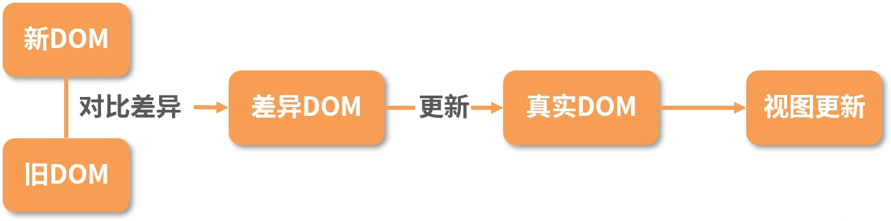
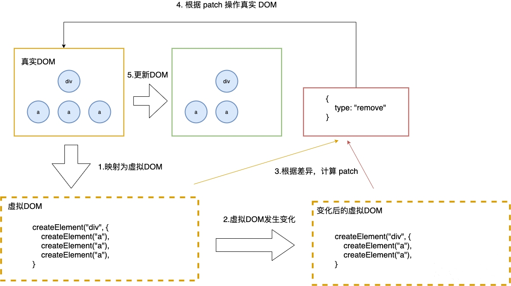
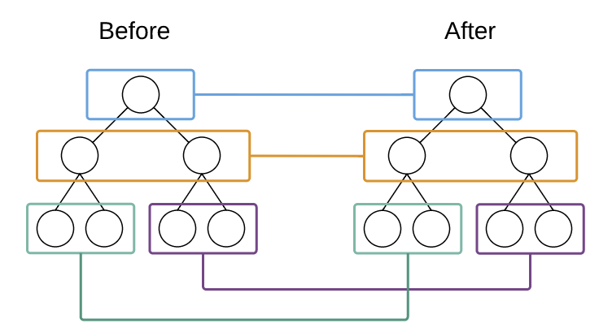
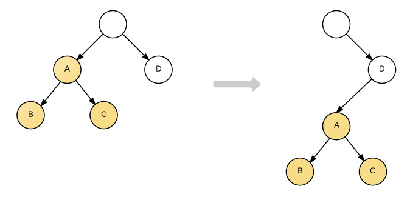
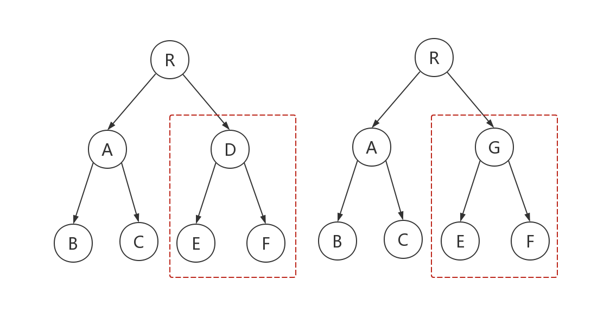
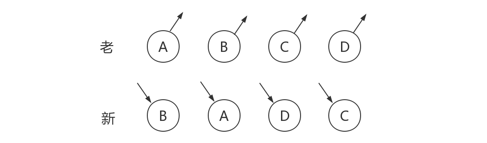
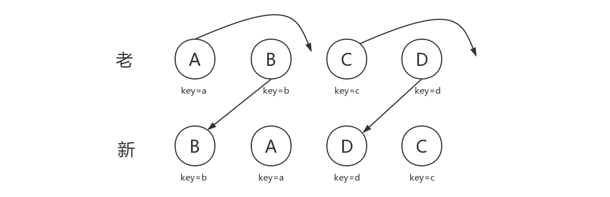
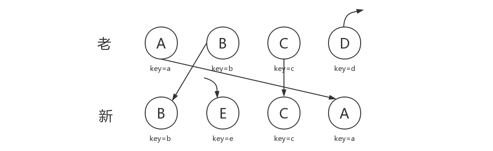
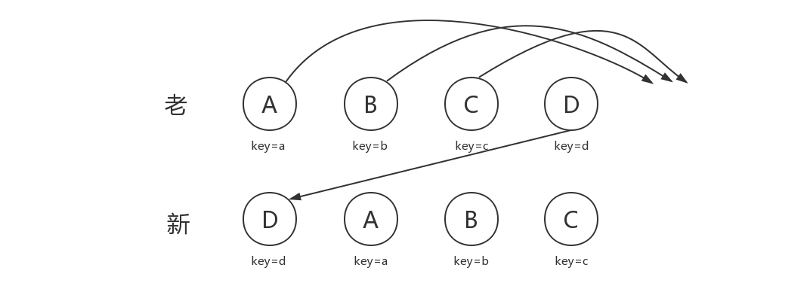

# React  diff 算法

## 1. diff 算法

实际上，diff 算法探讨的就是虚拟 DOM 树发生变化后，生成 DOM 树更新补丁的方式。它通过对比新旧两株虚拟 DOM 树的变更差异，将更新补丁作用于真实 DOM，以最小成本完成视图更新。



具体的流程如下：

- 真实的 DOM 首先会映射为虚拟 DOM；
- 当虚拟 DOM 发生变化后，就会根据差距计算生成 patch，这个 patch 是一个结构化的数据，内容包含了增加、更新、移除等；

- 根据 patch 去更新真实的 DOM，反馈到用户的界面上。



一个简单的例子：

```jsx
import React from 'react'
export default class ExampleComponent extends React.Component {
  render() {
    if(this.props.isVisible) {
       return <div className="visible">visbile</div>;
    }
     return <div className="hidden">hidden</div>;
  }
}
```

这里，首先假定 ExampleComponent 可见，然后再改变它的状态，让它不可见 。映射为真实的 DOM 操作是这样的，React 会创建一个 div 节点。

```jsx
<div class="visible">visbile</div>
```

当把 visbile 的值变为 false 时，就会替换 class 属性为 hidden，并重写内部的 innerText 为 hidden。**这样一个生成补丁、更新差异的过程统称为 diff 算法。**


在整个过程中你需要注意以下三点：

**（1）更新时机**

更新时机就是触发更新、进行差异对比的时机。根据前面的章节内容可以知道，更新发生在setState、Hooks 调用等操作以后。此时，树的结点发生变化，开始进行比对。那这里涉及一个问题，即两株树如何对比差异? 这里就需要使用遍历算法。

**（2）遍历算法**

遍历算法是指沿着某条搜索路线，依次对树的每个节点做访问。通常分为两种：深度优先遍历和广度优先遍历。

- 深度优先遍历，是从根节点出发，沿着左子树方向进行纵向遍历，直到找到叶子节点为止。然后回溯到前一个节点，进行右子树节点的遍历，直到遍历完所有可达节点。
- 广度优先遍历，则是从根节点出发，在横向遍历二叉树层段节点的基础上，纵向遍历二叉树的层次。

React 的diff 算法采用了深度优先遍历算法。因为广度优先遍历可能会导致组件的生命周期时序错乱，而深度优先遍历算法就可以解决这个问题。

**（3）优化策略**

优化策略是指 React 对 diff 算法做的优化手段。虽然深度优先遍历保证了组件的生命周期时序不错乱，但传统的 diff 算法也带来了一个严重的性能瓶颈，算法复杂度达到 O(n3)，其中 n 表示树的节点总数。O(n3) 就意味着如果要展示 1000 个节点，就要依次执行数十亿次的比较。正如计算机科学中常见的优化方案一样，React 用了一个非常经典的手法将复杂度降低为 O(n)，也就是分治，即通过“分而治之”这一巧妙的思想分解问题。


因此，想要将 diff 思想引入虚拟 DOM ，就需要设计一种稳定高效的 diff 算法。那么 React 中 diff 算法到底是如何实现的呢？


React 结合 Web 界面的特点做出了三个简单的假设，使得 Diff 算法复杂度直接降低到 O(n)。

- Web UI 中 DOM 节点跨层级的移动操作特别少，可以忽略不计；
- 两个相同组件产生类似的 DOM 结构，不同的组件产生不同的 DOM 结构；

- 对于同一层次的一组子节点，它们可以通过唯一的 id 进行区分。


基于以上三个假设，React 分别对 tree diff、component diff 以及 element diff 进行算法优化。

### （1）tree diff

由于跨节点层级的移动操作特别少到可以忽略不计，针对这一点，React 通过对两个树的同一层的节点进行比较，当发现节点已经不存在时，则该节点及其子节点会被完全删除掉，不会用于进一步的比较。这样只需要对树进行一次遍历，便能完成整个 DOM 树的比较，如下图所示：



当然，以上操作都限于对同一层的节点进行比较，那如果出现了 DOM 节点跨层级的移动操作，React diff 会有怎样的表现呢？



A 节点被整个移动到 D 节点下，直观的考虑 DOM Diff 操作应该是：

```jsx
A.parent.remove(A)
D.append(A)
```

但由于 React 只会简单的考虑同层节点的位置变换，对于不同层的节点，只有简单的创建和删除。当根节点发现子节点中 A 不见了，就会直接销毁 A 。而当 D 发现自己多了一个子节点 A，则会创建一个新的 A 作为子节点。因此对于这种结构的转变的实际操作是：

```jsx
A.destroy()
A = new A()
A.append(new B())
A.append(new C())
D.append(A)
```

由此可发现，当出现节点跨层级移动时，并不会出现想象中的移动操作，而是以 A 为根节点的树被整个重新创建，这是一种影响 React 性能的操作，因此 **React 官方建议不要进行 DOM 节点跨层级的操作。**


在实现自己的组件时，保持稳定的 DOM 结构会有助于性能的提升。例如，我们有时可以通过 CSS 隐藏或显示某些节点，而不是真的移除或添加 DOM 节点。

### （2）component diff

React 是基于组件构建应用的，对于组件间的比较所采取的策略也是简洁高效：

- 如果是同一类型的组件，按照原策略继续比较虚拟 DOM Tree ；
- 如果不是，则将该组件判断为 dirty component，从而替换整个组件下的所有子节点；

- 对于同一类型的组件，有可能其虚拟 DOM 没有任何变化，如果能够确切的知道这点那可以节省大量的 diff 运算时间，因此 React 允许用户通过 shouldComponentUpdate() 来判断该组件是否需要进行 diff 。


如下图，当 component D 改变为 component G 时，即使这两个 component 结构相似，一旦 React 判断 D 和 G 是不同类型的组件，就不会比较二者的结构，而是直接删除 component D，重新创建 component G 以及其子节点。虽然当两个 component 是不同类型但结构相似时，React diff 会影响性能，但正如 React 官方博客所言：不同类型的 component 是很少存在相似 DOM tree 的机会，因此这种极端因素很难在实现开发过程中造成重大影响的。



以下是 React 源码：

```jsx
updateChildren: function(nextNestedChildrenElements, transaction, context) {
  updateDepth++;
  var errorThrown = true;
  try {
    this._updateChildren(nextNestedChildrenElements, transaction, context);
    errorThrown = false;
  } finally {
    updateDepth--;
    if (!updateDepth) {
      if (errorThrown) {
        clearQueue();
      } else {
        processQueue();
      }
    }
  }
}
```

### （3）element diff

当节点处于同一层级时，React Diff 提供了三种节点操作：

- **INSERT_MARKUP**（插入）：新的 component 类型不在老集合里， 即是全新的节点，需要对新节点执行插入操作；
- **MOVE_EXISTING**（移动）：在老集合有新 component 类型，且 element 是可更新的类型，generateComponentChildren 已调用 receiveComponent，这种情况下 prevChild=nextChild，就需要做移动操作，可以复用以前的 DOM 节点；

- **REMOVE_NODE**（删除）：老 component 类型，在新集合里也有，但对应的 element 不同则不能直接复用和更新，需要执行删除操作，或者老 component 不在新集合里的，也需要执行删除操作。


源码如下：

```jsx
function enqueueInsertMarkup(parentInst, markup, toIndex) {
  updateQueue.push({
    parentInst: parentInst,
    parentNode: null,
    type: ReactMultiChildUpdateTypes.INSERT_MARKUP,
    markupIndex: markupQueue.push(markup) - 1,
    content: null,
    fromIndex: null,
    toIndex: toIndex
  })
}
function enqueueMove(parentInst, fromIndex, toIndex) {
  updateQueue.push({
    parentInst: parentInst,
    parentNode: null,
    type: ReactMultiChildUpdateTypes.MOVE_EXISTING,
    markupIndex: null,
    content: null,
    fromIndex: fromIndex,
    toIndex: toIndex
  })
}
function enqueueRemove(parentInst, fromIndex) {
  updateQueue.push({
    parentInst: parentInst,
    parentNode: null,
    type: ReactMultiChildUpdateTypes.REMOVE_NODE,
    markupIndex: null,
    content: null,
    fromIndex: fromIndex,
    toIndex: null
  })
}
```

如下图，模拟定义了“新”和“老”两个集合，老集合中包含节点：A、B、C、D，更新后的新集合中包含节点：B、A、D、C，两个集合的顺序发生了一些 改变。此时新集合和老集进行 diff 差异化对比时，发现 B != A，则创建并插入 B 至新集合，删除老集合 A；以此类推，创建并插入 A、D 和 C，删除 B、C 和 D。



通过上面的操作，可以发现，这样操作起来有些繁琐，因为节点内容都是相同的，只是位置发生了变化，如果全部采用删除、创建的操作，会很低效，其实只需要将这些节点进行位置移动即可。因此，React提出了优化策略：添加唯一的key 来区分。

## 2. key 的作用

上面的例子中，因为节点内容都是相同的，只是位置发生了变化，如果全部采用删除、创建的操作，会很低效。针对这一现象，React 提出优化策略：**允许开发者对同一层级的同组子节点，添加唯一 key 进行区分。**虽然只是小小的改动，性能上却发生了翻天覆地的变化。


新老集合所包含的节点，如下图所示，新老集合进行 Diff 差异化对比，通过 key 发现新老集合中的节点都是相同的节点，因此无需进行节点删除和创建，只需要将老集合中节点的位置进行移动，更新为新集合中节点的位置，此时 React 进行 Diff 运算之后，便会执行：B、D 不做任何操作，A、C 进行移动操作，即可。操作图示如下：



那么，如此高效的 diff 到底是如何运作的呢？让我们通过源码进行详细分析。


首先对新集合的节点进行循环遍历，`for (name in nextChildren)`，通过唯一 key 可以判断新老集合中是否存在相同的节点，`if (prevChild === nextChild)`，如果存在相同节点，则进行移动操作，但在移动前需要将当前节点在老集合中的位置与 `lastIndex` 进行比较，`if (child._mountIndex < lastIndex)` ，则进行节点移动操作，否则不执行该操作。这是一种顺序优化手段，`lastIndex` 一直在更新，表示访问过的节点在老集合中最右的位置（即最大的位置），如果新集合中当前访问的节点比 `lastIndex` 大，说明当前访问节点在老集合中就比上一个节点位置靠后，则该节点不会影响其他节点的位置，因此不用添加到差异队列中，即不执行移动操作，只有当访问的节点比 `lastIndex` 小时，才需要进行移动操作。


刚刚的图示，可以更为清晰直观的描述 diff 的差异对比过程：

1. **节点 B 判断**
   从新集合中取得 B，判断老集合中存在相同节点 B，通过对比节点位置判断是否进行移动操作，B 在老集合中的位置 `B._mountIndex = 1`，此时 `lastIndex = 0`，不满足 `child._mountIndex < lastIndex` 的条件，因此不对 B 进行移动操作；更新 `lastIndex = Math.max(prevChild._mountIndex, lastIndex)` ，其中 `prevChild._mountIndex` 表示 B 在老集合中的位置，则 `lastIndex ＝ 1` ，并将 B 的位置更新为新集合中的位置`prevChild._mountIndex = nextIndex` ，此时新集合中 `B._mountIndex = 0，nextIndex++` 进入下一个节点的判断。
2. **节点 A 判断**
   从新集合中取得 A，判断老集合中存在相同节点 A，通过对比节点位置判断是否进行移动操作，A 在老集合中的位置 `A._mountIndex = 0` ，此时 `lastIndex = 1`，满足 `child._mountIndex < lastIndex` 的条件，因此对 A 进行移动操作 `enqueueMove(this, child._mountIndex, toIndex)` ，其中 `toIndex` 其实就是 `nextIndex`，表示 A 需要移动到的位置；更新 `lastIndex = Math.max(prevChild._mountIndex, lastIndex)` ，则 `lastIndex ＝ 1` ，并将 A 的位置更新为新集合中的位置 `prevChild._mountIndex = nextIndex`，此时新集合中`A._mountIndex = 1，nextIndex++` 进入下一个节点的判断。

1. **节点 D 判断**
   从新集合中取得 D，判断老集合中存在相同节点 D，通过对比节点位置判断是否进行移动操作，D 在老集合中的位置 `D._mountIndex = 3`，此时 `lastIndex = 1`，不满足 `child._mountIndex < lastIndex` 的条件，因此不对 D 进行移动操作；更新 `lastIndex = Math.max(prevChild._mountIndex, lastIndex)` ，则 `lastIndex ＝ 3`，并将 D 的位置更新为新集合中的位置 `prevChild._mountIndex = nextIndex`，此时新集合中`D._mountIndex = 2，nextIndex++` 进入下一个节点的判断。
2. **节点 C 判断**
   从新集合中取得 C，判断老集合中存在相同节点 C，通过对比节点位置判断是否进行移动操作，C 在老集合中的位置 `C._mountIndex = 2`，此时 `lastIndex = 3` ，满足 `child._mountIndex < lastIndex` 的条件，因此对 C 进行移动操作 `enqueueMove(this, child._mountIndex, toIndex)` ；更新 `lastIndex = Math.max(prevChild._mountIndex, lastIndex)` ，则 `lastIndex ＝ 3` ，并将 C 的位置更新为新集合中的位置 `prevChild._mountIndex = nextIndex` ，此时新集合中 `C._mountIndex = 3，nextIndex++` 进入下一个节点的判断，由于 C 已经是最后一个节点，因此 diff 到此完成。


以上主要分析新老集合中存在相同节点但位置不同时，对节点进行位置移动的情况，如果新集合中有新加入的节点且老集合存在需要删除的节点，那么 React diff 又是如何对比运作的呢？


以下图为例：




下面是整个 Diff 算法后，React 执行的节点操作：

- 从新集合中取得 B，判断老集合中存在相同节点 B，由于 B 在老集合中的位置 `B._mountIndex = 1` ，此时lastIndex = 0，因此不对 B 进行移动操作；更新 `lastIndex ＝ 1` ，并将 B 的位置更新为新集合中的位置 `B._mountIndex = 0，nextIndex++` 进入下一个节点的判断。
- 从新集合中取得 E，判断老集合中不存在相同节点 E，则创建新节点 E；更新 `lastIndex ＝ 1` ，并将 E 的位置更新为新集合中的位置， `nextIndex++` 进入下一个节点的判断。

- 从新集合中取得 C，判断老集合中存在相同节点 C，由于 C 在老集合中的位置 `C._mountIndex = 2` ，`lastIndex = 1` ，此时 `C._mountIndex > lastIndex` ，因此不对 C 进行移动操作；更新 `lastIndex ＝ 2` ，并将 C 的位置更新为新集合中的位置，`nextIndex++` 进入下一个节点的判断。
- 从新集合中取得 A，判断老集合中存在相同节点 A，由于 A 在老集合中的位置 `A._mountIndex = 0`，`lastIndex = 2` ，此时 `A._mountIndex < lastIndex` ，因此对 A 进行移动操作；更新 `lastIndex ＝ 2` ，并将 A 的位置更新为新集合中的位置， `nextIndex++` 进入下一个节点的判断。

- 当完成新集合中所有节点 diff 时，最后还需要对老集合进行循环遍历，判断是否存在新集合中没有但老集合中仍存在的节点，发现存在这样的节点 D，因此删除节点 D，到此 diff 全部完成。


这一过程执行操作的源码如下：

```jsx
_updateChildren: function(nextNestedChildrenElements, transaction, context) {
  var prevChildren = this._renderedChildren;
  var nextChildren = this._reconcilerUpdateChildren(
    prevChildren, nextNestedChildrenElements, transaction, context
  );
  if (!nextChildren && !prevChildren) {
    return;
  }
  var name;
  var lastIndex = 0;
  var nextIndex = 0;
  for (name in nextChildren) {
    if (!nextChildren.hasOwnProperty(name)) {
      continue;
    }
    var prevChild = prevChildren && prevChildren[name];
    var nextChild = nextChildren[name];
    if (prevChild === nextChild) {
      // 移动节点
      this.moveChild(prevChild, nextIndex, lastIndex);
      lastIndex = Math.max(prevChild._mountIndex, lastIndex);
      prevChild._mountIndex = nextIndex;
    } else {
      if (prevChild) {
        lastIndex = Math.max(prevChild._mountIndex, lastIndex);
        // 删除节点
        this._unmountChild(prevChild);
      }
      // 初始化并创建节点
      this._mountChildAtIndex(
        nextChild, nextIndex, transaction, context
      );
    }
    nextIndex++;
  }
  for (name in prevChildren) {
    if (prevChildren.hasOwnProperty(name) &&
        !(nextChildren && nextChildren.hasOwnProperty(name))) {
      this._unmountChild(prevChildren[name]);
    }
  }
  this._renderedChildren = nextChildren;
},
// 移动节点
moveChild: function(child, toIndex, lastIndex) {
  if (child._mountIndex < lastIndex) {
    this.prepareToManageChildren();
    enqueueMove(this, child._mountIndex, toIndex);
  }
},
// 创建节点
createChild: function(child, mountImage) {
  this.prepareToManageChildren();
  enqueueInsertMarkup(this, mountImage, child._mountIndex);
},
// 删除节点
removeChild: function(child) {
  this.prepareToManageChildren();
  enqueueRemove(this, child._mountIndex);
},
_unmountChild: function(child) {
  this.removeChild(child);
  child._mountIndex = null;
},
_mountChildAtIndex: function(
  child,
  index,
  transaction,
  context) {
  var mountImage = ReactReconciler.mountComponent(
    child,
    transaction,
    this,
    this._nativeContainerInfo,
    context
  );
  child._mountIndex = index;
  this.createChild(child, mountImage);
},
```

当然，React diff 还是存在些许不足与待优化的地方，如下图所示，若新集合的节点更新为：D、A、B、C，与老集合对比只有 D 节点移动，而 A、B、C 仍然保持原有的顺序，理论上 diff 应该只需对 D 执行移动操作，然而由于 D 在老集合的位置是最大的，导致其他节点的` _mountIndex < lastIndex`，造成 D 没有执行移动操作，而是 A、B、C 全部移动到 D 节点后面的现象。



**注意：**在开发过程中，尽量减少类似将最后一个节点移动到列表首部的操作，当节点数量过大或更新操作过于频繁时，在一定程度上会影响 React 的渲染性能。


**使用 key 时应该注意：** 

- key应该是唯一的；
- key不要使用随机数（随机数在下一次render时，会重新生成一个数字）； 

- 使用index作为key，对性能是没有优化的；

## 3. 总结

### （1）diff 算法的三级策略

diff算法可以总结为三个策略，分别从树、组件及元素三个层面进行复杂度的优化：


**策略一：忽略节点跨层级操作场景，提升比对效率。（基于树进行对比）**

这一策略需要进行树比对，即对树进行分层比较。树比对的处理手法是非常“暴力”的，即两棵树只对同一层次的节点进行比较，如果发现节点已经不存在了，则该节点及其子节点会被完全删除掉，不会用于进一步的比较，这就提升了比对效率。


**策略二：如果组件的 class 一致，则默认为相似的树结构，否则默认为不同的树结构。****（基于组件进行对比）**

在组件比对的过程中：

- 如果组件是同一类型则进行树比对；
- 如果不是则直接放入补丁中。

只要父组件类型不同，就会被重新渲染。这也就是为什么 shouldComponentUpdate、PureComponent 及 React.memo 可以提高性能的原因。


**策略三：同一层级的子节点，可以通过标记 key 的方式进行列表对比。****（基于节点进行对比）**

元素比对主要发生在同层级中，通过标记节点操作生成补丁。节点操作包含了插入、移动、删除等。其中节点重新排序同时涉及插入、移动、删除三个操作，所以效率消耗最大，此时策略三起到了至关重要的作用。通过标记 key 的方式，React 可以直接移动 DOM 节点，降低内耗。

### （2）Fiber 设计对 diff 算法的影响

React 16 引入的 Fiber 设计给 diff 算法带来了一定的影响。


Fiber 机制下节点与树分别采用 FiberNode 与 FiberTree 进行重构。FiberNode 使用了双链表的结构，可以直接找到兄弟节点与子节点，使得整个更新过程可以随时暂停恢复。FiberTree 则是通过 FiberNode 构成的树。


Fiber 机制下，整个更新过程由 current 与 workInProgress 两株树双缓冲完成。当 workInProgress 更新完成后，通过修改 current 相关指针指向的节点，直接抛弃老树，虽然非常简单粗暴，却非常合理。

### （3）开发注意事项

根据 diff 算法的特点，在开发时我们需要注意以下三点：

- 根据 diff 算法的设计原则，应尽量避免跨层级节点移动。
- 通过设置唯一 key 进行优化，尽量减少组件层级深度。因为过深的层级会加深遍历深度，带来性能问题。

- 设置 shouldComponentUpdate 或者 React.pureComponet 减少 diff 次数。