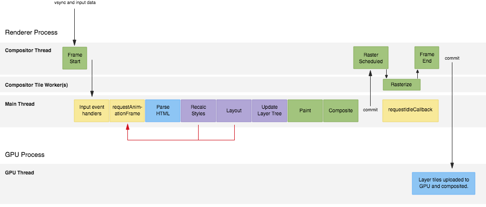
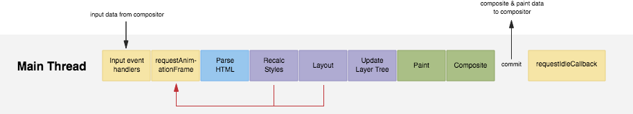
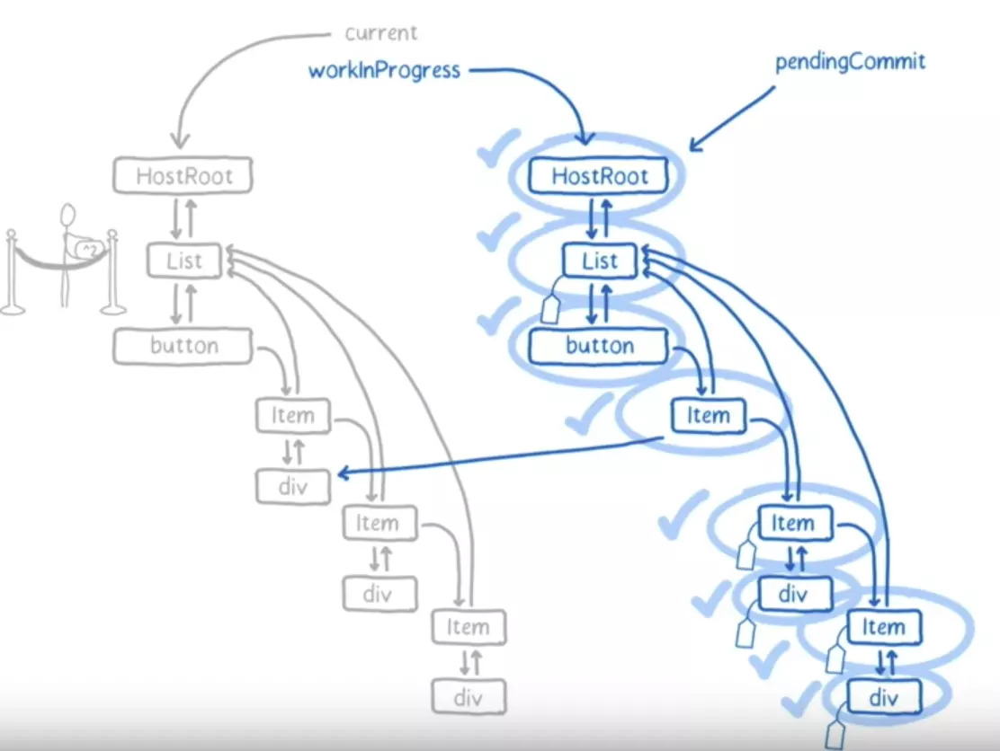
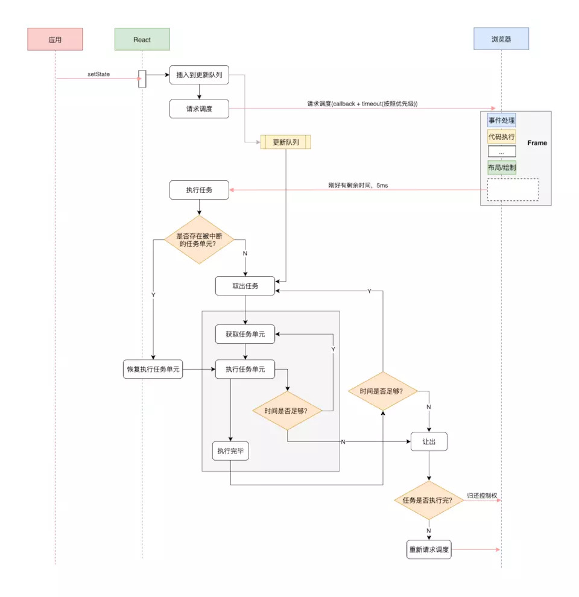

# React Fiber架构

## 1. React Fiber 概念

### （1）JavaScript 运行机制

在说Fiber架构之前，我们先来看看 JavaScript 的运行机制。JavaScript 是单线程运行的，所以JavaScript 线程和渲染线程是互斥的：这两个线程不能够穿插执行，必须串行。当其中一个线程执行时，另一个线程只能挂起等待。


具有相似特征的还有事件线程，浏览器的 Event-Loop 机制决定了事件任务是由一个异步队列来维持的。当事件被触发时，对应的任务不会立刻被执行，而是由事件线程把它添加到任务队列的末尾，等待 JavaScript 的同步代码执行完毕后，在空闲的时间里执行出队。


在这样的机制下，若 JavaScript 线程长时间地占用了主线程，那么渲染层面的更新就不得不长时间地等待，界面长时间不更新，带给用户的体验就是所谓的“卡顿”。并且事件线程也在等待 JavaScript，这就导致我们触发的事件也将是难以被响应的。


对于前端框架而言，解决这种问题通常有三个方向：

- 优化每个任务，提高它的运行速度，挤压 CPU 运算量；
- 快速响应用户，让用户觉得快，不阻塞用户的交互；

- 尝试 Worker 多线程。


在常见的前端框架中，Vue 选择了第一种，而 React 选择了第二种。

### （2） 为什么要引入 Fiber

那么 React 为什么要引入 Fiber 架构呢？ React V15 在渲染时，会递归比对 VirtualDOM 树，找出需要变动的节点，然后同步更新它们， 一气呵成。这个过程 React 称为 **Reconcilation** 。在 Reconcilation 期间， React 会占据浏览器资源，会导致用户触发的事件得不到响应，并且会导致掉帧，导致用户感觉到卡顿。


基于 Reconcilation 导致的性能问题，React 如何进行优化呢？为了给用户制造一种应用很快的“假象”，不能让一个任务长期霸占着资源。 我们可以将浏览器的渲染、布局、绘制、资源加载(例如 HTML 解析)、事件响应、脚本执行视作操作系统的“进程”，我们需要通过某些调度策略合理地分配 CPU 资源，从而提高浏览器的用户响应速率, 同时兼顾任务执行效率。


所以 React 通过Fiber 架构，让 Reconcilation 过程变成可被中断。“适时”地让出 CPU 执行权，除了可以让浏览器及时地响应用户的交互，还有其他好处:

- 与其一次性操作大量 DOM 节点相比, 分批延时对DOM进行操作，可以得到更好的用户体验；
- 给浏览器一点喘息的机会，它会对代码进行编译优化（JIT）及进行热代码优化，或者对 reflow 进行修正。

### （3） Fiber的思想

Fiber 也称协程、或者纤程。它和线程并不一样，协程本身是没有并发或者并行能力的（需要配合线程），它只是一种控制流程的让出机制。让出 CPU 的执行权，让 CPU 能在这段时间执行其他的操作。


在这里，协程其实和 ES6 中的 Generator 很相似，比如在执行普调函数时，执行的过程无法被中断和恢复，函数只要被调用了，就会从头执行到尾。


普调函数的执行过程，会从头执行到尾：

```jsx
function init () {
  console.log('函数开始执行')
  console.log('函数结束执行')
}
init()
// 函数开始执行
// 函数结束执行
```

对于 Generator 函数：

```jsx
function* init () {
  console.log('函数开始执行')
  yield console.log('暂停执行')
  console.log('函数结束执行')
  yield console.log('暂停执行')
  return
}
const gen = init()
gen.next()
// 函数开始执行
// 暂停执行
// {value: undefined, done: false}
gen.next()
//函数结束执行
// 暂停执行
// {value: undefined, done: false}
gen.next()
// {value: undefined, done: true}
```

Generator 运行过程中，当遇到 yield 时，函数可以被暂停，并在下一次执行 next() 后，接着上一次暂停的位置继续运行。并且在函数暂停的过程中，可以执行其他的函数或进行别的操作。


React Fiber 的思想就是如此， 渲染的过程可以被中断，可以将控制权交回浏览器，让位给高优先级的任务，浏览器空闲后再恢复渲染。


Fiber 架构的应用目的，按照 React 官方的说法，是实现“增量渲染”。所谓“增量渲染”，通俗来说就是把一个渲染任务分解为多个渲染任务，而后将其分散到多个帧里面。不过严格来说，增量渲染其实也只是一种手段，实现增量渲染的目的，是为了实现任务的可中断、可恢复，并给不同的任务赋予不同的优先级，最终达成更加顺滑的用户体验。

## 2. **React Fiber 如何解决页面卡顿**

**（1）React Fiber 之前架构卡顿的原因：**

页面是一帧一帧绘制出来的，通常当每秒的帧数（FPS）达到 60 时，页面就是顺畅的，小于这个值，用户就会感觉到卡顿。通常我们屏幕的帧率就是 60Hz ，这也代表每秒的画面由 60 个不同的画面组合而成。


每秒 60 帧，所以执行每一帧时间为：1000 / 60 ≈ 16.67 ms 。所以只要每次执行代码的时间小于 16.67 ms ，我们就能看到流畅的画面。下面的图代表了浏览器每一帧所完成的事情：



在主线程（ Main Thread ）中，一帧内主要完成以下五个部分的内容：


1. 解析执行 JavaScript

- 事件处理
- requestAnimationFrame

1. 样式计算
2. 布局

1. 绘制
2. 合成

在以上五个主要步骤中，任何一步所占用的时间过长，总时间超过 了 16.67ms ，浏览器本来该执行下一帧的内容，但由于上一帧内容未执行完，用户也就感受到了卡顿。


除此之外，React v15 版本应用程序调用`setState()`和`render()`方法进行更新和渲染时主要包含两个阶段：

- **调度阶段（reconciler）**：React Fiber 之前的 reconciler（被称为 Stack reconciler）是自顶向下的递归算法，遍历新数据生成新的Virtual DOM。通过 diff 算法，找出需要更新的元素，放到更新队列中去。
- **渲染阶段（render）：** 根据所在的渲染环境，遍历更新队列，调用渲染宿主环境的 API, 将对应元素更新渲染。在浏览器中，就是更新对应的 DOM 元素，除浏览器外，渲染环境还可以是 Native、WebGL 等等。


React Fiber 之前的调度策略 Stack Reconciler，这个策略像函数调用栈一样，递归遍历所有的 Virtual DOM 结点进行 diff，**一旦开始无法被中断**，要等整棵 Virtual DOM 树计算完成之后，才将任务出栈释放主线程。而浏览器中的渲染引擎是单线程的，除了网络操作，几乎所有的操作都在这个单线程中执行，此时如果主线程上的用户交互、动画等周期性任务无法立即得到处理，就可能会出现卡顿，影响体验。


**（2）React Fiber 架构如何解决上面问题：**

我们只要把渲染更新过程拆分成多个子任务，每次只做一小部分并保证在 16.67ms 之内完成，完成后再看看是否还有剩余时间，如果有继续下一个任务；如果没有，挂起当前任务，将时间控制权交给主线程，等主线程不忙的时候在继续执行。 这种策略叫做 Cooperative Scheduling（合作式调度）。


合作式调度主要就是用来分配任务的，当有更新任务来的时候，不会马上去做 Diff 操作，而是先把当前的更新送入一个 Update Queue 中，然后交给 Scheduler 去处理，Scheduler 会根据当前主线程的使用情况去处理这次 Update。为了实现这种特性，使用了 `requestIdelCallback`。对于不支持这个 API 的浏览器，React 会加上 pollyfill 。


浏览器会按照一帧一帧来执行，在一帧执行完成之后，检查主线程是否还有空闲时间，通过 `requestIdelCallback` 可以在这个空闲期（ Idle Period ）调用空闲期回调（ Idle Callback ），来执行一些任务。如图， Madin Thread 中最后执行：`requestIdelCallback` ：



requestIdleCallback API 代码如下：

```jsx
window.requestIdleCallback(
  callback: (dealine: IdleDeadline) => void,
  option?: {timeout: number}
)
```

IdleDeadline 对象如下：

```jsx
interface IdleDealine {
  didTimeout: boolean // 表示任务执行是否超过约定时间
  timeRemaining(): DOMHighResTimeStamp // 任务可供执行的剩余时间
}
```

requestIdleCallback 在执行的过程中会按下面的规则来进行：

1. 低优先级任务由 requestIdleCallback 处理；
2. 高优先级任务，如动画相关的由 requestAnimationFrame 处理；

1. requestIdleCallback 可以在多个空闲期调用空闲期回调，执行任务；
2. requestIdleCallback 方法提供 deadline ，即任务执行限制时间，以切分任务，避免长时间执行，阻塞 UI 渲染而导致掉帧。

## 3. Fiber 架构两个执行阶段

### （1）执行阶段

React 的 reconciler 叫做 Stack reconciler，也就是自顶向下的更新过程，无法中断，一口气干完所有事，影响布局、动画等任务的执行。React 16 之后的 reconciler 执行过程分为 2 个阶段（phase）：

1. **协调阶段**：（可中断）render/reconciliation 通过构造 workInProgress tree 得出 change ，其实可以认为这是个 Diff 阶段。下面的生命周期钩子函数会在此阶段被调用：

- `constructor`
- `static getDerivedStateFromProps`

- `shouldComponentUpdate`
- `render`

1. **提交阶段**：（不可中断）commit 应用这些 DOM change 。下面这些生命周期钩子函数会在此阶段被调用：

- `getSnapshotBeforeUpdate` 严格来说，这个是在进入 commit 阶段前调用
- `componentDidMount`

- `componentDidUpdate`
- `componentWillUnmount`


也就是说，在协调阶段如果时间片用完，React就会选择让出控制权。因为协调阶段执行的工作不会导致任何用户可见的变更，所以在这个阶段让出控制权不会有什么问题。


**注意：**因为协调阶段可能被中断、恢复，甚至重做，React 协调阶段的生命周期钩子可能会被调用多次! 例如 componentWillMount ，可能会被调用两次。因此建议协调阶段的生命周期钩子不要包含副作用（DOM变更、发起的异步请求等）。

### （2）Reconciliation

看上面的 Fiber 结构的代码，包含的属性可以划分为 5 个部分：

1. **结构信息**：Fiber 使用链表的形式来表示节点在树中的定位；
2. **节点类型信息**：tag 表示节点的分类、type 保存具体的类型值，如 div、MyComponent；

1. **节点的状态**：节点的组件实例、props、state 等，它们将影响组件的输出；
2. **副作用**：在 Reconciliation 过程中发现的’副作用’(变更需求)就保存在节点的 effectTag 中(想象为打上一个标记)，那么怎么将本次渲染的所有节点副作用都收集起来呢？ 这里也使用了链表结构，在遍历过程中 React 会将所有有‘副作用’的节点都通过 nextEffect 连接起来；

1. **替身**：React 在 Reconciliation 过程中会构建一颗新的树(官方称为 workInProgress tree，WIP 树)，可以认为是一颗表示当前工作进度的树。还有一颗表示已渲染界面的旧树，React 就是一边和旧树比对，一边构建WIP树的。 alternate 指向旧树的同等节点。


接着看看 `beginWork` 是如何对 Fiber 进行比较的：

```jsx
function beginWork(fiber: Fiber): Fiber | undefined {
  if (fiber.tag === WorkTag.HostComponent) {
    // 宿主节点diff
    diffHostComponent(fiber)
  } else if (fiber.tag === WorkTag.ClassComponent) {
    // 类组件节点diff
    diffClassComponent(fiber)
  } else if (fiber.tag === WorkTag.FunctionComponent) {
    // 函数组件节点diff
    diffFunctionalComponent(fiber)
  } else {
    // ... 其他类型节点，省略
  }
}
```

宿主节点对比：

```jsx
function diffHostComponent(fiber: Fiber) {
  // 新增节点
  if (fiber.stateNode == null) {
    fiber.stateNode = createHostComponent(fiber)
  } else {
    updateHostComponent(fiber)
  }
  const newChildren = fiber.pendingProps.children;
  // 比对子节点
  diffChildren(fiber, newChildren);
}
```

类组件节点对比：

```jsx
function diffClassComponent(fiber: Fiber) {
  // 创建组件实例
  if (fiber.stateNode == null) {
    fiber.stateNode = createInstance(fiber);
  }
  if (fiber.hasMounted) {
    // 调用更新前生命周期钩子
    applybeforeUpdateHooks(fiber)
  } else {
    // 调用挂载前生命周期钩子
    applybeforeMountHooks(fiber)
  }
  // 渲染新节点
  const newChildren = fiber.stateNode.render();
  // 比对子节点
  diffChildren(fiber, newChildren);
  fiber.memoizedState = fiber.stateNode.state
}
```

子节点对比：

```jsx
function diffChildren(fiber: Fiber, newChildren: React.ReactNode) {
  let oldFiber = fiber.alternate ? fiber.alternate.child : null;
  // 全新节点，直接挂载
  if (oldFiber == null) {
    mountChildFibers(fiber, newChildren)
    return
  }
  let index = 0;
  let newFiber = null;
  // 新子节点
  const elements = extraElements(newChildren)
  // 比对子元素
  while (index < elements.length || oldFiber != null) {
    const prevFiber = newFiber;
    const element = elements[index]
    const sameType = isSameType(element, oldFiber)
    if (sameType) {
      newFiber = cloneFiber(oldFiber, element)
      // 更新关系
      newFiber.alternate = oldFiber
      // 打上Tag
      newFiber.effectTag = UPDATE
      newFiber.return = fiber
    }
    // 新节点
    if (element && !sameType) {
      newFiber = createFiber(element)
      newFiber.effectTag = PLACEMENT
      newFiber.return = fiber
    }
    // 删除旧节点
    if (oldFiber && !sameType) {
      oldFiber.effectTag = DELETION;
      oldFiber.nextEffect = fiber.nextEffect
      fiber.nextEffect = oldFiber
    }
    if (oldFiber) {
      oldFiber = oldFiber.sibling;
    }
    if (index == 0) {
      fiber.child = newFiber;
    } else if (prevFiber && element) {
      prevFiber.sibling = newFiber;
    }
    index++
  }
}
```

上面的代码很粗糙地还原了 Reconciliation 的过程, 但是对于我们理解React的基本原理已经足够了。这张图很详细的描述了整个过程：



### （3）双缓冲

WIP 树构建这种技术类似于图形化领域的’双缓存（Double Buffering）‘ 技术，图形绘制引擎一般会使用双缓冲技术，先将图片绘制到一个缓冲区，再一次性传递给屏幕进行显示，这样可以防止屏幕抖动，优化渲染性能。


放到 React 中，WIP 树就是一个缓冲，它在 Reconciliation 完毕后一次性提交给浏览器进行渲染。它可以减少内存分配和垃圾回收，WIP 的节点不完全是新的，比如某颗子树不需要变动，React 会克隆复用旧树中的子树。


双缓存技术还有另外一个重要的场景就是异常的处理，比如当一个节点抛出异常，仍然可以继续沿用旧树的节点，避免整棵树挂掉。

有一个非常恰当的比喻，那就是 Git 功能分支，你可以将 WIP 树想象成从旧树中 Fork 出来的功能分支，你在这新分支中添加或移除特性，即使是操作失误也不会影响旧的分支。当你这个分支经过了测试和完善，就可以合并到旧分支，将其替换掉. 这或许就是’提交（commit）阶段‘的提交一词的来源。

### （4）副作用的收集和提交

接下来就是将所有打了 Effect 标记的节点串联起来，这个可以在 completeWork 中做, 例如：

```jsx
function completeWork(fiber) {
  const parent = fiber.return
  // 到达顶端
  if (parent == null || fiber === topWork) {
    pendingCommit = fiber
    return
  }
  if (fiber.effectTag != null) {
    if (parent.nextEffect) {
      parent.nextEffect.nextEffect = fiber
    } else {
      parent.nextEffect = fiber
    }
  } else if (fiber.nextEffect) {
    parent.nextEffect = fiber.nextEffect
  }
}
```

最后将所有副作用提交：

```jsx
function commitAllWork(fiber) {
  let next = fiber
  while(next) {
    if (fiber.effectTag) {
      commitWork(fiber)
    }
    next = fiber.nextEffect
  }
  // 清理现场
  pendingCommit = nextUnitOfWork = topWork = null
}
```

## 4. React Fiber 执行单元

Fiber 从某种意义上说就是一个执行单元，并且 React 没有使用 Generator 这些语言/语法层面的让出机制，而是实现了自己的调度让出机制。这个机制就是基于 Fiber 这个执行单元的，它的过程如下：


假设用户调用 setState 更新组件, 这个待更新的任务会先放入队列中, 然后通过 requestIdleCallback 请求浏览器调度：

```jsx
updateQueue.push(updateTask)
requestIdleCallback(performWork, {timeout})
```

现在浏览器有空闲或者超时了就会调用 performWork 来执行任务：

```jsx
// 1 performWork 会拿到一个Deadline，表示剩余时间
function performWork(deadline) {
  // 2 循环取出updateQueue中的任务
  while (updateQueue.length > 0 && deadline.timeRemaining() > ENOUGH_TIME) {
    workLoop(deadline);
  }
  // 3 如果在本次执行中，未能将所有任务执行完毕，那就再请求浏览器调度
  if (updateQueue.length > 0) {
    requestIdleCallback(performWork)
  }
}
```

workLoop 从更新队列（updateQueue）中弹出更新任务来执行，每执行完一个执行单元，就检查一下剩余时间是否充足，如果充足就进行执行下一个执行单元，反之则停止执行，保存现场，等下一次有执行权时恢复：

```jsx
// 保存当前的处理现场
let nextUnitOfWork: Fiber | undefined // 保存下一个需要处理的工作单元
let topWork: Fiber | undefined        // 保存第一个工作单元
function workLoop(deadline) {
  // updateQueue中获取下一个或者恢复上一次中断的执行单元
  if (nextUnitOfWork == null) {
    nextUnitOfWork = topWork = getNextUnitOfWork()
  }
  //  每执行完一个执行单元，检查一次剩余时间
  // 如果被中断，下一次执行还是从 nextUnitOfWork 开始处理
  while (nextUnitOfWork && deadline.timeRemaining() > ENOUGH_TIME) {
    // 下文我们再看performUnitOfWork
    nextUnitOfWork = performUnitOfWork(nextUnitOfWork, topWork)
  }
  // 提交工作，下文会介绍
  if (pendingCommit) {
    commitAllWork(pendingCommit)
  }
}
```

以下的流程图为 Fiber 的执行过程：



## 5. 数据结构的调整

React 16 之前，Reconcilation 是同步的、递归执行的。是基于函数调用栈的 Reconcilation 算法，因此通常也称它为 Stack Reconcilation 。这种依赖于调用栈的方式不能随意中断、也很难被恢复, 不利于异步处理，是一口气执行完。所以，采用 React Fiber 后，需要对数据结构进行调整，首先我们需要对 React 现有的数据结构进行调整，模拟函数调用栈, 将之前需要递归进行处理的事情分解成增量的执行单元，将递归转换成迭代。


React 目前的做法是使用链表, 每个 VirtualDOM 节点内部现在使用 Fiber表示, 它的结构大概如下：

```jsx
interface Fiber {
  /**
   *  节点的类型信息
   */
  // 标记 Fiber 类型, 例如函数组件、类组件、宿主组件
  tag: WorkTag,
  // 节点元素类型, 是具体的类组件、函数组件、宿主组件(字符串)
  type: any,
  /**
   * 结构信息
   */ 
  return: Fiber | null,
  child: Fiber | null,
  sibling: Fiber | null,
  // 子节点的唯一键, 即我们渲染列表传入的key属性
  key: null | string,
  /**
   * 节点的状态
   */
  // 节点实例(状态)：
  //        对于宿主组件，这里保存宿主组件的实例, 例如DOM节点。
  //        对于类组件来说，这里保存类组件的实例
  //        对于函数组件说，这里为空，因为函数组件没有实例
  stateNode: any,
  // 新的、待处理的props
  pendingProps: any,
  // 上一次渲染的props
  memoizedProps: any, // The props used to create the output.
  // 上一次渲染的组件状态
  memoizedState: any,
  /**
   * 副作用
   */
  // 当前节点的副作用类型，例如节点更新、删除、移动
  effectTag: SideEffectTag,
  // 和节点关系一样，React 同样使用链表来将所有有副作用的Fiber连接起来
  nextEffect: Fiber | null,
  /**
   * 替身
   * 指向旧树中的节点
   */
  alternate: Fiber | null,
}
```

有了这个数据结构调整，现在可以以迭代的方式来处理这些节点了。来看看 performUnitOfWork 的实现, 它其实就是一个深度优先的遍历：

```jsx
/**
 * @params fiber 当前需要处理的节点
 * @params topWork 本次更新的根节点
 */
function performUnitOfWork(fiber: Fiber, topWork: Fiber) {
  // 对该节点进行处理
  beginWork(fiber);
  // 如果存在子节点，那么下一个待处理的就是子节点
  if (fiber.child) {
    return fiber.child;
  }
  // 没有子节点了，上溯查找兄弟节点
  let temp = fiber;
  while (temp) {
    completeWork(temp);
    // 到顶层节点了, 退出
    if (temp === topWork) {
      break
    }
    // 找到，下一个要处理的就是兄弟节点
    if (temp.sibling) {
      return temp.sibling;
    }
    // 没有, 继续上溯
    temp = temp.return;
  }
}
```

配合上文的 workLoop ，Fiber 就是我们所说的工作单元，performUnitOfWork 负责对 Fiber 进行操作，并按照深度遍历的顺序返回下一个 Fiber。

因为使用了链表结构，即使处理流程被中断了，我们随时可以从上次未处理完的Fiber继续遍历下去。

## 6. 中断和恢复

- 中断：检查当前正在处理的工作单元，保存当前成果（firstEffect, lastEffect），修改 tag 标记一下，迅速收尾并再开一个 requestIdleCallback，下次有机会再做；
- 断点恢复：下次再处理到该工作单元时，看 tag 是被打断的任务，接着做未完成的部分或者重做。