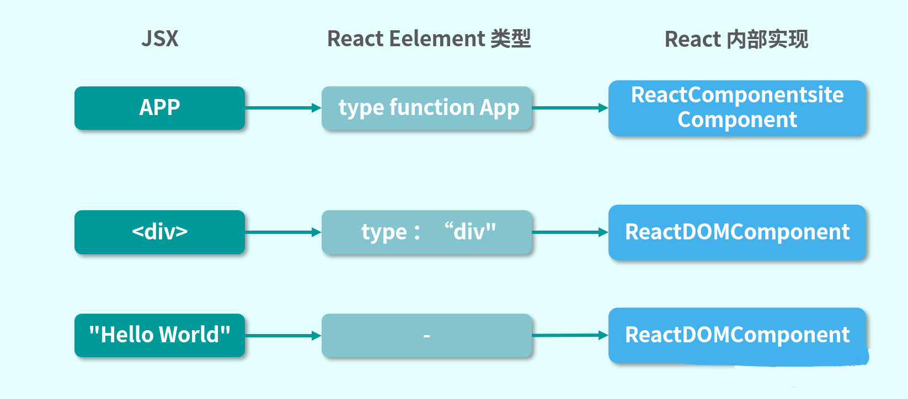

# React 渲染流程

## 1. React 渲染流程

在说React的渲染流程之前，先来看一个在渲染流程中绝对绕不开的概念——协调。

### （1）协调

协调，在 React 官方博客的原文中是 Reconciler，它的本意是“和解者，调解员”。那协调是怎么跟 React 扯上关系的呢？React 官方文档在介绍协调时，是这样说的：

React 提供的声明式 API 让开发者可以在对 React 的底层实现没有具体了解的情况下编写应用。在开发者编写应用时虽然保持相对简单的心智，但开发者无法了解内部的实现机制。本文描述了在实现 React 的 “diffing” 算法中我们做出的设计决策以保证组件满足更新具有可预测性，以及在繁杂业务下依然保持应用的高性能性。

可以看出，Reconciler 是协助 React 确认状态变化时要更新哪些 DOM 元素的 diff 算法，这看上去确实有点儿调解员的意思，这是狭义上的 Reconciler。


而在 React 源码中还有一个叫作 reconcilers 的模块，它通过抽离公共函数与 diff 算法使声明式渲染、自定义组件、state、生命周期方法和 refs 等特性实现跨平台工作。


Reconciler 模块以 React 16 为分界线分为两个版本。

- Stack Reconciler是 React 15 及以前版本的渲染方案，其核心是以递归的方式逐级调度栈中子节点到父节点的渲染。
- Fiber Reconciler是 React 16 及以后版本的渲染方案，它的核心设计是增量渲染（incremental rendering），也就是将渲染工作分割为多个区块，并将其分散到多个帧中去执行。它的设计初衷是提高 React 在动画、画布及手势等场景下的性能表现。

### （2）渲染

为了更好地理解两者之间的差异，下面先来看看 Stack Reconciler。


Stack Reconciler 没有单独的包，并没有像 Fiber Reconclier 一样抽取为独立的React-Reconciler 模块。但这并不妨碍它成为一个经典的设计。在 React 的官方文档中，是通过伪代码的形式介绍其实现方案的。

### （3）挂载

这里的挂载与生命周期中的挂载不同，它是将整个 React 挂载到 ReactDOM.render 之上，就像以下代码中的 App 组件挂载到 root 节点上一样。

```jsx
class App extends React.Component {
  render() {
    return (
        <div>Hello World</div>
      )
  }
} 
ReactDOM.render(<App />, document.getElementById('root'))
```

JSX 会被 Babel 编译成 React.creatElemnt 的形式：

```jsx
ReactDOM.render(React.creatElement(App), document.getElementById('root'))
```

这项工作发生在本地的 Node 进程中，而不是通过浏览器中的 React 完成的。ReactDOM.render 调用之后，实际上是透传参数给 ReactMount.render。

- ReactDOM 是对外暴露的模块接口；
- ReactMount 是实际执行者，完成初始化 React 组件的整个过程。


初始化第一步就是通过 React.creatElement 创建 React Element。不同的组件类型会被构建为不同的 Element：

- App 组件会被标记为 type function，作为用户自定义的组件，被 ReactComponentsiteComponent 包裹一次，生成一个对象实例；
- div 标签作为 React 内部的已知 DOM 类型，会实例化为 ReactDOMComponent；

- "Hello World" 会被直接判断是否为字符串，实例化为 ReactDOMComponent。




这段逻辑在 React 源码中大致是这样的，其中 isInternalComponentType 就是判断当前的组件是否为内部已知类型。

```jsx
if (typeof element.type === 'string') {
    instance = ReactHostComponent.createInternalComponent(element);
  } else if (isInternalComponentType(element.type)) {
    instance = new element.type(element);
  } else {
    instance = new ReactCompositeComponentWrapper();
}
```

到这里仅仅完成了实例化，还需要与 React 产生一些联动，比如改变状态、更新界面等。在状态变更后，涉及一个变更收集再批量处理的过程。在这里 ReactUpdates 模块就专门用于批量处理，而批量处理的前后操作，是由 React 通过建立事务的概念来处理的。


React 事务都是基于 Transaction 类继承拓展。每个 Transaction 实例都是一个封闭空间，保持不可变的任务常量，并提供对应的事务处理接口 。一段事务在 React 源码中大致是这样的：

```jsx
mountComponentIntoNode: function(rootID, container) {
      var transaction = ReactComponent.ReactReconcileTransaction.getPooled();
      transaction.perform(
        this._mountComponentIntoNode,
        this,
        rootID,
        container,
        transaction
      );
      ReactComponent.ReactReconcileTransaction.release(transaction);
 }
```

React 团队将其从后端领域借鉴到前端是因为事务的设计有以下优势。

- 原子性: 事务作为一个整体被执行，要么全部被执行，要么都不执行。
- 隔离性: 多个事务并发执行时，一个事务的执行不应影响其他事务的执行。

- 一致性: 相同的输入，确定能得到同样的执行结果。


上面提到的事务会调用 ReactCompositeComponent.mountComponent 函数进入 React 组件生命周期，它的源码大致是这样的。

```jsx
if (inst.componentWillMount) {
    inst.componentWillMount();
    if (this._pendingStateQueue) {
        inst.state = this._processPendingState(inst.props, inst.context);
    }
}
```

首先会判断是否有 componentWillMount，然后初始化 state 状态。当 state 计算完毕后，就会调用在 App 组件中声明的 render 函数。接着 render 返回的结果，会处理为新的 React Element，再走一遍上面提到的流程，不停地往下解析，逐步递归，直到开始处理 HTML 元素。到这里 App 组件就完成了首次渲染。

### （4）更新

在 setState 时会调用 Component 类中的 enqueueSetState 函数。

```jsx
this.updater.enqueueSetState(this, partialState)
```

在执行 enqueueSetState 后，会调用 ReactCompositeComponent 实例中的_pendingStateQueue，将新的状态变更加入实例的等待更新状态队列中，再调用ReactUpdates 模块中的 enqueueUpdate 函数执行更新。这个过程会检查更新是否已经在进行中：

- 如果是，则把组件加入 dirtyComponents 中；
- 如果不是，先初始化更新事务，然后把组件加入 dirtyComponents 列表。


这里的初始化更新事务，就是 setState 一讲中提到的 batchingstrategy.isBatchingUpdates 开关。接下来就会在更新事务中处理所有记录的 dirtyComponents。

### （5）卸载

对于自定义组件，也就是对 ReactCompositeComponent 而言，卸载过程需要递归地调用生命周期函数。

```jsx
class CompositeComponent{
  unmount(){
    var publicInstance = this.publicInstance
    if(publicInstance){
      if(publicInstance.componentWillUnmount){
        publicInstance.componentWillUnmount()
      }
    }
    var renderedComponent = this.renderedComponent
    renderedComponent.unmount()
  }
}
```

而对于 ReactDOMComponent 而言，卸载子元素需要清除事件监听器并清理一些缓存。

```jsx
class DOMComponent{
  unmount(){
    var renderedChildren = this.renderedChildren
    renderedChildren.forEach(child => child.unmount())
  }
}
```

那么到这里，卸载的过程就算完成了。


从以上的流程中我们可以看出，React 渲染的整体策略是递归，并通过事务建立 React 与虚拟DOM 的联系并完成调度。