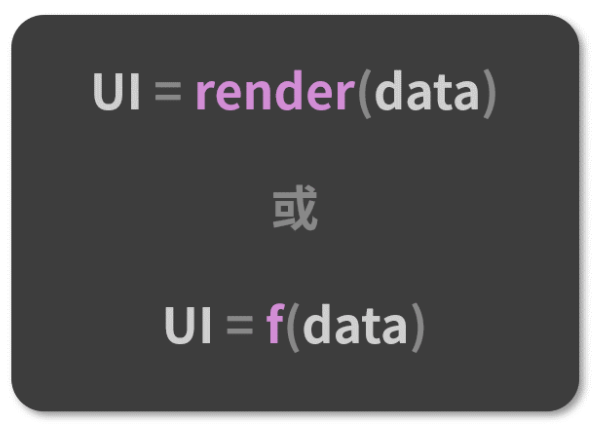
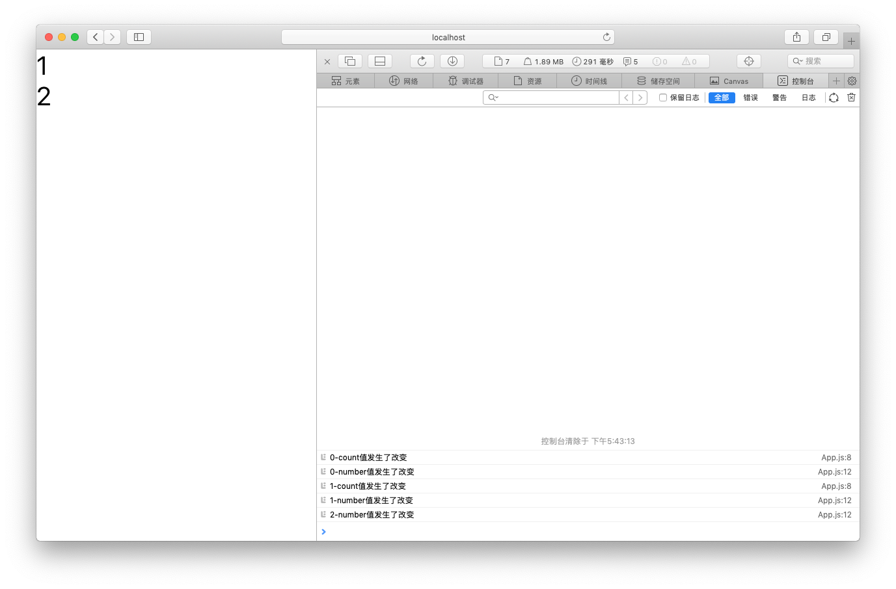
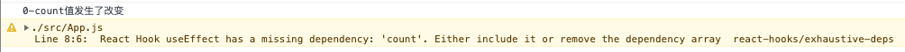
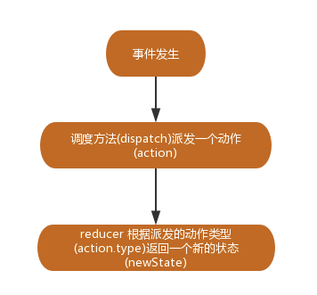

# React Hooks

## 1. 为什么引入Hooks？

React-Hooks 是 React 团队在 React 组件开发实践中，逐渐认知到的一个改进点，这背后其实涉及对**类组件**和**函数组****件**两种组件形式的思考和侧重。


**（1）类组件：**所谓类组件，就是基于 ES6 Class 这种写法，通过继承 React.Component 得来的 React 组件。以下是一个类组件：

```jsx
class DemoClass extends React.Component {
  state = {
    text: ""
  };
  componentDidMount() {
    //...
  }
  changeText = (newText) => {
    this.setState({
      text: newText
    });
  };

  render() {
    return (
      <div className="demoClass">
        <p>{this.state.text}</p>
        <button onClick={this.changeText}>修改</button>
      </div>
    );
  }
}
```

可以看出，React 类组件内部预置了相当多的“现成的东西”等着我们去调度/定制，state 和生命周期就是这些“现成东西”中的典型。要想得到这些东西，难度也不大，只需要继承一个 React.Component 即可。


当然，这也是类组件的一个不便，它太繁杂了，对于解决许多问题来说，编写一个类组件实在是一个过于复杂的姿势。复杂的姿势必然带来高昂的理解成本，这也是我们所不想看到的。除此之外，由于开发者编写的逻辑在封装后是和组件粘在一起的，这就使得**类组件内部的逻辑难以实现拆分和复用。**


**（2）函数组件**：函数组件就是以函数的形态存在的 React 组件。早期并没有 React-Hooks，函数组件内部无法定义和维护 state，因此它还有一个别名叫“无状态组件”。以下是一个函数组件：

```jsx
function DemoFunction(props) {
  const { text } = props
  return (
    <div className="demoFunction">
      <p>{`函数组件接收的内容：[${text}]`}</p>
    </div>
  );
}
```

相比于类组件，函数组件肉眼可见的特质自然包括轻量、灵活、易于组织和维护、较低的学习成本等。


通过对比，从形态上可以对两种组件做区分，它们之间的区别如下：

- 类组件需要继承 class，函数组件不需要；
- 类组件可以访问生命周期方法，函数组件不能；

- 类组件中可以获取到实例化后的 this，并基于这个 this 做各种各样的事情，而函数组件不可以；
- 类组件中可以定义并维护 state（状态），而函数组件不可以；


除此之外，还有一些其他的不同。通过上面的区别，我们不能说谁好谁坏，它们各有自己的优势。在 React-Hooks 出现之前，**类组件的能力边界明显强于函数组件。**


实际上，类组件和函数组件之间，是面向对象和函数式编程这两套不同的设计思想之间的差异。而函数组件更加契合 React 框架的设计理念：



React 组件本身的定位就是函数，一个输入数据、输出 UI 的函数。作为开发者，我们编写的是声明式的代码，而 React 框架的主要工作，就是及时地把声明式的代码转换为命令式的 DOM 操作，把数据层面的描述映射到用户可见的 UI 变化中去。这就意味着从原则上来讲，React 的数据应该总是紧紧地和渲染绑定在一起的，而类组件做不到这一点。**函数组件就真正地将数据和渲染绑定到了一起。****函数组件是一个更加匹配其设计理念、也更有利于逻辑拆分与重用的组件表达形式。**


为了能让开发者更好的的去编写函数式组件。于是，React-Hooks 便应运而生。

## 2. Hooks 本质

React-Hooks 是什么？它是一套能够使函数组件更强大、更灵活的“钩子”。


函数组件比起类组件少了很多东西，比如生命周期、对 state 的管理等。这就给函数组件的使用带来了非常多的局限性，导致我们并不能使用函数这种形式，写出一个真正的全功能的组件。


而React-Hooks 的出现，就是为了帮助函数组件补齐这些（相对于类组件来说）缺失的能力。


如果说函数组件是一台轻巧的快艇，那么 React-Hooks 就是一个内容丰富的零部件箱。“重装战舰”所预置的那些设备，这个箱子里基本全都有，同时它还不强制你全都要，而是允许你自由地选择和使用你需要的那些能力，然后将这些能力以 Hook（钩子）的形式“钩”进你的组件里，从而定制出一个最适合你的“专属战舰”。

## 3. Hooks API

### （1）useState

我们知道，函数组件是无法拥有自己的状态，如果想要拥有状态，就需要将函数组件改写成 `class` 组件。`useState` 的出现解决了这个问题。看下面的例子：

```jsx
import React, { useState } from 'react'
function App() {
  const [count, setCount] = useState(0) // ES6解构语法
    
  return (
    <div>
      <h1>you click {count} times</h1>
      <input type="button" onClick={()=> setCount(count + 1)} value="click me" />
    </div>
  ) 
}
export default App
```

在上面代码里，`useState` 就是一个 Hook，在函数组件里调用它来给组件内部添加内部 `state`，这个函数的唯一参数（可以是 `string/number/boolean` ，也可以是 `object/array` ）就是 `state` 初值。由解构语法可以推出，`useState` 返回一个数组，数组的第一项是当前状态，第二项是一个用于处理更新这个状态的函数。


所以，使用 `[state, setState]` 格式声明了状态 `count`，它的初始值为 0，同时还提供了处理这个 `count` 的方法 `setCount`。每次点击按钮时，`setCount` 方法接收的 `count` 都是最新状态，之后 React 会重新渲染组件并保留新的状态。


如果一个组件需要多个状态，可以在组件中多次使用 `useState`：

```jsx
const [age, setAge] = useState(17)
const [fruit, setFruit] = useState('apple')
const [todos, setTodos] = useState({text: 'learn Hooks'})
```

每一个 Hook 都是相互独立的。那么当出现多个状态时，react是如何保证它的独立性呢？上面调用了三次 `useState`，每次都是传入一个值，那么 react 是怎么知道这个值对应的是哪个状态呢？


其实在初始化时会创建两个数组 `state` 和 `setters`，并且会设置一个光标 `cursor = 0` ， 在每次运行 `useState` 函数时，会将参数放到 `state` 中，并根据运行顺序来依次增加光标 `cursor` 的值，接着在 `setters` 中放入对应的 `set` 函数，通过光标 `cursor` 把 `set` 函数和 `state` 关联起来，最后，便是将保存的 `state` 和 `set` 函数以数组的形式返回出去。比如在运行 `setCount(15)` 时，就会直接运行 `set` 函数，`set` 函数有相应的 `cursor` 值，然后改变 `state` 。

### （2）useEffect

函数组件相比于类组件来说，最显著的差异就是 state 和生命周期的缺失。useState 为函数组件引入了 state，而 useEffect 则在一定程度上弥补了生命周期的缺席。useEffect 能够为函数组件引入副作用。过去习惯放在 `componentDidMount`、`componentDidUpdate` 和 `componentWillUnmount` 三个生命周期里来做的事，现在可以放在 useEffect 里来做，比如操作 DOM、订阅事件、调用外部 API 获取数据等。


useEffect 可以接收两个参数，分别是回调函数与依赖数组：

```jsx
1. useEffect(callBack, [])
```

下面来使用 `useEffect` 来模拟 `componentDidMount` 生命周期。在 React 加载完 DOM 后向服务端发送请求操作：

```jsx
import React, { useEffect, useState } from 'react'

function App() {
  const [count, setCount] = useState(0)
  useEffect(() => {
    // 模拟发送请求信息，在一秒后改变 count 的值
    setTimeout(() => {
      setCount(10)
    }, 1000)
  }, [])
    
  return (
    <div>{count}</div>
  ) 
}
export default App
```

通过上面的代码，可以模拟在 `componentDidMount` 生命周期中发送请求信息，并在 1 秒后，改变 `count` 的值。


其实 `effect` 会在每次渲染都执行，React 会记住我们提供的 `effect` 函数，并且会将每次更改都作用于 DOM ，同时让浏览器绘制完内容后去调用它。来看一个例子：

```jsx
import React, { useEffect, useState } from 'react'
function App() {
  const [count, setCount] = useState(0)
  useEffect(() => {
    console.log(count + '值发生了改变')
  })
  function changeTheCount () {
    const num = count + 1
    setCount(num)
  }
  return (
    <div>
      <div onClick={() => changeTheCount()} style={{fontSize: '40px'}}>
        <p>{count}</p>
      </div>
    </div>
  ) 
}
export default App
```

上面的代码执行后，点击 4 次数字，可见 `count` 的值变为了 4，并且在控制台打印了 5 次输出。第一次是初次 DOM 渲染完毕，后面 4 次是每次点击后改变了 `count` 值，并触发了 DOM 重新渲染。由此可见，每次 DOM 渲染后都执行了 `effect` 函数。


如果想在组件重新渲染前做一些操作，应该如何做呢？

```jsx
useEffect(() => {
  console.log(count + '值发生了改变')
  return () => {
    console.log('-发生了清理操作')
  }
})
```

只用在 `useEffect` 中 `return` 一个函数，这个函数将在 DOM 重新渲染之前执行，通常可以用来清除一些副作用操作。


这时思考下面两个问题：

- 在模拟 `componentDidMount` 时， 可以看到 `useEffect` 中加入了第二个参数 `[]` ，这里第二个参数是什么意思呢？
- `effect` 会在每次渲染后都去运行，这样的处理方式并不是很高效（并且在某些场景下，可能会导致无限循环）。那这个问题该如何处理呢？


根据React 处理 DOM 的方式，React只会更新 DOM 真正发生改变的部分，而不是每次渲染都大动干戈。结合上面两个问题，`useEffect` 的第二个参数就是来告诉 React 在什么时候需要调用 `effect` ，如果想要避免 `effect` 的重复调用，可以提供给 `useEffect` 一个依赖数组参数。来看下面的代码：

```jsx
import React, { useEffect, useState } from 'react'
function App() {
  const [count, setCount] = useState(0)
  const [number, setNumber] = useState(0)
  useEffect(() => {
    console.log(count + '-count值发生了改变')
  }, [count])
  useEffect(() => {
    console.log(number + '-number值发生了改变')
  }, [number])
  function changeTheCount () {
    const num = count + 1
    setCount(num)
  }
  function changeTheNumber () {
    const num = number + 1
    setNumber(num)
  }
  return (
    <>
      <div onClick={() => changeTheCount()} style={{fontSize: '40px'}}>
        {count}
      </div>
      <div onClick={() => changeTheNumber()} style={{fontSize: '40px'}}>
        {number}
      </div>
    </>
  ) 
}
export default App
```

运行两个 `useEffect` ，并在这两个里面分别添加了第二个参数 `[count]` 和 `[number]` ，这样 `effect` 只会在指定的 `state` 发生变化时才运行：



点击一次上面的数字，点击两次下面的数字，可见右下角打印信息，只有设置了相应的 `state` ，`effect` 才会运行。


如果设置了错误的依赖会怎么样呢？

```jsx
useEffect(() => {
    console.log(count + '-count值发生了改变')
  }, [])
```

运行代码会发现，产生了一条警告，并运行了一次 `effect` 函数。



继续点击数字， `effect` 并不会被运行，因为第二个参数为空，React 检测不到依赖的变化。但是实际上 `effect` 是有依赖的（依赖于 `count` ），相当于对 React 撒了谎。也是通过这种方式，模拟了 `componentDidMount` 生命周期。


**useEffect****总结：**

useEffect 用什么形式来调用，本质上取决于想用它来达成什么样的效果。下面就以效果为线索，来介绍 useEffect 的调用规则。

- 每一次渲染后都执行的副作用：传入回调函数，不传依赖数组。调用形式如下所示：

```jsx
useEffect(callBack)
```

- 仅在挂载阶段执行一次的副作用：传入回调函数，**且这个函数的返回值不是一个函**数，同时传入一个空数组。调用形式如下所示：

```jsx
useEffect(()=>{
  // 这里是业务逻辑 
}, [])
```

- 仅在挂载阶段和卸载阶段执行的副作用：传入回调函数，**且这个函数的返回值是一个函数**，同时传入一个空数组。假如回调函数本身记为 A， 返回的函数记为 B，那么将在挂载阶段执行 A，卸载阶段执行 B。调用形式如下所示：

```jsx
 useEffect(()=>{
   // 这里是 A 的业务逻辑

   // 返回一个函数记为 B
   return ()=>{
   }
 }, [])
```

这里需要注意，这种调用方式之所以会在卸载阶段去触发 B 函数的逻辑，是由 useEffect 的执行规则决定的：**useEffect 回调中返回的函数被称为“清除函数”**，当 React 识别到清除函数时，会在卸载时执行清除函数内部的逻辑。**这个规律不会受第二个参数或者其他因素的影响，只要你在 useEffect 回调中返回了一个函数，它就会被作为清除函数来处理**。

- 每一次渲染都触发，且卸载阶段也会被触发的副作用：传入回调函数，且这个函数的返回值是一个函数，同时不传第二个参数。如下所示：

```jsx
 useEffect(()=>{
   // 这里是 A 的业务逻辑

   // 返回一个函数记为 B
   return ()=>{
   }
 })
```

上面的代码就会使得 React 在每一次渲染都去触发 A 逻辑，并且在卸载阶段去触发 B 逻辑。如果有一段副作用逻辑需要在卸载阶段执行，那么把它写进 useEffect 回调的返回函数（上面示例中的 B 函数）里就行了。也可以认为，这个 B 函数的角色定位就类似于生命周期里 componentWillUnmount 方法里的逻辑。

- 根据一定的依赖条件来触发的副作用：传入回调函数（若返回值是一个函数，仍然仅影响卸载阶段对副作用的处理，此处不再赘述），同时传入一个非空的数组，如下所示：

```jsx
 useEffect(()=>{
   // 这是回调函数的业务逻辑 

   // 若 xxx 是一个函数，则 xxx 会在组件卸载时被触发
   return xxx
 }, [num1, num2, num3])
```

这里给出的一个示意数组是 [num1, num2, num3]。首先需要说明，数组中的变量一般都是来源于组件本身的数据（props 或者 state）。若数组不为空，那么 React 就会在新的一次渲染后去对比前后两次的渲染，查看数组内是否有变量发生了更新（只要有一个数组元素变了，就会被认为更新发生了），并在有更新的前提下去触发 useEffect 中定义的副作用逻辑。

### （3）useContext

context 做的事情就是创建一个上下文对象，并且对外暴露提供者和消费者，在上下文之内的所有子组件，都可以访问这个上下文环境之内的数据，并且不用通过 props。 简单来说， context 的作用就是对它所包含的组件树提供全局共享数据的一种技术。


首先，使用下面代码就可以创建一个上下文：

```jsx
const themes = {
  light: {
    foreground: "#000000",
    background: "#eeeeee"
  },
  dark: {
    foreground: "#ffffff",
    background: "#222222"
  }
};
const ThemeContext = React.createContext(themes.light)
```

接着，创建一个 Toolbar 组件，这个组件中包含了一个 ThemedButton 组件，这里先不关心 ThemedButton 组件的逻辑：

```jsx
function Toolbar(props) {
  return (
    <div>
      <ThemedButton />
    </div>
  );
}
```

到这时，需要提供者提供数据，提供者一般位于比较高的层级，直接放在 App 中。`ThemeContext.Provider` 就是这里的提供者，接收的 `value` 就是它要提供的上下文对象：

```jsx
function App() {
  return (
    <ThemeContext.Provider value={themes.light}>
      <Toolbar />
    </ThemeContext.Provider>
  );
}
```

然后，消费者获取数据，这是在 ThemedButton 组件中使用：

```jsx
function ThemedButton(props) {
  const theme = useContext(ThemeContext)
  return (
    <button style={{ background: theme.background, color: theme.foreground }}>
      I am styled by theme context!
    </button>
  )
}
```

### （4）useReducer

在 Hooks 中提供了一个 API `useReducer`，它可以增强 `ReducerDemo` 函数提供类似 `Redux` 的功能。`useReducer` 也是 `useState` 的替代方案。


首先来看 `useReducer` 的语法：

```jsx
const [state, dispatch] = useReducer((state, action) => {
    // 根据派发的 action 类型，返回一个 newState
}, initialArg, init)
```

`useReducer` 接收 `reducer` 函数作为参数，`reducer` 接收两个参数，一个是 `state`，另一个是 `action`，然后返回一个状态 `state` 和 `dispatch`，`state` 是返回状态中的值，而 `dispatch` 是一个可以发布事件来更新 `state` 的函数。


既然它是 `useState` 的替代方案，那么可以改写下 useState 中的 demo：

```jsx
const initialState = {count: 0};
function reducer(state, action) {
  switch (action.type) {
    case 'increment':
      return {count: state.count + 1};
    default:
      throw new Error()
  }
}
import React, { useReducer } from 'react'
function App() {
  const [state, dispatch] = useReducer(reducer, initialState)
    
  return (
    <div>
      <h1>you click {state.count} times</h1>
      <input type="button" onClick={()=> dispatch({type: 'increment'})} value="click me" />
    </div>
  ) 
}
export default App
```

与 `useState` 的 demo 对比后，发现改写后的代码变长了：

- 点击 `click me` 按钮时，会触发 `click` 事件;
- `click` 事件里是个 `dispatch` 函数，`dispatch` 发布事件告诉 `reducer` 我执行了 `increment` 动作；

- `reducer` 会去查找 `increment`，返回一个新的 `state` 值。


下面是 `useReducer` 的整个执行过程：



其实 `useReducer` 执行过程就三步：

- 第一步：事件发生；
- 第二步：dispatch(action)；

- 第三步：reducer 根据 action.type 返回一个新的 state。


上面的 demo 与 `useState` 对比虽然代码变长了，但是理解起来好像更简单明了了，这是 `useReducer` 的优点之一。`useReducer` 主要有以下几个优点：

- 更好的可读性；
- `reducer` 可以让我们把做什么 `do what` 和怎么做 `how to do` 分开，上面的 demo 中我们在点击了 `click me` 按钮时，我们要做的就是发起加 1 操作，至于加 1 的操作要怎么去实现我们都放在 reducer 中维护。组件中只需要考虑 `do what`，使得我们的代码可以像用户行为一样更加清晰；

- `state` 处理都集中到 `reducer`，我们对 `state` 的变化更有掌控力，同时也更容易复用 `state` 逻辑变化代码，特别是对于 `state` 变化很复杂的场景。


当遇到以下场景时，可以优先使用 `useReducer` ：

- `state` 变化很复杂，经常一个操作需要修改很多 `state`；
- 深层子组件里去修改一些状态；

- 应用程序比较大，UI 和业务需要分开维护。

### （5）useCallback && useMemo

在 `shouldComponentUpdate` 中可以通过判断前后的 `props` 和 `state` 的变化，来判断是否需要阻止更新渲染。但使用函数组件形式失去了 `shouldComponentUpdate`，无法通过判断前后状态来决定是否更新，这就意味着函数组件的每一次调用都会执行其内部的所有逻辑，会带来较大的性能损耗。`useMemo` 和 `useCallback` 的出现就是为了解决这一性能问题。首先看一下这两个 API 的用法：

```jsx
const memoizedValue = useMemo(() => computeExpensiveValue(a, b), [a, b])
const memoizedCallback = useCallback(
  () => {
    doSomething(a, b);
  },
  [a, b],
)
```

`useCallback` 和 `useMemo` 的第一个参数是一个执行函数，第二个参数可用于定义其依赖的所有变量。如果其中一个变量发生变化，则 `useMemo` 或者 `useCallback` 会运行。这两个 API 都会在组件第一次渲染的时候执行，之后会在其依赖的变量发生改变时再次执行，并且这两个 Hooks 都返回缓存的值，`useMemo` 返回缓存的变量， `useCallback` 返回缓存的函数。


**1）userMemo**
先来看一个例子：

```jsx
function WithoutMemo() {
  const [count, setCount] = useState(1)
  const [val, setValue] = useState('')
  const expensive = function() {
    console.log('compute')
    // 假设是个计算量比较大的函数
    return count * 100
  }
  return (
    <div>
      <h4>
        {count}-{val}-{expensive()}
      </h4>
      <div>
        <button onClick={() => setCount(count + 1)}>+c1</button>
        <input value={val} onChange={event => setValue(event.target.value)} />
      </div>
    </div>
  )
}
```

这里创建了两个 `state`，然后通过一个函数基于 `count` 计算出一个结果。我们会发现，无论是修改 `count` 还是修改 `val`，由于组件的重新渲染，都会触发 `expensive` 函数，假如这个函数计算量很大时，只是 `val` 的修改，最好的方案是不需要再次执行这个函数。在这种情况下，就可以使用 `useMemo`，保证在 `count` 的值修改时执行：

```jsx
function WithoutMemo() {
  const [count, setCount] = useState(1)
  const [val, setValue] = useState('')
  const expensive = useMemo(() => {
    console.log('compute')
    // 假设是个计算量比较大的函数
    return count * 100
  }, [count])
  return (
    <div>
      <h4>
        {count}-{val}-{expensive}
      </h4>
      <div>
        <button onClick={() => setCount(count + 1)}>+c1</button>
        <input value={val} onChange={event => setValue(event.target.value)} />
      </div>
    </div>
  )
}
```

通过使用 `useMemo`，我们可以将上一次执行的结果缓存在变量中，只有在 `count` 值变化时进行更新执行。


**2）useCallback**

当父组件中包含一个子组件，子组件接收一个函数作为 `props`，通常的情况是，如果父组件更新，那么子组件也会随之更新。但是，大多数情况下子组件的更新是没有必要的，这时可以借助 `useCallback` 来解决这个问题，通过 `useCallback` 返回的函数，然后把这个缓存的函数传递给子组件，这样只有当这个函数发生变化时，子组件才会更新。来看下例子：

```jsx
// 子组件
function SubComponent(props){
    console.log('SubComponent render');
    return (
        <button onClick={props.onClick}>{props.data.count}</button>
    )
}
// 父组件
const SubComponent = memo(SubComponent);
export default function WithMemo(){
    console.log('Counter render');
    const [val, setVal]= useState('计数器');
    const [count,setCount] = useState(0);
    const data = useMemo(()=>({count}),[count]);
    
    // 有没有后面的依赖项数组很重要，否则还是会重新渲染
    const addClick = useCallback(()=>{
        setCount(count+1);
    }, [count]);
    return (
        <>
           <input value={val} onChange={event => setValue(event.target.value)} />
            <SubComponent data={data} onClick={addClick}/>
        </>
    )
}
```

### （6）useRef

```jsx
const refContainer = useRef(initialValue)
```

`useRef` 返回一个可变的 ref 对象，其 `.current` 属性被初始化为传入的参数。返回的 ref 对象在组件的整个生命周期内保持不变，也就是说每次重新渲染函数组件时，返回的 ref 对象都是同一个。


**注意：**类组件中使用 `React.createRef` 返回一个 ref 对象，每次重新渲染组件都会重新创建 ref。

```jsx
function ChildComponent() {
  const inputEl = useRef(null)
  const curFocus = () => {
    // `current` 指向已挂载到 DOM 上的文本输入元素
    inputEl.current.focus()
  }
  return (
    <>
      <input ref={inputEl} type="text" />
      <button onClick={curFocus}>Focus the input</button>
    </>
  )
}
```

### （7）useLayoutEffect

该API的函数签名与 `useEffect` 相同，`useEffect` 是在全部渲染完之后才会执行，而 `useLayoutEffect` 会在浏览器布局之后，绘制之前执行。来看下面的例子：

```jsx
function LayoutEffect() {
  const [color, setColor] = useState("red")
  useLayoutEffect(() => {
    alert(color)
  })
  useEffect(() => {
    console.log('color', color)
  })
  return (
    <>
      <div id="myDiv" style={{ background: color }}>
        颜色
      </div>
      <button onClick={() => setColor('red')}>红</button>
      <button onClick={() => setColor('yellow')}>黄</button>
      <button onClick={() => setColor('blue')}>蓝</button>
    </>
  )
}
```

可以发现 `useLayoutEffect` 是在页面绘制之前执行，因此会阻塞视图更新。推荐应尽可能使用 `useEffect`，只有当 `useEffect` 出现问题之后再尝试使用 `useLayoutEffect`。

## 4. Hooks 特点

**Hooks 优点：**

- Hooks 提供了 API 来复用包含状态的逻辑，解决了跨组件复用包含状态的组件的问题，Hooks 可以在不重写组件结构的情况下复用这些逻辑，这些逻辑可以跨组件复用；
- React Hooks 可以更方便地把 UI 和状态分离,做到更彻底的解耦；

- Hooks 中可以引用另外的 Hooks 形成新的 Hooks，组合变化万千；
- 组件的本地状态更加可预测；

- 解决了类组件中 `this` 指向错误的问题；
- 解决了类组件中分割在不同生命周期中的逻辑使得代码难以理解和维护的问题；

- 解决了类组件中代码复用成本高的问题（高阶组件容易使得代码量加剧）。


**Hooks** **缺点：**

- 额外的学习成本；
- 不能出现在循环、条件中，只在最顶层使用 Hook，写法限制增加了重构成本；

- 不能在类组件中使用；
- 破坏了 `PureComponent`、`React.memo` 浅比较的性能优化效果，为了取最新的 `props` 和 `state`，每次 `render()` 都要重新创建事件处理函数；

- 内部实现上不直观，依赖一份可变的全局状态，不再那么“纯”；
- React.memo 并不能完全替代 `shouldComponentUpdate`，因为拿不到 `state change`，只针对 `props change`；

- 只在自定义 Hook 的顶层无条件地调用其他 Hook；
- 在闭包场景可能会引用到旧的 `state` 、`props` 值。


**注意：**所谓的顶层，是说不要在 `class` 组件中调用 hooks，不要在 `event handlers` 中调用，不要在`userMemo` `useReducer` `useEffect` 的参数函数中调用。


**我们****在认识到 Hooks 带来的利好的同时，还需要认识到它的局限性**。Hooks 并不是万能的，其局限性主要体现在以下方面：

- **Hooks 暂时还不能完全地为函数组件补齐类组件的能力**：比如 getSnapshotBeforeUpdate、componentDidCatch 这些生命周期，目前都还是强依赖类组件的。
- **“轻量”几乎是函数组件的基因，这可能会使它不能够很好地消化“复杂”**：我们有时会在类组件中见到一些方法非常繁多的实例，如果用函数组件来解决相同的问题，业务逻辑的拆分和组织会是一个很大的挑战。耦合和内聚的边界，有时候真的很难把握，**函数组件给了我们一定程度的自由，却也对开发者的水平提出了更高的要求**。

- **Hooks 在使用层面有着严格的规则约束**：对于 React 开发者来说，如果不能牢记并践行 Hooks 的使用原则，如果对 Hooks 的关键原理没有扎实的把握，很容易把自己的 React 项目搞成大型车祸现场。

## 5. Hooks 规范

Hooks规范如下：

- 始终在 React 函数的顶层使用 Hooks，遵循此规则，可以确保每次渲染组件时都以相同的顺序调用 Hook， 这就是让 React 在多个`useState` 和 `useEffect` 调用之间正确保留 Hook 的状态的原因;
- Hooks 仅在 React 函数中使用。


Eslint Plugin 提供了 `eslint-plugin-react-hooks` 让我们遵循上述两种规范。其使用方法如下：


1. **安装插件** `**eslint-plugin-react-hooks**`**：**

```jsx
npm install eslint-plugin-react-hooks --save-dev
```

1. **在 eslint 的 config 中配置 Hooks 规则：**

```jsx
{
  "plugins": [
    // ...
    "react-hooks"
  ],
  "rules": {
    // ...
    "react-hooks/rules-of-hooks": "error", // 检查 hooks 规则
    "react-hooks/exhaustive-deps": "warn"  // 检查 effect 的依赖
  }
}
```

## 6. Hooks 总结

为什么React要使用Hooks呢？下面从四个方面来总结一下：

- 告别难以理解的 Class；
- 解决业务逻辑难以拆分的问题；

- 使状态逻辑复用变得简单可行；
- 函数组件从设计思想上来看，更加契合 React 的理念。

### （1）告别难以理解的 Class：把握 Class 的两大痛点

Class 组件中有 **this 和生命周期这两个痛点**。先来看看在React 自定义组件方法中的 this：

```jsx
class Example extends Component {
  state = {
    name: '张三',
    age: '18';
  };
  changeAge() {
    // 这里会报错
    this.setState({
      age: '100'
    });
  }
  render() {
    return <button onClick={this.changeAge}>{this.state.name}的年龄是{this.state.age}</button>
  }
}
```

先不关心组件具体的逻辑，就看 changeAge 这个方法：它是 button 按钮的事件监听函数。当我点击 button 按钮时，希望它能够修改状态，但事实是，点击发生后，程序会报错。原因很简单，changeAge 里并不能拿到组件实例的 this。


为了解决 this 不符合预期的问题，可以使用 bind、箭头函数来解决。但不管什么招数，**本质上都是在用实践层面的约束来解决设计层面的问题**。好在现在有了 Hooks，一切都不一样了，可以在函数组件里放飞自我，因为毕数组件是不用关心 this 的。


对于生命周期，它带来的麻烦主要有以下两个方面：

- 学习成本
- 不合理的逻辑规划方式

下面着重看看这“不合理的逻辑规划方式”是如何被 Hooks 解决掉的。

### （2）Hooks 如何实现更好的逻辑拆分

在过去，对于业务逻辑，我们多数情况下应该都是先想清楚业务的需要是什么样的，然后将对应的业务逻辑拆到不同的生命周期函数里去——**逻辑曾经一度与生命周期耦合在一起**。


在这样的前提下，生命周期函数常常做一些奇奇怪怪的事情：比如在 `componentDidMount` 里获取数据，在 `componentDidUpdate` 里根据数据的变化去更新 DOM 等。如果说只用一个生命周期做一件事，那好像也还可以接受，但是往往在一个稍微成规模的 React 项目中，一个生命周期不止做一件事情。下面这段伪代码就很好地诠释了这一点：

```jsx
componentDidMount() {
  // 1. 这里发起异步调用
  // 2. 这里从 props 里获取某个数据，根据这个数据更新 DOM

  // 3. 这里设置一个订阅

  // 4. 这里随便干点别的什么 

  // ...
}
componentWillUnMount() {
  // 在这里卸载订阅
}
componentDidUpdate() {
  // 1. 在这里根据 DidMount 获取到的异步数据更新 DOM

  // 2. 这里从 props 里获取某个数据，根据这个数据更新 DOM（和 DidMount 的第2步一样）
}
```

像这样的生命周期函数，它的体积过于庞大，做的事情过于复杂，会给阅读和维护者带来很多麻烦。最重要的是，**这些事情之间看上去毫无关联，逻辑就像是被“打散”进生命周期里了一样**。比如，设置订阅和卸载订阅的逻辑，虽然它们在逻辑上是有强关联的，但是却只能被分散到不同的生命周期函数里去处理，这无论如何也不能算作是一个非常合理的设计。


而在 Hooks 的帮助下，完全可以把这些繁杂的操作**按照逻辑上的关联拆分进不同的函数组件里：****可以有专门管理订阅的函数组件、专门处理 DOM 的函数组件、专门获取数据的函数组件等。Hooks 能够帮助我们****实现业务逻辑的聚合，避免复杂的组件和冗余的代码**。

### （3）状态复用：Hooks 将复杂的问题变简单

过去复用状态逻辑，靠的是 HOC（高阶组件）和 Render Props 这些组件设计模式，这是因为 React 在原生层面并没有提供相关的途径。但这些设计模式并非万能，它们在实现逻辑复用的同时，也破坏着组件的结构，其中一个最常见的问题就是“嵌套地狱”现象。


Hooks 可以视作是 React 为解决状态逻辑复用这个问题所提供的一个原生途径。现在可以通过自定义 Hook，达到既不破坏组件结构、又能够实现逻辑复用的效果。