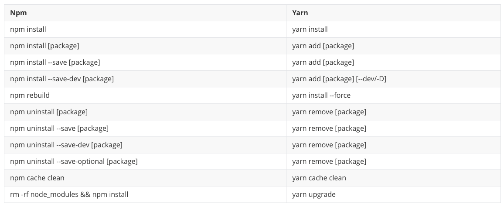
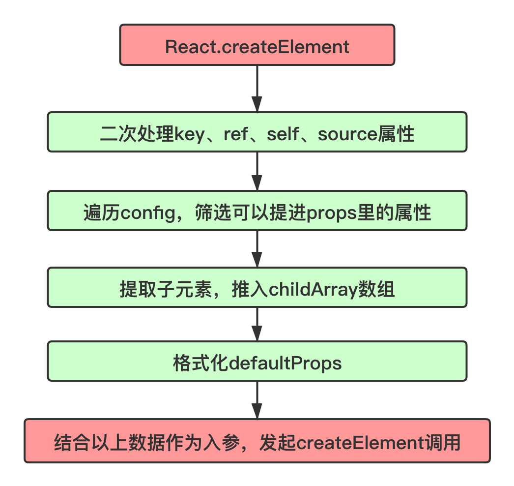
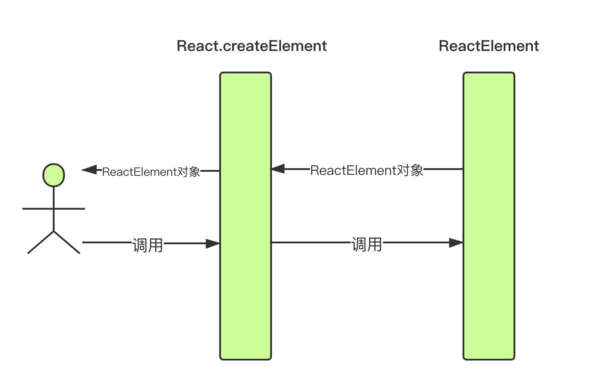
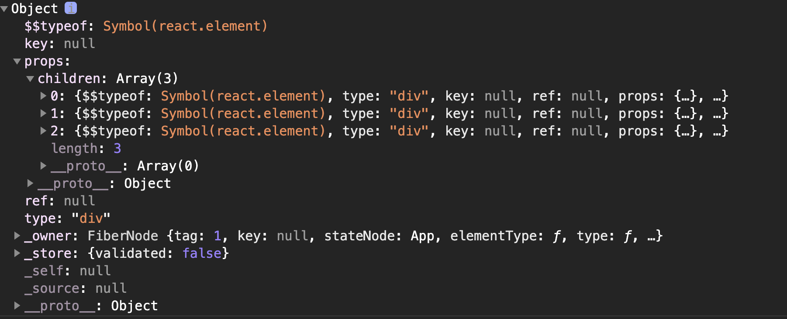
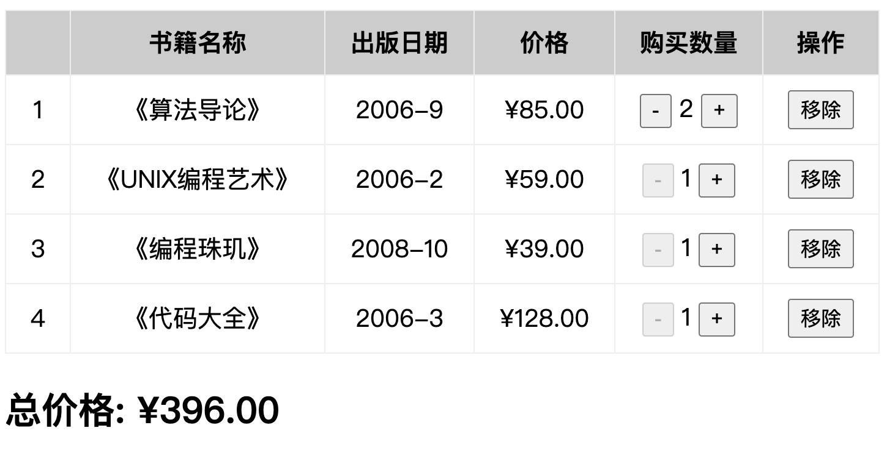

## 一、开发前的准备

###  1. 开发环境

**（1）Node.js**

Node.js 是一个基于 Chrome V8 引擎的 JavaScript 运行环境。React 应用并不依赖于 Node.js 运行，但是开发过程中的一些编译过程（比如 npm，Webpack 等）都需要在 Node 环境下运行。因此，开发 React 应用前，应确保已经安装了 Node.js。

**（2）NPM**

NPM 是 Node 的一个包管理工具，每个包都是一个模块，能够使你轻松下载、管理模块依赖和版本。同样的，在使用 React 开发应用时，会依赖很多模块，这些模块就可以通过 NPM 进行下载。由于 NPM 已集成到了 Node.js 中，因此不用单独下载。

### 2. 开发工具

**（1）Webpack**

Webpack 是一个前端资源加载和打包工具。Webpack 提供了模块化的开发方式，将各种静态资源视为模块，如 JavaScript、CSS、图片等，并通过 Webpack 生成优化过的代码。同样在开发 React 应用时也要用到 Webpack 来进行模块打包。

**（2）Babel**

Babel 是一个 JavaScript 编译器，主要用于将 ECMAScript 2015+ 版本的代码转换为向后兼容的 JavaScript 语法，以便能够运行在当前和旧版本的浏览器或其他环境中。

由于我们在开发 React 应用中，会用到很多 ES6 的语法，但目前浏览器并不完全支持，因此在 Webpack 编译阶段，利用 Babel 将 ES6 及其以后的语法编译成 ES5 语法。

### 3. 开发依赖

开发React必须依赖三个库：

- react：包含react所必须的核心代码
- react-dom：react渲染在不同平台所需要的核心代码

- babel：将jsx转换成React代码的工具 


react-dom针对web和native所完成的事情不同：

- web端：react-dom会讲jsx最终渲染成真实的DOM，显示在浏览器中 
- native端：react-dom会讲jsx最终渲染成原生的控件（比如Android中的Button，iOS中的UIButton）。


**Babel** ，又名 **Babel.js，**是目前前端使用非常广泛的编辑器、转移器。比如当下很多浏览器并不支持ES6的语法，但是确实ES6的语法非常的简洁和方便，我们**开发时**希望使用它。那么编写源码时我们就可以使用ES6来编写，之后通过Babel工具，将ES6转成大多数浏览器都支持的ES5的语法。 


React和Babel的关系： 

- 默认情况下开发React其实可以不使用babel。 
- 但是前提是我们自己使用 React.createElement 来编写源代码，它编写的代码非常的繁琐和可读性差。 

- 那么我们就可以直接编写jsx（JavaScript XML）的语法，并且让babel帮助我们转换成React.createElement。 

## 二、React脚手架

现代的前端项目已经越来越复杂了：

- 不会再是在HTML中引入几个css文件，引入几个编写的js文件或者第三方的js文件这么简单；
- 比如css可能是使用less、sass等预处理器进行编写，我们需要将它们转成普通的css才能被浏览器解析；

- 比如JavaScript代码不再只是编写在几个文件中，而是通过模块化的方式，被组成在**成百上千**个文件中，我们需要通过模块化的技术来管理它们之间的相互依赖；
- 比如项目需要依赖很多的第三方库，如何更好的管理它们（比如管理它们的依赖、版本升级等）；


为了解决这些问题，前端脚手架就出现了。例如babel、webpack、gulp等等，可以通过它们来进行转换规则、打包依赖、热更新等等。总之，**脚手架让项目从搭建到开发，再到部署，整个流程变得快速和便捷。**


目前比较流行的的框架Vue，它的脚手架是vue-cli；React的脚手架就是create-react-app。它们的作用就是帮助我们生成一个通用的目录结构，并且已经将我们所需的工程环境配置好了。目前，这些脚手架都是使用node.js编写的，并且都是基于Webpack的，它们需要运行在Node环境下。


上面我们也说到了NPM了，它是 Node 的一个包管理工具，每个包都是一个模块，能够使你轻松下载、管理模块依赖和版本。同样的，在使用 React 开发应用时，会依赖很多模块，这些模块就可以通过 NPM 进行下载。由于 NPM 已集成到了 Node.js 中，因此不用单独下载。


除了NPM，还有一个比较出名的Node包管理工具yarn，它是为了弥补NPM的一些缺陷而出现的，早期的NPM存在很多的缺陷，比如按安装依赖速度很慢，版本依赖混乱等等一系列的问题，虽然后面的版本进行了很多的升级和改进，但还是很多人喜欢使用yarn，React脚手架也默认使用yarn。


安装yarn：

```javascript
npm install -g yarn
```


安装好yarn就可以使用了，下面来看一下npm和yarn命令的对照表：



安装完之后，就可以安装React的脚手架了：

```javascript
npm install -g create-react-app
```

安装好之后，可以运行：`create-react-app --version` 查看版本号，如果版本号正常展示，证明安装成功。

## 三、创建React项目

这里我们借助上面所说的的React脚手架 **Create React App** 创建 React 应用。该脚手架已经将 Webpack、Babel 等工具的配置做了封装，无需开发者做配置，提供了一个零配置的现代构建。

Create React App 对于开发环境版本有一定的要求，具体如下：

npm 版本 >= 5.6

node 版本 >= 8.10

快速搭建 React 应用需要三个步骤：

1. 创建 React 项目；
2. 启动项目；

1. 暴露配置项。

下面我们就来逐步操作，创建一个React项目：

**（1）****创建 React 项目**

```javascript
create-react-app my-demo
```

这里项目名不能使用驼峰的形式(即不能包含大写字母)，不然会有以下报错：`name can no longer contain capital letters`。

**（2）启动项目**

```javascript
cd my-demo 
npm start
```

当看到以下界面时，说明你的 React 应用就已经安装好了。


```javascript
├── README.md                   文档 
├── package.json                npm 依赖信息
├── package-lock.json           依赖模块的版本信息
├── .gitignore                  忽略打包的文件
├── public                      静态资源文件夹
│   ├── favicon.ico             网站icon图标
│   ├── index.html              模版
│   ├── logo192.png             192*192大小的react logo
│   ├── logo512.png             512*512大小的react logo
│   ├── manifest.json           移动桌面快捷方式配置文件
│   └── robots.txt              网站与爬虫间的协议
├── src                         源码文件夹
│   ├── App.css
│   ├── App.js                  根组件
│   ├── App.test.js
│   ├── index.css               全局样式
│   ├── index.js                入口文件
│   ├── logo.svg    
│   └── serviceWorker.js        PWA 支持
└── node_modules                依赖包
```

在src文件夹有一个serviceWorker.js 文件，在public文件有一个manifest.json文件，他们涉及到了一个知识点——PWA，PWA全称为Progressive Web App，即渐进式WEB应用；一个 PWA 应用首先是一个网页, 可以通过 Web 技术编写出一个网页应用；添加上 App Manifest 和 Service Worker 来实现 PWA 的安装和离线等功能；这种Web存在的形式，我们也称之为是 Web App。


PWA解决了哪些问题呢？

- 可以添加至主屏幕，点击主屏幕图标可以实现启动动画以及隐藏地址栏； 
- 实现离线缓存功能，即使用户手机没有网络，依然可以使用一些离线功能； 

- 实现了消息推送； 

还有类似一系列类似于Native App相关的功能。


**（3）暴露配置项**

```javascript
npm run eject
```

在初始化好的项目中，Webpack等配置默认都是隐藏的，要想看到这些配置，就要执行以上命令来暴露项目的配置项。


暴露配置项之后，项目根目录又多出两个文件：scripts和config，他们都是被隐藏的配置项，同时package.json中的配置项也会变多，一些隐藏的配置项都暴露了出来。

## 四、React初体验

下面我们就来用react 实现一下Hello World：

```javascript
打开 src/index.js 文件，可以看到 render 的模版是 App.js，代码如下：

import React from 'react' // 使用JSX语法必须引入react
import ReactDOM from 'react-dom'
import App from './App.js'

ReactDOM.render(<App />), 
document.getElementById('root')) 
```

其中，root 是 index.html 模版里的元素，渲染出来的 App 组件放在此处。


下面我们来尝试修改 App.js 文件：

```javascript
// src/App.js
import React from 'react'
import './App.css'
function App() {
    return (
        <div className="App">
            <header className="App-header">
                <p>
                  hello world
                </p>
            </header>
        </div>
    )
}
export default App
```

修改完保存之后，页面就会自动刷新，显示如下：


至此，我们就完成了一个React应用的创建。


那React的数据在哪里定义呢，Vue是在data中定义数据，而React是在state中定义数据。


在组件中的数据，我们可以分成两类： 

- 参与界面更新的数据：当数据变量时，需要更新组件渲染的内容
- 不参与界面更新的数据：当数据变量时，不需要更新将组建渲染的内容


参与界面更新的数据我们也可以称之为是参与数据流，这个数据是定义在当前对象的state中 

- 我们可以通过在构造函数中 this.state = {定义的数据} 
- 当我们的数据发生变化时，我们可以调用 this.setState 来更新数据，并且通知React进行update操作

- 在进行update操作时，就会重新调用render函数，并且使用最新的数据，来渲染界面

```javascript
class App extends React.Component {
      constructor(pops) {
        super(props);

        this.state = {
          message: "hello world!"
        }
      }
}
```

## 五、初识JSX

### 1. 什么是JSX

我们来看一个变量的声明：

```javascript
const element = <h1>Hello, world!</h1>;
```

这个变量声明既不是字符串也不是HTML，它被称为JSX，是一种JavaScript的语法扩展（eXtension），也在很多地方称之为JavaScript XML，因为看起就是一段XML语法。它用于描述我们的UI界面，并且其完成可以和JavaScript融合在一起使用；

### 2. 为什么使用JSX

那为什么React要选择使用JSX呢？

（1） React认为渲染逻辑本质上与其他UI逻辑存在内在耦合

- 比如UI需要绑定事件（button、a原生等等）；
- 比如UI中需要展示数据状态，在某些状态发生改变时，又需要改变UI； 

（2）它们之间是密不可分，所以React没有讲标记分离到不同的文件中，而是将它们组合到了一起，这个地方就是组件（Component）；


其实，JSX是嵌入到JavaScript中的一种结构语法；


**JSX的优点：**

- 使用熟悉的语法定义 HTML 元素，提供更加语义化的标签，使用 JSX 编写模板更简单快速；
- 更加直观：JSX 让小组件更加简单、明了、直观； 

- 抽象了 React 元素的创建过程，使得编写组件变得更加简单； 
- JSX 执行更快，因为它在编译为 JavaScript 代码后进行了优化； 

- JSX 是类型安全的，在编译过程中就能发现错误； 
- 防注入攻击，所有的内容在渲染之前都被转换成了字符串，可以有效地防止 XSS（跨站脚本） 攻击。

### 3. JSX书写规范

JSX的书写规范如下：

- JSX的顶层**只能有一个根元素**，所以我们很多时候会在外层包裹一个div原生（或者使用Fragment，文档片段）；
- 为了方便阅读，我们通常在jsx的外层包裹一个小括号()，这样可以方便阅读，并且jsx可以进行换行书写；

- JSX中的标签可以是单标签，也可以是双标签；注意：如果是单标签，必须以/>结尾；
- 在使用变量时，我们可以将其放在一个大括号中，大括号内放置任何有效的 JavaScript 表达式


**下面来是一个计数器的例子：**

```javascript
class App extends React.Component {
      constructor(pops) {
        super(props);

        this.state = {
          counter: 0
        }
      }

      render() {
        return (
          <div>
            <h2>当前计数: {this.state.counter}</h2>
            <button onClick={this.increment}>+1</button>
            <button onClick={this.decrement.bind(this)}>-1</button>
            
          </div>
        )
      }

      increment() {
        this.setState({
          counter: this.state.counter + 1
        })
      }

      decrement() {
        this.setState({
          counter: this.state.counter - 1
        })
      }
    }

    ReactDOM.render(<App/>, document.getElementById("app"));
```

### 4. **JSX注释**

 JSX的注释和其他框架略有不同，通常有三种方法：

```javascript
render() {
        return (
          <div>
            {/* 单行注释 */}
            {/*
                多行注释   
            */}
            <h2>Hello World</h2> // 行尾注释
          </div>
        )
      }
```

### **5. JSX嵌入变量**

在JSX中嵌入变量时，通常使用一个大括号包裹，不同类型的变量的显示效果是不一样的：

（1）情况一：当变量是Number、String、Array类型时，可以直接显示

（2）情况二：当变量是null、undefined、Boolean类型时，内容为空； 

- 如果希望可以显示null、undefined、Boolean，那么需要转成字符串；
- 转换的方式有很多，比如toString方法、和空字符串拼接，String(变量)等方式；

（3） 情况三：对象类型不能作为子元素（not valid as a React child） 

```javascript
class App extends React.Component {
      constructor(props) {
        super(props);

        this.state = {
          // 1.在{}中可以正常显示显示的内容
          name: "why", // String
          age: 18, // Number
          names: ["abc", "cba", "bac"], // Array

          // 2.在{}中不能显示(忽略)
          test1: null, // null
          test2: undefined, // undefined
          test3: true, // Boolean

          // 3.对象不能作为jsx的子类
          friend: {
            name: "zhangsan",
            age: 40
          }
        }
      }

      render() {
        return (
          <div>
            <h2>{this.state.name}</h2>
            <h2>{this.state.age}</h2>
            <h2>{this.state.names}</h2>

            <h2>{this.state.test1 + ""}</h2>
            <h2>{this.state.test2 + ""}</h2>
            <h2>{this.state.test3.toString()}</h2>

            <h2>{this.state.friend}</h2>
          </div>
        )
      }
    }
```

### 6. **JSX嵌入表达式**

在JSX中嵌入表达式：

- 运算表达式 
- 三元运算符 

- 进行函数调用

```javascript
render() {
        // 对state中的变量进行解构赋值
        const { firstname, lastname, isLogin } = this.state;

        return (
          <div>
            {/*1.运算符表达式*/}
            <h2>{ firstname + " " + lastname }</h2>
            <h2>{20 * 50}</h2>

            {/*2.三元表达式*/}
            <h2>{ isLogin ? "欢迎回来~": "请先登录~" }</h2>

            {/*3.进行函数调用*/}
            <h2>{this.getFullName()}</h2>
          </div>
        )
      }
      getFullName() {
        return this.state.firstname + " " + this.state.lastname;
      }
```

### 7. **JSX绑定属性**

常见的绑定的属性有以下几种：

- 元素都会有title属性
- img元素会有src属性

- a元素会有href属性
- 元素可能需要绑定class

- 原生使用内联样式style

我们可以使用大括号来给元素绑定属性：

```javascript
class App extends React.Component {
      constructor(props) {
        super(props);

        this.state = {
          title: "标题",
          imgUrl: "http://p2.music.126.net/L8IDEWMk_6vyT0asSkPgXw==/109951163990535633.jpg",
          link: "http://www.baidu.com",
          active: true
        }
      }

      render() {
        const { title, imgUrl, link, active } = this.state;
        return (
          <div>
            {/* 1.绑定普通属性 */}
            <h2 title={title}>我是标题</h2>
            
            <a href={link} target="_blank">百度一下</a>

            {/* 2.绑定class */}
            <div className="box title">我是div元素</div>
            <div className={"box title " + (active ? "active": "")}>我也是div元素</div>
            <label htmlFor=""></label>

            {/* 3.绑定style */}
            <div style={{color: "red", fontSize: "50px"}}>我是div,绑定style属性</div>
          </div>
        )
      }
    }
    function getSizeImage(imgUrl, size) {
      return imgUrl + `?param=${size}x${size}`
    }
```

**注意：**

- 上面我们在给元素绑定class时，由于我们写的是JSX语法，它是和JavaScript的语法混在一起的，所以我们如果直接使用JavaScript中的关键字class就不太好，所以我们可以使用className来代替class，在label标签中，通常使用的是的for来绑定属性，但是for也是JavaScript中的关键字，所以使用htmlFor来代替。
- 如果我们想要给className添加值，就要使用JavaScript来给他动态添加。

- 在给元素绑定style时，需要注意，外层的大括号是用JSX语法往内部嵌套JavaScript代码。而内部的大括号是一个对象，它里面是键值对，表示元素的样式属性及属性值。
- 在给元素绑定style时，如果元素的属性值是一个值，就要加上双引号。当属性是由多个单词组成的时候，需要用驼峰命名法来表示，例如：fontSize。

### 8. JSX绑定事件

在JSX中绑定事件时，可以使用以下方式：

```javascript
<button onClick={this.btnClick}>按钮</button>
```

可以看出 React 元素的事件处理和 DOM 元素的很相似，但存在一些语法上的差异： 

- React 的事件采用驼峰式命名，而不是纯小写的方式； 
- 使用 JSX 语法时，需要传入一个函数作为事件处理函数，而不是一个字符串； 

- 使用函数时不能加括号，不然会直接执行。 


需要注意的是，如果我们绑定的事件函数中，如果使用到了当前组件对象中的属性，我们无法使用this直接获取state中的数据。这是因为，我们当前调用的函数，不是在元素上直接调用它的，而是React的内部发现这个按钮绑定了一个事件，就会在内部对这个函数做了一个回调，他拿到这个方法btnClick之后，就对其使用了btnClick.call()，并为其传递了一个参数undefined，也就是在执行这个函数的时候，给它绑定了一个动态的this，this指向了undefined。


注意：在 React 中不能使用 return false 的方式阻止事件的默认行为，必须要显式的调用事件对象的 preventDefault 方法来阻止事件的默认行为。 


这里补充一下**this的指向问题**：

在类中直接定义一个函数，并且将这个函数绑定到html原生的onClick事件上，当前这个函数的this默认情况下指向是undefined。因为在正常的DOM操作中，监听点击，监听函数中的this其实是节点对象（比如说是button对象）。


因为React并不是直接渲染成真实的DOM，我们所编写的button只是一个语法糖，它的本质React的Element对象。那么在这里发生监听的时候，react给我们的函数绑定的this，默认情况下就是一个undefined； 


我们在绑定的函数中，可能想要使用当前对象，比如执行 this.setState 函数，就必须拿到当前对象的this，我们就需要在传入函数时，给这个函数直接绑定this，类似于下面的写法：

```javascript
<button onClick={this.changeText.bind(this)}>改变文本</button>
```


我们希望绑定事件函数中的this指向这个组件对象，这里有三种解决方案：

**（1）显示绑定**，就像上面所说的，使用bind方法将这个函数的this绑定到当前组件对象的this上

```javascript
<button onClick={this.btnClick.bind(this)}>按钮</button>
```

也可以在构造方法中，将该方法进行重新赋值

```javascript
constructor(props) {
        super(props);
        this.state = { }
        this.btnClick = this.btnClick.bind(this);
      }
```

这种方法固然是可以实现，但是可能会产生很多重复的代码。

**（2）使用箭头函数定义函数**

因为箭头函数永远不绑定this，它里面的this会读取上一层作用域的属性，如果没有找到就逐层向上查找。

```javascript
btnClick = () => { }
```

**（3）传入一个箭头函数，在箭头函数中调用需要执行的函数（推荐使用）**

```javascript
<button onClick={() => { this.btnClick() }}>按钮</button>
```

它的原理就是，当我们点击按钮时，就会执行箭头函数中的函数体，也就是执行事件绑定的方法。当执行这个方法的时候，由于箭头函数是不绑定this的，所以它会向上层作用域的render中进行查找，这样就会将this隐式绑定在事件函数上面。


在执行事件函数时，有可能我们需要获取一些参数信息：比如event对象、其他参数 

（1）情况一：获取event对象

- 很多时候我们需要拿到event对象来做一些事情（比如阻止默认行为）
- 假如我们用不到this，那么直接传入函数就可以获取到event对象；

（2）情况二：获取更多参数 

- 有更多参数时，我们最好的方式就是传入一个箭头函数，主动执行的事件函数，并且传入相关的其他参数；

```javascript
<button onClick={ event => { this.btnClick(item, index, event) }}>按钮</button>
```

### 9. React条件渲染

某些情况下，界面的内容会根据不同的情况显示不同的内容，或者决定是否渲染某部分内容：

- 在vue中，我们会通过指令来控制：比如v-if、v-show； 
- 在React中，所有的条件判断都和普通的JavaScript代码一致； 


常见的条件渲染的方式有以下三种：

- 方式一：条件判断语句，适合逻辑较多的情况
- 方式二：三元运算符，适合逻辑比较简单

- 方式三：与运算符&&，如果条件成立，渲染&&后面的组件；如果条件不成立，什么内容也不渲染； 

```javascript
render() {
        const { isLogin } = this.state;

        // 1.方案一:通过if判断: 逻辑代码非常多的情况
        let welcome = null;
        let btnText = null;
        if (isLogin) {
          welcome = <h2>欢迎回来~</h2>
          btnText = "退出";
        } else {
          welcome = <h2>请先登录~</h2>
          btnText = "登录";
        }

        return (
          <div>
            <div>我是div元素</div>

            {welcome}
            {/* 2.方案二: 三元运算符 */}
            <button onClick={e => this.loginClick()}>{isLogin ? "退出" : "登录"}</button>


            <h2>{isLogin ? "你好, React": null}</h2>

            {/* 3.方案三: 逻辑与&& */}
            {/* 逻辑与: 一个条件不成立, 后面的条件都不会进行判断了 */}
            <h2>{ isLogin && "你好, React" }</h2>
            { isLogin && <h2>你好, React</h2> }
          </div>
        )
      }
```

在Vue中，v-if是对元素隐藏时，会将元素送DOM树上删除掉；而v-show只是对元素进行隐藏，其原理就是给元素添加display:none，它更适用于频繁切换某个元素的显示/隐藏的情况，会大大的节省开销。


那在上面我们对React元素的显示和隐藏都相当于Vue中v-if，元素在隐藏之后就不会出现在DOM树上，我们可以用React来实现一下Vue中v-show指令的效果：

```javascript
class App extends React.Component {
      constructor(props) {
        super(props);

        this.state = {
          isLogin: true
        }
      }

      render() {
        const { isLogin } = this.state;
        const titleDisplayValue = isLogin ? "block": "none";
        return (
          <div>
            <button onClick={e => this.loginClick()}>{isLogin ? "退出": "登录"}</button>
            <h2 style={{display: titleDisplayValue}}>你好, React</h2>
          </div>
        )
      }

      loginClick() {
        this.setState({
          isLogin: !this.state.isLogin
        })
      }
    }
```

这样，元素隐藏之后还是会在DOM树上，只是不会显示在页面上，节省了开销，提高了页面的性能。

### 10. React列表渲染

在实际的开发过程中，我们通常会将请求的大量数据渲染成列表，在Vue中，我们可以使用v-for进行列表的渲染，而在React中需要我们通过JavaScript代码的方式组织数据，转成JSX。


在React中，展示列表最多的方式就是使用数组的map方法，使用它来遍历数组元素，也可以在遍历的过程中对数组元素进行操作；除此之外，为我们还会用到filter方法过滤数据，使用slice方法截取数据等等。

```javascript
<ul>
     {
        this.state.numbers.filter(item => item >= 50).map(item => <li key={item.id}>{item}</li>)
     }
</ul>
```

需要注意的是，在渲染是，我们需要给渲染项添加一个key，不然会报错：warning:Each child in a list should have a unique “key” prop.在React 中，key 属性是给 React 自己用的一个特殊属性，就是说即使为一个组件设置 key 之后，我们也无法获取这个组件的 key 值。它是一种身份标识，每个 key 对应一个组件。key 的值必须保证唯一且稳定，它类似于数据库中的主键 id 一样，有且唯一。 key和React中的diff算法密切相关。

### 11. React表单处理

React的组件分为**受控组件**和**非受控组件：**

- **受控组件**：由 React 来管理表单元素的值，同时表单元素的变化需要实时映射到 React 的 state 中，这个类似于双向数据绑定。不同的表单元素，React 控制方式是不一样的，如 input 用 value 来控制，checkbox 用 checked 来判断是否选中等。
- **非****受控组件：**非受控组件，表单数据将交由 DOM 节点来处理。React 提供了一个 ref 属性，用来从 DOM 节点中获取表单数据。


**受控组件：**

常见的受控组件有文本框、单选框、复选框、下拉列表等。

**（1）文本框**

文本框包含类型为 text 、 number 的 input 元素和 textarea 元素。这些被受控的主要原理是通过元素的 value 属性设置表单元素的值，通过表单元素的 onChange 事件监听值的变化，并同步到 React 组件的 state 中。


当用户输入框内容改变的时候， onChange 事件会被触发，进而相应的处理函数会把值的变化通过 setState 同步到组件的 state 中，同时由于 state 值的变化，又会重新渲染表单，进而实现对表单元素状态的控制。 

**（2）单选框**

在 HTML 中， <input type="radio"> 标签可以创建单选框，由标签上的 checked 属性决定是否选中，在React 中也是一样。

**（3）复选框**

在 HTML 中， <input type="checkbox"> 标签可以创建复选框，由标签上的 checked 属性决定是否选中，在 React中也是一样。

**（4）下拉列表**

在 HTML 中， <select/> 标签可以创建下拉列表，选中项由 <option/> 上的 selected 属性决定。需要注意的是 React 并不会使用 selected 属性，而是在根 <select/> 标签上使用 value 属性。


注意：select 标签可以使用多选，只需在标签中加一个 multiple = {true} ，同时 React 状态变量使用数组，当然 onChange 处理函数也需按数组处理。

```javascript
class Register extends React.Component {
  constructor(props) {
    super(props)
    this.handleSubmit = this.handleSubmit.bind(this)
    this.state = {
      phone: '',
      username: '',
      password: ''
    }
  }
  handleChange = (e) => {
    this.setState({
      [e.target.name]: e.target.value
    })
  }
  
  handleSubmit(e) {
    const { phone, username, password} = this.state
    alert(`手机号：${phone} 昵称：${username} 密码：${password}`)
    e.preventDefault()
  }

  render() {
    const { phone, username, password} = this.state
    return (
      <div>
        <form>
          <div className="row">
            <span className="input-tip">手机号：</span>
            <input type="text" value={phone} name="phone" onChange={this.handleChange}/>
          </div>
          <div className="row">
            <span className="input-tip">昵 称：</span>
            <input type="text" value={username} name="username" onChange={this.handleChange}/>
          </div>
          <div className="row">
            <span className="input-tip">密 码：</span>
            <input type="password" value={password} name="password" onChange={this.handleChange}/>
          </div>
        </form>
      </div>
    )
  }
}

export default Register
```

**非受控组件：**

受控组件保证了表单元素的状态统一由 React 管理，但同时每个表单元素都需要通过 onChange 事件来绑定处理函数，然后将更改同步到 React 组件的 state 中，这个过程还是比较繁琐的。一种可替代方案是使用非受控组件，这时表单数据将交由 DOM 节点来处理。React 提供了一个 ref 属性，用来从 DOM 节点中获取表单数据。

```javascript
class Login extends React.Component {
  constructor(props) {
    super(props)
    this.handleSubmit = this.handleSubmit.bind(this)
  }
  
  handleSubmit(e) {
    alert(`昵称：${this.refs.username.value} 密码：${this.refs.password.value}`)
    e.preventDefault()
  }

  render() {
    return (
      <div>
        <form onSubmit={this.handleSubmit}>
          <div className={styles.row}>
            <input type="text" ref="username"/>
          </div>
          <div className={styles.row}>
            <input type="password" ref="password"/>
          </div>
          <div className={styles.row}>
            <input type="submit" value="登录"/>
          </div>
        </form>
      </div>
    )
  }
}

export default Login
```


在填写完表单之后，我们通常会对表单进行校验，以确保表单数据格式准确。最常见的两种检验就是**失去焦点校验**和**提交时校验**。


**（1）失去焦点校验**

在失去焦点时加上校验规则，那么就需要监听onBlur事件，然后在onBlur事件中做验证规则处理。

```javascript
// 失去焦点校验
class Register extends React.Component {
  // ...
  validator = {
    onBlur (e) {
      const rules = Rules[e.target.name]
      const value = e.target.value
      /* 失去焦点校验 */
      const verifyResult = verify(value, rules)
      if (verifyResult.error) {
        alert(verifyResult.message)
      }
    }
  }
  render () {
      <input {...this.validator} type="text" value={this.state.username} name="username" onChange={this.handleChange}/>
      <input {...this.validator} type="password" value={this.state.password} name="password" onChange={this.handleChange}/>
  }
}

// 校验规则
export const Rules = {
  username: [
    { require: true, message: '昵称不能为空' },
    { min: 2, max: 20, message: '昵称长度不能小于2位，并且不能超过20位' },
  ],
  password: [
    { require: true, message: '密码不能为空' },
    { regular: /^\w*$/, message: '密码格式不正确，只能输入字母、数字、下划线' },
    { min: 6, max: 20, message: '密码长度不能小于6位，并且不能超过20位' },
  ]
}

// 处理校验规则
export function verify (value, rules) {
  let verifyResult = { error: true, message: '填写必填项' }
  for (const rule of rules) {
    // 校验的几种方式：针对 require | regular | min | max 做了处理   
    const errorVerify = (rule.require && value === '') ||
                        (rule.regular && !rule.regular.test(value)) ||
                        (rule.min && value.length < rule.min) ||
                        (rule.max && value.length > rule.max)
    // 校验错误，则返回error及message，并跳出循环，不继续执行循环
    if (errorVerify) {
      verifyResult = { error: true, message: rule.message }
      break
    }
    // 校验成功，将 error 设置为 false
    verifyResult = { error: false, message: '' }
  }
  return verifyResult
}
```

这里我们定义了 `validator` 对象，对象中有一个 `onBlur()` 函数， `onBlur()` 函数用来处理失去焦点的验证。在 `input` 中，加入了 `{...this.validator}` ，这样写是为了以后的扩展性（比如可以在 `validator` 中加入其他的处理函数），当然也等同于 `onBlur={onBlur}` 。


在表单校验的主逻辑中，只获取了校验结果和提示内容，至于如何验证都交给了 `verify` 函数去处理，这样我们主逻辑代码就很清晰了。这里我们将校验规则与校验规则的处理放在了单独的文件中，这样主逻辑代码看起来更加简洁，在主逻辑代码中，我们只管使用相应的校验规则，而不用关心校验规则是如何进行的。


**（2）提交时校验**

如果只对单个输入框失去焦点时进行校验，并不能保证提交时都是正确的数据，所以还需要在点击提交时，再次校验规则。

```javascript
// 提交时校验
class Register extends React.Component {
  // ...
  handleSubmit(e) {
    e.preventDefault()
    /* 提交校验 */
    const verifyResult = submitVerify(this.state)
    if (verifyResult.error) {
      alert(verifyResult.message)
      return
    }

    alert(`昵称：${this.state.username} 密码：${this.state.password}`)
  }
  // ...
}

// 校验规则
export const Rules = {
  username: [
    { require: true, message: '昵称不能为空' },
    { min: 2, max: 20, message: '昵称长度不能小于2位，并且不能超过20位' },
  ],
  password: [
    { require: true, message: '密码不能为空' },
    { regular: /^\w*$/, message: '密码格式不正确，只能输入字母、数字、下划线' },
    { min: 6, max: 20, message: '密码长度不能小于6位，并且不能超过20位' },
  ]
}

// 处理校验规则
export function submitVerify (state) {
  let verifyResult = {}
  /* 从Rules中取key值 */
  const keyArray = Object.keys(Rules)
  /* 这里通过循环对 Rules 中的每个值进行了遍历，
   * 并在每次遍历的过程中，都使用 verify() 函数进行验证处理 */
  for (const key of keyArray) {
    const rules = Rules[key]
    /* 单次处理和我们在失去焦点时处理方式一样 */
    verifyResult = verify(state[key], rules)
    /* 如果发现填写的有错误项，直接退出循环 */
    if (verifyResult.error) break
  }
  return verifyResult
}
```

## 六、JSX是如何变成DOM的？

React官网中对JSX的定义：

JSX 是 JavaScript 的一种语法扩展，它和模板语言很接近，但是它充分具备 JavaScript 的能力。

那关键问题就是**JSX是如何在JavaScript中生效的**，官方的解释：

JSX 会被编译为 React.createElement()， React.createElement() 将返回一个叫作“React Element”的 JS 对象。

实际上，JSX仅仅只是 **React.createElement(component, props, ...children)** 函数的语法糖。所有的jsx最终都会被转换成React.createElement的函数调用。这也就意味着，我们写的JSX其实写的就是 React.createElement，虽然它看起来很像HTML。这也印证了JSX充分具备JavaScript的能力。


**React内部处理****createElement****的源码如下：**

```javascript
export function createElement(type, config, children) {
  // propName 变量用于储存后面需要用到的元素属性
  let propName; 
  // props 变量用于储存元素属性的键值对集合
  const props = {}; 
  // key、ref、self、source 均为 React 元素的属性
  let key = null;
  let ref = null; 
  let self = null; 
  let source = null; 
  // config 对象中存储的是元素的属性
  if (config != null) { 
    // 依次对 ref、key、self 和 source 属性赋值
    if (hasValidRef(config)) {
      ref = config.ref;
    }
    // 此处将 key 值字符串化
    if (hasValidKey(config)) {
      key = '' + config.key; 
    }
    self = config.__self === undefined ? null : config.__self;
    source = config.__source === undefined ? null : config.__source;
    // 把 config 里面的属性都一个一个挪到 props 这个之前声明好的对象里面
    for (propName in config) {
      if (
        // 筛选出可以提进 props 对象里的属性
        hasOwnProperty.call(config, propName) &&  
        !RESERVED_PROPS.hasOwnProperty(propName) 
      ) {
        props[propName] = config[propName]; 
      }
    }
  }
  // childrenLength 指的是当前元素的子元素的个数，减去的 2 是 type 和 config 两个参数占用的长度
  const childrenLength = arguments.length - 2; 
  // 如果抛去type和config，就只剩下一个参数，一般意味着文本节点出现了
  if (childrenLength === 1) { 
    // 直接把这个参数的值赋给props.children
    props.children = children; 
    // 处理嵌套多个子元素的情况
  } else if (childrenLength > 1) { 
    // 声明一个子元素数组
    const childArray = Array(childrenLength); 
    // 把子元素推进数组里
    for (let i = 0; i < childrenLength; i++) { 
      childArray[i] = arguments[i + 2];
    }
    // 最后把这个数组赋值给props.children
    props.children = childArray; 
  } 
  // 处理 defaultProps
  if (type && type.defaultProps) {
    const defaultProps = type.defaultProps;
    for (propName in defaultProps) { 
      if (props[propName] === undefined) {
        props[propName] = defaultProps[propName];
      }
    }
  }
  // 最后返回一个调用ReactElement执行方法，并传入刚才处理过的参数
  return ReactElement(
    type,
    key,
    ref,
    self,
    source,
    ReactCurrentOwner.current,
    props,
  );
}
```

**入参：createElement需要传递三个参数：**

（1）参数一：type，表示当前ReactElement的类型； 

- 如果是标签元素，那么就使用字符串表示 “div”； 
- 如果是组件元素，那么就直接使用组件的名称；

（2）参数二：config，以对象形式传入，组件所有的属性都会以键值对的形式存储在 config 对象中；

（3）参数三：children，存放在标签中的内容，以children数组的方式进行存储； 

```javascript
// jsx -> babel -> React.createElement()
const message1 = <h2>Hello React</h2>;
const message2 = React.createElement("h2", null, "Hello React");
```

createElement的处理流程：



简单来说，React.createElement就是一个“转换器”，将用户输入的参数，进行一定的格式化，最终通过调用ReactElement来实现元素的创建。


**出参：**createElement 执行到最后会 return 一个针对 ReactElement 的调用。下面是ReactElement的源码：

```javascript
const ReactElement = function(type, key, ref, self, source, owner, props) {
  const element = {
    // REACT_ELEMENT_TYPE是一个常量，用来标识该对象是一个ReactElement
    $$typeof: REACT_ELEMENT_TYPE,
    // 内置属性赋值
    type: type,
    key: key,
    ref: ref,
    props: props,
    // 记录创造该元素的组件
    _owner: owner,
  };
  // 
  if (__DEV__) {
    //__DEV__ 环境下的处理
  }
  return element;
};
```

根据上面的源码可以看出，ReactElement实际上就做了一件事，将传入的参数进行组装，将它们组装进element对象中，并将它返回给了React.createElement，最终 React.createElement 又把它交回到了开发者手中。


整体的流程图如下：



通过 React.createElement 最终创建出来一个ReactElement对象。


React利用ReactElement对象组成了一个JavaScript的对象树，对象树就是虚拟DOM（Virtual DOM）。下面是一个ReactElement对象的示例代码：

```javascript
render() {
        // jsx -> createElement函数 -> ReactElement(对象树) -> ReactDOM.render -> 真实DOM
        // jsx -> createElement函数 -> ReactElement(对象树) -> ReactDOM.render -> 原生的控件(UIButton/Button)
        var elementObj = (
          <div>
            <div className="header">
              <h1 title="标题">标题</h1>
            </div>
            <div className="content">
              <h2>内容</h2>
              <button>按钮</button>
              <button>+1</button>
              <a href="http://www.baidu.com">百度一下</a>
            </div>
            <div className="footer">
              <p>底部</p>
            </div>
          </div>
        )
        console.log(elementObj);
        return elementObj;
      }
```



上面就是生成的对象树，也就是虚拟DOM，那虚拟DOM是如何转化为真是的DOM结构的呢?它靠的就是render函数。在每一个 React 项目的入口文件中，都少不了对 React.render 函数的调用。


**ReactDOM.render 方法的入参规则：**

```javascript
 ReactDOM.render(
 // 需要渲染的元素（ReactElement）
     element, 
 // 元素挂载的目标容器（一个真实DOM）
     container,
 // 回调函数，可选参数，可以用来处理渲染结束后的逻辑
     [callback]
 )
```

ReactDOM.render 方法可以接收 3 个参数，其中**第二个参数就是一个真实的 DOM 节点**，**这个真实的 DOM 节点充当“容器”的角色**，React 元素最终会被渲染到这个“容器”里面去。上面所说的 App 组件，它对应的 render 调用是这样的：

```javascript
ReactDOM.render(<App />, document.getElementById("app"));
```

需要注意的是，这个真实的DOM一定是确实存在的，比如在 App 组件对应的 index.html 中，已经提前预置 了 id 为 root 的根节点：

```javascript
<body>
    <div id="root"></div>
</body>
```

那为什么要操作虚拟DOM，而不是操作真实的DOM呢？原因如下：

- 很难跟踪状态发生的改变：原有的开发模式，我们很难跟踪到状态发生的改变，不方便针对我们应用程序进行调试； 
- 操作真实DOM性能较低：传统的开发模式会进行频繁的DOM操作，而这一的做法性能非常的低； 


**DOM操作性能非常低：**

- 首先，document.createElement本身创建出来的就是一个非常复杂的对象；
- 其次，DOM操作会引起浏览器的回流和重绘，所以在开发中应该避免频繁的DOM操作；


虚拟DOM可以帮助我们从命令式编程转到了声明式编程的模式。


**下面是React官方的说法：**Virtual DOM 是一种编程理念。 

- 在这个理念中，UI以一种理想化或者说虚拟化的方式保存在内存中，并且它是一个相对简单的JavaScript对象
- 我们可以通过ReactDOM.render让 虚拟DOM 和 真实DOM同步起来，这个过程中叫做协调（Reconciliation）；


这种编程的方式赋予了React声明式的API： 

- 只需要告诉React希望让UI是什么状态；
- React来确保DOM和这些状态是匹配的；

- 不需要直接进行DOM操作，只可以从手动更改DOM、属性操作、事件处理中解放出来；

## 七、案例练习

下面就来做一个简单的案例，其要求如下：

- 在界面上以表格的形式，显示一些书籍的数据
- 在底部显示书籍的总价格

- 点击+或者点击-可以增加或减少书籍数量（如果为1，那么不能继续－）
- 点击移除按钮，可以将书籍移除（当所有书籍移除完毕之后，显示：购物车为空~）


页面效果如下:



**代码实现：**

```javascript
 <style>
    table {
      border: 1px solid #eee;
      border-collapse: collapse;
    }

    th, td {
      border: 1px solid #eee;
      padding: 10px 16px;
      text-align: center;
    }

    th {
      background-color: #ccc;
    }

    .count {
      margin: 0 5px;
    }
  </style>
class App extends React.Component {
      constructor(props) {
        super(props);

        this.state = {
          books: [
            {
              id: 1,
              name: '《算法导论》',
              date: '2006-9',
              price: 85.00,
              count: 2
            },
            {
              id: 2,
              name: '《UNIX编程艺术》',
              date: '2006-2',
              price: 59.00,
              count: 1
            },
            {
              id: 3,
              name: '《编程珠玑》',
              date: '2008-10',
              price: 39.00,
              count: 1
            },
            {
              id: 4,
              name: '《代码大全》',
              date: '2006-3',
              price: 128.00,
              count: 1
            }
          ]
        }
      }

      renderBooks() {
        return  (
          <div>
            <table>
              <thead>
                <tr>
                  <th></th>
                  <th>书籍名称</th>
                  <th>出版日期</th>
                  <th>价格</th>
                  <th>购买数量</th>
                  <th>操作</th>
                </tr>
              </thead>
              <tbody>
                {
                  this.state.books.map((item, index) => {
                    return (
                      <tr>
                        <td>{index+1}</td>
                        <td>{item.name}</td>
                        <td>{item.date}</td>
                        <td>{this.formatPrice(item.price)}</td>
                        <td>
                          <button disabled={item.count <= 1} onClick={e => this.changeBookCount(index, -1)}>-</button>
                          <span className="count">{item.count}</span>
                          <button onClick={e => this.changeBookCount(index, 1)}>+</button>
                        </td>
                        <td><button onClick={e => this.removeBook(index)}>移除</button></td>
                      </tr>
                    )
                  })
                }
              </tbody>
            </table>
            <h2>总价格: {this.getTotalPrice()}</h2>
          </div>
        )
      }
      // 购物车为空
      renderEmptyTip() {
        return <h2>购物车为空~</h2>
      }
      // 条件渲染
      render() {
        return this.state.books.length ? this.renderBooks(): this.renderEmptyTip();
      }
      // 修改书籍数量
      changeBookCount(index, count) {
        const newBooks = [...this.state.books];
        newBooks[index].count += count;
        this.setState({
          books: newBooks
        })
      }
      // 移除书籍
      removeBook(index) {
        this.setState({
          books: this.state.books.filter((item, indey) => index != indey)
        })
      }
      // 计算书籍总价格
      getTotalPrice() {
        const totalPrice = this.state.books.reduce((preValue, item) => {
          return preValue + item.count * item.price;
        }, 0);

        return this.formatPrice(totalPrice);
      }
      // 处理书籍价格格式
      formatPrice(price) {
        if (typeof price !== "number") {
          price = Number("aaa") || 0;
        }
        return "¥" + price.toFixed(2);
      }
    }

    ReactDOM.render(<App/>, document.getElementById("app"));
```

通常我们会将渲染相关的函数放在render函数的上方，将功能性的函数放在render函数的下方。


需要注意， React中设计原则中有一条: state中的数据的不可变性，所以我们不能直接操作数组中元素，需要对其进行拷贝在进行操作。