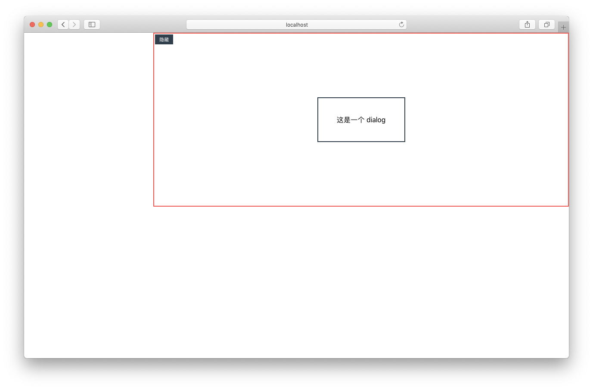

# React Portals

## 1. 什么是Portals

在 React 中一切皆组件，在开发过程中我们常常遇到模态窗的需求，比如 Dialog 组件。在设计模态窗的时候会把整个 DOM 结构尽量渲染在 HTML 比较靠近顶层的位置（比如 body），这样设计样式的自由度相对来讲会比较高，而且一般操作模态窗的 DOM 跟模态窗会是不同的层级，这样就会在不同层级的 DOM 之间建立起连接（可以认为是两个不同层级的 DOM 之间形成了对接），这就是**Portals（传送门）**。


React 官方对 Portals 的定义：

Portal 提供了一种将子节点渲染到存在于父组件以外的 DOM 节点的优秀的方案

Portals 是React 16提供的官方解决方案，使得组件可以脱离父组件层级挂载在DOM树的任何位置。通俗来讲，就是我们 render 一个组件，但这个组件的 DOM 结构并不在本组件内。


一般情况下，组件的render函数返回的元素会被挂载在它的父级组件上：

```jsx
import DemoComponent from './DemoComponent';
render() {
  // DemoComponent元素会被挂载在id为parent的div的元素上
  return (
    <div id="parent">
        <DemoComponent />
    </div>
  );
}
```

然而，有些元素需要被挂载在更高层级的位置。最典型的应用场景：当父组件具有`overflow: hidden`或者`z-index`的样式设置时，组件有可能被其他元素遮挡，这时就可以考虑要不要使用Portal使组件的挂载脱离父组件。例如：对话框，模态窗。

```jsx
import DemoComponent from './DemoComponent';
render() {
  // react会将DemoComponent组件直接挂载在真真实实的 dom 节点 domNode 上，生命周期还和16版本之前相同。
  return ReactDOM.createPortal(
    <DemoComponent />,
    domNode,
  );
}
```

## 2. Portals 基本使用

Portals语法如下：

```jsx
ReactDOM.createPortal(child, container);
```

- 第一个参数 child 是可渲染的 React 子项，比如元素，字符串或者片段等;
- 第二个参数 container 是一个 DOM 元素。


文字描述可能有些抽象，来看一个例子：


首先，定义一个 Dialog 组件，用来表示一个弹窗：

```jsx
function Dialog() {
  return (
       <>
        <div className="dialog">
          这是一个 dialog
        </div>
      </>
  )
}
```

在代码中使用这个 Dialog 组件：

```jsx
class App extends React.Component {
  constructor(props) {
    super(props)
    this.state = { visible: false }
  }
  handleClick = () => {
    this.setState({ visible: !this.state.visible })
  }
  render() {
    return (
      <div className="container">
        <div className="container-right">
          <button className="container-button" onClick={this.handleClick}>
            { this.state.visible ? '隐藏' : '显示' }
          </button>
          {this.state.visible && <Dialog />}
        </div>
      </div>
    )
  }
}
```

CSS 代码：

```css
.container-right {
  position: relative;
  height: 400px;
  margin-left: 300px;
  border: 2px solid #f44;
}
.container-button {
  border: none;
  outline: none;
  background-color: #2f3f4f;
  color: #fff;
  padding: 5px 10px;
  cursor: pointer;
}
.dialog {
  position: absolute;
  top: 50%;
  left: 50%;
  width: 200px;
  height: 100px;
  line-height: 100px;
  text-align: center;
  transform: translate(-50%, -50%); // 水平垂直居中
  border: 2px solid #2f3f4f;
}
```

当点击“显示”按钮时，会看到 dialog 出现在红色框的中间：



这是可以理解的，因为在 Dialog 的外层设置了 `position: relative` ，所以 Dialog 就相对于父级元素来定位了。但是这样会出现l问题，因为我们期望的是 Dialog 根据根元素定位在中间。当然可以用 `position: fixed` 可以快速解决问题，但是 Dialog 的 DOM 还是在此组件内，如果想把 DOM 元素也放到根元素中去，就需要借助 Portals，下面使用Portals对上面的代码进行改写。


这里，只用改写 Dialog 组件：

```jsx
import { createPortal } from 'react-dom'
/* 定义传送门显示端的 DOM 元素 */
const createDiv = () => {
    const divElement = document.createElement('div')
    document.body.appendChild(divElement)
    return divElement
}
class Dialog extends React.Component {
  constructor(props) {
    super(props)
    this.state = { visible: false }
    
    // 定义传送门显示端的 DOM 元素 
    this.node = createDiv()
  }
  componentWillUnmount() {
    document.body.removeChild(this.node)
  }
  render () {
    return createPortal(
      <>
        <div className="dialog">
          这是一个 dialog
        </div>
      </>,  // 放入传送门的 JSX
      this.node // 传送至另一端的 DOM node
    )
  }
}
```

在构造函数中定义了传送门显示端的 DOM 元素，用来接收传送过来的 DOM ，接着在 `render` 函数的 `return` 中使用了 `createPortal` 函数，并开启了传送门，将 Dialog 放入了 `this.node` 中，最后注意在组件卸载时，清空掉 `this.node` 。


看下经过传送门处理的效果，Dialog 已经脱离了父级元素，定位到了 body 元素的中间：


再看下 DOM 结构，结构从原来的元素中跑了出来，跑到了我们定义的 DOM 元素中去：


## 3. React 16 之前的实现方式

在 React 16 之前，需要使用 `unstable_renderSubtreeIntoContainer` 和 `unmountComponentAtNode` 来实现传送门效果：

```jsx
import { unstable_renderSubtreeIntoContainer, unmountComponentAtNode } from 'react-dom'
class Dialog extends React.Component {
  constructor(props) {
    super(props)
    this.state = { visible: false }
    const doc = window.document
    this.node = doc.createElement('div')
    doc.body.appendChild(this.node)
  }
  componentDidMount() {
    const doc = window.document
    this.node = doc.createElement('div')
    doc.body.appendChild(this.node)
    this.renderPortal()
  }
  renderPortal() {
    unstable_renderSubtreeIntoContainer(
      this, //代表当前组件
      <>
        <div className="dialog">
          这是一个 dialog
        </div>
      </>, // 放入传送门的 JSX
      this.node // 传送至另一端的 DOM node
    )
  }
  componentWillUnmount() {
    unmountComponentAtNode(this.node);
    window.document.body.removeChild(this.node);
  }
  render() {
    return null
  }
}
```

由上面代码可以看出，通过自定义的 `renderPortal` 函数来返回 JSX , 并且将 `render` 函数中返回了 `null` 。并在 `componentWillUnmount` 函数中调用 `unmountComponentAtNode` 解除传送门资源泄露的副作用。运行代码后，可以看到和前面相同的页面效果。


**React 16 前后对比：**

- React 16 中，直接使用 `createPortal` 就能快速的实现 Protal 效果，而 React 16 之前的版本需要使用 `unstable_renderSubtreeIntoContainer` 和 `unmountComponentAtNode` ，实现方案上，React 16 更简洁。
- React 16 中，通过 Portal 渲染出去的 DOM，事件是会冒泡从传送门的入口端传过来。React 16 之前的版本，Portal 是单向的，事件冒泡无法穿透传送门。

## 4. 通过 Portal 进行事件冒泡

通过 Portals 渲染的元素在父组件的盒子之外，渲染的 DOM 节点在 React 的元素树上，在那个 DOM 元素上的点击事件仍能在 DOM 树中监听到：

```jsx
class Page extends React.Component {
    constructor(props) {
        super(props);
        this.state = { number: 0 };
        this.handleClick = this.handleClick.bind(this);
    }
    handleClick() {
        this.setState(state => ({
            clicks: state.number + 1
        }));
    }
    render() {
        return (
            <div onClick={this.handleClick}>
                <h3>number: {this.state.number}</h3>
                <Dialog />
            </div>
        );
    }
}
```