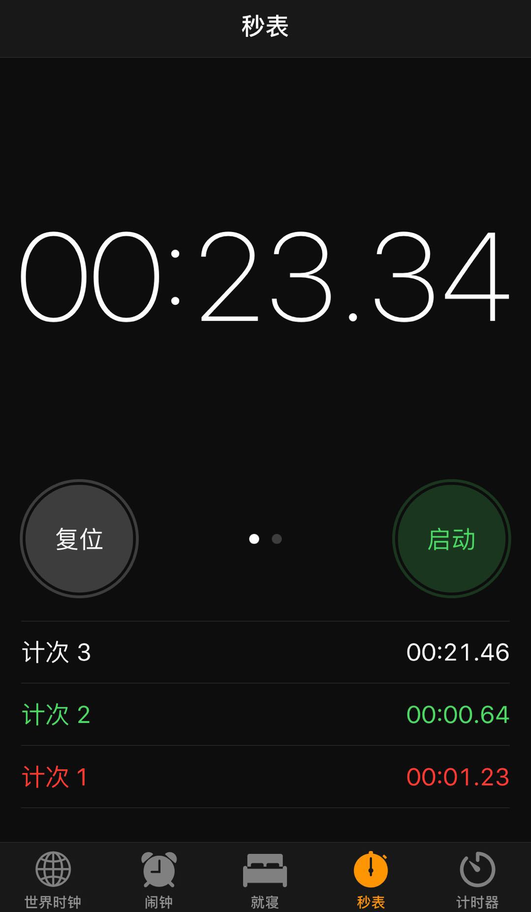
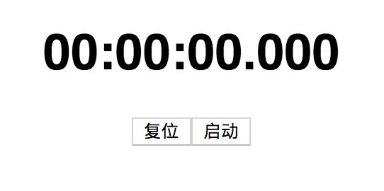
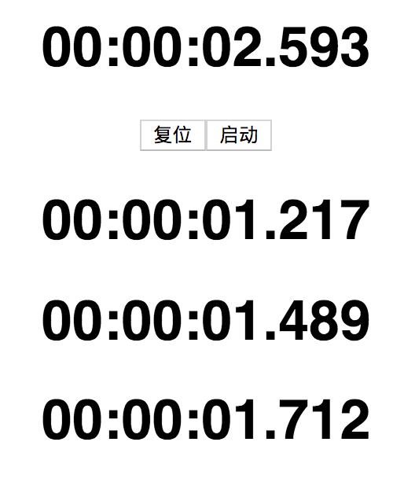
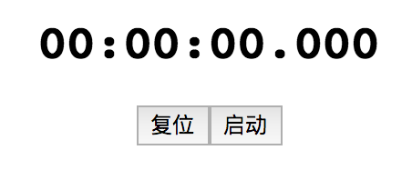
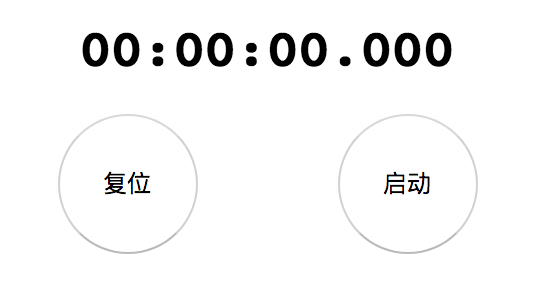
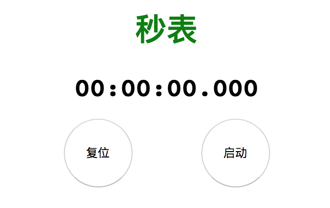
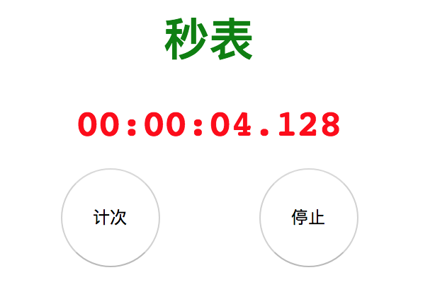

# React 组件实践

## 1. 定义组件接口

React 世界由组件构成，所以，如何设计组件的接口就成了组件设计最重要的事情。

### （1）设计原则

React 的组件其实就就是软件设计中的模块，所以其设计原则也遵从通用的组件设计原则，简单说来，就是要减少组件之间的耦合性（Coupling)，让组件的界面简单，这样才能让整体系统易于理解、易于维护。


在设计 React 组件时，要注意以下原则：

1. 保持接口小，props 数量要少；
2. 根据数据边界来划分组件，充分利用组合（composition）；

1. 把 state 往上层组件提取，让下层组件只需要实现为纯函数。

下面来看实现一个秒表（下图为iPhone上的秒表应用）：



对于这个秒表，按下右侧“启动”按钮，这个按钮就会变成“停止”，同时上面的数字时钟开始计时；按下“停止”按钮，数字时钟停止计时。左侧还有一个按钮，初始状态显示“复位”，点击该铵钮会清空时钟；开始计时之后，这个左侧按钮会变成“计次”，按一下“计次”，秒表底部就会增加一列时间，记录下按下“计次”这一瞬间的时刻。


下面来规划一下秒表的 React 组件接口如何设计。

### （2）组件的划分

下面来实现一个 React 组件渲染整个秒表，这个组件叫 StopWatch，目前看来这个组件不需要从外部获得什么输入，本着“props 数量要少”的原则，也不需要管未来会用上什么 props，目前就当 StopWatch 不支持 props。


此外，这个组件需要记录当前计时，还要记录每一次按下“计次”的时间，所以需要维持状态（state），所以 StopWatch 是一个有状态的组件，不能只是一个纯函数，而是一个继承自 Component 的类。

```javascript
class StopWatch extends React.Component {
  render() {
     //TODO: 返回所有JSX
  }
}
```

在React组件中，随着逻辑的复杂，JSX 代码越来越多，就需要拆分函数中的内容。在 React 中有一个误区，就是把 render 中的代码分拆到多个 renderXXXX 函数中去，比如下面这样：

```javascript
class StopWatch extends React.Component {
  render() {
    const majorClock = this.renderMajorClock();
    const controlButtons = this.renderControlButtons();
    const splitTimes = this.renderSplitTimes();
    
    return (
       <div>
          {majorClock}
          {controlButtons}
          {splitTimes}
       </div>
    );
  }
  
  renderMajorClock() {
     //TODO: 返回数字时钟的JSX
  }
  
  renderControlButtons() {
     //TODO: 返回两个按钮的JSX
  }
  
  renderSplitTimes() {
     //TODO: 返回所有计次时间的JSX
  }
}
```

用上面的方法组织代码，当然比写一个庞大的 render 函数要强，但是这些 renderXXXX 函数访问的是同样的 props 和 state，这样代码依然耦合在了一起。更好的方法是把这些 renderXXXX 重构成各自独立的 React 组件：

```javascript
class StopWatch extends React.Component {
  render() {
    return (
       <div>
          <MajorClock>
          <ControlButtons>
          <SplitTimes>
       </div>
    );
  }
}
const MajorClock = (props) => {
  //TODO: 返回数字时钟的JSX
};
const ControlButtons = (props) => {
  //TODO: 返回两个按钮的JSX
};
  
const SplitTimes = (props) => {
  //TODO: 返回所有计次时间的JSX
}
```

初始化 `MajorClock`、`ControlButtons` 和 `SplitTimes` 这三个组件，目前，并不知道它们是否应该有自己的 state，但是从简单开始，首先假设它们没有自己的 state，定义为函数形式的无状态组件。

### （3）按照数据边界来分割组件

现在，来看一下这样的组件划分是否符合“**按照数据边界划分**”的原则：

- 渲染 `MajorClock`，需要的是当前展示的时间，在点击“启动”按钮之后，这个时间是不断增长的。
- 渲染 `ControlButtons`，两个按钮显示什么内容，完全由当前是否是“启动”的激活状态决定。此外，Buttons 是秒表中唯一有用户输入的组件，对于按钮的按键会改变秒表的状态。

- 计次时间 `SplitTimes`，需要渲染多个时间，可以想象，需要有一个数组来记录所有计次时间。


总结一下所有需要的数据和对应标识符，以及影响的组件：

| **数据** | **标识符**  | **影响的组件**             |
| -------- | ----------- | -------------------------- |
| 当前时间 | timeElapsed | MajorClock                 |
| 是否启动 | activated   | MajorClock, ControlButtons |
| 计次时间 | splits      | SplitTimes                 |

从表格可以看出，每个数据影响的组件都不多，唯一影响两个组件的数据是 activated，这个 activated 基本上就是一个布尔值，数据量很小，影响两个组件问题也不大。这样的组件划分是符合以数据为边界原则的。

### （4）state 的位置

接下来，需要确定 state 的存储位置。当秒表处于启动状态，MajorClock 会不断更新时间，似乎让 MajorClock 来存储时间相关的 state 很合理，但是仔细考虑一下，就会发现这样并不合适。


设想一下，MajorClock 包含一个 state 记录时间，因为 state 是组件的内部状态，只能通过组件自己来更新，所以要 MajorClock 用一个 `setTimeout` 或者 `setInterval` 来持续更新这个 state，可是，另一个组件 ControlButtons 将会决定什么时候暂停 MajorClock 的 state 更新，而且，当用户按下“计次“按钮的时候，MajorClock 还需要一个方法把当前的时间通知给 SplitTimes 组件。这样一个数据传递过程，想一想都觉得很麻烦，明显不合适。


这时候就需要考虑这样的原则，**尽量把数据状态往上层组件提取**。在秒表这个应用中，上层组件就是 StopWatch，如果让 StopWatch 来存储时间状态，就会简单很多。StopWatch 中利用 setTimeout 或者 setInterval 来更新 state，每一次更新会引发一次重新渲染，在重新渲染的时候，直接把当前时间值传递给 MajorClock 就完事了。


至于 ControlButtons 对状态的控制，让 StopWatch 传递函数类型 props 给 ControlButtons，当特定按钮时间点击的时候回调这些函数，StopWatch 就知道何时停止更新或者启动 setTimeout 或者 setInterval，因为这一切逻辑都封装在 StopWatch 中，非常直观自然。


除此之外，还有 SplitTimes，它需要一个数组记录所有计次时间，这些数据也很自然应该放在 StopWatch 中维护，然后通过 props 传递给 SplitTimes，这样 SplitTimes 只单纯做渲染就足够。

### （5）组件 props 的设计

当确定了组件结构和 state 之后，最后要做的就是设计 props。


先来看 MajorClock，因为它依赖的数据只有当前时间，所以只需要一个 props。

```javascript
const MajorClock = ({milliseconds}) => {
  //TODO: 返回数字时钟的JSX
};
MajorClock.propTypes = {
  milliseconds: PropTypes.number.isRequired
};
```

和函数参数的命名一样，props的命名一定力求简洁而且清晰。对于MajorClock，如果把这个props命名为 `time`，很容易引起歧义，这个 time 的单位是什么？是毫秒？还是秒？还是一个 Date 对象？


所以，明确传入的 props 是一个代表毫秒的数字，所以命名为 `milliseconds`。


然后是 ControlButtons，这个组件需要根据当前是否是“启动”状态显示不同的按钮，所以需要一个 props 来表示是否“启动”，把它命名为 `activated`。


此外，StopWatch 还需要传递回调函数给 ControlButtons，所以还需要支持函数类型的 props，分别代表 ControlButtons 可以做的几个动作：

- 启动（start）
- 停止（pause）

- 计次（split）
- 复位（reset）


一般来说，为了让开发者能够一眼认出回调函数类型的 props，这类 props 最好有一个统一的前缀，比如 `on` 或者 `handle` 。所以，ControlButtons 的接口就可以是下面这样：

```javascript
const ControlButtons = (props) => {
  //TODO: 返回两个按钮的JSX
};
ControlButtons.propTypes = {
  activated: PropTypes.bool,
  onStart: PropTypes.func.isRquired,
  onPause: PropTypes.func.isRquired,
  onSplit: PropTypes.func.isRquired,
  onReset: PropTypes.func.isRquired,
};
```

最后是 SplitTimes，它需要接收一个数组类型的 props。PropTypes 也可以支持数组类型的定义：

```javascript
const SplitTimes = (props) => {
  //TODO: 返回所有计次时间的JSX
}
SplitTimes.propTypes = {
  splits: PropTypes.arrayOf(PropTypes.number)
};
```

至此，就完成了秒表的组件接口设计。

## 2. 组件内部实现

下面来具体实现一下秒表应用，目标如下：

- 功能正常；
- 代码整洁；

- 高性能。

### （1）初始化应用框架

使用React提供的 create-react-app 来创建秒表应用。可以使用下面的命令来全局安装：

```javascript
npm install -g create-react-app
```

使用下面的命令来创建应用框架，在这里应用名字叫 `basic_stop_watch`。

```javascript
create-react-app basic_stop_watch --use-npm
```

在完成之后，会创建一个 `basic_stop_watch` 目录，进入这个目录，运行下面给的命令，就可以启动应用：

```javascript
npm start
```

### （2）构建 StopWatch

上面已经确定了要用四个组件组合来实现“秒表”，这四个组件分别是 StopWatch、MajorClock、ControlButtons 和 SplitTimes。


为了达到“代码整洁”的目的，我们让每个组件都有一个独立的文件，然后这个文件用 `export default` 的方式导出单个组件。


比如，在 `src` 目录下为 ControlButtons 创建一个 `ControlButtons.js` 文件，最初内容像下面这样：

```javascript
import React from 'react';
const ControlButtons = () => {
  //TODO: 实现ControlButtons
};
export default ControlButtons;
```

第一行导入 React，因为任何 JSX 都需要 React。最后一行用 `export default` 的方式导出 ControlButtons，这样，在其他组件中就可以用下面的方式导入：

```javascript
import ControlButtons from './ControlButtons';
```

我们知道，ControlButtons 可以接受的 props，其实现代码如下：

```javascript
const ControlButtons = (props) => {
  const {activated, onStart, onPause, onReset, onSplit} = props;
  
  return (
    {activated ? (
      <div>
        <button onClick={onSplit}>计次</button>
        <button onClick={onPause}>停止</button>
      </div>
    ) : (
      <div>
        <button onClick={onReset}>复位</button>
        <button onClick={onStart}>启动</button>
      </div>
    )}
  )
};
```

这里用到了 ES6 中的**解构赋值**（Destructuring Assignment）。因为 ControlButtons 是一个函数类型的组件，所以 props 以参数形式传递进来，props 中的属性包含 `activated` 这样的值，利用大括号，就可以完成对 props 的“解构”，把 props.activated 赋值给同名的变量 `activated`。


可以更进一步地把解构赋值提到参数中，这样连 props 的对象都看不见：

```javascript
const ControlButtons = ({activated, onStart, onPause, onReset, onSplit}) => {
}
```

在 ControlButtons 的实现部分，根据 activated 的值返回不同的 JSX，当 activated 为 `true` 时，返回的是“计次”和“停止”；当 activated 为 `false` 时，返回的是“复位”和“启动”，对应分别使用了传入的 `on` 开头的函数类型 props。


可以看到，ControlButtons 除了显示内容和分配 props，没有做什么实质的工作。


接下来实现 MajorClock 组件，根据传入 props 的 milliseconds 来显示数字时钟一样的时分秒。在 MajorClock.js 文件中，我们这样定义 MajorClock：

```javascript
const MajorClock = ({milliseconds=0}) => {
  return <h1>{ms2Time(milliseconds)}</h1>
};
```

在这里还使用了默认值。如果使用 MajorClock 时没有传入 `milliseconds` 这个 props，那么 `milliseconds` 的值就是 `0`。

因为把毫秒数转为 `HH:mm:ss:mmm` 这样的格式和 JSX 没什么关系，所以，不在组件中直接编写，而是放在 `ms2Time` 函数中，`ms2Time` 就是 `ms-to-Time`，代码如下：

```javascript
import padStart from 'lodash/padStart';
const ms2Time = (milliseconds) => {
  let time = milliseconds;
  const ms = milliseconds % 1000;
  time = (milliseconds - ms) / 1000;
  const seconds = time % 60;
  time = (time - seconds) / 60;
  const minutes = time % 60;
  const hours = (time - minutes) / 60;
  const result = padStart(hours, 2, '0') + ":" + padStart(minutes, 2, '0') + ":" + padStart(seconds, 2, '0') + "." + padStart(ms, 3, '0');
  return result;
}
```

通过逐步从 milliseconds 中抽取毫秒、秒、分、时的信息，最终拼出正确的时间。不过，为了和数字时钟显示一致，需要补齐，比如 2 秒 23 毫秒，显示成 `2:23` 可不好看，不够的位数要补上 0，显示成 `00:00:02:023` 。这个补齐可以使用 `lodash` 中的 `padStart` 实现。为了在项目中使用 `lodash`，需要用 npm 完成对应的库安装。


最后是 SplitTimes 这个组件，在 `SplitTimes.js` 这个文件中，需要这样定义 SplitTimes：

```javascript
import MajorClock from './MajorClock';
const SplitTimes = ({value=[]}) => {
  return value.map((v, k) => (
    <MajorClock key={k} milliseconds={v} />
  ));
};
```

因为根据毫秒数显示数字时钟的功能在 MajorClock 中已经做到了，所以直接导入 MajorClock 使用就好，这符合“重用代码”的原则。


利用循环或者数组 map 而产生的动态数量的 JSX 元件，必须要有 `key` 属性。这个 `key` 属性帮助 React 搞清楚组件的顺序，如果不用 `key`，那 React 会在开发模式下在 console 上输出红色警告。


**注意：**key 不应该取数组的序号，因为 key 要唯一而且稳定，也即是每一次渲染过程中，key 都能唯一标识一个内容。但是，对于 StopWatch 这个例子，可以直接使用数组序号，因为计次时间的数组顺序不会改变，使用数组序号足够唯一标识内容。

### （3）StopWatch 状态管理

在实现了 MajorClock、ControlButtons 和 SplitTimes 之后，我们需要把这些子组件串起来，这就是 StopWatch。

StopWatch 是一个有状态的组件，所以，不能只用一个函数实现，而是做成一个继承自 `React.Component` 的类：

```javascript
class StopWatch extends React.Component {
  render() {
    return (
      <Fragment>
        <MajorClock />
        <ControlButtons />
        <SplitTimes />
      </Fragment>
    );
  }
}
```

对于一个 React 组件类，最少要有一个 `render` 函数实现，不过，上面的 `render` 只是一个大概的代码框架，引用了相关子组件，但是没有传入 props。


传入的 props 就是 StopWatch 记录的 state。StopWatch 的 state 需要有这些信息：

- isStarted，是否开始计时；
- startTime，计时开始时间，Date 对象；

- currentTime，当前时间，也是 Date 对象；
- splits，所有计次时间的数组，每个元素是一个毫秒数。


React 组件的 state 需要初始化，一般来说，初始化 state 是在构造函数中：

  

```javascript
constructor() {
  super(...arguments);
  this.state = {
    isStarted: false,
    startTime: null,
    currentTime: null,
    splits: [],
  };
}
```

 如果定义构造函数 constructor，需要通过 super 调用父类 `React.Component` 的构造函数，不然，功能会不正常。React官方网站上的代码示例是这样调用super函数：

 

```javascript
constructor(props) {
    super(props); //目前可行，但有更好的方法
  }
```

在早期版本中，React.Component 的构造函数参数有两个，第一个是 `props`，第二个是 `context`，如果忽略掉 `context` 参数，那么这个组件的 context 功能就不能正常工作，不过，现在React的行为已经变了，第二个参数传递不传递都能让context正常工作，看起来React.Component 的构造函数只有第一个参数被用到，但是，没准未来还会增加新的参数呢，所以，以不变应万变的方法，就是使用扩展操作符（spread operator）来展开 arguments，这样不管 React 将来怎么变，这样的代码都正确。

  

```javascript
constructor() {
  super(...arguments); //永远正确！
}
```

扩展操作符的作用，在 React 开发中会经常用到，在 JSX 中展开 props 的时候会用到。

### （4）属性初始化方法

其实我可以不写 constructor 函数，而直接使用属性初始化（Property Initializer），也就是在 class 定义中直接初始化类的成员变量。效果是完全一样的：

```javascript
class StopWatch extends React.Component {
  state = {
    isStarted: false,
    startTime: null,
    currentTime: null,
    splits: [],
  }
}
```

接下来实现传递给 ControlButtons 的一系列函数。需要注意，在实际工作中，在 JSX 中应用的函数 props 应该尽量使用类成员函数，不要用内联函数。


以最 `onSplit` 为例，这个函数响应用户点击“计次”按钮的事件，代码如下：

 

```javascript
onSplit() {
  this.setState({
    splits: [...this.state.splits, this.state.currentTime - this.state.startTime]
  });
}
```

在 onSplit 中，利用 `this.setState` 来修改组件的状态。那这个函数执行时，`this` 是什么呢？对于 ES6 的类成员函数，并不自动绑定 `this`，也就是说，onSplit 中的 `this`，可不保证就是当前组件对象。至于 `render` 这些生命周期函数，里面访问的 `this` 就是当前组件本身，完全是因为这些函数是 React 调用的，React 对它们进行了特殊处理，对于其他普通的成员函数，特殊处理就要靠我们自己了。


通常的处理方法，就是在构造函数中对函数进行绑定，然后把新产生的函数覆盖原有的函数，就像这样：

  

```javascript
constructor() {
  super(...arguments);
  this.onSplit = this.onSplit.bind(this);
}
```

StopWatch 需要给 ControlButtons 传递四个函数类型的 props，分别是 `onStart`、`onPause`、`onReset` 和 `onSplit`，对每一个函数都在构造函数里加一个 bind很容易出错。更好的方法依然是使用属性初始化，就和初始化 state 一样，利用等号直接初始化 


StopWatch 需要给 ControlButtons 传递四个函数类型的 props，分别是 `onStart`、`onPause`、`onReset` 和 `onSplit`，对每一个函数都在构造函数里加一个 bind 很容易出错，更好的方法依然是使用属性初始化，就和初始化 state 一样，利用等号直接初始化 onSplit，代码如下：

```javascript
 onSplit = () => {
    this.setState({
      splits: [...this.state.splits, this.state.currentTime - this.state.startTime]
    });
  }
```

这样写，就不需要 constructor，函数体内的 `this` 绝对就是当前组件对象。用同样的方法来实现其他函数成员：

 

```javascript
onStart = () => {
    this.setState({
      isStarted: true,
      startTime: new Date(),
      currentTime: new Date(),
    });
    this.intervalHandle = setInterval(() => {
      this.setState({currentTime: new Date()});
    }, 1000 / 60);
  }
  onPause = () => {
    clearInterval(this.intervalHandle);
    this.setState({
      isStarted: false,
    });
  }
  onReset = () => {
    this.setState({
      startTime: null,
      currentTime: null,
      splits: [],
    });
  }
```

至此，秒表的功能就完成了，在 `App.js` 文件中导入 `StopWatch`，在浏览器中就可以看到这样的界面。



点击“启动”按钮，可以看见数字时钟开始运转；点击“计次”按钮，在按钮下方可以看到点击瞬间的时间；点击“停止”，时钟停止运转。



# 3. 组件化样式

上面只实现了秒表的功能，而没有关注样式。下面就来给 React 组件增加样式，让“秒表”这个应用看起来更美观。

### （1）React 带来的对样式管理革命

在 React 诞生之前，为了修改一个功能，需要牵扯到 HTML、CSS 和 JavaScript 的修改，但是这三部分分别属于不同的文件，一个功能却要去修改至少三个文件。


在软件开发中，同一个功能相关的代码最好放在一个地方，这就是**高内聚性**（High Cohesiveness）。把网页功能分在 HTML、CSS 和 JavaScript 中，明显背离了高内聚性的原则，直到 React 出现。


在实现“秒表”的时候，“内容”和“动态功能”已经混合在一起，换句话说，JSX 负责产生“内容”，和各种响应用户输入的 JavaScript 代码共同存在于 React 组件之中。在 React 中，当修改一个功能的内容和行为时，在一个文件中就能完成，这样就达到了高内聚的要求。


那么，在 React 中又是如何处理样式的呢？下面先从组件的 style 属性开始，最后过渡到组件式的样式。

### （2）style 属性

上面实现的“秒表”中，虽然功能齐备，但是展示上有一个大问题，就是当时钟开始运转之后，因为各个数字的宽度不同，比如`1` 就没有 `0` 宽，导致时间宽度忽大忽小，产生闪烁效果，这样看起来很不专业。为了解决这个问题，就需要定制 MajorClock 的样式。


最简单也是最直接的方法，就是给对应的 React 元素增加 style 属性，属性值为一个普通的 JavaScript 对象：

```javascript
const MajorClock = ({milliseconds=0}) => {
  const style = {
    'font-family': 'monospace'
  };
  return <h1 style={style}>{ms2Time(milliseconds)}</h1>
}
```

在上面的例子中，把 MajorClock 中的 `h1` 元素的 `font-family` 设为 `monospace`,`monospace` 是等宽字体，这样所有数字所占宽度相同，数字变化起来的时候宽度也就不会发生变化了，效果图如下：





如果 style 对象每次都是一样的，最好把它提取到组件之外，这样就可以重用一个对象：


```javascript
const clockStyle = {
  'font-family': 'monospace'
};

const MajorClock = ({milliseconds=0}) => {
  return <h1 style={clockStyle}>{ms2Time(milliseconds)}</h1>
}
```


### （3）导入 CSS 文件

React 也支持使用 CSS 来定制样式。下面以 ControlButtons 为例，改进控制按钮的样式。


为了配合 CSS，需要在 ControlButtons 的 JSX 中让渲染出来的 DOM 元素包含 class。

```javascript
const ControlButtons = ({activated, onStart, onPause, onReset, onSplit}) => {
  return (
    {activated ? (
      <div>
        <button className="left-btn" onClick={onSplit}>计次</button>
        <button className="right-btn" onClick={onPause}>停止</button>
      </div>
    ) : (
      <div>
        <button className="left-btn" onClick={onReset}>复位</button>
        <button className="right-btn" onClick={onStart}>启动</button>
      </div>
    )}
  )
};
```

在 `ControlButtons.js` 中增加下面这样，导入一个同目录下的 `ControlButtons.css` 文件：

```javascript
import "./ControlButtons.css";
```

create-react-app 会用 webpack 完成打包过程，只要 JavaScript 文件中应用的资源，都会被打包进最终的文件，所以，`ControlButtons.css` 中的样式规则就会被应用。`ControlButtons.css` 中的内容如下:

```javascript
.left-btn, .right-btn {
  border-radius: 50%;
  width: 70px;
  height: 70px;
}

.left-btn {
  margin: 0 35px 0 0;
}

.right-btn {
  margin: 0 0 0 35px;
}
```

最终的效果图如下：



#### （4）组件式的样式

对比使用 style 属性和导入 CSS 两种方法，可以看出各有优缺点。


使用 style 属性，好处是可以将样式应用到每个元素，互相不干扰；缺点就是非常不简洁，如果想要定制一个元素的样式，必须给这个元素加 style 属性。


比如，我们想让 MajorClock 中的 `h1` 元素字体为 `monospace`，使用 style 属性来实现，就要给 `h1` 加上 style，如果只有一个 `h1` 元素还好应付，如果很多 `h1` 元素，就非常麻烦：

```javascript
const style={
  'font-family': 'monospace'
};

  <h1 style={style}>...</h1>
```

相反，用 CSS 表达复杂的样式规则很容易，比如，上一段提到的样式，用 CSS 轻松可以实现，而且不用给每个 `h1` 加什么 style 属性。

```javascript
h1 {
  font-family: monospace;
}
```


不过，CSS 也有它的缺点，CSS 定义的样式是全局的，这样很容易失控，比如上面的 CSS 规则，一旦导入，那么所有的 `h1` 都具备这样的样式，即使不在 MajorClock 中的`h1` 元素，一样被 MajorClock 导入的 CSS 文件影响。


对于不同模块之间 CSS 互相干扰的问题，有很多种解决方法，基本原则就是给 CSS 规则增加更加特定的限制。比如，要限定上面的 CSS 规则只作用于 MajorClock 中的 `h1` 元素，就要这样来写一个 `MajorClock.css`：

```javascript
.clock h1 {
  font-family: monospace;
}
```

但是，也需要修改 MajorClock 的 JSX，让 `h1` 包含在一个类名为 `clock` 的元素中。

```javascript
import "./MajorClock.css";

const MajorClock = ({milliseconds=0}) => {
  return (
    <div class="clock">
     <h1 style={clockStyle}>{ms2Time(milliseconds)}</h1>
    </div>
  );
}
```

这样当然可行，但是这样不好处理 JSX 和 CSS 之间的关系，而且违背高内聚的原则。当需要修改一个组件时，要被迫去分别修改 JavaScript 文件 和 CSS 文件，明显不是最优的方法。


在 React 的世界中，一切都是组件，所以很自然诞生了组件化的样式(Component Style）。组件化样式的实现方式很多，下面来看一下最容易理解的库：`styled-jsx`。


**1）添加 styled-jsx 支持**

要使用 styled-jsx，必须要修改 webpack 配置，一般来说，对于用 create-react-app 创建的应用，需要用 `eject` 方法来“弹射”出配置文件，只是，`eject` 指令是不可逆的，不到万不得已，我们还是不要轻易“弹射”。一个更简单的方式，是使用 `react-app-rewired`，不需要 `eject`，就能够修改 create-react-app 产生应用的配置方法。


首先，在项目中安装 react-app-rewired 和 styled-jsx：

```javascript
npm install react-app-rewired styled-jsx
```

打开 `package.json` 文件，找到 `scripts` 这个部分，应该是下面这样：

```javascript
   "scripts": {
     "start": "react-scripts start",
     "build": "react-scripts build",
     "test": "react-scripts test --env=jsdom",
     "eject": "react-scripts eject"
   }
```

当执行 `npm start` 时，执行的就是 `scripts` 部分定义的指令，可以看到都是执行 `react-scripts`。在这里还可以看到 `eject` 指令的定义，做这个修改就是为避免使用 `eject`。


修改 `scripts` 部分的代码如下:

```javascript
   "scripts": {
    "start": "react-app-rewired start",
    "build": "react-app-rewired build",
    "test": "react-app-rewired test --env=jsdom",
    "eject": "react-scripts eject"
```

修改的方法就是把 `start`、`build` 和 `test` 对应脚本中的 `react-scripts` 替换为 `react-app-rewired`，之后，当用 npm 执行这些指令的时候，就会使用 react-app-rewired。


react-app-rewired 扩展了 react-scripts 的功能，可以从当前目录的 `config-overrides.js` 文件中读取配置，扩充 react-scripts 的功能。


需要让 react-scripts 支持 styled-jsx，对应只需要在项目根目录增加一个 `config-overrides.js` 文件，内容如下：

```javascript
const { injectBabelPlugin } = require('react-app-rewired');

module.exports = function override(config, env) {
  config = injectBabelPlugin(['styled-jsx/babel'], config);

  return config;
};
```

上面 config-overrides.js 文件就是把 `styled-jsx/babel` 注入到 react-scripts 的基本配置中去，然后应用就支持 styled-jsx 了。


**2）使用 styled-jsx 定制样式**

有了 styled-jsx 中，就可以在 JSX 中用 `style jsx` 标签直接添加 CSS 规则。比如，给 MajorClock 中的 `h1` 增加 CSS 规则，可以这样使用：

```javascript
const MajorClock = ({milliseconds=0}) => {
  return (
    <React.Fragment>
      <style jsx>{`
        h1 {
          font-family: monospace;
        }
      `}</style>
      <h1>
        {ms2Time(milliseconds)}
      </h1>
    </React.Fragment>
  );
};
```

注意紧贴 style jsx 内部的是一对大括号，大括号代表里面是一段 JavaScript 的表达式，再往里，是一对符号，代表中间是一段多行的字符串，也就是说，style jsx 包裹的是一个字符串表达式，而这个字符串就是 CSS 规则。


在 MajorClock 中用 style jsx 添加的 CSS 规则，只作用于 MajorClock 的 JSX 中出现的元素，不会影响其他的组件。


在 StopWatch 中添加一个 `h1` 元素，内容就是“秒表”，然后用 `style jsx` 把 `h1` 的颜色设为绿色：

```javascript
  render() {
    return (
      <Fragment>
        <style jsx>{`
          h1 {
            color: green;
          }
        `}</style>
        <h1>秒表</h1>
        <MajorClock
          milliseconds={this.state.currentTime - this.state.startTime}
          activated={this.state.isStarted}
        />
   ...
```

可以看到，StopWatch 中的 `h1` 字体不是 monospace，MajorClock 中的 color 也不是绿色：



可见，styled jsx 中虽然使用了 CSS，但是这些 CSS 规则只作用于所在组件中的样式，甚至不会影响子组件的样式。这样既可以使用 CSS 的语法，又可以把 CSS 的作用域限定在一个组件之内，达到了高内聚的要求。


**3）动态 styled jsx**

我们还可以动态修改 styled jsx 中的值，因为 styled jsx 的内容就是字符串，只要修改其中的字符串，就修改了样式效果。


比如，让 MajorClock 在开始计时状态显示红色，否则显示黑色，修改代码如下：

```javascript
const MajorClock = ({milliseconds=0, activated=false}) => {
  return (
    <React.Fragment>
      <style jsx>{`
        h1 {
          color: ${activated? 'red' : 'black'};
          font-family: monospace;
        }
      `}</style>
      <h1>
        {ms2Time(milliseconds)}
      </h1>
    </React.Fragment>
  );
};
```

在 style jsx 中，`color` 后面的值不是固定的，利用 ES6 的字符串模板功能，可以根据 activated 的值动态决定是 red 还是 black：

